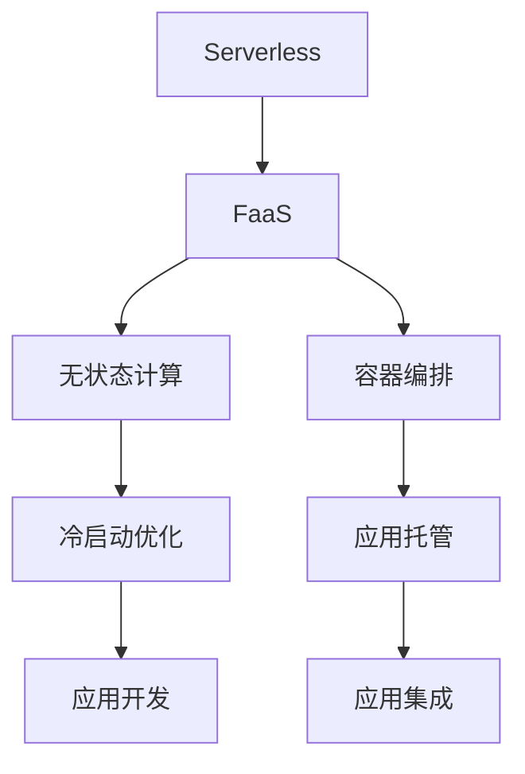

                 

# Serverless架构：无服务器计算的实践

> 关键词：Serverless, 无服务器计算, 函数即服务(FaaS), 无状态计算, 容器编排, 冷启动优化, 应用托管, 应用开发, 应用集成

## 1. 背景介绍

### 1.1 问题由来

随着云计算和微服务的不断发展，传统的IaaS（基础设施即服务）和PaaS（平台即服务）已无法满足日益增长的业务需求。云服务提供商推出的Serverless架构（无服务器计算），通过将计算资源和应用逻辑解耦，按需扩展，帮助开发者更快地构建和部署应用程序。Serverless架构的出现，给现代应用开发带来了革命性的变化。

### 1.2 问题核心关键点

Serverless架构的核心在于“函数即服务”（FaaS）。开发者无需关注底层计算资源的管理和调度，只需编写具体的业务逻辑代码，即可以函数的形式上传至云平台，平台自动完成资源的按需扩展和回收。Serverless架构具有以下优势：

1. **自动扩展**：根据业务需求动态调整计算资源，无需手动配置。
2. **按需付费**：计算资源的使用只按实际调用次数收费，无需提前购买。
3. **快速部署**：无须自行搭建和维护环境，大大缩短开发周期。
4. **弹性伸缩**：能根据业务流量自动伸缩，确保系统高可用性。

Serverless架构的发展，源于云计算平台的技术演进和市场需求的变化。AWS、Google Cloud、Azure等云服务提供商纷纷推出Serverless服务，如AWS Lambda、Google Cloud Functions、Azure Functions等，引领了Serverless架构的行业应用。

### 1.3 问题研究意义

研究Serverless架构的实践意义重大：

1. **降低开发成本**：通过云平台自动扩展和按需付费，减少了基础设施建设和管理成本。
2. **提高开发效率**：Serverless允许开发者快速迭代和发布功能，加快产品上市速度。
3. **提升系统弹性**：自动化的资源管理和弹性伸缩，提升了系统的稳定性和可扩展性。
4. **优化资源利用**：按需使用计算资源，避免资源浪费，提升资源利用率。
5. **促进技术创新**：Serverless催生了诸多新型的应用模式和开发范式，促进了技术创新和产业发展。

## 2. 核心概念与联系

### 2.1 核心概念概述

为更好地理解Serverless架构的实践，本节将介绍几个密切相关的核心概念：

- **Serverless**：一种云服务模式，即应用无须直接部署和运行在云平台上，而是通过函数的形式运行，按需调用。
- **函数即服务（FaaS）**：一种云服务，开发者只需编写业务逻辑函数，无需关注计算资源的管理和扩展。
- **无状态计算**：Serverless函数通常是无状态的，每次调用时都从状态冷启动。
- **容器编排**：通过Docker等容器技术，将函数代码打包成容器，自动管理和调度资源。
- **冷启动优化**：优化函数启动时间，提高系统响应速度。
- **应用托管**：将应用代码托管到云平台，自动完成环境的构建、监控和维护。
- **应用开发**：Serverless简化了应用开发过程，支持从零到一的快速构建。
- **应用集成**：将Serverless函数与其他云服务（如数据库、消息队列等）集成，构建完整的微服务架构。

这些核心概念之间的逻辑关系可以通过以下Mermaid流程图来展示：



这个流程图展示了他的核心概念及其之间的关系：

1. Serverless架构依赖于函数即服务，无须手动管理资源。
2. 函数即服务通过无状态计算和容器编排技术，实现资源的灵活扩展和高效管理。
3. 无状态计算和冷启动优化提升了函数的响应速度。
4. 应用托管和应用开发简化了应用构建过程。
5. 应用集成将Serverless函数与其他云服务结合，构建完整的微服务体系。

## 3. 核心算法原理 & 具体操作步骤
### 3.1 算法原理概述

Serverless架构的核心在于将计算资源和应用逻辑解耦，通过函数即服务的形式，按需扩展和回收计算资源，实现应用的自动化、弹性化和低成本化。

Serverless函数的运行过程通常包括以下几个关键步骤：

1. **代码上传**：开发者将业务逻辑代码上传至云平台，编译成可执行的函数。
2. **事件触发**：函数通过HTTP请求、定时任务、消息队列等事件触发器触发执行。
3. **按需扩展**：平台根据请求流量自动扩展计算资源，分配给函数执行。
4. **资源回收**：执行完毕后，平台自动回收计算资源，无需手动关闭。
5. **结果返回**：函数执行结果返回至调用者，完成请求处理。

### 3.2 算法步骤详解

Serverless架构的实际运行步骤如下：

**Step 1: 创建函数代码**

- 编写函数代码，使用支持Serverless的语言和框架，如Python、Node.js等。
- 打包代码和依赖，生成可部署的函数包。

**Step 2: 配置函数参数**

- 定义函数的名称、内存大小、执行超时时间等参数。
- 配置函数触发的来源，如HTTP请求、定时任务、消息队列等。

**Step 3: 上传函数至平台**

- 使用云平台的API或控制台，上传函数代码和参数。
- 等待平台部署和测试完成，获取函数执行的URL。

**Step 4: 触发函数执行**

- 通过URL调用函数，触发事件触发器。
- 等待函数执行完毕，获取返回结果。

**Step 5: 监控和优化**

- 使用云平台的监控工具，查看函数执行情况和资源使用情况。
- 根据监控结果，优化函数逻辑和参数，提高执行效率。

### 3.3 算法优缺点

Serverless架构具有以下优点：

1. **简化开发**：无需手动管理资源，简化开发流程，提高开发效率。
2. **降低成本**：按需使用资源，避免资源浪费，降低基础设施成本。
3. **弹性伸缩**：根据业务需求自动扩展，提升系统可用性。
4. **提升响应速度**：无状态计算和冷启动优化，提高系统响应速度。

但Serverless架构也存在一些缺点：

1. **冷启动延迟**：函数无状态计算和冷启动特性，可能导致响应延迟。
2. **调用限制**：函数执行时间限制，可能导致性能瓶颈。
3. **依赖管理**：依赖管理复杂，需注意版本兼容性。
4. **监控成本**：监控和管理成本较高，需要持续投入。

### 3.4 算法应用领域

Serverless架构已经在众多领域得到广泛应用，以下是几个典型的应用场景：

1. **API服务**：构建高性能的API服务，支持大规模并发请求，如AWS API Gateway、Azure API Management等。
2. **微服务架构**：通过函数的形式实现微服务之间的通信和集成，提升系统的可扩展性和维护性。
3. **定时任务**：执行定时任务，如数据同步、备份等，支持定时的调度和管理。
4. **事件驱动**：处理各种事件触发，如消息队列、Web钩子等，实现业务流程的自动化。
5. **批处理**：处理大规模数据处理任务，如ETL、机器学习等，提升数据处理效率。
6. **集成服务**：与其他云服务（如数据库、存储等）集成，构建完整的云服务链路。

除了上述场景，Serverless架构还可以应用于各种自动化、分析、监控等任务，极大地拓展了云计算的应用范围。

## 4. 数学模型和公式 & 详细讲解 & 举例说明
### 4.1 数学模型构建

为了更好地理解Serverless架构的数学原理，本节将构建一个简化的数学模型。

假设一个Serverless函数 $f(x)$ 被触发了 $N$ 次，每次执行时间为 $t$。根据函数的触发频率 $R$（次/秒），函数的内存大小 $M$（MB），以及函数的执行次数 $N$，计算函数的成本 $C$。

函数成本 $C$ 的计算公式如下：

$$
C = \left( \sum_{i=1}^{N} t \right) \times \left( \frac{M}{R} \right) + \text{其他成本}
$$

其中，$\sum_{i=1}^{N} t$ 表示函数执行的总时间，$M/R$ 表示单次函数执行的平均内存使用量，其他成本包括网络传输、监控、管理等费用。

### 4.2 公式推导过程

接下来，我们通过公式推导，进一步简化函数成本的计算。

根据公式（1），函数成本 $C$ 可以进一步表示为：

$$
C = N \times t \times \left( \frac{M}{R} \right) + \text{其他成本}
$$

将 $R$ 表示为 $N/R$，带入上式，得：

$$
C = N \times t \times \left( \frac{M}{N/R} \right) + \text{其他成本}
$$

化简上式，得：

$$
C = M \times \left( \frac{t}{R} \right) + \text{其他成本}
$$

因此，函数成本 $C$ 主要取决于函数内存大小 $M$ 和执行时间 $t$，以及函数被触发的频率 $R$。在Serverless架构中，函数内存和执行时间由云平台自动管理，开发者只需关注函数被触发的频率 $R$。

### 4.3 案例分析与讲解

以AWS Lambda为例，分析Serverless函数的实际运行成本。

假设一个Lambda函数被触发了 $N=10^6$ 次，每次执行时间 $t=1$ 秒，内存大小 $M=256$ MB，触发频率 $R=10$ 次/秒。函数成本计算如下：

$$
C = 10^6 \times 1 \times \left( \frac{256}{10} \right) + \text{其他成本}
$$

$$
C = 256 \times 10 + \text{其他成本}
$$

$$
C = 2560 + \text{其他成本}
$$

因此，Lambda函数的成本主要取决于函数的触发频率 $R$，内存大小 $M$，以及函数的执行时间 $t$。在实际应用中，开发者可以根据实际业务需求，调整函数的内存和触发频率，以达到最优的成本和性能。

## 5. 项目实践：代码实例和详细解释说明
### 5.1 开发环境搭建

在进行Serverless函数开发前，我们需要准备好开发环境。以下是使用AWS Lambda进行函数开发的Python环境配置流程：

1. 创建AWS账户：登录AWS官网，创建账号并开通Lambda服务。

2. 安装AWS CLI：从官网下载并安装AWS CLI，用于与Lambda服务进行交互。

3. 配置AWS CLI：通过命令行输入 `aws configure`，设置AWS访问密钥、区域等信息。

4. 安装Python库：使用pip安装Python开发所需的库，如Flask、Gunicorn等。

5. 配置环境变量：在AWS Lambda控制台，配置函数的环境变量，支持函数内部的调用。

完成上述步骤后，即可在AWS Lambda上开始函数开发。

### 5.2 源代码详细实现

下面我以一个简单的HTTP请求处理为例，给出使用AWS Lambda的Python函数实现。

```python
import json
import os
import boto3

def lambda_handler(event, context):
    # 获取环境变量
    api_key = os.environ['API_KEY']
    
    # 解析请求体
    request_body = json.loads(event['body'])
    
    # 验证API密钥
    if request_body['api_key'] != api_key:
        return {
            'statusCode': 401,
            'body': json.dumps({'message': 'Invalid API key'})
        }
    
    # 处理请求
    response_body = {
        'message': 'Hello, AWS Lambda!'
    }
    
    return {
        'statusCode': 200,
        'body': json.dumps(response_body)
    }
```

通过这个示例代码，我们可以看到Lambda函数的核心结构：

- `lambda_handler` 函数是Lambda函数的主要入口，接收事件和上下文信息。
- `event` 包含触发函数的事件信息，如HTTP请求体、定时任务触发时间等。
- `context` 包含函数的运行上下文信息，如函数执行时间、内存大小等。
- 函数体中，通过 `os.environ` 获取环境变量，验证API密钥，处理请求，并返回响应结果。

### 5.3 代码解读与分析

让我们再详细解读一下关键代码的实现细节：

- `os.environ['API_KEY']`：通过环境变量获取API密钥，验证请求合法性。
- `json.loads(event['body'])`：将HTTP请求体解析为JSON格式，便于处理。
- `return {'statusCode': 200, 'body': json.dumps(response_body)}`：设置HTTP响应状态码和响应体，返回至调用者。

这个示例代码展示了Lambda函数的实际使用流程：

1. 通过环境变量获取API密钥，验证请求合法性。
2. 解析HTTP请求体，获取请求数据。
3. 处理请求，生成响应数据。
4. 设置HTTP响应状态码和响应体，返回至调用者。

## 6. 实际应用场景
### 6.1 API服务

AWS Lambda和Google Cloud Functions可以与API Gateway集成，构建高性能的API服务。传统API服务依赖于服务器和负载均衡，资源管理和扩展复杂，而Serverless架构通过函数即服务的形式，能够快速构建和扩展API服务，支持大规模并发请求。

### 6.2 微服务架构

Serverless函数可以通过HTTP请求、定时任务、消息队列等事件触发器，实现微服务之间的通信和集成。开发者只需编写微服务的业务逻辑函数，无需关注底层基础设施的管理和扩展，大大简化了微服务架构的开发和维护。

### 6.3 定时任务

Serverless函数通过定时任务触发器，可以执行各种自动化任务，如数据同步、备份等。支持按需扩展和自动回收计算资源，无需手动管理和监控。

### 6.4 事件驱动

Serverless函数可以处理各种事件触发，如消息队列、Web钩子等。通过与云平台的其他服务集成，可以实现业务流程的自动化和灵活扩展。

### 6.5 批处理

Serverless函数通过批处理触发器，可以处理大规模数据处理任务，如ETL、机器学习等。支持自动扩展和按需计算，提升了数据处理效率和系统弹性。

### 6.6 集成服务

Serverless函数可以与其他云服务（如数据库、存储等）集成，构建完整的云服务链路。通过函数的形式，实现业务逻辑的自动化和弹性扩展。

除了上述场景，Serverless架构还可以应用于各种自动化、分析、监控等任务，极大地拓展了云计算的应用范围。

## 7. 工具和资源推荐
### 7.1 学习资源推荐

为了帮助开发者系统掌握Serverless架构的理论基础和实践技巧，这里推荐一些优质的学习资源：

1. AWS Lambda官方文档：详细的AWS Lambda文档，提供了API、SDK、代码示例等资源，是入门和进阶的必备资料。
2. Google Cloud Functions官方文档：Google Cloud Functions的官方文档，提供了丰富的函数编写和部署示例。
3. Serverless框架：一个通用的Serverless框架，支持多种云服务，提供了简单易用的函数编写和部署工具。
4. 《Serverless架构设计模式》：一本介绍Serverless架构设计模式的书籍，涵盖多种经典模式和最佳实践。
5. 《微服务设计模式》：一本介绍微服务架构设计模式的书籍，涵盖微服务架构的多种模式和实践。

通过对这些资源的学习实践，相信你一定能够快速掌握Serverless架构的精髓，并用于解决实际的业务问题。
###  7.2 开发工具推荐

高效的开发离不开优秀的工具支持。以下是几款用于Serverless函数开发的常用工具：

1. AWS CLI：命令行工具，用于与AWS Lambda进行交互。
2. Serverless框架：支持多种云服务，提供了简单易用的函数编写和部署工具。
3. AWS SAM：AWS Serverless Application Model，提供了Serverless应用构建和部署的框架。
4. Google Cloud SDK：Google Cloud平台提供的开发工具，支持Google Cloud Functions的开发和部署。
5. Terraform：开源的云资源管理工具，支持多种云平台，用于自动化云资源的部署和管理。

合理利用这些工具，可以显著提升Serverless函数的开发效率，加快创新迭代的步伐。

### 7.3 相关论文推荐

Serverless架构的发展源于学界的持续研究。以下是几篇奠基性的相关论文，推荐阅读：

1. "Design and Implementation of AWS Lambda"：介绍AWS Lambda的设计和实现，阐述Serverless架构的基本原理。
2. "Serverless Computing: Concepts, Technology, and Challenges"：系统介绍Serverless架构的概念、技术和挑战，涵盖多种云服务提供商。
3. "Serverless Computing: Model and Cost Analysis"：分析Serverless架构的成本模型，探讨其优势和局限。
4. "Serverless Architecture in Practice"：介绍Serverless架构的实际应用场景和实践经验。
5. "Scalable Serverless Architecture Design Patterns"：介绍Serverless架构的设计模式，提供多种实际应用的案例和实践。

这些论文代表了大语言模型微调技术的发展脉络。通过学习这些前沿成果，可以帮助研究者把握学科前进方向，激发更多的创新灵感。

## 8. 总结：未来发展趋势与挑战
### 8.1 总结

本文对Serverless架构的实践进行了全面系统的介绍。首先阐述了Serverless架构的背景和意义，明确了Serverless架构在简化开发、降低成本、提升弹性等方面的优势。其次，从原理到实践，详细讲解了Serverless函数的运行过程，给出了函数开发和调用的代码实例。同时，本文还探讨了Serverless函数在API服务、微服务架构、定时任务、事件驱动、批处理和集成服务等多个应用场景中的实践应用。最后，本文精选了Serverless架构的学习资源、开发工具和相关论文，力求为读者提供全方位的技术指引。

通过本文的系统梳理，可以看到，Serverless架构在云计算领域的地位越来越重要，极大地简化了应用开发和运维流程，推动了云计算技术的发展。未来，伴随Serverless架构的持续演进和完善，其应用领域还将进一步扩展，带来更高效、更灵活的云服务体验。

### 8.2 未来发展趋势

展望未来，Serverless架构的发展趋势如下：

1. **云平台集成**：更多云服务提供商推出Serverless服务，如AWS Lambda、Google Cloud Functions、Azure Functions等，支持更多的云平台和语言框架。
2. **函数容器化**：通过Docker等容器技术，将函数代码打包成容器，实现更高效的资源管理和弹性伸缩。
3. **按需付费**：按需使用计算资源，避免资源浪费，降低基础设施成本。
4. **冷启动优化**：优化函数启动时间，提高系统响应速度。
5. **微服务集成**：通过函数的形式实现微服务之间的通信和集成，提升系统的可扩展性和维护性。
6. **多语言支持**：支持多种编程语言和框架，提高开发者的开发效率和应用灵活性。

以上趋势凸显了Serverless架构的广阔前景。这些方向的探索发展，必将进一步提升Serverless函数的应用范围，为云计算领域带来更多创新和突破。

### 8.3 面临的挑战

尽管Serverless架构已经取得了瞩目成就，但在迈向更加智能化、普适化应用的过程中，它仍面临着诸多挑战：

1. **冷启动延迟**：函数无状态计算和冷启动特性，可能导致响应延迟。
2. **调用限制**：函数执行时间限制，可能导致性能瓶颈。
3. **依赖管理**：依赖管理复杂，需注意版本兼容性。
4. **监控成本**：监控和管理成本较高，需要持续投入。
5. **安全性**：函数代码的访问控制和管理，需注意安全性和隐私保护。
6. **兼容性**：不同云平台之间的兼容性问题，需注意跨平台开发。

这些挑战需要开发者不断优化和完善，才能实现Serverless架构的最佳应用效果。相信随着学界和产业界的共同努力，这些挑战终将一一被克服，Serverless架构必将在构建高效、灵活、低成本的云服务中发挥更大的作用。

### 8.4 研究展望

未来在Serverless架构的研究方向上，我们期待以下突破：

1. **函数容器化**：通过Docker等容器技术，将函数代码打包成容器，实现更高效的资源管理和弹性伸缩。
2. **冷启动优化**：优化函数启动时间，提高系统响应速度。
3. **微服务集成**：通过函数的形式实现微服务之间的通信和集成，提升系统的可扩展性和维护性。
4. **多语言支持**：支持多种编程语言和框架，提高开发者的开发效率和应用灵活性。
5. **自动扩展**：通过自动扩展和按需计算，提升系统的弹性。
6. **按需付费**：按需使用计算资源，避免资源浪费，降低基础设施成本。

这些研究方向将进一步拓展Serverless架构的应用范围，提升系统性能和可用性，为云计算技术带来更多创新和突破。

## 9. 附录：常见问题与解答

**Q1：Serverless架构是否适用于所有云平台？**

A: 目前主流云平台（AWS、Google Cloud、Azure等）都支持Serverless架构，但不同平台的实现细节和技术栈有所不同。开发者需要根据实际需求和平台特点，选择合适的Serverless服务。

**Q2：Serverless函数如何实现状态管理？**

A: Serverless函数通常是无状态的，每次调用时都从状态冷启动。如果需要状态管理，可以通过外部数据库、缓存、消息队列等方式，将状态保存在系统外部。

**Q3：Serverless函数的部署和维护成本如何？**

A: Serverless函数的部署和维护成本相对较低，但需注意监控和管理成本。通过云平台提供的监控和管理工具，可以实时监控函数的执行情况和资源使用情况，及时发现和解决问题。

**Q4：Serverless函数如何应对大规模数据处理？**

A: Serverless函数通过批处理触发器，可以处理大规模数据处理任务，如ETL、机器学习等。通过按需扩展和自动回收计算资源，提升数据处理效率和系统弹性。

**Q5：Serverless函数在低延迟场景中的表现如何？**

A: Serverless函数的冷启动特性可能导致响应延迟。为了应对低延迟场景，可以通过缓存、预加载等方式，优化函数启动时间和性能。

这些问答内容展示了Serverless架构在实际应用中的常见问题和解决方案，希望开发者能从中获得启发和帮助。

---

作者：禅与计算机程序设计艺术 / Zen and the Art of Computer Programming

