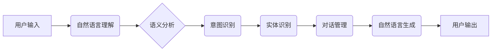

> LUI, 交互范式, 人机交互, 自然语言处理, 深度学习, 虚拟现实, 增强现实, 元宇宙

## 1. 背景介绍

随着人工智能技术的飞速发展，人机交互方式正在经历一场深刻的变革。传统的图形用户界面 (GUI) 和命令行界面 (CLI) 已经无法满足人们日益增长的交互需求。新的交互范式应运而生，其中 LUI (Linguistic User Interface，语言用户界面) 作为一种基于自然语言的交互方式，展现出巨大的潜力。

LUI 旨在通过理解和响应用户的自然语言指令，提供更加直观、便捷、人性化的交互体验。它打破了传统界面中固定的按钮、菜单和文本框的限制，允许用户以更加自然的方式与计算机进行交流。

## 2. 核心概念与联系

LUI 的核心概念是将自然语言理解 (NLU) 和自然语言生成 (NLG) 技术与用户界面设计相结合。

**NLU** 负责理解用户的自然语言输入，将其转换为计算机可理解的指令或数据。

**NLG** 则负责将计算机处理后的结果转换为自然语言输出，以供用户理解。

LUI 的架构通常包括以下几个关键模块：



**核心概念原理和架构的 Mermaid 流程图**

## 3. 核心算法原理 & 具体操作步骤

### 3.1  算法原理概述

LUI 的核心算法主要包括：

* **词嵌入:** 将单词映射到低维向量空间，捕捉单词之间的语义关系。
* **序列标注:** 用于实体识别和意图识别，预测每个单词的标签。
* **循环神经网络 (RNN):** 用于处理序列数据，例如自然语言文本，捕捉文本中的上下文信息。
* **Transformer:** 一种新型的深度学习模型，能够更有效地处理长序列数据，并具有更好的性能。

### 3.2  算法步骤详解

1. **预处理:** 对用户输入进行预处理，例如分词、去停用词、词形还原等。
2. **词嵌入:** 将预处理后的单词映射到词嵌入空间。
3. **序列标注:** 使用序列标注模型识别实体和意图。
4. **对话管理:** 根据识别出的意图和实体，选择合适的响应策略。
5. **自然语言生成:** 使用 NLG 模型生成自然语言响应。

### 3.3  算法优缺点

**优点:**

* 更自然、更直观的交互体验。
* 能够理解更复杂的指令和语义。
* 能够适应不同的用户群体和场景。

**缺点:**

* 算法复杂度高，需要大量的训练数据。
* 理解歧义性和上下文信息的能力有限。
* 响应速度可能较慢。

### 3.4  算法应用领域

LUI 具有广泛的应用领域，例如：

* **智能客服:** 提供更加人性化的客户服务体验。
* **语音助手:** 理解用户的语音指令，执行相应的操作。
* **教育领域:** 提供个性化的学习体验。
* **医疗领域:** 辅助医生诊断和治疗。

## 4. 数学模型和公式 & 详细讲解 & 举例说明

### 4.1  数学模型构建

LUI 的核心算法通常基于深度学习模型，例如 Transformer。Transformer 模型使用注意力机制来捕捉文本中的上下文信息，并通过多层编码器-解码器结构进行训练。

### 4.2  公式推导过程

Transformer 模型的注意力机制使用以下公式计算每个单词的注意力权重：

$$
\text{Attention}(Q, K, V) = \text{softmax}\left(\frac{QK^T}{\sqrt{d_k}}\right)V
$$

其中：

* $Q$ 是查询矩阵。
* $K$ 是键矩阵。
* $V$ 是值矩阵。
* $d_k$ 是键向量的维度。

### 4.3  案例分析与讲解

例如，在理解用户输入 "今天天气怎么样" 时，Transformer 模型会将每个单词映射到词嵌入空间，并使用注意力机制计算每个单词与其他单词之间的关系。通过分析这些关系，模型能够理解用户想要查询今天的天气情况。

## 5. 项目实践：代码实例和详细解释说明

### 5.1  开发环境搭建

LUI 的开发环境通常包括：

* Python 编程语言
* 深度学习框架 (例如 TensorFlow 或 PyTorch)
* 自然语言处理库 (例如 NLTK 或 spaCy)

### 5.2  源代码详细实现

以下是一个简单的 LUI 代码示例，使用 TensorFlow 和 NLTK 库实现一个简单的问答系统：

```python
import tensorflow as tf
import nltk

# 加载预训练的词嵌入模型
embedding_model = tf.keras.layers.Embedding(input_dim=10000, output_dim=128)

# 定义一个简单的问答模型
model = tf.keras.Sequential([
    embedding_model,
    tf.keras.layers.LSTM(128),
    tf.keras.layers.Dense(10, activation='softmax')
])

# 训练模型
# ...

# 用户输入
user_input = "今天天气怎么样"

# 预处理用户输入
processed_input = nltk.word_tokenize(user_input)

# 将用户输入转换为词嵌入向量
input_embeddings = embedding_model(processed_input)

# 使用模型预测答案
prediction = model.predict(input_embeddings)

# 输出答案
print(prediction)
```

### 5.3  代码解读与分析

这段代码首先加载预训练的词嵌入模型，然后定义了一个简单的问答模型。模型使用 LSTM 网络来处理文本序列，并使用 softmax 函数将输出转换为概率分布。最后，代码演示了如何使用模型预测用户输入的答案。

### 5.4  运行结果展示

运行这段代码后，模型会输出一个概率分布，表示模型预测的答案。例如，如果模型预测答案是 "晴天"，则概率分布中 "晴天" 的概率会比较高。

## 6. 实际应用场景

### 6.1  智能客服

LUI 可以用于构建智能客服系统，帮助企业提供更加高效、便捷的客户服务。用户可以通过自然语言与客服机器人进行对话，查询产品信息、解决问题、提交反馈等。

### 6.2  语音助手

LUI 也是语音助手的关键技术。语音助手可以通过理解用户的语音指令，执行相应的操作，例如播放音乐、设置闹钟、发送短信等。

### 6.3  教育领域

LUI 可以用于开发个性化的教育软件，帮助学生更好地理解学习内容。例如，学生可以通过自然语言与虚拟老师进行对话，提问、讨论、练习等。

### 6.4  未来应用展望

随着人工智能技术的不断发展，LUI 的应用场景将会更加广泛。例如，在元宇宙中，LUI 将成为用户与虚拟世界交互的重要方式。

## 7. 工具和资源推荐

### 7.1  学习资源推荐

* **书籍:**
    * 《深度学习》
    * 《自然语言处理》
* **在线课程:**
    * Coursera: 自然语言处理
    * Udacity: 深度学习

### 7.2  开发工具推荐

* **TensorFlow:** 深度学习框架
* **PyTorch:** 深度学习框架
* **NLTK:** 自然语言处理库
* **spaCy:** 自然语言处理库

### 7.3  相关论文推荐

* **Attention Is All You Need:** https://arxiv.org/abs/1706.03762
* **BERT: Pre-training of Deep Bidirectional Transformers for Language Understanding:** https://arxiv.org/abs/1810.04805

## 8. 总结：未来发展趋势与挑战

### 8.1  研究成果总结

LUI 作为一种新型的交互范式，在人工智能领域取得了显著的进展。

### 8.2  未来发展趋势

未来，LUI 将朝着以下方向发展：

* **更准确的自然语言理解:** 提高模型对复杂语义和上下文信息的理解能力。
* **更自然的人机交互:** 更加逼真的虚拟助手和交互体验。
* **更广泛的应用场景:** 在更多领域应用 LUI 技术，例如医疗、教育、金融等。

### 8.3  面临的挑战

LUI 发展还面临一些挑战：

* **数据标注:** 训练高质量的 LUI 模型需要大量的标注数据，这成本较高。
* **模型复杂度:** LUI 模型通常比较复杂，需要强大的计算资源进行训练和推理。
* **伦理问题:** LUI 的发展也需要考虑伦理问题，例如数据隐私、算法偏见等。

### 8.4  研究展望

未来，研究人员将继续探索 LUI 的新技术和应用场景，推动 LUI 技术的快速发展。

## 9. 附录：常见问题与解答

### 9.1  LUI 与 GUI 的区别是什么？

LUI 是一种基于自然语言的交互方式，而 GUI 是一种基于图形和按钮的交互方式。LUI 更自然、更直观，而 GUI 更直观、更易于操作。

### 9.2  LUI 的应用场景有哪些？

LUI 的应用场景非常广泛，例如智能客服、语音助手、教育领域、医疗领域等。

### 9.3  如何学习 LUI 技术？

可以学习深度学习、自然语言处理等相关知识，并阅读相关书籍和论文。

作者：禅与计算机程序设计艺术 / Zen and the Art of Computer Programming


<end_of_turn>