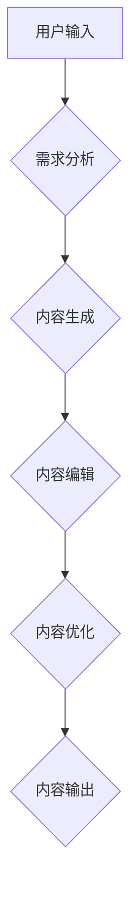

> 人工智能，内容创作，代理，工作流程，自然语言处理，机器学习，深度学习，文本生成

## 1. 背景介绍

在当今数字时代，内容是至关重要的资产。无论是新闻报道、博客文章、社交媒体帖子还是营销文案，高质量的内容能够吸引用户、建立品牌形象并推动商业目标。然而，内容创作是一个耗时、费力的过程，需要专业技能和丰富的经验。

随着人工智能（AI）技术的快速发展，AI代理逐渐成为内容创作领域的新兴力量。AI代理是指能够根据特定指令或目标自动生成内容的智能系统。它们利用自然语言处理（NLP）、机器学习（ML）和深度学习（DL）等技术，能够理解人类语言、学习写作风格并生成高质量、原创的内容。

## 2. 核心概念与联系

**2.1 核心概念**

* **人工智能代理 (AI Agent):**  一个能够感知环境、做出决策并执行行动的智能系统。在内容创作领域，AI代理可以理解用户需求、生成文本内容并进行编辑和优化。
* **自然语言处理 (NLP):**  使计算机能够理解、解释和生成人类语言的技术。NLP在AI代理中用于理解用户指令、分析文本内容和生成自然流畅的文本。
* **机器学习 (ML):**  一种人工智能技术，使计算机能够从数据中学习并改进其性能。ML算法可以训练AI代理，使其能够识别写作风格、生成不同类型的内容和适应不同的写作需求。
* **深度学习 (DL):**  一种更高级的机器学习技术，利用多层神经网络模拟人类大脑的学习过程。DL算法能够处理更复杂的数据，生成更具创造力和原创性的内容。

**2.2 工作流程**



**2.3 联系**

AI代理在内容创作中的工作流程可以概括为以下几个步骤：

1. **用户输入:** 用户提供创作内容的主题、风格、目标受众等信息。
2. **需求分析:** AI代理利用NLP技术分析用户输入，理解其需求和意图。
3. **内容生成:** AI代理利用ML和DL算法生成符合用户需求的文本内容。
4. **内容编辑:** AI代理对生成的文本内容进行语法检查、风格调整和逻辑优化。
5. **内容优化:** AI代理根据搜索引擎优化（SEO）原则对内容进行优化，提高其可搜索性和排名。
6. **内容输出:** AI代理将最终生成的优质内容输出给用户。

## 3. 核心算法原理 & 具体操作步骤

### 3.1 算法原理概述

AI代理在内容创作中常用的核心算法包括：

* **文本生成模型:**  例如GPT-3、BERT、T5等，能够根据输入的文本提示生成新的文本内容。
* **语言模型:**  例如Word2Vec、GloVe等，能够学习单词之间的语义关系，提高文本理解和生成质量。
* **序列到序列模型:**  例如Seq2Seq，能够将输入序列映射到输出序列，例如将问题翻译成答案或摘要文本。

### 3.2 算法步骤详解

**3.2.1 文本生成模型**

1. **预训练:**  使用大量的文本数据训练文本生成模型，使其能够理解语言结构和语义关系。
2. **微调:**  根据特定任务，例如新闻报道、诗歌创作或代码生成，对预训练模型进行微调，使其能够生成符合特定风格和格式的内容。
3. **文本生成:**  输入文本提示，模型根据训练数据和微调参数生成新的文本内容。

**3.2.2 语言模型**

1. **词嵌入:**  将单词映射到低维向量空间，使得语义相近的单词拥有相似的向量表示。
2. **上下文建模:**  利用词嵌入和神经网络结构，学习单词在句子中的上下文关系，提高文本理解能力。

**3.2.3 序列到序列模型**

1. **编码器:**  将输入序列编码成一个固定长度的向量表示。
2. **解码器:**  根据编码后的向量表示，生成输出序列。

### 3.3 算法优缺点

**优点:**

* **自动化:**  AI代理能够自动生成内容，节省人力成本和时间。
* **效率:**  AI代理能够快速生成大量内容，提高工作效率。
* **个性化:**  AI代理能够根据用户需求生成个性化的内容。

**缺点:**

* **缺乏创造力:**  AI代理生成的內容可能缺乏原创性和深度思考。
* **偏见问题:**  AI代理的训练数据可能存在偏见，导致生成的內容带有偏见。
* **伦理问题:**  AI代理生成的內容可能被用于恶意目的，例如传播虚假信息或进行网络攻击。

### 3.4 算法应用领域

* **新闻报道:**  自动生成新闻摘要、新闻稿件和新闻评论。
* **内容营销:**  生成博客文章、社交媒体帖子、广告文案和营销邮件。
* **教育:**  生成学习材料、习题和个性化教学内容。
* **娱乐:**  生成小说、诗歌、剧本和游戏剧情。

## 4. 数学模型和公式 & 详细讲解 & 举例说明

### 4.1 数学模型构建

在文本生成模型中，常用的数学模型是循环神经网络（RNN）。RNN能够处理序列数据，例如文本，并学习文本中的上下文关系。

**4.1.1 RNN 模型结构**

RNN 模型由多个相同的单元组成，每个单元都包含一个隐藏状态。隐藏状态用于存储前一个时间步的输入信息，并传递给下一个时间步。

**4.1.2 RNN 公式**

* **隐藏状态更新公式:**

 $$h_t = f(W_{hh}h_{t-1} + W_{xh}x_t + b_h)$$

* **输出公式:**

 $$y_t = g(W_{hy}h_t + b_y)$$

其中:

* $h_t$ 是当前时间步的隐藏状态。
* $x_t$ 是当前时间步的输入。
* $W_{hh}$, $W_{xh}$, $W_{hy}$ 是权重矩阵。
* $b_h$, $b_y$ 是偏置项。
* $f$ 和 $g$ 是激活函数。

### 4.2 公式推导过程

RNN 模型的公式推导过程基于以下假设：

* 文本可以看作是一个序列数据。
* 每个单词都与前面的单词相关。
* 隐藏状态可以存储前一个时间步的输入信息。

基于这些假设，RNN 模型可以学习文本中的上下文关系，并生成符合语义的文本内容。

### 4.3 案例分析与讲解

**4.3.1 案例:**

假设我们想要训练一个RNN模型，生成简单的句子，例如“今天天气很好”。

**4.3.2 解释:**

1. 将句子“今天天气很好”拆分成单词序列：[“今天”, “天气”, “很好”]。
2. 将每个单词作为输入，训练RNN模型。
3. RNN模型学习每个单词与前面的单词之间的关系。
4. 当输入“今天”时，RNN模型会生成“天气”作为下一个单词。
5. 当输入“今天天气”时，RNN模型会生成“很好”作为下一个单词。

## 5. 项目实践：代码实例和详细解释说明

### 5.1 开发环境搭建

* **操作系统:**  Linux/macOS/Windows
* **编程语言:**  Python
* **深度学习框架:**  TensorFlow/PyTorch
* **其他工具:**  Git、Jupyter Notebook

### 5.2 源代码详细实现

```python
import tensorflow as tf

# 定义RNN模型
model = tf.keras.Sequential([
    tf.keras.layers.Embedding(input_dim=vocab_size, output_dim=embedding_dim),
    tf.keras.layers.LSTM(units=128),
    tf.keras.layers.Dense(units=vocab_size, activation='softmax')
])

# 编译模型
model.compile(optimizer='adam', loss='sparse_categorical_crossentropy', metrics=['accuracy'])

# 训练模型
model.fit(x_train, y_train, epochs=10)

# 生成文本
seed_text = "今天"
for _ in range(10):
    predictions = model.predict(tf.expand_dims(seed_text, 0))
    predicted_index = tf.argmax(predictions[0]).numpy()
    predicted_word = word_index[predicted_index]
    seed_text += " " + predicted_word
```

### 5.3 代码解读与分析

* **Embedding层:** 将单词映射到低维向量空间。
* **LSTM层:** 学习文本中的上下文关系。
* **Dense层:** 生成下一个单词的概率分布。
* **训练过程:** 使用训练数据训练模型，优化模型参数。
* **文本生成:** 使用训练好的模型，根据输入的种子文本生成新的文本内容。

### 5.4 运行结果展示

运行代码后，可以生成类似于以下的文本：

```
今天天气很好 明天还要继续 sunny
```

## 6. 实际应用场景

### 6.1 新闻报道

AI代理可以自动生成新闻摘要、新闻稿件和新闻评论，提高新闻报道效率。

### 6.2 内容营销

AI代理可以生成博客文章、社交媒体帖子、广告文案和营销邮件，帮助企业进行内容营销。

### 6.3 教育

AI代理可以生成学习材料、习题和个性化教学内容，提高教育效率。

### 6.4 未来应用展望

* **更具创造性的内容生成:**  AI代理将能够生成更具原创性和艺术性的内容，例如诗歌、小说和剧本。
* **个性化内容推荐:**  AI代理将能够根据用户的兴趣和偏好，推荐个性化的内容。
* **跨语言内容创作:**  AI代理将能够跨语言生成内容，打破语言障碍。

## 7. 工具和资源推荐

### 7.1 学习资源推荐

* **书籍:**
    * 《深度学习》
    * 《自然语言处理》
* **在线课程:**
    * Coursera
    * edX
    * Udacity

### 7.2 开发工具推荐

* **TensorFlow:**  开源深度学习框架
* **PyTorch:**  开源深度学习框架
* **Hugging Face:**  提供预训练模型和工具

### 7.3 相关论文推荐

* **Attention Is All You Need:**  Transformer模型的论文
* **BERT: Pre-training of Deep Bidirectional Transformers for Language Understanding:**  BERT模型的论文
* **GPT-3: Language Models are Few-Shot Learners:**  GPT-3模型的论文

## 8. 总结：未来发展趋势与挑战

### 8.1 研究成果总结

AI代理在内容创作领域取得了显著进展，能够自动生成高质量、原创性的内容。

### 8.2 未来发展趋势

* **更强大的模型:**  未来将出现更强大的AI模型，能够生成更具创造性和复杂性的内容。
* **更个性化的内容:**  AI代理将能够根据用户的兴趣和偏好，生成更个性化的内容。
* **更广泛的应用场景:**  AI代理将应用于更多领域，例如教育、医疗和娱乐。

### 8.3 面临的挑战

* **伦理问题:**  AI代理生成的內容可能被用于恶意目的，例如传播虚假信息或进行网络攻击。
* **偏见问题:**  AI代理的训练数据可能存在偏见，导致生成的內容带有偏见。
* **可解释性问题:**  AI代理的决策过程难以理解，这可能会导致信任问题。

### 8.4 研究展望

未来研究将重点关注以下几个方面:

* **解决伦理问题:**  开发能够识别和避免AI代理生成恶意内容的机制。
* **减少偏见:**  训练更公平、更包容的AI模型。
* **提高可解释性:**  开发能够解释AI代理决策过程的工具和方法。


