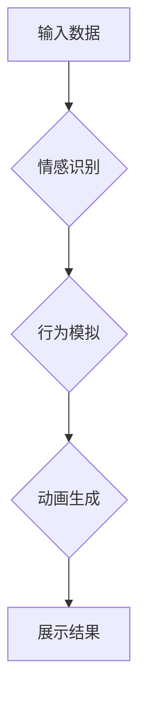

> 人工智能，动画，人类特征，情感识别，行为模拟，机器学习，深度学习，自然语言处理

## 1. 背景介绍

人工智能（AI）技术近年来发展迅速，已渗透到生活的方方面面。从智能语音助手到自动驾驶汽车，AI正在改变着我们的世界。然而，尽管AI技术取得了令人瞩目的成就，但它仍然难以完全模拟人类的复杂行为和特征。

人类的特征是多方面的，包括情感、认知、社交和创造力等。这些特征是人类区别于其他生物的重要标志，也是人类社会文明发展的基石。而AI系统，特别是传统的基于规则的AI系统，往往缺乏这些特征的模拟能力。

近年来，随着深度学习技术的兴起，AI系统开始展现出更强的学习和适应能力。一些研究者尝试利用深度学习技术来模拟人类的情感、行为和认知。其中，动画技术作为一种强大的视觉表达工具，被认为可以有效地展示AI系统模拟人类特征的成果。

## 2. 核心概念与联系

### 2.1 人工智能与动画

人工智能（AI）是指使机器能够像人类一样思考、学习和解决问题的能力。动画则是通过一系列静态图像的快速展示来创造运动的视觉效果。

将AI与动画结合起来，可以实现以下目标：

* **展示AI系统的行为和决策过程：** 通过动画，我们可以直观地看到AI系统如何接收信息、处理信息和做出决策。
* **模拟人类的情感和行为：** 利用深度学习技术，我们可以训练AI系统识别和模拟人类的情感和行为，并通过动画将其表现出来。
* **增强用户体验：** 动画可以使AI系统更加生动有趣，从而增强用户体验。

### 2.2 人类特征与动画表现

人类的特征可以通过多种方式在动画中表现出来：

* **情感表达：** 通过角色的表情、动作和语气来表达情感。
* **行为模式：** 通过角色的动作和互动来表现行为模式。
* **认知能力：** 通过角色的思考和决策过程来展现认知能力。
* **社交互动：** 通过角色之间的对话和互动来模拟社交关系。

### 2.3 流程图



## 3. 核心算法原理 & 具体操作步骤

### 3.1 算法原理概述

模拟人类特征的AI动画主要依赖于以下核心算法：

* **情感识别算法：** 用于识别用户或角色的情感，例如快乐、悲伤、愤怒等。常用的情感识别算法包括深度学习模型（如卷积神经网络、循环神经网络）和机器学习模型（如支持向量机、决策树）。
* **行为模拟算法：** 用于根据情感识别结果生成相应的行为，例如角色的表情、动作和语气。常用的行为模拟算法包括状态机、行为树和强化学习。
* **动画生成算法：** 用于将行为模拟结果转化为动画序列。常用的动画生成算法包括关键帧动画、运动捕捉和物理模拟。

### 3.2 算法步骤详解

1. **数据收集和预处理：** 收集包含情感、行为和动画数据的样本，并进行预处理，例如图像裁剪、数据标注等。
2. **情感识别模型训练：** 使用收集到的数据训练情感识别模型，并进行模型评估和调优。
3. **行为模拟模型训练：** 使用情感识别结果和行为数据训练行为模拟模型，并进行模型评估和调优。
4. **动画生成模型训练：** 使用行为模拟结果训练动画生成模型，并进行模型评估和调优。
5. **动画生成和展示：** 将用户输入或角色的情感识别结果输入到行为模拟模型和动画生成模型中，生成相应的动画序列并进行展示。

### 3.3 算法优缺点

**优点：**

* 可以模拟人类的情感和行为，使AI系统更加生动有趣。
* 可以直观地展示AI系统的决策过程和行为模式。
* 可以增强用户体验，提高用户对AI系统的接受度。

**缺点：**

* 需要大量的训练数据和计算资源。
* 难以完全模拟人类的复杂情感和行为。
* 动画生成过程可能存在一定的延迟和卡顿现象。

### 3.4 算法应用领域

* **教育和培训：** 用于模拟真实场景，帮助用户学习和理解复杂的概念。
* **娱乐和游戏：** 用于创建更加生动有趣的游戏体验。
* **医疗保健：** 用于模拟疾病症状，帮助医生诊断和治疗疾病。
* **机器人技术：** 用于赋予机器人更加自然的交互能力。

## 4. 数学模型和公式 & 详细讲解 & 举例说明

### 4.1 数学模型构建

情感识别模型通常采用深度学习模型，例如卷积神经网络（CNN）和循环神经网络（RNN）。

* **CNN:** 用于提取图像特征，例如表情、姿势等。
* **RNN:** 用于处理序列数据，例如语音、文本等。

### 4.2 公式推导过程

CNN和RNN的具体公式推导过程较为复杂，这里不再赘述。

### 4.3 案例分析与讲解

例如，可以使用CNN模型识别一张表情图像中的情感类别，例如快乐、悲伤、愤怒等。

假设输入图像为 $I$，输出情感类别为 $C$，则CNN模型的输出可以表示为：

$$
C = f(W_1 * I + b_1)
$$

其中：

* $W_1$ 为卷积核权重矩阵
* $b_1$ 为偏置项
* $f$ 为激活函数

通过训练CNN模型，可以学习到合适的 $W_1$ 和 $b_1$ 值，从而实现情感识别的功能。

## 5. 项目实践：代码实例和详细解释说明

### 5.1 开发环境搭建

* 操作系统：Windows/macOS/Linux
* Python版本：3.6+
* 深度学习框架：TensorFlow/PyTorch
* 其他依赖库：OpenCV、NumPy、Matplotlib等

### 5.2 源代码详细实现

```python
# 使用TensorFlow构建情感识别模型
import tensorflow as tf

# 定义模型结构
model = tf.keras.models.Sequential([
    tf.keras.layers.Conv2D(32, (3, 3), activation='relu', input_shape=(48, 48, 1)),
    tf.keras.layers.MaxPooling2D((2, 2)),
    tf.keras.layers.Conv2D(64, (3, 3), activation='relu'),
    tf.keras.layers.MaxPooling2D((2, 2)),
    tf.keras.layers.Flatten(),
    tf.keras.layers.Dense(10, activation='softmax')
])

# 编译模型
model.compile(optimizer='adam',
              loss='sparse_categorical_crossentropy',
              metrics=['accuracy'])

# 训练模型
model.fit(x_train, y_train, epochs=10)

# 预测情感类别
prediction = model.predict(x_test)
```

### 5.3 代码解读与分析

* 代码首先定义了一个简单的CNN模型，包含卷积层、池化层和全连接层。
* 然后，模型被编译，指定了优化器、损失函数和评估指标。
* 最后，模型被训练，并使用测试数据进行预测。

### 5.4 运行结果展示

训练完成后，可以评估模型的性能，例如准确率、召回率等。

## 6. 实际应用场景

### 6.1 情感分析

* **社交媒体监控：** 分析用户在社交媒体上的情感倾向，了解公众对特定事件或产品的看法。
* **客户服务：** 自动识别客户的语气和情绪，提供更精准的客户服务。
* **市场调研：** 分析用户对产品或服务的反馈，了解用户需求和痛点。

### 6.2 人机交互

* **智能聊天机器人：** 使聊天机器人能够理解用户的意图和情感，提供更自然和人性化的对话体验。
* **虚拟助手：** 帮助用户完成各种任务，例如设置提醒、播放音乐等，并根据用户的需求提供个性化的服务。
* **游戏角色：** 使游戏角色更加生动和智能，能够与玩家进行更自然的互动。

### 6.3 教育和培训

* **个性化学习：** 根据学生的学习进度和理解程度，提供个性化的学习内容和辅导。
* **沉浸式学习：** 通过动画和虚拟现实技术，创造更加生动和有趣的学习环境。
* **模拟训练：** 用于模拟真实场景，帮助学生学习和掌握技能。

### 6.4 未来应用展望

随着人工智能技术的不断发展，AI动画将在更多领域得到应用，例如：

* **医疗诊断：** 利用AI动画模拟疾病症状，帮助医生进行诊断和治疗。
* **法律诉讼：** 利用AI动画模拟案件场景，帮助律师进行辩论和论证。
* **艺术创作：** 利用AI动画创作新的艺术作品，例如动画电影、虚拟音乐会等。

## 7. 工具和资源推荐

### 7.1 学习资源推荐

* **书籍：**
    * 《深度学习》
    * 《机器学习》
    * 《人工智能：现代方法》
* **在线课程：**
    * Coursera
    * edX
    * Udacity

### 7.2 开发工具推荐

* **深度学习框架：** TensorFlow、PyTorch
* **图像处理库：** OpenCV
* **动画制作软件：** Blender、Maya

### 7.3 相关论文推荐

* **情感识别：**
    * “Deep Learning for Facial Expression Recognition”
    * “Emotion Recognition from Speech: A Survey”
* **行为模拟：**
    * “A Survey of Behavior Trees”
    * “Deep Reinforcement Learning for Robotics”
* **动画生成：**
    * “Generative Adversarial Networks for Image Synthesis”
    * “Neural Style Transfer”

## 8. 总结：未来发展趋势与挑战

### 8.1 研究成果总结

近年来，AI动画技术取得了显著进展，能够模拟人类的情感、行为和认知。

### 8.2 未来发展趋势

* **更加逼真的动画效果：** 利用更先进的动画生成技术，创造更加逼真和自然的动画效果。
* **更强的智能交互能力：** 使AI动画能够更好地理解用户的意图和需求，提供更个性化的交互体验。
* **更广泛的应用场景：** AI动画将在更多领域得到应用，例如医疗、教育、娱乐等。

### 8.3 面临的挑战

* **数据获取和标注：** 训练AI动画模型需要大量的标注数据，数据获取和标注成本较高。
* **模型复杂度和计算资源：** AI动画模型通常非常复杂，需要大量的计算资源进行训练和推理。
* **伦理和社会影响：** AI动画的应用可能带来一些伦理和社会问题，例如隐私泄露、虚假信息传播等。

### 8.4 研究展望

未来，AI动画技术将继续发展，朝着更加逼真、智能和广泛应用的方向发展。

## 9. 附录：常见问题与解答

* **Q：AI动画可以完全模拟人类吗？**

* **A：** 目前，AI动画还无法完全模拟人类，因为人类的复杂情感、认知和行为模式仍然难以被完全模拟。

* **Q：AI动画的应用场景有哪些？**

* **A：** AI动画的应用场景非常广泛，例如情感分析、人机交互、教育和培训等。

* **Q：如何学习AI动画技术？**

* **A：** 可以通过学习深度学习、机器学习和动画制作等相关知识，并利用开源工具和资源进行实践。


作者：禅与计算机程序设计艺术 / Zen and the Art of Computer Programming 
<end_of_turn>