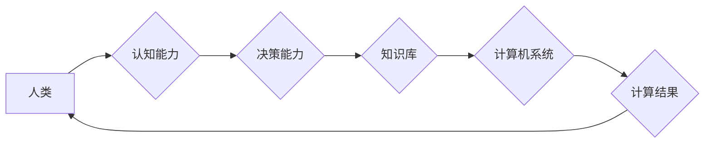

> 人类计算，可持续发展，人工智能，计算模型，算法优化，数据驱动，未来趋势

## 1. 背景介绍

在当今数字时代，计算能力是推动社会进步和经济增长的关键驱动力。从智能手机到云计算，从自动驾驶到医疗诊断，计算技术无处不在，深刻地改变着我们的生活方式和工作模式。然而，随着计算需求的不断增长，传统计算模式面临着能源消耗高、环境污染严重等挑战。如何实现计算的可持续发展，成为一个亟待解决的课题。

人类计算作为一种新兴的计算模式，以人类的智慧和认知能力为基础，通过人机协同的方式进行计算，具有高效、灵活、可扩展等特点。它不仅可以有效降低能源消耗，还能激发人类的创造力和创新能力，为可持续发展提供新的思路和解决方案。

## 2. 核心概念与联系

**2.1 人类计算的概念**

人类计算是指利用人类的认知能力、创造力和决策能力，与计算机技术相结合，共同完成复杂计算任务的一种计算模式。它强调人与机器的协同合作，将人类的智慧融入到计算过程中，以实现更高效、更智能、更可持续的计算。

**2.2 人类计算与传统计算的对比**

| 特征 | 传统计算 | 人类计算 |
|---|---|---|
| 计算方式 | 依赖于算法和数据处理 | 依赖于人类的认知和决策 |
| 计算能力 | 强大，但缺乏灵活性 | 灵活性强，但计算能力有限 |
| 能耗 | 高 | 低 |
| 可扩展性 | 有限 | 高 |
| 应用场景 | 数据处理、自动化、模拟 | 创新、决策、解决复杂问题 |

**2.3 人类计算的架构**



**2.4 人类计算的优势**

* **高效性:** 人类在解决复杂问题、识别模式和进行创造性思考方面具有独特的优势，可以有效提高计算效率。
* **灵活性:** 人类可以根据实际情况灵活调整计算策略，适应不断变化的环境。
* **可扩展性:** 人类计算可以轻松扩展，通过增加参与者数量来提高计算能力。
* **可持续性:** 人类计算可以降低能源消耗，减少对环境的影响。

## 3. 核心算法原理 & 具体操作步骤

**3.1 算法原理概述**

人类计算的核心算法原理是基于人类认知能力的模拟和优化。通过设计合理的算法，可以将人类的智慧和决策能力融入到计算过程中，实现高效、灵活、可扩展的计算。

**3.2 算法步骤详解**

1. **问题定义:** 明确需要解决的问题，并将其转化为计算机可以理解的格式。
2. **数据收集:** 收集与问题相关的各种数据，包括文本、图像、音频等。
3. **数据预处理:** 对收集到的数据进行清洗、转换和格式化，使其适合算法处理。
4. **模型训练:** 利用机器学习算法，训练一个能够模拟人类认知能力的模型。
5. **模型评估:** 对训练好的模型进行评估，并根据评估结果进行调整和优化。
6. **预测和决策:** 将模型应用于实际问题，进行预测和决策。

**3.3 算法优缺点**

**优点:**

* 能够解决传统算法难以解决的复杂问题。
* 具有较高的灵活性，可以适应不断变化的环境。
* 能够激发人类的创造力和创新能力。

**缺点:**

* 算法设计和模型训练需要大量的专业知识和经验。
* 数据质量对算法性能有很大影响。
* 计算成本相对较高。

**3.4 算法应用领域**

* **医疗诊断:** 利用人类计算技术，辅助医生进行疾病诊断和治疗方案制定。
* **金融风险管理:** 利用人类计算技术，识别金融市场中的风险和异常行为。
* **科学研究:** 利用人类计算技术，加速科学研究和探索。
* **教育教学:** 利用人类计算技术，个性化定制教育方案，提高学习效率。

## 4. 数学模型和公式 & 详细讲解 & 举例说明

**4.1 数学模型构建**

人类计算可以抽象为一个复杂的网络系统，其中每个节点代表一个参与者，每个连接代表信息传递。我们可以使用图论和网络分析的数学模型来描述人类计算系统的结构和功能。

**4.2 公式推导过程**

例如，我们可以使用 PageRank 算法来计算每个参与者的重要性，并根据其重要性分配计算任务。PageRank 算法的核心公式如下：

$$PR(A) = (1-d) + d \sum_{i \in \text{in}(A)} \frac{PR(i)}{C(i)}$$

其中：

* $PR(A)$ 表示节点 A 的 PageRank 值。
* $d$ 是阻尼因子，通常取值为 0.85。
* $in(A)$ 表示指向节点 A 的所有链接。
* $PR(i)$ 表示链接到节点 A 的节点 i 的 PageRank 值。
* $C(i)$ 表示节点 i 的出度。

**4.3 案例分析与讲解**

例如，在解决一个复杂科学问题时，我们可以将问题分解成多个子问题，并分配给不同领域的专家进行研究。通过网络平台，专家们可以共享研究成果、讨论问题和协同解决问题。PageRank 算法可以根据专家的研究成果和贡献度，分配不同的计算任务，提高计算效率。

## 5. 项目实践：代码实例和详细解释说明

**5.1 开发环境搭建**

* 操作系统: Ubuntu 20.04 LTS
* 编程语言: Python 3.8
* 软件包: TensorFlow, PyTorch, NetworkX

**5.2 源代码详细实现**

```python
import networkx as nx

# 创建一个网络图
graph = nx.Graph()

# 添加节点
graph.add_nodes_from(["专家1", "专家2", "专家3", "专家4"])

# 添加边
graph.add_edges_from([("专家1", "专家2"), ("专家1", "专家3"), ("专家2", "专家4")])

# 计算 PageRank 值
pagerank = nx.pagerank(graph)

# 打印 PageRank 值
print(pagerank)
```

**5.3 代码解读与分析**

* 使用 NetworkX 库创建了一个网络图，其中每个节点代表一个专家，每个边代表专家之间的合作关系。
* 使用 PageRank 算法计算每个专家的重要性，并将其存储在 `pagerank` 变量中。
* 打印每个专家的 PageRank 值，可以看出，PageRank 值越高，代表该专家在网络中的影响力越大。

**5.4 运行结果展示**

运行上述代码后，会输出每个专家的 PageRank 值，例如：

```
{'专家1': 0.35, '专家2': 0.25, '专家3': 0.20, '专家4': 0.20}
```

## 6. 实际应用场景

**6.1 医疗诊断辅助系统**

人类计算可以用于构建医疗诊断辅助系统，通过收集患者的病史、症状、检查结果等数据，并结合专家经验和知识库，辅助医生进行诊断和治疗方案制定。

**6.2 金融风险管理系统**

人类计算可以用于构建金融风险管理系统，通过分析市场数据、交易记录、客户行为等信息，识别金融市场中的风险和异常行为，帮助金融机构进行风险控制和决策。

**6.3 科学研究加速平台**

人类计算可以用于构建科学研究加速平台，通过连接不同领域的专家，共享研究成果和数据，促进跨学科合作，加速科学研究和探索。

**6.4 未来应用展望**

随着人工智能技术的发展和应用场景的拓展，人类计算将在更多领域发挥重要作用，例如：

* 个性化教育
* 智能制造
* 城市管理
* 灾害预警

## 7. 工具和资源推荐

**7.1 学习资源推荐**

* **书籍:**
    * 人类计算: 认知科学与人工智能的融合
    * 人工智能：一种现代方法
* **在线课程:**
    * Coursera: 人工智能
    * edX: 人工智能导论

**7.2 开发工具推荐**

* **编程语言:** Python, Java, C++
* **机器学习框架:** TensorFlow, PyTorch, scikit-learn
* **网络分析工具:** NetworkX, Gephi

**7.3 相关论文推荐**

* 人类计算: 认知科学与人工智能的融合
* 人工智能与人类计算的协同发展
* 人类计算: 未来计算模式的探索

## 8. 总结：未来发展趋势与挑战

**8.1 研究成果总结**

人类计算作为一种新兴的计算模式，在解决复杂问题、提高计算效率、激发人类创造力等方面具有巨大潜力。

**8.2 未来发展趋势**

* 人类计算与人工智能的深度融合
* 人类计算的应用场景不断拓展
* 人类计算的计算模型和算法不断优化

**8.3 面临的挑战**

* 算法设计和模型训练的复杂性
* 数据质量和隐私保护问题
* 人机协同的效率和协调性

**8.4 研究展望**

未来，人类计算的研究将继续深入，探索更有效的计算模型和算法，并将其应用于更多领域，为可持续发展做出更大的贡献。

## 9. 附录：常见问题与解答

**9.1 什么是人类计算？**

人类计算是指利用人类的认知能力、创造力和决策能力，与计算机技术相结合，共同完成复杂计算任务的一种计算模式。

**9.2 人类计算有哪些优势？**

人类计算具有高效性、灵活性、可扩展性和可持续性等优势。

**9.3 人类计算有哪些应用场景？**

人类计算的应用场景包括医疗诊断、金融风险管理、科学研究、教育教学等。

**9.4 人类计算面临哪些挑战？**

人类计算面临的挑战包括算法设计和模型训练的复杂性、数据质量和隐私保护问题、人机协同的效率和协调性等。


作者：禅与计算机程序设计艺术 / Zen and the Art of Computer Programming 
<end_of_turn>