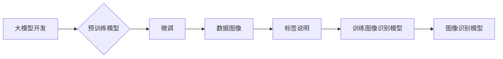

> 大模型开发, 微调, 数据图像, 标签说明, 计算机视觉, 深度学习, 模型训练

## 1. 背景介绍

近年来，深度学习在计算机视觉领域取得了显著进展，大规模预训练模型（如 BERT、GPT-3、DALL-E 等）的出现，为图像识别、目标检测、图像分割等任务带来了革命性的提升。然而，这些预训练模型通常需要海量数据和强大的计算资源进行训练，对于资源有限的开发者来说，部署和使用这些模型仍然存在一定的挑战。

微调技术应运而生，它通过在预训练模型的基础上，使用少量特定领域的标注数据进行训练，从而将模型的性能提升到新的高度。微调技术不仅降低了模型训练的门槛，也使得大模型能够更灵活地应用于不同的场景。

本篇文章将深入探讨大模型开发与微调的流程，重点关注数据图像的获取和标签的说明，为开发者提供一个从零开始构建图像识别模型的指南。

## 2. 核心概念与联系

### 2.1  大模型开发

大模型开发是指训练具有海量参数的深度学习模型，这些模型通常拥有强大的泛化能力，能够在多种任务上表现出色。大模型的训练需要大量的计算资源和数据，通常由大型科技公司或研究机构进行。

### 2.2  微调

微调是指在预训练模型的基础上，使用少量特定领域的标注数据进行训练，从而将模型的性能提升到新的高度。微调技术可以有效地利用预训练模型的知识，降低模型训练的门槛，并提高模型在特定领域的性能。

### 2.3  数据图像

数据图像是指用于训练和评估图像识别模型的图片数据。这些图片数据通常经过预处理，例如裁剪、缩放、旋转等操作，以提高模型的训练效率和性能。

### 2.4  标签说明

标签说明是指为数据图像添加的描述信息，例如图片中包含的物体类别、位置、属性等。标签说明是训练图像识别模型的关键要素，它告诉模型图片中包含哪些信息，以及这些信息之间的关系。

**核心概念与联系流程图:**



## 3. 核心算法原理 & 具体操作步骤

### 3.1  算法原理概述

图像识别模型的训练通常基于深度学习算法，例如卷积神经网络（CNN）。CNN 能够自动学习图像特征，并将其映射到相应的类别标签。

微调技术通过在预训练模型的基础上，调整模型的某些参数，使其能够更好地适应特定领域的图像数据。

### 3.2  算法步骤详解

1. **数据准备:** 收集并预处理图像数据，并为每个图像添加相应的标签说明。
2. **模型选择:** 选择合适的预训练模型，例如 ResNet、VGG、Inception 等。
3. **微调参数:** 调整模型的学习率、训练 epochs 等参数，以优化模型的性能。
4. **模型训练:** 使用微调后的模型，在特定领域的图像数据上进行训练。
5. **模型评估:** 使用测试集评估模型的性能，例如准确率、召回率、F1-score 等。
6. **模型部署:** 将训练好的模型部署到实际应用场景中。

### 3.3  算法优缺点

**优点:**

* 降低模型训练的门槛
* 提高模型在特定领域的性能
* 减少训练时间和计算资源

**缺点:**

* 需要预训练模型作为基础
* 微调参数需要精心调整
* 仍然需要一定量的标注数据

### 3.4  算法应用领域

* **图像分类:** 将图像分类为不同的类别，例如动物、植物、物体等。
* **目标检测:** 在图像中检测到特定目标，并标注其位置和类别。
* **图像分割:** 将图像分割成不同的区域，例如前景和背景。
* **图像识别:** 识别图像中包含的文本、人脸、物体等信息。

## 4. 数学模型和公式 & 详细讲解 & 举例说明

### 4.1  数学模型构建

图像识别模型通常基于卷积神经网络（CNN）的架构。CNN 使用卷积层、池化层和全连接层来提取图像特征并进行分类。

**卷积层:** 使用卷积核对图像进行卷积运算，提取图像局部特征。

**池化层:** 对卷积层的输出进行池化操作，例如最大池化、平均池化，降低特征图的维度，提高模型的鲁棒性。

**全连接层:** 将池化层的输出连接到全连接层，进行分类决策。

### 4.2  公式推导过程

**卷积运算公式:**

$$
y_{i,j} = \sum_{m=0}^{M-1} \sum_{n=0}^{N-1} x_{i+m,j+n} * w_{m,n} + b
$$

其中:

* $y_{i,j}$ 是卷积层的输出特征图上的像素值
* $x_{i+m,j+n}$ 是输入图像的像素值
* $w_{m,n}$ 是卷积核的权重
* $b$ 是卷积层的偏置项

**最大池化公式:**

$$
y_{i,j} = \max_{m=0}^{M-1} \max_{n=0}^{N-1} x_{i+m,j+n}
$$

其中:

* $y_{i,j}$ 是池化层的输出特征图上的像素值
* $x_{i+m,j+n}$ 是输入特征图的像素值

### 4.3  案例分析与讲解

假设我们使用 ResNet-50 模型进行图像分类任务，目标是将图像分类为猫和狗两类。

1. **数据准备:** 收集猫和狗的图像数据，并为每个图像添加相应的标签（猫或狗）。
2. **模型选择:** 选择预训练的 ResNet-50 模型作为基础。
3. **微调参数:** 调整模型的学习率、训练 epochs 等参数。
4. **模型训练:** 使用微调后的 ResNet-50 模型，在猫和狗的图像数据上进行训练。
5. **模型评估:** 使用测试集评估模型的性能，例如准确率、召回率、F1-score 等。

## 5. 项目实践：代码实例和详细解释说明

### 5.1  开发环境搭建

* Python 3.7+
* TensorFlow 2.x 或 PyTorch 1.x
* CUDA 和 cuDNN (可选，用于 GPU 训练)

### 5.2  源代码详细实现

```python
import tensorflow as tf

# 加载预训练模型
model = tf.keras.applications.ResNet50(weights='imagenet', include_top=False)

# 添加自定义分类层
x = model.output
x = tf.keras.layers.GlobalAveragePooling2D()(x)
x = tf.keras.layers.Dense(1024, activation='relu')(x)
predictions = tf.keras.layers.Dense(2, activation='softmax')(x)

# 创建模型
model = tf.keras.Model(inputs=model.input, outputs=predictions)

# 编译模型
model.compile(optimizer='adam',
              loss='categorical_crossentropy',
              metrics=['accuracy'])

# 训练模型
model.fit(train_images, train_labels, epochs=10)

# 评估模型
loss, accuracy = model.evaluate(test_images, test_labels)
print('Test loss:', loss)
print('Test accuracy:', accuracy)
```

### 5.3  代码解读与分析

* **加载预训练模型:** 使用 `tf.keras.applications.ResNet50()` 函数加载预训练的 ResNet-50 模型。
* **添加自定义分类层:** 在预训练模型的基础上，添加自定义的分类层，用于将图像分类为猫和狗两类。
* **创建模型:** 使用 `tf.keras.Model()` 函数创建新的模型，将预训练模型的输入和自定义分类层的输出连接起来。
* **编译模型:** 使用 `model.compile()` 函数编译模型，指定优化器、损失函数和评估指标。
* **训练模型:** 使用 `model.fit()` 函数训练模型，传入训练数据和标签。
* **评估模型:** 使用 `model.evaluate()` 函数评估模型的性能，传入测试数据和标签。

### 5.4  运行结果展示

训练完成后，可以查看模型的训练和测试损失以及准确率。

## 6. 实际应用场景

### 6.1  宠物识别

使用微调后的图像识别模型，可以识别宠物的种类，例如猫、狗、鸟等。

### 6.2  野生动物保护

使用微调后的图像识别模型，可以识别野生动物的种类，并帮助保护野生动物的栖息地。

### 6.3  医疗诊断

使用微调后的图像识别模型，可以辅助医生诊断疾病，例如皮肤病、眼疾等。

### 6.4  未来应用展望

随着深度学习技术的不断发展，图像识别模型的性能将不断提升，应用场景也将更加广泛。

## 7. 工具和资源推荐

### 7.1  学习资源推荐

* **深度学习书籍:**
    * 深度学习
    * 深度学习实践
* **在线课程:**
    * Coursera 深度学习课程
    * Udacity 深度学习工程师 Nanodegree

### 7.2  开发工具推荐

* **TensorFlow:** 开源深度学习框架
* **PyTorch:** 开源深度学习框架
* **Keras:** 高级深度学习API

### 7.3  相关论文推荐

* **ImageNet Classification with Deep Convolutional Neural Networks**
* **Deep Residual Learning for Image Recognition**
* **Attention Is All You Need**

## 8. 总结：未来发展趋势与挑战

### 8.1  研究成果总结

近年来，图像识别模型取得了显著进展，例如准确率大幅提升、模型规模不断扩大等。

### 8.2  未来发展趋势

* **模型效率提升:** 研究更轻量级的模型，降低模型的计算成本和内存占用。
* **数据增强:** 利用数据增强技术，提高模型对数据变化的鲁棒性。
* **迁移学习:** 研究更有效的迁移学习方法，将预训练模型应用于更多领域。

### 8.3  面临的挑战

* **数据标注:** 高质量的标注数据是训练图像识别模型的关键，但数据标注成本高昂。
* **模型解释性:** 深度学习模型的决策过程难以解释，这限制了模型在一些安全关键领域中的应用。
* **公平性与偏见:** 图像识别模型可能存在公平性问题和偏见，需要进行更深入的研究和解决。

### 8.4  研究展望

未来，图像识别领域的研究将更加注重模型的效率、解释性和公平性，并探索更广泛的应用场景。

## 9. 附录：常见问题与解答

### 9.1  常见问题

* **如何选择合适的预训练模型？**

选择预训练模型需要考虑任务类型、数据规模和计算资源等因素。

* **如何进行数据标注？**

数据标注可以使用人工标注、自动标注或半自动标注等方法。

* **如何评估模型的性能？**

可以使用准确率、召回率、F1-score 等指标评估模型的性能。

### 9.2  解答

* **如何选择合适的预训练模型？**

选择预训练模型需要考虑任务类型、数据规模和计算资源等因素。例如，对于图像分类任务，ResNet、VGG、Inception 等模型都是不错的选择。对于目标检测任务，YOLO、Faster R-CNN 等模型更适合。

* **如何进行数据标注？**

数据标注可以使用人工标注、自动标