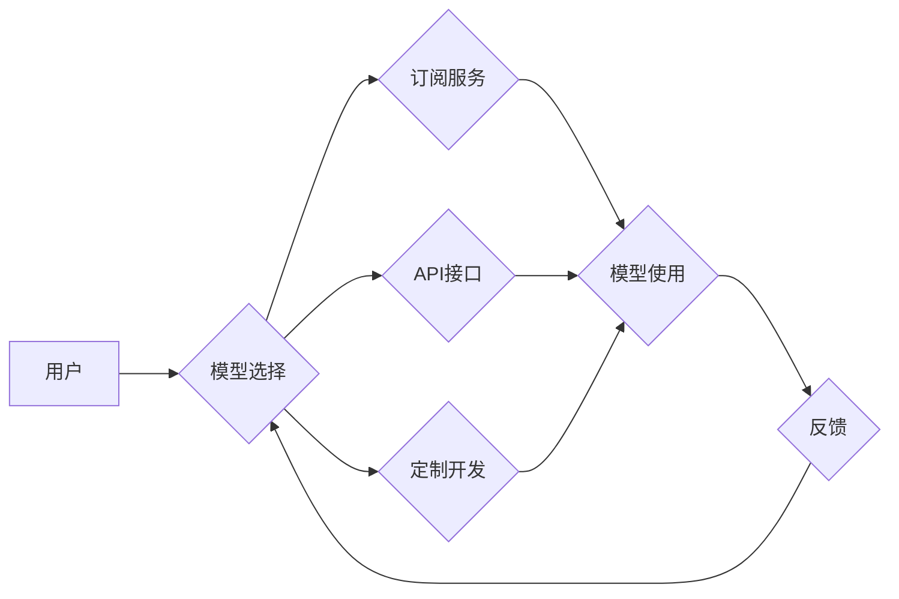

> AI大模型，价格，可访问性，商业化，开源，训练成本，部署成本，数据标注，模型压缩，微调

## 1. 背景介绍

近年来，人工智能（AI）领域取得了令人瞩目的进展，其中，大规模语言模型（LLM）的出现更是掀起了一场AI革命。这些模型，例如GPT-3、LaMDA和BERT，展现出惊人的文本生成、理解和翻译能力，为各个行业带来了无限可能。然而，这些强大的模型也面临着巨大的挑战，其中之一就是高昂的开发和部署成本，这限制了其更广泛的应用。

传统的AI模型开发模式通常需要大量的计算资源、海量数据和专业的技术团队，这使得模型开发成本高昂，难以普及。而LLM的训练成本更是惊人，需要数百万甚至数十亿个参数，耗费大量的计算资源和时间。此外，部署LLM也需要强大的硬件设施和专业的运维团队，进一步增加了成本。

## 2. 核心概念与联系

价格成为AI大模型的突破口，意味着我们需要找到一种新的商业模式，降低模型开发和部署的成本，使其更易于大众使用和应用。

**核心概念：**

* **可访问性:**  降低AI大模型的开发和部署门槛，使其更易于大众使用。
* **商业化:**  探索新的商业模式，例如订阅服务、API接口和定制开发，以实现模型的盈利。
* **开源:**  鼓励开源社区的参与，共同开发和完善AI大模型，加速模型的创新和发展。

**架构图：**



## 3. 核心算法原理 & 具体操作步骤

### 3.1  算法原理概述

价格成为AI大模型的突破口，需要从多个方面入手，例如：

* **模型压缩:**  通过算法和技术手段，将模型的大小和参数量压缩，降低模型的存储和计算需求。
* **微调:**  利用预训练的LLM模型，针对特定任务进行微调，减少训练时间和数据量。
* **联邦学习:**  将模型训练分散到多个设备上，保护数据隐私，同时降低训练成本。

### 3.2  算法步骤详解

**模型压缩:**

1. **量化:** 将模型参数的精度降低，例如将32位浮点数转换为8位整数。
2. **剪枝:**  移除模型中不重要的参数或连接，减少模型规模。
3. **知识蒸馏:**  训练一个更小的模型，使其模仿大型模型的输出结果。

**微调:**

1. **选择预训练模型:**  根据任务选择合适的预训练LLM模型。
2. **准备训练数据:**  收集和预处理特定任务的数据集。
3. **微调模型参数:**  使用少量数据对预训练模型进行微调，使其适应特定任务。

**联邦学习:**

1. **数据分发:** 将数据分散到多个设备上。
2. **模型训练:**  每个设备对本地数据进行模型训练，并上传模型参数更新。
3. **参数聚合:**  将所有设备上传的模型参数进行聚合，得到全局模型更新。
4. **模型更新:**  将全局模型更新下载到每个设备，重复训练和更新过程。

### 3.3  算法优缺点

**模型压缩:**

* **优点:**  降低模型大小和计算需求，提高模型部署效率。
* **缺点:**  可能导致模型精度下降。

**微调:**

* **优点:**  利用预训练模型的知识，降低训练成本和时间。
* **缺点:**  需要准备特定任务的数据集。

**联邦学习:**

* **优点:**  保护数据隐私，提高数据安全。
* **缺点:**  训练速度较慢，需要协调多个设备的通信。

### 3.4  算法应用领域

* **模型压缩:**  移动设备、嵌入式系统、边缘计算等场景。
* **微调:**  自然语言处理、图像识别、语音识别等特定任务。
* **联邦学习:**  医疗保健、金融、电商等领域，处理敏感数据。

## 4. 数学模型和公式 & 详细讲解 & 举例说明

### 4.1  数学模型构建

模型压缩可以采用量化技术，将模型参数的精度降低。例如，将32位浮点数转换为8位整数。

**量化公式:**

$$q(x) = \text{round}(x \cdot 2^k)$$

其中：

* $x$ 是原始浮点数参数。
* $q(x)$ 是量化后的整数参数。
* $k$ 是量化位数。

### 4.2  公式推导过程

量化公式的推导过程如下：

1. 将原始浮点数参数 $x$ 乘以 $2^k$，得到一个整数。
2. 对结果进行四舍五入，得到量化后的整数参数 $q(x)$。

### 4.3  案例分析与讲解

假设原始浮点数参数 $x = 0.625$，量化位数 $k = 3$。

根据量化公式：

$$q(x) = \text{round}(0.625 \cdot 2^3) = \text{round}(5) = 5$$

因此，量化后的整数参数 $q(x) = 5$。

## 5. 项目实践：代码实例和详细解释说明

### 5.1  开发环境搭建

* Python 3.7+
* TensorFlow 2.0+
* PyTorch 1.0+

### 5.2  源代码详细实现

```python
import tensorflow as tf

# 定义一个简单的模型
model = tf.keras.Sequential([
    tf.keras.layers.Dense(10, activation='relu'),
    tf.keras.layers.Dense(1)
])

# 训练模型
model.compile(optimizer='adam', loss='mse')
model.fit(x_train, y_train, epochs=10)

# 保存模型
model.save('my_model.h5')

# 加载模型
loaded_model = tf.keras.models.load_model('my_model.h5')
```

### 5.3  代码解读与分析

* 代码首先定义了一个简单的多层感知机模型。
* 然后使用Adam优化器和均方误差损失函数训练模型。
* 训练完成后，将模型保存为HDF5文件。
* 最后，加载保存的模型进行预测。

### 5.4  运行结果展示

运行代码后，模型将训练完成，并输出训练过程中的损失值。

## 6. 实际应用场景

### 6.1  自然语言处理

* 文本生成：小说、诗歌、剧本等。
* 机器翻译：将文本从一种语言翻译成另一种语言。
* 文本摘要：提取文本的关键信息，生成简短的摘要。

### 6.2  图像识别

* 物体检测：识别图像中存在的物体。
* 图像分类：将图像分类到不同的类别。
* 图像分割：将图像分割成不同的区域。

### 6.3  语音识别

* 语音转文本：将语音转换为文本。
* 语音助手：例如Siri、Alexa和Google Assistant。
* 语音搜索：使用语音进行搜索。

### 6.4  未来应用展望

* 个性化教育：根据学生的学习进度和需求提供个性化的学习内容。
* 智能医疗：辅助医生诊断疾病、制定治疗方案。
* 自动驾驶：帮助车辆感知周围环境，自动驾驶。

## 7. 工具和资源推荐

### 7.1  学习资源推荐

* **书籍:**
    * 《深度学习》
    * 《动手学深度学习》
* **在线课程:**
    * Coursera
    * edX
    * Udacity

### 7.2  开发工具推荐

* **TensorFlow:**  开源机器学习框架。
* **PyTorch:**  开源机器学习框架。
* **Keras:**  高层机器学习API，可以用于TensorFlow和Theano。

### 7.3  相关论文推荐

* **Attention Is All You Need:**  Transformer模型的论文。
* **BERT: Pre-training of Deep Bidirectional Transformers for Language Understanding:**  BERT模型的论文。
* **GPT-3: Language Models are Few-Shot Learners:**  GPT-3模型的论文。

## 8. 总结：未来发展趋势与挑战

### 8.1  研究成果总结

近年来，AI大模型取得了令人瞩目的进展，在自然语言处理、图像识别、语音识别等领域取得了突破性成果。

### 8.2  未来发展趋势

* **模型规模的进一步扩大:**  更大的模型参数量和训练数据，带来更强的模型能力。
* **多模态模型的开发:**  融合文本、图像、音频等多种模态数据，构建更全面的AI模型。
* **模型的可解释性和安全性:**  提高模型的可解释性和安全性，使其更易于理解和信任。

### 8.3  面临的挑战

* **高昂的训练成本:**  训练大型模型需要大量的计算资源和时间。
* **数据标注的困难:**  高质量的数据标注是训练AI模型的基础，但标注成本高昂。
* **模型的偏见和公平性:**  AI模型可能存在偏见和不公平性，需要进行更深入的研究和解决。

### 8.4  研究展望

未来，AI大模型将继续朝着更强大、更智能、更安全的方向发展。我们需要不断探索新的算法、技术和应用场景，推动AI技术的发展，造福人类社会。

## 9. 附录：常见问题与解答

* **Q: 如何降低AI大模型的训练成本？**

* **A:** 可以采用模型压缩、微调和联邦学习等技术，降低模型的规模和训练数据量。

* **Q: 如何解决AI大模型的偏见和公平性问题？**

* **A:**  需要在数据收集、模型训练和评估过程中，更加注重公平性和包容性。

* **Q: AI大模型的未来发展趋势是什么？**

* **A:**  未来，AI大模型将朝着更强大、更智能、更安全的方向发展，并应用于更广泛的领域。


作者：禅与计算机程序设计艺术 / Zen and the Art of Computer Programming 
<end_of_turn>