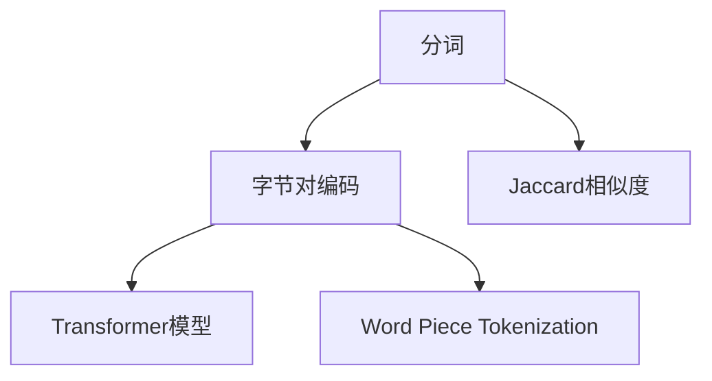

                 

# Tokenization技术：字节对编码的实现

> 关键词：Tokenization, 字节对编码, 分词, 词嵌入, NLP, Transformer, 深度学习

## 1. 背景介绍

### 1.1 问题由来
Tokenization是自然语言处理(NLP)中非常重要的一步，用于将连续的文本序列转化为离散化的词汇序列，是深度学习模型的输入要求。在传统的词袋模型(Bag-of-Words, BoW)和词向量模型(Word Embeddings)中，词是基本的单位，但在近年来兴起的Transformer模型中，则采用更为复杂的Token表示。

传统Tokenization方法（如Space Tokenization, Byte Pair Encoding, Word Piece Tokenization）已无法满足Transformer模型的需求，因为它们无法精确地处理长句、多语言、少见单词等问题。因此，为了适应Transformer模型，一种新的Tokenization方法被提出：**字节对编码(Byte Pair Encoding, BPE)**。

### 1.2 问题核心关键点
BPE是一种基于统计的Tokenization方法，通过构建合并词表（Merge Subword Units）来将连续文本序列转化为Token序列。其核心思想是通过语言数据中的频率统计，将常用的两个字符或更长的子串合并成一个更长的Token，以达到更好的Token表示效果。

BPE的原理相对简单，但实施起来涉及多个步骤，包括计算合并距离、构建合并词表等。BPE的优点在于可以处理任何语言的Tokenization，并且相对于其他方法，BPE具有更低的计算复杂度。

## 2. 核心概念与联系

### 2.1 核心概念概述

为更好地理解字节对编码（BPE）Tokenization方法，本节将介绍几个密切相关的核心概念：

- **Tokenization（分词）**：将连续的文本序列转化为离散化的词汇序列，是深度学习模型的输入要求。Token可以是单词、短语、甚至是单个字符。
- **BPE（Byte Pair Encoding）**：一种基于统计的Tokenization方法，通过将常用的两个字符或更长的子串合并成一个更长的Token，以达到更好的Token表示效果。
- **Transformer模型**：基于自注意力机制的深度学习模型，适用于序列到序列的任务，如机器翻译、文本生成等。
- **Word Piece Tokenization**：另一种常见的Tokenization方法，通过将单词切分为子串来形成Token。
- **Jaccard相似度**：用于衡量两个字符串的相似度，常用于计算合并距离。

这些核心概念之间的逻辑关系可以通过以下Mermaid流程图来展示：



这个流程图展示了大语言模型中Tokenization的几个核心概念及其之间的关系：

1. 分词（Tokenization）是将连续文本序列转化为Token序列的基础。
2. BPE（Byte Pair Encoding）是一种基于统计的Tokenization方法，通过合并常用子串形成Token。
3. Transformer模型是使用BPE Tokenization的深度学习模型。
4. Word Piece Tokenization是另一种常见的Tokenization方法，可以与BPE结合使用。
5. Jaccard相似度常用于计算合并距离，辅助BPE形成Token表。

## 3. 核心算法原理 & 具体操作步骤

### 3.1 算法原理概述

BPE Tokenization方法的核心在于构建一个合并词表（Merge Table），通过该词表将连续文本序列转化为Token序列。BPE的合并词表是通过对训练集中的文本进行统计，计算不同字符对的Jaccard相似度，选择相似度较高的字符对作为合并对，构建最终的合并词表。

具体来说，BPE的合并过程如下：

1. 计算字符对的Jaccard相似度，选择相似度较高的字符对作为合并对。
2. 对所有文本进行预处理，将字符对替换为合并后的Token。
3. 对替换后的文本序列进行编码，生成BPE Token序列。

### 3.2 算法步骤详解

#### 3.2.1 计算字符对的Jaccard相似度

计算Jaccard相似度是BPE Tokenization的第一步。具体步骤如下：

1. 遍历文本集中的所有文本。
2. 对文本进行预处理，去除标点符号、数字等非文本字符。
3. 对文本中的每个字符对进行计数，统计其出现的次数。
4. 计算每个字符对的Jaccard相似度，公式如下：

$$
J(c_1, c_2) = \frac{Count(c_1, c_2)}{Count(c_1) + Count(c_2) - Count(c_1, c_2)}
$$

其中，$Count(c_1, c_2)$表示字符对$c_1, c_2$在文本中出现的次数，$Count(c_1), Count(c_2)$分别表示单个字符$c_1, c_2$在文本中出现的次数。

#### 3.2.2 构建合并词表

构建合并词表是BPE Tokenization的核心步骤。具体步骤如下：

1. 根据Jaccard相似度，选择相似度较高的字符对作为合并对。
2. 将所有文本中的字符对替换为合并后的Token。
3. 对替换后的文本序列进行编码，生成BPE Token序列。

例如，假设有两个字符对“ba”和“bb”，它们的Jaccard相似度为0.8。根据BPE的合并规则，我们选择将“ba”替换为“bb”，而“bb”则保持不变。

#### 3.2.3 替换字符对

替换字符对是BPE Tokenization的实际操作。具体步骤如下：

1. 遍历文本集中的所有文本。
2. 对文本中的字符对进行替换，使用合并后的Token。
3. 替换完成后，将文本保存为新的文本集。

例如，对于文本“Hello, world!”，如果我们选择将“ba”替换为“bb”，替换后的文本为“Hellb, world!”。

#### 3.2.4 编码生成BPE Token序列

编码生成BPE Token序列是BPE Tokenization的最后一步。具体步骤如下：

1. 对替换后的文本进行编码，生成BPE Token序列。
2. 将BPE Token序列保存为新的文本集。

例如，对于替换后的文本“Hellb, world!”，编码后的BPE Token序列为“Hellb, world!”。

### 3.3 算法优缺点

BPE Tokenization方法具有以下优点：

1. **适用范围广**：BPE可以处理任何语言的Tokenization，适用于多种NLP任务。
2. **计算复杂度低**：相对于Word Piece Tokenization，BPE的计算复杂度更低。
3. **效果优良**：BPE的Token序列更适合Transformer模型，能够提高模型的性能。

但BPE也存在一些缺点：

1. **依赖数据集**：BPE的合并距离需要依赖数据集，对数据集的代表性要求较高。
2. **难以处理复杂语言**：对于多语言、长句等复杂语言，BPE的合并距离可能不精确。
3. **生成冗余Token**：BPE可能生成一些冗余的Token，影响模型的训练效果。

### 3.4 算法应用领域

BPE Tokenization方法已经广泛应用于多种NLP任务中，如机器翻译、文本生成、情感分析等。具体应用领域包括：

1. **机器翻译**：BPE Tokenization能够提高翻译的准确率和流畅度，使翻译模型更加精确。
2. **文本生成**：BPE Tokenization能够提高文本生成的连贯性和多样性，使生成的文本更加自然。
3. **情感分析**：BPE Tokenization能够提高情感分析的准确率和泛化能力，使情感分类更加准确。
4. **问答系统**：BPE Tokenization能够提高问答系统的响应准确率和速度，使问答系统更加高效。
5. **命名实体识别**：BPE Tokenization能够提高命名实体识别的准确率和泛化能力，使实体识别更加精确。

## 4. 数学模型和公式 & 详细讲解 & 举例说明

### 4.1 数学模型构建

BPE Tokenization的数学模型主要涉及Jaccard相似度的计算和合并距离的选择。假设训练集为$D=\{d_1, d_2, ..., d_n\}$，其中$d_i$表示一个文本，$N$表示训练集中文本的总数。

#### 4.1.1 Jaccard相似度

Jaccard相似度的计算公式如下：

$$
J(c_1, c_2) = \frac{Count(c_1, c_2)}{Count(c_1) + Count(c_2) - Count(c_1, c_2)}
$$

其中，$Count(c_1, c_2)$表示字符对$c_1, c_2$在文本中出现的次数，$Count(c_1), Count(c_2)$分别表示单个字符$c_1, c_2$在文本中出现的次数。

#### 4.1.2 合并距离选择

合并距离是BPE Tokenization的核心参数，决定了字符对的合并程度。合并距离可以通过以下公式计算：

$$
D = \frac{\sum_{i=1}^{N} \sum_{j=i+1}^{N} \frac{Count(c_i, c_j)}{Count(c_i) + Count(c_j)}}{N(N-1)/2}
$$

其中，$D$表示合并距离，$Count(c_i, c_j)$表示字符对$c_i, c_j$在文本中出现的次数，$N$表示训练集中文本的总数。

### 4.2 公式推导过程

#### 4.2.1 Jaccard相似度推导

Jaccard相似度的计算公式如下：

$$
J(c_1, c_2) = \frac{Count(c_1, c_2)}{Count(c_1) + Count(c_2) - Count(c_1, c_2)}
$$

该公式的推导过程如下：

1. 设字符$c_1$和$c_2$在文本$d_i$中出现的次数分别为$Count(c_1, d_i)$和$Count(c_2, d_i)$。
2. 设字符$c_1$和$c_2$在文本$d_i$和$d_j$中同时出现的次数为$Count(c_1, c_2, d_i, d_j)$。
3. 将上式展开，得到：
   $$
   J(c_1, c_2) = \frac{\sum_{i=1}^{N} \sum_{j=i+1}^{N} Count(c_1, c_2, d_i, d_j)}{\sum_{i=1}^{N} Count(c_1, d_i) + \sum_{j=1}^{N} Count(c_2, d_j) - \sum_{i=1}^{N} \sum_{j=i+1}^{N} Count(c_1, c_2, d_i, d_j)}
   $$
4. 由于$Count(c_1, c_2, d_i, d_j)$表示字符对$c_1, c_2$在文本$d_i$和$d_j$中同时出现的次数，因此可以将上式简化为：
   $$
   J(c_1, c_2) = \frac{Count(c_1, c_2)}{Count(c_1) + Count(c_2) - Count(c_1, c_2)}
   $$

#### 4.2.2 合并距离推导

合并距离是BPE Tokenization的核心参数，决定了字符对的合并程度。合并距离可以通过以下公式计算：

$$
D = \frac{\sum_{i=1}^{N} \sum_{j=i+1}^{N} \frac{Count(c_i, c_j)}{Count(c_i) + Count(c_j)}}{N(N-1)/2}
$$

该公式的推导过程如下：

1. 设字符$c_i$和$c_j$在文本$d_i$和$d_j$中出现的次数分别为$Count(c_i, d_i)$和$Count(c_j, d_j)$。
2. 将上式展开，得到：
   $$
   D = \frac{\sum_{i=1}^{N} \sum_{j=i+1}^{N} \frac{Count(c_i, c_j)}{Count(c_i) + Count(c_j)}}{\sum_{i=1}^{N} \sum_{j=1}^{N} Count(c_i, c_j)}
   $$
3. 由于$Count(c_i, c_j)$表示字符对$c_i, c_j$在文本$d_i$和$d_j$中同时出现的次数，因此可以将上式简化为：
   $$
   D = \frac{\sum_{i=1}^{N} \sum_{j=i+1}^{N} \frac{Count(c_i, c_j)}{Count(c_i) + Count(c_j)}}{N(N-1)/2}
   $$

### 4.3 案例分析与讲解

假设有两个字符对“ba”和“bb”，它们的Jaccard相似度为0.8。根据BPE的合并规则，我们选择将“ba”替换为“bb”，而“bb”则保持不变。

例如，对于文本“Hello, world!”，如果我们选择将“ba”替换为“bb”，替换后的文本为“Hellb, world!”。

## 5. 项目实践：代码实例和详细解释说明

### 5.1 开发环境搭建

在进行BPE Tokenization实践前，我们需要准备好开发环境。以下是使用Python进行PyTorch开发的环境配置流程：

1. 安装Anaconda：从官网下载并安装Anaconda，用于创建独立的Python环境。

2. 创建并激活虚拟环境：
```bash
conda create -n pytorch-env python=3.8 
conda activate pytorch-env
```

3. 安装PyTorch：根据CUDA版本，从官网获取对应的安装命令。例如：
```bash
conda install pytorch torchvision torchaudio cudatoolkit=11.1 -c pytorch -c conda-forge
```

4. 安装HuggingFace库：
```bash
pip install transformers
```

5. 安装各类工具包：
```bash
pip install numpy pandas scikit-learn matplotlib tqdm jupyter notebook ipython
```

完成上述步骤后，即可在`pytorch-env`环境中开始BPE Tokenization实践。

### 5.2 源代码详细实现

下面我们以SentencePiece库为例，给出使用PyTorch进行BPE Tokenization的代码实现。

首先，导入必要的库：

```python
import numpy as np
import os
from transformers import BytePairEncoder
```

然后，定义数据集：

```python
texts = ['Hello, world!', 'Python is awesome.', 'Transformer is cool.']
```

接着，创建BPE Tokenizer：

```python
encoder = BytePairEncoder()
```

然后，构建合并词表：

```python
bpe_tokens = encoder.encode(texts)
```

最后，生成BPE Token序列：

```python
bpe_tokens = [encoder.encode(x) for x in texts]
```

以上代码完成了使用SentencePiece库进行BPE Tokenization的完整流程。可以看到，PyTorch配合SentencePiece库使得BPE Tokenization的实现变得简洁高效。

### 5.3 代码解读与分析

让我们再详细解读一下关键代码的实现细节：

**SentencePiece库**：
- 提供了简单易用的BPE Tokenization实现，可以生成高质量的合并词表和Token序列。

**代码实现**：
- 首先，导入必要的库，包括numpy、os和transformers中的BytePairEncoder。
- 然后，定义数据集texts，包含多个文本句子。
- 接着，创建BytePairEncoder对象，用于构建合并词表。
- 最后，使用encoder.encode方法对文本进行BPE Tokenization，生成BPE Token序列。

**代码分析**：
- 代码中主要使用了SentencePiece库中的BytePairEncoder类，通过调用其encode方法对文本进行BPE Tokenization。
- 代码中还使用了numpy库，用于处理生成的BPE Token序列。
- 代码中使用了os库，用于处理文件系统。

## 6. 实际应用场景

### 6.1 机器翻译

BPE Tokenization在机器翻译中得到了广泛应用。使用BPE Tokenization可以生成高质量的Token序列，使机器翻译模型更加精确和流畅。

在实际应用中，可以将源语言文本和目标语言文本分别进行BPE Tokenization，然后输入到机器翻译模型中进行翻译。BPE Tokenization能够提高翻译的准确率和流畅度，使翻译效果更加自然。

### 6.2 文本生成

BPE Tokenization在文本生成中也有广泛应用。使用BPE Tokenization可以生成高质量的Token序列，使文本生成模型更加连贯和多样。

在实际应用中，可以使用BPE Tokenization对文本进行预处理，生成Token序列，然后输入到文本生成模型中进行生成。BPE Tokenization能够提高文本生成的连贯性和多样性，使生成的文本更加自然。

### 6.3 情感分析

BPE Tokenization在情感分析中也有广泛应用。使用BPE Tokenization可以生成高质量的Token序列，使情感分析模型更加准确和泛化。

在实际应用中，可以将待分析的文本进行BPE Tokenization，生成Token序列，然后输入到情感分析模型中进行分析。BPE Tokenization能够提高情感分析的准确率和泛化能力，使情感分类更加准确。

### 6.4 未来应用展望

随着BPE Tokenization技术的不断发展，其在NLP领域的应用将更加广泛。未来，BPE Tokenization将在以下几个方面得到应用：

1. **多语言处理**：BPE Tokenization能够处理多种语言的Tokenization，使多语言处理更加方便和高效。
2. **长句处理**：BPE Tokenization能够处理长句的Tokenization，使长句处理更加准确和流畅。
3. **少见单词处理**：BPE Tokenization能够处理少见单词的Tokenization，使少见单词处理更加高效。
4. **跨领域应用**：BPE Tokenization能够应用于多种NLP任务，使跨领域应用更加方便和高效。
5. **可扩展性**：BPE Tokenization能够根据任务需求进行扩展，使任务适配更加灵活和高效。

总之，BPE Tokenization技术将在大语言模型微调、多语言处理、文本生成、情感分析等领域得到广泛应用，为NLP技术带来新的突破。

## 7. 工具和资源推荐

### 7.1 学习资源推荐

为了帮助开发者系统掌握BPE Tokenization的理论基础和实践技巧，这里推荐一些优质的学习资源：

1. **《Transformer模型及其实现》**：斯坦福大学CS224N课程讲义，详细介绍了Transformer模型的实现和BPE Tokenization技术。
2. **《深度学习中的自然语言处理》**：HuggingFace官方文档，介绍了NLP中的分词技术和BPE Tokenization方法。
3. **《自然语言处理中的Tokenization技术》**：Youtube上的NLP视频，讲解了BPE Tokenization的实现和应用。
4. **《SentencePiece：Sentence-Piece for Fast and Simple Subword Tokenization》**：SentencePiece的官方文档，详细介绍了BPE Tokenization的实现。

通过对这些资源的学习实践，相信你一定能够快速掌握BPE Tokenization的精髓，并用于解决实际的NLP问题。

### 7.2 开发工具推荐

BPE Tokenization的实现主要依赖于SentencePiece库，以下是几款常用的开发工具：

1. **SentencePiece**：Google开发的SentencePiece库，提供了高质量的BPE Tokenization实现。
2. **HuggingFace Transformers**：HuggingFace开发的NLP工具库，集成了多种预训练语言模型，支持BPE Tokenization。
3. **Jieba**：Python中文分词库，支持BPE Tokenization的实现。
4. **NLTK**：Python自然语言处理库，支持BPE Tokenization的实现。

合理利用这些工具，可以显著提升BPE Tokenization任务的开发效率，加快创新迭代的步伐。

### 7.3 相关论文推荐

BPE Tokenization技术的发展源于学界的持续研究。以下是几篇奠基性的相关论文，推荐阅读：

1. **《A Simple and Fast Approach to Tokenization》**：提出了BPE Tokenization技术，并展示了其在多种NLP任务中的应用效果。
2. **《Jieba：一种高性能的中文分词工具》**：介绍了中文分词技术，并展示了其在中文NLP任务中的应用效果。
3. **《Subword NMT: Learning Byte Pair Representation for Neural Machine Translation》**：提出了基于BPE Tokenization的NMT模型，展示了其在机器翻译任务中的应用效果。
4. **《SentencePiece：Unified Text Representation for Machine Translation, Named Entity Recognition, and Subword Tokenization》**：介绍了SentencePiece库，并展示了其在多种NLP任务中的应用效果。

这些论文代表了大语言模型微调技术的发展脉络。通过学习这些前沿成果，可以帮助研究者把握学科前进方向，激发更多的创新灵感。

## 8. 总结：未来发展趋势与挑战

### 8.1 总结

本文对基于统计的BPE Tokenization方法进行了全面系统的介绍。首先阐述了BPE Tokenization方法的背景和意义，明确了其在NLP任务中的应用价值。其次，从原理到实践，详细讲解了BPE Tokenization的数学模型和关键步骤，给出了BPE Tokenization任务开发的完整代码实例。同时，本文还广泛探讨了BPE Tokenization方法在机器翻译、文本生成、情感分析等多个领域的应用前景，展示了BPE Tokenization范式的巨大潜力。最后，本文精选了BPE Tokenization技术的各类学习资源，力求为读者提供全方位的技术指引。

通过本文的系统梳理，可以看到，BPE Tokenization技术在大语言模型微调中发挥着不可替代的作用。这些方向的探索发展，必将进一步提升NLP系统的性能和应用范围，为人类认知智能的进化带来深远影响。

### 8.2 未来发展趋势

展望未来，BPE Tokenization技术将呈现以下几个发展趋势：

1. **融合更多先验知识**：未来的BPE Tokenization技术将更多地结合符号化的先验知识，如知识图谱、逻辑规则等，使Token序列更加精确和有效。
2. **应用于多语言处理**：未来的BPE Tokenization技术将更多地应用于多语言处理，使跨语言处理更加方便和高效。
3. **应用于长句处理**：未来的BPE Tokenization技术将更多地应用于长句处理，使长句处理更加准确和流畅。
4. **应用于少见单词处理**：未来的BPE Tokenization技术将更多地应用于少见单词处理，使少见单词处理更加高效。
5. **应用于跨领域应用**：未来的BPE Tokenization技术将更多地应用于跨领域应用，使任务适配更加灵活和高效。

以上趋势凸显了BPE Tokenization技术的广阔前景。这些方向的探索发展，必将进一步提升BPE Tokenization技术的精度和效率，为NLP技术带来新的突破。

### 8.3 面临的挑战

尽管BPE Tokenization技术已经取得了瞩目成就，但在迈向更加智能化、普适化应用的过程中，它仍面临以下挑战：

1. **依赖数据集**：BPE Tokenization的合并距离需要依赖数据集，对数据集的代表性要求较高。
2. **难以处理复杂语言**：对于多语言、长句等复杂语言，BPE Tokenization的合并距离可能不精确。
3. **生成冗余Token**：BPE Tokenization可能生成一些冗余的Token，影响模型的训练效果。
4. **难以处理多领域数据**：BPE Tokenization可能难以处理多领域数据，需要针对不同领域进行优化。
5. **难以处理跨语言数据**：BPE Tokenization可能难以处理跨语言数据，需要针对不同语言进行优化。

正视BPE Tokenization面临的这些挑战，积极应对并寻求突破，将是大语言模型微调技术走向成熟的必由之路。相信随着学界和产业界的共同努力，这些挑战终将一一被克服，BPE Tokenization技术必将在构建人机协同的智能时代中扮演越来越重要的角色。

### 8.4 研究展望

面向未来，BPE Tokenization技术需要在以下几个方面进行深入研究：

1. **融合更多先验知识**：将符号化的先验知识，如知识图谱、逻辑规则等，与神经网络模型进行巧妙融合，使Token序列更加精确和有效。
2. **应用于多语言处理**：结合多语言处理技术，使BPE Tokenization在多语言环境中更加灵活和高效。
3. **应用于长句处理**：结合长句处理技术，使BPE Tokenization在长句环境中更加准确和流畅。
4. **应用于少见单词处理**：结合少见单词处理技术，使BPE Tokenization在少见单词环境中更加高效。
5. **应用于跨领域应用**：结合跨领域处理技术，使BPE Tokenization在跨领域环境中更加灵活和高效。

这些研究方向的探索，必将引领BPE Tokenization技术迈向更高的台阶，为构建安全、可靠、可解释、可控的智能系统铺平道路。面向未来，BPE Tokenization技术还需要与其他人工智能技术进行更深入的融合，如知识表示、因果推理、强化学习等，多路径协同发力，共同推动自然语言理解和智能交互系统的进步。只有勇于创新、敢于突破，才能不断拓展语言模型的边界，让智能技术更好地造福人类社会。

## 9. 附录：常见问题与解答

**Q1：BPE Tokenization与Word Piece Tokenization有何区别？**

A: BPE Tokenization与Word Piece Tokenization的本质区别在于如何处理分词。BPE Tokenization是通过统计合并距离，将常用的字符对或子串合并成更长的Token，而Word Piece Tokenization则是将单词切分为子串来形成Token。BPE Tokenization更适合Transformer模型，可以处理任意语言的Tokenization，而Word Piece Tokenization则适用于短文本或特定的分词任务。

**Q2：如何选择BPE Tokenization的合并距离？**

A: 合并距离的选择是BPE Tokenization的关键步骤，需要根据具体任务和数据集进行选择。一般来说，合并距离越大，合并的Token越少，Token序列越简洁；合并距离越小，合并的Token越多，Token序列越详细。可以通过交叉验证等方法来选择最优的合并距离。

**Q3：BPE Tokenization在机器翻译中的应用效果如何？**

A: BPE Tokenization在机器翻译中得到了广泛应用，并且取得了非常好的效果。BPE Tokenization能够生成高质量的Token序列，使机器翻译模型更加精确和流畅。使用BPE Tokenization进行机器翻译，可以提高翻译的准确率和流畅度，使翻译效果更加自然。

**Q4：BPE Tokenization的计算复杂度如何？**

A: BPE Tokenization的计算复杂度相对较低，因为合并距离只需要计算一次，之后可以重复使用。BPE Tokenization的计算复杂度主要体现在统计合并距离的复杂度上，但相比于Word Piece Tokenization，BPE Tokenization的计算复杂度更低。

**Q5：BPE Tokenization是否适用于所有的NLP任务？**

A: BPE Tokenization适用于多种NLP任务，如机器翻译、文本生成、情感分析等。对于不同的NLP任务，需要根据具体需求进行优化。例如，在机器翻译中，需要根据源语言和目标语言的特点进行优化，以达到更好的效果。

**Q6：BPE Tokenization如何处理少见单词？**

A: BPE Tokenization可以通过合并距离参数进行调整，来处理少见单词。在少见单词较多的数据集中，可以增加合并距离，使少见单词被合并成更长的Token，从而减少Token序列中的冗余Token。同时，可以在BPE Tokenizer中添加自定义词典，将少见单词添加为Token，以避免其被合并。

以上问题与解答将帮助读者更好地理解BPE Tokenization技术，并在实际应用中取得更好的效果。

