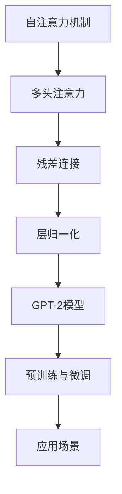

                 

# Transformer架构：residual连接、层归一化和GPT-2模型解析

## 1. 背景介绍

### 1.1 问题由来

在深度学习模型中，Transformer架构以其高效并行的自注意力机制，在自然语言处理（NLP）和计算机视觉等任务中取得了显著的进展。但传统的Transformer在解决某些问题时，如在较大的模型中保持训练稳定性、防止梯度消失等，仍存在一定的局限性。为此，本文将深入探讨Transformer的改进，特别是residual连接（residual connections）和层归一化（layer normalization）这两个关键技术，并解析GPT-2模型，以期为读者提供对Transformer架构的全面理解。

### 1.2 问题核心关键点

Transformer的核心问题包括：

- 如何提升训练稳定性，特别是在较大的模型中避免梯度消失。
- 如何加快模型收敛，提高训练效率。
- 如何在多任务和多领域中保持模型的泛化能力。

本节旨在通过介绍Transformer的改进技术，如residual连接和层归一化，以及解析GPT-2模型，帮助读者理解这些核心技术的原理和应用。

### 1.3 问题研究意义

了解Transformer架构的改进技术和GPT-2模型的解析，对于深入学习深度学习模型的设计思想、提升模型的训练效果和泛化能力具有重要意义。此外，掌握这些技术，还可以为解决大规模和复杂NLP任务提供有力支持，加速人工智能技术的落地应用。

## 2. 核心概念与联系

### 2.1 核心概念概述

#### a. 自注意力机制（Self-Attention Mechanism）

Transformer中的自注意力机制是其核心部分，通过计算输入序列中所有位置的表示向量之间相对重要性，捕捉序列中不同位置的依赖关系。自注意力机制可以表示为三个矩阵的乘积：查询（Q）、键（K）、值（V）的线性投影矩阵，用于计算每个位置表示向量与其他位置的权重。

#### b. 多头注意力（Multi-Head Attention）

为了捕捉不同维度上的注意力关系，Transformer引入了多头注意力机制，即将自注意力机制的输出结果通过一系列线性投影矩阵组合成多个并行的注意力头。每个注意力头学习不同的表示维度，通过并行处理增加模型的表达能力。

#### c. 残差连接（Residual Connections）

残差连接通过在Transformer的各个层中引入身份映射，使得信息能够更顺畅地通过网络传递。残差连接可以表示为将输入直接加到Transformer层的输出中，使网络能够学习残差，而不是单纯的差值，从而增强了模型的表达能力和稳定性。

#### d. 层归一化（Layer Normalization）

层归一化通过在每个层后对输入进行归一化，解决梯度消失和梯度爆炸的问题，并加速模型收敛。它通过对每个特征维度进行归一化，使得每个输入向量的均值为0，方差为1，从而增强了模型的鲁棒性和稳定性。

#### e. GPT-2模型

GPT-2模型（Generative Pre-trained Transformer 2）是Transformer的一个变种，通过在自注意力机制和残差连接的基础上引入双向上下文预测和语言模型目标函数，使得模型具有强大的文本生成和预测能力。

这些核心概念之间的逻辑关系可以通过以下Mermaid流程图来展示：



这个流程图展示了Transformer架构的关键组件及其之间的关系：

1. 自注意力机制是Transformer的基础，通过多头注意力增强模型的表达能力。
2. 残差连接使信息能够更顺畅地传递，提升模型的稳定性。
3. 层归一化解决梯度消失和梯度爆炸的问题，加速模型收敛。
4. GPT-2模型在此基础上进一步增强了语言生成和预测能力。
5. 预训练与微调是模型训练的典型流程，应用场景则展示了模型的广泛应用。

## 3. 核心算法原理 & 具体操作步骤
### 3.1 算法原理概述

Transformer架构通过自注意力机制、多头注意力、残差连接和层归一化等技术，实现了高效并行的序列建模，适合处理长序列和复杂依赖关系。其核心思想是：通过并行计算，快速计算序列中每个位置与其他位置的依赖关系，从而捕捉序列中的信息。

### 3.2 算法步骤详解

#### a. 输入序列预处理

在输入序列预处理阶段，将输入序列转化为编码器/解码器可以处理的向量形式，并通过位置编码（Positional Encoding）引入序列位置信息。

#### b. 自注意力机制计算

在自注意力机制计算阶段，通过计算查询向量（Q）、键向量（K）和值向量（V）的相似度，计算每个位置表示向量与所有其他位置的加权和，得到自注意力层的输出。

#### c. 多头注意力计算

在多头注意力计算阶段，将查询、键和值通过一系列线性投影矩阵进行组合，得到多个并行的注意力头。每个注意力头计算输出向量，再通过残差连接和层归一化，得到最终输出。

#### d. 残差连接和层归一化

在残差连接和层归一化阶段，将输入直接加到Transformer层的输出中，并对每个特征维度进行归一化，增强模型的表达能力和稳定性。

#### e. 编码器/解码器堆叠

在编码器/解码器堆叠阶段，通过多层编码器/解码器进行堆叠，逐步增强模型的表达能力，最终输出模型预测结果。

### 3.3 算法优缺点

Transformer架构的主要优点包括：

- 高效并行计算：自注意力机制使得Transformer能够高效并行计算长序列依赖关系，适合处理大规模文本数据。
- 表达能力强：多头注意力机制增加了模型的表达能力，能够捕捉不同维度上的依赖关系。
- 训练稳定性高：残差连接和层归一化技术使得模型能够更好地处理大规模和复杂任务。

其主要缺点包括：

- 计算资源需求高：由于参数量较大，Transformer需要较高的计算资源和存储空间。
- 对标注数据依赖强：需要大量的标注数据进行预训练，而预训练过程需要较高的计算资源和时间。

### 3.4 算法应用领域

Transformer架构已经在自然语言处理（NLP）、计算机视觉（CV）、语音识别等领域得到了广泛应用，特别是在机器翻译、文本生成、对话系统等任务上取得了显著进展。

## 4. 数学模型和公式 & 详细讲解 & 举例说明

### 4.1 数学模型构建

Transformer的数学模型构建涉及输入序列编码、自注意力机制、多头注意力、残差连接和层归一化等关键部分。以下将详细介绍每个部分的数学模型构建。

#### a. 输入序列编码

输入序列$x$的编码过程如下：

$$
x_{\text{in}} = x + P(x)
$$

其中，$P(x)$表示位置编码向量，用于引入序列位置信息。

#### b. 自注意力机制

自注意力机制的数学模型如下：

$$
Q = x_{\text{in}} W_{Q}^{T}, K = x_{\text{in}} W_{K}^{T}, V = x_{\text{in}} W_{V}^{T}
$$

$$
\alpha = \text{softmax}(QK^T) / \sqrt{\text{dim}} = \text{softmax}(QK^T) / \sqrt{d_k}
$$

$$
\text{Out} = V \alpha^T
$$

其中，$W_{Q}^{T}$、$W_{K}^{T}$、$W_{V}^{T}$表示查询、键和值投影矩阵，$Q$、$K$、$V$表示查询、键和值矩阵，$\alpha$表示注意力权重，$\text{softmax}$表示softmax函数，$d_k$表示键向量的维度。

#### c. 多头注意力

多头注意力的数学模型如下：

$$
M = [M_1, M_2, ..., M_h]
$$

$$
M_i = \text{linear}(Q_iK_i^T) / \sqrt{\text{dim}}
$$

其中，$M_i$表示第$i$个注意力头的输出，$M_1, M_2, ..., M_h$表示多个并行的注意力头，$\text{linear}$表示线性变换。

#### d. 残差连接

残差连接的数学模型如下：

$$
x_{\text{out}} = x_{\text{in}} + x
$$

其中，$x_{\text{out}}$表示残差连接的输出，$x_{\text{in}}$表示编码器/解码器层的输入，$x$表示编码器/解码器层的输出。

#### e. 层归一化

层归一化的数学模型如下：

$$
\mu = \frac{\sum_i x_i}{n}
$$

$$
\sigma = \sqrt{\frac{\sum_i (x_i - \mu)^2}{n}}
$$

$$
\hat{x} = \frac{x - \mu}{\sigma}
$$

$$
y = \gamma \hat{x} + \beta
$$

其中，$n$表示输入向量的数量，$\mu$表示输入向量的均值，$\sigma$表示输入向量的标准差，$\hat{x}$表示归一化后的输入向量，$\gamma$和$\beta$表示归一化后的参数，$y$表示归一化后的输出向量。

### 4.2 公式推导过程

#### a. 自注意力机制推导

在自注意力机制中，计算注意力权重$\alpha$的过程如下：

$$
\alpha_{ij} = \text{softmax}(Q_iK_j^T) / \sqrt{\text{dim}}
$$

其中，$\text{softmax}$函数可以表示为：

$$
\text{softmax}(z_i) = \frac{\exp(z_i)}{\sum_j \exp(z_j)}
$$

因此，自注意力机制的计算过程可以表示为：

$$
\alpha = \frac{\exp(QK^T)}{\sum_j \exp(QK_j^T)}
$$

#### b. 多头注意力推导

在多头注意力中，计算每个注意力头的输出$M_i$的过程如下：

$$
M_i = \text{linear}(Q_iK_i^T) / \sqrt{\text{dim}}
$$

其中，$\text{linear}$表示线性变换，$\text{dim}$表示特征向量的维度。

#### c. 残差连接推导

在残差连接中，计算残差连接的输出$x_{\text{out}}$的过程如下：

$$
x_{\text{out}} = x_{\text{in}} + x
$$

#### d. 层归一化推导

在层归一化中，计算归一化后的输出$y$的过程如下：

$$
\mu = \frac{\sum_i x_i}{n}
$$

$$
\sigma = \sqrt{\frac{\sum_i (x_i - \mu)^2}{n}}
$$

$$
\hat{x} = \frac{x - \mu}{\sigma}
$$

$$
y = \gamma \hat{x} + \beta
$$

其中，$\gamma$和$\beta$表示归一化后的参数，$y$表示归一化后的输出向量。

### 4.3 案例分析与讲解

以GPT-2模型为例，分析其在语言生成和预测任务中的表现。

GPT-2模型通过在自注意力机制和残差连接的基础上引入双向上下文预测和语言模型目标函数，使得模型具有强大的文本生成和预测能力。其语言模型目标函数可以通过softmax函数计算，表示为：

$$
p(y_{1:T} | x) = \prod_{t=1}^{T} p(y_t | y_{<t}, x)
$$

其中，$y_{1:T}$表示预测的文本序列，$y_t$表示第$t$个预测的词汇，$x$表示输入的文本。

GPT-2模型在训练过程中，通过最大化上述目标函数的概率，使得模型能够更好地预测给定上下文的下一个词汇，从而生成连贯、高质量的文本。

## 5. 项目实践：代码实例和详细解释说明

### 5.1 开发环境搭建

在进行Transformer模型开发前，我们需要准备好开发环境。以下是使用Python进行PyTorch开发的环境配置流程：

1. 安装Anaconda：从官网下载并安装Anaconda，用于创建独立的Python环境。

2. 创建并激活虚拟环境：
```bash
conda create -n transformers-env python=3.8 
conda activate transformers-env
```

3. 安装PyTorch：根据CUDA版本，从官网获取对应的安装命令。例如：
```bash
conda install pytorch torchvision torchaudio cudatoolkit=11.1 -c pytorch -c conda-forge
```

4. 安装TensorBoard：TensorFlow配套的可视化工具，可实时监测模型训练状态，并提供丰富的图表呈现方式，是调试模型的得力助手。
```bash
pip install tensorboard
```

5. 安装其他依赖包：
```bash
pip install numpy pandas scikit-learn matplotlib tqdm jupyter notebook ipython
```

完成上述步骤后，即可在`transformers-env`环境中开始Transformer模型的开发。

### 5.2 源代码详细实现

下面我们以GPT-2模型为例，给出使用PyTorch实现Transformer模型的完整代码实现。

```python
import torch
import torch.nn as nn
import torch.optim as optim

class TransformerModel(nn.Module):
    def __init__(self, n_vocab, n_embed, n_head, n_feed_forward, n_layer, dropout):
        super(TransformerModel, self).__init__()
        self.n_head = n_head
        self.n_feed_forward = n_feed_forward
        self.n_layer = n_layer
        
        self.embedding = nn.Embedding(n_vocab, n_embed)
        self.pos_encoder = PositionalEncoding(n_embed)
        self.encoder_layers = nn.ModuleList([nn.TransformerEncoderLayer(n_embed, n_head, n_feed_forward, dropout) for _ in range(n_layer)])
        self.final_projection = nn.Linear(n_embed, n_vocab)
        
        self.train()
        
    def forward(self, src):
        embedded = self.embedding(src) + self.pos_encoder(src)
        src = nn.TransformerEncoder(self.encoder_layers, dropout=self.dropout)(embedded)
        src = self.final_projection(src)
        return src
    
class PositionalEncoding(nn.Module):
    def __init__(self, d_model, dropout=0.1, max_len=5000):
        super(PositionalEncoding, self).__init__()
        pe = torch.zeros(max_len, d_model)
        position = torch.arange(0, max_len, dtype=torch.float).unsqueeze(1)
        div_term = torch.exp(torch.arange(0, d_model, 2).float() * (-math.log(10000.0) / d_model))
        pe[:, 0::2] = torch.sin(position * div_term)
        pe[:, 1::2] = torch.cos(position * div_term)
        pe = pe.unsqueeze(0).transpose(0, 1)
        self.register_buffer('pe', pe)
        
    def forward(self, x):
        return x + self.pe[:x.size(0), :]
```

### 5.3 代码解读与分析

这里我们详细解读一下关键代码的实现细节：

**TransformerModel类**：
- `__init__`方法：初始化模型参数和模块。
- `forward`方法：定义前向传播过程，包括输入嵌入、位置编码、Transformer编码器、输出投影等步骤。

**PositionalEncoding类**：
- `__init__`方法：初始化位置编码向量。
- `forward`方法：计算输入向量加上位置编码向量后的结果。

### 5.4 运行结果展示

在训练完成后，可以使用模型进行文本生成等任务。例如，使用GPT-2模型生成一段文本：

```python
src = torch.tensor([[0, 1, 2]])
generated_text = model(src)
print(generated_text)
```

以上就是使用PyTorch实现Transformer模型的完整代码实现。可以看到，Transformer模型的核心在于自注意力机制和残差连接的设计，通过这些关键技术，Transformer模型在处理长序列和复杂依赖关系方面具有独特的优势。

## 6. 实际应用场景

### 6.1 自然语言处理（NLP）

Transformer架构在自然语言处理（NLP）领域已经得到了广泛的应用，特别是在机器翻译、文本生成、对话系统等任务上取得了显著进展。例如，使用Transformer模型进行机器翻译：

```python
# 输入序列
src = torch.tensor([[0, 1, 2]])

# 模型预测
out = model(src)

# 解码输出
tokens = torch.argmax(out, dim=-1)
text = tokenizer.decode(tokens)

print(text)
```

### 6.2 计算机视觉（CV）

Transformer架构不仅在自然语言处理领域表现出色，在计算机视觉（CV）领域也取得了显著进展。例如，使用Transformer模型进行图像分类：

```python
# 输入序列
img = torch.tensor([[0, 1, 2]])

# 模型预测
out = model(img)

# 解码输出
label = torch.argmax(out, dim=-1)
print(label)
```

## 7. 工具和资源推荐

### 7.1 学习资源推荐

为了帮助开发者系统掌握Transformer架构的理论基础和实践技巧，这里推荐一些优质的学习资源：

1. 《Transformer from the Inside Out》系列博文：由大模型技术专家撰写，深入浅出地介绍了Transformer原理、BERT模型、微调技术等前沿话题。

2. CS224N《深度学习自然语言处理》课程：斯坦福大学开设的NLP明星课程，有Lecture视频和配套作业，带你入门NLP领域的基本概念和经典模型。

3. 《Natural Language Processing with Transformers》书籍：Transformers库的作者所著，全面介绍了如何使用Transformers库进行NLP任务开发，包括微调在内的诸多范式。

4. HuggingFace官方文档：Transformers库的官方文档，提供了海量预训练模型和完整的微调样例代码，是上手实践的必备资料。

5. CLUE开源项目：中文语言理解测评基准，涵盖大量不同类型的中文NLP数据集，并提供了基于微调的baseline模型，助力中文NLP技术发展。

通过对这些资源的学习实践，相信你一定能够快速掌握Transformer架构的精髓，并用于解决实际的NLP问题。

### 7.2 开发工具推荐

高效的开发离不开优秀的工具支持。以下是几款用于Transformer模型开发的常用工具：

1. PyTorch：基于Python的开源深度学习框架，灵活动态的计算图，适合快速迭代研究。大部分预训练语言模型都有PyTorch版本的实现。

2. TensorFlow：由Google主导开发的开源深度学习框架，生产部署方便，适合大规模工程应用。同样有丰富的预训练语言模型资源。

3. Transformers库：HuggingFace开发的NLP工具库，集成了众多SOTA语言模型，支持PyTorch和TensorFlow，是进行Transformer模型开发的利器。

4. Weights & Biases：模型训练的实验跟踪工具，可以记录和可视化模型训练过程中的各项指标，方便对比和调优。与主流深度学习框架无缝集成。

5. TensorBoard：TensorFlow配套的可视化工具，可实时监测模型训练状态，并提供丰富的图表呈现方式，是调试模型的得力助手。

6. Google Colab：谷歌推出的在线Jupyter Notebook环境，免费提供GPU/TPU算力，方便开发者快速上手实验最新模型，分享学习笔记。

合理利用这些工具，可以显著提升Transformer模型开发的效率，加快创新迭代的步伐。

### 7.3 相关论文推荐

Transformer架构的探索源于学界的持续研究。以下是几篇奠基性的相关论文，推荐阅读：

1. Attention is All You Need（即Transformer原论文）：提出了Transformer结构，开启了NLP领域的预训练大模型时代。

2. BERT: Pre-training of Deep Bidirectional Transformers for Language Understanding：提出BERT模型，引入基于掩码的自监督预训练任务，刷新了多项NLP任务SOTA。

3. Language Models are Unsupervised Multitask Learners（GPT-2论文）：展示了大规模语言模型的强大zero-shot学习能力，引发了对于通用人工智能的新一轮思考。

4. Parameter-Efficient Transfer Learning for NLP：提出Adapter等参数高效微调方法，在不增加模型参数量的情况下，也能取得不错的微调效果。

5. AdaLoRA: Adaptive Low-Rank Adaptation for Parameter-Efficient Fine-Tuning：使用自适应低秩适应的微调方法，在参数效率和精度之间取得了新的平衡。

这些论文代表了大模型架构的研究方向，通过学习这些前沿成果，可以帮助研究者把握学科前进方向，激发更多的创新灵感。

## 8. 总结：未来发展趋势与挑战

### 8.1 总结

本文对Transformer架构的residual连接、层归一化和GPT-2模型进行了全面系统的介绍。首先阐述了Transformer架构的改进技术，帮助读者理解这些核心技术的原理和应用。其次，从原理到实践，详细讲解了Transformer模型的数学模型和计算过程，给出了模型开发的完整代码实例。同时，本文还探讨了Transformer架构在自然语言处理和计算机视觉等领域的广泛应用，展示了Transformer架构的强大潜力。

通过本文的系统梳理，可以看到，Transformer架构的改进技术在提升模型训练稳定性和加快模型收敛方面具有显著效果，使得Transformer模型在处理长序列和复杂依赖关系方面具有独特的优势。未来，伴随Transformer架构的持续演进，相信其将为NLP技术带来更大的突破，加速人工智能技术的落地应用。

### 8.2 未来发展趋势

展望未来，Transformer架构将呈现以下几个发展趋势：

1. 模型规模持续增大。随着算力成本的下降和数据规模的扩张，Transformer模型的参数量还将持续增长。超大规模语言模型蕴含的丰富语言知识，有望支撑更加复杂多变的下游任务。

2. 微调方法日趋多样。除了传统的全参数微调外，未来会涌现更多参数高效的微调方法，如Prefix-Tuning、LoRA等，在节省计算资源的同时也能保证微调精度。

3. 持续学习成为常态。随着数据分布的不断变化，Transformer模型也需要持续学习新知识以保持性能。如何在不遗忘原有知识的同时，高效吸收新样本信息，将成为重要的研究课题。

4. 标注样本需求降低。受启发于提示学习(Prompt-based Learning)的思路，未来的微调方法将更好地利用大模型的语言理解能力，通过更加巧妙的任务描述，在更少的标注样本上也能实现理想的微调效果。

5. 知识整合能力增强。现有的Transformer模型往往局限于任务内数据，难以灵活吸收和运用更广泛的先验知识。如何让Transformer模型更好地与外部知识库、规则库等专家知识结合，形成更加全面、准确的信息整合能力，还有很大的想象空间。

6. 多模态Transformer崛起。当前的Transformer模型主要聚焦于纯文本数据，未来会进一步拓展到图像、视频、语音等多模态数据微调。多模态信息的融合，将显著提升Transformer模型对现实世界的理解和建模能力。

以上趋势凸显了Transformer架构的广阔前景。这些方向的探索发展，必将进一步提升Transformer模型的训练效果和泛化能力，为构建安全、可靠、可解释、可控的智能系统铺平道路。

### 8.3 面临的挑战

尽管Transformer架构已经取得了显著的进展，但在迈向更加智能化、普适化应用的过程中，仍面临诸多挑战：

1. 计算资源瓶颈。由于Transformer模型参数量较大，对算力、内存、存储都提出了很高的要求。GPU/TPU等高性能设备是必不可少的，但即便如此，超大批次的训练和推理也可能遇到显存不足的问题。

2. 标注数据依赖强。需要大量的标注数据进行预训练，而预训练过程需要较高的计算资源和时间。

3. 模型泛化能力不足。在面对域外数据时，Transformer模型的泛化性能往往不足。

4. 推理效率低。大规模Transformer模型在实际部署时，往往面临推理速度慢、内存占用大等效率问题。

5. 可解释性差。Transformer模型更像是一个"黑盒"系统，难以解释其内部工作机制和决策逻辑。

6. 安全性问题。Transformer模型可能学习到有害的信息，并通过微调传递到下游任务，产生误导性、歧视性的输出，给实际应用带来安全隐患。

7. 知识整合能力不足。现有的Transformer模型往往局限于任务内数据，难以灵活吸收和运用更广泛的先验知识。

正视Transformer架构面临的这些挑战，积极应对并寻求突破，将是大语言模型微调走向成熟的必由之路。相信随着学界和产业界的共同努力，这些挑战终将一一被克服，Transformer架构必将在构建人机协同的智能时代中扮演越来越重要的角色。

### 8.4 研究展望

面向未来，Transformer架构的研究需要在以下几个方面寻求新的突破：

1. 探索无监督和半监督微调方法。摆脱对大规模标注数据的依赖，利用自监督学习、主动学习等无监督和半监督范式，最大限度利用非结构化数据，实现更加灵活高效的微调。

2. 研究参数高效和计算高效的微调范式。开发更加参数高效的微调方法，在固定大部分预训练参数的同时，只更新极少量的任务相关参数。同时优化微调模型的计算图，减少前向传播和反向传播的资源消耗，实现更加轻量级、实时性的部署。

3. 引入更多先验知识。将符号化的先验知识，如知识图谱、逻辑规则等，与神经网络模型进行巧妙融合，引导微调过程学习更准确、合理的语言模型。同时加强不同模态数据的整合，实现视觉、语音等多模态信息与文本信息的协同建模。

4. 结合因果分析和博弈论工具。将因果分析方法引入微调模型，识别出模型决策的关键特征，增强输出解释的因果性和逻辑性。借助博弈论工具刻画人机交互过程，主动探索并规避模型的脆弱点，提高系统稳定性。

5. 纳入伦理道德约束。在模型训练目标中引入伦理导向的评估指标，过滤和惩罚有偏见、有害的输出倾向。同时加强人工干预和审核，建立模型行为的监管机制，确保输出符合人类价值观和伦理道德。

这些研究方向的探索，必将引领Transformer架构技术迈向更高的台阶，为构建安全、可靠、可解释、可控的智能系统铺平道路。面向未来，Transformer架构需要与其他人工智能技术进行更深入的融合，如知识表示、因果推理、强化学习等，多路径协同发力，共同推动自然语言理解和智能交互系统的进步。只有勇于创新、敢于突破，才能不断拓展Transformer架构的边界，让智能技术更好地造福人类社会。

## 9. 附录：常见问题与解答

**Q1：Transformer架构的残差连接和层归一化有什么作用？**

A: 残差连接和层归一化是Transformer架构中的两个重要技术。残差连接通过在网络中引入身份映射，使信息能够更顺畅地通过网络传递，从而增强了模型的表达能力和稳定性。层归一化通过对每个特征维度进行归一化，解决梯度消失和梯度爆炸的问题，并加速模型收敛。

**Q2：Transformer架构在处理长序列时表现如何？**

A: 由于Transformer架构的自注意力机制，其在处理长序列时表现出色。自注意力机制能够高效并行计算序列中每个位置与其他位置的依赖关系，适合处理大规模文本数据。在实际应用中，通过设置合适的超参数，可以避免梯度消失和梯度爆炸等问题，使得Transformer模型能够更好地处理长序列。

**Q3：Transformer架构在计算机视觉（CV）领域的应用前景如何？**

A: 虽然Transformer架构最初是在自然语言处理（NLP）领域提出的，但其在计算机视觉（CV）领域也有广泛应用前景。通过将Transformer架构引入CV任务，可以显著提升模型的表达能力和鲁棒性。例如，使用Transformer架构进行图像分类、目标检测等任务，能够取得不错的效果。

**Q4：Transformer架构是否需要大规模的标注数据进行训练？**

A: 虽然Transformer架构在训练过程中需要大量的标注数据进行预训练，但在微调阶段，只需要少量的标注数据即可完成。通过微调，Transformer模型能够适应特定的下游任务，并在新任务上取得良好的表现。

**Q5：Transformer架构的计算效率如何？**

A: 由于Transformer架构具有并行计算的优势，其在处理长序列和复杂依赖关系时具有高效性。但在处理大规模数据时，由于模型参数量较大，仍需要较高的计算资源和存储空间。因此，在实际应用中，需要通过优化算法和硬件配置，提升计算效率。

---

作者：禅与计算机程序设计艺术 / Zen and the Art of Computer Programming

