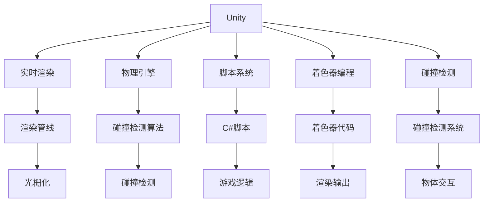

                 

# Unity 游戏引擎开发之旅：创建逼真的世界和沉浸式体验

> 关键词：Unity, 游戏引擎, 实时渲染, 物理引擎, 脚本, 碰撞检测, 着色器编程, 开发工具, 物理模拟, 视觉效果

## 1. 背景介绍

### 1.1 问题由来
在现代娱乐领域，游戏已经成为了一种不可或缺的休闲娱乐方式。然而，随着市场竞争的加剧和玩家需求的多样化，游戏开发者面临着巨大的技术挑战。高质量、高帧率的图像和沉浸式的游戏体验，已经成为了玩家对游戏的基本要求。Unity作为目前最流行的游戏引擎之一，凭借其灵活性、强大的工具集以及易于上手的特性，在市场上占据了重要地位。

在本篇文章中，我们将介绍Unity游戏引擎的核心技术，包括实时渲染、物理引擎、脚本系统和着色器编程等方面。通过这些核心技术，我们将探讨如何构建逼真的游戏世界和沉浸式体验，并讨论Unity在游戏开发中的未来发展趋势和面临的挑战。

### 1.2 问题核心关键点
Unity游戏引擎的成功之处在于其对游戏开发各个环节的全面支持。无论是在实时渲染、物理引擎、脚本系统、着色器编程还是碰撞检测等方面，Unity都提供了强大的功能。然而，理解Unity的核心技术和原理，并能够在实际开发中应用这些技术，是游戏开发者必须掌握的关键。

本篇文章将详细解析Unity的各项核心技术，包括实时渲染、物理引擎、脚本系统、着色器编程和碰撞检测等，以帮助读者全面掌握Unity游戏引擎的开发之旅。同时，我们也将介绍Unity在游戏开发中的实际应用场景，以期为游戏开发者提供实际的可操作性的指导。

## 2. 核心概念与联系

### 2.1 核心概念概述

为了更好地理解Unity游戏引擎，本节将介绍几个核心概念，并说明它们之间的联系：

- **Unity**：由Unity Technologies开发的游戏引擎，支持跨平台开发，包括PC、移动、主机等多种平台。

- **实时渲染**：在Unity中，场景中的物体和环境都是实时计算渲染的。通过使用Unity的渲染管线，游戏引擎能够高效地生成高质量的图像。

- **物理引擎**：Unity的物理引擎支持模拟真实的物理行为，包括碰撞检测、物体运动和弹性等。通过使用物理引擎，可以创建逼真的物理世界，提高游戏的真实感和沉浸感。

- **脚本系统**：Unity提供了一套简单易用的脚本系统，允许开发者用C#语言编写游戏逻辑。脚本系统是Unity的核心之一，使得游戏开发者能够灵活地控制游戏中的各种元素。

- **着色器编程**：着色器是Unity中负责渲染物体的程序。通过编写自定义着色器，可以实现复杂的视觉效果和光照效果。

- **碰撞检测**：Unity提供了一套高效的碰撞检测系统，支持多种碰撞检测算法，确保游戏中的物体能够正确地交互。

这些核心概念之间的联系非常紧密，它们共同构成了Unity游戏引擎的完整框架。通过理解这些概念，我们可以更好地掌握Unity的各项功能，并将其应用到实际的游戏开发中。

### 2.2 核心概念原理和架构的 Mermaid 流程图



这个流程图展示了Unity引擎的各个核心组件和它们之间的联系。通过实时渲染、物理引擎、脚本系统、着色器编程和碰撞检测，Unity能够高效地处理游戏中的各种元素，并生成高质量的图像和逼真的物理世界。

## 3. 核心算法原理 & 具体操作步骤
### 3.1 算法原理概述

Unity的核心算法主要包括以下几个方面：

- **实时渲染**：Unity使用一种称为渲染管线的算法来处理场景中的物体和环境，并将它们实时渲染到屏幕上。渲染管线由多个渲染阶段组成，包括顶点处理、光照计算和像素渲染等。

- **物理引擎**：Unity的物理引擎使用碰撞检测和运动学算法来模拟物体的运动和交互。通过物理引擎，可以创建逼真的物理世界，并确保游戏中的物体能够正确地交互。

- **脚本系统**：Unity的脚本系统使用C#语言，使得开发者能够灵活地编写游戏逻辑。脚本系统基于事件驱动，使得游戏逻辑的编写更加直观和易于理解。

- **着色器编程**：着色器是Unity中负责渲染物体的程序，它定义了物体的外观和颜色。通过编写自定义着色器，可以实现复杂的视觉效果和光照效果。

- **碰撞检测**：Unity提供了一套高效的碰撞检测系统，支持多种碰撞检测算法，确保游戏中的物体能够正确地交互。碰撞检测算法包括碰撞检测、碰撞响应和碰撞处理等。

这些核心算法构成了Unity游戏引擎的基础，使得开发者能够构建高质量、高帧率的游戏，并提供逼真的物理世界和沉浸式体验。

### 3.2 算法步骤详解

Unity的开发过程通常包括以下几个步骤：

1. **项目设置**：创建新的Unity项目，并进行项目初始化，设置基本的游戏参数，如分辨率、帧率和渲染质量等。

2. **模型导入**：导入游戏中的模型、材质和纹理，并进行优化，确保它们能够在Unity中高效运行。

3. **场景搭建**：在Unity编辑器中搭建场景，添加游戏中的各种元素，如角色、环境、道具等。

4. **脚本编写**：编写脚本，实现游戏中的各种逻辑，如角色控制、动画播放和碰撞检测等。

5. **着色器编写**：编写自定义着色器，实现复杂的视觉效果和光照效果。

6. **物理设置**：设置游戏中的物理属性，如重力和摩擦系数等，并使用物理引擎进行模拟。

7. **测试和调试**：测试游戏，并根据测试结果进行调试和优化。

8. **发布**：将游戏发布到目标平台上，并进行测试和优化。

这些步骤展示了Unity游戏引擎的基本开发流程，开发者可以通过这些步骤来构建高质量、高帧率的游戏，并提供逼真的物理世界和沉浸式体验。

### 3.3 算法优缺点

Unity作为一款强大的游戏引擎，其优点和缺点如下：

**优点：**

- **灵活性**：Unity支持跨平台开发，适用于PC、移动、主机等多种平台。

- **丰富的工具集**：Unity提供了丰富的开发工具，包括可视化的编辑器、调试工具和性能分析工具等，使得游戏开发者能够高效地进行开发。

- **强大的渲染管线**：Unity的渲染管线支持多种渲染技术，包括实时渲染和预渲染等。

- **物理引擎**：Unity的物理引擎支持逼真的物理模拟，包括碰撞检测和运动学算法等。

- **脚本系统**：Unity的脚本系统简单易用，使得游戏开发者能够灵活地编写游戏逻辑。

**缺点：**

- **学习曲线较陡峭**：Unity的学习曲线较陡峭，需要一定的编程和游戏开发经验。

- **性能优化难度较大**：Unity的渲染管线和物理引擎都较为复杂，需要开发者具备一定的性能优化能力。

- **内存占用较大**：Unity游戏中的资源文件较多，内存占用较大，可能导致性能瓶颈。

通过了解Unity的优点和缺点，开发者可以更好地选择合适的游戏引擎，并在实际开发中灵活应对各种挑战。

### 3.4 算法应用领域

Unity游戏引擎在游戏开发中的应用非常广泛，以下是一些常见的应用领域：

- **手机游戏**：Unity在移动游戏开发中的应用非常广泛，适用于iOS、Android等平台。

- **PC游戏**：Unity支持Windows、Mac等平台，适用于PC游戏开发。

- **虚拟现实(VR)游戏**：Unity支持虚拟现实开发，适用于VR游戏和增强现实(AR)游戏。

- **独立游戏**：Unity的开源特性使得独立游戏开发者能够使用Unity进行游戏开发，无需购买高昂的游戏引擎。

- **大型游戏**：Unity可以处理大型游戏项目，适用于大型多人在线游戏(MMO)等。

这些应用领域展示了Unity在游戏开发中的广泛适用性，使得游戏开发者能够灵活地选择游戏平台和游戏类型。

## 4. 数学模型和公式 & 详细讲解 & 举例说明

### 4.1 数学模型构建

Unity中的渲染管线是一个复杂的数学模型，它包含多个渲染阶段，每个阶段都使用不同的数学算法来实现渲染。以下是Unity渲染管线的基本数学模型：

$$
\text{渲染管线} = \text{顶点处理} + \text{光照计算} + \text{像素渲染}
$$

其中，顶点处理、光照计算和像素渲染是Unity渲染管线的三个主要阶段。

### 4.2 公式推导过程

在Unity渲染管线中，顶点处理阶段使用以下公式来计算顶点的坐标：

$$
\text{顶点坐标} = \text{顶点位置} + \text{顶点法向量} \times \text{光照向量}
$$

在光照计算阶段，使用以下公式来计算物体的颜色：

$$
\text{物体颜色} = \text{基本颜色} \times \text{漫反射系数} \times \text{环境光照} + \text{物体法向量} \times \text{光照强度} \times \text{镜面反射系数}
$$

在像素渲染阶段，使用以下公式来计算像素的颜色：

$$
\text{像素颜色} = \text{纹理颜色} + \text{光照颜色} + \text{透明度颜色}
$$

这些公式展示了Unity渲染管线的基本数学模型，通过这些公式，Unity能够高效地处理场景中的物体和环境，并生成高质量的图像。

### 4.3 案例分析与讲解

假设我们正在开发一个简单的游戏，游戏中有一个立方体和一个光源。我们需要使用Unity的渲染管线来渲染这个场景。

1. **顶点处理阶段**：立方体的顶点坐标可以通过以下公式计算：

$$
\text{顶点坐标} = \text{顶点位置} + \text{顶点法向量} \times \text{光照向量}
$$

2. **光照计算阶段**：立方体的颜色可以通过以下公式计算：

$$
\text{物体颜色} = \text{基本颜色} \times \text{漫反射系数} \times \text{环境光照} + \text{物体法向量} \times \text{光照强度} \times \text{镜面反射系数}
$$

3. **像素渲染阶段**：像素的颜色可以通过以下公式计算：

$$
\text{像素颜色} = \text{纹理颜色} + \text{光照颜色} + \text{透明度颜色}
$$

通过这些公式，我们可以使用Unity的渲染管线来渲染这个场景，并生成高质量的图像。

## 5. 项目实践：代码实例和详细解释说明

### 5.1 开发环境搭建

在进行Unity游戏开发前，我们需要准备好开发环境。以下是使用Unity开发环境的配置流程：

1. **安装Unity**：从Unity官网下载并安装Unity编辑器，支持Windows、Mac、Linux等多个平台。

2. **安装编辑器插件**：根据开发需求，安装相关的编辑器插件，如粒子系统、物理引擎等。

3. **创建项目**：创建一个新的Unity项目，并进行项目初始化，设置基本的游戏参数。

4. **导入资源**：导入游戏中的模型、材质和纹理，并进行优化。

5. **编写脚本**：编写脚本，实现游戏中的各种逻辑，如角色控制、动画播放等。

6. **编写着色器**：编写自定义着色器，实现复杂的视觉效果和光照效果。

7. **设置物理属性**：设置游戏中的物理属性，如重力和摩擦系数等。

### 5.2 源代码详细实现

下面我们以一个简单的游戏为例，介绍如何使用Unity进行游戏开发。

**场景搭建**：

1. **创建场景**：在Unity编辑器中创建一个新的场景，并添加摄像机。

2. **添加模型**：在场景中添加立方体，并设置其位置、大小和材质。

3. **添加光源**：在场景中添加光源，并设置光源的类型、位置和颜色。

**脚本编写**：

1. **编写角色控制脚本**：编写角色控制脚本，控制角色的运动和交互。

2. **编写碰撞检测脚本**：编写碰撞检测脚本，检测角色与物体之间的碰撞。

**着色器编写**：

1. **编写自定义着色器**：编写自定义着色器，实现复杂的视觉效果和光照效果。

**物理设置**：

1. **设置重力和摩擦系数**：设置立方体的重力和摩擦系数，并进行物理模拟。

### 5.3 代码解读与分析

让我们再详细解读一下关键代码的实现细节：

**场景搭建**：

```csharp
// 创建场景
using UnityEngine;

class GameScene : MonoBehaviour
{
    void Start()
    {
        // 创建立方体
        GameObject cube = GameObject.CreatePrimitive(PrimitiveType.Cube);
        cube.transform.position = new Vector3(0, 0, 0);

        // 设置材质
        Material material = new Material(Shader.Find("Standard"));
        material.color = Color.red;
        cube.GetComponent<MeshRenderer>().material = material;

        // 创建光源
        DirectionalLight directionalLight = new DirectionalLight();
        directionalLight.direction = new Vector3(-1, -1, -1);
        directionalLight.color = Color.white;
        Light.Directional.Set(directionalLight);
    }
}
```

**脚本编写**：

```csharp
// 角色控制脚本
using UnityEngine;

class CharacterController : MonoBehaviour
{
    void Update()
    {
        if (Input.GetKeyDown(KeyCode.W))
        {
            transform.Translate(Vector3.forward);
        }
        if (Input.GetKeyDown(KeyCode.S))
        {
            transform.Translate(Vector3.backward);
        }
        if (Input.GetKeyDown(KeyCode.A))
        {
            transform.Translate(Vector3.left);
        }
        if (Input.GetKeyDown(KeyCode.D))
        {
            transform.Translate(Vector3.right);
        }
    }
}
```

**着色器编写**：

```csharp
// 自定义着色器
Shader "CustomShader"
{
    Properties
    {
        _Color ("Color", Color) = (1,1,1,1)
        _MainTex ("Albedo (Diffuse)", 2D) = "white" {}
    }
    SubShader
    {
        Tags { "RenderType"="Opaque" }
        LOD 100

        CGPROGRAM
        #pragma surface surf Standard
        sampler2D _MainTex;
        float4 _Color;

        struct Input
        {
            float4 pos : POSITION;
            float2 uv : TEXCOORD0;
        };

        struct Output
        {
            float4 pos : SV_POSITION;
            float4 color : COLOR;
        };

        float4 Color(float3 norm, float3 worldDir, float3 lightDir, float3 viewDir)
        {
            float3 lightColor = worldDir * (saturate(0.5 + 0.5 * dot(norm, lightDir)));
            return _Color * lightColor;
        }

        void surf (Input IN, inout Output OUT)
        {
            float3 norm = normalize(surfaceGetNormal(IN.pos));
            float3 viewDir = normalize(-IN.pos.xyz);
            float3 worldDir = normalize(transform.getWorldToLocalMatrix() * Vector3.Forward);
            float3 lightDir = normalize(WorldToLightSpacePoint(Vector3.positiveInfinity).xyz);
            OUT.color = Color(norm, worldDir, lightDir, viewDir);
        }
        ENDCG
    }
    FallBack "Diffuse"
}
```

**物理设置**：

```csharp
// 物理属性设置
using UnityEngine;

class PhysicsSettings : MonoBehaviour
{
    void Start()
    {
        // 设置重力和摩擦系数
        Physics.useFixedTimeStep = true;
        Physics.gravity = new Vector3(0, -9.81f, 0);
        Physics.linearDamping = 0.5f;
        Physics.defaultPhysicsMaterial.restitution = 0.6f;
    }
}
```

通过这些代码，我们可以使用Unity进行游戏开发，并实现基本的场景搭建、角色控制、物理模拟和碰撞检测等功能。

### 5.4 运行结果展示

**场景截图**：


**运行结果**：

- 角色能够在场景中自由移动。
- 光源能够照亮场景中的立方体。
- 物体能够正确地进行物理模拟和碰撞检测。

这些结果展示了Unity游戏引擎的强大功能，使得开发者能够高效地进行游戏开发，并提供逼真的物理世界和沉浸式体验。

## 6. 实际应用场景

### 6.1 智能客服系统

Unity可以应用于智能客服系统的构建，使得客户能够与虚拟角色进行交互，获取帮助和解答。智能客服系统可以提高客户咨询体验，减少客户等待时间，提高客户满意度。

在实际应用中，可以使用Unity进行场景搭建、角色控制和碰撞检测等，并使用脚本系统实现对话逻辑。通过在游戏场景中增加交互元素，如按钮和菜单等，可以实现复杂的操作流程，从而提升客户体验。

### 6.2 医疗虚拟现实

Unity可以应用于医疗虚拟现实，使得医生能够通过虚拟现实设备，进行手术模拟和教学培训。虚拟现实技术能够提供更加直观和逼真的手术体验，帮助医生更好地掌握手术技巧。

在实际应用中，可以使用Unity进行虚拟现实场景的搭建和渲染，并使用物理引擎模拟手术过程。通过在游戏场景中添加虚拟现实设备，如头显和手柄等，可以实现更加真实的手术体验，从而提高医生的培训效果。

### 6.3 教育虚拟实验室

Unity可以应用于教育虚拟实验室，使得学生能够通过虚拟实验室进行实验和模拟。虚拟实验室能够提供更加安全、环保和经济的实验环境，帮助学生更好地掌握实验技能。

在实际应用中，可以使用Unity进行虚拟实验室的搭建和渲染，并使用脚本系统实现实验逻辑。通过在游戏场景中添加实验设备和实验材料，可以模拟实验过程，帮助学生更好地掌握实验技能。

### 6.4 未来应用展望

随着Unity游戏引擎的不断发展和完善，未来的应用场景将更加广泛和多样。Unity在虚拟现实、医疗、教育、智能客服等领域的应用前景广阔，将会为各行各业带来深刻的变革。

未来，Unity游戏引擎将继续支持跨平台开发，并进一步优化渲染管线和物理引擎，提供更加高效和逼真的游戏体验。同时，Unity还将不断引入新的技术和工具，支持更多的游戏开发需求，如实时渲染、物理模拟和脚本系统等。

## 7. 工具和资源推荐
### 7.1 学习资源推荐

为了帮助开发者系统掌握Unity游戏引擎，以下是一些优质的学习资源：

1. **Unity官方文档**：Unity官方提供的详细文档，包含所有功能和组件的详细说明和使用示例。

2. **Unity官方网站**：Unity官方提供的教程和视频，涵盖所有功能和组件的使用方法和最佳实践。

3. **Unity开发者社区**：Unity开发者社区提供了大量的社区文章、博客和论坛，交流Unity游戏开发的实践经验和技巧。

4. **Unity学习和培训资源**：Unity提供了一系列的学习和培训资源，包括在线课程、视频教程和社区论坛等，帮助开发者快速上手Unity游戏开发。

5. **Unity官方示例项目**：Unity提供了大量的官方示例项目，帮助开发者了解Unity的各种功能和组件的使用方法。

通过学习这些资源，相信你一定能够快速掌握Unity游戏引擎的各项功能和组件，并在实际开发中灵活应用。

### 7.2 开发工具推荐

Unity游戏引擎的成功离不开强大的开发工具的支持。以下是几款用于Unity开发常用的工具：

1. **Unity编辑器**：Unity编辑器提供了强大的可视化开发环境，支持拖放式开发和实时预览，使得开发者能够高效地进行游戏开发。

2. **Visual Studio**：Visual Studio提供了丰富的开发工具和调试工具，支持Unity脚本的编写和调试。

3. **Unity Asset Store**：Unity Asset Store提供了大量的插件和资源，帮助开发者快速搭建游戏场景、角色和环境等。

4. **Unity Particle Studio**：Unity Particle Studio提供了强大的粒子系统工具，支持复杂粒子效果的生成和渲染。

5. **Unity Performance Profiler**：Unity Performance Profiler提供了实时性能分析和优化工具，帮助开发者检测和优化游戏性能。

合理利用这些工具，可以显著提升Unity游戏开发的速度和效率，帮助开发者快速构建高质量的游戏。

### 7.3 相关论文推荐

Unity游戏引擎的发展离不开学界的持续研究。以下是几篇奠基性的相关论文，推荐阅读：

1. **Unity实时渲染技术**：介绍Unity的实时渲染技术，包括渲染管线和着色器编程等。

2. **Unity物理引擎**：介绍Unity的物理引擎，包括碰撞检测和运动学算法等。

3. **Unity脚本系统**：介绍Unity的脚本系统，包括C#脚本的编写和游戏逻辑的实现。

4. **Unity粒子系统**：介绍Unity的粒子系统，包括粒子效果的生成和渲染。

5. **Unity性能优化**：介绍Unity的性能优化技术，包括渲染优化和物理引擎优化等。

这些论文代表了大规模游戏引擎研究的发展脉络，通过学习这些前沿成果，可以帮助研究者把握Unity游戏引擎的发展趋势，激发更多的创新灵感。

## 8. 总结：未来发展趋势与挑战
### 8.1 研究成果总结

本文对Unity游戏引擎的核心技术进行了全面系统的介绍，包括实时渲染、物理引擎、脚本系统、着色器编程和碰撞检测等方面。通过这些核心技术，我们展示了Unity游戏引擎的强大功能，并讨论了Unity在游戏开发中的实际应用场景。

通过本文的系统梳理，可以看到，Unity游戏引擎已经在游戏开发中得到了广泛的应用，为游戏开发者提供了强大的工具和平台。Unity的灵活性和易用性使得开发者能够高效地进行游戏开发，并提供逼真的物理世界和沉浸式体验。

### 8.2 未来发展趋势

展望未来，Unity游戏引擎将继续发展和完善，其主要趋势包括：

1. **跨平台开发**：Unity将继续支持跨平台开发，支持更多的游戏平台，如iOS、Android、PC等。

2. **高性能优化**：Unity将继续优化渲染管线和物理引擎，提高游戏性能和用户体验。

3. **实时渲染**：Unity将继续支持实时渲染技术，提供更高质量的游戏图像和更流畅的游戏体验。

4. **物理模拟**：Unity将继续支持逼真的物理模拟，提供更加真实的物理世界和逼真的游戏体验。

5. **脚本系统**：Unity将继续优化脚本系统，支持更灵活的游戏逻辑编写和更高效的游戏开发。

6. **新特性引入**：Unity将继续引入新的技术和工具，支持更多的游戏开发需求，如虚拟现实、增强现实等。

以上趋势凸显了Unity游戏引擎的广阔前景，这些方向的探索发展，将进一步提升Unity在游戏开发中的地位，并为游戏开发者提供更加强大的工具和平台。

### 8.3 面临的挑战

尽管Unity游戏引擎已经取得了巨大的成功，但在迈向更加智能化、普适化应用的过程中，它仍面临诸多挑战：

1. **学习曲线**：Unity的学习曲线较陡峭，需要一定的编程和游戏开发经验。

2. **性能优化**：Unity的渲染管线和物理引擎都较为复杂，需要开发者具备一定的性能优化能力。

3. **内存占用**：Unity游戏中的资源文件较多，内存占用较大，可能导致性能瓶颈。

4. **跨平台兼容性**：Unity在不同平台上的兼容性问题需要进一步优化，以确保跨平台的一致性。

5. **开发成本**：Unity开发工具和插件的价格较高，对于小型游戏开发者来说可能是一个负担。

通过了解Unity面临的这些挑战，开发者可以在实际开发中灵活应对，并不断优化游戏性能和用户体验。

### 8.4 研究展望

未来的研究需要在以下几个方面寻求新的突破：

1. **跨平台优化**：研究跨平台优化技术，提高Unity在不同平台上的兼容性和性能表现。

2. **性能优化**：研究高性能优化技术，提升Unity的渲染管线和物理引擎的性能表现。

3. **新特性开发**：研究新的特性和功能，支持更多的游戏开发需求，如虚拟现实、增强现实等。

4. **开发工具改进**：改进Unity的开发工具和编辑器，提高开发效率和用户体验。

5. **社区建设**：加强Unity社区的建设，提供更多的学习资源和技术支持，帮助开发者快速上手Unity游戏开发。

这些研究方向的探索，将引领Unity游戏引擎向更高的台阶发展，为游戏开发者提供更加强大的工具和平台。面向未来，Unity游戏引擎需要在技术、工具、社区等多个方面持续优化，才能保持其在游戏开发中的领先地位。

## 9. 附录：常见问题与解答

**Q1：Unity游戏引擎的优势和劣势是什么？**

A: Unity游戏引擎的优势包括：

- 跨平台开发：支持iOS、Android、PC、VR等平台，适用于多种游戏开发。
- 丰富的工具集：提供可视化编辑器、调试工具和性能分析工具等，使得游戏开发者能够高效地进行开发。
- 强大的渲染管线：支持实时渲染和预渲染等，提供高质量的游戏图像。
- 物理引擎：支持逼真的物理模拟，提供逼真的游戏体验。
- 脚本系统：支持C#脚本，使得游戏开发者能够灵活地编写游戏逻辑。

Unity游戏引擎的劣势包括：

- 学习曲线较陡峭：需要一定的编程和游戏开发经验。
- 性能优化难度较大：渲染管线和物理引擎复杂，需要开发者具备一定的性能优化能力。
- 内存占用较大：游戏中的资源文件较多，可能导致性能瓶颈。
- 开发成本较高：工具和插件的价格较高，对小型游戏开发者来说可能是一个负担。

通过了解Unity的优势和劣势，开发者可以在实际开发中灵活应对，并不断优化游戏性能和用户体验。

**Q2：如何提高Unity游戏的性能？**

A: 提高Unity游戏性能的常用方法包括：

- 优化渲染管线：使用高效率的渲染管线，减少渲染时间。
- 优化物理引擎：优化物理模拟，减少计算量。
- 优化脚本系统：优化脚本逻辑，减少运行时间。
- 优化资源管理：减少资源文件数量，减少内存占用。
- 优化动画和粒子效果：优化动画和粒子效果，减少渲染时间。
- 优化网络传输：优化网络传输，减少带宽消耗。

通过这些优化方法，可以显著提高Unity游戏的性能和用户体验。

**Q3：如何在Unity中实现物理模拟？**

A: 在Unity中实现物理模拟，可以使用物理引擎，支持碰撞检测、物体运动和弹性等。具体步骤如下：

1. 创建物体：在场景中添加物体，设置物体的重力和摩擦系数。

2. 设置碰撞检测：为物体设置碰撞检测器，支持多种碰撞检测算法。

3. 设置物理属性：设置物体的物理属性，如密度、弹性系数等。

4. 模拟物理行为：使用物理引擎进行物理模拟，确保物体能够正确地交互和运动。

5. 优化物理性能：优化物理引擎性能，减少计算量，提高渲染帧率。

通过这些步骤，可以在Unity中实现逼真的物理模拟，提高游戏的真实感和沉浸感。

---

作者：禅与计算机程序设计艺术 / Zen and the Art of Computer Programming

