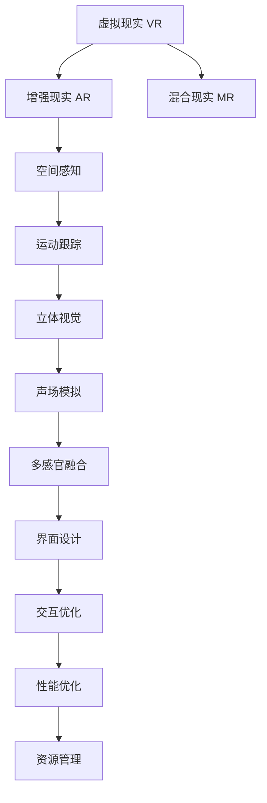

                 

# VR应用开发：构建沉浸式体验

## 1. 背景介绍

### 1.1 问题由来

随着科技的不断进步，虚拟现实（Virtual Reality，简称VR）技术逐渐从概念走向实际应用，成为人们体验沉浸式内容的重要工具。VR技术融合了计算机图形学、人工智能、人机交互、传感器技术等多个领域，能够创造出一个与现实世界高度一致或完全不同的虚拟环境，使用户在其中获得全新的感官体验。

近年来，VR应用场景不断扩展，从游戏、娱乐到教育、医疗、工业等领域，VR技术正在逐步渗透。在实际开发过程中，开发者需要构建高质量的VR内容，满足用户对沉浸式体验的需求。然而，构建一个真正沉浸式且功能完备的VR应用，并非易事。这不仅需要强大的图形渲染引擎和先进的图形处理技术，还需要深入理解人类感官体验的心理基础，并结合优秀的软件开发方法和工程实践经验，实现从创意到应用的全流程开发。

### 1.2 问题核心关键点

构建VR应用的核心目标是通过沉浸式的视觉和听觉体验，提升用户的参与感和体验质量。而实现这一目标的关键包括以下几个方面：

- **内容创意**：高质量的VR内容需要具备丰富的场景、情节和交互性，能够充分调动用户的多感官体验。
- **图形渲染**：VR应用中的场景、物体和人物都需要高质量的渲染，实现流畅、逼真的视觉效果。
- **人机交互**：VR应用需要支持手势、语音、眼睛追踪等多种交互方式，提升用户体验的自由度和自然度。
- **环境感知**：VR应用需要具备对周围环境的高敏感性，并能够根据用户的行为和环境变化动态调整显示内容。
- **性能优化**：VR应用需要具备高效的资源管理能力，能够适应移动和便携设备，提供流畅的交互体验。

## 2. 核心概念与联系

### 2.1 核心概念概述

为了更好地理解VR应用的开发过程，我们首先需要介绍几个核心概念：

- **虚拟现实（VR）**：通过计算机技术和传感器技术，构建一个模拟现实世界或虚构世界的虚拟环境，使用户可以身临其境地体验各种场景。
- **增强现实（AR）**：将虚拟信息与现实世界相结合，增强用户对现实世界的感知和互动。
- **混合现实（MR）**：将现实世界和虚拟世界融合，创建混合的体验环境。
- **空间感知**：VR应用需要理解用户所在空间的三维位置和姿态，提供环境感知能力。
- **运动跟踪**：VR应用需要实时跟踪用户的位置、姿态和运动速度，实现交互的响应性。
- **立体视觉**：通过双眼视觉差，为用户提供立体视觉体验。
- **声场模拟**：通过立体声音响系统，模拟出逼真的声场效果，提升听觉体验。
- **多感官融合**：将视觉、听觉、触觉等多种感官信息融合，提供全面的沉浸式体验。
- **界面设计**：用户界面设计需要考虑用户操作方便性和直观性，提供良好的交互体验。

这些概念之间的逻辑关系可以通过以下Mermaid流程图来展示：



这个流程图展示了我VR应用开发的关键步骤和概念之间的关系：

1. VR应用通过理解空间感知和运动跟踪，实时渲染并输出立体视觉和声场模拟效果。
2. 多感官融合提供了全面的沉浸式体验。
3. 界面设计通过合理布局，提升用户操作的直观性和便捷性。
4. 交互优化和性能优化确保了流畅的交互体验和高效的系统资源管理。

## 3. 核心算法原理 & 具体操作步骤
### 3.1 算法原理概述

VR应用的开发涉及多个技术领域，包括图形渲染、人机交互、环境感知等。以下是一些核心算法原理：

- **图形渲染算法**：如光线追踪、顶点着色器、像素着色器等，用于实现高质量的视觉效果。
- **人机交互算法**：如手势识别、语音识别、眼球追踪等，用于实现与用户的自然交互。
- **空间感知算法**：如惯性传感器、位置传感器、深度相机等，用于实时获取用户的位置和姿态信息。
- **运动跟踪算法**：如卡尔曼滤波、PID控制等，用于跟踪用户动作，实现精确的位置和姿态估计。
- **立体视觉算法**：如双目视觉、光栅立体、视差技术等，用于实现用户的立体视觉体验。
- **声场模拟算法**：如虚拟环绕声、多扬声器技术等，用于实现逼真的听觉体验。
- **多感官融合算法**：如动态混合、虚拟触摸、气味反馈等，用于将多种感官信息融合，提升整体体验。

### 3.2 算法步骤详解

VR应用的开发过程可以大致分为以下几个步骤：

**Step 1: 需求分析和设计**

- 明确应用目标和用户需求，确定应用的功能模块和核心算法。
- 进行用户行为分析，设计合理的使用流程和交互方式。
- 确定技术选型，选择适合的图形渲染引擎、传感器技术和人机交互方式。

**Step 2: 界面设计和交互设计**

- 设计直观的用户界面，提升用户体验的便捷性。
- 设计自然的人机交互方式，如手势识别、语音交互、眼球追踪等。
- 设计可定制的界面元素和交互效果，提升用户的自由度和创造性。

**Step 3: 环境感知和运动跟踪**

- 配置位置传感器和惯性传感器，实现对用户位置和姿态的实时跟踪。
- 使用空间感知算法，构建用户与虚拟环境的映射关系。
- 结合环境信息，动态调整渲染场景和交互效果。

**Step 4: 图形渲染和立体视觉**

- 选择适合的图形渲染引擎，实现高质量的视觉效果。
- 使用立体视觉算法，模拟用户的双目视觉效果。
- 实现动态光影效果，增强场景的逼真感。

**Step 5: 声场模拟和多感官融合**

- 配置立体声扬声器和音频处理设备，实现逼真的声场模拟。
- 使用多感官融合算法，将视觉、听觉、触觉等多种感官信息融合，提升整体体验。
- 实现虚拟触摸、气味反馈等功能，增强用户的沉浸感。

**Step 6: 测试和优化**

- 进行多轮测试，评估应用的性能和用户体验。
- 根据测试结果，进行算法优化和功能改进。
- 优化应用的性能和资源管理，确保流畅的用户体验。

### 3.3 算法优缺点

VR应用开发的算法具有以下优点：

- **高度沉浸性**：通过多感官融合和逼真的渲染效果，提供全方位的沉浸式体验。
- **自由度高**：用户可以根据自己的需求，自由探索虚拟环境。
- **交互自然**：通过自然的手势、语音和眼球追踪等方式，提升用户的交互体验。
- **灵活性强**：可以根据实际需求，定制化的设计和实现。

同时，这些算法也存在一些缺点：

- **计算复杂度高**：高质量的图形渲染和实时跟踪需要较高的计算资源。
- **硬件要求高**：需要配备高性能的图形处理设备、传感器和音频设备。
- **技术难度大**：涉及多个技术领域，开发难度较大。
- **用户体验依赖于设备质量**：设备性能和用户交互方式直接影响体验质量。

### 3.4 算法应用领域

VR应用已经被广泛应用于多个领域，包括：

- **游戏与娱乐**：提供沉浸式游戏体验，如虚拟现实射击游戏、虚拟现实旅游等。
- **教育与培训**：通过虚拟场景进行远程教育和技能培训，如虚拟教室、虚拟实验室等。
- **医疗与健康**：模拟手术场景、虚拟康复训练等，提升医疗和健康服务质量。
- **工程与制造**：通过虚拟现实进行产品设计、原型验证和虚拟试装，提升工作效率和质量。
- **房地产与展示**：通过虚拟现实展示房产和展览，提升销售和展示效果。
- **军事与训练**：进行虚拟战场模拟和军事训练，提升实战能力和应对能力。
- **虚拟旅游与观光**：提供沉浸式的旅游体验，如虚拟现实旅游景区、虚拟博物馆等。

## 4. 数学模型和公式 & 详细讲解 & 举例说明

### 4.1 数学模型构建

VR应用开发的数学模型主要涉及计算机图形学和视觉感知等领域。以下是一个简单的数学模型构建过程：

- **三维空间表示**：使用向量表示用户和虚拟对象在三维空间中的位置和姿态，通过坐标变换实现空间定位。
- **立体视觉**：使用立体匹配算法，将左右眼图像合并成一幅立体图像，实现双目视觉效果。
- **光线追踪**：通过求解光线与物体的交点，实现逼真的光影效果。
- **动态光影**：使用光照模型和反射模型，模拟动态光源效果。

### 4.2 公式推导过程

以下以立体视觉算法为例，推导立体匹配的数学模型。

假设左眼和右眼相机的位置分别为 $P_L$ 和 $P_R$，焦距分别为 $f_L$ 和 $f_R$，视差为 $\Delta d$，左眼图像为 $I_L$，右眼图像为 $I_R$。

立体匹配的目标是将左眼和右眼图像中的对应点 $(x,y)$ 匹配起来，计算其深度值 $z$。根据双目视觉原理，左右眼图像中的对应点在三维空间中的位置关系为：

$$
\frac{z}{f_L} = \frac{x - \Delta d}{x - z}
$$

$$
\frac{z}{f_R} = \frac{x + \Delta d}{x + z}
$$

联立上述两个方程，解出 $z$ 的值：

$$
z = \frac{f_L \cdot f_R}{\Delta d}
$$

这个公式表示，立体匹配可以通过计算左右眼图像中对应点的视差，得到深度值 $z$，进而计算出三维空间中的位置信息。

### 4.3 案例分析与讲解

以一个简单的VR游戏为例，展示VR应用的开发过程。

**案例背景**：开发一个名为“太空探险”的VR游戏，用户可以驾驶太空船探索虚拟星球，并与外星人互动。

**设计流程**：

1. **需求分析和设计**：确定游戏的功能模块，如飞船控制、星球探索、外星人互动等，设计合理的使用流程和交互方式。
2. **界面设计和交互设计**：设计直观的用户界面，提升用户体验的便捷性。设计自然的手势和语音交互方式，实现飞船的飞行控制。
3. **环境感知和运动跟踪**：配置位置传感器和惯性传感器，实现对用户飞船位置的实时跟踪。使用空间感知算法，构建飞船与虚拟星球的映射关系。
4. **图形渲染和立体视觉**：选择适合的图形渲染引擎，实现飞船和星球的逼真渲染效果。使用立体视觉算法，模拟用户的双目视觉效果。
5. **声场模拟和多感官融合**：配置立体声扬声器和音频处理设备，实现逼真的声场模拟。结合环境信息，动态调整飞船周围的声音效果。
6. **测试和优化**：进行多轮测试，评估游戏性能和用户体验。根据测试结果，进行算法优化和功能改进。优化游戏的性能和资源管理，确保流畅的用户体验。

**代码实现**：以下是一个简单的C#代码示例，用于实现飞船在虚拟环境中的运动控制：

```csharp
using System;
using OpenTK;
using OpenTK.Graphics.OpenGL;
using OpenTK.Input;

public class ShipController
{
    private Vector3F position;
    private QuaternionF orientation;
    private float speed = 5f;
    private float turnSpeed = 1f;

    public void Update(float deltaTime)
    {
        if (GLFW.GetKey(GLFW.Key.W) == GLFW.KeyState.KeyPress)
        {
            position += new Vector3F(0, 0, speed) * deltaTime;
        }
        if (GLFW.GetKey(GLFW.Key.S) == GLFW.KeyState.KeyPress)
        {
            position -= new Vector3F(0, 0, speed) * deltaTime;
        }
        if (GLFW.GetKey(GLFW.Key.A) == GLFW.KeyState.KeyPress)
        {
            orientation = QuaternionF.Rotate(-turnSpeed * deltaTime, Vector3F.Up) * orientation;
        }
        if (GLFW.GetKey(GLFW.Key.D) == GLFW.KeyState.KeyPress)
        {
            orientation = QuaternionF.Rotate(turnSpeed * deltaTime, Vector3F.Up) * orientation;
        }
    }
}
```

通过这个代码示例，可以展示如何在VR应用中实现飞船的运动控制。

## 5. 项目实践：代码实例和详细解释说明

### 5.1 开发环境搭建

在进行VR应用开发前，我们需要准备好开发环境。以下是使用Unity3D进行VR应用开发的配置流程：

1. 安装Unity3D：从Unity官网下载安装Unity软件。
2. 安装VR插件：在Unity Hub中安装VR插件，如Oculus SDK、HTC Vive SDK等。
3. 安装VR设备：将VR设备（如Oculus Rift、HTC Vive等）连接到计算机，并确认设备已启用。
4. 配置开发环境：根据设备型号和插件版本，调整开发环境的设置，如分辨率、渲染管线、物理引擎等。

完成上述步骤后，即可在Unity3D环境中开始VR应用的开发。

### 5.2 源代码详细实现

以下是一个简单的Unity3D代码示例，用于实现VR应用中的基本功能：

```csharp
using UnityEngine;
using UnityEngine.XR.Interaction.Toolkit;
using UnityEngine.InputSystem;
using UnityEngine.InputSystem.Spreadsheet;

public class VRApplication : MonoBehaviour
{
    public GameObject player;
    public GameObject[] planets;

    private XRController controller;
    private XRController[] controllers;
    private bool isPlayerEnabled = true;

    void Start()
    {
        controller = player.GetComponent<XRController>();
        controllers = GameObject.FindGameObjectsWithTag("Controller").Select(x => x.GetComponent<XRController>()).ToArray();

        player.SetActive(isPlayerEnabled);
        AddPlanets();
    }

    void Update()
    {
        if (controller.inputDevice == null)
        {
            player.SetActive(false);
            isPlayerEnabled = false;
            return;
        }

        if (isPlayerEnabled && controller.inputDeviceInteractive)
        {
            float moveSpeed = Input.GetAxis("MoveHorizontal");
            float moveVertical = Input.GetAxis("MoveVertical");

            Vector3 move = new Vector3(moveHorizontal, 0, moveVertical) * moveSpeed;

            player.transform.Translate(move * Time.deltaTime);
        }
    }

    void AddPlanets()
    {
        for (int i = 0; i < planets.Length; i++)
        {
            planets[i].SetActive(false);
            planets[i].transform.position = new Vector3(Mathf.Sin(i * 2 * Mathf.PI / planets.Length), 0, 10) * 10;
        }
    }
}
```

通过这个代码示例，可以展示如何在Unity3D中实现基本的VR应用功能，如飞船在虚拟环境中的移动和行星的随机生成。

### 5.3 代码解读与分析

**代码说明**：

- `VRApplication`类：继承`MonoBehaviour`，表示Unity3D中的脚本组件。
- `player`：飞船的模型对象。
- `planets`：行星的模型对象数组。
- `controller`：控制器的对象。
- `controllers`：所有控制器的数组。
- `isPlayerEnabled`：控制飞船是否可见和可交互。
- `Start()`方法：初始化控制器，生成行星，并调用`AddPlanets()`方法。
- `Update()`方法：在每个帧更新时，根据控制器状态，移动飞船。

**代码分析**：

- `Start()`方法：在脚本开始时执行，用于初始化控制器、生成行星，并调用`AddPlanets()`方法。
- `AddPlanets()`方法：循环生成行星，并随机放置在场景中。
- `Update()`方法：在每个帧更新时执行，用于根据控制器状态，移动飞船。
- `controller.inputDeviceInteractive`：判断控制器是否处于交互状态。
- `Input.GetAxis("MoveHorizontal")`：获取水平移动的轴值。
- `player.transform.Translate(move * Time.deltaTime)`：根据水平和垂直移动的轴值，移动飞船。

这个代码示例展示了如何在Unity3D中实现基本的VR应用功能，如飞船在虚拟环境中的移动和行星的随机生成。通过Unity3D提供的图形渲染、传感器技术和人机交互功能，可以构建一个完整的VR应用。

### 5.4 运行结果展示

通过这个代码示例，可以运行Unity3D软件，体验飞船在虚拟环境中的移动和行星的生成。用户可以通过控制器实现飞船的移动，并在场景中观察到行星的生成。

## 6. 实际应用场景

### 6.1 虚拟现实游戏

虚拟现实游戏是VR应用开发的重要方向，能够提供沉浸式的游戏体验，吸引大量玩家。

以《Beat Saber》为例，这是一款基于VR的节奏类游戏，玩家通过拿起控制器击打飞舞的乐块，跟随音乐节奏进行游戏。游戏采用了先进的图形渲染技术和空间感知算法，实现了逼真的视觉效果和交互体验。通过多样化的关卡设计和丰富的音乐库，游戏具有很高的可玩性和挑战性，吸引了全球数百万玩家。

### 6.2 虚拟旅游与观光

虚拟旅游与观光是VR应用开发的另一个重要方向，能够为用户提供身临其境的旅游体验。

以《Google Earth VR》为例，这是一款基于VR的地球探索应用，用户可以在虚拟环境中自由飞行，探索世界各地的名胜古迹。应用采用了高精度的地图数据和逼真的图形渲染，提供了沉浸式的旅游体验。用户可以通过手势控制飞行，观察到各地的风土人情和自然风光。

### 6.3 虚拟医疗与健康

虚拟医疗与健康是VR应用开发的新兴领域，能够为医疗和健康领域提供虚拟培训、远程诊断和虚拟手术等服务。

以《Osso VR》为例，这是一款虚拟解剖和手术模拟应用，用户可以在虚拟环境中进行人体解剖和手术操作。应用采用了高精度的3D模型和逼真的声场模拟，提供了逼真的手术体验。用户可以通过手势和语音控制手术工具，观察到手术过程中的实时反馈和数据。

### 6.4 虚拟教育与培训

虚拟教育与培训是VR应用开发的重要方向，能够为教育和学习提供虚拟课堂、虚拟实验室和虚拟技能培训等服务。

以《Tilt Brush》为例，这是一款基于VR的创意绘画应用，用户可以在虚拟环境中自由创作，体验沉浸式的绘画体验。应用采用了高精度的图形渲染和丰富的画笔，提供了多样化的创作方式和效果。用户可以通过手势控制画笔，绘制出各种形态的艺术作品。

## 7. 工具和资源推荐

### 7.1 学习资源推荐

为了帮助开发者系统掌握VR应用的开发技术，这里推荐一些优质的学习资源：

1. **《Unity3D官方文档》**：Unity3D的官方文档，包含了详细的API说明和示例代码，是学习和开发VR应用的重要参考。
2. **《VR开发实战》书籍**：是一本全面介绍VR应用开发的书籍，内容包括基础概念、技术选型、引擎应用、案例分析等。
3. **《Virtual Reality with Unity》课程**：由Unity官方提供的在线课程，涵盖了VR应用开发的基础知识和实践技巧。
4. **《VR应用开发》课程**：由Coursera提供的在线课程，包含VR应用开发的全流程讲解和实践指导。
5. **《VR应用开发案例分析》博客**：由VR开发者撰写的技术博客，包含大量的案例分析和实践经验分享。

通过对这些资源的学习实践，相信你一定能够快速掌握VR应用开发的精髓，并用于解决实际的开发问题。

### 7.2 开发工具推荐

高效的开发离不开优秀的工具支持。以下是几款用于VR应用开发的常用工具：

1. **Unity3D**：由Unity Technologies开发的开源游戏引擎，支持跨平台开发，是VR应用开发的首选工具。
2. **Unreal Engine**：由Epic Games开发的开源游戏引擎，提供了强大的图形渲染和物理模拟能力，适用于高质量的VR应用开发。
3. **VRSDKs**：如Oculus SDK、HTC Vive SDK等，提供了VR设备的驱动程序和开发API，方便开发者进行设备接入和互动。
4. **VR控制器**：如Oculus Rift控制器、HTC Vive控制器等，提供了手势、语音、眼球追踪等多种交互方式，提升用户体验。
5. **VR头盔和耳机**：如Oculus Rift、HTC Vive、Sony PlayStation VR等，提供了高质量的虚拟现实体验。

合理利用这些工具，可以显著提升VR应用开发的效率，加快创新迭代的步伐。

### 7.3 相关论文推荐

VR应用开发涉及多个技术领域，以下是几篇奠基性的相关论文，推荐阅读：

1. **《Virtual Reality Interfaces: Characteristics, Properties, and Opportunities for HCI》**：讨论了VR界面设计的特点和机会，介绍了常用的VR交互技术和界面元素。
2. **《A Survey of Virtual Reality Human-Computer Interaction》**：综述了VR人机交互技术的研究现状和发展趋势，介绍了常用的VR交互设备和技术。
3. **《A Framework for Understanding Human-Computer Interaction in Virtual Reality》**：提出了一种VR人机交互的框架，探讨了交互技术和用户心理之间的关系。
4. **《Advances in Computer Vision and Graphics for Virtual Reality》**：综述了VR图形渲染技术的研究现状和发展趋势，介绍了常用的图形渲染算法和技术。
5. **《A Survey of Motion Tracking Technologies for Virtual Reality》**：综述了VR运动跟踪技术的研究现状和发展趋势，介绍了常用的运动跟踪设备和算法。

这些论文代表了大VR应用开发技术的发展脉络。通过学习这些前沿成果，可以帮助研究者把握学科前进方向，激发更多的创新灵感。

## 8. 总结：未来发展趋势与挑战

### 8.1 总结

本文对VR应用开发进行了全面系统的介绍。首先阐述了VR应用开发的背景和意义，明确了开发高质量VR应用的重要性和挑战。其次，从原理到实践，详细讲解了VR应用开发的数学模型和关键算法，给出了VR应用开发的完整代码实例。同时，本文还广泛探讨了VR应用在虚拟现实游戏、虚拟旅游与观光、虚拟医疗与健康、虚拟教育与培训等多个领域的应用前景，展示了VR应用开发的广阔前景。此外，本文精选了VR应用开发的各类学习资源，力求为读者提供全方位的技术指引。

通过本文的系统梳理，可以看到，VR应用开发是一项高度复杂的技术任务，涉及多个技术领域和专业知识的整合。然而，只要充分理解VR应用的核心技术和关键算法，掌握先进的开发工具和资源，就能够构建高质量的VR应用，为用户提供沉浸式体验。

### 8.2 未来发展趋势

展望未来，VR应用开发将呈现以下几个发展趋势：

1. **技术融合**：VR应用将与其他技术进行更深入的融合，如AR、MR、AI等，提供更加丰富和多样化的体验。
2. **硬件升级**：未来的VR设备将具备更高的分辨率、更大的视野和更强的交互性，提供更逼真和自然的体验。
3. **内容创作**：VR内容创作将更加丰富和多样，用户可以参与到内容的创作和分享中，提升体验的自由度和创造性。
4. **行业应用**：VR应用将在更多垂直领域得到应用，如医疗、教育、培训、娱乐等，提升行业的智能化和自动化水平。
5. **网络化交互**：未来的VR应用将支持多人互动和网络化协作，提供更加丰富和多样化的社交体验。
6. **实时渲染**：未来的VR应用将采用实时渲染技术，提供流畅的交互体验和高效的资源管理。
7. **跨平台支持**：未来的VR应用将支持跨平台开发和部署，方便用户在不同设备上体验。

以上趋势凸显了VR应用开发技术的广阔前景。这些方向的探索发展，必将进一步提升VR应用的用户体验和应用范围，为人类认知智能的进化带来深远影响。

### 8.3 面临的挑战

尽管VR应用开发技术已经取得了显著进展，但在迈向更加智能化、普适化应用的过程中，它仍面临着诸多挑战：

1. **计算复杂度高**：高质量的图形渲染和实时跟踪需要较高的计算资源，对设备性能要求高。
2. **设备成本高**：VR设备的成本较高，普及率较低，难以广泛应用。
3. **交互体验差**：现有的交互方式较为单一，缺乏自然性和灵活性，难以满足用户需求。
4. **用户体验依赖于技术**：用户对VR设备的依赖度高，设备性能和技术瓶颈直接影响用户体验。
5. **内容缺乏多样性**：现有的VR应用内容相对较少，缺乏多样性和创新性，难以吸引用户。
6. **用户接受度低**：用户对VR技术的接受度较低，需要进一步普及和推广。
7. **技术壁垒高**：VR应用开发需要跨学科知识，开发难度大，需要专业团队和技术积累。

正视VR应用开发面临的这些挑战，积极应对并寻求突破，将是大VR应用开发技术走向成熟的必由之路。相信随着学界和产业界的共同努力，这些挑战终将一一被克服，VR应用开发技术必将在构建人机协同的智能时代中扮演越来越重要的角色。

### 8.4 研究展望

面向未来，VR应用开发技术需要在以下几个方面寻求新的突破：

1. **技术融合与创新**：结合AR、MR、AI等技术，提供更加丰富和多样化的体验，提升用户体验。
2. **硬件升级与普及**：开发高性能、低成本的VR设备，提升设备的普及率和用户体验。
3. **内容创作与共享**：鼓励用户参与内容创作和共享，提升内容的多样性和创新性。
4. **交互优化与自然化**：引入更多的自然交互方式，提升交互的自然性和灵活性，满足用户需求。
5. **实时渲染与优化**：采用实时渲染技术，提高渲染效率和资源管理能力，提供流畅的用户体验。
6. **跨平台支持与生态建设**：支持跨平台开发和部署，构建生态系统，方便用户在不同设备上体验。
7. **内容质量与多样化**：提升VR内容的质量和多样化，吸引更多用户和开发者参与。

这些研究方向的探索，必将引领VR应用开发技术迈向更高的台阶，为构建安全、可靠、可解释、可控的智能系统铺平道路。面向未来，VR应用开发技术还需要与其他人工智能技术进行更深入的融合，如知识表示、因果推理、强化学习等，多路径协同发力，共同推动自然语言理解和智能交互系统的进步。只有勇于创新、敢于突破，才能不断拓展VR应用的边界，让智能技术更好地造福人类社会。

## 9. 附录：常见问题与解答

**Q1：VR应用开发中如何保证高质量的图形渲染？**

A: 保证高质量的图形渲染需要优化渲染管线和使用先进的渲染算法，如光线追踪、动态光影等。具体实现可以采用以下措施：

1. **选择合适的渲染引擎**：如Unity3D、Unreal Engine等，这些引擎提供了强大的渲染能力和丰富的API。
2. **优化渲染管线**：使用高级渲染技术，如延迟渲染、即时渲染、光追渲染等，提高渲染效率。
3. **优化模型和纹理**：减少模型和纹理的复杂度，降低渲染负担。
4. **使用LOD技术**：根据用户距离和视角，动态调整模型的细节程度，减少渲染负担。
5. **使用GPU加速**：利用GPU并行计算能力，加速渲染过程。

通过以上措施，可以保证VR应用的高质量图形渲染效果。

**Q2：VR应用开发中如何实现自然的人机交互？**

A: 实现自然的人机交互需要采用先进的交互技术和设备，如手势识别、语音识别、眼球追踪等。具体实现可以采用以下措施：

1. **手势识别技术**：使用手势传感器和算法，识别用户的手势动作，实现交互控制。
2. **语音识别技术**：使用麦克风和语音识别算法，识别用户的语音指令，实现语音控制。
3. **眼球追踪技术**：使用摄像头和算法，追踪用户的眼动，实现视线控制。
4. **自然语言处理技术**：使用自然语言处理算法，理解用户的语音指令，实现语义控制。
5. **虚拟控制器**：提供虚拟控制器，模拟用户的手部动作，实现交互控制。

通过以上措施，可以实现自然、直观的人机交互，提升用户体验。

**Q3：VR应用开发中如何保证设备的稳定性和用户体验？**

A: 保证设备的稳定性和用户体验需要优化设备的性能和用户体验，如减少延迟、提高响应速度、优化输入等。具体实现可以采用以下措施：

1. **优化渲染管线**：使用高效的渲染技术和算法，降低渲染延迟和资源消耗。
2. **优化输入响应**：使用低延迟的传感器和算法，提高输入响应的速度和准确性。
3. **使用低延迟传输协议**：使用低延迟的网络传输协议，降低网络延迟和传输延迟。
4. **优化设备性能**：提高设备的计算能力和存储能力，保证设备的稳定性和响应速度。
5. **优化用户界面**：设计直观的用户界面，提升用户体验的便捷性和直观性。

通过以上措施，可以保证VR设备的稳定性和用户体验，提升系统的响应速度和流畅度。

**Q4：VR应用开发中如何保证内容的多样性和创新性？**

A: 保证内容的多样性和创新性需要提供丰富的内容资源和创新内容创作方式，如用户生成内容、虚拟现实内容库等。具体实现可以采用以下措施：

1. **提供丰富的内容资源**：构建虚拟现实内容库，提供丰富的VR内容资源，供用户选择和体验。
2. **支持用户生成内容**：支持用户参与内容创作和分享，提供创作工具和平台，提升内容的多样性和创新性。
3. **引入创新内容创作方式**：引入虚拟现实创意工具和平台，支持用户进行创意创作和内容开发。
4. **合作内容创作**：与内容创作者和开发者合作，提供高质量的内容资源和创作支持，提升内容的创新性和多样性。

通过以上措施，可以保证VR应用的内容多样性和创新性，提升用户体验和吸引度。

**Q5：VR应用开发中如何保证交互的自然性和灵活性？**

A: 保证交互的自然性和灵活性需要采用先进的交互技术和设备，如手势识别、语音识别、眼球追踪等。具体实现可以采用以下措施：

1. **使用自然交互方式**：采用手势识别、语音识别、眼球追踪等自然交互方式，提升交互的自然性和灵活性。
2. **引入虚拟控制器**：提供虚拟控制器，模拟用户的手部动作，实现交互控制。
3. **引入虚拟现实技术**：引入虚拟现实技术，提供虚拟环境，增强交互的真实感和沉浸感。
4. **引入增强现实技术**：引入增强现实技术，提供现实环境和虚拟内容的融合体验。
5. **引入混合现实技术**：引入混合现实技术，提供现实世界和虚拟世界的融合体验。

通过以上措施，可以实现自然、直观的交互体验，提升用户的自由度和创造性。

---

作者：禅与计算机程序设计艺术 / Zen and the Art of Computer Programming

