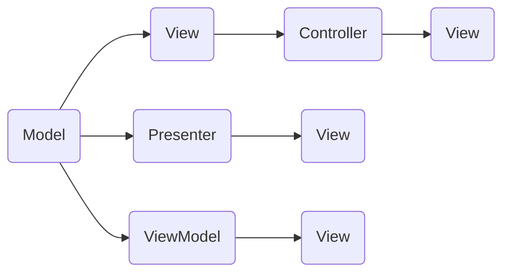

                 

# Web 设计模式：创建可扩展和模块化网站

## 1. 背景介绍

在Web开发的历程中，设计模式已成为一种广泛接受的最佳实践。设计模式能够使开发者更好地组织代码，提高代码的可读性、可维护性和可扩展性。对于大型Web应用，一个良好的设计模式将使得其维护更加简单，也易于招聘新员工进行开发。

本文将介绍几种经典的设计模式，包括Model-View-Controller(MVC)、Model-View-Presenter(MVP)和Model-View-ViewModel(MVVM)，通过深入浅出的讲解和示例，帮助开发者更好地理解和应用这些设计模式。

## 2. 核心概念与联系

为了更好地理解这些设计模式，我们需要了解一些核心概念及其之间的关系：

- **Model(模型)**：表示数据的逻辑和业务规则，负责数据的处理和业务逻辑的实现。
- **View(视图)**：表示用户界面的展示，负责渲染数据。
- **Controller/Presenter/ViewModel(控制器/展示器/视图模型)**：表示用户的交互逻辑，负责处理用户的输入和调用Model更新数据。

这些概念之间的关系可以用以下Mermaid流程图来展示：



该图表展示了三个设计模式的基本关系。

### 2.1 Model-View-Controller(MVC)模式

MVC模式将模型、视图和控制器三者分离开来，每个组件只关注自己负责的方面。MVC模式的核心思想是，用户交互部分由控制器来处理，模型和视图部分则相互独立，控制器负责它们之间的通信。MVC模式的优点在于代码复用性高，易于维护。

### 2.2 Model-View-Presenter(MVP)模式

MVP模式与MVC类似，只是将视图和控制器分离开来。Presenter负责视图的渲染和与Model的交互，而View只负责展示数据。MVP模式的优点在于视图和控制器的分离使得Presenter的逻辑更加清晰，同时提高了代码的可测试性。

### 2.3 Model-View-ViewModel(MVVM)模式

MVVM模式将View和ViewModel分离开来，ViewModel负责处理用户输入和调用Model进行数据处理。View和ViewModel的分离使得ViewModel的逻辑更加清晰，同时提高了代码的可读性和可维护性。MVVM模式是MVP模式的一种改进，更符合数据驱动的开发理念。

## 3. 核心算法原理 & 具体操作步骤

### 3.1 算法原理概述

设计模式的核心原理是通过将软件组件分离成独立的模块，提高代码的可维护性和可扩展性。设计模式的本质是实现解耦，使得每个组件可以独立更新，不会影响其他组件。

### 3.2 算法步骤详解

以下是三种设计模式的详细操作步骤：

#### MVC模式

1. **创建Model**：表示数据的逻辑和业务规则，负责数据的处理和业务逻辑的实现。
2. **创建View**：表示用户界面的展示，负责渲染数据。
3. **创建Controller**：表示用户的交互逻辑，负责处理用户的输入和调用Model更新数据。
4. **控制器和视图的连接**：通过监听器的机制，当视图中的数据发生变化时，控制器负责更新模型。
5. **模型和视图的连接**：当模型发生变化时，通过监听器的机制，更新视图。

#### MVP模式

1. **创建Model**：表示数据的逻辑和业务规则，负责数据的处理和业务逻辑的实现。
2. **创建View**：表示用户界面的展示，负责渲染数据。
3. **创建Presenter**：负责视图的渲染和与Model的交互，视图和控制器的分离使得Presenter的逻辑更加清晰。
4. **视图和Presenter的连接**：当视图中的数据发生变化时，Presenter负责更新模型。
5. **Presenter和模型的连接**：当Presenter发生变化时，通过监听器的机制，更新视图。

#### MVVM模式

1. **创建Model**：表示数据的逻辑和业务规则，负责数据的处理和业务逻辑的实现。
2. **创建View**：表示用户界面的展示，负责渲染数据。
3. **创建ViewModel**：负责处理用户输入和调用Model进行数据处理。
4. **视图和ViewModel的连接**：当视图中的数据发生变化时，ViewModel负责更新模型。
5. **ViewModel和模型的连接**：当ViewModel发生变化时，通过监听器的机制，更新视图。

### 3.3 算法优缺点

#### MVC模式的优点：
- 代码复用性高
- 易于维护
- 易于理解和调试

#### MVC模式的缺点：
- 控制器逻辑过于复杂，难以维护
- 视图和控制器的耦合度较高
- 不适合处理大量的数据

#### MVP模式的优点：
- 视图和控制器的分离使得Presenter的逻辑更加清晰
- 提高了代码的可测试性
- 更适合处理大量的数据

#### MVP模式的缺点：
- 增加了额外的Presenter组件，代码量增加
- 视图和Presenter的交互复杂

#### MVVM模式的优点：
- 视图和ViewModel的分离使得ViewModel的逻辑更加清晰
- 提高了代码的可读性和可维护性
- 更适合数据驱动的开发

#### MVVM模式的缺点：
- 视图和ViewModel的交互复杂
- 视图和ViewModel的分离增加了开发难度

## 4. 数学模型和公式 & 详细讲解 & 举例说明

### 4.1 数学模型构建

设计模式的核心在于分离组件，使得每个组件只关注自己负责的方面。这可以通过以下数学模型来描述：

$$
M = Model, V = View, C = Controller, P = Presenter, VM = ViewModel
$$

每个组件之间的通信通过监听器的方式进行。当组件A发生变化时，它会通知监听器，监听器会调用组件B进行更新。

### 4.2 公式推导过程

$$
A \rightarrow B \rightarrow C \rightarrow D
$$

其中，$A$表示数据的变化，$B$表示视图的变化，$C$表示控制器的变化，$D$表示模型的变化。当$A$发生变化时，它会通知$B$，$B$会通知$C$，$C$会通知$D$，最终$D$会根据数据的变化更新视图。

### 4.3 案例分析与讲解

以一个简单的Web应用程序为例，假设有一个用户登录功能。当用户输入用户名和密码时，视图会显示一个登录按钮。当用户点击登录按钮时，控制器会调用模型进行验证，如果验证通过，视图会显示登录成功信息。

这个过程中，用户输入的数据在视图层面进行处理，控制器负责验证逻辑，模型负责数据验证和业务逻辑的实现，视图负责展示结果。这种分离使得代码更加清晰，易于维护和扩展。

## 5. 项目实践：代码实例和详细解释说明

### 5.1 开发环境搭建

在开始项目实践之前，我们需要准备开发环境。以下是使用Java和Spring Boot搭建Web应用程序的步骤：

1. 安装JDK和Maven
2. 创建Spring Boot项目
3. 配置Spring Boot的依赖项

### 5.2 源代码详细实现

以下是使用MVC模式实现用户登录功能的Java代码示例：

```java
@Controller
public class LoginController {
    
    @Autowired
    private UserService userService;
    
    @GetMapping("/login")
    public String login(@RequestParam String username, @RequestParam String password) {
        User user = userService.findByUsername(username);
        if (user != null && user.getPassword().equals(password)) {
            return "loginSuccess";
        } else {
            return "loginFailed";
        }
    }
    
}
```

### 5.3 代码解读与分析

上述代码中，`@Controller`注解表示这是一个控制器类，`@Autowired`注解表示自动注入依赖项，`@GetMapping`注解表示这是一个处理请求的映射。当用户访问`/login`路径时，控制器会调用`findByUsername`方法验证用户名和密码，如果验证通过，返回`loginSuccess`视图，否则返回`loginFailed`视图。

## 6. 实际应用场景

### 6.1 Web应用开发

设计模式在Web应用开发中有着广泛的应用。以一个电商平台为例，设计模式可以帮助我们分离数据模型、视图展示和用户交互逻辑，使得代码更加清晰和易于维护。

### 6.2 手机应用开发

设计模式同样适用于手机应用开发。以一个新闻应用为例，设计模式可以帮助我们分离数据模型、新闻列表视图和用户交互逻辑，使得代码更加模块化和易于扩展。

### 6.3 移动应用开发

设计模式也可以应用于移动应用开发。以一个音乐应用为例，设计模式可以帮助我们分离数据模型、歌曲列表视图和用户交互逻辑，使得代码更加模块化和易于维护。

## 7. 工具和资源推荐

### 7.1 学习资源推荐

1. 《设计模式：可复用面向对象软件的基础》
2. 《Java设计模式》
3. 《Head First 设计模式》

### 7.2 开发工具推荐

1. IntelliJ IDEA：Java开发工具，支持设计模式和MVC、MVP、MVVM模式的开发
2. Eclipse：Java开发工具，支持设计模式和MVC、MVP、MVVM模式的开发
3. Visual Studio：Java开发工具，支持设计模式和MVC、MVP、MVVM模式的开发

### 7.3 相关论文推荐

1. 《Java设计模式》
2. 《JavaScript设计模式》
3. 《C#设计模式》

## 8. 总结：未来发展趋势与挑战

### 8.1 研究成果总结

设计模式作为一种最佳实践，在Web开发中具有广泛的应用。通过将软件组件分离成独立的模块，可以提高代码的可读性、可维护性和可扩展性。

### 8.2 未来发展趋势

未来，设计模式将更加注重模块化和可扩展性，新的设计模式将会不断涌现，如Microservices模式等。

### 8.3 面临的挑战

尽管设计模式有很多优点，但在实际应用中也存在一些挑战，如设计模式的学习成本较高，设计模式的过度使用可能导致代码复杂化等。

### 8.4 研究展望

未来的研究将更加注重设计模式的可扩展性和可维护性，同时会探索更多新的设计模式，以适应不同的应用场景。

## 9. 附录：常见问题与解答

### Q1: MVC、MVP和MVVM有什么区别？

A: MVC、MVP和MVVM都是设计模式，它们的区别在于视图和控制器的分离程度。MVC模式将视图和控制器紧密耦合在一起，MVP模式将视图和控制器分离出来，MVVM模式将视图和ViewModel分离出来。

### Q2: 设计模式的优点是什么？

A: 设计模式能够提高代码的可读性、可维护性和可扩展性，使得代码更加模块化和易于维护。

### Q3: 设计模式的缺点是什么？

A: 设计模式的学习成本较高，过度使用设计模式可能导致代码复杂化。

### Q4: 如何选择合适的设计模式？

A: 应根据项目需求和团队特点选择合适的设计模式。一般而言，简单的Web应用可以使用MVC模式，复杂的多层应用可以使用MVP或MVVM模式。

### Q5: 设计模式是否可以应用于移动应用开发？

A: 设计模式同样适用于移动应用开发，但需要根据具体的开发平台和语言选择合适的设计模式。

---

作者：禅与计算机程序设计艺术 / Zen and the Art of Computer Programming

