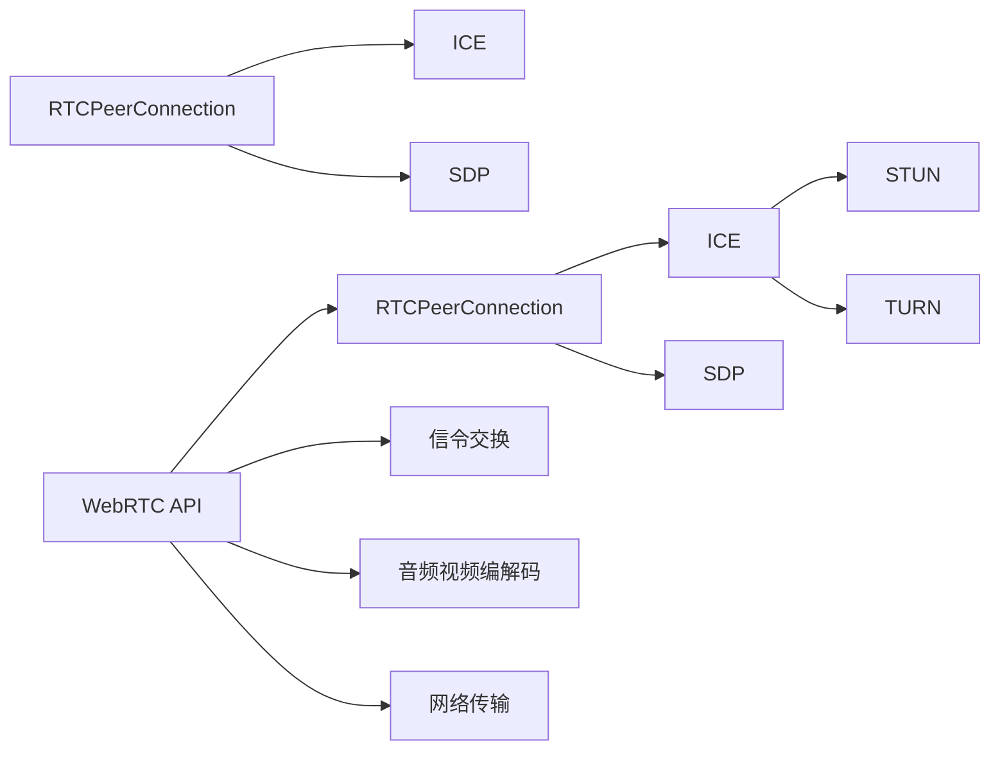

                 

# WebRTC 实时通信协议在浏览器中的应用：实现互动和通信

> 关键词：WebRTC, 浏览器, 实时通信, 网络传输, 音频视频流, 信令协议, 数据交换, 加密, 安全, 媒体协商, WebSockets, 音视频编码

## 1. 背景介绍

随着互联网技术的迅猛发展，实时通信（Real-time Communication, 简称RTC）需求日益增加。在企业级视频会议、在线教育、远程医疗、线上娱乐等领域，实时音视频交互已成为不可或缺的通信方式。WebRTC（Web Real-Time Communication）正是以浏览器为基础的开放标准，旨在实现简单易用、安全的跨浏览器实时音视频通信。

WebRTC诞生于2011年，旨在通过Web浏览器实现点对点（Peer-to-Peer, P2P）的音视频通信。其主要特点包括：

- **端到端**：通信数据仅在客户端之间直接传输，无需通过服务器，降低了延迟和带宽消耗。
- **易用性**：不需要第三方插件或软件，直接利用浏览器提供的功能。
- **安全**：采用SSL/TLS加密，保障数据传输安全。
- **开放标准**：由IETF标准组织定义，得到广泛支持，符合多浏览器兼容性。

本文将从WebRTC的核心概念和原理入手，深入探讨其架构与实现，并通过实际代码示例展示WebRTC在现代浏览器中的应用。

## 2. 核心概念与联系

### 2.1 核心概念概述

WebRTC主要涉及以下几个核心概念：

- **WebRTC API**：一组用于音视频、数据通信的浏览器API，提供音视频编解码、信令处理、网络传输等功能。
- **RTCPeerConnection**：是WebRTC的核心类，负责创建、管理P2P连接，实现数据交换。
- **ICE**：用于连接建立，包括STUN、TURN协议，穿越NAT防火墙和NAT-Traversal。
- **SDP**：会话描述协议，用于信令交换，描述媒体参数和加密信息。

这些概念之间相互联系，共同构成WebRTC的通信体系。

### 2.2 核心概念原理和架构的 Mermaid 流程图



- **A: WebRTC API**：为用户提供易用的API接口，通过调用这些接口，开发者可以实现音视频通信。
- **B: RTCPeerConnection**：创建和管理P2P连接，通过调用其方法，可以建立、修改和关闭连接。
- **C: ICE**：实现网络穿透，通过STUN和TURN协议，帮助连接穿越NAT防火墙，建立P2P连接。
- **D: SDP**：用于信令交换，描述媒体参数和加密信息，是连接建立的基础。
- **J: 信令交换**：通过SDP进行信令交换，建立连接。
- **K: 音频视频编解码**：使用WebRTC API提供的编解码器，对音频视频数据进行编码、解码。
- **L: 网络传输**：通过RTCPeerConnection进行网络传输，确保音视频数据的可靠传输。

这些核心概念通过浏览器提供的一组标准API，协作完成实时音视频通信的各个环节。

## 3. 核心算法原理 & 具体操作步骤

### 3.1 算法原理概述

WebRTC的实现涉及多个复杂算法，其中主要包括音视频编解码、网络传输、加密和媒体协商等。

- **音视频编解码**：通过H.264、VP8等标准编解码器，对音频视频数据进行压缩和解压缩，确保在网络传输中数据占用的带宽最小。
- **网络传输**：采用P2P技术，通过ICE协议，穿越NAT防火墙和NAT-Traversal，实现数据在客户端之间直接传输。
- **加密**：采用SSL/TLS协议，确保数据传输的安全性，防止数据泄露和篡改。
- **媒体协商**：通过SDP协议，交换媒体参数和加密信息，确保双方能够兼容媒体格式和传输协议。

### 3.2 算法步骤详解

#### 3.2.1 音视频编解码

WebRTC支持多种音视频编解码器，包括VP8、VP9、H.264等。其音视频编解码器选择和配置步骤如下：

1. 创建RTCPeerConnection对象，并通过config属性配置编解码器。
2. 通过getSenders()方法获取发送者的MediaStreamTrack对象。
3. 调用senders.getTrack()方法，获取当前发送者的媒体流。
4. 使用senders.getTrack()方法设置编解码器参数，如编码格式、编码速率等。
5. 使用senders.getTrack()方法，获取编解码后的媒体流。

#### 3.2.2 网络传输

WebRTC使用ICE协议，实现连接建立和网络穿透。其网络传输步骤如下：

1. 创建RTCPeerConnection对象，并调用icegather()方法启动ICE流程。
2. 在icegather()方法的回调函数中，获取本地连接的 Candidate，并发送给对端。
3. 在icegather()方法的回调函数中，处理对端发送的Candidate，并建立连接。

#### 3.2.3 加密

WebRTC通过SSL/TLS协议，确保数据传输的安全性。其加密步骤如下：

1. 创建RTCPeerConnection对象，并调用setProtocol()方法，设置传输协议为DTLS-SRTP。
2. 在setProtocol()方法的回调函数中，获取本地密钥和秘钥交换信息。
3. 在setProtocol()方法的回调函数中，设置对端密钥和秘钥交换信息。

#### 3.2.4 媒体协商

WebRTC通过SDP协议，进行媒体参数和加密信息的交换。其媒体协商步骤如下：

1. 创建RTCPeerConnection对象，并调用createOffer()方法，生成SDP offer。
2. 在createOffer()方法的回调函数中，获取SDP offer字符串。
3. 在setLocalDescription()方法中，设置本地SDP描述信息。
4. 使用ICE协议，与对端交换SDP offer和answer，建立连接。

### 3.3 算法优缺点

#### 3.3.1 优点

- **易用性**：WebRTC使用标准浏览器API，开发门槛低，易于上手。
- **安全性**：采用SSL/TLS加密，确保数据传输的安全性。
- **跨浏览器兼容性**：由IETF标准组织定义，得到广泛支持，适用于多浏览器环境。

#### 3.3.2 缺点

- **音视频编解码性能**：由于浏览器端资源限制，编解码性能有限，需要依赖硬件加速。
- **网络传输稳定性**：依赖于浏览器的网络处理能力，可能受到浏览器版本和网络环境的影响。
- **加密性能**：SSL/TLS加密带来的额外开销，可能影响网络传输性能。

### 3.4 算法应用领域

WebRTC在企业级视频会议、在线教育、远程医疗、线上娱乐等领域广泛应用，尤其在音视频通信需求高的场景中，具有重要地位。

- **企业级视频会议**：通过WebRTC实现点对点音视频通信，提高会议效率，减少带宽消耗。
- **在线教育**：通过WebRTC实现远程课堂互动，提升教学效果。
- **远程医疗**：通过WebRTC实现远程诊断和治疗，提高医疗服务可及性。
- **线上娱乐**：通过WebRTC实现直播、点播等音视频互动，提升用户体验。

## 4. 数学模型和公式 & 详细讲解 & 举例说明

### 4.1 数学模型构建

WebRTC的核心数学模型主要涉及音视频编解码、网络传输、加密和媒体协商等方面。

#### 4.1.1 音视频编解码

音视频编解码模型主要涉及压缩和解压缩算法，如H.264、VP8等。其中，H.264的编码模型如下：

$$
\text{C} = \text{F}(\text{P}, \text{QP}, \text{I-Frame})
$$

其中，$\text{C}$为压缩后的视频帧，$\text{P}$为视频帧原始数据，$\text{QP}$为量化参数，$\text{I-Frame}$为参考帧。

#### 4.1.2 网络传输

网络传输模型主要涉及TCP/UDP协议、RTCP协议等。其中，TCP协议的拥塞控制模型如下：

$$
\text{W} = \text{a} \cdot \min(\text{BW}, \text{RTT} \cdot \text{RTT}_{\textrm{avg}} \cdot \text{MSS}, \text{W}_{\textrm{max}})
$$

其中，$\text{W}$为传输窗口大小，$\text{a}$为拥塞控制系数，$\text{BW}$为带宽，$\text{RTT}$为往返时延，$\text{RTT}_{\textrm{avg}}$为平均往返时延，$\text{MSS}$为最大数据包大小，$\text{W}_{\textrm{max}}$为最大窗口大小。

#### 4.1.3 加密

加密模型主要涉及SSL/TLS协议，其核心思想是通过密钥交换和证书验证，确保数据传输的安全性。其中，SSL/TLS的密钥交换模型如下：

$$
\text{K}_{\textrm{shared}} = \text{F}_{\textrm{kex}}(\text{A}, \text{B})
$$

其中，$\text{K}_{\textrm{shared}}$为共享密钥，$\text{F}_{\textrm{kex}}$为密钥交换算法，$\text{A}$和$\text{B}$为双方的身份证书和公钥。

#### 4.1.4 媒体协商

媒体协商模型主要涉及SDP协议，其核心思想是通过交换会话描述，实现媒体参数和加密信息的交换。其中，SDP协议的交换模型如下：

$$
\text{SDP} = \text{F}_{\textrm{sdp}}(\text{A}, \text{B})
$$

其中，$\text{SDP}$为会话描述，$\text{F}_{\textrm{sdp}}$为SDP生成算法，$\text{A}$和$\text{B}$为双方的媒体参数和加密信息。

### 4.2 公式推导过程

#### 4.2.1 音视频编解码

音视频编解码的核心在于压缩和解压缩算法，以H.264为例，其编码步骤如下：

1. 将视频帧分割成多个宏块（Macroblock）。
2. 对每个宏块进行亮度和色度预测、变换、量化和熵编码。
3. 对参考帧进行编码，生成I-Frame。
4. 对当前帧进行预测和差分编码，生成P-Frame和B-Frame。
5. 对编码后的数据进行打包和传输。

其中，量化参数$\text{QP}$决定了压缩率和图像质量之间的平衡。较小的$\text{QP}$值会导致较高的压缩率和较低的图像质量，较大的$\text{QP}$值会导致较低的压缩率和较高的图像质量。

#### 4.2.2 网络传输

网络传输的核心在于TCP/UDP协议和RTCP协议，以TCP为例，其拥塞控制模型如下：

1. 发送方根据当前网络状况和拥塞窗口大小，确定传输窗口大小$\text{W}$。
2. 发送方根据传输窗口大小和数据包大小，确定最大数据包大小$\text{MSS}$。
3. 发送方根据往返时延$\text{RTT}$和平均往返时延$\text{RTT}_{\textrm{avg}}$，计算传输速率$\text{BW}$。
4. 发送方根据传输速率和传输窗口大小，计算传输窗口大小$\text{W}$。
5. 发送方根据传输窗口大小和最大数据包大小，确定最大窗口大小$\text{W}_{\textrm{max}}$。

其中，拥塞控制系数$\text{a}$决定了拥塞控制算法的敏感度，平均往返时延$\text{RTT}_{\textrm{avg}}$反映了网络的稳定性，最大窗口大小$\text{W}_{\textrm{max}}$限制了传输窗口的扩大。

#### 4.2.3 加密

加密的核心在于SSL/TLS协议，其核心思想在于密钥交换和证书验证，以SSL/TLS为例，其密钥交换模型如下：

1. 客户端发送公钥$\text{E}$和随机数$\text{R}$给服务器。
2. 服务器发送公钥$\text{E}$和随机数$\text{S}$给客户端。
3. 客户端计算共享密钥$\text{K}_{\textrm{shared}} = \text{F}_{\textrm{kex}}(\text{E}, \text{R}, \text{S})$。
4. 服务器计算共享密钥$\text{K}_{\textrm{shared}} = \text{F}_{\textrm{kex}}(\text{E}, \text{R}, \text{S})$。
5. 双方使用共享密钥进行加密和解密。

其中，随机数$\text{R}$和$\text{S}$用于防止重放攻击，公钥$\text{E}$用于密钥交换。

#### 4.2.4 媒体协商

媒体协商的核心在于SDP协议，其核心思想在于交换会话描述，以SDP为例，其交换模型如下：

1. 客户端发送SDP offer给服务器。
2. 服务器解析SDP offer，提取媒体参数和加密信息。
3. 服务器生成SDP answer，交换媒体参数和加密信息。
4. 客户端解析SDP answer，提取媒体参数和加密信息。
5. 双方使用SDP协议，建立P2P连接。

其中，SDP offer和answer包含媒体参数，如编码格式、编码速率、信源IP地址、端口号等，用于描述媒体协商结果。

### 4.3 案例分析与讲解

以企业级视频会议为例，分析WebRTC在音视频通信中的应用。

1. **音视频编解码**：
   - 会议参与者通过摄像头和麦克风采集音视频数据。
   - 采集到的音视频数据经过编码器H.264或VP8编码，压缩成适合网络传输的数据包。
   - 编码后的音视频数据通过RTCPeerConnection发送给其他参与者。

2. **网络传输**：
   - 在RTCPeerConnection中，使用ICE协议，穿越NAT防火墙，建立P2P连接。
   - 在RTCPeerConnection中，使用TCP协议，确保音视频数据可靠传输。
   - 在RTCPeerConnection中，使用RTCP协议，监控音视频传输质量，调整传输参数。

3. **加密**：
   - 在RTCPeerConnection中，设置SSL/TLS协议，确保数据传输的安全性。
   - 在RTCPeerConnection中，设置密钥交换算法，确保数据加密和解密的安全性。

4. **媒体协商**：
   - 在RTCPeerConnection中，生成SDP offer和answer，交换媒体参数和加密信息。
   - 在RTCPeerConnection中，解析SDP offer和answer，建立P2P连接。

## 5. 项目实践：代码实例和详细解释说明

### 5.1 开发环境搭建

开发WebRTC项目，需要安装Node.js和npm。具体步骤如下：

1. 下载并安装Node.js，推荐使用LTS版本。
2. 在命令行中输入以下命令，安装npm：
```bash
curl -fsSL https://deb.nodesource.com/setup_20.x | sudo -E bash -
sudo apt-get install -y nodejs
sudo apt-get install -y npm
```

### 5.2 源代码详细实现

以下是WebRTC项目的基本代码实现，包括音视频采集、编码、传输和播放。

1. **音视频采集**

```javascript
// 获取本地音视频流
const videoStream = await navigator.mediaDevices.getUserMedia({ video: true, audio: true });
const videoTrack = videoStream.getVideoTracks()[0];
const audioTrack = videoStream.getAudioTracks()[0];

// 将音视频流插入到RTCPeerConnection中
rtcpcPeerConnection.addTrack(videoTrack);
rtcpcPeerConnection.addTrack(audioTrack);
```

2. **音视频编码**

```javascript
// 创建RTCPeerConnection对象
const rtcpcPeerConnection = new RTCPeerConnection({ iceServers: [] });

// 设置编解码器参数
rtcpcPeerConnection.ontrack = (event) => {
  const sender = event.sender;
  sender.setParameters({ codecs: [{ codecId: 'H264', codecType: 'video' }] });
};

// 发送音视频数据
rtcpcPeerConnection.onopen = () => {
  const videoTrack = new MediaStreamTrack({ kind: 'video', label: 'video' });
  videoTrack.setParameters({ codecs: [{ codecId: 'H264', codecType: 'video' }] });
  rtcpcPeerConnection.addTrack(videoTrack);
};
```

3. **网络传输**

```javascript
// 创建RTCPeerConnection对象
const rtcpcPeerConnection = new RTCPeerConnection({ iceServers: [] });

// 设置ICE参数
rtcpcPeerConnection.onicecandidate = (event) => {
  if (event.candidate) {
    rtcpcPeerConnection.setLocalDescription(new RTCSessionDescription({ type: 'offer' }));
    peerConnection.setRemoteDescription(event.candidate);
    peerConnection.createAnswer((answer) => {
      rtcpcPeerConnection.setLocalDescription(answer);
      peerConnection.setRemoteDescription(answer);
    });
  }
};

// 接收网络数据
rtcpcPeerConnection.ondatachannel = (event) => {
  const channel = event.channel;
  channel.onmessage = (event) => {
    console.log('Received data: ' + event.data);
  };
};
```

4. **加密**

```javascript
// 创建RTCPeerConnection对象
const rtcpcPeerConnection = new RTCPeerConnection({ iceServers: [] });

// 设置SSL/TLS协议
rtcpcPeerConnection.onsecuring = () => {
  const secureContext = {
    cert: 'path/to/certificate.pem',
    key: 'path/to/private.key'
  };
  rtcpcPeerConnection.setSecureContext(secureContext);
};

// 设置密钥交换算法
rtcpcPeerConnection.onuplegthiddenstream = (event) => {
  const keyExchangeContext = {
    kind: 'RTCPeerConnectionRtpCapabilities'
  };
  rtcpcPeerConnection.setLocalDescription(keyExchangeContext);
  peerConnection.setRemoteDescription(keyExchangeContext);
};
```

5. **媒体协商**

```javascript
// 创建RTCPeerConnection对象
const rtcpcPeerConnection = new RTCPeerConnection({ iceServers: [] });

// 生成SDP offer
rtcpcPeerConnection.createOffer((offer) => {
  rtcpcPeerConnection.setLocalDescription(offer);
  sendToServer(offer);
});

// 解析SDP answer
rtcpcPeerConnection.ontrack = (event) => {
  const sender = event.sender;
  const offer = event.track.sdp;
  const answer = extractAnswer(offer);
  peerConnection.setRemoteDescription(answer);
  peerConnection.createAnswer((answer) => {
    peerConnection.setLocalDescription(answer);
    sendToServer(answer);
  });
};

// 发送SDP offer和answer
sendToServer = (sdp) => {
  console.log('Sending SDP:', sdp);
  send(sdp);
};

// 解析SDP offer和answer
extractAnswer = (sdp) => {
  const offer = parseSDP(sdp);
  const answer = parseSDP(sdp);
  return answer;
};

// 解析SDP
parseSDP = (sdp) => {
  // 解析SDP数据
  // 返回解析后的SDP对象
};
```

### 5.3 代码解读与分析

1. **音视频采集**

   通过`navigator.mediaDevices.getUserMedia()`获取本地音视频流，并将流添加到`RTCPeerConnection`对象中。

2. **音视频编码**

   在`RTCPeerConnection`对象中，通过`setParameters()`方法设置编解码器参数，并通过`addTrack()`方法将音视频流添加到`RTCPeerConnection`对象中。

3. **网络传输**

   在`RTCPeerConnection`对象中，通过`onicecandidate`方法处理ICE候选，并通过`setLocalDescription()`和`setRemoteDescription()`方法设置本地和远程SDP描述。

4. **加密**

   在`RTCPeerConnection`对象中，通过`onsecuring`方法设置SSL/TLS协议，并通过`setSecureContext()`方法设置密钥交换信息。

5. **媒体协商**

   在`RTCPeerConnection`对象中，通过`createOffer()`方法生成SDP offer，并通过`setLocalDescription()`和`setRemoteDescription()`方法设置本地和远程SDP描述。

### 5.4 运行结果展示

运行上述代码，可以实现两个浏览器之间的音视频通信。具体步骤如下：

1. 在两个浏览器中分别打开WebRTC项目页面。
2. 点击“Start”按钮，启动音视频采集和编码。
3. 浏览器会自动建立P2P连接，并开始音视频传输。

## 6. 实际应用场景

WebRTC在企业级视频会议、在线教育、远程医疗、线上娱乐等领域广泛应用，尤其在音视频通信需求高的场景中，具有重要地位。

- **企业级视频会议**：通过WebRTC实现点对点音视频通信，提高会议效率，减少带宽消耗。
- **在线教育**：通过WebRTC实现远程课堂互动，提升教学效果。
- **远程医疗**：通过WebRTC实现远程诊断和治疗，提高医疗服务可及性。
- **线上娱乐**：通过WebRTC实现直播、点播等音视频互动，提升用户体验。

## 7. 工具和资源推荐

### 7.1 学习资源推荐

为了帮助开发者系统掌握WebRTC技术，这里推荐一些优质的学习资源：

1. **官方文档**：WebRTC官方文档提供了详细的API文档和示例代码，是学习WebRTC的重要参考。
2. **《WebRTC 实时通信技术详解》**：详细介绍了WebRTC的原理、架构和应用，适合深入学习和实践。
3. **《WebRTC 实战》**：结合实际项目，展示了WebRTC的开发流程和实践经验，适合快速上手。

### 7.2 开发工具推荐

开发WebRTC项目，需要以下工具支持：

1. **Node.js和npm**：用于JavaScript开发和模块管理。
2. **Chrome DevTools**：用于调试和性能优化。
3. **Visual Studio Code**：轻量级代码编辑器，支持调试和语法高亮。

### 7.3 相关论文推荐

WebRTC技术的研究涉及音视频编解码、网络传输、加密和媒体协商等多个方面，以下几篇论文推荐阅读：

1. **WebRTC 协议规范**：详细介绍了WebRTC协议的各个部分，包括音视频编解码、网络传输、加密和媒体协商等。
2. **WebRTC 安全性分析**：分析了WebRTC协议的安全性，提出了一些改进建议。
3. **WebRTC 音视频编解码**：介绍了WebRTC支持的音视频编解码算法，如VP8、H.264等。

## 8. 总结：未来发展趋势与挑战

### 8.1 研究成果总结

WebRTC作为浏览器端的实时音视频通信协议，已经在企业级视频会议、在线教育、远程医疗、线上娱乐等领域得到了广泛应用。其易用性、安全性、跨浏览器兼容性等特点，使其成为现代浏览器音视频通信的重要技术。

### 8.2 未来发展趋势

未来，WebRTC将朝以下几个方向发展：

1. **音视频编解码性能提升**：随着硬件加速技术的进步，WebRTC的音视频编解码性能将进一步提升。
2. **网络传输稳定性增强**：通过改进TCP/UDP协议和RTCP协议，WebRTC的网络传输稳定性将进一步增强。
3. **加密性能优化**：通过改进SSL/TLS协议，WebRTC的加密性能将进一步优化。
4. **媒体协商协议扩展**：通过扩展SDP协议，WebRTC的媒体协商能力将进一步提升。

### 8.3 面临的挑战

WebRTC在应用和发展过程中，仍面临以下挑战：

1. **音视频编解码性能瓶颈**：WebRTC的音视频编解码性能受限于浏览器资源和硬件加速。
2. **网络传输稳定性问题**：WebRTC的网络传输稳定性受限于浏览器网络处理能力和网络环境。
3. **加密性能瓶颈**：WebRTC的加密性能受限于浏览器SSL/TLS协议实现。
4. **媒体协商协议复杂性**：WebRTC的媒体协商协议复杂，需要开发者具备较高的技术水平。

### 8.4 研究展望

为了应对上述挑战，未来WebRTC技术的研究方向包括：

1. **优化音视频编解码算法**：通过引入硬件加速和优化算法，提升音视频编解码性能。
2. **改进网络传输协议**：通过改进TCP/UDP协议和RTCP协议，提升网络传输稳定性。
3. **优化加密算法**：通过改进SSL/TLS协议，提升加密性能。
4. **简化媒体协商协议**：通过简化SDP协议，提升媒体协商能力。

## 9. 附录：常见问题与解答

**Q1：WebRTC与WebSockets的区别是什么？**

A: WebRTC和WebSockets都是浏览器提供的实时通信协议，但两者有如下区别：

1. **数据传输方式**：WebRTC通过音视频编解码和网络传输协议，实现点对点数据传输；WebSockets通过TCP协议，实现全双工通信。
2. **数据格式**：WebRTC传输音视频数据；WebSockets传输文本数据。
3. **传输层协议**：WebRTC使用RTCP协议；WebSockets使用TCP协议。
4. **应用场景**：WebRTC适用于音视频通信；WebSockets适用于文本数据通信。

**Q2：WebRTC如何实现跨浏览器兼容性？**

A: WebRTC通过标准化的API和协议，实现了跨浏览器兼容性。具体措施包括：

1. 使用标准化的浏览器API，确保开发者使用标准的代码实现。
2. 支持多种网络传输协议和编解码算法，确保不同浏览器的兼容性。
3. 支持多种加密算法和密钥交换协议，确保不同浏览器的安全性。

**Q3：WebRTC如何保障音视频传输质量？**

A: WebRTC通过以下措施保障音视频传输质量：

1. 使用RTCP协议，监控音视频传输质量，调整传输参数。
2. 使用TCP协议，确保音视频数据可靠传输。
3. 使用自适应码率控制，根据网络状况调整编解码参数，确保音视频数据稳定传输。

**Q4：WebRTC如何处理NAT穿透问题？**

A: WebRTC通过ICE协议，实现NAT穿透。具体措施包括：

1. 使用STUN协议，发现本地NAT地址和端口。
2. 使用TURN协议，中继音视频数据。
3. 使用ICE协议，动态更新NAT信息，确保音视频数据可靠传输。

**Q5：WebRTC如何保障数据传输安全？**

A: WebRTC通过SSL/TLS协议，保障数据传输安全。具体措施包括：

1. 使用SSL/TLS协议，确保数据传输的安全性。
2. 使用密钥交换算法，确保数据加密和解密的安全性。
3. 使用证书验证，确保通信双方的身份真实性。

---

作者：禅与计算机程序设计艺术 / Zen and the Art of Computer Programming

