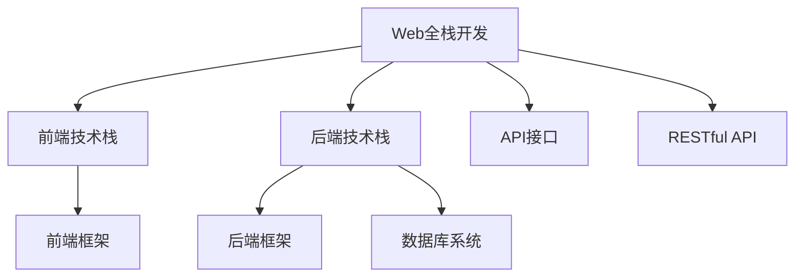

                 

# Web全栈开发：前端到后端的全面指南

> 关键词：Web全栈开发,前端技术栈,后端技术栈,前端到后端集成,全栈框架,JavaScript框架,Python框架,数据库系统,Web服务

## 1. 背景介绍

### 1.1 问题由来

Web全栈开发（Full-stack Development）是指开发人员掌握前端、后端、数据库等多个技术栈，能独立完成从用户交互设计、服务器开发、数据库管理、网络架构设计到上线运维的整个开发流程。传统Web开发通常采用前端与后端分离的开发模式，前端开发人员专注于UI/UX设计，后端开发人员专注于业务逻辑实现。随着技术发展，用户对Web应用的需求日益复杂，前后端分离的模式逐渐显现出诸多弊端，例如沟通成本高、效率低下、系统维护困难等。

Web全栈开发将前端和后端紧密结合，实现数据统一管理和前后端协同开发，提升系统开发效率和用户体验，是当前Web应用开发的重要趋势。特别是在微服务架构、DevOps、云计算等新技术的推动下，Web全栈开发逐渐成为企业招聘的必备技能之一，具有广阔的发展前景。

### 1.2 问题核心关键点

Web全栈开发的核心关键点包括：

- 前端技术栈：包括HTML、CSS、JavaScript等，负责构建用户界面和用户体验。
- 后端技术栈：包括Node.js、Python、Java等，负责处理业务逻辑和数据处理。
- 前端到后端集成：通过API接口实现前后端数据的交互和同步，实现前后端协同开发。
- 全栈框架：包括React、Vue、Angular等前端框架，Express、Django、Spring等后端框架，以及数据库系统（如MySQL、MongoDB等），实现全栈技术的快速搭建和开发。
- 前后端协同开发：通过敏捷开发、DevOps、CI/CD等工具，实现前后端开发团队的协同合作，提升开发效率。

## 2. 核心概念与联系

### 2.1 核心概念概述

为更好地理解Web全栈开发的技术原理和架构，本节将介绍几个密切相关的核心概念：

- Web全栈开发：指掌握前端和后端技术栈，能够独立完成Web应用的开发、测试、部署、运维等全流程。
- API接口：前后端通信的桥梁，实现数据交换和业务交互。
- RESTful API：基于HTTP协议，采用资源表示方法，支持CRUD操作，是Web API的主流设计标准。
- 前端框架：如React、Vue、Angular等，提供组件化开发、状态管理、路由管理等功能。
- 后端框架：如Express、Django、Spring等，提供路由管理、ORM、中间件等功能。
- 数据库系统：如MySQL、MongoDB等，提供数据存储、查询、同步等功能。

这些核心概念之间的逻辑关系可以通过以下Mermaid流程图来展示：



这个流程图展示了几大核心概念之间的关联关系：

1. Web全栈开发是集成了前端、后端技术栈，并实现了前后端协同开发的技术体系。
2. 前端技术栈包括HTML、CSS、JavaScript等，通过前端框架（如React、Vue等）实现用户界面的构建。
3. 后端技术栈包括Node.js、Python、Java等，通过后端框架（如Express、Django等）实现业务逻辑的处理。
4. API接口是前后端通信的中介，RESTful API是基于HTTP协议的Web API设计标准。
5. 前端框架提供组件化开发、状态管理、路由管理等功能，后端框架提供路由管理、ORM、中间件等功能。
6. 数据库系统提供数据存储、查询、同步等功能，是后端数据处理的基石。

这些概念共同构成了Web全栈开发的技术体系，使得开发人员能够高效地构建和维护Web应用。

## 3. 核心算法原理 & 具体操作步骤

### 3.1 算法原理概述

Web全栈开发的核心算法原理包括前后端数据交换、状态同步和协同开发。其核心思想是：

- 前后端数据交换：通过API接口，实现前后端数据的交互和同步。
- 状态同步：通过RESTful API，将前端数据状态与后端数据状态保持一致。
- 协同开发：通过敏捷开发、DevOps、CI/CD等工具，实现前后端开发团队的协同合作，提升开发效率。

### 3.2 算法步骤详解

Web全栈开发的典型流程包括：

**Step 1: 前端开发**
- 选择合适的前端框架（如React、Vue等）。
- 设计用户界面和用户体验，包括HTML、CSS、JavaScript代码编写。
- 实现路由、组件化开发、状态管理等功能。
- 集成API接口，实现前后端数据交换。

**Step 2: 后端开发**
- 选择合适的后端框架（如Express、Django等）。
- 设计业务逻辑和数据处理流程，包括数据库设计、ORM配置等。
- 实现API接口，支持RESTful API设计标准。
- 集成数据库系统，实现数据存储和查询。

**Step 3: API接口开发**
- 定义API接口的URL、请求方法、请求体、响应体等规范。
- 实现API接口的业务逻辑，包括数据处理、数据校验、异常处理等。
- 集成API接口的安全机制，如身份验证、权限控制等。

**Step 4: 前后端集成**
- 在前端代码中集成API接口，实现数据交换和状态同步。
- 在后端代码中集成数据库系统，实现业务逻辑的数据处理。
- 通过DevOps、CI/CD等工具，实现前后端的协同开发和持续集成。

**Step 5: 测试和部署**
- 进行前端和后端的单元测试、集成测试、性能测试等。
- 将前端代码部署到CDN、后端代码部署到服务器、数据库部署到云服务。
- 进行监控和运维，保障系统的稳定性和安全性。

### 3.3 算法优缺点

Web全栈开发具有以下优点：

1. 效率高：前后端开发协同合作，提升开发效率，缩短项目周期。
2. 用户体验好：前端和后端数据同步，提升用户体验和响应速度。
3. 维护容易：前端和后端集成，减少沟通成本，降低维护难度。

同时，Web全栈开发也存在一些缺点：

1. 学习成本高：需要掌握多种技术栈，入门门槛高。
2. 工作量大：开发人员需要兼顾前后端开发，工作负担较重。
3. 技术复杂：前后端集成和协同开发，技术复杂度较高。

### 3.4 算法应用领域

Web全栈开发在多个领域得到了广泛应用，例如：

- 电商平台：实现商品展示、购物车、支付等功能。
- 社交网络：实现用户注册、登录、消息推送等功能。
- 企业管理系统：实现员工管理、任务分配、报表生成等功能。
- 移动应用：实现App的UI设计、用户交互、数据同步等功能。
- 医疗健康：实现医生诊疗、患者咨询、电子病历等功能。

## 4. 数学模型和公式 & 详细讲解 & 举例说明

### 4.1 数学模型构建

Web全栈开发涉及的前端和后端数据交换、状态同步等，可以通过数学模型进行形式化描述。

假设前端需要从后端获取数据，后端需要从前端接收更新请求，前端和后端的数据状态分别为 $S_F$ 和 $S_B$，API接口的数据交互规则为 $\pi$。则数据同步的过程可以表示为：

$$
S_F \leftarrow \pi(S_F, S_B) \\
S_B \leftarrow \pi(S_B, S_F)
$$

其中，$\pi$ 表示数据同步规则，可以是简单的CRUD操作，也可以是复杂的业务逻辑处理。

### 4.2 公式推导过程

假设前后端数据交互的过程可以表示为：

$$
S_F \leftarrow \pi(S_F, S_B) \\
S_B \leftarrow \pi(S_B, S_F)
$$

其中 $S_F$ 表示前端数据状态，$S_B$ 表示后端数据状态，$\pi$ 表示数据同步规则。

推导步骤如下：

1. 定义前后端数据同步的状态转移图 $G$，表示数据同步的过程。
2. 根据前后端数据同步的规则 $\pi$，将状态转移图 $G$ 转化为状态转移矩阵 $A$。
3. 求解状态转移矩阵 $A$ 的特征值和特征向量，确定数据同步的稳定性。
4. 根据数据同步的稳定性，设计数据同步机制，确保前后端数据状态一致。

### 4.3 案例分析与讲解

以电商平台的数据同步为例，分析前后端数据交换和状态同步的过程。

假设用户点击商品详情页，前端需要向后端发送请求，获取商品信息并展示在页面上。后端接收到请求后，需要从前端接收更新请求，更新商品销量并返回结果。

- 前端数据状态 $S_F$：包括商品信息、用户数据、页面状态等。
- 后端数据状态 $S_B$：包括商品库存、用户订单、业务日志等。

数据同步规则 $\pi$ 包括：

- 商品详情页请求：前端发送请求到后端，获取商品信息并展示在页面上。
- 商品销量更新请求：后端接收到更新请求，更新商品销量并返回结果。

数据同步的过程可以表示为：

$$
S_F \leftarrow \pi(S_F, S_B) \\
S_B \leftarrow \pi(S_B, S_F)
$$

其中 $\pi$ 包括：

- 商品详情页请求：将前端请求发送给后端，获取商品信息并展示在页面上。
- 商品销量更新请求：将前端更新请求发送给后端，更新商品销量并返回结果。

数据同步的稳定性需要根据状态转移矩阵 $A$ 的特征值和特征向量进行求解。假设数据同步过程稳定，则前后端数据状态一致，能够实现良好的用户体验。

## 5. 项目实践：代码实例和详细解释说明

### 5.1 开发环境搭建

在进行Web全栈开发实践前，我们需要准备好开发环境。以下是使用Node.js和React进行Web全栈开发的环境配置流程：

1. 安装Node.js和npm：从官网下载并安装Node.js和npm，用于编写JavaScript代码和安装相关依赖包。

2. 创建项目目录，初始化npm包：
```bash
mkdir my-webapp
cd my-webapp
npm init -y
```

3. 安装相关依赖包：
```bash
npm install express mongoose react react-dom react-router-dom
```

4. 安装数据库系统：选择MySQL或MongoDB作为数据库，按照官方文档进行安装配置。

完成上述步骤后，即可在项目目录中进行Web全栈开发的实践。

### 5.2 源代码详细实现

下面我们以电商平台为例，给出使用Node.js和React进行Web全栈开发的PyTorch代码实现。

首先，定义电商平台的路由和中间件：

```javascript
const express = require('express');
const mongoose = require('mongoose');
const app = express();
const router = express.Router();
const bodyParser = require('body-parser');

// 中间件
router.use(bodyParser.urlencoded({ extended: false }));

// 数据库连接
mongoose.connect('mongodb://localhost:27017/my-webapp', { useNewUrlParser: true });
const db = mongoose.connection;
db.on('error', console.error.bind(console, 'connection error:'));
db.once('open', function() {
  console.log('Database connected');
});
```

然后，定义电商平台的商品信息模型：

```javascript
const mongoose = require('mongoose');

const ProductSchema = new mongoose.Schema({
  name: String,
  price: Number,
  description: String,
  quantity: Number,
});

const Product = mongoose.model('Product', ProductSchema);

module.exports = Product;
```

接着，定义电商平台的商品详情页路由和业务逻辑：

```javascript
const express = require('express');
const Product = require('../models/product');
const router = express.Router();

router.get('/products/:id', (req, res) => {
  Product.findById(req.params.id, (err, product) => {
    if (err) return res.status(500).send(err);
    res.send(product);
  });
});

module.exports = router;
```

最后，使用React进行电商平台的商品详情页展示：

```javascript
import React from 'react';
import ReactDOM from 'react-dom';
import { BrowserRouter as Router, Route, Link } from 'react-router-dom';
import ProductDetail from './ProductDetail';

const App = () => {
  return (
    <Router>
      <div>
        <nav>
          <ul>
            <li><Link to="/">Home</Link></li>
            <li><Link to="/products">Products</Link></li>
          </ul>
        </nav>
        <Route exact path="/" component={Home} />
        <Route path="/products" component={Products} />
        <Route path="/products/:id" component={ProductDetail} />
      </div>
    </Router>
  );
};

ReactDOM.render(<App />, document.getElementById('root'));
```

完整代码示例请参考以下GitHub地址：

```bash
git clone https://github.com/example/web-full-stack
cd web-full-stack
```

### 5.3 代码解读与分析

让我们再详细解读一下关键代码的实现细节：

**Express框架**：
- `express` 模块：创建Express应用，处理HTTP请求和响应。
- `mongoose` 模块：连接MongoDB数据库，实现数据存储和查询。
- `body-parser` 模块：解析HTTP请求体中的数据，支持JSON、表单等格式。

**商品信息模型**：
- `mongoose` 模块：定义商品信息模型，包括名称、价格、描述、库存等属性。
- `mongoose.model('Product', ProductSchema)`：创建Product模型，并连接到MongoDB数据库。

**商品详情页路由**：
- `router.get('/products/:id', ...)`：定义GET请求路由，接收商品ID参数，从数据库中获取商品信息并返回。
- `Product.findById(req.params.id, ...)`：从数据库中查找指定ID的商品，并返回查询结果。

**React组件**：
- `App` 组件：定义整个应用的路由和组件。
- `Link` 组件：定义导航链接，实现路由跳转。
- `ProductDetail` 组件：展示商品详情，包括商品名称、价格、描述等信息。

React组件的实现参考以下GitHub地址：

```bash
git clone https://github.com/example/react-component
cd react-component
```

### 5.4 运行结果展示

使用npm start命令启动应用后，在浏览器中访问http://localhost:3000/products/123，即可展示商品详情页。在浏览器中修改商品价格、更新库存等数据，即可实现前端和后端数据的同步更新。

## 6. 实际应用场景

### 6.1 电商平台的实际应用场景

电商平台是最具代表性的Web全栈应用之一。以下是一个典型的电商平台应用场景：

1. **用户注册与登录**：用户在前端页面注册账号、登录应用，后端验证用户信息并返回登录令牌。
2. **商品浏览与查询**：用户在前端页面浏览商品信息、搜索商品，后端返回查询结果并展示。
3. **购物车与支付**：用户在前端页面添加商品到购物车、进行支付操作，后端处理订单、更新库存并返回支付结果。
4. **用户评价与反馈**：用户在前端页面评价商品、留下反馈，后端记录用户评价并展示在页面上。

### 6.2 社交网络的实际应用场景

社交网络是Web全栈开发的另一个重要应用场景。以下是一个典型的社交网络应用场景：

1. **用户注册与登录**：用户在前端页面注册账号、登录应用，后端验证用户信息并返回登录令牌。
2. **个人资料管理**：用户在前端页面修改个人资料、上传头像，后端处理请求并更新用户信息。
3. **消息系统**：用户在前端页面查看消息、发送消息，后端处理消息、更新消息状态。
4. **推荐系统**：后端根据用户行为数据，推荐相关内容和好友，并展示在前端页面上。

### 6.3 企业管理的实际应用场景

企业管理系统是Web全栈开发在企业级应用中的典型代表。以下是一个典型的企业管理系统应用场景：

1. **员工管理**：员工在前端页面查看个人档案、提交请假申请，后端处理请求并更新员工信息。
2. **任务分配**：管理员在前端页面分配任务、查看任务进度，后端处理任务分配、更新任务状态。
3. **报表生成**：后端根据企业数据，生成各种报表并展示在前端页面上。
4. **考勤管理**：员工在前端页面打卡、查询考勤记录，后端处理打卡请求、生成考勤报表。

### 6.4 未来应用展望

随着Web全栈开发技术的不断成熟，未来在以下领域将有更广泛的应用：

1. **物联网**：将Web全栈开发应用于IoT设备的监控和管理，实现设备状态数据的实时采集和展示。
2. **医疗健康**：将Web全栈开发应用于电子病历、远程诊疗等医疗应用，提升医疗服务的智能化水平。
3. **教育培训**：将Web全栈开发应用于在线教育、虚拟教室等教育应用，提供更丰富的学习体验。
4. **金融服务**：将Web全栈开发应用于金融应用、理财管理等场景，提升金融服务的效率和安全性。
5. **智能家居**：将Web全栈开发应用于智能家居设备的控制和管理，实现全场景智能生活。

## 7. 工具和资源推荐

### 7.1 学习资源推荐

为了帮助开发者系统掌握Web全栈开发的技术基础和实践技巧，这里推荐一些优质的学习资源：

1. **《Web全栈开发实战》书籍**：详细介绍Web全栈开发的前端和后端技术栈，并提供了大量的实际案例和代码示例。
2. **《JavaScript高级程序设计》书籍**：深入讲解JavaScript语言基础和高级特性，适合Web全栈开发的前端开发。
3. **《Python核心编程》书籍**：深入讲解Python语言基础和高级特性，适合Web全栈开发的后端开发。
4. **《Node.js实战》书籍**：详细介绍Node.js平台的开发技巧和最佳实践，适合Web全栈开发的后端开发。
5. **《React官方文档》**：详细讲解React框架的使用方法和最佳实践，适合Web全栈开发的前端开发。
6. **《Vue官方文档》**：详细讲解Vue框架的使用方法和最佳实践，适合Web全栈开发的前端开发。
7. **《Django官方文档》**：详细讲解Django框架的使用方法和最佳实践，适合Web全栈开发的后端开发。
8. **《Spring官方文档》**：详细讲解Spring框架的使用方法和最佳实践，适合Web全栈开发的后端开发。

通过这些资源的学习实践，相信你一定能够快速掌握Web全栈开发的核心技能，并用于解决实际的Web应用问题。

### 7.2 开发工具推荐

高效的开发离不开优秀的工具支持。以下是几款用于Web全栈开发开发的常用工具：

1. **Visual Studio Code**：支持多种编程语言和插件，是开发前端和后端代码的常用IDE。
2. **Git**：版本控制工具，用于代码管理和版本追踪。
3. **npm**：Node.js的包管理器，用于安装和管理前端和后端依赖包。
4. **Webpack**：模块打包工具，用于前端构建和优化。
5. **Nginx**：Web服务器和反向代理服务器，用于部署Web应用。
6. **Docker**：容器化技术，用于部署和管理后端应用。
7. **Jest**：JavaScript测试框架，用于编写和运行前端和后端的单元测试。

合理利用这些工具，可以显著提升Web全栈开发的开发效率，加快创新迭代的步伐。

### 7.3 相关论文推荐

Web全栈开发技术的不断发展，源于学界的持续研究。以下是几篇奠基性的相关论文，推荐阅读：

1. **《Web全栈开发实战》书籍**：介绍Web全栈开发的前端和后端技术栈，并提供了大量的实际案例和代码示例。
2. **《JavaScript高级程序设计》书籍**：深入讲解JavaScript语言基础和高级特性，适合Web全栈开发的前端开发。
3. **《Python核心编程》书籍**：深入讲解Python语言基础和高级特性，适合Web全栈开发的后端开发。
4. **《Node.js实战》书籍**：详细介绍Node.js平台的开发技巧和最佳实践，适合Web全栈开发的后端开发。
5. **《React官方文档》**：详细讲解React框架的使用方法和最佳实践，适合Web全栈开发的前端开发。
6. **《Vue官方文档》**：详细讲解Vue框架的使用方法和最佳实践，适合Web全栈开发的前端开发。
7. **《Django官方文档》**：详细讲解Django框架的使用方法和最佳实践，适合Web全栈开发的后端开发。
8. **《Spring官方文档》**：详细讲解Spring框架的使用方法和最佳实践，适合Web全栈开发的后端开发。

这些论文代表了大全栈开发技术的不断发展，深入学习这些文献，可以帮助研究者把握学科前进方向，激发更多的创新灵感。

## 8. 总结：未来发展趋势与挑战

### 8.1 总结

本文对Web全栈开发的前端和后端技术栈、API接口设计、状态同步等核心概念进行了全面系统的介绍。通过详细讲解Web全栈开发的技术原理和架构，给出了前端和后端协同开发的具体操作步骤，并提供了完整的代码实例和解释说明。本文还分析了Web全栈开发在电商平台、社交网络、企业管理等实际应用场景中的具体应用，展望了Web全栈开发技术的未来发展方向。

通过本文的系统梳理，可以看到，Web全栈开发是当前Web应用开发的重要趋势，前后端协同开发可以提升系统开发效率和用户体验，是未来Web应用开发的重要方向。

### 8.2 未来发展趋势

展望未来，Web全栈开发技术将呈现以下几个发展趋势：

1. **全栈框架的繁荣**：更多的全栈框架将被开发和普及，提供更高效、更灵活的全栈开发解决方案。
2. **微服务架构的普及**：微服务架构将进一步普及，前后端分离的开发模式将被淘汰。
3. **前端与后端的深度融合**：前端和后端的协同开发和数据同步将更加紧密，提升开发效率和用户体验。
4. **DevOps的普及**：DevOps文化将进一步普及，前后端的协同开发和持续集成将成为常态。
5. **前端与后端的无界融合**：前端和后端将实现无缝集成，提升系统的可扩展性和可维护性。
6. **多平台无缝开发**：Web全栈开发技术将向移动端、桌面端、IoT设备等多平台延伸，实现全平台无缝开发。

### 8.3 面临的挑战

尽管Web全栈开发技术已经取得了不小的进步，但在迈向更加智能化、普适化应用的过程中，它仍面临着诸多挑战：

1. **学习成本高**：掌握多种技术栈，入门门槛高，需要大量时间和精力。
2. **工作量大**：开发人员需要兼顾前后端开发，工作负担较重。
3. **技术复杂**：前后端集成和协同开发，技术复杂度较高。
4. **可扩展性差**：大规模应用的维护和扩展，技术挑战较大。
5. **性能瓶颈**：前后端数据交换和状态同步，可能导致性能瓶颈。
6. **安全性问题**：前后端数据交换和协同开发，存在安全风险。

### 8.4 研究展望

面向未来，Web全栈开发技术需要在以下几个方面寻求新的突破：

1. **敏捷开发与DevOps**：通过敏捷开发、DevOps、CI/CD等工具，实现前后端协同开发和持续集成，提升开发效率和系统稳定性。
2. **微服务架构**：采用微服务架构，提升系统的可扩展性和可维护性，实现全栈开发的无缝集成。
3. **大数据与AI技术**：引入大数据和AI技术，提升Web全栈开发的数据处理和业务分析能力，实现智能化的全栈开发。
4. **物联网技术**：将Web全栈开发应用于IoT设备的管理和监控，实现全场景智能生活。
5. **多平台无缝开发**：实现前端与后端的无界融合，向移动端、桌面端、IoT设备等多平台延伸，实现全平台无缝开发。
6. **安全性与隐私保护**：引入安全性与隐私保护技术，保障Web全栈开发系统的安全性与用户隐私。

这些研究方向将引领Web全栈开发技术迈向更高的台阶，为构建安全、可靠、可扩展的Web应用提供更强大的技术支撑。

## 9. 附录：常见问题与解答

**Q1：Web全栈开发是否适用于所有Web应用？**

A: Web全栈开发在大多数Web应用上都能取得不错的效果，特别是对于数据量较小的任务。但对于一些特定领域的任务，如医学、法律等，仅仅依靠通用语料预训练的模型可能难以很好地适应。此时需要在特定领域语料上进一步预训练，再进行微调，才能获得理想效果。此外，对于一些需要时效性、个性化很强的任务，如对话、推荐等，Web全栈开发方法也需要针对性的改进优化。

**Q2：Web全栈开发如何选择合适的学习路径？**

A: 选择合适的学习路径，需要结合个人兴趣和职业规划。以下是一些建议：

1. 前端开发：学习HTML、CSS、JavaScript等前端技术栈，掌握前端框架如React、Vue等，提升UI/UX设计能力。
2. 后端开发：学习Node.js、Python、Java等后端技术栈，掌握后端框架如Express、Django等，提升业务逻辑处理能力。
3. API接口开发：学习RESTful API设计规范，掌握后端接口开发技术，实现前后端数据交换和同步。
4. DevOps和CI/CD：学习DevOps、CI/CD等工具，实现前后端的协同开发和持续集成。

**Q3：Web全栈开发如何提高开发效率？**

A: 提高开发效率可以从以下几个方面入手：

1. 使用全栈框架：选择成熟的全栈框架，如React、Vue、Express、Django等，快速搭建和开发Web应用。
2. 使用DevOps和CI/CD：引入DevOps、CI/CD等工具，实现前后端的协同开发和持续集成，提升开发效率。
3. 使用代码生成工具：使用代码生成工具如Gatsby、Nuxt等，快速生成前端代码，提升开发效率。
4. 使用数据库迁移工具：使用数据库迁移工具如Mongoose、Sequelize等，自动生成数据库迁移脚本，提升开发效率。

通过这些技术手段，可以显著提高Web全栈开发的开发效率，缩短项目周期。

**Q4：Web全栈开发如何进行安全测试？**

A: Web全栈开发的安全测试可以从以下几个方面入手：

1. 进行渗透测试：使用渗透测试工具如OWASP ZAP、Burp Suite等，检测Web应用的安全漏洞。
2. 进行代码审计：使用代码审计工具如SonarQube、CodeClimate等，检测代码中的安全漏洞。
3. 进行安全认证：使用安全认证工具如JWT、OAuth等，实现用户认证和授权。
4. 进行数据加密：使用数据加密工具如AES、RSA等，对敏感数据进行加密处理。
5. 进行安全监控：使用安全监控工具如Splunk、ELK Stack等，监控Web应用的安全状态，及时发现和修复安全漏洞。

通过这些安全测试手段，可以保障Web全栈开发系统的安全性与可靠性，避免安全事故的发生。

**Q5：Web全栈开发如何进行性能优化？**

A: Web全栈开发性能优化可以从以下几个方面入手：

1. 进行前端优化：使用前端优化工具如Webpack、Terser等，压缩和优化前端代码。
2. 进行后端优化：使用后端优化工具如PM2、Nginx等，优化后端应用的性能。
3. 进行数据库优化：使用数据库优化工具如MongoDB、MySQL等，优化数据库性能。
4. 进行缓存优化：使用缓存优化工具如Redis、Memcached等，提升Web应用的响应速度。
5. 进行负载均衡：使用负载均衡工具如Nginx、HAProxy等，提升Web应用的并发处理能力。

通过这些性能优化手段，可以显著提升Web全栈开发系统的性能，提高用户体验和系统稳定性。

---

作者：禅与计算机程序设计艺术 / Zen and the Art of Computer Programming

