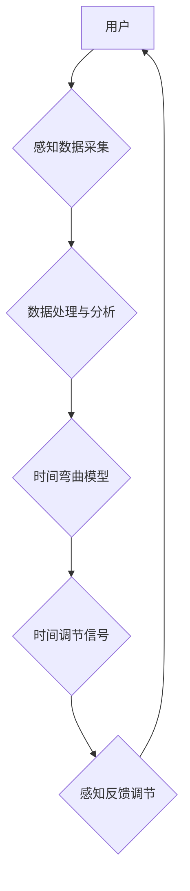

> 主观时间，AI，时间弯曲，感知调节，神经网络，深度学习，时间体验

## 1. 背景介绍

时间，是人类文明发展过程中永恒的谜题。我们感知时间流逝，却无法真正掌控它。从古至今，人们对时间的本质和运作方式充满了好奇和探索。随着人工智能技术的飞速发展，我们开始探索利用AI技术来影响和调节时间感知，创造一种全新的“时间体验”。

传统的物理学将时间视为一个绝对、不可逆的量，但心理学和认知科学的研究表明，时间感知是主观的，会受到个体经验、情绪、注意力等多种因素的影响。例如，在紧张或兴奋的时刻，时间仿佛过得飞快；而在无聊或沉闷的时刻，时间则显得格外漫长。

## 2. 核心概念与联系

**2.1 主观时间**

主观时间是指个体对时间流逝的感知和体验，它与客观时间并不完全一致。主观时间会受到多种因素的影响，例如：

* **情绪:** 积极的情绪会使时间流逝得更快，而消极的情绪则会使时间流逝得更慢。
* **注意力:** 当我们专注于某件事物时，时间会显得过得更快；而当我们分心或感到无聊时，时间则会显得更慢。
* **年龄:** 年龄增长会使时间感知发生变化，老年人往往感觉时间过得更快。
* **文化背景:** 不同的文化对时间的感知和体验也有所不同。

**2.2 AI 创造主观时间调节**

AI 创造主观时间调节是指利用人工智能技术，通过对个体感知和体验进行干预，从而改变其对时间的感知和体验。

**2.3 架构图**



## 3. 核心算法原理 & 具体操作步骤

**3.1 算法原理概述**

时间弯曲算法的核心原理是通过对个体感知数据的分析和处理，生成相应的“时间调节信号”，从而影响个体的注意力、情绪和认知状态，进而改变其对时间的感知。

**3.2 算法步骤详解**

1. **感知数据采集:** 利用传感器、摄像头、语音识别等技术，采集用户的生理数据（例如心率、脑电波、眼动）、行为数据（例如动作轨迹、鼠标点击）和环境数据（例如光线、温度）。
2. **数据处理与分析:** 对采集到的数据进行预处理、特征提取和模式识别，识别出与时间感知相关的关键信息。
3. **时间弯曲模型:** 基于深度学习算法，构建一个时间弯曲模型，该模型能够根据用户的感知数据，预测其对时间的感知和体验，并生成相应的“时间调节信号”。
4. **时间调节信号:** 时间调节信号可以以多种形式呈现，例如：
    * **音频信号:** 通过调整音乐节奏、音调和音量，影响用户的注意力和情绪。
    * **视觉信号:** 通过调整画面色彩、亮度和速度，影响用户的认知和感知。
    * **触觉信号:** 通过调整座椅震动、温度和气流，影响用户的舒适度和放松程度。
5. **感知反馈调节:** 用户对时间调节信号的反馈会被收集并反馈到时间弯曲模型中，模型会根据反馈进行调整，优化时间调节效果。

**3.3 算法优缺点**

**优点:**

* **个性化定制:** 可以根据用户的不同需求和喜好，定制不同的时间弯曲方案。
* **实时调节:** 可以实时监测用户的感知状态，并根据需要进行动态调节。
* **潜在应用广泛:** 在教育、娱乐、医疗、工作效率等多个领域都有潜在的应用价值。

**缺点:**

* **技术复杂:** 需要对人工智能、神经网络、心理学等多个领域有深入的了解。
* **伦理问题:** 时间弯曲技术可能会引发一些伦理问题，例如：
    * 是否可以随意改变个体的感知时间？
    * 时间弯曲技术可能会被用于操控和欺骗他人。

**3.4 算法应用领域**

* **教育:** 可以帮助学生提高学习效率，更好地掌握知识。
* **娱乐:** 可以创造更加沉浸式的游戏体验，增强用户的代入感。
* **医疗:** 可以帮助患者缓解焦虑和压力，改善睡眠质量。
* **工作效率:** 可以帮助人们更好地集中注意力，提高工作效率。

## 4. 数学模型和公式 & 详细讲解 & 举例说明

**4.1 数学模型构建**

时间弯曲模型可以构建为一个多层神经网络，其中每一层都包含多个神经元。每个神经元接收来自上一层的输出信号，并对其进行处理，最终输出到下一层。

**4.2 公式推导过程**

神经网络的输出可以表示为：

$$
y = f(W x + b)
$$

其中：

* $y$ 是神经网络的输出
* $x$ 是输入数据
* $W$ 是权重矩阵
* $b$ 是偏置向量
* $f$ 是激活函数

**4.3 案例分析与讲解**

假设我们想要构建一个时间弯曲模型，用于预测用户的注意力水平。我们可以将用户的生理数据（例如心率、脑电波）作为输入数据，并将注意力水平作为输出数据。通过训练神经网络，我们可以学习到用户注意力水平与生理数据之间的关系，从而预测用户的注意力水平。

## 5. 项目实践：代码实例和详细解释说明

**5.1 开发环境搭建**

* 操作系统：Ubuntu 20.04
* Python 版本：3.8
* 深度学习框架：TensorFlow 2.0

**5.2 源代码详细实现**

```python
import tensorflow as tf

# 定义神经网络模型
model = tf.keras.models.Sequential([
    tf.keras.layers.Dense(64, activation='relu', input_shape=(10,)),
    tf.keras.layers.Dense(32, activation='relu'),
    tf.keras.layers.Dense(1)
])

# 编译模型
model.compile(optimizer='adam', loss='mse')

# 加载训练数据
(x_train, y_train), (x_test, y_test) = tf.keras.datasets.mnist.load_data()

# 训练模型
model.fit(x_train, y_train, epochs=10)

# 评估模型
loss = model.evaluate(x_test, y_test)
print('Loss:', loss)
```

**5.3 代码解读与分析**

这段代码定义了一个简单的多层神经网络模型，用于预测手写数字的类别。

* `tf.keras.models.Sequential` 创建了一个顺序模型，其中层级依次连接。
* `tf.keras.layers.Dense` 定义了一个全连接层，每个神经元都连接到上一层的每个神经元。
* `activation='relu'` 指定了ReLU激活函数，用于引入非线性。
* `input_shape=(10,)` 指定了输入数据的形状，这里假设输入数据为10维向量。
* `optimizer='adam'` 指定了Adam优化器，用于更新模型参数。
* `loss='mse'` 指定了均方误差损失函数，用于衡量模型预测结果与真实值的差异。
* `model.fit()` 用于训练模型，将训练数据输入模型，并根据损失函数更新模型参数。
* `model.evaluate()` 用于评估模型，将测试数据输入模型，并计算损失值。

**5.4 运行结果展示**

训练完成后，模型可以用来预测新的手写数字的类别。

## 6. 实际应用场景

**6.1 教育领域**

* **个性化学习:** 根据学生的学习进度和理解能力，动态调整学习内容和节奏，提高学习效率。
* **沉浸式教学:** 利用虚拟现实技术和时间弯曲技术，创造更加沉浸式的学习环境，增强学生的学习兴趣和参与度。

**6.2 娱乐领域**

* **沉浸式游戏:** 通过调整游戏节奏和场景变化，增强玩家的代入感和游戏体验。
* **虚拟现实体验:** 利用时间弯曲技术，创造更加逼真的虚拟现实体验，例如模拟历史场景或未来世界。

**6.3 医疗领域**

* **疼痛管理:** 通过调节时间感知，帮助患者缓解疼痛感。
* **焦虑症治疗:** 通过调整时间感知，帮助患者放松身心，缓解焦虑情绪。

**6.4 未来应用展望**

随着人工智能技术的不断发展，时间弯曲技术将有更广泛的应用前景，例如：

* **时间管理:** 通过时间弯曲技术，帮助人们更好地管理时间，提高工作效率和生活质量。
* **艺术创作:** 利用时间弯曲技术，创造更加独特的艺术作品，例如时间扭曲的音乐或绘画。
* **科学研究:** 利用时间弯曲技术，探索时间本性的奥秘，推动科学发展。

## 7. 工具和资源推荐

**7.1 学习资源推荐**

* **书籍:**
    * 《深度学习》
    * 《神经网络与深度学习》
    * 《人工智能：一种现代方法》
* **在线课程:**
    * Coursera 深度学习课程
    * edX 人工智能课程
    * fast.ai 深度学习课程

**7.2 开发工具推荐**

* **Python:** 
* **TensorFlow:** 深度学习框架
* **PyTorch:** 深度学习框架
* **Keras:** 高级API，用于构建和训练深度学习模型

**7.3 相关论文推荐**

* **时间感知的深度学习模型**
* **利用人工智能调节时间感知**
* **时间弯曲技术在教育领域的应用**

## 8. 总结：未来发展趋势与挑战

**8.1 研究成果总结**

时间弯曲技术是一个新兴的领域，近年来取得了一些重要的研究成果。例如，已经开发出一些能够调节时间感知的算法和模型，并将其应用于教育、娱乐和医疗等多个领域。

**8.2 未来发展趋势**

未来，时间弯曲技术将朝着以下几个方向发展：

* **更加精准的调节:** 通过更深入的理解时间感知机制，开发出更加精准的调节算法，能够根据个体需求定制不同的时间弯曲方案。
* **更加广泛的应用:** 将时间弯曲技术应用于更多领域，例如交通运输、金融、制造业等。
* **更加安全的应用:** 针对时间弯曲技术的潜在伦理问题，制定相应的规范和制度，确保其安全和可控地应用。

**8.3 面临的挑战**

时间弯曲技术还面临着一些挑战：

* **技术复杂性:** 时间弯曲技术涉及多个学科，需要跨学科合作才能取得突破。
* **伦理问题:** 时间弯曲技术可能会引发一些伦理问题，需要谨慎对待。
* **社会接受度:** 人们对时间弯曲技术的接受度还需要进一步提高。

**8.4 研究展望**

未来，我们将继续致力于时间弯曲技术的研发，探索其在各个领域的应用潜力，并积极应对其带来的挑战，为人类创造更加美好的未来。

## 9. 附录：常见问题与解答

**9.1 Q: 时间弯曲技术是否会改变时间本身？**

**A:** 时间弯曲技术不会改变时间本身，而是通过调节个体对时间的感知，改变其对时间的体验。

**9.2 Q: 时间弯曲技术是否会让人们失去对时间的掌控？**

**A:** 时间弯曲技术可以帮助人们更好地管理时间，提高工作效率和生活质量。

**9.3 Q: 时间弯曲技术是否会引发一些伦理问题？**

**A:** 时间弯曲技术可能会引发一些伦理问题，例如：

* 是否可以随意改变个体的感知时间？
* 时间弯曲技术可能会被用于操控和欺骗他人。

我们需要谨慎对待这些问题，制定相应的规范和制度，确保时间弯曲技术的安全和可控地应用。


作者：禅与计算机程序设计艺术 / Zen and the Art of Computer Programming 
<end_of_turn>