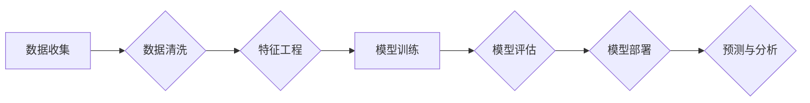

> 大数据分析，信息差，数据挖掘，机器学习，预测模型，算法原理，实践应用，未来趋势

## 1. 背景介绍

在信息爆炸的时代，海量数据无处不在，从社交媒体到金融交易，从医疗记录到工业传感器，数据正在以指数级增长。如何从这些海量数据中挖掘有价值的信息，洞察隐藏的规律，并将其转化为决策支持和业务增值，成为当今企业和研究机构面临的重大挑战。

大数据分析作为解决这一挑战的关键技术，旨在通过先进的算法和模型，从海量数据中提取有意义的知识和洞察。而“信息差”则是大数据分析的核心原理之一。

信息差是指在数据拥有者和数据使用者之间存在的知识和理解差距。数据拥有者拥有原始数据，但可能缺乏对数据的深入理解和分析能力；而数据使用者可能对特定领域有深入的专业知识，但缺乏对数据的获取和处理能力。

大数据分析通过缩小信息差，将数据和专业知识相结合，从而实现对数据的有效挖掘和利用。

## 2. 核心概念与联系

大数据分析的核心概念包括：

* **数据挖掘**: 从大规模、复杂的数据集中发现隐藏的模式、趋势和关系。
* **机器学习**: 利用算法和统计模型，从数据中学习，并进行预测或分类。
* **预测建模**: 基于历史数据，构建预测模型，预测未来事件或趋势。

这些概念相互关联，共同构成了大数据分析的框架。

**Mermaid 流程图**



## 3. 核心算法原理 & 具体操作步骤

### 3.1  算法原理概述

常见的机器学习算法包括：

* **线性回归**: 用于预测连续变量，假设数据之间存在线性关系。
* **逻辑回归**: 用于预测分类变量，将数据映射到0或1。
* **决策树**: 通过一系列规则，将数据分类或预测。
* **支持向量机**: 通过寻找最佳分割超平面，将数据分类。
* **k近邻**: 根据数据点之间的距离，预测分类或回归结果。

### 3.2  算法步骤详解

以线性回归为例，其步骤如下：

1. **数据收集和预处理**: 收集相关数据，并进行清洗、转换和特征工程。
2. **模型构建**: 使用线性回归算法，构建预测模型。
3. **模型训练**: 使用训练数据，训练模型参数。
4. **模型评估**: 使用测试数据，评估模型性能。
5. **模型部署**: 将训练好的模型部署到生产环境中。

### 3.3  算法优缺点

每个算法都有其优缺点，需要根据具体应用场景选择合适的算法。

例如，线性回归算法简单易懂，但对数据线性关系要求较高；决策树算法可以处理非线性关系，但容易过拟合；支持向量机算法性能优异，但训练时间较长。

### 3.4  算法应用领域

机器学习算法广泛应用于各个领域，例如：

* **金融**: 欺诈检测、信用评分、风险管理。
* **医疗**: 疾病诊断、药物研发、患者个性化治疗。
* **电商**: 商品推荐、用户画像、精准营销。
* **交通**: 交通预测、路线规划、自动驾驶。

## 4. 数学模型和公式 & 详细讲解 & 举例说明

### 4.1  数学模型构建

线性回归模型的数学表达式为：

$$y = \beta_0 + \beta_1x_1 + \beta_2x_2 + ... + \beta_nx_n + \epsilon$$

其中：

* $y$ 是预测变量
* $x_1, x_2, ..., x_n$ 是自变量
* $\beta_0, \beta_1, ..., \beta_n$ 是模型参数
* $\epsilon$ 是误差项

### 4.2  公式推导过程

模型参数的估计可以通过最小二乘法进行。最小二乘法旨在找到使预测值与实际值误差平方和最小的参数值。

### 4.3  案例分析与讲解

假设我们想要预测房屋价格，自变量包括房屋面积、房间数量、地理位置等。我们可以使用线性回归模型，将这些自变量与房屋价格建立关系。

通过训练模型，我们可以得到模型参数，例如：

* $\beta_0 = 100000$
* $\beta_1 = 500$
* $\beta_2 = 10000$

这意味着，房屋面积每增加1平方米，价格增加500元；房间数量每增加1个，价格增加10000元。

## 5. 项目实践：代码实例和详细解释说明

### 5.1  开发环境搭建

可以使用Python语言和相关库进行大数据分析项目开发。

常用的库包括：

* **pandas**: 数据处理和分析
* **numpy**: 数值计算
* **scikit-learn**: 机器学习算法

### 5.2  源代码详细实现

```python
import pandas as pd
from sklearn.linear_model import LinearRegression

# 加载数据
data = pd.read_csv('house_price.csv')

# 划分训练集和测试集
X = data[['area', 'rooms']]
y = data['price']
from sklearn.model_selection import train_test_split
X_train, X_test, y_train, y_test = train_test_split(X, y, test_size=0.2, random_state=42)

# 创建线性回归模型
model = LinearRegression()

# 训练模型
model.fit(X_train, y_train)

# 预测测试集结果
y_pred = model.predict(X_test)

# 评估模型性能
from sklearn.metrics import mean_squared_error
mse = mean_squared_error(y_test, y_pred)
print(f'Mean Squared Error: {mse}')
```

### 5.3  代码解读与分析

代码首先加载数据，然后划分训练集和测试集。接着创建线性回归模型，并使用训练集训练模型。最后使用测试集预测结果，并评估模型性能。

### 5.4  运行结果展示

运行代码后，会输出模型的均方误差值，该值越小，模型性能越好。

## 6. 实际应用场景

大数据分析在各个领域都有广泛的应用场景，例如：

* **精准营销**: 通过分析用户行为数据，精准推送广告和产品推荐。
* **风险管理**: 通过分析金融数据，识别潜在的风险和欺诈行为。
* **医疗诊断**: 通过分析患者数据，辅助医生进行疾病诊断和治疗方案制定。
* **智能交通**: 通过分析交通数据，优化交通流量和路线规划。

### 6.4  未来应用展望

随着大数据技术的不断发展，大数据分析将在未来发挥更加重要的作用。例如：

* **个性化服务**: 通过分析用户数据，提供更加个性化的产品和服务。
* **智能决策**: 通过分析数据，辅助企业和政府做出更加智能的决策。
* **科学研究**: 通过分析大规模数据，推动科学研究的进步。

## 7. 工具和资源推荐

### 7.1  学习资源推荐

* **书籍**:
    * 《Python数据科学手册》
    * 《机器学习实战》
    * 《大数据分析》
* **在线课程**:
    * Coursera
    * edX
    * Udemy

### 7.2  开发工具推荐

* **Python**: 
* **Jupyter Notebook**: 用于数据分析和可视化
* **Spark**: 大规模数据处理框架
* **Hadoop**: 分布式存储和处理框架

### 7.3  相关论文推荐

* **《机器学习》**: Tom Mitchell
* **《深入理解机器学习》**:  周志华

## 8. 总结：未来发展趋势与挑战

### 8.1  研究成果总结

大数据分析技术取得了显著的成果，在各个领域都有广泛的应用。

### 8.2  未来发展趋势

未来，大数据分析技术将朝着以下方向发展：

* **更智能的算法**: 开发更加智能、高效的机器学习算法。
* **更强大的计算能力**: 利用云计算和分布式计算，处理更加海量的数据。
* **更深入的洞察**: 从数据中挖掘更深层次的洞察和知识。

### 8.3  面临的挑战

大数据分析技术也面临着一些挑战，例如：

* **数据质量**: 数据质量问题会影响分析结果的准确性。
* **数据隐私**: 如何保护数据隐私是一个重要的伦理问题。
* **人才短缺**: 缺乏大数据分析人才。

### 8.4  研究展望

未来，需要继续加强大数据分析技术的研发和应用，并解决相关挑战，推动大数据分析技术更好地服务于社会发展。

## 9. 附录：常见问题与解答

* **什么是信息差？**

信息差是指数据拥有者和数据使用者之间存在的知识和理解差距。

* **大数据分析有哪些核心概念？**

大数据分析的核心概念包括数据挖掘、机器学习和预测建模。

* **常见的机器学习算法有哪些？**

常见的机器学习算法包括线性回归、逻辑回归、决策树、支持向量机和k近邻。

* **如何评估大数据分析模型的性能？**

常用的评估指标包括均方误差、R方值和准确率。

* **大数据分析技术有哪些应用场景？**

大数据分析技术广泛应用于各个领域，例如精准营销、风险管理、医疗诊断和智能交通。


作者：禅与计算机程序设计艺术 / Zen and the Art of Computer Programming 
<end_of_turn>