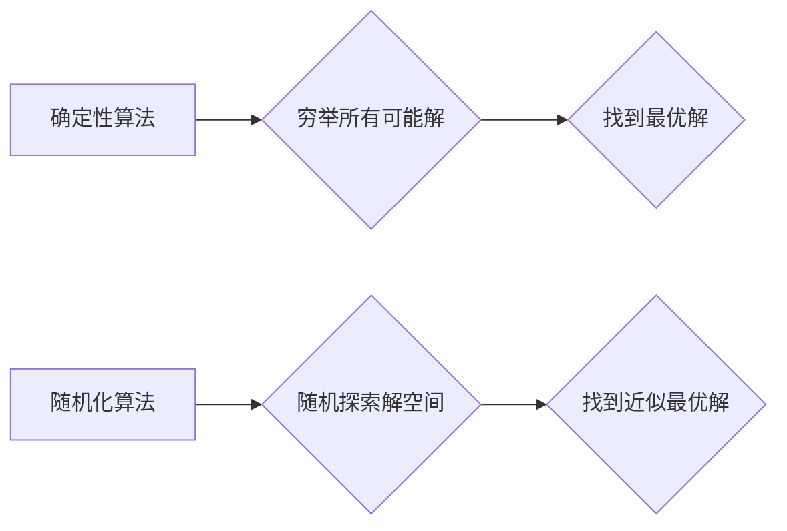

> 随机化、概率论、算法设计、蒙特卡罗方法、随机化策略、计算机科学、数学建模

## 1. 背景介绍

在现代计算机科学领域，面对复杂系统和难以解决的优化问题，传统的确定性算法往往显得力不从心。随机化算法，以其引入随机性，打破了确定性算法的局限性，展现出强大的解决能力。 

随机化算法的思想源于对现实世界的理解：许多自然现象和社会现象都具有随机性，而随机性往往蕴含着丰富的规律和信息。通过巧妙地引入随机性，我们可以探索问题的潜在解空间，找到更优的解决方案，甚至解决一些看似不可解的问题。

## 2. 核心概念与联系

**2.1 随机化算法的本质**

随机化算法的核心在于引入随机性，通过随机选择操作或参数，来引导算法的执行过程。这种随机性并非毫无章法，而是基于概率论和统计学原理，通过设计合理的概率分布，使得算法能够在随机性中找到规律，最终达到目标。

**2.2 随机化算法与传统算法的对比**

| 特征 | 确定性算法 | 随机化算法 |
|---|---|---|
| 算法执行 | 每次执行结果相同 | 每次执行结果可能不同 |
| 解空间探索 | 穷举所有可能解 | 随机探索解空间 |
| 效率 | 对于某些问题，效率高 | 对于某些问题，效率更高 |
| 鲁棒性 | 对输入数据变化敏感 | 对输入数据变化更鲁棒 |

**2.3 随机化算法的优势**

* **解决NP难问题:** 随机化算法可以有效解决一些NP难问题，例如图的最小生成树、旅行商问题等，即使传统算法难以找到最优解，随机化算法也能找到近似最优解。
* **提高效率:** 在某些情况下，随机化算法可以比传统算法更有效率，例如在搜索和排序问题中。
* **增强鲁棒性:** 随机化算法对输入数据变化更鲁棒，能够更好地应对噪声和不确定性。

**2.4 随机化算法的应用领域**

随机化算法广泛应用于各个领域，例如：

* **机器学习:** 随机梯度下降、随机森林等算法
* **算法设计:** 随机化排序、随机化图算法等
* **密码学:** 随机数生成、加密算法等
* **金融建模:** 随机波动模型、风险管理等

**2.5 Mermaid 流程图**



## 3. 核心算法原理 & 具体操作步骤

### 3.1 算法原理概述

蒙特卡罗方法是一种利用随机数模拟来解决复杂问题的算法。它通过重复随机采样，并对采样结果进行统计分析，来逼近问题的真实解。

### 3.2 算法步骤详解

1. **定义目标函数:** 明确需要解决的问题，并将其转化为一个目标函数。
2. **构建随机采样策略:** 设计一个合理的随机采样策略，使得采样结果能够代表问题的整体分布。
3. **进行随机采样:** 根据采样策略，重复进行随机采样，得到一系列样本数据。
4. **统计分析样本数据:** 对样本数据进行统计分析，例如计算平均值、方差等，来逼近目标函数的期望值。
5. **迭代优化:** 根据统计结果，调整采样策略或采样次数，不断迭代优化，直到达到预设的精度要求。

### 3.3 算法优缺点

**优点:**

* **适用范围广:** 适用于各种类型的问题，包括离散问题和连续问题。
* **易于实现:** 算法原理简单，易于实现。
* **无需求解解析解:** 不需要求解问题的解析解，可以有效解决一些难以求解的复杂问题。

**缺点:**

* **精度依赖于采样次数:** 算法的精度取决于采样次数，采样次数越多，精度越高，但计算成本也越高。
* **随机性带来的不确定性:** 由于算法依赖于随机采样，结果存在一定的随机性，难以保证绝对的准确性。

### 3.4 算法应用领域

* **概率论和统计学:** 估计概率分布、模拟随机事件等。
* **金融建模:** 估算风险、模拟股票价格波动等。
* **物理学:** 模拟粒子运动、计算物理量等。
* **计算机科学:** 随机化算法设计、机器学习等。

## 4. 数学模型和公式 & 详细讲解 & 举例说明

### 4.1 数学模型构建

假设我们想要估计一个函数 $f(x)$ 在区间 $[a, b]$ 上的平均值。我们可以使用蒙特卡罗方法构建以下数学模型：

* **随机变量:** $X$ 为服从均匀分布 $U[a, b]$ 的随机变量。
* **目标函数:** $f(X)$ 为函数 $f(x)$ 在随机变量 $X$ 取值时的函数值。
* **期望值:** $E[f(X)]$ 为函数 $f(x)$ 在区间 $[a, b]$ 上的平均值。

### 4.2 公式推导过程

根据蒙特卡罗方法的原理，我们可以通过重复采样随机变量 $X$，并计算 $f(X)$ 的平均值来逼近期望值 $E[f(X)]$。

具体公式如下：

$$
E[f(X)] \approx \frac{1}{N} \sum_{i=1}^{N} f(X_i)
$$

其中，$N$ 为采样次数，$X_i$ 为第 $i$ 次采样的随机变量值。

### 4.3 案例分析与讲解

**例子:** 

假设我们想要估计函数 $f(x) = x^2$ 在区间 $[0, 1]$ 上的平均值。

1. **构建随机变量:** $X$ 服从均匀分布 $U[0, 1]$。
2. **采样:** 随机采样 1000 个 $X$ 值。
3. **计算:** 计算每个 $X$ 值对应的 $f(X)$ 值，并求其平均值。

通过重复上述步骤，我们可以得到 $f(x) = x^2$ 在区间 $[0, 1]$ 上的平均值的一个近似估计。

## 5. 项目实践：代码实例和详细解释说明

### 5.1 开发环境搭建

* 编程语言: Python
* 库依赖: NumPy, Matplotlib

### 5.2 源代码详细实现

```python
import numpy as np
import matplotlib.pyplot as plt

def monte_carlo_integration(func, a, b, N):
    """
    使用蒙特卡罗方法计算函数在区间 [a, b] 上的积分

    Args:
        func: 被积函数
        a: 区间下限
        b: 区间上限
        N: 采样次数

    Returns:
        积分结果的近似值
    """
    x = np.random.uniform(a, b, N)
    y = func(x)
    integral = (b - a) * np.mean(y)
    return integral

# 定义被积函数
def f(x):
    return x**2

# 设置区间和采样次数
a = 0
b = 1
N = 1000

# 计算积分结果
integral = monte_carlo_integration(f, a, b, N)

# 打印结果
print(f"函数 {f.__name__} 在区间 [{a}, {b}] 上的积分结果为: {integral}")

# 可视化结果
x = np.linspace(a, b, 100)
y = f(x)
plt.plot(x, y)
plt.xlabel("x")
plt.ylabel("f(x)")
plt.title("函数曲线和采样点")
plt.show()
```

### 5.3 代码解读与分析

* `monte_carlo_integration` 函数实现蒙特卡罗积分算法，输入被积函数、区间和采样次数，输出积分结果的近似值。
* `f` 函数定义被积函数 $x^2$。
* `a` 和 `b` 设置积分区间。
* `N` 设置采样次数。
* 代码使用 NumPy 生成均匀分布的随机数，并计算每个随机数对应的函数值。
* 最后，代码计算平均值并乘以区间长度，得到积分结果的近似值。

### 5.4 运行结果展示

运行代码后，会输出函数 $x^2$ 在区间 $[0, 1]$ 上的积分结果，以及函数曲线和采样点的可视化图。

## 6. 实际应用场景

### 6.1 金融建模

蒙特卡罗方法广泛应用于金融建模，例如：

* **风险管理:** 模拟市场波动，评估投资组合的风险。
* **定价衍生品:** 计算期权、掉期等衍生品的价值。
* **信用风险评估:** 评估借款人的违约风险。

### 6.2 物理模拟

蒙特卡罗方法可以用于模拟各种物理现象，例如：

* **粒子运动:** 模拟粒子在电磁场中的运动轨迹。
* **原子结构:** 计算原子核和电子云的结构。
* **流体流动:** 模拟流体在管道中的流动。

### 6.3 机器学习

蒙特卡罗方法在机器学习中也有应用，例如：

* **强化学习:** 训练智能体在复杂环境中做出决策。
* **贝叶斯推理:** 更新概率分布，进行预测。
* **随机梯度下降:** 训练神经网络模型。

### 6.4 未来应用展望

随着计算能力的提升和算法的改进，蒙特卡罗方法将在更多领域得到应用，例如：

* **药物研发:** 模拟药物分子与蛋白质的相互作用，加速药物研发。
* **气候模型:** 模拟气候变化，预测未来气候趋势。
* **人工智能:** 训练更强大的人工智能模型。

## 7. 工具和资源推荐

### 7.1 学习资源推荐

* **书籍:**
    * 《蒙特卡罗方法》
    * 《随机过程》
    * 《概率论与数理统计》
* **在线课程:**
    * Coursera: 概率论与统计学
    * edX: 随机过程
    * MIT OpenCourseWare: 概率论与统计学

### 7.2 开发工具推荐

* **Python:** 广泛应用于科学计算和机器学习，拥有丰富的库和工具支持蒙特卡罗方法。
* **R:** 统计分析和数据可视化语言，也支持蒙特卡罗方法。

### 7.3 相关论文推荐

* 《蒙特卡罗方法及其应用》
* 《蒙特卡罗方法在金融建模中的应用》
* 《蒙特卡罗方法在机器学习中的应用》

## 8. 总结：未来发展趋势与挑战

### 8.1 研究成果总结

蒙特卡罗方法是一种强大的数值计算方法，在解决复杂问题方面展现出巨大的潜力。它已被广泛应用于各个领域，并取得了显著的成果。

### 8.2 未来发展趋势

* **算法效率提升:** 研究更有效的蒙特卡罗算法，降低计算成本。
* **应用领域拓展:** 将蒙特卡罗方法应用于更多领域，例如生物信息学、材料科学等。
* **并行计算:** 利用并行计算技术加速蒙特卡罗方法的计算速度。

### 8.3 面临的挑战

* **精度控制:** 提高蒙特卡罗方法的精度，使其能够解决更精确的问题。
* **样本选择:** 设计更有效的样本选择策略，提高采样效率。
* **理论分析:** 深入研究蒙特卡罗方法的理论基础，更好地理解其性能和局限性。

### 