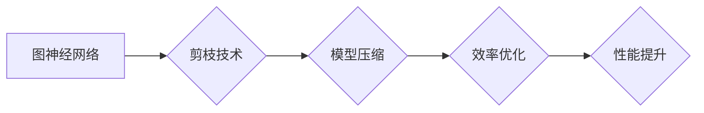

> 图神经网络，剪枝技术，模型压缩，效率优化，性能提升

## 1. 背景介绍

图神经网络 (Graph Neural Networks, GNNs) 作为一种强大的机器学习模型，在处理图结构数据方面展现出非凡的潜力。近年来，GNNs 在社交网络分析、推荐系统、药物发现等领域取得了显著的成果。然而，随着模型复杂度的增加，GNNs 的训练和部署面临着巨大的计算资源和内存消耗挑战。

剪枝技术 (Pruning) 作为一种模型压缩方法，通过移除冗余或不重要的模型参数，有效降低模型大小和计算复杂度，同时保持模型性能。在深度学习领域，剪枝技术已广泛应用于卷积神经网络 (CNNs) 和循环神经网络 (RNNs)，取得了令人瞩目的效果。

## 2. 核心概念与联系

图神经网络 (GNNs) 是一种专门用于处理图结构数据的深度学习模型。它通过在图节点和边上进行信息传播，学习图结构的特征表示，并用于下游任务，例如节点分类、边预测和图分类等。

剪枝技术 (Pruning) 是一种模型压缩方法，通过移除模型中不重要的参数，从而减小模型大小和计算复杂度，同时保持模型性能。

**Mermaid 流程图：**



## 3. 核心算法原理 & 具体操作步骤

### 3.1  算法原理概述

剪枝技术的基本原理是通过分析模型参数的重要性，移除那些对模型性能影响较小的参数。常用的剪枝策略包括：

* **权重剪枝 (Weight Pruning):** 移除权重绝对值较小的参数。
* **结构剪枝 (Structure Pruning):** 移除整个神经网络层或连接。
* **稀疏化 (Sparsification):** 将模型参数存储为稀疏矩阵，只存储非零值。

### 3.2  算法步骤详解

1. **训练模型:** 首先，使用原始数据集训练一个完整的图神经网络模型。
2. **评估参数重要性:** 使用各种方法评估每个参数的重要性，例如：
    * **梯度下降法:** 移除梯度值较小的参数。
    * **L1正则化:** 移除权重绝对值较小的参数。
    * **可解释性分析:** 使用可解释性方法分析模型决策过程，识别重要参数。
3. **移除不重要参数:** 根据评估结果，移除预设比例或阈值以下的参数。
4. **重新训练模型:** 使用剪枝后的模型重新训练，以恢复模型性能。

### 3.3  算法优缺点

**优点:**

* **模型压缩:** 显着减小模型大小和参数数量。
* **效率优化:** 降低模型训练和推理的计算复杂度和时间成本。
* **性能提升:** 在某些情况下，剪枝后的模型性能甚至优于原始模型。

**缺点:**

* **性能损失:** 过度剪枝可能会导致模型性能下降。
* **训练复杂度:** 剪枝过程需要额外的训练步骤。
* **参数选择:** 需要选择合适的剪枝策略和参数阈值。

### 3.4  算法应用领域

剪枝技术在图神经网络领域具有广泛的应用前景，例如：

* **资源有限设备:** 在移动设备、嵌入式系统等资源有限的设备上部署GNNs。
* **实时推理:** 提高GNNs的推理速度，满足实时应用需求。
* **模型可解释性:** 通过移除不重要的参数，提高GNNs的模型可解释性。

## 4. 数学模型和公式 & 详细讲解 & 举例说明

### 4.1  数学模型构建

假设一个图神经网络模型G，其参数集合为θ，输入为图数据X，输出为预测结果Y。剪枝的目标是找到一个子集θ'⊆θ，使得模型性能损失最小。

### 4.2  公式推导过程

常用的剪枝策略可以表示为以下公式：

* **权重剪枝:**

$$
\theta' = \theta \times S
$$

其中，S是一个稀疏矩阵，表示保留的参数索引。

* **结构剪枝:**

$$
\theta' = \theta \setminus R
$$

其中，R是一个包含移除参数索引的集合。

### 4.3  案例分析与讲解

例如，在权重剪枝策略中，我们可以使用L1正则化来评估参数重要性。L1正则化项可以表示为：

$$
L1 = \lambda \sum_{i=1}^{n} |w_i|
$$

其中，λ是正则化参数，w_i是模型参数。通过最小化L1正则化项，可以鼓励模型学习更稀疏的参数表示，从而实现权重剪枝。

## 5. 项目实践：代码实例和详细解释说明

### 5.1  开发环境搭建

* Python 3.7+
* PyTorch 1.7+
* 其他依赖库：numpy, matplotlib, tqdm等

### 5.2  源代码详细实现

```python
import torch
import torch.nn as nn

class GNN(nn.Module):
    def __init__(self, input_dim, hidden_dim, output_dim):
        super(GNN, self).__init__()
        self.linear1 = nn.Linear(input_dim, hidden_dim)
        self.linear2 = nn.Linear(hidden_dim, output_dim)

    def forward(self, x, adj):
        x = torch.relu(self.linear1(x))
        x = torch.matmul(adj, x)
        x = self.linear2(x)
        return x

# 训练模型
model = GNN(input_dim=10, hidden_dim=64, output_dim=5)
optimizer = torch.optim.Adam(model.parameters(), lr=0.01)
loss_fn = nn.CrossEntropyLoss()

# ... 训练代码 ...

# 剪枝
# 使用L1正则化评估参数重要性
for name, param in model.named_parameters():
    if param.requires_grad:
        param.data = torch.sign(param.data)

# 重新训练模型
# ... 重新训练代码 ...
```

### 5.3  代码解读与分析

* 代码首先定义了一个简单的图神经网络模型GNN。
* 训练模型部分使用PyTorch框架进行训练。
* 剪枝部分使用L1正则化来评估参数重要性，并将其应用于权重剪枝。
* 重新训练模型部分使用剪枝后的模型进行重新训练。

### 5.4  运行结果展示

* 通过对比训练前后的模型性能，例如准确率、损失值等，可以评估剪枝效果。
* 可以使用可视化工具展示剪枝后的模型结构，例如参数数量、连接数等。

## 6. 实际应用场景

### 6.1  推荐系统

在推荐系统中，GNNs 可以学习用户和物品之间的关系，并推荐用户可能感兴趣的物品。剪枝技术可以有效降低GNNs的计算复杂度，提高推荐系统的效率。

### 6.2  药物发现

在药物发现领域，GNNs 可以用于预测药物的活性，并发现新的药物候选物。剪枝技术可以帮助缩小搜索空间，提高药物发现的效率。

### 6.3  社交网络分析

在社交网络分析中，GNNs 可以用于识别社区结构、预测用户行为等。剪枝技术可以帮助降低GNNs的内存消耗，提高社交网络分析的效率。

### 6.4  未来应用展望

随着GNNs的不断发展，剪枝技术将在更多领域得到应用，例如：

* **自然语言处理:** 使用GNNs处理文本数据，例如文本分类、情感分析等。
* **计算机视觉:** 使用GNNs处理图像数据，例如图像识别、目标检测等。
* **自动驾驶:** 使用GNNs处理传感器数据，例如路径规划、障碍物检测等。

## 7. 工具和资源推荐

### 7.1  学习资源推荐

* **书籍:**
    * "Graph Neural Networks" by William L. Hamilton
    * "Deep Learning" by Ian Goodfellow, Yoshua Bengio, and Aaron Courville
* **论文:**
    * "Graph Convolutional Networks" by Thomas N. Kipf and Max Welling
    * "Semi-Supervised Classification with Graph Convolutional Networks" by  Thomas N. Kipf and Max Welling
* **在线课程:**
    * Coursera: "Deep Learning Specialization" by Andrew Ng
    * Udacity: "Deep Learning Nanodegree"

### 7.2  开发工具推荐

* **PyTorch:** 一个开源的深度学习框架，支持GNNs的开发。
* **TensorFlow:** 另一个开源的深度学习框架，也支持GNNs的开发。
* **DGL:** 一个专门用于图神经网络的深度学习框架。

### 7.3  相关论文推荐

* "Pruning Filters for Efficient ConvNets" by Han, S., Pool, J., Tran, J., & Dally, W. J.
* "Learning Efficient Convolutional Networks through Network Slimming" by Luo, P., Wu, Y., &  Tang, X.
* "Lottery Ticket Hypothesis: Finding Sparse, Trainable Neural Networks" by Frankle, J., & Carbin, M.

## 8. 总结：未来发展趋势与挑战

### 8.1  研究成果总结

剪枝技术在图神经网络领域取得了显著的成果，有效降低了GNNs的计算复杂度和内存消耗，同时保持了模型性能。

### 8.2  未来发展趋势

* **更有效的剪枝策略:** 研究更有效的剪枝策略，例如基于梯度、可解释性、知识蒸馏等。
* **自动化剪枝:** 开发自动化剪枝工具，简化剪枝过程。
* **剪枝与其他优化技术结合:** 将剪枝技术与其他优化技术，例如量化、知识蒸馏等结合，进一步提高GNNs的效率。

### 8.3  面临的挑战

* **剪枝对模型性能的影响:** 如何平衡剪枝带来的模型压缩和性能损失。
* **剪枝的复杂度:** 某些剪枝策略的计算复杂度较高，需要进一步优化。
* **剪枝的通用性:** 如何将剪枝技术应用于不同类型的GNNs和任务。

### 8.4  研究展望

未来，剪枝技术将在图神经网络领域继续发挥重要作用，推动GNNs的应用扩展，并为人工智能的未来发展做出贡献。

## 9. 附录：常见问题与解答

* **Q1: 剪枝技术有哪些不同的策略？**

* **A1:** 剪枝技术主要有权重剪枝、结构剪枝和稀疏化三种策略。

* **Q2: 剪枝技术会影响模型性能吗？**

* **A2:** 剪枝技术可能会影响模型性能，但合理的剪枝策略可以有效降低模型大小和计算复杂度，同时保持模型性能。

* **Q3: 如何选择合适的剪枝策略？**

* **A3:** 选择合适的剪枝策略需要根据具体的模型、数据集和应用场景进行选择。

* **Q4: 剪枝技术有哪些应用场景？**

* **A4:** 剪枝技术在图神经网络领域具有广泛的应用前景，例如推荐系统、药物发现、社交网络分析等。


作者：禅与计算机程序设计艺术 / Zen and the Art of Computer Programming 
<end_of_turn>