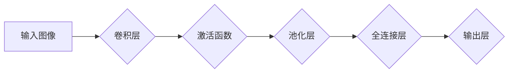

> 深度学习，神经网络，卷积神经网络，图像识别，计算机视觉，机器学习，算法

## 1. 背景介绍

在当今数据爆炸的时代，计算机视觉技术作为人工智能领域的重要分支，正以惊人的速度发展。它赋予计算机“看”的能力，能够理解和解释图像和视频中的信息，从而在各个领域发挥着越来越重要的作用。其中，卷积神经网络（Convolutional Neural Networks，CNN）作为图像识别领域的明星算法，凭借其强大的特征提取能力和准确率，在图像分类、目标检测、图像分割等任务中取得了突破性的进展。

## 2. 核心概念与联系

卷积神经网络的核心概念是“卷积”和“池化”。卷积操作通过滑动窗口的方式，将输入图像与一系列滤波器（也称为卷积核）进行卷积运算，从而提取图像中的特征。池化操作则通过对卷积结果进行下采样，减少特征图的大小，同时保留最重要的信息。

**Mermaid 流程图**

## 3. 核心算法原理 & 具体操作步骤

### 3.1  算法原理概述

卷积神经网络的结构通常由多个卷积层、激活函数层、池化层和全连接层组成。

* **卷积层:** 提取图像特征。
* **激活函数层:** 引入非线性，提高网络的表达能力。
* **池化层:** 减少特征图的大小，提高网络的鲁棒性。
* **全连接层:** 将提取的特征进行分类或回归。

### 3.2  算法步骤详解

1. **输入图像预处理:** 将输入图像调整到合适的尺寸，并进行归一化处理。
2. **卷积操作:** 将卷积核滑动到输入图像上，进行卷积运算，得到卷积结果。
3. **激活函数:** 对卷积结果应用激活函数，例如ReLU函数，引入非线性。
4. **池化操作:** 对激活后的特征图进行池化操作，例如最大池化，减少特征图的大小。
5. **重复步骤2-4:** 将卷积层、激活函数层和池化层堆叠在一起，形成多层卷积网络。
6. **全连接层:** 将多层卷积网络的输出特征输入全连接层，进行分类或回归。
7. **损失函数:** 使用损失函数评估网络的性能，例如交叉熵损失函数。
8. **反向传播:** 使用反向传播算法更新网络参数，降低损失函数的值。

### 3.3  算法优缺点

**优点:**

* 强大的特征提取能力，能够自动学习图像中的特征。
* 准确率高，在图像识别任务中取得了突破性的进展。
* 鲁棒性强，能够处理图像中的噪声和变形。

**缺点:**

* 计算量大，训练时间长。
* 参数量多，需要大量的训练数据。
* 可解释性差，难以理解网络是如何进行决策的。

### 3.4  算法应用领域

卷积神经网络在图像识别领域有着广泛的应用，例如：

* **图像分类:** 将图像分类到不同的类别，例如识别猫、狗、车等。
* **目标检测:** 在图像中检测到目标的边界框和类别，例如检测人、车、行人等。
* **图像分割:** 将图像分割成不同的区域，例如分割图像中的前景和背景。
* **图像生成:** 生成新的图像，例如生成人脸、风景等。

## 4. 数学模型和公式 & 详细讲解 & 举例说明

### 4.1  数学模型构建

卷积神经网络的数学模型可以概括为以下几个方面：

* **卷积操作:** 使用卷积核与输入图像进行卷积运算，得到卷积结果。卷积操作的数学公式如下：

$$
y(i,j) = \sum_{m=0}^{M-1} \sum_{n=0}^{N-1} x(i+m,j+n) * w(m,n)
$$

其中：

* $y(i,j)$ 是卷积结果的像素值。
* $x(i+m,j+n)$ 是输入图像的像素值。
* $w(m,n)$ 是卷积核的权重值。
* $M$ 和 $N$ 是卷积核的大小。

* **激活函数:** 将卷积结果应用激活函数，例如ReLU函数，引入非线性。ReLU函数的数学公式如下：

$$
f(x) = max(0,x)
$$

* **池化操作:** 对卷积结果进行池化操作，例如最大池化，减少特征图的大小。最大池化操作的数学公式如下：

$$
y(i,j) = max_{m=0}^{M-1} max_{n=0}^{N-1} x(i*s+m,j*s+n)
$$

其中：

* $s$ 是池化窗口的大小。

### 4.2  公式推导过程

卷积操作的数学公式推导过程可以参考相关文献，例如：

* LeCun, Y., Boser, B., Denker, J. S., Henderson, D., Howard, R. E., Hubbard, W., & Jackel, L. D. (1989). Backpropagation applied to handwritten zip code recognition. Neural computation, 1(4), 541-551.

### 4.3  案例分析与讲解

可以结合具体的图像识别任务，例如识别手写数字，分析卷积神经网络的数学模型是如何应用于实际场景的。

## 5. 项目实践：代码实例和详细解释说明

### 5.1  开发环境搭建

使用Python语言和深度学习框架TensorFlow或PyTorch搭建开发环境。

### 5.2  源代码详细实现

使用TensorFlow或PyTorch框架实现一个简单的卷积神经网络，用于识别手写数字。

### 5.3  代码解读与分析

详细解释代码中的各个部分，例如卷积层、激活函数层、池化层、全连接层等。

### 5.4  运行结果展示

展示训练好的卷积神经网络在手写数字识别数据集上的准确率。

## 6. 实际应用场景

### 6.1  图像分类

* **医疗图像分析:** 识别病灶、诊断疾病。
* **自动驾驶:** 识别道路标志、车辆、行人。
* **工业缺陷检测:** 检测产品中的缺陷。

### 6.2  目标检测

* **视频监控:** 跟踪目标、报警。
* **无人机航拍:** 识别目标、规划航线。
* **安防监控:** 人脸识别、身份验证。

### 6.3  图像分割

* **医学图像分割:** 分割器官、组织。
* **遥感图像分析:** 分割土地利用类型。
* **自动驾驶:** 分割道路、车道。

### 6.4  未来应用展望

* **更准确、更鲁棒的图像识别:** 随着算法和硬件的不断发展，卷积神经网络的准确率和鲁棒性将进一步提高。
* **更广泛的应用场景:** 卷积神经网络将应用于更多领域，例如自然语言处理、语音识别等。
* **更智能的图像理解:** 卷积神经网络将能够更好地理解图像中的语义信息，实现更智能的图像理解。

## 7. 工具和资源推荐

### 7.1  学习资源推荐

* **书籍:**
    * Deep Learning by Ian Goodfellow, Yoshua Bengio, and Aaron Courville
    * Convolutional Neural Networks for Visual Recognition by Krizhevsky, Sutskever, and Hinton
* **在线课程:**
    * Coursera: Deep Learning Specialization
    * Udacity: Deep Learning Nanodegree
* **博客和网站:**
    * TensorFlow Blog: https://blog.tensorflow.org/
    * PyTorch Blog: https://pytorch.org/blog/

### 7.2  开发工具推荐

* **深度学习框架:** TensorFlow, PyTorch, Keras
* **图像处理库:** OpenCV, Pillow
* **数据可视化工具:** Matplotlib, Seaborn

### 7.3  相关论文推荐

* AlexNet: ImageNet Classification with Deep Convolutional Neural Networks (Krizhevsky et al., 2012)
* VGGNet: Very Deep Convolutional Networks for Large-Scale Image Recognition (Simonyan & Zisserman, 2014)
* ResNet: Deep Residual Learning for Image Recognition (He et al., 2016)

## 8. 总结：未来发展趋势与挑战

### 8.1  研究成果总结

卷积神经网络在图像识别领域取得了突破性的进展，其准确率和鲁棒性不断提高，应用场景也越来越广泛。

### 8.2  未来发展趋势

* **更深、更广的网络结构:** 研究更深层次、更广阔的网络结构，提高网络的表达能力和泛化能力。
* **自监督学习:** 利用无标签数据进行自监督学习，降低对标注数据的依赖。
* **迁移学习:** 将预训练模型迁移到新的任务中，提高模型的效率和性能。
* **解释性增强:** 研究如何提高卷积神经网络的解释性，使其决策过程更加透明。

### 8.3  面临的挑战

* **计算资源:** 训练大型卷积神经网络需要大量的计算资源，这对于资源有限的机构或个人来说是一个挑战。
* **数据标注:** 训练卷积神经网络需要大量的标注数据，数据标注成本高昂，且标注质量难以保证。
* **可解释性:** 卷积神经网络的决策过程难以理解，这对于一些安全关键的应用场景来说是一个挑战。

### 8.4  研究展望

未来，卷积神经网络的研究将继续朝着更深、更广、更智能的方向发展，并应用于更多领域，为人类社会带来更多福祉。

## 9. 附录：常见问题与解答

* **什么是卷积操作？**

卷积操作是一种数学运算，它将一个滤波器（卷积核）滑动到输入图像上，并计算滤波器与图像像素之间的乘积和。

* **什么是激活函数？**

激活函数是神经网络中的一种非线性函数，它将卷积操作的结果映射到输出空间，并引入非线性，提高网络的表达能力。

* **什么是池化操作？**

池化操作是一种下采样操作，它将卷积结果的特征图进行压缩，减少特征图的大小，同时保留最重要的信息。

* **如何训练卷积神经网络？**

训练卷积神经网络需要使用大量的标注数据，并使用反向传播算法更新网络参数，降低损失函数的值。

* **如何评估卷积神经网络的性能？**

可以使用准确率、召回率、F1-score等指标评估卷积神经网络的性能。

作者：禅与计算机程序设计艺术 / Zen and the Art of Computer Programming 
<end_of_turn>