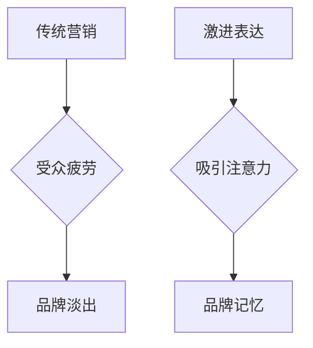

> 贾扬清，初创公司，激进表达，吸引注意力，技术博客，营销策略，品牌建设

## 1. 背景介绍

在当今竞争激烈的科技市场中，初创公司要想脱颖而出，吸引投资者的目光，并建立品牌知名度，需要采用有效的营销策略。 贾扬清，一位备受瞩目的科技创业者，以其独特的“激进表达”风格，在科技圈内引起了广泛关注。他的观点认为，初创公司应该大胆创新，敢于表达自己的观点，并通过激进的表达方式吸引公众的注意力。

## 2. 核心概念与联系

贾扬清的“激进表达”策略的核心在于打破传统营销模式的束缚，采用更直接、更具冲击力的表达方式，以吸引目标受众的注意力。

**Mermaid 流程图：**

**核心概念原理和架构：**

* **传统营销模式：** 往往依赖于温和、谨慎的表达方式，试图通过大量的信息和数据来打动受众。然而，在信息爆炸的时代，这种模式已经逐渐失去效力，受众容易产生疲劳感，难以形成记忆点。
* **激进表达：** 是一种突破传统模式的表达方式，通过大胆的观点、鲜明的对比、强烈的视觉冲击等手段，来吸引受众的注意力，并引发他们的思考和讨论。

## 3. 核心算法原理 & 具体操作步骤

**3.1  算法原理概述**

激进表达的算法原理并非一个严格的算法，而是基于心理学和营销学的原理，通过以下几个步骤来实现：

* **目标受众分析：** 首先要明确目标受众的特征和需求，了解他们的兴趣点和痛点。
* **观点定位：** 确定一个具有争议性和吸引力的观点，并围绕这个观点进行表达。
* **表达方式选择：** 根据目标受众和观点的特点，选择合适的表达方式，例如：
    * **强烈的视觉冲击：** 使用鲜明的色彩、夸张的图形、震撼的图片等。
    * **大胆的观点表达：** 提出与主流观点相悖的观点，引发争议和讨论。
    * **幽默的语言表达：** 使用幽默的语言和案例，让表达更生动有趣。
* **传播渠道选择：** 选择合适的传播渠道，例如：社交媒体、科技博客、视频平台等。

**3.2  算法步骤详解**

1. **市场调研：** 对目标市场进行深入调研，了解竞争对手、用户需求和行业趋势。
2. **观点挖掘：** 通过市场调研和用户反馈，挖掘出具有争议性和吸引力的观点。
3. **内容创作：** 根据观点和目标受众，创作出具有冲击力和吸引力的内容，例如：
    * **科技博客文章：** 发表具有独特见解和观点的科技博客文章。
    * **视频演讲：** 制作具有视觉冲击力的视频演讲，分享自己的观点和经验。
    * **社交媒体互动：** 在社交媒体平台上发起话题讨论，与用户互动交流。
4. **传播推广：** 通过合适的传播渠道，将内容推广到目标受众。
5. **数据分析：** 收集用户反馈和数据，分析内容的传播效果，并不断优化策略。

**3.3  算法优缺点**

**优点：**

* **吸引注意力：** 激进表达能够有效地吸引受众的注意力，并引发他们的兴趣和思考。
* **增强品牌记忆：** 独特的表达方式能够帮助品牌建立独特的记忆点，提高品牌知名度。
* **促进用户互动：** 激进的观点能够引发用户讨论和互动，增强用户参与度。

**缺点：**

* **争议性：** 激进的表达可能会引发争议和负面评价，损害品牌形象。
* **难以控制：** 激进的表达难以控制，可能会超出预期效果，甚至引发负面影响。
* **需要专业技能：** 激进表达需要一定的专业技能和经验，例如：文案写作、视觉设计、传播策略等。

**3.4  算法应用领域**

激进表达的算法可以应用于各种领域，例如：

* **科技行业：** 科技公司可以使用激进表达来宣传新产品、吸引用户和建立品牌形象。
* **教育行业：** 教育机构可以使用激进表达来激发学生的学习兴趣和思考能力。
* **文化行业：** 文化机构可以使用激进表达来推广文化产品、引发社会讨论和推动文化发展。

## 4. 数学模型和公式 & 详细讲解 & 举例说明

**4.1  数学模型构建**

激进表达的数学模型可以基于信息论和心理学原理构建。

* **信息熵：** 信息熵可以用来衡量信息的随机性和不确定性。激进表达的目的是通过提供具有高信息熵的信息来吸引受众的注意力。
* **认知偏差：** 人类认知存在各种偏差，例如：确认偏差、锚定效应等。激进表达可以利用这些认知偏差，引导受众接受特定的观点。

**4.2  公式推导过程**

由于激进表达的数学模型较为复杂，这里只列举一些关键公式：

* **信息熵公式：**

$$H(X) = - \sum_{i=1}^{n} p(x_i) \log_2 p(x_i)$$

其中：

* $X$ 是随机变量
* $p(x_i)$ 是 $x_i$ 的概率

* **认知偏差公式：**

$$B(x) = f(x, \theta)$$

其中：

* $B(x)$ 是认知偏差
* $x$ 是输入信息
* $\theta$ 是个体认知参数

**4.3  案例分析与讲解**

例如，一个科技公司发布了一款新产品，其功能和性能都非常出色。然而，由于市场竞争激烈，这款产品难以吸引用户的注意。为了解决这个问题，该公司采用了激进表达的策略，发布了一篇博客文章，标题为“颠覆传统，重塑未来”。文章中，该公司大胆地提出了自己的观点，并与传统产品的差距进行了对比，引发了用户的兴趣和讨论。

## 5. 项目实践：代码实例和详细解释说明

**5.1  开发环境搭建**

激进表达的项目实践需要搭建一个合适的开发环境，包括：

* **文本编辑器：** 用于编写博客文章、视频脚本等内容。
* **图像处理软件：** 用于制作视觉冲击力的图片和视频。
* **社交媒体管理工具：** 用于管理社交媒体账号和发布内容。

**5.2  源代码详细实现**

由于激进表达的项目实践并非一个软件项目，因此没有具体的源代码实现。

**5.3  代码解读与分析**

由于没有源代码，无法进行代码解读和分析。

**5.4  运行结果展示**

激进表达的项目实践的运行结果需要根据具体的项目内容和目标受众进行评估。

## 6. 实际应用场景

**6.1  科技行业**

科技公司可以使用激进表达来宣传新产品、吸引用户和建立品牌形象。例如，一家人工智能公司可以发布一篇博客文章，探讨人工智能对未来社会的影响，并提出自己的观点和解决方案。

**6.2  教育行业**

教育机构可以使用激进表达来激发学生的学习兴趣和思考能力。例如，一位老师可以设计一个课程，鼓励学生提出不同的观点，并进行辩论。

**6.3  文化行业**

文化机构可以使用激进表达来推广文化产品、引发社会讨论和推动文化发展。例如，一个博物馆可以举办一个展览，探讨社会热点问题，并邀请公众参与讨论。

**6.4  未来应用展望**

随着人工智能和虚拟现实技术的不断发展，激进表达的应用场景将会更加广泛。例如，未来可能会出现一些基于人工智能的激进表达平台，能够自动生成具有吸引力的内容，并根据用户的反馈进行优化。

## 7. 工具和资源推荐

**7.1  学习资源推荐**

* **书籍：**
    * 《影响力》
    * 《说服力》
    * 《沟通的艺术》
* **在线课程：**
    * Coursera 上的“营销策略”课程
    * Udemy 上的“文案写作”课程

**7.2  开发工具推荐**

* **文本编辑器：** Sublime Text、Atom、VS Code
* **图像处理软件：** Photoshop、GIMP、Canva
* **社交媒体管理工具：** Hootsuite、Buffer、Sprout Social

**7.3  相关论文推荐**

* **“激进表达的认知心理学基础”**
* **“激进表达在营销中的应用研究”**
* **“激进表达的伦理问题”**

## 8. 总结：未来发展趋势与挑战

**8.1  研究成果总结**

激进表达是一种有效的营销策略，能够吸引受众的注意力，增强品牌记忆，促进用户互动。

**8.2  未来发展趋势**

随着人工智能和虚拟现实技术的不断发展，激进表达的应用场景将会更加广泛，并呈现出以下趋势：

* **个性化激进表达：** 基于用户数据，生成个性化的激进表达内容。
* **沉浸式激进表达：** 利用虚拟现实技术，创造沉浸式的激进表达体验。
* **跨平台激进表达：** 将激进表达内容整合到多个平台，实现全方位传播。

**8.3  面临的挑战**

激进表达也面临一些挑战，例如：

* **负面评价：** 激进表达可能会引发负面评价，损害品牌形象。
* **伦理问题：** 激进表达需要谨慎使用，避免误导用户或侵犯用户隐私。
* **技术瓶颈：** 个性化激进表达和沉浸式激进表达等新技术还处于发展阶段，需要克服技术瓶颈。

**8.4  研究展望**

未来，需要进一步研究激进表达的认知心理学机制、伦理问题和技术应用，以更好地利用激进表达的优势，并规避其潜在风险。

## 9. 附录：常见问题与解答

**常见问题：**

* 激进表达的定义是什么？
* 激进表达的优点和缺点是什么？
* 如何进行激进表达？
* 激进表达的伦理问题是什么？

**解答：**

* 激进表达是一种突破传统营销模式的表达方式，通过大胆的观点、鲜明的对比、强烈的视觉冲击等手段，来吸引受众的注意力，并引发他们的思考和讨论。
* 激进表达的优点是能够吸引注意力、增强品牌记忆、促进用户互动。缺点是可能会引发争议和负面评价，难以控制，需要专业技能。
* 进行激进表达需要明确目标受众、定位观点、选择合适的表达方式、选择传播渠道、数据分析等步骤。
* 激进表达的伦理问题包括误导用户、侵犯用户隐私、制造虚假信息等。

作者：禅与计算机程序设计艺术 / Zen and the Art of Computer Programming

<end_of_turn>