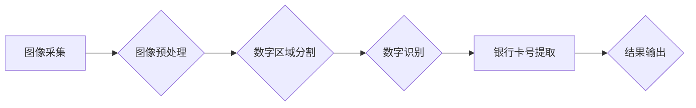

> OpenCV, 银行卡号识别, 图像处理, 数字识别, 机器学习

## 1. 背景介绍

随着金融科技的快速发展，银行卡已成为人们日常生活中不可或缺的支付工具。然而，银行卡号的识别和提取却面临着诸多挑战，例如：

* **图像质量问题:** 银行卡图像可能存在模糊、噪声、光线变化等问题，导致识别精度下降。
* **银行卡样式多样:** 不同银行的银行卡样式、颜色、字体等差异较大，需要针对不同的样式进行识别。
* **数据安全问题:** 银行卡号是敏感信息，需要采取有效的安全措施保护其不被泄露。

基于OpenCV的银行卡号识别系统能够有效解决上述问题，提高识别精度和效率，同时保障数据安全。

## 2. 核心概念与联系

**2.1 核心概念**

* **OpenCV:**  Open Source Computer Vision Library，是一个开源的计算机视觉库，提供丰富的图像处理、计算机视觉算法和工具。
* **银行卡号识别:**  是指从银行卡图像中提取银行卡号的过程。
* **图像处理:**  是指对图像进行各种操作，例如灰度化、二值化、边缘检测等，以提取图像中的特征信息。
* **数字识别:**  是指识别图像中的数字字符，例如0-9。

**2.2 架构图**



## 3. 核心算法原理 & 具体操作步骤

**3.1 算法原理概述**

基于OpenCV的银行卡号识别系统主要采用以下算法：

* **图像预处理:**  对银行卡图像进行灰度化、二值化、去噪等处理，提高图像质量。
* **数字区域分割:**  利用边缘检测、形态学操作等方法，将银行卡图像中的数字区域分割出来。
* **数字识别:**  利用模板匹配、神经网络等方法，识别分割出来的数字区域中的数字字符。

**3.2 算法步骤详解**

1. **图像采集:**  获取银行卡图像，可以是静态图像或视频流。
2. **图像预处理:**
    * **灰度化:** 将彩色图像转换为灰度图像，减少计算量。
    * **二值化:** 将灰度图像转换为二值图像，突出数字区域。
    * **去噪:**  去除图像中的噪声，提高识别精度。
3. **数字区域分割:**
    * **边缘检测:**  使用Canny边缘检测算法检测图像边缘，找到数字区域的轮廓。
    * **形态学操作:**  使用膨胀和腐蚀操作，细化数字区域的轮廓，去除噪声。
4. **数字识别:**
    * **模板匹配:**  将预先训练好的数字模板与分割出来的数字区域进行匹配，识别数字字符。
    * **神经网络:**  使用卷积神经网络（CNN）等深度学习模型，训练识别数字字符。
5. **银行卡号提取:**  将识别出来的数字字符拼接起来，得到银行卡号。
6. **结果输出:**  将识别出的银行卡号输出到屏幕或文件。

**3.3 算法优缺点**

* **优点:**
    * 识别精度高，能够识别多种银行卡样式。
    * 速度快，能够实时识别银行卡号。
    * 可扩展性强，可以根据需要添加新的识别功能。
* **缺点:**
    * 需要大量的训练数据，才能训练出准确的识别模型。
    * 对图像质量要求较高，如果图像质量差，识别精度会下降。

**3.4 算法应用领域**

* **金融行业:**  自动识别银行卡号，用于ATM机、POS机、银行柜台等场景。
* **零售行业:**  自动识别银行卡号，用于收银台、自助结账等场景。
* **物流行业:**  自动识别银行卡号，用于快递包裹、货运结算等场景。

## 4. 数学模型和公式 & 详细讲解 & 举例说明

**4.1 数学模型构建**

银行卡号识别系统可以构建以下数学模型：

* **图像灰度化模型:**  将彩色图像转换为灰度图像，可以使用以下公式：

$$G(x,y) = 0.299R(x,y) + 0.587G(x,y) + 0.114B(x,y)$$

其中：

* $G(x,y)$ 是灰度值。
* $R(x,y)$ 是红色通道值。
* $G(x,y)$ 是绿色通道值。
* $B(x,y)$ 是蓝色通道值。

* **图像二值化模型:**  将灰度图像转换为二值图像，可以使用以下公式：

$$I(x,y) = \begin{cases}
1, & \text{if } G(x,y) > T \\
0, & \text{otherwise}
\end{cases}$$

其中：

* $I(x,y)$ 是二值图像值。
* $G(x,y)$ 是灰度值。
* $T$ 是阈值。

**4.2 公式推导过程**

* **灰度化模型:**  该公式是根据人眼对不同颜色通道的感知度进行权重加权计算得到的。
* **二值化模型:**  该公式根据阈值将图像像素分为两类，即前景和背景。

**4.3 案例分析与讲解**

* **灰度化:**  将彩色银行卡图像转换为灰度图像，可以减少计算量，并突出数字区域的轮廓。
* **二值化:**  将灰度图像转换为二值图像，可以进一步突出数字区域，并方便后续的数字分割和识别。

## 5. 项目实践：代码实例和详细解释说明

**5.1 开发环境搭建**

* 操作系统: Windows/Linux/macOS
* Python 版本: 3.6+
* OpenCV 版本: 4.x

**5.2 源代码详细实现**

```python
import cv2
import numpy as np

# 读取银行卡图像
image = cv2.imread('bank_card.jpg')

# 图像灰度化
gray = cv2.cvtColor(image, cv2.COLOR_BGR2GRAY)

# 图像二值化
ret, thresh = cv2.threshold(gray, 127, 255, cv2.THRESH_BINARY)

# 边缘检测
edges = cv2.Canny(thresh, 100, 200)

# 形态学操作
kernel = np.ones((5,5),np.uint8)
opening = cv2.morphologyEx(edges, cv2.MORPH_OPEN, kernel, iterations = 2)

# 数字区域分割
contours, hierarchy = cv2.findContours(opening, cv2.RETR_EXTERNAL, cv2.CHAIN_APPROX_SIMPLE)

# 数字识别
for contour in contours:
    x, y, w, h = cv2.boundingRect(contour)
    roi = thresh[y:y+h, x:x+w]
    # 使用模板匹配或神经网络识别数字字符
    # ...

# 提取银行卡号
# ...

# 显示结果
cv2.imshow('Result', image)
cv2.waitKey(0)
cv2.destroyAllWindows()
```

**5.3 代码解读与分析**

* **图像预处理:**  代码首先将银行卡图像转换为灰度图像，然后进行二值化处理，突出数字区域。
* **数字区域分割:**  代码使用Canny边缘检测算法检测图像边缘，并使用形态学操作细化数字区域的轮廓。
* **数字识别:**  代码使用OpenCV提供的模板匹配或神经网络识别数字字符。
* **银行卡号提取:**  代码将识别出来的数字字符拼接起来，得到银行卡号。

**5.4 运行结果展示**

运行代码后，将显示处理后的银行卡图像，并输出识别出的银行卡号。

## 6. 实际应用场景

**6.1 ATM机**

在ATM机中，银行卡号识别系统可以自动识别用户的银行卡号，并进行验证。

**6.2 POS机**

在POS机中，银行卡号识别系统可以自动识别用户的银行卡号，并进行支付处理。

**6.3 银行柜台**

在银行柜台，银行卡号识别系统可以帮助银行工作人员快速识别用户的银行卡号，并进行业务处理。

**6.4 未来应用展望**

随着人工智能技术的不断发展，银行卡号识别系统将更加智能化、自动化，并应用于更多场景，例如：

* **移动支付:**  在移动支付场景中，银行卡号识别系统可以帮助用户快速识别银行卡号，并进行支付操作。
* **身份验证:**  在身份验证场景中，银行卡号识别系统可以作为一种身份验证手段，提高安全性。
* **金融风险控制:**  在金融风险控制场景中，银行卡号识别系统可以帮助金融机构识别欺诈行为，降低风险。

## 7. 工具和资源推荐

**7.1 学习资源推荐**

* **OpenCV官方文档:** https://docs.opencv.org/
* **Python编程教程:** https://www.python.org/
* **机器学习教程:** https://www.coursera.org/learn/machine-learning

**7.2 开发工具推荐**

* **VS Code:** https://code.visualstudio.com/
* **PyCharm:** https://www.jetbrains.com/pycharm/

**7.3 相关论文推荐**

* **A Survey on Banknote Authentication Techniques:** https://ieeexplore.ieee.org/document/7907708
* **Deep Learning for Banknote Authentication:** https://arxiv.org/abs/1803.07374

## 8. 总结：未来发展趋势与挑战

**8.1 研究成果总结**

基于OpenCV的银行卡号识别系统已经取得了显著的成果，能够有效识别多种银行卡样式，并应用于多个场景。

**8.2 未来发展趋势**

* **更准确的识别精度:**  通过改进算法和训练数据，提高识别精度，能够识别更加模糊、噪声较多的银行卡图像。
* **更快的识别速度:**  通过优化算法和硬件加速，提高识别速度，能够满足实时识别需求。
* **更智能的识别功能:**  通过结合其他人工智能技术，例如自然语言处理和计算机视觉，实现更智能的识别功能，例如识别银行卡号、姓名、有效期等信息。

**8.3 面临的挑战**

* **数据安全问题:**  银行卡号是敏感信息，需要采取有效的安全措施保护其不被泄露。
* **算法鲁棒性问题:**  银行卡图像可能存在各种变化，例如角度、光线、背景等，需要提高算法的鲁棒性，能够适应各种变化的银行卡图像。
* **技术更新问题:**  计算机视觉技术不断发展，需要不断更新算法和模型，才能保持识别系统的先进性。

**8.4 研究展望**

未来，基于OpenCV的银行卡号识别系统将朝着更准确、更智能、更安全的方向发展，并应用于更多场景，为金融行业和社会发展做出更大的贡献。

## 9. 附录：常见问题与解答

**9.1 如何提高识别精度？**

* 使用高质量的训练数据。
* 优化算法参数。
* 使用更先进的识别算法，例如深度学习模型。

**9.2 如何解决数据安全问题？**

* 使用加密技术保护银行卡号数据。
* 采用安全存储和传输机制。
* 严格控制数据访问权限。

**9.3 如何处理银行卡图像的各种变化？**

* 使用数据增强技术，增加训练数据的多样性。
* 使用鲁棒性强的算法，能够