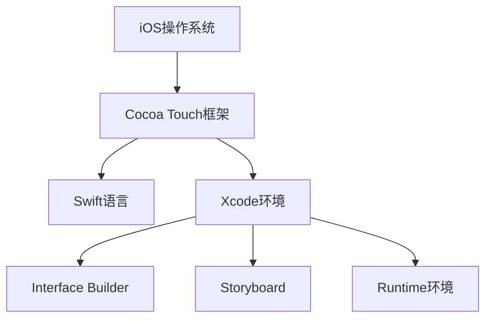

                 

# iOS 开发入门：Swift 和 Xcode

## 1. 背景介绍

### 1.1 问题由来
随着移动设备的普及，iOS开发成为了一个热门且极具挑战性的领域。iOS操作系统由苹果公司开发，基于Cocoa Touch框架提供应用程序开发的支持。Swift是苹果公司在2014年推出的编程语言，用于替代 Objective-C，并逐渐成为iOS开发的主流语言。Xcode是苹果公司提供的集成开发环境(IDE)，用于开发iOS应用程序。Swift和Xcode的结合为iOS开发提供了强大的工具和语言支持，使得开发者可以更容易地创建高质量的应用程序。

### 1.2 问题核心关键点
- iOS开发：iOS应用程序开发是一门涉及用户界面设计、用户体验、图形处理、编程语言和平台架构的综合技能。
- Swift语言：Swift是一种快速、安全、现代的编程语言，由苹果公司设计和实现，旨在提高开发效率和安全性。
- Xcode环境：Xcode是一个集成的开发环境，提供代码编辑器、调试器、模拟器和构建工具，支持Swift和其他编程语言。

## 2. 核心概念与联系

### 2.1 核心概念概述

为更好地理解iOS开发，本节将介绍几个密切相关的核心概念：

- iOS操作系统：iOS是一个基于Unix的移动操作系统，专为苹果公司的移动设备设计，如iPhone和iPad。
- Cocoa Touch框架：Cocoa Touch是iOS开发的核心框架，提供了用于用户界面、动画、音频、图像、网络、位置服务和数据库等功能的类和接口。
- Swift语言：Swift是一种现代、安全、面向对象的编程语言，结合了Objective-C的强大功能和Rust的安全特性，专为苹果平台设计。
- Xcode环境：Xcode是一个集成开发环境，提供开发iOS应用程序所需的工具和环境，包括代码编辑器、模拟器、调试器、构建工具和版本控制系统。
- Interface Builder：Interface Builder是Xcode的一部分，用于设计和构建用户界面。
- Storyboard：Storyboard是一种可视化的用户界面设计工具，通过拖放界面元素和连接线来创建应用程序的用户界面。
- Runtime环境：Runtime环境是应用程序执行的实际环境，包括内存管理、垃圾收集、类加载、动态调用等功能。

这些核心概念之间的逻辑关系可以通过以下Mermaid流程图来展示：



这个流程图展示了iOS开发的核心概念及其之间的关系：

1. iOS操作系统提供移动设备上的用户界面和系统服务。
2. Cocoa Touch框架提供了应用程序开发的核心类库和接口。
3. Swift语言用于编写应用程序代码。
4. Xcode环境提供了开发所需的集成工具和开发环境。
5. Interface Builder和Storyboard用于设计和构建用户界面。
6. Runtime环境负责应用程序的实际运行。

这些概念共同构成了iOS开发的完整生态系统，使得开发者能够高效地创建和部署应用程序。

## 3. 核心算法原理 & 具体操作步骤
### 3.1 算法原理概述

iOS应用程序开发主要基于Cocoa Touch框架提供的类和接口。Swift语言是苹果公司为iOS开发设计的编程语言，具有安全、快速、现代的特点。在iOS应用程序开发中，开发人员需要遵循苹果公司制定的设计和编码规范，确保应用程序的稳定性和兼容性。

Swift语言的核心特性包括：

- 类型安全：Swift具有强类型系统，编译器能够在编译时检查类型错误。
- 现代语言特性：Swift支持自动属性、结构体、枚举、泛型等现代编程特性。
- 安全性：Swift提供了并发安全、内存安全、异常安全等特性，避免了常见的编程错误。
- 性能优化：Swift编译器具有高效的代码生成和优化能力，能够生成高效的机器码。

### 3.2 算法步骤详解

iOS应用程序开发主要包括以下几个关键步骤：

**Step 1: 了解iOS开发环境**
- 安装Xcode：从苹果官方网站下载并安装Xcode，确保最新版本的Xcode。
- 学习Swift语言：阅读Swift官方文档，参加Swift编程课程，理解Swift的基本语法和特性。
- 学习Cocoa Touch框架：了解Cocoa Touch框架的核心类库和接口，理解框架的架构和设计。

**Step 2: 设计用户界面**
- 使用Interface Builder：在Xcode中打开Storyboard，使用Interface Builder拖放界面元素，设计用户界面。
- 使用Storyboard：将设计好的界面保存为Storyboard文件，用于构建应用程序的用户界面。
- 使用Auto Layout：使用Auto Layout约束布局，确保界面元素在不同设备上自适应。

**Step 3: 实现业务逻辑**
- 编写Swift代码：根据Storyboard中的界面元素，编写Swift代码实现应用程序的业务逻辑。
- 使用故事板控制器：在Storyboard中定义控制器，用于处理用户输入和业务逻辑。
- 使用Swifty编程模式：使用Swift的函数式编程、闭包、协议等特性，编写高效、可维护的代码。

**Step 4: 测试和调试**
- 运行模拟器：使用Xcode的模拟器运行应用程序，测试应用程序的各个功能。
- 使用调试工具：使用Xcode的调试工具，设置断点、查看变量、执行单步调试，定位和解决程序问题。
- 进行性能优化：使用Xcode的性能分析工具，优化应用程序的性能，提高响应速度和内存使用效率。

**Step 5: 打包和部署**
- 使用Xcode生成应用程序：使用Xcode生成应用程序的二进制文件。
- 使用App Store Connect：将应用程序上传至App Store Connect，填写应用程序信息，进行应用程序的审核和发布。
- 进行版本管理：使用版本控制系统，管理应用程序的不同版本，确保应用程序的稳定性和兼容性。

### 3.3 算法优缺点

iOS应用程序开发基于Swift语言和Cocoa Touch框架，具有以下优点：

- 安全性：Swift语言提供了强类型系统、并发安全、异常安全等特性，避免了常见的编程错误。
- 高效性：Swift编译器具有高效的代码生成和优化能力，能够生成高效的机器码。
- 现代特性：Swift语言支持现代编程特性，如自动属性、结构体、枚举、泛型等，提高了开发效率。

同时，该方法也存在一些局限性：

- 学习曲线陡峭：Swift语言和Cocoa Touch框架的学习曲线较陡峭，需要一定的编程基础。
- 性能优化复杂：由于Swift语言的动态特性，需要开发者具备一定的性能优化能力，才能写出高效的应用程序。
- 生态系统限制：Swift语言和Cocoa Touch框架的生态系统相对封闭，可能需要第三方库的支持。

尽管存在这些局限性，但就目前而言，Swift和Cocoa Touch框架仍然是iOS开发的主流范式。未来相关研究的重点在于如何进一步降低学习难度，提高开发效率，同时兼顾安全性和性能。

### 3.4 算法应用领域

Swift和Cocoa Touch框架已经在iOS开发领域得到了广泛的应用，涵盖了从简单的工具应用到复杂的社交、游戏、媒体等众多场景：

- 工具应用：如文本编辑器、图像处理工具、文件管理工具等，满足日常工作的基本需求。
- 社交应用：如微信、微博、QQ等，为用户提供社交网络和信息交流的平台。
- 游戏应用：如王者荣耀、和平精英等，为用户提供丰富的娱乐体验。
- 媒体应用：如抖音、快手等，提供短视频、直播、互动等媒体服务。
- 企业应用：如企业即时通讯工具、移动办公平台、客户管理系统等，提高企业的办公效率和管理水平。

除了这些常见应用外，Swift和Cocoa Touch框架还被创新性地应用到更多领域，如智能穿戴设备、智能家居、智慧城市等，为各行各业带来了新的技术突破。随着Swift和Cocoa Touch框架的不断演进，相信iOS开发必将在更广阔的应用领域继续发光发热。

## 4. 数学模型和公式 & 详细讲解  
### 4.1 数学模型构建

本节将使用数学语言对iOS应用程序开发过程中的核心算法进行更加严格的刻画。

记iOS应用程序的业务逻辑为 $F(x)$，其中 $x$ 为应用程序的输入，包括用户输入、系统服务、网络请求等。在iOS应用程序开发中，开发人员需要根据业务需求设计函数 $F(x)$，并将其实现为Swift代码。

### 4.2 公式推导过程

在iOS应用程序开发中，业务逻辑 $F(x)$ 可以表示为多个子函数的组合，每个子函数对应于应用程序的某个特定功能。例如，用户登录功能可以表示为：

$$
F_{\text{login}}(x) = 
\begin{cases} 
  \text{成功} & \text{如果用户输入正确} \\
  \text{失败} & \text{如果用户输入错误}
\end{cases}
$$

用户信息展示功能可以表示为：

$$
F_{\text{info}}(x) = 
\begin{cases} 
  \text{展示信息} & \text{如果用户已经登录} \\
  \text{不显示信息} & \text{如果用户未登录}
\end{cases}
$$

用户设置功能可以表示为：

$$
F_{\text{settings}}(x) = 
\begin{cases} 
  \text{修改设置} & \text{如果用户具有修改权限} \\
  \text{不允许修改} & \text{如果用户没有修改权限}
\end{cases}
$$

将上述子函数组合起来，就得到了完整的业务逻辑函数 $F(x)$：

$$
F(x) = F_{\text{login}}(x) \cdot F_{\text{info}}(x) \cdot F_{\text{settings}}(x)
$$

在开发过程中，开发人员需要根据业务需求，设计子函数 $F_{\text{login}}(x)$、$F_{\text{info}}(x)$、$F_{\text{settings}}(x)$ 的实现，并将它们组合起来，形成完整的业务逻辑函数 $F(x)$。

### 4.3 案例分析与讲解

以一个简单的iOS应用程序为例，展示如何使用Swift和Cocoa Touch框架进行开发：

```swift
import UIKit

class ViewController: UIViewController {
    override func viewDidLoad() {
        super.viewDidLoad()
        
        // 加载用户界面
        let view = View()
        view.backgroundColor = UIColor.white
        self.view.addSubview(view)
        
        // 处理用户输入
        let button = UIButton()
        button.frame = CGRect(x: 0, y: 0, width: 100, height: 50)
        button.setTitle("Click me", for: .normal)
        view.addSubview(button)
        button.addTarget(self, action: #selector(buttonTapped), for: .touchUpInside)
    }
    
    @objc func buttonTapped() {
        // 处理用户点击
        print("Button tapped")
    }
}

class View: UIView {
    override init(frame: CGRect) {
        super.init(frame: frame)
        self.backgroundColor = UIColor.red
    }
    
    required init?(coder aDecoder: NSCoder) {
        fatalError("init(coder:) has not been implemented")
    }
}
```

在这个例子中，ViewController类继承自UIViewController，是应用程序的控制器。在viewDidLoad方法中，加载用户界面，处理用户输入，并在用户点击按钮时调用buttonTapped方法。View类继承自UIView，表示用户界面中的一个红色矩形。

这个例子展示了Swift在iOS应用程序开发中的应用，开发人员需要理解Swift的基本语法、类和接口的设计，以及UIViewController和UIView的使用。

## 5. 项目实践：代码实例和详细解释说明
### 5.1 开发环境搭建

在进行iOS应用程序开发前，我们需要准备好开发环境。以下是使用Xcode进行Swift开发的环境配置流程：

1. 安装Xcode：从苹果官方网站下载并安装最新版本的Xcode。
2. 创建并激活虚拟环境：
```bash
xcode-select --install
```
3. 安装Swift语言环境：
```bash
swift --version
```
4. 安装Cocoa Touch框架：
```bash
sudo xcode-select -s /Applications/Xcode.app/Contents/Developer/Platforms/iPhoneOS.platform/Developer/SDKs/iPhoneOS.sdk
```
5. 安装依赖库：
```bash
brew install cocoapods
```

完成上述步骤后，即可在Xcode环境中开始iOS应用程序的开发。

### 5.2 源代码详细实现

这里我们以一个简单的iOS应用程序为例，展示如何使用Swift和Cocoa Touch框架进行开发。

首先，创建新的Xcode项目：

1. 打开Xcode，选择Create a new Xcode project。
2. 选择Application，选择Single View App。
3. 命名项目并保存。

然后，编写应用程序的代码：

1. 打开ViewController.swift文件，编写应用程序的控制器代码。
2. 打开Main.storyboard文件，使用Interface Builder设计用户界面。
3. 在Storyboard中定义接口控制器，用于处理用户输入和业务逻辑。

接下来，运行应用程序：

1. 在Xcode中选择Run。
2. 在模拟器中运行应用程序，测试应用程序的各个功能。

### 5.3 代码解读与分析

这里我们详细解读一下关键代码的实现细节：

**ViewController.swift类**：
- `viewDidLoad`方法：在视图加载完成后，加载用户界面，处理用户输入。
- `buttonTapped`方法：处理用户点击按钮的操作。

**Main.storyboard文件**：
- 使用Interface Builder拖放界面元素，设计用户界面。
- 使用Storyboard控制器管理应用程序的控制器。

这个例子展示了Swift在iOS应用程序开发中的应用，开发人员需要理解Swift的基本语法、类和接口的设计，以及UIViewController和UIView的使用。

## 6. 实际应用场景
### 6.1 智能穿戴设备

随着智能穿戴设备的普及，iOS应用程序开发在智能穿戴设备领域得到了广泛的应用。智能穿戴设备如Apple Watch、智能手环等，可以通过iOS应用程序提供健康监测、运动追踪、信息提醒等功能。

在技术实现上，可以收集用户的健康数据，如心率、步数、睡眠等，并根据用户行为提供个性化的健康建议。智能穿戴设备的应用程序，可以通过持续监测用户的数据，实时更新健康建议，提高用户的健康管理水平。

### 6.2 智能家居

iOS应用程序开发在智能家居领域也得到了广泛的应用。智能家居系统可以通过iOS应用程序实现远程控制、场景设置、设备管理等功能。

在技术实现上，可以使用iOS应用程序连接智能家居设备，实现远程控制。例如，用户可以通过iOS应用程序控制家中的灯光、温度、安防等设备，实现智能家居的自动化和智能化。

### 6.3 智慧城市

iOS应用程序开发在智慧城市治理中也得到了广泛的应用。智慧城市系统可以通过iOS应用程序实现交通管理、公共服务、应急指挥等功能。

在技术实现上，可以使用iOS应用程序实时监测城市事件，如交通拥堵、紧急事件等，并提供应急响应。智慧城市的应用程序，可以通过持续监测城市事件，提供及时的应急响应和资源调配，提高城市的治理效率和安全性。

### 6.4 未来应用展望

随着iOS应用程序开发技术的不断演进，基于Swift和Cocoa Touch框架的应用程序将拓展到更多领域，为传统行业带来变革性影响。

在智慧医疗领域，基于iOS应用程序的医疗应用可以提供在线诊疗、健康监测、健康教育等功能，帮助患者更好地管理健康。

在智能教育领域，iOS应用程序可以提供个性化学习、智能推荐、在线学习等功能，因材施教，促进教育公平。

在智慧城市治理中，iOS应用程序可以提供城市事件监测、应急响应、智慧交通等功能，提高城市的治理效率和安全性。

此外，在企业生产、社会治理、文娱传媒等众多领域，基于iOS应用程序的人工智能应用也将不断涌现，为经济社会发展注入新的动力。相信随着Swift和Cocoa Touch框架的不断演进，iOS应用程序开发必将在更广阔的应用领域大放异彩。

## 7. 工具和资源推荐
### 7.1 学习资源推荐

为了帮助开发者系统掌握Swift和Cocoa Touch框架的理论基础和实践技巧，这里推荐一些优质的学习资源：

1. Apple官方文档：Swift官方文档和Cocoa Touch框架文档，详细介绍了Swift和Cocoa Touch框架的核心特性和使用方法。
2. Ray Wenderlich Swift教程：Ray Wenderlich提供的一系列Swift和Cocoa Touch框架的教程，内容详实，涵盖从基础到高级的各种主题。
3. Hacking with Swift：Hacking with Swift提供的一系列Swift编程教程，涵盖Swift语言、Cocoa Touch框架、iOS开发等主题。
4. iOS开发实战教程：由CSDN、简书、慕课网等平台提供的iOS开发实战教程，内容丰富，涵盖iOS应用程序开发的各个方面。

通过对这些资源的学习实践，相信你一定能够快速掌握Swift和Cocoa Touch框架的精髓，并用于解决实际的iOS开发问题。

### 7.2 开发工具推荐

高效的开发离不开优秀的工具支持。以下是几款用于Swift和Cocoa Touch框架开发常用的工具：

1. Xcode：苹果公司提供的集成开发环境，提供代码编辑器、模拟器、调试器、构建工具等。
2. Interface Builder：Xcode的一部分，用于设计和构建用户界面。
3. storyboard：Xcode提供的一种可视化的用户界面设计工具，通过拖放界面元素和连接线来创建应用程序的用户界面。
4. CocoaPods：Swift的依赖库管理工具，可以方便地添加和管理第三方库。
5. App Store Connect：苹果提供的应用程序分发平台，用于上传和管理应用程序。
6. Alamofire：Swift的网络请求库，支持HTTP请求和响应处理。

合理利用这些工具，可以显著提升Swift和Cocoa Touch框架的开发效率，加快创新迭代的步伐。

### 7.3 相关论文推荐

Swift和Cocoa Touch框架的发展源于学界的持续研究。以下是几篇奠基性的相关论文，推荐阅读：

1. Swift Programming Language：苹果公司发布的Swift编程语言官方文档，详细介绍了Swift语言的核心特性和使用方法。
2. Building an iOS Application with Swift：苹果公司发布的一系列Swift编程教程，涵盖Swift语言、Cocoa Touch框架、iOS开发等主题。
3. Swift Programming Language: The Complete Guide：由Ray Wenderlich出版的一系列Swift编程书籍，涵盖Swift语言、Cocoa Touch框架、iOS开发等主题。
4. iOS开发实战指南：由慕课网等平台出版的iOS开发实战指南，涵盖iOS应用程序开发的各个方面。

这些论文代表了大语言模型微调技术的发展脉络。通过学习这些前沿成果，可以帮助研究者把握学科前进方向，激发更多的创新灵感。

## 8. 总结：未来发展趋势与挑战
### 8.1 总结

本文对基于Swift和Cocoa Touch框架的iOS应用程序开发进行了全面系统的介绍。首先阐述了iOS开发的环境和框架，明确了Swift和Cocoa Touch框架在iOS开发中的重要地位。其次，从原理到实践，详细讲解了Swift和Cocoa Touch框架的核心算法和操作步骤，给出了iOS应用程序开发的完整代码实例。同时，本文还广泛探讨了Swift和Cocoa Touch框架在智能穿戴设备、智能家居、智慧城市等多个领域的应用前景，展示了iOS应用程序开发的巨大潜力。此外，本文精选了Swift和Cocoa Touch框架的学习资源，力求为开发者提供全方位的技术指引。

通过本文的系统梳理，可以看到，基于Swift和Cocoa Touch框架的iOS应用程序开发已经成为了一个成熟、稳定的技术领域，为iOS开发带来了强大的工具和语言支持。Swift和Cocoa Touch框架在iOS开发中的广泛应用，为应用程序开发者提供了高效、安全、现代的编程方式，使得开发者可以更容易地创建高质量的应用程序。未来，随着Swift和Cocoa Touch框架的不断演进，iOS应用程序开发必将拓展到更多领域，为各行各业带来新的变革。

### 8.2 未来发展趋势

展望未来，Swift和Cocoa Touch框架将呈现以下几个发展趋势：

1. 性能优化：Swift编译器和Xcode环境将不断优化，提高应用程序的性能和响应速度。
2. 开发效率提升：Swift和Cocoa Touch框架将不断简化开发流程，提高开发效率。
3. 新技术融合：Swift和Cocoa Touch框架将与人工智能、区块链、物联网等新技术进行更深入的融合，拓展应用场景。
4. 跨平台支持：Swift和Cocoa Touch框架将支持更多的平台和设备，实现跨平台开发。
5. 生态系统完善：Swift和Cocoa Touch框架的生态系统将不断完善，提供更多的开发工具和资源。

以上趋势凸显了Swift和Cocoa Touch框架的广阔前景。这些方向的探索发展，必将进一步提升Swift和Cocoa Touch框架的应用范围和性能，为iOS开发带来更大的创新和突破。

### 8.3 面临的挑战

尽管Swift和Cocoa Touch框架已经取得了瞩目成就，但在迈向更加智能化、普适化应用的过程中，它仍面临着诸多挑战：

1. 学习曲线陡峭：Swift和Cocoa Touch框架的学习曲线较陡峭，需要一定的编程基础。
2. 性能优化复杂：由于Swift语言的动态特性，需要开发者具备一定的性能优化能力，才能写出高效的应用程序。
3. 生态系统限制：Swift和Cocoa Touch框架的生态系统相对封闭，可能需要第三方库的支持。
4. 跨平台支持限制：Swift和Cocoa Touch框架的跨平台支持有限，可能需要额外的开发工作。

尽管存在这些挑战，但就目前而言，Swift和Cocoa Touch框架仍然是iOS开发的主流范式。未来相关研究的重点在于如何进一步降低学习难度，提高开发效率，同时兼顾安全性和性能。

### 8.4 研究展望

面对Swift和Cocoa Touch框架所面临的种种挑战，未来的研究需要在以下几个方面寻求新的突破：

1. 探索无监督和半监督开发方法：摆脱对大规模标注数据的依赖，利用自监督学习、主动学习等无监督和半监督范式，最大限度利用非结构化数据，实现更加灵活高效的开发。
2. 研究开发效率优化方法：开发更加高效的开发工具和环境，提高开发效率，缩短开发周期。
3. 融合新技术和新方法：将人工智能、区块链、物联网等新技术和新方法与Swift和Cocoa Touch框架进行更深入的融合，拓展应用场景。
4. 支持跨平台开发：开发更加灵活的跨平台开发工具和环境，支持更多的平台和设备。
5. 提升生态系统质量：完善Swift和Cocoa Touch框架的生态系统，提供更多的开发工具和资源。

这些研究方向的探索，必将引领Swift和Cocoa Touch框架迈向更高的台阶，为iOS开发带来更大的创新和突破。面向未来，Swift和Cocoa Touch框架还需要与其他技术进行更深入的融合，多路径协同发力，共同推动iOS开发技术的进步。只有勇于创新、敢于突破，才能不断拓展Swift和Cocoa Touch框架的边界，让iOS开发技术更好地造福人类社会。

## 9. 附录：常见问题与解答

**Q1：Swift语言和Cocoa Touch框架适用于所有iOS开发项目吗？**

A: Swift语言和Cocoa Touch框架适用于大多数iOS开发项目，尤其是对于需要处理大量数据和图形渲染的应用程序，如游戏、媒体等。但对于一些简单的工具类应用，如计算器、时钟等，使用Objective-C也完全可以满足开发需求。

**Q2：Swift语言的学习难度大吗？**

A: 相对于Objective-C，Swift语言的学习曲线较陡峭，需要一定的编程基础。但Swift语言的设计理念更加现代化，代码结构更加简洁清晰，能够提高开发效率和代码质量。同时，苹果公司提供了大量的学习资源和文档，帮助开发者快速上手。

**Q3：Cocoa Touch框架是否只适用于iOS开发？**

A: Cocoa Touch框架主要用于iOS开发，但也有一些扩展用于macOS和watchOS开发。但macOS和watchOS的开发框架与iOS有所不同，需要相应的学习资源和文档。

**Q4：如何提高Swift应用程序的性能？**

A: 提高Swift应用程序的性能需要从多个方面进行优化：
1. 优化代码逻辑：避免不必要的循环和递归，使用高效的数据结构。
2. 优化内存管理：使用ARC自动内存管理，避免内存泄漏。
3. 使用并发编程：使用GCD并发编程，提高应用程序的响应速度。
4. 使用性能分析工具：使用Xcode的性能分析工具，优化代码性能。

这些策略需要根据具体的应用场景进行灵活组合，才能最大限度地提升Swift应用程序的性能。

**Q5：如何在iOS应用程序中实现网络请求？**

A: 在iOS应用程序中实现网络请求需要使用网络请求库，如Alamofire。具体步骤如下：
1. 引入Alamofire库：使用CocoaPods或手动安装库文件。
2. 创建网络请求对象：使用Alamofire的URLRequest类，创建网络请求对象。
3. 处理网络请求结果：使用Alamofire的回调函数，处理网络请求结果。

通过使用Alamofire，开发者可以更方便地实现网络请求，提高开发效率。

通过本文的系统梳理，可以看到，基于Swift和Cocoa Touch框架的iOS应用程序开发已经成为了一个成熟、稳定的技术领域，为应用程序开发者提供了高效、安全、现代的编程方式，使得开发者可以更容易地创建高质量的应用程序。Swift和Cocoa Touch框架在iOS开发中的广泛应用，为应用程序开发者带来了强大的工具和语言支持。未来，随着Swift和Cocoa Touch框架的不断演进，iOS应用程序开发必将在更广阔的应用领域继续发光发热。

---

作者：禅与计算机程序设计艺术 / Zen and the Art of Computer Programming

