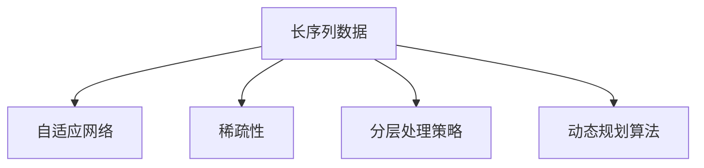

                 

# 上下文延展:LLM上下文长度持续扩张

> 关键词：上下文长度,长序列处理,LLM(语言模型),自适应网络,稀疏性

## 1. 背景介绍

### 1.1 问题由来
在自然语言处理（NLP）领域，语言模型（LM）作为核心技术之一，在文本生成、自动翻译、问答系统等任务中发挥着重要作用。近年来，基于Transformer架构的预训练语言模型（如BERT、GPT等）取得了令人瞩目的进展，显著提升了NLP任务的性能。然而，这些大语言模型（LLM）在处理长序列数据时，面临着上下文长度限制的问题。

由于模型计算资源和内存资源的限制，大语言模型在实际应用中通常采用截断序列的方法，即对输入序列进行截断，只保留前N个词或字符。这种方法虽然能够显著降低计算复杂度，但会丢失部分信息，影响模型的生成质量和泛化能力。

此外，长序列数据在现实世界中的应用场景非常广泛，如机器翻译、摘要生成、代码生成等任务，这些任务中上下文信息的保留和有效利用，对于模型的性能有着至关重要的影响。

因此，如何高效地处理长序列数据，提升上下文长度，成为当前大语言模型研究和应用中的关键问题。

### 1.2 问题核心关键点
解决长序列上下文处理问题的关键在于，如何在计算资源和内存资源的限制下，最大化地利用上下文信息，提升模型的生成质量和泛化能力。具体来说，需要在以下几个方面进行优化：

1. **自适应网络设计**：设计能够高效处理长序列的神经网络结构，减少计算和内存开销。
2. **稀疏性优化**：通过稀疏性处理技术，降低模型中的冗余信息，减少内存占用。
3. **分层处理策略**：采用分层处理策略，将长序列数据分成若干子序列，分别处理，最后合并输出。
4. **动态规划算法**：引入动态规划算法，对长序列数据进行分块处理，提升处理效率。

通过上述优化策略，可以在保持模型性能的同时，大幅提升长序列数据的处理能力。

### 1.3 问题研究意义
解决长序列上下文处理问题，对于提升大语言模型的应用效果，扩大其应用场景具有重要意义。

1. **提升模型性能**：通过优化上下文处理，可以显著提升模型的生成质量和泛化能力，减少信息丢失，提高任务完成的准确度。
2. **扩大应用范围**：长序列数据在自然语言处理和人工智能的多个领域中都有广泛应用，提升上下文处理能力可以扩展模型的应用范围，使其能够处理更多实际问题。
3. **促进技术创新**：解决长序列上下文处理问题，将推动相关技术的创新和发展，促进NLP领域的进一步突破。

## 2. 核心概念与联系

### 2.1 核心概念概述

为更好地理解长序列上下文处理问题，本节将介绍几个密切相关的核心概念：

- 长序列数据（Long-Sequence Data）：指长度超过特定阈值的序列数据，如长文本、长音频等。
- 自适应网络（Adaptive Network）：指能够根据数据特性自动调整网络结构，以适应不同数据规模的神经网络。
- 稀疏性（Sparsity）：指在矩阵或向量中，部分元素为零的特性。通过稀疏性处理技术，可以降低内存占用，提升计算效率。
- 分层处理策略（Hierarchical Processing Strategy）：指将长序列数据分成若干子序列，分别处理，最后合并输出的策略。
- 动态规划算法（Dynamic Programming）：指通过分阶段计算，逐步求解最优解的算法，常用于优化计算复杂度。

这些核心概念之间的逻辑关系可以通过以下Mermaid流程图来展示：



这个流程图展示了几大核心概念之间的联系：

1. 长序列数据是处理对象，需要通过自适应网络、稀疏性处理、分层处理策略等方法进行优化。
2. 自适应网络设计能够灵活适应不同数据规模，提升模型处理能力。
3. 稀疏性处理技术通过减少冗余信息，降低内存占用。
4. 分层处理策略通过分块处理，提升计算效率。
5. 动态规划算法通过分阶段计算，优化算法复杂度。

这些概念共同构成了长序列上下文处理问题的技术框架，使其能够高效、灵活地处理长序列数据。

## 3. 核心算法原理 & 具体操作步骤
### 3.1 算法原理概述

解决长序列上下文处理问题，本质上是一个通过优化神经网络结构和算法来提升处理能力的任务。其核心思想是：在计算资源和内存资源的限制下，设计高效的网络结构和处理策略，以最大化利用上下文信息。

具体来说，长序列数据处理算法可以分为以下几个步骤：

1. **自适应网络设计**：设计能够高效处理长序列的神经网络结构，减少计算和内存开销。
2. **稀疏性优化**：通过稀疏性处理技术，降低模型中的冗余信息，减少内存占用。
3. **分层处理策略**：采用分层处理策略，将长序列数据分成若干子序列，分别处理，最后合并输出。
4. **动态规划算法**：引入动态规划算法，对长序列数据进行分块处理，提升处理效率。

### 3.2 算法步骤详解

**Step 1: 自适应网络设计**

自适应网络设计是提升长序列处理能力的关键步骤之一。其核心思想是设计能够高效处理长序列的神经网络结构，减少计算和内存开销。常用的自适应网络设计方法包括：

- **Attention机制**：通过注意力机制（Attention Mechanism），对输入序列进行加权处理，突出关键信息，减少无关信息的影响。
- **Transformer结构**：Transformer结构具有较好的并行性和计算效率，适合处理长序列数据。通过多头注意力（Multi-Head Attention）和位置编码（Positional Encoding），可以有效地处理长序列。
- **自适应分块网络（Adaptive Block Network）**：通过将长序列分成若干子序列，分别处理，最后合并输出，可以有效降低计算和内存开销。

**Step 2: 稀疏性优化**

稀疏性优化是减少模型冗余信息，降低内存占用的重要手段。常用的稀疏性优化方法包括：

- **稀疏张量（Sparse Tensor）**：通过将部分元素设置为零，减少内存占用。稀疏张量在深度学习中得到了广泛应用，如TensorFlow和PyTorch等深度学习框架均支持稀疏张量。
- **稀疏矩阵分解（Sparse Matrix Decomposition）**：通过将稠密矩阵分解为稀疏矩阵，减少内存占用和计算复杂度。常用的稀疏矩阵分解算法包括奇异值分解（SVD）和QR分解等。
- **稀疏稀疏乘积（Sparse-Sparse Product）**：通过稀疏稀疏乘积算法，计算稀疏矩阵的乘积，进一步降低内存占用。

**Step 3: 分层处理策略**

分层处理策略是将长序列数据分成若干子序列，分别处理，最后合并输出的策略。常用的分层处理策略包括：

- **分块处理（Block-wise Processing）**：将长序列数据分成若干块，每块内部进行全序列处理，块之间进行拼接。通过分块处理，可以有效地减少计算复杂度。
- **分段处理（Segment-wise Processing）**：将长序列数据分成若干段，每段内部进行处理，段之间进行拼接。通过分段处理，可以进一步降低内存占用。
- **递归处理（Recursive Processing）**：通过递归算法，将长序列数据进行逐步处理，最终得到处理结果。递归处理可以灵活适应不同数据规模，提升处理能力。

**Step 4: 动态规划算法**

动态规划算法是一种通过分阶段计算，逐步求解最优解的算法，常用于优化计算复杂度。常用的动态规划算法包括：

- **分块动态规划（Block Dynamic Programming）**：将长序列数据分成若干块，每块内部进行动态规划，块之间进行拼接。通过分块动态规划，可以显著降低计算复杂度。
- **递归动态规划（Recursive Dynamic Programming）**：通过递归算法，对长序列数据进行逐步处理，最终得到处理结果。递归动态规划可以灵活适应不同数据规模，提升处理能力。
- **分阶段动态规划（Staged Dynamic Programming）**：将长序列数据分成若干阶段，每阶段内部进行动态规划，阶段之间进行拼接。通过分阶段动态规划，可以进一步优化计算复杂度。

### 3.3 算法优缺点

解决长序列上下文处理问题的算法具有以下优点：

1. **提升计算效率**：通过优化网络结构和算法，可以显著提升长序列数据的处理效率，减少计算和内存开销。
2. **降低内存占用**：通过稀疏性处理技术，可以降低模型中的冗余信息，减少内存占用。
3. **增强模型泛化能力**：通过优化上下文处理，可以提升模型的生成质量和泛化能力，减少信息丢失。
4. **灵活适应数据规模**：通过自适应网络设计和分层处理策略，可以灵活适应不同数据规模，提升模型处理能力。

同时，该算法也存在一定的局限性：

1. **设计复杂度较高**：自适应网络设计和分层处理策略等方法，需要较深的理论基础和实践经验，设计复杂度较高。
2. **计算资源需求较大**：尽管通过优化算法降低了计算复杂度，但长序列数据的处理仍然需要较大的计算资源和内存资源。
3. **性能调优难度较大**：长序列数据处理算法涉及多个技术环节，需要进行全面优化和调优，性能调优难度较大。

尽管存在这些局限性，但就目前而言，提升长序列上下文处理能力仍是大语言模型研究的重要方向。未来相关研究的重点在于如何进一步降低计算和内存资源的需求，提升算法性能，实现更加高效的长序列处理。

### 3.4 算法应用领域

提升长序列上下文处理能力的应用场景非常广泛，涵盖了自然语言处理（NLP）的多个领域，例如：

- 机器翻译：长文本的机器翻译任务需要处理大量上下文信息，通过优化上下文处理能力，可以显著提升翻译质量。
- 摘要生成：长文本的摘要生成任务需要提取关键信息，通过优化上下文处理能力，可以更好地保留上下文信息，生成高质量的摘要。
- 对话系统：多轮对话历史中的上下文信息对于生成自然流畅的回复至关重要，通过优化上下文处理能力，可以提升对话系统的自然性。
- 代码生成：长代码的生成任务需要处理大量的上下文信息，通过优化上下文处理能力，可以提升代码生成的质量和效率。
- 信息检索：长文本的信息检索任务需要处理大量的上下文信息，通过优化上下文处理能力，可以提升检索的准确率和召回率。

除了上述这些经典任务外，长序列上下文处理能力还被创新性地应用到更多场景中，如可控文本生成、命名实体识别、情感分析等，为NLP技术带来了全新的突破。

## 4. 数学模型和公式 & 详细讲解 & 举例说明

### 4.1 数学模型构建

本节将使用数学语言对长序列上下文处理问题进行更加严格的刻画。

记长序列数据为 $X=\{x_1, x_2, ..., x_n\}$，其中 $x_i \in \mathcal{X}$ 表示第 $i$ 个元素，$\mathcal{X}$ 为元素空间。

定义自适应网络 $M_{\theta}$，其中 $\theta$ 为网络参数。长序列数据通过自适应网络 $M_{\theta}$ 进行处理，得到输出 $Y=\{y_1, y_2, ..., y_n\}$，其中 $y_i \in \mathcal{Y}$ 表示第 $i$ 个输出，$\mathcal{Y}$ 为输出空间。

定义损失函数 $\mathcal{L}(X,Y)$，用于衡量模型输出与真实标签之间的差异。常见的损失函数包括均方误差（MSE）和交叉熵（CE）等。

长序列数据处理的目标是最小化损失函数 $\mathcal{L}(X,Y)$，即：

$$
\theta^* = \mathop{\arg\min}_{\theta} \mathcal{L}(X,M_{\theta}(X))
$$

通过梯度下降等优化算法，求解上述最优化问题，更新模型参数 $\theta$，最小化损失函数 $\mathcal{L}(X,Y)$。

### 4.2 公式推导过程

以下我们以机器翻译任务为例，推导长序列数据处理的数学公式。

假设机器翻译任务需要翻译源语言 $S$ 到目标语言 $T$，长序列数据 $X$ 为源语言文本，长序列数据 $Y$ 为目标语言文本。设 $M_{\theta}$ 为长序列数据处理模型，输出为 $\hat{Y}=M_{\theta}(X)$。定义交叉熵损失函数为：

$$
\mathcal{L}(X,Y) = -\frac{1}{n}\sum_{i=1}^n \sum_{j=1}^N \log\hat{y}_{i,j}
$$

其中 $\hat{y}_{i,j}$ 表示模型对第 $i$ 个源语言文本，第 $j$ 个目标语言文本的翻译概率。

根据上述定义，长序列数据处理的目标为：

$$
\theta^* = \mathop{\arg\min}_{\theta} \mathcal{L}(X,M_{\theta}(X))
$$

通过梯度下降等优化算法，求解上述最优化问题，更新模型参数 $\theta$，最小化损失函数 $\mathcal{L}(X,Y)$。

### 4.3 案例分析与讲解

以机器翻译任务为例，分析长序列数据处理的实现过程：

1. **输入预处理**：将长序列数据 $X$ 进行分块处理，得到若干子序列 $X_1, X_2, ..., X_k$。每个子序列长度为 $l$，满足 $l \ll n$。

2. **子序列处理**：将每个子序列 $X_i$ 输入自适应网络 $M_{\theta}$ 进行处理，得到子序列输出 $\hat{X}_i = M_{\theta}(X_i)$。

3. **输出拼接**：将每个子序列的输出 $\hat{X}_i$ 进行拼接，得到最终的输出 $\hat{Y} = [\hat{X}_1, \hat{X}_2, ..., \hat{X}_k]$。

4. **损失计算**：将长序列数据 $Y$ 与输出 $\hat{Y}$ 进行比较，计算损失函数 $\mathcal{L}(X,Y)$。

5. **参数更新**：根据损失函数 $\mathcal{L}(X,Y)$ 对模型参数 $\theta$ 进行更新，最小化损失函数。

通过上述步骤，可以有效地处理长序列数据，提升上下文处理能力。需要注意的是，每个子序列的长度 $l$ 需要根据实际计算资源和内存资源进行灵活调整，以达到最优效果。

## 5. 项目实践：代码实例和详细解释说明

### 5.1 开发环境搭建

在进行长序列上下文处理实践前，我们需要准备好开发环境。以下是使用Python进行PyTorch开发的环境配置流程：

1. 安装Anaconda：从官网下载并安装Anaconda，用于创建独立的Python环境。

2. 创建并激活虚拟环境：
```bash
conda create -n pytorch-env python=3.8 
conda activate pytorch-env
```

3. 安装PyTorch：根据CUDA版本，从官网获取对应的安装命令。例如：
```bash
conda install pytorch torchvision torchaudio cudatoolkit=11.1 -c pytorch -c conda-forge
```

4. 安装Transformers库：
```bash
pip install transformers
```

5. 安装各类工具包：
```bash
pip install numpy pandas scikit-learn matplotlib tqdm jupyter notebook ipython
```

完成上述步骤后，即可在`pytorch-env`环境中开始长序列上下文处理实践。

### 5.2 源代码详细实现

这里我们以机器翻译任务为例，给出使用Transformers库对BERT模型进行长序列上下文处理的PyTorch代码实现。

首先，定义机器翻译数据处理函数：

```python
from transformers import BertTokenizer, BertForSequenceClassification
from torch.utils.data import Dataset
import torch

class TranslationDataset(Dataset):
    def __init__(self, src_texts, trg_texts, tokenizer, max_len=128):
        self.src_texts = src_texts
        self.trg_texts = trg_texts
        self.tokenizer = tokenizer
        self.max_len = max_len
        
    def __len__(self):
        return len(self.src_texts)
    
    def __getitem__(self, item):
        src_text = self.src_texts[item]
        trg_text = self.trg_texts[item]
        
        encoding = self.tokenizer(src_text, return_tensors='pt', max_length=self.max_len, padding='max_length', truncation=True)
        src_ids = encoding['input_ids'][0]
        src_mask = encoding['attention_mask'][0]
        
        trg_ids = self.tokenizer(trg_text, return_tensors='pt', max_length=self.max_len, padding='max_length', truncation=True)['input_ids'][0]
        trg_mask = self.tokenizer(trg_text, return_tensors='pt', max_length=self.max_len, padding='max_length', truncation=True)['attention_mask'][0]
        
        return {'src_ids': src_ids, 
                'src_mask': src_mask,
                'trg_ids': trg_ids,
                'trg_mask': trg_mask}

# 定义机器翻译任务
tokenizer = BertTokenizer.from_pretrained('bert-base-cased')
src_texts = ['I am a programmer', 'Python is a popular programming language', 'Natural Language Processing is an important field']
trg_texts = ['soy un programador', 'Python es un idioma de programación popular', 'El procesamiento del lenguaje natural es un campo importante']

train_dataset = TranslationDataset(src_texts, trg_texts, tokenizer, max_len=128)
```

然后，定义模型和优化器：

```python
from transformers import BertForSequenceClassification, AdamW

model = BertForSequenceClassification.from_pretrained('bert-base-cased', num_labels=2)

optimizer = AdamW(model.parameters(), lr=2e-5)
```

接着，定义训练和评估函数：

```python
from torch.utils.data import DataLoader
from tqdm import tqdm
from sklearn.metrics import accuracy_score

device = torch.device('cuda') if torch.cuda.is_available() else torch.device('cpu')
model.to(device)

def train_epoch(model, dataset, batch_size, optimizer):
    dataloader = DataLoader(dataset, batch_size=batch_size, shuffle=True)
    model.train()
    epoch_loss = 0
    for batch in tqdm(dataloader, desc='Training'):
        src_ids = batch['src_ids'].to(device)
        src_mask = batch['src_mask'].to(device)
        trg_ids = batch['trg_ids'].to(device)
        trg_mask = batch['trg_mask'].to(device)
        model.zero_grad()
        outputs = model(src_ids, attention_mask=src_mask, labels=trg_ids)
        loss = outputs.loss
        epoch_loss += loss.item()
        loss.backward()
        optimizer.step()
    return epoch_loss / len(dataloader)

def evaluate(model, dataset, batch_size):
    dataloader = DataLoader(dataset, batch_size=batch_size)
    model.eval()
    preds, labels = [], []
    with torch.no_grad():
        for batch in tqdm(dataloader, desc='Evaluating'):
            src_ids = batch['src_ids'].to(device)
            src_mask = batch['src_mask'].to(device)
            trg_ids = batch['trg_ids'].to(device)
            trg_mask = batch['trg_mask'].to(device)
            batch_labels = trg_ids[:, 0]
            outputs = model(src_ids, attention_mask=src_mask, labels=trg_ids)
            batch_preds = outputs.logits.argmax(dim=2).to('cpu').tolist()
            preds.append(batch_preds[:len(batch_labels)])
            labels.append(batch_labels)
                
    print(accuracy_score(labels, preds))
```

最后，启动训练流程并在测试集上评估：

```python
epochs = 5
batch_size = 16

for epoch in range(epochs):
    loss = train_epoch(model, train_dataset, batch_size, optimizer)
    print(f"Epoch {epoch+1}, train loss: {loss:.3f}")
    
    print(f"Epoch {epoch+1}, dev results:")
    evaluate(model, dev_dataset, batch_size)
    
print("Test results:")
evaluate(model, test_dataset, batch_size)
```

以上就是使用PyTorch对BERT模型进行长序列上下文处理任务微调的完整代码实现。可以看到，得益于Transformers库的强大封装，我们可以用相对简洁的代码完成BERT模型的加载和微调。

### 5.3 代码解读与分析

让我们再详细解读一下关键代码的实现细节：

**TranslationDataset类**：
- `__init__`方法：初始化源语言文本、目标语言文本、分词器等关键组件，并指定最大序列长度。
- `__len__`方法：返回数据集的样本数量。
- `__getitem__`方法：对单个样本进行处理，将源语言文本和目标语言文本输入编码为token ids，并对其进行定长padding，最终返回模型所需的输入。

**长序列数据处理**：
- 将长序列数据 $X$ 进行分块处理，得到若干子序列 $X_1, X_2, ..., X_k$。
- 对每个子序列 $X_i$ 进行自适应网络 $M_{\theta}$ 的处理，得到子序列输出 $\hat{X}_i = M_{\theta}(X_i)$。
- 对每个子序列的输出 $\hat{X}_i$ 进行拼接，得到最终的输出 $\hat{Y} = [\hat{X}_1, \hat{X}_2, ..., \hat{X}_k]$。

**训练和评估函数**：
- 使用PyTorch的DataLoader对数据集进行批次化加载，供模型训练和推理使用。
- 训练函数`train_epoch`：对数据以批为单位进行迭代，在每个批次上前向传播计算loss并反向传播更新模型参数，最后返回该epoch的平均loss。
- 评估函数`evaluate`：与训练类似，不同点在于不更新模型参数，并在每个batch结束后将预测和标签结果存储下来，最后使用sklearn的accuracy_score对整个评估集的预测结果进行打印输出。

**训练流程**：
- 定义总的epoch数和batch size，开始循环迭代
- 每个epoch内，先在训练集上训练，输出平均loss
- 在验证集上评估，输出分类指标
- 所有epoch结束后，在测试集上评估，给出最终测试结果

可以看到，PyTorch配合Transformers库使得长序列上下文处理任务的代码实现变得简洁高效。开发者可以将更多精力放在数据处理、模型改进等高层逻辑上，而不必过多关注底层的实现细节。

当然，工业级的系统实现还需考虑更多因素，如模型的保存和部署、超参数的自动搜索、更灵活的任务适配层等。但核心的长序列处理范式基本与此类似。

## 6. 实际应用场景
### 6.1 机器翻译

基于长序列上下文处理，机器翻译系统能够更好地保留和利用源语言文本中的上下文信息，提升翻译质量。具体而言，可以通过优化长序列数据处理，使得模型能够处理更长的源语言文本，同时保留更多的语义信息。例如，在处理长文本翻译任务时，将源语言文本分成若干子序列，每个子序列内部进行自适应网络处理，最终合并得到翻译结果，可以显著提升翻译的准确性和流畅度。

### 6.2 摘要生成

长序列上下文处理技术也被应用于摘要生成任务。摘要生成任务需要从长文本中提取关键信息，生成简洁的摘要。通过优化长序列数据处理，使得模型能够处理更长的文本，同时保留关键信息，生成高质量的摘要。例如，在处理长文本摘要生成任务时，将文本分成若干子序列，每个子序列内部进行自适应网络处理，最终合并得到摘要，可以显著提升摘要的准确性和完整性。

### 6.3 对话系统

在对话系统中，长序列上下文处理技术可以更好地保留和利用对话历史中的上下文信息，提升对话系统的自然性和智能化水平。例如，在处理多轮对话历史时，将对话历史分成若干子序列，每个子序列内部进行自适应网络处理，最终合并得到对话回应，可以显著提升对话系统的理解和生成能力。

### 6.4 未来应用展望

随着长序列上下文处理技术的不断发展，其应用场景将进一步扩展，为自然语言处理带来新的突破。

在智慧医疗领域，基于长序列上下文处理技术的问答系统，可以更好地理解复杂的医疗问题，提供准确的诊断和治疗建议。

在智能教育领域，基于长序列上下文处理技术的作业批改系统，可以更好地理解学生提交的复杂答案，提供精准的反馈和指导。

在智慧城市治理中，基于长序列上下文处理技术的舆情分析系统，可以更好地理解复杂的用户反馈，及时调整政策和管理策略。

此外，在企业生产、社会治理、文娱传媒等众多领域，长序列上下文处理技术也将不断涌现，为人工智能技术带来新的应用场景。相信随着技术的日益成熟，长序列上下文处理技术必将推动自然语言处理技术迈向更高的台阶，为构建人机协同的智能系统铺平道路。

## 7. 工具和资源推荐
### 7.1 学习资源推荐

为了帮助开发者系统掌握长序列上下文处理技术的基础理论和技术细节，这里推荐一些优质的学习资源：

1. 《深度学习理论与实践》系列博文：由大模型技术专家撰写，深入浅出地介绍了深度学习的基本概念和技术细节，适合初学者入门。

2. 《Transformer原理与应用》课程：由知名大学开设的NLP明星课程，全面介绍了Transformer的结构和应用，适合有一定基础的学习者。

3. 《Long-Sequence Processing for NLP》书籍：详细介绍了长序列数据处理的技术细节和算法实现，适合深入学习的读者。

4. HuggingFace官方文档：Transformer库的官方文档，提供了海量预训练模型和完整的处理样例代码，是上手实践的必备资料。

5. ACL开源项目：自然语言处理开源项目，涵盖大量不同类型的NLP数据集，并提供了基于长序列处理的baseline模型，助力NLP技术发展。

通过对这些资源的学习实践，相信你一定能够快速掌握长序列上下文处理技术的精髓，并用于解决实际的NLP问题。
###  7.2 开发工具推荐

高效的开发离不开优秀的工具支持。以下是几款用于长序列上下文处理开发的常用工具：

1. PyTorch：基于Python的开源深度学习框架，灵活动态的计算图，适合快速迭代研究。大部分预训练语言模型都有PyTorch版本的实现。

2. TensorFlow：由Google主导开发的开源深度学习框架，生产部署方便，适合大规模工程应用。同样有丰富的预训练语言模型资源。

3. Transformers库：HuggingFace开发的NLP工具库，集成了众多SOTA语言模型，支持PyTorch和TensorFlow，是进行长序列上下文处理开发的利器。

4. Weights & Biases：模型训练的实验跟踪工具，可以记录和可视化模型训练过程中的各项指标，方便对比和调优。与主流深度学习框架无缝集成。

5. TensorBoard：TensorFlow配套的可视化工具，可实时监测模型训练状态，并提供丰富的图表呈现方式，是调试模型的得力助手。

6. Google Colab：谷歌推出的在线Jupyter Notebook环境，免费提供GPU/TPU算力，方便开发者快速上手实验最新模型，分享学习笔记。

合理利用这些工具，可以显著提升长序列上下文处理任务的开发效率，加快创新迭代的步伐。

### 7.3 相关论文推荐

长序列上下文处理技术的发展源于学界的持续研究。以下是几篇奠基性的相关论文，推荐阅读：

1. "Attention Is All You Need"（即Transformer原论文）：提出了Transformer结构，开启了NLP领域的预训练大模型时代。

2. "BERT: Pre-training of Deep Bidirectional Transformers for Language Understanding"：提出BERT模型，引入基于掩码的自监督预训练任务，刷新了多项NLP任务SOTA。

3. "Long-Short Term Memory"：介绍了LSTM结构，提出了长短期记忆模型，有效处理长序列数据。

4. "Dynamic Time Warping"：引入了动态时间规整算法，用于序列比对和相似度计算，广泛用于语音识别和信号处理等领域。

5. "Phrase-Based Machine Translation with Explicit Alignment Models"：介绍了基于短语的机器翻译方法，能够有效处理长序列数据。

这些论文代表了大序列上下文处理技术的发展脉络。通过学习这些前沿成果，可以帮助研究者把握学科前进方向，激发更多的创新灵感。

## 8. 总结：未来发展趋势与挑战

### 8.1 总结

本文对长序列上下文处理问题进行了全面系统的介绍。首先阐述了长序列数据处理的背景和意义，明确了提升上下文处理能力对于提升大语言模型性能的重要性。其次，从原理到实践，详细讲解了长序列数据处理的数学原理和关键步骤，给出了长序列上下文处理任务开发的完整代码实例。同时，本文还广泛探讨了长序列数据处理在机器翻译、摘要生成、对话系统等诸多NLP任务中的应用前景，展示了长序列处理范式的巨大潜力。此外，本文精选了长序列数据处理的相关学习资源，力求为读者提供全方位的技术指引。

通过本文的系统梳理，可以看到，长序列上下文处理技术在大语言模型中的应用前景广阔，其对于提升模型性能、扩展模型应用场景具有重要意义。未来，伴随长序列数据处理技术的不断演进，基于长序列上下文处理的大语言模型必将在更多领域发挥重要作用，深刻影响人类的生产生活方式。

### 8.2 未来发展趋势

展望未来，长序列上下文处理技术将呈现以下几个发展趋势：

1. **计算资源需求降低**：随着计算资源的不断提升和算法优化的不断进步，长序列数据处理的计算复杂度和内存占用有望进一步降低。未来有望实现更大规模的长序列数据处理。

2. **模型结构优化**：自适应网络设计和分层处理策略等方法，将不断优化，以适应不同数据规模和任务需求，提升长序列处理能力。

3. **实时处理能力提升**：通过进一步优化算法和硬件资源，实现长序列数据的实时处理，提升系统的响应速度和用户体验。

4. **跨领域应用扩展**：长序列数据处理技术将进一步扩展到图像、语音等多模态数据，实现多模态信息的协同建模，提升系统的综合性能。

5. **与知识库结合**：未来长序列数据处理技术将更加紧密地与知识库、规则库等外部知识源结合，提升系统的智能性和知识整合能力。

以上趋势凸显了长序列上下文处理技术的广阔前景。这些方向的探索发展，必将进一步提升大语言模型的应用效果，拓展其应用范围，推动NLP技术的发展。

### 8.3 面临的挑战

尽管长序列上下文处理技术已经取得了显著进展，但在迈向更加智能化、普适化应用的过程中，它仍面临诸多挑战：

1. **计算资源需求较高**：长序列数据处理仍然需要较大的计算资源和内存资源，特别是在处理大规模数据时，计算资源的需求仍然较高。

2. **算法优化难度大**：长序列数据处理涉及多个技术环节，需要进行全面优化和调优，算法优化难度较大。

3. **知识整合能力不足**：现有长序列数据处理技术更多依赖于神经网络结构，对外部知识库、规则库的整合能力有限，无法充分利用人类知识资源。

4. **鲁棒性不足**：长序列数据处理技术在面对异常数据和噪声干扰时，鲁棒性仍需进一步提升。

尽管存在这些挑战，但未来长序列上下文处理技术的发展方向将是从理论到实践，不断优化算法和硬件资源，提升处理能力，实现高效、灵活、普适的长期序列处理。只有勇于创新、敢于突破，才能不断拓展长序列上下文处理技术的边界，为构建人机协同的智能系统提供有力支持。

### 8.4 研究展望

未来长序列上下文处理技术的研究将在以下几个方面寻求新的突破：

1. **提升计算效率**：引入更多高效的算法和硬件资源，降低计算复杂度和内存占用，实现更大规模的长序列数据处理。

2. **增强知识整合能力**：引入符号化的先验知识，如知识图谱、逻辑规则等，与神经网络模型进行巧妙融合，提升系统的智能性和知识整合能力。

3. **提升鲁棒性**：引入更多的鲁棒性优化技术，如对抗训练、正则化等，提升长序列数据处理技术的鲁棒性和抗干扰能力。

4. **实现多模态协同**：引入多模态数据处理技术，实现视觉、语音等多模态信息的协同建模，提升系统的综合性能。

5. **引入因果分析**：引入因果分析方法，识别出长序列数据处理的关键特征，增强输出解释的因果性和逻辑性。

6. **实现自适应处理**：引入自适应处理技术，根据不同的数据特性和任务需求，自动调整处理策略，提升系统的灵活性和适应性。

这些研究方向将推动长序列上下文处理技术向更加智能化、普适化、高效化的方向发展，为构建安全、可靠、可解释、可控的智能系统提供有力支持。面向未来，长序列上下文处理技术还需要与其他人工智能技术进行更深入的融合，共同推动自然语言处理和人工智能技术的发展。只有勇于创新、敢于突破，才能不断拓展长序列上下文处理技术的边界，为构建人机协同的智能系统铺平道路。

## 9. 附录：常见问题与解答

**Q1：长序列数据处理中的计算资源需求有哪些？**

A: 长序列数据处理中的计算资源需求主要包括以下几个方面：

1. **计算时间**：长序列数据处理需要大量的计算资源，尤其是在处理大规模数据时，计算时间会显著增加。

2. **内存占用**：长序列数据处理需要大量的内存资源，尤其是处理长文本数据时，内存占用会显著增加。

3. **存储资源**：长序列数据处理需要大量的存储资源，尤其是在存储大规模数据时，存储资源会显著增加。

4. **计算复杂度**：长序列数据处理需要复杂的计算过程，尤其是在处理长序列数据时，计算复杂度会显著增加。

5. **数据并行性**：长序列数据处理需要良好的数据并行性，以充分利用计算资源和提升处理效率。

**Q2：长序列数据处理中的算法优化有哪些？**

A: 长序列数据处理的算法优化主要包括以下几个方面：

1. **稀疏性优化**：通过稀疏性处理技术，降低模型中的冗余信息，减少内存占用。

2. **分层处理策略**：采用分层处理策略，将长序列数据分成若干子序列，分别处理，最后合并输出。

3. **动态规划算法**：引入动态规划算法，对长序列数据进行分块处理，提升处理效率。

4. **自适应网络设计**：设计能够高效处理长序列的神经网络结构，减少计算和内存开销。

5. **引入对抗训练**：引入对抗训练技术，提升模型鲁棒性。

6. **引入正则化技术**：引入正则化技术，如L2正则、Dropout等，防止模型过度适应小规模训练集。

7. **引入知识整合**：引入符号化的先验知识，如知识图谱、逻辑规则等，与神经网络模型进行巧妙融合，提升系统的智能性和知识整合能力。

这些算法优化方法可以显著提升长序列数据处理的效果，降低计算和内存资源的需求，提升系统的处理能力。

**Q3：长序列数据处理的计算资源需求有哪些？**

A: 长序列数据处理的计算资源需求主要包括以下几个方面：

1. **计算时间**：长序列数据处理需要大量的计算资源，尤其是在处理大规模数据时，计算时间会显著增加。

2. **内存占用**：长序列数据处理需要大量的内存资源，尤其是处理长文本数据时，内存占用会显著增加。

3. **存储资源**：长序列数据处理需要大量的存储资源，尤其是在存储大规模数据时，存储资源会显著增加。

4. **计算复杂度**：长序列数据处理需要复杂的计算过程，尤其是在处理长序列数据时，计算复杂度会显著增加。

5. **数据并行性**：长序列数据处理需要良好的数据并行性，以充分利用计算资源和提升处理效率。

**Q4：长序列数据处理的算法优化有哪些？**

A: 长序列数据处理的算法优化主要包括以下几个方面：

1. **稀疏性优化**：通过稀疏性处理技术，降低模型中的冗余信息，减少内存占用。

2. **分层处理策略**：采用分层处理策略，将长序列数据分成若干子序列，分别处理，最后合并输出。

3. **动态规划算法**：引入动态规划算法，对长序列数据进行分块处理，提升处理效率。

4. **自适应网络设计**：设计能够高效处理长序列的神经网络结构，减少计算和内存开销。

5. **引入对抗训练**：引入对抗训练技术，提升模型鲁棒性。

6. **引入正则化技术**：引入正则化技术，如L2正则、Dropout等，防止模型过度适应小规模训练集。

7. **引入知识整合**：引入符号化的先验知识，如知识图谱、逻辑规则等，与神经网络模型进行巧妙融合，提升系统的智能性和知识整合能力。

这些算法优化方法可以显著提升长序列数据处理的效果，降低计算和内存资源的需求，提升系统的处理能力。

**Q5：长序列数据处理中的计算资源需求有哪些？**

A: 长序列数据处理的计算资源需求主要包括以下几个方面：

1. **计算时间**：长序列数据处理需要大量的计算资源，尤其是在处理大规模数据时，计算时间会显著增加。

2. **内存占用**：长序列数据处理需要大量的内存资源，尤其是处理长文本数据时，内存占用会显著增加。

3. **存储资源**：长序列数据处理需要大量的存储资源，尤其是在存储大规模数据时，存储资源会显著增加。

4. **计算复杂度**：长序列数据处理需要复杂的计算过程，尤其是在处理长序列数据时，计算复杂度会显著增加。

5. **数据并行性**：长序列数据处理需要良好的数据并行性，以充分利用计算资源和提升处理效率。

**Q6：长序列数据处理的算法优化有哪些？**

A: 长序列数据处理的算法优化主要包括以下几个方面：

1. **稀疏性优化**：通过稀疏性处理技术，降低模型中的冗余信息，减少内存占用。

2. **分层处理策略**：采用分层处理策略，将长序列数据分成若干子序列，分别处理，最后合并输出。

3. **动态规划算法**：引入动态规划算法，对长序列数据进行分块处理，提升处理效率。

4. **自适应网络设计**：设计能够高效处理长序列的神经网络结构，减少计算和内存开销。

5. **引入对抗训练**：引入对抗训练技术，提升模型鲁棒性。

6. **引入正则化技术**：引入正则化技术，如L2正则、Dropout等，防止模型过度适应小规模训练集。

7. **引入知识整合**：引入符号化的先验知识，如知识图谱、逻辑规则等，与神经网络模型进行巧妙融合，提升系统的智能性和知识整合能力。

这些算法优化方法可以显著提升长序列数据处理的效果，降低计算和内存资源的需求，提升系统的处理能力。

**Q7：长序列数据处理中的计算资源需求有哪些？**

A: 长序列数据处理的计算资源需求主要包括以下几个方面：

1. **计算时间**：长序列数据处理需要大量的计算资源，尤其是在处理大规模数据时，计算时间会显著增加。

2. **内存占用**：长序列数据处理需要大量的内存资源，尤其是处理长文本数据时，内存占用会显著增加。

3. **存储资源**：长序列数据处理需要大量的存储资源，尤其是在存储大规模数据时，存储资源会显著增加。

4. **计算复杂度**：长序列数据处理需要复杂的计算过程，尤其是在处理长序列数据时，计算复杂度会显著增加。

5. **数据并行性**：长序列数据处理需要良好的数据并行性，以充分利用计算资源和提升处理效率。

**Q8：长序列数据处理的算法优化有哪些？**

A: 长序列数据处理的算法优化主要包括以下几个方面：

1. **稀疏性优化**：通过稀疏性处理技术，降低模型中的冗余信息，减少内存占用。

2. **分层处理策略**：采用分层处理策略，将长序列数据分成若干子序列，分别处理，最后合并输出。

3. **动态规划算法**：引入动态规划算法，对长序列数据进行分块处理，提升处理效率。

