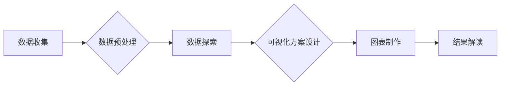

> Python, 数据可视化, 电子产品, 数据分析, Matplotlib, Seaborn, Pandas, Tableau

## 1. 背景介绍

电子商务的蓬勃发展使得电子产品市场日益繁荣，消费者对产品信息的需求也越来越高。为了更好地了解市场趋势、用户偏好和产品性能，企业需要对海量电子产品数据进行深入分析和可视化。Python作为一种功能强大、易于学习的编程语言，在数据分析和可视化领域占据着重要地位。

本篇文章将介绍基于Python的多品类电子产品数据可视化分析方法，涵盖数据处理、可视化工具、核心算法原理、数学模型构建以及项目实践等方面。通过深入的讲解和代码实例，帮助读者掌握电子产品数据可视化分析的技巧，并将其应用于实际工作中。

## 2. 核心概念与联系

**2.1 数据可视化**

数据可视化是指将数据以图形、图表等形式呈现出来，以便于人们理解和分析。数据可视化可以帮助我们发现数据中的隐藏模式、趋势和异常值，从而更好地理解数据背后的故事。

**2.2 电子产品数据**

电子产品数据是指与电子产品相关的各种信息，例如产品名称、价格、规格、评价、销量等。这些数据通常以电子表格、数据库或文本文件等形式存储。

**2.3 Python数据分析工具**

Python拥有丰富的第三方库，用于数据分析和可视化，例如：

* **Pandas:** 用于数据处理和分析，提供数据结构和操作函数。
* **Matplotlib:** 用于创建各种类型的静态、交互式和动画图表。
* **Seaborn:** 基于Matplotlib构建的统计数据可视化库，提供更高级的图表类型和美观风格。
* **Tableau:** 商业级数据可视化工具，提供更强大的交互式图表和数据探索功能。

**2.4 数据可视化流程**

数据可视化流程通常包括以下步骤：

1. 数据收集和预处理
2. 数据探索和分析
3. 可视化方案设计
4. 图表制作和呈现
5. 结果解读和沟通

**2.5 Mermaid 流程图**



## 3. 核心算法原理 & 具体操作步骤

**3.1 算法原理概述**

本篇文章主要介绍基于Python的多品类电子产品数据可视化分析方法，涉及到的算法原理主要包括：

* 数据清洗和预处理：去除数据中的缺失值、异常值和重复数据，并进行数据类型转换和编码。
* 数据聚类：将电子产品数据根据相似性进行分组，例如根据价格、性能或用户评价进行分类。
* 数据降维：将高维数据转换为低维数据，以便于可视化和分析。
* 图表生成：使用Matplotlib或Seaborn库生成各种类型的图表，例如柱状图、折线图、散点图和热力图。

**3.2 算法步骤详解**

1. **数据收集:** 从电子商务平台、市场调研报告等渠道收集电子产品数据。
2. **数据预处理:** 使用Pandas库对数据进行清洗、转换和编码。
3. **数据探索:** 使用Pandas和Matplotlib库对数据进行初步探索，例如计算统计指标、绘制直方图和箱线图。
4. **数据聚类:** 使用Scikit-learn库中的K-Means算法对电子产品数据进行聚类，根据聚类结果进行分组分析。
5. **数据降维:** 使用PCA算法对电子产品数据进行降维，将高维数据转换为低维数据，以便于可视化。
6. **图表生成:** 使用Matplotlib或Seaborn库生成各种类型的图表，例如柱状图、折线图、散点图和热力图，展示电子产品数据分析结果。

**3.3 算法优缺点**

* **优点:**

    * 灵活性和可扩展性强，可以根据实际需求定制算法和可视化方案。
    * Python生态系统丰富，拥有大量的第三方库和工具，可以简化数据分析和可视化工作。
    * 可视化效果精美，可以有效地传达数据信息。

* **缺点:**

    * 需要一定的编程基础和数据分析知识。
    * 处理海量数据时，性能可能存在瓶颈。

**3.4 算法应用领域**

* 电子商务平台：分析产品销量、用户评价和市场趋势。
* 制造业：分析产品性能、质量控制和生产效率。
* 市场调研：分析消费者偏好、市场需求和竞争对手情况。
* 金融行业：分析投资风险、市场波动和客户行为。

## 4. 数学模型和公式 & 详细讲解 & 举例说明

**4.1 数学模型构建**

在电子产品数据可视化分析中，常用的数学模型包括：

* **线性回归模型:** 用于预测连续变量，例如产品价格或销量。
* **逻辑回归模型:** 用于预测分类变量，例如产品评价或用户购买意愿。
* **聚类模型:** 用于将数据点分组，例如K-Means算法。

**4.2 公式推导过程**

例如，线性回归模型的公式如下：

$$y = mx + c$$

其中：

* $y$ 是预测值
* $x$ 是自变量
* $m$ 是斜率
* $c$ 是截距

**4.3 案例分析与讲解**

假设我们想要预测电子产品的销量，可以使用线性回归模型。我们可以收集电子产品的价格、品牌、性能等数据，并将其作为自变量，销量作为因变量。通过训练线性回归模型，我们可以得到模型参数 $m$ 和 $c$，从而预测不同产品销量的值。

## 5. 项目实践：代码实例和详细解释说明

**5.1 开发环境搭建**

本项目使用Python 3.7版本，并安装以下库：

* Pandas
* Matplotlib
* Seaborn
* Scikit-learn

**5.2 源代码详细实现**

```python
import pandas as pd
import matplotlib.pyplot as plt
import seaborn as sns
from sklearn.cluster import KMeans

# 数据加载
data = pd.read_csv('electronic_products.csv')

# 数据预处理
data['price'] = pd.to_numeric(data['price'])
data['rating'] = pd.to_numeric(data['rating'])

# 数据探索
plt.figure(figsize=(10, 6))
sns.histplot(data['price'])
plt.title('电子产品价格分布')
plt.show()

# 数据聚类
kmeans = KMeans(n_clusters=3)
data['cluster'] = kmeans.fit_predict(data[['price', 'rating']])

# 图表生成
plt.figure(figsize=(10, 6))
sns.scatterplot(x='price', y='rating', hue='cluster', data=data)
plt.title('电子产品价格与评价聚类')
plt.show()
```

**5.3 代码解读与分析**

1. 首先，我们使用Pandas库加载电子产品数据。
2. 然后，我们对数据进行预处理，将价格和评价转换为数值类型。
3. 接下来，我们使用Matplotlib和Seaborn库绘制价格分布直方图，进行初步数据探索。
4. 然后，我们使用Scikit-learn库中的K-Means算法对电子产品数据进行聚类，将数据分为三类。
5. 最后，我们使用Seaborn库绘制散点图，展示不同聚类的电子产品价格和评价分布。

**5.4 运行结果展示**

运行代码后，将生成以下图表：

* 价格分布直方图：展示电子产品价格的分布情况。
* 价格与评价聚类散点图：展示不同聚类的电子产品价格和评价分布。

## 6. 实际应用场景

**6.1 电子商务平台**

电子商务平台可以利用数据可视化分析，了解不同产品类别、品牌和价格段的销量趋势，从而优化产品推荐、库存管理和促销策略。

**6.2 制造业**

制造业可以利用数据可视化分析，监控生产过程中的关键指标，例如产量、质量和效率，并及时发现问题并进行改进。

**6.3 市场调研**

市场调研机构可以利用数据可视化分析，展示消费者对不同产品和品牌的偏好，以及市场需求和竞争格局。

**6.4 未来应用展望**

随着数据量的不断增长和可视化技术的不断发展，电子产品数据可视化分析将在未来发挥更重要的作用。例如：

* 利用人工智能技术，实现更智能的数据分析和可视化。
* 将数据可视化与虚拟现实和增强现实技术结合，打造更沉浸式的用户体验。
* 将数据可视化应用于更多领域，例如医疗、教育和金融。

## 7. 工具和资源推荐

**7.1 学习资源推荐**

* **书籍:**

    * Python数据分析手册
    * Matplotlib官方文档
    * Seaborn官方文档

* **在线课程:**

    * Coursera: 数据科学与Python
    * Udemy: Python数据分析与可视化

**7.2 开发工具推荐**

* **IDE:** PyCharm, VS Code
* **数据可视化工具:** Tableau, Power BI

**7.3 相关论文推荐**

* 数据可视化在电子商务中的应用
* 基于机器学习的电子产品推荐系统
* 电子产品数据分析与可视化技术综述

## 8. 总结：未来发展趋势与挑战

**8.1 研究成果总结**

本篇文章介绍了基于Python的多品类电子产品数据可视化分析方法，涵盖了数据处理、可视化工具、核心算法原理、数学模型构建以及项目实践等方面。通过深入的讲解和代码实例，帮助读者掌握电子产品数据可视化分析的技巧，并将其应用于实际工作中。

**8.2 未来发展趋势**

未来，电子产品数据可视化分析将朝着以下方向发展：

* 更智能的数据分析和可视化，利用人工智能技术，实现更精准的预测和分析。
* 更沉浸式的用户体验，将数据可视化与虚拟现实和增强现实技术结合，打造更直观和交互式的体验。
* 更广泛的应用场景，将数据可视化应用于更多领域，例如医疗、教育和金融。

**8.3 面临的挑战**

电子产品数据可视化分析也面临一些挑战：

* 海量数据处理能力不足，需要开发更高效的算法和工具。
* 数据质量问题，需要加强数据清洗和预处理工作。
* 可视化方案设计难度大，需要具备一定的专业知识和经验。

**8.4 研究展望**

未来，我们将继续深入研究电子产品数据可视化分析技术，探索更智能、更沉浸式和更广泛的应用场景。


## 9. 附录：常见问题与解答

**9.1 Q: 如何选择合适的聚类算法？**

**A:** 选择合适的聚类算法取决于数据的特点和分析目标。例如，对于离散数据，可以使用K-Means算法；对于连续数据，可以使用DBSCAN算法。

**9.2 Q: 如何评估聚类结果的好坏？**

**A:** 可以使用一些指标来评估聚类结果的好坏，例如Silhouette系数、Dunn指数和Calinski-Harabasz指数。

**9.3 Q: 如何设计有效的可视化方案？**

**A:** 设计有效的可视化方案需要考虑以下因素：

* 数据类型和特点
* 分析目标
* 观众群体
* 可视化工具和技术

作者：禅与计算机程序设计艺术 / Zen and the Art of Computer Programming


<end_of_turn>