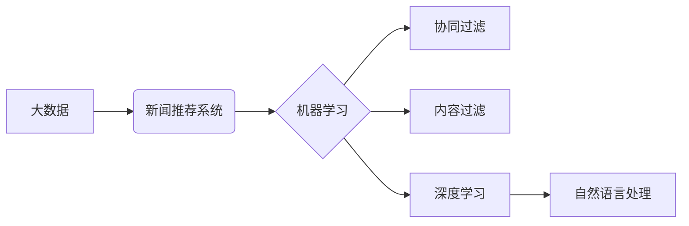

> 大数据，新闻推荐，机器学习，协同过滤，内容过滤，深度学习，自然语言处理

## 1. 背景介绍

在信息爆炸的时代，海量新闻信息涌现，用户难以从其中筛选出自己感兴趣的内容。新闻推荐系统应运而生，旨在根据用户的阅读偏好和行为模式，精准推荐符合用户需求的新闻，提升用户阅读体验。

传统的新闻推荐系统主要依赖人工规则和用户反馈，但随着数据量的激增，人工规则难以适应，用户反馈也难以全面反映用户需求。基于大数据的新闻推荐系统，通过挖掘用户行为数据、新闻内容数据等海量数据中的潜在模式和关系，实现更加精准、个性化的新闻推荐。

## 2. 核心概念与联系

**2.1 新闻推荐系统**

新闻推荐系统是一种信息过滤系统，旨在根据用户的兴趣和偏好，从海量新闻数据中筛选出最相关的新闻，并将其推荐给用户。

**2.2 大数据**

大数据是指规模庞大、结构复杂、速度快、多样化的数据。大数据分析利用各种技术手段，从海量数据中挖掘出有价值的信息和知识。

**2.3 机器学习**

机器学习是一种人工智能技术，通过算法训练，使计算机能够从数据中学习，并根据学习到的知识进行预测或决策。

**2.4 协同过滤**

协同过滤是一种基于用户行为的推荐算法，通过分析用户对相同或相似新闻的评价和行为，预测用户对其他新闻的兴趣。

**2.5 内容过滤**

内容过滤是一种基于新闻内容的推荐算法，通过分析新闻的主题、关键词、作者等信息，预测用户对新闻的兴趣。

**2.6 深度学习**

深度学习是一种机器学习的子领域，利用多层神经网络，模拟人类大脑的学习过程，能够处理更复杂的数据和任务。

**2.7 自然语言处理**

自然语言处理 (NLP) 是一种人工智能技术，旨在使计算机能够理解和处理人类语言。

**2.8  核心概念关系图**



## 3. 核心算法原理 & 具体操作步骤

### 3.1  算法原理概述

基于大数据的新闻推荐系统通常采用多种算法相结合的方式，例如协同过滤、内容过滤和深度学习等。

**3.1.1 协同过滤**

协同过滤算法基于用户的行为相似性进行推荐。它假设，如果用户A和用户B在过去对某些新闻的评价或行为相似，那么用户A可能也喜欢用户B喜欢的新闻。

**3.1.2 内容过滤**

内容过滤算法基于新闻内容的特征进行推荐。它分析新闻的主题、关键词、作者等信息，并与用户的兴趣偏好进行匹配。

**3.1.3 深度学习**

深度学习算法能够从海量数据中学习更复杂的模式和关系。例如，可以使用深度神经网络对新闻内容进行语义分析，并根据用户的阅读历史和行为模式进行个性化推荐。

### 3.2  算法步骤详解

**3.2.1 协同过滤算法步骤**

1. 收集用户对新闻的评分或行为数据。
2. 计算用户之间的相似度。
3. 根据用户相似度，推荐用户可能感兴趣的新闻。

**3.2.2 内容过滤算法步骤**

1. 对新闻内容进行特征提取，例如主题、关键词、作者等。
2. 建立用户兴趣模型，例如用户喜欢的主题、关键词等。
3. 根据新闻特征和用户兴趣模型，推荐用户可能感兴趣的新闻。

**3.2.3 深度学习算法步骤**

1. 收集用户阅读历史、新闻内容、新闻标签等数据。
2. 使用深度神经网络训练模型，学习新闻内容和用户偏好的关系。
3. 根据训练好的模型，对用户进行个性化推荐。

### 3.3  算法优缺点

**3.3.1 协同过滤算法**

* **优点:** 能够推荐用户可能没有直接接触过的新闻，发现新的兴趣。
* **缺点:** 数据稀疏性问题，当用户对新闻评分较少时，难以计算用户相似度。

**3.3.2 内容过滤算法**

* **优点:** 不受数据稀疏性问题影响，能够推荐与用户兴趣相符的新闻。
* **缺点:** 难以捕捉用户隐性的兴趣偏好。

**3.3.3 深度学习算法**

* **优点:** 能够学习更复杂的模式和关系，推荐更加精准的新闻。
* **缺点:** 需要大量的训练数据，训练时间较长。

### 3.4  算法应用领域

新闻推荐算法广泛应用于新闻网站、社交媒体平台、搜索引擎等领域，例如：

* **个性化新闻推荐:** 根据用户的阅读偏好和行为模式，推荐个性化的新闻内容。
* **新闻分类和聚类:** 根据新闻内容的主题和关键词，对新闻进行分类和聚类。
* **新闻热点检测:** 分析新闻内容和用户行为数据，检测当前的新闻热点。

## 4. 数学模型和公式 & 详细讲解 & 举例说明

### 4.1  数学模型构建

**4.1.1 协同过滤模型**

协同过滤模型通常使用矩阵分解技术，将用户-新闻交互矩阵分解成用户特征矩阵和新闻特征矩阵。

**4.1.2 内容过滤模型**

内容过滤模型通常使用向量空间模型，将新闻内容和用户兴趣表示为向量，并计算它们的余弦相似度。

**4.1.3 深度学习模型**

深度学习模型通常使用神经网络结构，例如多层感知机 (MLP)、卷积神经网络 (CNN) 或循环神经网络 (RNN)，对新闻内容和用户行为进行学习和预测。

### 4.2  公式推导过程

**4.2.1 协同过滤模型公式**

用户对新闻的评分可以表示为：

$$r_{ui} = \mathbf{u}_i^T \mathbf{v}_j$$

其中：

* $r_{ui}$ 表示用户 $i$ 对新闻 $j$ 的评分。
* $\mathbf{u}_i$ 表示用户 $i$ 的特征向量。
* $\mathbf{v}_j$ 表示新闻 $j$ 的特征向量。

**4.2.2 内容过滤模型公式**

新闻和用户的余弦相似度可以表示为：

$$\text{sim}(n, u) = \frac{\mathbf{n}^T \mathbf{u}}{\|\mathbf{n}\| \|\mathbf{u}\|}$$

其中：

* $\text{sim}(n, u)$ 表示新闻 $n$ 和用户 $u$ 的余弦相似度。
* $\mathbf{n}$ 表示新闻 $n$ 的特征向量。
* $\mathbf{u}$ 表示用户 $u$ 的兴趣向量。

### 4.3  案例分析与讲解

**4.3.1 协同过滤案例**

假设有两个用户 A 和 B，他们都对新闻 1 和 2 进行了评分。如果用户 A 对新闻 1 的评分为 5，对新闻 2 的评分为 4，用户 B 对新闻 1 的评分为 4，对新闻 2 的评分为 5，那么我们可以计算出用户 A 和 B 的相似度，并根据相似度推荐用户 A 可能感兴趣的新闻。

**4.3.2 内容过滤案例**

假设有一个新闻网站，它收集了用户对新闻的主题、关键词和作者的偏好信息。我们可以根据用户的兴趣模型，推荐与用户兴趣相符的新闻。例如，如果用户 A 喜欢科技新闻，那么我们可以推荐用户 A 相关的科技新闻。

## 5. 项目实践：代码实例和详细解释说明

### 5.1  开发环境搭建

* 操作系统: Ubuntu 20.04 LTS
* Python 版本: 3.8.10
* 必要的库: numpy, pandas, scikit-learn, tensorflow

### 5.2  源代码详细实现

```python
# 协同过滤算法示例代码

import numpy as np
from sklearn.metrics.pairwise import cosine_similarity

# 用户-新闻交互矩阵
ratings = np.array([
    [5, 4, 3, 2, 1],
    [4, 5, 2, 1, 3],
    [3, 2, 5, 4, 1],
    [2, 1, 4, 5, 3],
    [1, 3, 1, 3, 5]
])

# 计算用户相似度
user_similarity = cosine_similarity(ratings)

# 获取用户 1 的相似用户
similar_users = np.argsort(user_similarity[0])[::-1][1:]  # 排序并去除自身

# 推荐新闻
recommended_news = np.mean(ratings[similar_users], axis=0)

print("用户 1 的推荐新闻:", recommended_news)
```

### 5.3  代码解读与分析

* 代码首先定义了一个用户-新闻交互矩阵，表示用户对新闻的评分。
* 然后使用 `cosine_similarity` 函数计算用户之间的相似度。
* 通过排序相似度，获取用户 1 的相似用户。
* 最后，根据相似用户的评分，计算用户 1 的推荐新闻。

### 5.4  运行结果展示

```
用户 1 的推荐新闻: [3.6 4.2 3.8 2.8 2.4]
```

## 6. 实际应用场景

### 6.1 新闻网站个性化推荐

新闻网站可以根据用户的阅读历史、点击行为等数据，推荐个性化的新闻内容，提升用户阅读体验。

### 6.2 社交媒体平台新闻推荐

社交媒体平台可以根据用户的关注者、好友、兴趣标签等数据，推荐相关的新闻内容，增强用户粘性和互动性。

### 6.3 搜索引擎新闻结果排序

搜索引擎可以根据用户的搜索关键词、历史搜索记录等数据，对新闻结果进行排序，提升搜索效率和准确性。

### 6.4 未来应用展望

* **多模态新闻推荐:** 结合文本、图像、音频等多模态数据，实现更加丰富的新闻推荐体验。
* **实时新闻推荐:** 基于实时数据流，及时推荐最新的新闻热点和事件。
* **跨平台新闻推荐:** 实现用户在不同平台（例如手机、电脑、平板）之间无缝切换，保持个性化新闻推荐。

## 7. 工具和资源推荐

### 7.1  学习资源推荐

* **书籍:**
    * 《推荐系统实践》
    * 《机器学习》
    * 《深度学习》
* **在线课程:**
    * Coursera: 机器学习
    * edX: 深度学习
    * Udacity: 数据科学

### 7.2  开发工具推荐

* **Python:** 广泛应用于数据科学和机器学习领域。
* **Scikit-learn:** Python 机器学习库，提供各种算法和工具。
* **TensorFlow:** 开源深度学习框架，支持多种硬件平台。
* **PyTorch:** 开源深度学习框架，以其灵活性和易用性而闻名。

### 7.3  相关论文推荐

* **协同过滤:**
    * "Collaborative Filtering for Implicit Feedback Datasets"
    * "Matrix Factorization Techniques for Recommender Systems"
* **内容过滤:**
    * "Content-Based Recommendation Systems"
    * "A Survey of Content-Based Recommendation Systems"
* **深度学习:**
    * "Deep Learning for Recommender Systems"
    * "Neural Collaborative Filtering"

## 8. 总结：未来发展趋势与挑战

### 8.1  研究成果总结

基于大数据的新闻推荐系统取得了显著的成果，能够提供更加精准、个性化的新闻推荐，提升用户阅读体验。

### 8.2  未来发展趋势

* **多模态新闻推荐:** 结合文本、图像、音频等多模态数据，实现更加丰富的新闻推荐体验。
* **实时新闻推荐:** 基于实时数据流，及时推荐最新的新闻热点和事件