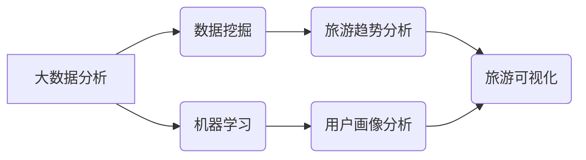

> 大数据分析，旅游可视化，数据挖掘，机器学习，数据可视化工具，旅游趋势预测

## 1. 背景介绍

随着互联网和移动技术的快速发展，旅游业迎来了数字化转型的新时代。海量旅游数据如潮水般涌现，蕴藏着丰富的旅游趋势、用户偏好和市场洞察。如何有效地挖掘和分析这些数据，为旅游企业提供决策支持，提升用户体验，已成为旅游业发展的重要课题。基于大数据的旅游可视化分析应运而生，它通过将复杂的数据转化为直观易懂的图表、地图和交互式可视化，帮助人们快速理解数据背后的规律和趋势，从而为旅游决策提供科学依据。

## 2. 核心概念与联系

**2.1 大数据分析**

大数据分析是指对海量、高维、复杂的数据进行收集、存储、处理、分析和挖掘，以发现隐藏的模式、趋势和知识。大数据分析的核心技术包括数据存储、数据处理、数据挖掘和机器学习等。

**2.2 旅游可视化**

旅游可视化是指利用图形、图表、地图等多种形式，将旅游数据进行可视化呈现，以帮助人们直观地理解和分析旅游信息。旅游可视化可以应用于各种场景，例如：

* **旅游趋势分析:** 通过可视化展示旅游目的地、旅游时间、旅游人群等数据，分析旅游趋势和热点。
* **旅游产品推荐:** 根据用户的兴趣爱好和旅游偏好，通过可视化推荐个性化的旅游产品。
* **旅游路线规划:** 根据用户的出发地、目的地、时间和预算等信息，通过可视化规划最佳的旅游路线。
* **旅游风险预警:** 通过可视化展示旅游安全信息、天气预报等数据，预警旅游风险。

**2.3 数据挖掘**

数据挖掘是指从大数据中发现隐藏的模式、规律和知识。数据挖掘技术包括分类、聚类、关联规则挖掘等。

**2.4 机器学习**

机器学习是一种人工智能技术，它通过算法学习数据，并根据学习到的知识进行预测和决策。机器学习可以应用于旅游可视化分析，例如：

* **旅游需求预测:** 利用机器学习算法预测未来的旅游需求，帮助旅游企业做好资源配置和市场营销。
* **用户画像分析:** 利用机器学习算法分析用户的旅游行为数据，构建用户画像，为个性化服务提供支持。

**2.5 数据可视化工具**

数据可视化工具是将数据转化为可视化图形的软件工具。常用的数据可视化工具包括 Tableau、Power BI、D3.js 等。

**2.6  核心概念关系图**



## 3. 核心算法原理 & 具体操作步骤

### 3.1  算法原理概述

基于大数据的旅游可视化分析通常采用以下核心算法：

* **聚类算法:** 将用户或旅游目的地根据相似性进行分组，例如根据用户年龄、性别、兴趣爱好进行用户画像分析，或根据地理位置、旅游资源、文化特色进行旅游目的地分类。
* **关联规则挖掘算法:** 发现数据中隐藏的关联关系，例如分析用户购买旅游产品的关联性，或分析旅游目的地之间的关联性。
* **时间序列分析算法:** 分析旅游数据随时间变化的趋势，例如预测未来旅游需求、分析旅游旺季和淡季。
* **机器学习算法:** 利用机器学习算法进行预测和决策，例如预测用户旅游意向、推荐个性化旅游产品。

### 3.2  算法步骤详解

以聚类算法为例，其具体操作步骤如下：

1. **数据预处理:** 对旅游数据进行清洗、转换和特征提取，例如删除缺失值、标准化数据、提取用户兴趣爱好特征。
2. **选择聚类算法:** 根据数据特点和分析目标选择合适的聚类算法，例如K-means聚类、层次聚类等。
3. **设置聚类参数:** 确定聚类算法的参数，例如K值（K-means聚类）、距离度量等。
4. **执行聚类:** 使用选择的聚类算法对数据进行聚类，将用户或旅游目的地分组。
5. **评估聚类结果:** 使用聚类评估指标，例如Silhouette系数、Dunn指数等，评估聚类结果的质量。
6. **可视化结果:** 将聚类结果可视化展示，例如使用散点图、饼图等展示用户画像或旅游目的地分类。

### 3.3  算法优缺点

**聚类算法的优点:**

* 能够发现数据中隐藏的结构和模式。
* 不需要预先定义类别标签，适用于未知类别的情况。
* 可以用于用户画像分析、旅游目的地分类等多种场景。

**聚类算法的缺点:**

* 难以确定最佳的聚类数目。
* 对数据噪声和异常值敏感。
* 难以解释聚类结果背后的原因。

### 3.4  算法应用领域

聚类算法在旅游业的应用领域非常广泛，例如：

* **用户画像分析:** 将用户根据兴趣爱好、消费习惯等特征进行分组，为个性化服务提供支持。
* **旅游目的地分类:** 将旅游目的地根据地理位置、旅游资源、文化特色等特征进行分类，帮助用户选择合适的旅游目的地。
* **旅游产品推荐:** 根据用户的兴趣爱好和旅游偏好，推荐个性化的旅游产品。
* **旅游风险预警:** 将旅游安全信息、天气预报等数据进行聚类分析，预警旅游风险。

## 4. 数学模型和公式 & 详细讲解 & 举例说明

### 4.1  数学模型构建

在旅游可视化分析中，常用的数学模型包括：

* **距离度量:** 用于衡量数据点之间的相似性，例如欧氏距离、曼哈顿距离等。
* **聚类指标:** 用于评估聚类结果的质量，例如Silhouette系数、Dunn指数等。
* **预测模型:** 用于预测未来旅游需求、用户旅游意向等，例如线性回归、逻辑回归、决策树等。

### 4.2  公式推导过程

以Silhouette系数为例，其公式如下：

$$
S_i = \frac{b_i - a_i}{max(a_i, b_i)}
$$

其中：

* $S_i$ 是第i个数据点的Silhouette系数。
* $a_i$ 是第i个数据点与其所属聚类的平均距离。
* $b_i$ 是第i个数据点与其最近的另一个聚类的平均距离。

Silhouette系数的值介于-1到1之间，值越大表示聚类结果越好。

### 4.3  案例分析与讲解

假设我们使用K-means聚类算法对用户数据进行聚类，并计算了每个用户的Silhouette系数。如果用户的Silhouette系数大于0.5，则表示该用户被聚类到合适的类别中。

## 5. 项目实践：代码实例和详细解释说明

### 5.1  开发环境搭建

* 操作系统：Windows/macOS/Linux
* Python版本：3.6+
* 必要的库：pandas、numpy、matplotlib、seaborn、scikit-learn

### 5.2  源代码详细实现

```python
import pandas as pd
from sklearn.cluster import KMeans
import matplotlib.pyplot as plt

# 加载数据
data = pd.read_csv('tourism_data.csv')

# 数据预处理
# ...

# 选择聚类算法
kmeans = KMeans(n_clusters=3, random_state=42)

# 执行聚类
kmeans.fit(data)

# 获取聚类结果
labels = kmeans.labels_

# 可视化结果
plt.scatter(data['longitude'], data['latitude'], c=labels)
plt.show()
```

### 5.3  代码解读与分析

* 首先，我们加载旅游数据并进行预处理，例如删除缺失值、标准化数据等。
* 然后，我们选择K-means聚类算法，并设置聚类数目为3。
* 接着，我们使用`fit()`方法对数据进行聚类，并获取聚类结果。
* 最后，我们使用`matplotlib`库可视化聚类结果，将每个数据点根据其所属类别进行颜色区分。

### 5.4  运行结果展示

运行代码后，将生成一个散点图，每个数据点根据其所属类别进行颜色区分。通过观察散点图，我们可以直观地了解用户或旅游目的地的聚类情况。

## 6. 实际应用场景

### 6.1  旅游趋势分析

基于大数据的旅游可视化分析可以帮助旅游企业分析旅游趋势，例如：

* **热门目的地:** 通过可视化展示旅游目的地的人流量、评价等数据，分析哪些目的地最受欢迎。
* **旅游旺季:** 通过可视化展示旅游数据随时间变化的趋势，分析旅游旺季和淡季。
* **旅游偏好:** 通过可视化展示用户对不同旅游产品的兴趣爱好，分析用户的旅游偏好。

### 6.2  旅游产品推荐

基于大数据的旅游可视化分析可以帮助旅游企业推荐个性化的旅游产品，例如：

* **基于用户画像的推荐:** 根据用户的兴趣爱好、消费习惯等特征，推荐个性化的旅游产品。
* **基于协同过滤的推荐:** 根据其他用户对相似产品或目的地的评价，推荐用户可能感兴趣的产品。
* **基于内容过滤的推荐:** 根据产品的属性和用户对产品的评价，推荐用户可能感兴趣的产品。

### 6.3  旅游路线规划

基于大数据的旅游可视化分析可以帮助用户规划最佳的旅游路线，例如：

* **根据用户出发地、目的地、时间和预算等信息，规划最佳的旅游路线。**
* **根据用户的兴趣爱好，推荐沿途的景点和活动。**
* **提供实时交通信息和路线导航。**

### 6.4  未来应用展望

随着大数据技术的不断发展，旅游可视化分析将在未来得到更广泛的应用，例如：

* **虚拟现实旅游:** 利用虚拟现实技术，为用户提供沉浸式的旅游体验。
* **个性化旅游服务:** 利用人工智能技术，为用户提供更加个性化的旅游服务。
* **旅游风险预警:** 利用大数据分析和机器学习技术，预警旅游风险，保障游客安全。

## 7. 工具和资源推荐

### 7.1  学习资源推荐

* **书籍:**
    * 《数据挖掘：概念与技术》
    * 《机器学习》
    * 《数据可视化》
* **在线课程:**
    * Coursera: 数据科学
    * edX: 机器学习
    * Udemy: 数据可视化

### 7.2  开发工具推荐

* **数据分析工具:**
    * Python: pandas, numpy, scikit-learn
    * R: tidyverse
* **数据可视化工具:**
    * Tableau
    * Power BI
    * D3.js

### 7.3  相关论文推荐

* **数据挖掘:**
    * 《数据挖掘：概念与技术》
* **机器学习:**
    * 《机器学习》
* **数据可视化:**
    * 《数据可视化》

## 8. 总结：未来发展趋势与挑战

### 8.1  研究成果总结

基于大数据的旅游可视化分析取得了显著的成果，为旅游企业和用户提供了更加科学、高效、个性化的服务。

### 8.2  未来发展趋势

未来，基于大数据的旅游可视化分析将朝着以下方向发展：

* **更加智能化:** 利用人工智能技术，实现更加智能化的旅游可视化分析，例如自动生成可视化报表、提供个性化建议等。
* **更加交互式:** 利用虚拟现实、增强现实等技术，打造更加交互式的旅游可视化体验，例如虚拟旅游、沉浸式体验等。
* **更加融合化:** 与其他技术融合，例如物联网、云计算等，实现更加全面的旅游数据分析和服务。

