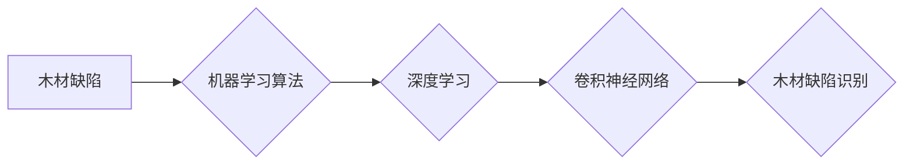

> 机器学习，木材缺陷识别，图像识别，卷积神经网络，深度学习

## 1. 背景介绍

木材作为一种重要的建筑材料和家具原料，在建筑、家具、造船等行业中有着广泛的应用。然而，木材在生长过程中难免会受到各种因素的影响，导致木材缺陷的产生。这些缺陷不仅影响木材的质量和美观，还会降低木材的强度和使用寿命，给木材加工和应用带来诸多不便。传统的木材缺陷识别方法主要依靠人工经验，效率低、准确率不高，且容易受到主观因素的影响。

近年来，随着机器学习技术的快速发展，特别是深度学习技术的突破，机器学习在木材缺陷识别领域得到了广泛的应用。利用机器学习算法可以自动学习木材缺陷的特征，实现对木材缺陷的快速、准确识别，提高木材质量控制的效率和准确性。

## 2. 核心概念与联系

### 2.1  木材缺陷类型

木材缺陷主要分为以下几种类型：

* **虫蛀缺陷:** 由木材害虫蛀蚀造成的缺陷，表现为木材内部出现空洞或通道。
* **腐朽缺陷:** 由真菌或细菌侵蚀造成的缺陷，表现为木材变软、变色、变脆。
* **裂纹缺陷:** 由木材内部应力或外部冲击造成的缺陷，表现为木材表面出现裂缝。
* **结疤缺陷:** 由树木生长过程中受到损伤或病虫害侵袭造成的缺陷，表现为木材表面出现突起或凹陷。
* **色斑缺陷:** 由木材内部色素沉淀或外部污染造成的缺陷，表现为木材表面出现颜色不均匀或斑点。

### 2.2  机器学习算法

机器学习算法是一种能够从数据中学习并不断改进的算法。常用的机器学习算法包括：

* **支持向量机 (SVM):**  一种能够在高维空间中找到最佳分类超平面的算法。
* **决策树:**  一种基于树状结构的分类算法，能够直观地展示决策过程。
* **随机森林:**  一种基于多个决策树的集成算法，能够提高分类精度。
* **神经网络:**  一种模拟人脑神经网络结构的算法，能够学习复杂的数据模式。

### 2.3  深度学习

深度学习是机器学习的一个子领域，它使用多层神经网络来学习数据特征。深度学习算法能够自动学习数据中的复杂模式，并取得了在图像识别、自然语言处理等领域取得了突破性的进展。

### 2.4  卷积神经网络 (CNN)

卷积神经网络是一种专门用于处理图像数据的深度学习算法。CNN 利用卷积操作和池化操作来提取图像特征，能够有效地学习图像中的空间结构信息。

**核心概念与联系流程图:**



## 3. 核心算法原理 & 具体操作步骤

### 3.1  算法原理概述

基于机器学习的木材缺陷识别方法主要包括以下步骤：

1. **数据采集:** 收集大量的木材缺陷图像数据，并进行标注，标记出每个图像中的缺陷类型和位置。
2. **数据预处理:** 对图像数据进行预处理，例如图像尺寸调整、图像增强、数据归一化等，以提高算法的训练效率和识别精度。
3. **模型训练:** 使用深度学习算法，例如卷积神经网络，对预处理后的图像数据进行训练，学习木材缺陷的特征。
4. **模型评估:** 使用测试数据对训练好的模型进行评估，评估模型的识别精度、召回率、F1-score等指标。
5. **模型部署:** 将训练好的模型部署到实际应用场景中，用于对木材缺陷进行实时识别。

### 3.2  算法步骤详解

1. **数据采集:** 

    * 使用专业的相机拍摄木材缺陷图像，确保图像质量高、缺陷清晰可见。
    * 采用人工标注的方式，对图像中的缺陷进行标记，标注缺陷类型和位置。
    * 构建一个包含多种木材缺陷类型和不同角度、光照条件的图像数据集。

2. **数据预处理:**

    * **图像尺寸调整:** 将所有图像调整为统一的尺寸，以满足模型的输入要求。
    * **图像增强:** 使用图像增强技术，例如对比度调整、锐化处理等，提高图像的清晰度和细节信息。
    * **数据归一化:** 将图像像素值归一化到[0, 1]区间，提高模型的训练效率和稳定性。

3. **模型训练:**

    * 选择合适的深度学习框架，例如TensorFlow、PyTorch等。
    * 设计卷积神经网络模型结构，例如AlexNet、VGGNet、ResNet等。
    * 使用训练数据对模型进行训练，调整模型参数，使模型能够准确识别木材缺陷。

4. **模型评估:**

    * 使用测试数据对训练好的模型进行评估，计算模型的识别精度、召回率、F1-score等指标。
    * 分析模型的识别结果，找出模型识别错误的类型和原因，并进行改进。

5. **模型部署:**

    * 将训练好的模型部署到实际应用场景中，例如木材加工厂、木材检测站等。
    * 开发相应的软件接口，方便用户使用模型进行木材缺陷识别。

### 3.3  算法优缺点

**优点:**

* **识别精度高:** 深度学习算法能够学习木材缺陷的复杂特征，识别精度高。
* **自动化程度高:** 机器学习算法能够自动识别木材缺陷，无需人工干预，提高效率。
* **可扩展性强:** 可以根据需要增加训练数据，提高模型的识别能力。

**缺点:**

* **数据依赖性强:** 需要大量的标注数据进行训练，数据采集和标注成本较高。
* **计算资源需求高:** 深度学习模型训练需要大量的计算资源，成本较高。
* **解释性差:** 深度学习模型的决策过程较为复杂，难以解释模型的识别结果。

### 3.4  算法应用领域

基于机器学习的木材缺陷识别方法在木材加工、木材检测、木材质量控制等领域具有广泛的应用前景。

* **木材加工:** 在木材加工过程中，可以利用机器学习算法对木材进行缺陷识别，剔除缺陷木材，提高木材加工效率和产品质量。
* **木材检测:** 在木材检测站，可以利用机器学习算法对木材进行快速、准确的缺陷检测，提高木材检测效率和准确性。
* **木材质量控制:** 在木材质量控制环节，可以利用机器学习算法对木材进行缺陷识别，确保木材质量符合标准要求。

## 4. 数学模型和公式 & 详细讲解 & 举例说明

### 4.1  数学模型构建

卷积神经网络 (CNN) 的数学模型主要包括卷积层、池化层、全连接层等。

* **卷积层:** 使用卷积核对输入图像进行卷积运算，提取图像特征。卷积核是一个小的矩阵，通过滑动在图像上进行卷积运算，提取图像局部特征。

* **池化层:** 对卷积层的输出进行池化运算，例如最大池化、平均池化等，降低特征图的尺寸，提高模型的鲁棒性。

* **全连接层:** 将池化层的输出连接到全连接层，进行分类或回归任务。

### 4.2  公式推导过程

卷积运算的公式如下：

$$
y_{i,j} = \sum_{m=0}^{M-1} \sum_{n=0}^{N-1} x_{i+m,j+n} * w_{m,n} + b
$$

其中：

* $y_{i,j}$ 是卷积层的输出值。
* $x_{i+m,j+n}$ 是输入图像的像素值。
* $w_{m,n}$ 是卷积核的权值。
* $b$ 是卷积层的偏置值。

### 4.3  案例分析与讲解

假设输入图像大小为 32x32，卷积核大小为 3x3，步长为 1，则卷积层的输出大小为 30x30。

## 5. 项目实践：代码实例和详细解释说明

### 5.1  开发环境搭建

* **操作系统:** Ubuntu 18.04
* **Python 版本:** 3.7
* **深度学习框架:** TensorFlow 2.0
* **其他依赖库:** OpenCV, NumPy, Matplotlib

### 5.2  源代码详细实现

```python
import tensorflow as tf
from tensorflow.keras.models import Sequential
from tensorflow.keras.layers import Conv2D, MaxPooling2D, Flatten, Dense

# 定义卷积神经网络模型
model = Sequential()
model.add(Conv2D(32, (3, 3), activation='relu', input_shape=(32, 32, 3)))
model.add(MaxPooling2D((2, 2)))
model.add(Conv2D(64, (3, 3), activation='relu'))
model.add(MaxPooling2D((2, 2)))
model.add(Flatten())
model.add(Dense(10, activation='softmax'))

# 编译模型
model.compile(optimizer='adam',
              loss='categorical_crossentropy',
              metrics=['accuracy'])

# 训练模型
model.fit(x_train, y_train, epochs=10, batch_size=32)

# 评估模型
loss, accuracy = model.evaluate(x_test, y_test)
print('Test loss:', loss)
print('Test accuracy:', accuracy)
```

### 5.3  代码解读与分析

* **模型定义:** 使用 `Sequential` 类定义一个顺序模型，添加卷积层、池化层、全连接层等。
* **卷积层:** 使用 `Conv2D` 层进行卷积运算，提取图像特征。
* **池化层:** 使用 `MaxPooling2D` 层进行最大池化运算，降低特征图的尺寸。
* **全连接层:** 使用 `Dense` 层进行分类或回归任务。
* **模型编译:** 使用 `compile` 方法编译模型，指定优化器、损失函数和评价指标。
* **模型训练:** 使用 `fit` 方法训练模型，传入训练数据和超参数。
* **模型评估:** 使用 `evaluate` 方法评估模型，传入测试数据。

### 5.4  运行结果展示

训练完成后，可以将模型保存下来，并在实际应用场景中使用。

## 6. 实际应用场景

### 6.1  木材加工厂

在木材加工厂，可以利用机器学习算法对木材进行缺陷识别，剔除缺陷木材，提高木材加工效率和产品质量。例如，可以利用机器学习算法识别木材中的虫蛀缺陷、腐朽缺陷、裂纹缺陷等，将缺陷木材剔除，避免在后续加工过程中造成浪费。

### 6.2  木材检测站

在木材检测站，可以利用机器学习算法对木材进行快速、准确的缺陷检测，提高木材检测效率和准确性。例如，可以利用机器学习算法识别木材中的色斑缺陷、结疤缺陷等，并给出相应的检测报告，帮助木材检测人员进行快速、准确的判断。

### 6.3  木材质量控制

在木材质量控制环节，可以利用机器学习算法对木材进行缺陷识别，确保木材质量符合标准要求。例如，可以利用机器学习算法识别木材中的各种缺陷，并根据缺陷的类型和严重程度进行分类，帮助木材质量控制人员进行有效的质量控制。

### 6.4  未来应用展望

随着机器学习技术的不断发展，木材缺陷识别方法将更加智能化、自动化。未来，可以利用更先进的深度学习算法，例如迁移学习、生成对抗网络等，提高木材缺陷识别的精度和效率。此外，还可以将机器学习算法与其他技术结合，例如传感器技术、物联网技术等，实现木材缺陷的实时监测和预警，为木材加工和应用提供更全面的解决方案。

## 7. 工具和资源推荐

### 7.1  学习资源推荐

* **书籍:**
    