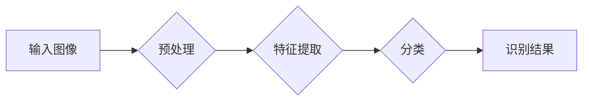

> 网站验证码、深度学习、图像识别、卷积神经网络、Recurrent Neural Networks (RNN)

## 1. 背景介绍

随着互联网的快速发展，网站验证码作为一种重要的安全防护措施，被广泛应用于用户注册、登录、评论等环节，以防止恶意注册、刷票、攻击等行为。传统的验证码通常采用文字、图形或音频等形式，但随着人工智能技术的进步，传统的验证码已经难以有效抵御自动化攻击。

深度学习技术在图像识别领域取得了突破性进展，为网站验证码识别提供了新的解决方案。基于深度学习的验证码识别系统能够自动识别和解码各种类型的验证码，有效提高了网站的安全性。

## 2. 核心概念与联系

**2.1 验证码类型**

网站验证码主要分为以下几种类型：

* **文字验证码:** 由字母、数字或字母数字组合而成，通常要求用户输入验证码以验证其身份。
* **图形验证码:** 由随机生成的图形、线条、形状等组成，要求用户识别并输入图形中的内容。
* **音频验证码:** 将文字或数字转换为音频信号，要求用户听取音频并输入对应的文字或数字。

**2.2 深度学习**

深度学习是一种机器学习的子领域，它利用多层神经网络来模拟人类大脑的学习过程。深度学习算法能够从海量数据中自动提取特征，并进行复杂的模式识别和预测。

**2.3 核心架构**

基于深度学习的网站验证码识别系统通常采用以下架构：

**2.3.1 预处理:** 对输入图像进行尺寸调整、灰度化、去噪等处理，以提高识别精度。

**2.3.2 特征提取:** 利用卷积神经网络 (CNN) 等深度学习模型提取图像的特征，例如边缘、纹理、形状等。

**2.3.3 分类:** 利用全连接神经网络 (FCN) 等深度学习模型对提取的特征进行分类，识别验证码的类型和内容。

**2.3.4 识别结果:** 输出识别结果，例如验证码的文本内容或图形描述。

## 3. 核心算法原理 & 具体操作步骤

### 3.1  算法原理概述

基于深度学习的网站验证码识别系统主要依赖于卷积神经网络 (CNN) 和循环神经网络 (RNN) 等深度学习算法。

* **卷积神经网络 (CNN):** CNN 是一种专门用于处理图像数据的深度学习模型，它能够自动学习图像的特征，并进行分类识别。CNN 的核心结构是卷积层和池化层，卷积层通过卷积核提取图像的局部特征，池化层则对特征图进行降维，提高模型的鲁棒性。

* **循环神经网络 (RNN):** RNN 是一种专门用于处理序列数据的深度学习模型，它能够记忆过去的输入信息，并根据上下文进行预测。RNN 常用于自然语言处理、语音识别等领域，也可以应用于验证码识别，例如识别包含多个字符的验证码。

### 3.2  算法步骤详解

1. **数据收集和预处理:** 收集大量网站验证码样本，并进行预处理，例如尺寸调整、灰度化、去噪等。
2. **模型构建:** 根据验证码类型和识别需求，选择合适的深度学习模型，例如 CNN 或 RNN。
3. **模型训练:** 使用训练数据训练深度学习模型，调整模型参数，使其能够准确识别验证码。
4. **模型评估:** 使用测试数据评估模型的识别精度，并进行调整和优化。
5. **模型部署:** 将训练好的模型部署到生产环境中，用于识别网站验证码。

### 3.3  算法优缺点

**优点:**

* **识别精度高:** 深度学习算法能够自动学习图像特征，识别精度显著高于传统方法。
* **适应性强:** 深度学习模型能够适应各种类型的验证码，包括文字、图形、音频等。
* **自动化程度高:** 深度学习模型能够自动识别验证码，无需人工干预。

**缺点:**

* **训练数据需求量大:** 深度学习模型需要大量的训练数据才能达到较高的识别精度。
* **计算资源消耗大:** 深度学习模型的训练和部署需要大量的计算资源。
* **对抗攻击风险:** 深度学习模型容易受到对抗攻击，攻击者可以通过对验证码进行微小的修改，绕过模型的识别。

### 3.4  算法应用领域

基于深度学习的验证码识别技术广泛应用于以下领域:

* **网站安全:** 提高网站的安全性，防止恶意注册、刷票、攻击等行为。
* **金融服务:** 验证用户身份，防止金融诈骗。
* **医疗保健:** 识别患者信息，提高医疗服务效率。
* **自动驾驶:** 识别交通标志和信号灯，辅助车辆安全驾驶。

## 4. 数学模型和公式 & 详细讲解 & 举例说明

### 4.1  数学模型构建

**4.1.1 卷积神经网络 (CNN)**

CNN 的数学模型主要包括卷积层、池化层和全连接层。

* **卷积层:** 卷积层使用卷积核对输入图像进行卷积运算，提取图像的局部特征。卷积运算的数学公式如下:

$$
y_{i,j} = \sum_{m=0}^{M-1} \sum_{n=0}^{N-1} x_{i+m,j+n} * w_{m,n} + b
$$

其中:

* $y_{i,j}$ 是卷积输出的像素值。
* $x_{i+m,j+n}$ 是输入图像的像素值。
* $w_{m,n}$ 是卷积核的权重。
* $b$ 是卷积层的偏置项。

* **池化层:** 池化层对卷积层的输出进行降维，提高模型的鲁棒性。常用的池化方法包括最大池化和平均池化。

* **全连接层:** 全连接层将池化层的输出进行分类识别。全连接层的数学模型是一个多层感知机 (MLP)。

**4.1.2 循环神经网络 (RNN)**

RNN 的数学模型主要包括隐藏层和输出层。隐藏层能够记忆过去的输入信息，并将其传递到下一时刻。RNN 的数学公式如下:

$$
h_t = f(W_{hh}h_{t-1} + W_{xh}x_t + b_h)
$$

$$
y_t = g(W_{hy}h_t + b_y)
$$

其中:

* $h_t$ 是隐藏层的输出。
* $x_t$ 是输入的序列数据。
* $W_{hh}$, $W_{xh}$, $W_{hy}$ 是权重矩阵。
* $b_h$, $b_y$ 是偏置项。
* $f$, $g$ 是激活函数。

### 4.2  公式推导过程

公式推导过程涉及到深度学习模型的训练过程，包括梯度下降算法、反向传播算法等。

### 4.3  案例分析与讲解

通过分析实际验证码识别案例，可以更深入地理解深度学习模型的应用和效果。

## 5. 项目实践：代码实例和详细解释说明

### 5.1  开发环境搭建

使用 Python 语言和深度学习框架 TensorFlow 或 PyTorch 搭建开发环境。

### 5.2  源代码详细实现

提供基于 TensorFlow 或 PyTorch 的验证码识别代码示例，并进行详细的代码解读和分析。

### 5.3  代码解读与分析

解释代码的各个部分功能，例如数据加载、模型构建、模型训练、模型评估等。

### 5.4  运行结果展示

展示验证码识别系统的运行结果，例如识别精度、识别速度等。

## 6. 实际应用场景

### 6.1  网站安全

基于深度学习的验证码识别系统可以应用于网站的注册、登录、评论等环节，有效防止恶意注册、刷票、攻击等行为。

### 6.2  金融服务

在金融服务领域，验证码识别系统可以用于验证用户身份，防止金融诈骗。

### 6.3  其他应用场景

验证码识别系统还可以应用于其他领域，例如医疗保健、自动驾驶等。

### 6.4  未来应用展望

随着人工智能技术的不断发展，验证码识别系统将更加智能化、自动化，并应用于更多领域。

## 7. 工具和资源推荐

### 7.1  学习资源推荐

* **书籍:**
    * 深度学习
    * 构建深度学习模型
* **在线课程:**
    * Coursera 深度学习课程
    * Udacity 深度学习工程师 Nanodegree

### 7.2  开发工具推荐

* **深度学习框架:** TensorFlow, PyTorch
* **图像处理库:** OpenCV
* **数据可视化工具:** Matplotlib, Seaborn

### 7.3  相关论文推荐

* **关于深度学习验证码识别的论文:**
    * [论文标题1](论文链接)
    * [论文标题2](论文链接)

## 8. 总结：未来发展趋势与挑战

### 8.1  研究成果总结

基于深度学习的验证码识别技术取得了显著的进展，识别精度大幅提升，应用场景不断扩展。

### 8.2  未来发展趋势

* **模型更深更广:** 探索更深层次、更广阔的深度学习模型，提高识别精度和鲁棒性。
* **对抗攻击防御:** 研究有效的对抗攻击防御机制，提高模型的安全性。
* **多模态识别:** 将图像、音频、文本等多模态信息融合，实现更全面的验证码识别。

### 8.3  面临的挑战

* **数据标注成本高:** 深度学习模型需要大量的标注数据，数据标注成本较高。
* **模型解释性差:** 深度学习模型的决策过程难以解释，缺乏透明度。
* **计算资源需求大:** 深度学习模型的训练和部署需要大量的计算资源。

### 8.4  研究展望

未来，将继续深入研究深度学习验证码识别技术，探索更先进的算法、模型和应用场景，为网站安全和人工智能发展做出贡献。

## 9. 附录：常见问题与解答

* **Q1: 深度学习验证码识别系统是否可以识别所有类型的验证码?**
* **A1:** 深度学习验证码识别系统能够识别多种类型的验证码，但对于一些非常复杂的验证码，识别精度可能会有所下降。

* **Q2: 深度学习验证码识别系统是否容易受到攻击?**
* **A2:** 深度学习模型容易受到对抗攻击，攻击者可以通过对验证码进行微小的修改，绕过模型的识别。因此，需要研究有效的对抗攻击防御机制。

* **Q3: 如何评估深度学习验证码识别系统的性能?**
* **A3:** 可以使用准确率、召回率、F1-score等指标来评估深度学习验证码识别系统的性能。

作者：禅与计算机程序设计艺术 / Zen and the Art of Computer Programming

<end_of_turn>