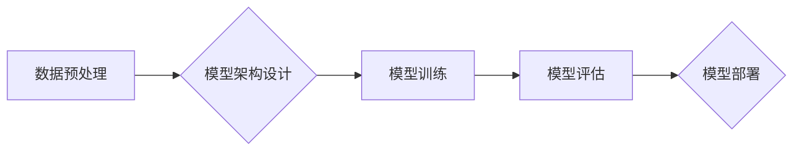

> 基础模型、涌现、同质化、大模型、迁移学习、泛化能力、伦理问题

## 1. 背景介绍

近年来，人工智能领域取得了令人瞩目的进展，其中基础模型的涌现与同质化现象尤为引人注目。基础模型是指在海量数据上预训练的强大通用模型，能够在各种下游任务中表现出卓越的性能。这些模型的出现，标志着人工智能发展进入了一个新的阶段，但也引发了关于模型同质化、伦理问题等一系列新的挑战。

### 1.1 基础模型的兴起

基础模型的兴起与以下几个因素密切相关：

* **数据量的爆炸式增长:**  互联网时代的到来，海量数据涌现，为基础模型的训练提供了充足的燃料。
* **计算能力的飞速提升:**  GPU、TPU等高性能计算硬件的不断发展，使得训练大型模型成为可能。
* **算法的不断创新:**  Transformer、BERT等新型神经网络架构的出现，大幅提升了模型的表达能力和学习效率。

### 1.2 基础模型的优势

基础模型具有以下显著优势：

* **通用性:**  基础模型能够在多种下游任务中进行迁移学习，无需针对每个任务进行专门训练。
* **效率:**  预训练好的基础模型可以快速部署，降低了模型训练和调优的成本。
* **性能:**  基础模型在许多任务上表现出超越传统模型的性能。

## 2. 核心概念与联系

基础模型的涌现与同质化现象，本质上是模型训练和应用过程中的一种自然规律。

### 2.1 模型训练过程

模型训练过程可以简单概括为以下步骤：

1. **数据预处理:**  收集和清洗数据，将其转换为模型可理解的格式。
2. **模型架构设计:**  根据任务需求设计模型的结构和参数。
3. **模型训练:**  使用训练数据训练模型，调整模型参数以最小化损失函数。
4. **模型评估:**  使用测试数据评估模型的性能，并进行调优。

### 2.2 模型同质化现象

模型同质化现象是指，在相同的训练数据和模型架构下，不同的训练团队或机构训练出的模型在性能和结构上表现出高度相似性。

**Mermaid 流程图**



## 3. 核心算法原理 & 具体操作步骤

### 3.1 算法原理概述

基础模型的训练主要基于深度学习算法，其中Transformer模型是目前最流行的架构之一。Transformer模型的核心思想是利用注意力机制来捕捉文本序列中的长距离依赖关系，从而实现更准确的文本理解和生成。

### 3.2 算法步骤详解

1. **词嵌入:** 将文本中的每个词转换为稠密的向量表示，以便模型能够理解词语的语义信息。
2. **多头注意力机制:**  利用多个注意力头来捕捉文本序列中的不同层次的依赖关系。
3. **前馈神经网络:** 对每个词的注意力输出进行进一步处理，提取更深层的语义特征。
4. **位置编码:**  由于Transformer模型没有循环结构，因此需要添加位置编码来表示每个词在序列中的位置信息。
5. **解码器:**  解码器接收编码器的输出，并根据上下文信息生成目标文本序列。

### 3.3 算法优缺点

**优点:**

* 能够捕捉长距离依赖关系，提升文本理解能力。
* 并行训练效率高，适合处理大规模文本数据。

**缺点:**

* 计算量大，训练成本高。
* 对训练数据质量要求高，容易出现过拟合问题。

### 3.4 算法应用领域

Transformer模型在自然语言处理领域有着广泛的应用，例如：

* 机器翻译
* 文本摘要
* 问答系统
* 情感分析
* 代码生成

## 4. 数学模型和公式 & 详细讲解 & 举例说明

### 4.1 数学模型构建

Transformer模型的数学模型主要基于以下几个核心组件：

* **注意力机制:**  注意力机制的核心思想是学习每个词与其他词之间的相关性，并根据相关性赋予不同词不同的权重。

* **多头注意力机制:**  多头注意力机制通过使用多个注意力头来捕捉不同层次的依赖关系，提升模型的表达能力。

* **前馈神经网络:**  前馈神经网络用于对每个词的注意力输出进行进一步处理，提取更深层的语义特征。

### 4.2 公式推导过程

**注意力机制公式:**

$$
Attention(Q, K, V) = softmax(\frac{QK^T}{\sqrt{d_k}})V
$$

其中：

* $Q$：查询矩阵
* $K$：键矩阵
* $V$：值矩阵
* $d_k$：键向量的维度
* $softmax$：softmax函数

**多头注意力机制公式:**

$$
MultiHead(Q, K, V) = Concat(head_1, head_2, ..., head_h)W_O
$$

其中：

* $head_i$：第 $i$ 个注意力头的输出
* $h$：注意力头的数量
* $W_O$：线性变换矩阵

### 4.3 案例分析与讲解

**举例说明:**

假设我们有一个句子 "The cat sat on the mat"，我们需要使用注意力机制来计算每个词与其他词之间的相关性。

1. 将句子中的每个词转换为词向量表示。
2. 计算每个词与所有其他词之间的点积，并将其规范化。
3. 使用 softmax 函数将点积转换为概率分布，表示每个词与其他词的相关性。
4. 根据概率分布，将每个词的向量表示加权平均，得到每个词的上下文向量。

## 5. 项目实践：代码实例和详细解释说明

### 5.1 开发环境搭建

* Python 3.7+
* PyTorch 1.7+
* CUDA 10.2+

### 5.2 源代码详细实现

```python
import torch
import torch.nn as nn

class Transformer(nn.Module):
    def __init__(self, vocab_size, embedding_dim, num_heads, num_layers):
        super(Transformer, self).__init__()
        self.embedding = nn.Embedding(vocab_size, embedding_dim)
        self.transformer_layers = nn.ModuleList([
            nn.TransformerEncoderLayer(embedding_dim, num_heads)
            for _ in range(num_layers)
        ])
        self.linear = nn.Linear(embedding_dim, vocab_size)

    def forward(self, x):
        x = self.embedding(x)
        for layer in self.transformer_layers:
            x = layer(x)
        x = self.linear(x)
        return x
```

### 5.3 代码解读与分析

* `__init__` 方法：初始化模型参数，包括词嵌入层、Transformer编码器层和线性输出层。
* `forward` 方法：定义模型的正向传播过程，将输入序列转换为输出序列。

### 5.4 运行结果展示

训练好的Transformer模型可以用于各种下游任务，例如机器翻译、文本摘要等。

## 6. 实际应用场景

基础模型在各个领域都有着广泛的应用，例如：

* **自然语言处理:**  机器翻译、文本摘要、问答系统、情感分析、代码生成等。
* **计算机视觉:**  图像分类、目标检测、图像生成等。
* **语音识别:**  语音转文本、语音合成等。

### 6.4 未来应用展望

随着基础模型的不断发展，其应用场景将会更加广泛，例如：

* **个性化推荐:**  根据用户的兴趣和行为，提供个性化的商品推荐。
* **自动驾驶:**  帮助自动驾驶汽车理解周围环境，做出更安全的决策。
* **医疗诊断:**  辅助医生进行疾病诊断，提高诊断准确率。

## 7. 工具和资源推荐

### 7.1 学习资源推荐

* **书籍:**
    * 《深度学习》
    * 《自然语言处理》
* **在线课程:**
    * Coursera: 深度学习
    * Udacity: 自然语言处理

### 7.2 开发工具推荐

* **PyTorch:**  开源深度学习框架
* **TensorFlow:**  开源深度学习框架
* **HuggingFace:**  提供预训练模型和工具

### 7.3 相关论文推荐

* 《Attention Is All You Need》
* 《BERT: Pre-training of Deep Bidirectional Transformers for Language Understanding》
* 《GPT-3: Language Models are Few-Shot Learners》

## 8. 总结：未来发展趋势与挑战

### 8.1 研究成果总结

基础模型的涌现与同质化现象，标志着人工智能发展进入了一个新的阶段。基础模型的通用性和效率，为人工智能的广泛应用提供了强大的支持。

### 8.2 未来发展趋势

未来，基础模型的发展趋势包括：

* **模型规模的进一步扩大:**  更大的模型规模能够提升模型的性能和泛化能力。
* **模型架构的不断创新:**  新的模型架构能够解决现有模型的局限性，提升模型的效率和表达能力。
* **多模态模型的开发:**  融合文本、图像、音频等多模态数据，构建更强大的通用模型。

### 8.3 面临的挑战

基础模型的发展也面临着一些挑战：

* **模型训练成本高:**  训练大型模型需要大量的计算资源和时间。
* **模型解释性差:**  基础模型的决策过程难以解释，这限制了其在一些安全敏感领域的应用。
* **模型偏见问题:**  基础模型可能继承训练数据中的偏见，导致模型输出存在偏差。

### 8.4 研究展望

未来，我们需要继续探索基础模型的潜力，解决其面临的挑战，并将其应用于更多领域，推动人工智能技术的发展。

## 9. 附录：常见问题与解答

### 9.1 什么是基础模型？

基础模型是指在海量数据上预训练的强大通用模型，能够在各种下游任务中进行迁移学习。

### 9.2 基础模型的优势是什么？

基础模型具有通用性、效率和高性能等优势。

### 9.3 基础模型有哪些应用场景？

基础模型在自然语言处理、计算机视觉、语音识别等领域都有广泛的应用。

### 9.4 基础模型面临哪些挑战？

基础模型面临训练成本高、模型解释性差、模型偏见问题等挑战。


作者：禅与计算机程序设计艺术 / Zen and the Art of Computer Programming 
<end_of_turn>