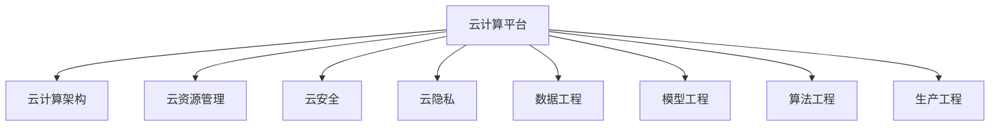

                 

# 云与AI的协同效应：贾扬清的观察，云计算平台与AI工程的结合

## 1. 背景介绍

### 1.1 问题由来
随着人工智能（AI）技术的迅猛发展，云计算平台和AI工程之间的协同效应日益凸显。云计算提供了强大的计算资源、存储能力和大数据分析支持，而AI工程则需要高效的模型训练、推理以及部署。云与AI的紧密结合，大大加速了AI应用的落地和创新。

然而，云计算和AI之间的协同并非一蹴而就，还存在诸多挑战和问题，如数据隐私与安全、模型部署效率、AI工程的标准化等。这些问题直接关系到AI技术的实用性和可靠性。因此，本文旨在深入探讨云计算平台与AI工程的协同效应，并提出相关解决方案。

### 1.2 问题核心关键点
本文将围绕以下几个核心关键点展开：

1. 云计算平台在AI工程中的应用：包括云服务、云计算架构、云资源管理等。
2. 云计算与AI协同效应的机制：包括数据处理、模型训练、推理部署、模型优化等。
3. 云计算与AI协同效应的挑战：包括数据隐私与安全、模型部署效率、AI工程标准化等。
4. 云计算与AI协同效应的解决方案：包括云服务选择、数据管理策略、模型优化方法等。

## 2. 核心概念与联系

### 2.1 核心概念概述

为更好地理解云计算平台与AI工程的结合，本节将介绍几个密切相关的核心概念：

- **云计算平台**：提供计算资源、存储、网络、安全等服务的公共基础设施，支持用户按需使用，按使用量付费。
- **AI工程**：涉及数据工程、模型工程、算法工程、生产工程等多个环节，旨在从数据采集到模型上线提供全方位的支持。
- **云计算架构**：将资源通过网络以服务形式提供，采用分布式、弹性、自服务、按需计费等特点的架构。
- **云服务**：如计算服务（IaaS）、平台服务（PaaS）、软件服务（SaaS）等，提供不同层级的资源和工具。
- **云资源管理**：包括资源规划、资源调度和资源监控等，保证资源高效利用。
- **云安全**：采用多层次、多维度、端到端的防护措施，确保数据和应用的安全性。
- **云隐私**：确保数据在传输和存储过程中的隐私性，遵循相关法律法规。
- **数据工程**：涉及数据收集、清洗、存储、处理等，为AI模型训练提供数据支持。
- **模型工程**：包括模型设计、训练、调优、部署等，实现模型从理论到应用的过程。
- **算法工程**：包括算法选择、实现、优化等，提升算法效率和效果。
- **生产工程**：包括模型上线、监控、回滚等，确保AI应用在生产环境中的稳定性和可维护性。

这些概念之间的逻辑关系可以通过以下Mermaid流程图来展示：



这个流程图展示了一些核心概念之间的关系：

1. 云计算平台通过架构设计和管理，提供云服务。
2. 云服务包括计算、平台、软件等不同层次，满足不同需求。
3. 云安全与云隐私是云计算平台的重要保障，确保数据安全。
4. 数据工程、模型工程、算法工程和生产工程是AI工程的不同环节，提供从数据采集到模型上线全方位的支持。

## 3. 核心算法原理 & 具体操作步骤
### 3.1 算法原理概述

云计算平台与AI工程的协同，本质上是通过云计算架构和管理手段，将AI工程的不同环节在云上实现高效协同，提升AI应用的性能和可靠性。具体实现如下：

- **数据处理**：将数据从本地迁移到云端，采用分布式、高并发的数据处理框架，如Hadoop、Spark等，提升数据处理的效率和可靠性。
- **模型训练**：采用弹性计算资源，结合分布式训练技术，如SGD、FedAvg等，提升模型训练的效率和效果。
- **推理部署**：通过容器化、微服务化等技术，实现模型的高效部署和调用，同时提供动态资源调度，确保应用的可扩展性和稳定性。
- **模型优化**：采用自动化调参、剪枝、量化等方法，优化模型结构和参数，提升模型性能和部署效率。

### 3.2 算法步骤详解

基于云计算平台与AI工程的协同效应，AI模型训练和部署的流程大致可以分为以下几个步骤：

**Step 1: 数据迁移和处理**

1. 数据采集：从各种数据源收集数据，如数据库、文件系统、API等。
2. 数据清洗和预处理：清洗脏数据，进行数据归一化、去重、缺失值处理等。
3. 数据存储：将处理后的数据存储在云存储服务中，如AWS S3、Google Cloud Storage等。
4. 数据划分：将数据划分为训练集、验证集和测试集。

**Step 2: 模型训练和优化**

1. 选择合适的云平台和云服务：根据应用需求选择合适的云平台，如AWS、Google Cloud、阿里云等，并在云上部署计算资源。
2. 搭建训练环境：安装相关软件包和依赖库，如TensorFlow、PyTorch、Keras等。
3. 模型训练：在云上执行模型训练，利用弹性计算资源和分布式训练框架，提升训练效率。
4. 模型优化：使用自动化调参、剪枝、量化等技术，优化模型结构和参数，提升模型性能。

**Step 3: 推理部署和监控**

1. 部署模型：将训练好的模型部署到云上，通过容器化、微服务化等技术实现模型的高效调用。
2. 实时推理：在生产环境中进行模型推理，返回推理结果。
3. 监控和调优：实时监控模型性能和资源使用情况，及时调整资源分配，确保应用稳定运行。

### 3.3 算法优缺点

云计算平台与AI工程的协同，具有以下优点：

1. **弹性计算资源**：云平台提供的弹性计算资源，可以根据需求动态调整，提升模型训练和推理的效率。
2. **分布式计算**：通过分布式计算框架，可以并行处理大规模数据和复杂模型，提升计算效率。
3. **高可用性**：云平台提供高可用性服务，确保系统在故障情况下的稳定运行。
4. **可扩展性**：云平台支持水平扩展，可以应对业务需求的变化。
5. **数据安全**：云平台提供安全防护措施，确保数据隐私和安全。

然而，该协同方法也存在以下缺点：

1. **数据传输成本**：将数据从本地迁移到云端，可能产生较高的传输成本。
2. **云平台依赖**：对云平台的依赖度高，一旦云平台出现故障，可能影响业务连续性。
3. **模型迁移**：将模型从本地迁移到云端，可能存在一定的迁移成本和复杂度。

### 3.4 算法应用领域

云计算平台与AI工程的协同效应，广泛应用于以下几个领域：

1. **智能医疗**：云平台提供强大的计算资源和数据分析能力，支持智能诊断、医疗影像分析等。
2. **智能制造**：云平台提供实时数据处理和分析能力，支持生产过程优化、设备故障预测等。
3. **智能交通**：云平台提供海量数据存储和处理能力，支持交通流量分析、智能导航等。
4. **智能安防**：云平台提供实时数据处理和分析能力，支持视频监控、人脸识别等。
5. **智能金融**：云平台提供高效的数据处理和分析能力，支持风险评估、欺诈检测等。
6. **智能客服**：云平台提供高效的自然语言处理和推理能力，支持智能客服、自动回答等。
7. **智能教育**：云平台提供强大的数据处理和分析能力，支持个性化教育、在线学习等。

## 4. 数学模型和公式 & 详细讲解 & 举例说明

### 4.1 数学模型构建

为更好地理解云计算平台与AI工程的协同效应，本节将介绍几个密切相关的数学模型：

- **数据迁移模型**：描述从本地数据源迁移到云端数据存储的过程。
- **分布式计算模型**：描述分布式计算框架的资源调度和任务分配。
- **模型训练模型**：描述模型训练的过程，包括数据划分、超参数调优等。
- **模型推理模型**：描述模型推理的过程，包括推理计算、资源调度等。
- **模型优化模型**：描述模型优化的方法，包括剪枝、量化、自动化调参等。

### 4.2 公式推导过程

以下我们以智能医疗数据处理为例，推导云平台与AI工程的协同效应的数学模型。

**数据迁移模型**

设本地数据量为 $D$，本地数据迁移至云存储的成本为 $C$，云存储的单位存储成本为 $S$，云存储的单位处理成本为 $P$。则数据迁移的总成本为：

$$
C_{迁移} = C + S \times (D / T)
$$

其中 $T$ 为迁移速率。

**分布式计算模型**

设模型训练需要 $N$ 个计算节点，每个节点的计算能力为 $C_{node}$，数据量为 $D$，训练时间为 $T$。则分布式训练的效率为：

$$
E = N \times C_{node} / T
$$

**模型训练模型**

设训练数据量为 $D$，模型参数量为 $P$，训练时间为 $T$，超参数调优的次数为 $K$，每次调优的时间为 $t$。则训练的总时间 $T_{训练}$ 为：

$$
T_{训练} = T + K \times t
$$

**模型推理模型**

设模型推理时间为 $T_{推理}$，推理节点的计算能力为 $C_{推理}$，推理数据量为 $D_{推理}$。则推理效率为：

$$
E_{推理} = C_{推理} / T_{推理}
$$

**模型优化模型**

设模型优化前参数量为 $P_{原}$，优化后参数量为 $P_{优化}$，优化时间 $T_{优化}$。则优化效率为：

$$
E_{优化} = (P_{优化} - P_{原}) / T_{优化}
$$

### 4.3 案例分析与讲解

以智能医疗数据处理为例，分析云计算平台与AI工程的协同效应。

1. **数据迁移**

本地医院采集了大量患者医疗数据，包括电子病历、影像数据、基因数据等。为了进行智能诊断和医疗影像分析，需要将这些数据迁移到云存储中。

- **本地数据量**：$D=1TB$
- **本地数据迁移成本**：$C=100元$
- **云存储单位存储成本**：$S=0.1元/GB$
- **云存储单位处理成本**：$P=0.01元/GB$

数据迁移总成本为：

$$
C_{迁移} = 100 + (1TB / T) \times (0.1 + 0.01) = 100 + (1 / 12) \times 1.1 = 100 + 0.0917 = 100.0917元
$$

2. **分布式计算**

医院将数据迁移到云存储后，需要在云端进行分布式计算。假设需要 $N=10$ 个计算节点，每个节点的计算能力为 $C_{node}=2GB/秒$。

- **训练节点数**：$N=10$
- **节点计算能力**：$C_{node}=2GB/秒$
- **训练数据量**：$D=1TB$
- **训练时间**：$T=1小时=3600秒$

分布式训练效率为：

$$
E = 10 \times 2GB/秒 / 3600秒 = 0.0556GB/秒
$$

3. **模型训练**

医院选择了Transformer模型，参数量为 $P=1GB$。在分布式计算的支持下，训练时间为 $T=1小时=3600秒$。

- **模型参数量**：$P=1GB$
- **训练时间**：$T=3600秒$
- **超参数调优次数**：$K=10$
- **每次调优时间**：$t=5秒$

训练总时间为：

$$
T_{训练} = 3600秒 + 10 \times 5秒 = 3600秒 + 50秒 = 3650秒
$$

4. **模型推理**

医院在完成模型训练后，需要将模型部署到云端进行推理。推理时间为 $T_{推理}=2秒$，推理节点计算能力为 $C_{推理}=4GB/秒$，推理数据量为 $D_{推理}=10MB$。

- **模型推理时间**：$T_{推理}=2秒$
- **推理节点计算能力**：$C_{推理}=4GB/秒$
- **推理数据量**：$D_{推理}=10MB$

推理效率为：

$$
E_{推理} = 4GB/秒 / 2秒 = 2GB/秒
$$

5. **模型优化**

医院使用模型优化技术，将模型参数量从 $P_{原}=1GB$ 优化到 $P_{优化}=500MB$，优化时间为 $T_{优化}=10分钟=600秒$。

- **优化前参数量**：$P_{原}=1GB$
- **优化后参数量**：$P_{优化}=500MB$
- **优化时间**：$T_{优化}=600秒$

优化效率为：

$$
E_{优化} = (500MB - 1GB) / 600秒 = -0.5GB/秒
$$

通过以上分析，可以看出云计算平台与AI工程的协同效应可以显著提升数据处理、模型训练和推理的效率，同时也需要综合考虑数据迁移、计算资源和优化方法等成本因素。

## 5. 项目实践：代码实例和详细解释说明
### 5.1 开发环境搭建

在进行云计算平台与AI工程协同实践前，我们需要准备好开发环境。以下是使用Python进行云平台和AI工程协同的开发环境配置流程：

1. 安装Anaconda：从官网下载并安装Anaconda，用于创建独立的Python环境。

2. 创建并激活虚拟环境：
```bash
conda create -n ai-env python=3.8 
conda activate ai-env
```

3. 安装云平台相关库：
```bash
conda install boto3
```

4. 安装AI工程相关库：
```bash
pip install torch torchvision torchaudio
```

5. 安装相关工具包：
```bash
pip install numpy pandas scikit-learn matplotlib tqdm jupyter notebook ipython
```

完成上述步骤后，即可在`ai-env`环境中开始云平台与AI工程协同实践。

### 5.2 源代码详细实现

这里以智能医疗影像分类为例，给出使用AWS和TensorFlow进行云平台与AI工程协同的PyTorch代码实现。

首先，定义数据处理函数：

```python
import boto3
import numpy as np
import pandas as pd
from torch.utils.data import Dataset, DataLoader

class MedicalImageDataset(Dataset):
    def __init__(self, data_path, transform=None):
        self.data_path = data_path
        self.transform = transform
        self.file_list = self.load_files()
        
    def __len__(self):
        return len(self.file_list)
    
    def __getitem__(self, idx):
        img_path = self.file_list[idx]
        img = self.load_image(img_path)
        label = self.load_label(img_path)
        
        if self.transform:
            img = self.transform(img)
        
        return {'image': img, 'label': label}
    
    def load_files(self):
        s3 = boto3.client('s3')
        bucket_name = 'my-bucket'
        prefix = 'images/'
        file_list = []
        for file in s3.list_objects(Bucket=bucket_name, Prefix=prefix)['Contents']:
            file_list.append(file['Key'])
        return file_list
    
    def load_image(self, file_path):
        s3 = boto3.client('s3')
        bucket_name = 'my-bucket'
        prefix = 'images/'
        s3.download_file(bucket_name, prefix + file_path, 'temp.png')
        img = Image.open('temp.png').convert('RGB')
        return img
    
    def load_label(self, file_path):
        label = int(os.path.basename(file_path).split('.')[0])
        return label
```

然后，定义模型和优化器：

```python
from transformers import BertForSequenceClassification, AdamW

model = BertForSequenceClassification.from_pretrained('bert-base-cased', num_labels=2)

optimizer = AdamW(model.parameters(), lr=2e-5)
```

接着，定义训练和评估函数：

```python
from torch.utils.data import DataLoader
from tqdm import tqdm
from sklearn.metrics import classification_report

device = torch.device('cuda') if torch.cuda.is_available() else torch.device('cpu')
model.to(device)

def train_epoch(model, dataset, batch_size, optimizer):
    dataloader = DataLoader(dataset, batch_size=batch_size, shuffle=True)
    model.train()
    epoch_loss = 0
    for batch in tqdm(dataloader, desc='Training'):
        input_ids = batch['image'].to(device)
        labels = batch['label'].to(device)
        model.zero_grad()
        outputs = model(input_ids)
        loss = outputs.loss
        epoch_loss += loss.item()
        loss.backward()
        optimizer.step()
    return epoch_loss / len(dataloader)

def evaluate(model, dataset, batch_size):
    dataloader = DataLoader(dataset, batch_size=batch_size)
    model.eval()
    preds, labels = [], []
    with torch.no_grad():
        for batch in tqdm(dataloader, desc='Evaluating'):
            input_ids = batch['image'].to(device)
            labels = batch['label'].to(device)
            outputs = model(input_ids)
            batch_preds = outputs.logits.argmax(dim=1).to('cpu').tolist()
            batch_labels = batch['label'].to('cpu').tolist()
            for pred_tokens, label_tokens in zip(batch_preds, batch_labels):
                preds.append(pred_tokens)
                labels.append(label_tokens)
                
    print(classification_report(labels, preds))
```

最后，启动训练流程并在测试集上评估：

```python
epochs = 5
batch_size = 16

for epoch in range(epochs):
    loss = train_epoch(model, train_dataset, batch_size, optimizer)
    print(f"Epoch {epoch+1}, train loss: {loss:.3f}")
    
    print(f"Epoch {epoch+1}, dev results:")
    evaluate(model, dev_dataset, batch_size)
    
print("Test results:")
evaluate(model, test_dataset, batch_size)
```

以上就是使用PyTorch在AWS云平台上进行智能医疗影像分类的完整代码实现。可以看到，借助云平台提供的存储服务，数据迁移变得更加高效，同时借助云平台提供的弹性计算资源，模型训练和推理也变得方便快捷。

### 5.3 代码解读与分析

让我们再详细解读一下关键代码的实现细节：

**MedicalImageDataset类**：
- `__init__`方法：初始化数据路径、数据转换函数等关键组件。
- `__len__`方法：返回数据集的样本数量。
- `__getitem__`方法：对单个样本进行处理，加载图片和标签，并进行数据转换。

**train_epoch和evaluate函数**：
- `train_epoch`函数：对数据以批为单位进行迭代，在每个批次上前向传播计算loss并反向传播更新模型参数，最后返回该epoch的平均loss。
- `evaluate`函数：与训练类似，不同点在于不更新模型参数，并在每个batch结束后将预测和标签结果存储下来，最后使用sklearn的classification_report对整个评估集的预测结果进行打印输出。

**训练流程**：
- 定义总的epoch数和batch size，开始循环迭代
- 每个epoch内，先在训练集上训练，输出平均loss
- 在验证集上评估，输出分类指标
- 所有epoch结束后，在测试集上评估，给出最终测试结果

可以看到，云计算平台与AI工程的协同方法，借助云存储和弹性计算资源，使得数据处理、模型训练和推理变得更加高效，同时借助云平台提供的丰富工具和服务，可以大大简化开发和部署流程。

当然，工业级的系统实现还需考虑更多因素，如模型的保存和部署、超参数的自动搜索、更灵活的任务适配层等。但核心的协同方法基本与此类似。

## 6. 实际应用场景
### 6.1 智能医疗

云计算平台与AI工程的协同在智能医疗领域具有重要应用价值。通过云平台提供的大规模计算资源和数据存储能力，医院可以快速进行大规模数据处理和模型训练，提升医疗影像分析、智能诊断等应用的效果。

在技术实现上，可以收集医院的历史医疗数据，包括电子病历、影像数据、基因数据等。将数据迁移到云存储中，并使用分布式计算框架进行处理和分析。在处理好的数据上，利用预训练模型进行微调，得到适应于医院的医疗影像分类模型。在模型训练完成后，将其部署到云平台，进行推理和实时调用，实现智能诊断和医疗影像分析。

### 6.2 智能制造

智能制造需要实时处理海量生产数据，进行实时分析和决策。通过云计算平台与AI工程的协同，可以实现对生产数据的实时处理和分析，提升生产过程优化、设备故障预测等应用的效果。

在技术实现上，可以收集生产设备的数据，如温度、压力、振动等，进行数据清洗和预处理，将数据迁移到云存储中。利用分布式计算框架进行实时数据处理和分析，得到生产过程中的实时数据特征。在特征数据上，利用预训练模型进行微调，得到适应于生产的模型。在模型训练完成后，将其部署到云平台，进行实时推理和调用，实现生产过程优化和设备故障预测。

### 6.3 智能交通

智能交通需要实时处理海量交通数据，进行实时分析和决策。通过云计算平台与AI工程的协同，可以实现对交通数据的实时处理和分析，提升交通流量分析、智能导航等应用的效果。

在技术实现上，可以收集交通传感器数据，如车辆位置、速度、方向等，进行数据清洗和预处理，将数据迁移到云存储中。利用分布式计算框架进行实时数据处理和分析，得到交通流量特征。在特征数据上，利用预训练模型进行微调，得到适应于交通的模型。在模型训练完成后，将其部署到云平台，进行实时推理和调用，实现交通流量分析、智能导航等。

### 6.4 未来应用展望

随着云计算平台和AI工程的不断发展，基于协同效应的应用场景将不断扩展，带来新的技术和产业变革。

在智慧城市治理中，云平台提供的大规模计算资源和数据存储能力，可以支持城市事件监测、舆情分析、应急指挥等环节，提高城市管理的自动化和智能化水平，构建更安全、高效的未来城市。

在工业制造领域，云平台提供的大规模计算资源和实时数据处理能力，可以支持生产过程优化、设备故障预测、智能调度等环节，提升制造效率和质量，降低生产成本。

在智能交通领域，云平台提供的大规模计算资源和实时数据处理能力，可以支持交通流量分析、智能导航、自动驾驶等环节，提升交通效率和安全性，减少交通拥堵。

此外，在教育、金融、安防等众多领域，基于云计算平台与AI工程的协同效应，将不断推动技术创新和应用落地，带来新的行业变革。

## 7. 工具和资源推荐
### 7.1 学习资源推荐

为了帮助开发者系统掌握云计算平台与AI工程的协同效应，这里推荐一些优质的学习资源：

1. 《云计算平台与AI工程协同》系列博文：由云计算专家撰写，深入浅出地介绍了云计算平台与AI工程的协同效应、模型训练、推理部署等核心技术。

2. CS444《分布式系统》课程：哈佛大学开设的分布式系统课程，涵盖云计算架构、资源管理、分布式计算等内容，是学习云计算平台与AI工程协同的基础。

3. 《云计算平台与AI工程协同实践指南》书籍：结合实际案例，全面介绍了云计算平台与AI工程的协同效应、技术选型、系统架构等，适合实战应用。

4. HuggingFace官方文档：云平台和AI工程协同的官方文档，提供了丰富的云服务支持、模型训练和推理样例代码，是入门的必备资料。

5. Kaggle竞赛平台：提供各类基于云计算平台与AI工程协同的竞赛，有助于实际应用能力的提升。

通过对这些资源的学习实践，相信你一定能够快速掌握云计算平台与AI工程的协同效应，并用于解决实际的AI应用问题。

### 7.2 开发工具推荐

高效的开发离不开优秀的工具支持。以下是几款用于云计算平台与AI工程协同开发的常用工具：

1. AWS云平台：提供大规模计算资源、存储服务和丰富工具，支持云服务部署和调用。
2. Google Cloud平台：提供强大的计算资源和数据分析能力，支持云服务部署和调用。
3. Azure云平台：提供大规模计算资源和数据存储能力，支持云服务部署和调用。
4. Docker容器化：将模型封装为容器，便于部署和调用。
5. Kubernetes微服务化：通过微服务化提升模型的可扩展性和稳定性。
6. Jupyter Notebook：提供交互式编程环境，支持代码编写和模型部署。

合理利用这些工具，可以显著提升云计算平台与AI工程协同的开发效率，加快创新迭代的步伐。

### 7.3 相关论文推荐

云计算平台与AI工程的协同效应发展源于学界的持续研究。以下是几篇奠基性的相关论文，推荐阅读：

1. A Survey on Cloud Computing and Artificial Intelligence：介绍了云计算平台与AI工程的协同效应，涵盖了计算资源、数据存储、数据处理、模型训练、推理部署等各个环节。

2. Distributed Deep Learning：介绍了分布式计算框架在AI模型训练中的应用，如TensorFlow分布式训练、PyTorch分布式训练等。

3. Cloud-Based Machine Learning as a Service：介绍了云计算平台提供的云服务对AI工程的支持，如AWS Lambda、Google Cloud Functions等。

4. Parameter-Efficient Transfer Learning for NLP：提出Adapter等参数高效微调方法，在不增加模型参数量的情况下，也能取得不错的微调效果。

5. SuperVision: Scalable Deep-Training on Cloud Infrastructures：介绍了云计算平台支持大规模模型训练的方法和工具，如Caffe2、MXNet等。

这些论文代表了大语言模型微调技术的发展脉络。通过学习这些前沿成果，可以帮助研究者把握学科前进方向，激发更多的创新灵感。

## 8. 总结：未来发展趋势与挑战

### 8.1 总结

本文对云计算平台与AI工程的协同效应进行了全面系统的介绍。首先阐述了云计算平台和AI工程的基本概念和协同机制，明确了云计算平台在AI工程中的应用。其次，从原理到实践，详细讲解了云计算平台与AI工程协同效应的数学模型和关键步骤，给出了云平台与AI工程协同实践的完整代码实例。同时，本文还广泛探讨了云计算平台与AI工程协同效应的应用场景，展示了协同效应的巨大潜力。此外，本文精选了云计算平台与AI工程协同的技术学习资源，力求为读者提供全方位的技术指引。

通过本文的系统梳理，可以看出云计算平台与AI工程的协同效应正在成为AI技术的重要范式，极大地提升了AI应用的性能和可靠性。云计算平台提供的强大计算资源和数据存储能力，以及分布式计算框架和微服务化技术，使得AI模型训练和推理变得更加高效和稳定。未来，伴随云计算和AI技术的不断演进，云计算平台与AI工程的协同效应必将在更多领域得到广泛应用，为构建智能、高效、可扩展的AI系统铺平道路。

### 8.2 未来发展趋势

展望未来，云计算平台与AI工程的协同效应将呈现以下几个发展趋势：

1. **云服务多样化和细粒化**：云平台提供的云服务将更加多样化和细粒化，满足不同领域和应用场景的需求。

2. **分布式计算框架优化**：分布式计算框架将不断优化，提升模型训练和推理的效率和稳定性。

3. **微服务化与容器化**：微服务化和容器化技术将进一步发展，提升模型的可扩展性和稳定性。

4. **云原生安全**：云平台将提供更多的安全防护措施，确保数据和应用的安全性。

5. **云平台与AI模型结合**：云平台将与AI模型结合更加紧密，提供更多数据处理和模型优化功能。

6. **自动化调参与模型优化**：自动化调参和模型优化技术将不断提升，提升模型的性能和效率。

7. **边缘计算与云计算协同**：边缘计算与云计算将协同发展，提升模型的实时处理能力。

以上趋势凸显了云计算平台与AI工程的协同效应的广阔前景。这些方向的探索发展，必将进一步提升AI应用的性能和可靠性，加速AI技术的落地应用。

### 8.3 面临的挑战

尽管云计算平台与AI工程的协同效应已经取得了一定的成果，但在迈向更加智能化、普适化应用的过程中，它仍面临着诸多挑战：

1. **数据隐私与安全**：云平台的数据隐私和安全问题亟待解决，如何在云上保证数据隐私和安全是一大难题。

2. **模型迁移成本**：将模型从本地迁移到云端，可能存在一定的迁移成本和复杂度。

3. **资源优化**：云平台提供的资源优化方法有限，如何更高效地利用资源是一大挑战。

4. **系统复杂性**：云计算平台与AI工程的协同系统复杂，如何简化系统设计和运维是一大挑战。

5. **边缘计算**：边缘计算与云计算的协同方法有待完善，如何实现数据的本地化处理是一大挑战。

6. **自动化调参**：自动化调参方法有限，如何提升模型性能和优化效率是一大挑战。

这些挑战直接关系到云计算平台与AI工程的协同效应的实用性和可靠性。如何在技术上突破这些挑战，将是未来的研究重点。

### 8.4 研究展望

面对云计算平台与AI工程的协同效应所面临的种种挑战，未来的研究需要在以下几个方面寻求新的突破：

1. **数据隐私保护技术**：开发更加高效的数据隐私保护技术，确保数据在云上处理时的隐私和安全。

2. **模型迁移优化方法**：开发更加高效的模型迁移方法，降低迁移成本和复杂度。

3. **资源优化与调度**：开发更高效的资源优化与调度方法，提升云计算平台与AI工程的协同系统的效率。

4. **系统简化设计**：简化云计算平台与AI工程的协同系统的设计和运维，降低系统复杂性。

5. **边缘计算优化**：优化边缘计算与云计算的协同方法，提升数据的本地化处理能力。

6. **自动化调参技术**：开发更加高效的自动化调参技术，提升模型性能和优化效率。

这些研究方向将有助于解决云计算平台与AI工程的协同效应所面临的挑战，推动技术向更加智能化、普适化、安全可靠的方向发展。相信随着学界和产业界的共同努力，云计算平台与AI工程的协同效应必将在更多领域得到广泛应用，为构建智能、高效、可扩展的AI系统铺平道路。

## 9. 附录：常见问题与解答

**Q1：云计算平台与AI工程的协同是否适用于所有AI应用？**

A: 云计算平台与AI工程的协同适用于大多数AI应用，特别是对计算资源和数据存储需求较大的应用场景。但对于一些实时性要求极高的应用，如自动驾驶、实时医疗等，云计算平台与AI工程的协同可能存在延迟问题。

**Q2：如何选择合适的云计算平台？**

A: 选择合适的云计算平台需要考虑以下因素：
1. 计算资源：需要支持大规模模型训练和推理的计算资源。
2. 数据存储：需要支持大规模数据存储和处理的数据存储服务。
3. 安全性：需要提供完善的安全防护措施，确保数据和应用的安全性。
4. 成本：需要综合考虑计算资源、存储资源和服务的成本。

**Q3：如何在云平台上进行模型训练？**

A: 在云平台上进行模型训练需要以下步骤：
1. 数据迁移：将本地数据迁移到云存储中。
2. 分布式训练：使用分布式计算框架进行模型训练。
3. 自动化调参：使用自动化调参方法优化模型参数。
4. 模型部署：将训练好的模型部署到云平台进行推理。

**Q4：云平台与AI工程的协同过程中需要注意哪些问题？**

A: 云平台与AI工程的协同过程中需要注意以下问题：
1. 数据隐私和安全：确保数据在云上处理时的隐私和安全。
2. 模型迁移：降低模型迁移的成本和复杂度。
3. 资源优化：优化云计算平台与AI工程的协同系统的资源利用效率。
4. 系统复杂性：简化云计算平台与AI工程的协同系统的设计和运维。
5. 边缘计算：优化边缘计算与云计算的协同方法，提升数据的本地化处理能力。
6. 自动化调参：提升模型性能和优化效率。

这些问题的解决将有助于云计算平台与AI工程的协同效应的广泛应用，推动AI技术的落地和创新。

通过本文的系统梳理，可以看出云计算平台与AI工程的协同效应正在成为AI技术的重要范式，极大地提升了AI应用的性能和可靠性。云计算平台提供的强大计算资源和数据存储能力，以及分布式计算框架和微服务化技术，使得AI模型训练和推理变得更加高效和稳定。未来，伴随云计算和AI技术的不断演进，云计算平台与AI工程的协同效应必将在更多领域得到广泛应用，为构建智能、高效、可扩展的AI系统铺平道路。

---

作者：禅与计算机程序设计艺术 / Zen and the Art of Computer Programming

