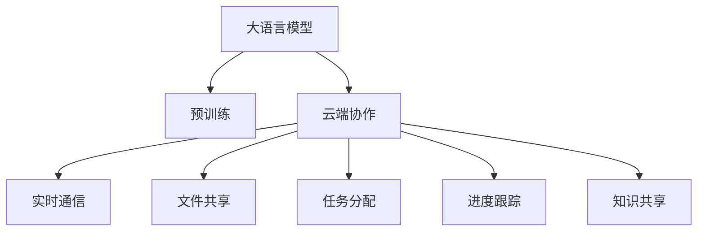

                 

# 云端协作：LLM 促进全球团队合作

> 关键词：云端协作, LLM, 自然语言处理, 全球团队, 高效沟通, 知识共享

## 1. 背景介绍

### 1.1 问题由来

在当前全球化时代，跨国公司和远程团队已经成为一种常态。尤其是在新冠疫情之后，全球化协作的需求更加凸显。然而，语言和文化差异使得跨地域团队之间的沟通和协作存在诸多挑战。这些问题不仅包括信息不对称、时区差异、沟通效率低下，还包括文化冲突和误解等问题。

传统的沟通和协作方式如电子邮件、电话会议等已经难以满足这种复杂的需求。如何在异构环境中高效、透明地协作，成为了一个亟需解决的难题。

### 1.2 问题核心关键点

为了应对这些挑战，本文聚焦于利用大语言模型（Large Language Models, LLMs）促进全球团队合作的研究，探讨其背后的技术原理、实际应用和潜在价值。通过将LLM与云端协作技术结合，实现跨国团队之间的即时沟通、协作和知识共享，从而提升团队效率和工作质量。

## 2. 核心概念与联系

### 2.1 核心概念概述

在探讨如何利用LLM促进全球团队协作之前，我们首先需要了解以下关键概念：

- **大语言模型 (LLM)**：以自回归(如GPT)或自编码(如BERT)模型为代表的大规模预训练语言模型。通过在大规模无标签文本语料上进行预训练，学习通用的语言表示，具备强大的语言理解和生成能力。

- **云端协作**：通过互联网技术实现的实时通信、文件共享、任务分配、进度跟踪等协作功能。云计算平台提供稳定的网络服务，使得远程团队能够在任何时间、任何地点高效协作。

- **自然语言处理 (NLP)**：使计算机能够理解、解释和生成人类语言的技术。NLP在自动翻译、文本摘要、情感分析、对话系统等任务中都有广泛应用。

- **知识共享**：通过构建知识库、文档管理系统等工具，实现团队内部知识的积累和传递，提高团队的整体能力和工作效率。

这些概念之间的关系可以通过以下Mermaid流程图来展示：



这个流程图展示了LLM在促进云端协作中的作用：

1. LLM经过预训练获得通用语言模型，可以用于处理自然语言任务。
2. 云端协作平台提供实时通信、文件共享等功能，通过LLM进行自然语言处理，使得团队成员可以高效交流和协作。
3. LLM用于自然语言生成和理解，能够构建智能问答、摘要生成、翻译等辅助工具，进一步提升团队协作效率。
4. 知识共享系统利用LLM进行文本理解和语义分析，实现知识的存储和检索，提高团队的知识积累和共享效率。

## 3. 核心算法原理 & 具体操作步骤
### 3.1 算法原理概述

利用LLM促进全球团队协作的核心思想是通过自然语言处理技术，实现团队成员之间的无障碍沟通、协作和知识共享。具体来说，这包括以下几个步骤：

1. **数据预处理**：将团队成员之间的文本消息、协作文档、知识库等数据进行预处理和格式转换，使其适合LLM进行处理。
2. **模型加载与调用**：将预训练的LLM加载到云端服务器上，并通过API接口进行调用。
3. **自然语言处理**：使用LLM对输入的文本进行自然语言理解，如情感分析、意图识别、命名实体识别等，以便进行高效的沟通和协作。
4. **智能问答系统**：利用LLM构建智能问答系统，回答团队成员提出的各种问题，提供即时的帮助和指导。
5. **翻译与跨语言协作**：利用LLM进行跨语言文本翻译，实现跨国团队的无障碍沟通。
6. **文本生成与摘要**：使用LLM生成会议纪要、任务说明等文档，并对文档进行自动摘要，提高信息传播效率。
7. **知识共享系统**：通过LLM对知识库中的文档进行语义分析，建立文档索引，提高知识检索和共享的效率。

### 3.2 算法步骤详解

以构建智能问答系统为例，详细描述LLM在云端协作中的应用流程：

1. **问题收集与格式化**：团队成员可以通过聊天机器人提交各种问题，系统将问题格式转换为LLM可以处理的输入形式。
2. **模型调用与推理**：将格式化后的问题输入到预训练的LLM模型中，模型通过前向传播计算输出结果。
3. **结果处理与反馈**：对LLM的输出结果进行后处理，如去除无关信息、提取关键点等，最终返回给用户。
4. **反馈与优化**：收集用户对系统反馈的评价，用于不断优化模型参数和输入输出格式。

### 3.3 算法优缺点

利用LLM促进全球团队协作的方法具有以下优点：

- **高效沟通**：LLM能够即时理解自然语言文本，提供实时的沟通和反馈，提高团队协作效率。
- **知识共享**：LLM能够自动分析和索引文档，提供高效的文档检索和共享功能，提升团队知识积累。
- **跨语言协作**：LLM的跨语言能力能够消除语言障碍，促进跨国团队的无障碍协作。
- **智能问答**：通过LLM构建的智能问答系统，能够提供即时的帮助和指导，解决团队成员的疑难问题。

然而，该方法也存在以下缺点：

- **高昂成本**：预训练和调用LLM需要大量的计算资源和存储资源，成本较高。
- **延迟和准确性**：由于模型推理需要一定的时间，可能会对实时性有影响，且模型理解和生成的准确性也需要进一步优化。
- **数据隐私**：LLM的训练和调用需要处理大量敏感数据，数据隐私和安全问题需要得到有效保障。

### 3.4 算法应用领域

利用LLM促进全球团队协作的方法，已经在多个实际应用场景中得到了验证，以下是几个典型的应用领域：

- **跨国企业合作**：大型跨国企业利用LLM构建智能问答系统和知识共享平台，帮助不同国家和地区的员工高效协作。
- **远程团队管理**：通过LLM构建的文档管理和知识库系统，远程团队可以更好地组织和管理项目。
- **国际学术研究**：国际学术团队利用LLM进行文献阅读和知识共享，提高研究效率。
- **多语言项目开发**：软件开发团队利用LLM进行跨语言代码审查和文档生成，提升软件开发的国际合作水平。

## 4. 数学模型和公式 & 详细讲解 & 举例说明

### 4.1 数学模型构建

为了更加严格地描述LLM在云端协作中的应用，我们可以用数学语言来构建一个简化的模型。

假设有一个团队 $T$，其成员 $m_i$ 之间需要协作完成一个项目 $P$。我们定义一个LSTM模型 $M$ 来处理自然语言文本，其输入为 $x_i$（成员 $m_i$ 提交的文本），输出为 $y_i$（模型对 $x_i$ 的理解和处理结果）。通过训练 $M$ 模型，使其能够理解自然语言文本，并提供实时的处理结果。

我们将问题 $Q$ 定义为需要成员 $m_i$ 解决的任务。$M$ 模型在训练集 $D$ 上的损失函数为：

$$
L(M) = \frac{1}{N} \sum_{i=1}^N \ell(M(x_i), y_i)
$$

其中 $\ell$ 为损失函数，$N$ 为训练集的大小。

### 4.2 公式推导过程

在实际应用中，LLM通常采用Transformer模型架构。Transformer模型通过自注意力机制，能够高效处理长序列文本，并具有较好的泛化能力。

在Transformer模型中，输入文本 $x$ 经过嵌入层 $E$ 转化为向量 $z$，然后通过多头注意力机制 $A$ 进行特征提取，最后经过全连接层 $F$ 输出结果 $y$。其中多头注意力机制由多个注意力头并行计算组成，每个注意力头计算 $z$ 中每个位置的权重，并计算出加权和。

具体的计算过程如下：

1. 输入文本嵌入：$z = E(x)$
2. 多头注意力计算：$\alpha = A(z)$
3. 自注意力计算：$\beta = \alpha \cdot z$
4. 多头注意力加权和：$\gamma = \sum_i \beta_i$
5. 全连接层输出：$y = F(\gamma)$

### 4.3 案例分析与讲解

以下是一个简单的案例：假设一个跨国团队需要讨论一个新的项目提案，团队成员分布在不同的时区，需要通过LLM构建的智能问答系统进行沟通。

- **问题提交**：团队成员 $m_1$ 提交了一段对项目提案的评论，询问其他成员对该提案的看法。
- **模型推理**：智能问答系统将评论输入到预训练的LLM中，模型进行推理，输出对评论的理解和处理结果。
- **结果返回**：系统将LLM的输出结果返回给 $m_1$，同时系统记录该问题，供其他成员参考。
- **后续互动**：其他成员可以继续提问或提供补充意见，系统将新的问题输入到LLM中，进行实时的处理和反馈。

## 5. 项目实践：代码实例和详细解释说明
### 5.1 开发环境搭建

为了进行LLM在云端协作中的应用开发，我们需要搭建一个完整的开发环境，包括计算资源、存储资源、网络连接和API接口等。以下是搭建环境的步骤：

1. **计算资源准备**：选择高性能的服务器或云平台，如AWS、Google Cloud、阿里云等，确保有足够的计算资源和存储空间。
2. **数据准备**：准备足够的标注数据和无标签数据，供LLM进行预训练和微调。
3. **模型加载**：将预训练的LLM模型加载到服务器上，通过API接口进行调用。
4. **网络配置**：配置网络连接，确保LLM模型的实时通信和数据传输顺畅。
5. **接口设计**：设计API接口，使得其他系统能够方便地调用LLM模型进行自然语言处理。

### 5.2 源代码详细实现

以下是一个基于Python和Flask的智能问答系统的代码实现示例：

```python
from transformers import pipeline

# 加载预训练的LLM模型
qa_pipeline = pipeline('question-answering', model='model_id')

# Flask应用
from flask import Flask, request, jsonify

app = Flask(__name__)

@app.route('/answer', methods=['POST'])
def answer():
    # 获取问题
    question = request.form['question']
    # 查询上下文
    context = request.form['context']
    # 调用LLM模型进行问答
    answer = qa_pipeline(question=question, context=context)
    # 返回回答结果
    return jsonify(answer)

if __name__ == '__main__':
    app.run(debug=True, host='0.0.0.0')
```

### 5.3 代码解读与分析

以上代码实现了一个简单的智能问答系统，主要包括以下几个部分：

- **Flask应用**：利用Flask框架搭建一个Web应用，提供API接口供其他系统调用。
- **LLM模型调用**：使用HuggingFace的Transformers库加载预训练的LLM模型，并调用其进行问答处理。
- **API接口设计**：设计了两个API接口，分别是用于获取问题和上下文的接口，以及用于调用LLM模型进行问答的接口。

## 6. 实际应用场景
### 6.1 跨国企业合作

跨国企业可以利用LLM构建智能问答系统和知识共享平台，实现跨国团队的协作和知识共享。例如，亚马逊利用智能问答系统帮助其全球客服团队快速解决客户问题，提高服务质量。

### 6.2 远程团队管理

远程团队可以利用LLM构建文档管理和知识库系统，帮助团队更好地组织和管理项目。例如，谷歌利用LLM进行跨团队的知识共享和文档检索，提升团队协作效率。

### 6.3 国际学术研究

国际学术团队可以利用LLM进行文献阅读和知识共享，提高研究效率。例如，IBM利用LLM构建的学术搜索引擎，帮助全球科学家快速找到相关研究论文。

### 6.4 多语言项目开发

软件开发团队可以利用LLM进行跨语言代码审查和文档生成，提升软件开发的国际合作水平。例如，Facebook利用LLM进行多语言代码注释和文档生成，帮助开发者更好地理解代码和协作。

## 7. 工具和资源推荐
### 7.1 学习资源推荐

为了帮助开发者系统掌握LLM在云端协作中的应用，这里推荐一些优质的学习资源：

1. **《自然语言处理综论》**：清华大学出版社出版的经典教材，全面介绍了自然语言处理的基本概念和算法。
2. **《深度学习》课程**：由斯坦福大学开设的深度学习课程，涵盖深度学习的基本原理和应用。
3. **Transformers官方文档**：HuggingFace官方提供的LLM模型文档，包括模型的加载、调用和优化方法。
4. **Flask官方文档**：Flask官方提供的Web应用开发文档，涵盖Web应用的基本原理和开发技巧。
5. **自然语言处理开源项目**：GitHub上大量开源的自然语言处理项目，如BERT、GPT、ELMO等，提供丰富的代码示例和数据集。

### 7.2 开发工具推荐

高效的工具是开发成功的基础。以下是几款用于LLM在云端协作中应用的常用工具：

1. **AWS EC2**：亚马逊提供的云服务器，支持高性能计算和存储，是构建大模型开发环境的理想选择。
2. **Google Cloud**：谷歌提供的云平台，支持分布式计算和深度学习，适合大规模模型开发。
3. **Flask**：轻量级Web应用框架，简单易用，适合构建API接口。
4. **HuggingFace Transformers**：HuggingFace提供的NLP工具库，支持多种预训练模型，方便LLM的加载和调用。
5. **Jupyter Notebook**：Python开发环境，支持数据可视化、代码调试和协作开发，适合快速迭代开发。

### 7.3 相关论文推荐

LLM在云端协作中的应用离不开学界的持续研究。以下是几篇奠基性的相关论文，推荐阅读：

1. **Attention is All You Need**：Transformer原论文，提出了Transformer模型，开启了NLP领域的预训练大模型时代。
2. **BERT: Pre-training of Deep Bidirectional Transformers for Language Understanding**：BERT模型，引入了基于掩码的自监督预训练任务，刷新了多项NLP任务SOTA。
3. **Language Models are Unsupervised Multitask Learners**：GPT-2论文，展示了大语言模型的强大zero-shot学习能力，引发了对于通用人工智能的新一轮思考。
4. **Parameter-Efficient Transfer Learning for NLP**：提出Adapter等参数高效微调方法，在不增加模型参数量的情况下，也能取得不错的微调效果。
5. **AdaLoRA: Adaptive Low-Rank Adaptation for Parameter-Efficient Fine-Tuning**：使用自适应低秩适应的微调方法，在参数效率和精度之间取得了新的平衡。

这些论文代表了大语言模型在云端协作中的发展脉络。通过学习这些前沿成果，可以帮助研究者把握学科前进方向，激发更多的创新灵感。

## 8. 总结：未来发展趋势与挑战
### 8.1 总结

本文对利用LLM促进全球团队协作的方法进行了全面系统的介绍。首先阐述了LLM和云端协作的研究背景和意义，明确了LLM在促进团队沟通、协作和知识共享方面的独特价值。其次，从原理到实践，详细讲解了LLM在云端协作中的应用流程，给出了具体的应用案例和代码示例。同时，本文还探讨了LLM在实际应用中面临的挑战和未来发展趋势，为后续研究指明了方向。

通过本文的系统梳理，可以看到，LLM在云端协作中的应用为跨国团队提供了新的高效沟通和协作方式，极大地提升了团队的工作效率和协作效果。未来，随着LLM技术的不断进步，相信其在云端协作中的作用将更加凸显，成为推动全球团队合作的重要力量。

### 8.2 未来发展趋势

展望未来，LLM在云端协作中的应用将呈现以下几个发展趋势：

1. **多语言支持**：随着LLM的多语言处理能力的提升，跨语言的实时协作将变得更加便捷。
2. **实时性提升**：通过优化模型推理过程，提升LLM的实时响应能力，满足更高实时性要求。
3. **跨平台适配**：LLM将更加适应不同的操作系统和硬件平台，实现更广泛的部署。
4. **混合计算**：利用边缘计算和云计算的混合架构，提升LLM的计算效率和数据处理能力。
5. **AI辅助设计**：利用LLM进行AI辅助设计，提升文档编写和协作的效率。
6. **用户界面优化**：通过交互设计优化，提升LLM应用的易用性和用户体验。

### 8.3 面临的挑战

尽管LLM在云端协作中取得了显著进展，但仍面临诸多挑战：

1. **计算资源需求**：大规模LLM模型的推理和训练需要高昂的计算资源，如何降低成本是一个重要问题。
2. **数据隐私保护**：LLM需要处理大量的敏感数据，如何保障数据隐私和安全是一个关键问题。
3. **模型泛化能力**：LLM在不同场景下的泛化能力还需要进一步提升，以适应更多的应用需求。
4. **用户体验提升**：如何优化用户界面和交互设计，提升用户体验，是提高LLM应用成功率的保障。
5. **跨文化差异**：不同国家和地区的语言和文化差异，可能影响LLM在跨国团队协作中的表现。

### 8.4 研究展望

为了克服这些挑战，未来需要在以下几个方面进行深入研究：

1. **分布式计算**：利用分布式计算技术，降低LLM推理和训练的计算成本。
2. **隐私保护技术**：研究数据隐私保护技术，如差分隐私、联邦学习等，保障数据安全。
3. **多模态处理**：将语音、图像等多模态数据与文本数据结合，提升LLM的语义理解和生成能力。
4. **多语言模型**：开发更多多语言版本的LLM，提升跨语言协作的效率和效果。
5. **用户界面设计**：研究用户界面和交互设计，提升LLM应用的易用性和用户体验。
6. **跨文化适应**：研究不同文化和语言背景下的LLM优化策略，提升其跨文化适应能力。

这些研究方向将有助于提升LLM在云端协作中的表现，推动其在全球团队合作中的应用和普及。相信在学界和产业界的共同努力下，LLM在云端协作中的作用将不断提升，成为推动全球化协作的重要技术力量。

## 9. 附录：常见问题与解答

**Q1：利用LLM进行实时沟通和协作的优点是什么？**

A: 利用LLM进行实时沟通和协作的主要优点包括：

- **高效沟通**：LLM能够即时理解自然语言文本，提供实时的沟通和反馈，提高团队协作效率。
- **知识共享**：LLM能够自动分析和索引文档，提供高效的文档检索和共享功能，提升团队知识积累。
- **跨语言协作**：LLM的跨语言能力能够消除语言障碍，促进跨国团队的无障碍协作。

**Q2：在云端协作中使用LLM需要考虑哪些因素？**

A: 在云端协作中使用LLM需要考虑以下因素：

- **计算资源需求**：需要足够的计算资源和存储空间，确保模型能够快速推理。
- **网络连接**：需要稳定可靠的网络连接，确保数据传输的流畅。
- **数据隐私**：需要保障数据隐私和安全，防止敏感信息泄露。
- **模型泛化能力**：需要确保模型在不同场景下的泛化能力，避免出现过拟合等问题。
- **用户体验**：需要优化用户界面和交互设计，提升用户体验。

**Q3：如何在多语言环境中使用LLM？**

A: 在多语言环境中使用LLM，需要注意以下几点：

- **多语言模型**：使用多语言版本的LLM，能够更好地支持跨语言协作。
- **翻译服务**：利用机器翻译服务，将不同语言之间的文本进行翻译，确保实时沟通的流畅。
- **本地化设计**：根据不同语言和文化的特点，进行本地化设计，提升LLM的适应性。

**Q4：如何在云端协作中保障数据隐私和安全？**

A: 在云端协作中保障数据隐私和安全，需要采取以下措施：

- **加密传输**：使用加密技术保护数据在传输过程中的安全。
- **数据匿名化**：对敏感数据进行匿名化处理，防止个人信息泄露。
- **权限管理**：设置严格的权限控制，确保只有授权人员能够访问敏感数据。
- **审计日志**：记录数据访问日志，便于追踪和审计数据使用情况。

**Q5：如何优化LLM在实时协作中的应用？**

A: 优化LLM在实时协作中的应用，需要从以下几个方面进行改进：

- **模型推理优化**：优化模型推理过程，提升实时响应能力。
- **分布式计算**：利用分布式计算技术，降低计算成本。
- **多语言支持**：开发更多多语言版本的LLM，提升跨语言协作的效率。
- **用户界面设计**：研究用户界面和交互设计，提升用户体验。

---

作者：禅与计算机程序设计艺术 / Zen and the Art of Computer Programming

