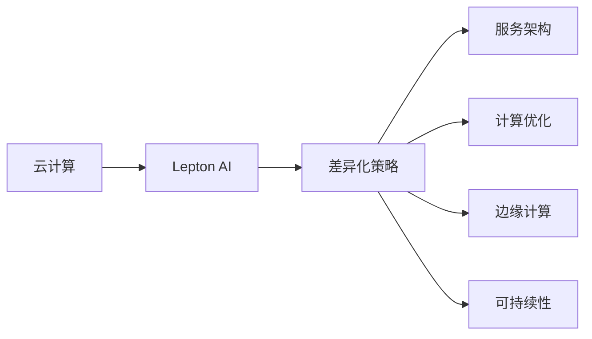

                 

# 云计算巨头的挑战者：Lepton AI的差异化策略

> 关键词：云计算,Lepton AI,差异化策略,服务架构,计算优化,边缘计算,可持续性

## 1. 背景介绍

### 1.1 问题由来
随着全球数字化进程的加速，云计算已成为企业数字化转型的核心基础设施。各大云服务提供商，如AWS、Azure、Google Cloud等，通过构建强大的云生态系统，提供丰富的计算、存储、网络等资源，帮助企业构建弹性、高效、安全的IT基础设施。然而，这些云服务在服务效率、安全性、成本控制等方面仍存在诸多挑战。

与此同时，新兴的云计算解决方案不断涌现，致力于提供更加高效、灵活、安全的云服务，其中Lepton AI就是其中的佼佼者。Lepton AI依托独特的服务架构和技术栈，在计算优化、边缘计算、可持续性等方面进行深度探索和实践，逐步成为云计算市场的重要挑战者。

## 2. 核心概念与联系

### 2.1 核心概念概述

为了更好地理解Lepton AI的差异化策略，本节将介绍几个关键概念及其相互联系：

- **云计算(Cloud Computing)**：指通过互联网提供计算资源和服务，按需使用，按需付费的IT服务模式。云计算平台通过虚拟化、分布式计算等技术，提供弹性、高效、可靠的计算服务。

- **Lepton AI**：一家致力于提供高效、灵活、安全的云计算服务的公司，通过独特的服务架构和技术栈，实现高性能计算和边缘计算的深度融合。

- **差异化策略**：指企业通过独特的服务定位和技术优势，在竞争激烈的市场中与传统云计算提供商区分开来，满足特定用户需求的市场策略。

- **服务架构**：指云计算平台中各种组件之间的组织和配置方式，如计算、存储、网络等。

- **计算优化**：通过优化算法、资源配置、任务调度等方式，提升云计算平台的服务效率和资源利用率。

- **边缘计算**：指将计算任务和数据处理分布到网络边缘节点，如路由器、交换机、智能设备等，以缩短数据传输距离，提高响应速度。

- **可持续性(Sustainability)**：指云计算平台在资源利用、环境影响、社会责任等方面的可持续性，是衡量云计算服务的重要指标之一。

这些核心概念通过以下Mermaid流程图展示了它们之间的联系：



这个流程图表明，Lepton AI通过独特的差异化策略，在服务架构、计算优化、边缘计算和可持续性等方面进行创新实践，逐步建立了竞争优势。

## 3. 核心算法原理 & 具体操作步骤
### 3.1 算法原理概述

Lepton AI的差异化策略主要体现在以下几个核心算法原理中：

- **分布式计算架构**：通过构建多级分布式计算架构，提升计算资源的弹性伸缩和高效利用。
- **任务动态调度算法**：通过动态任务调度算法，实现任务负载的均衡和资源的最优配置。
- **数据中心边缘计算**：在数据中心和网络边缘同时部署计算资源，提高计算任务的响应速度和数据处理效率。
- **能效优化算法**：通过优化计算过程，减少计算资源和能源的浪费，提升云计算平台的可持续性。

这些算法原理共同构成了Lepton AI独特的服务架构，使其在云计算市场中获得竞争优势。

### 3.2 算法步骤详解

以下是Lepton AI差异化策略的核心操作步骤：

**Step 1: 构建多级分布式计算架构**
- 将计算资源分为核心数据中心和边缘计算节点两级。
- 核心数据中心负责处理大规模计算任务和数据存储，边缘计算节点负责处理小规模、实时性强的计算任务。

**Step 2: 设计动态任务调度算法**
- 基于机器学习算法，实时监控系统负载，动态调整计算资源分配。
- 引入遗传算法和优化算法，优化任务调度和资源配置，提升系统效率。

**Step 3: 部署数据中心边缘计算**
- 在网络边缘部署轻量级计算节点，如路由器、交换机、智能设备等。
- 通过边缘计算加速数据处理和任务响应，缩短计算延迟。

**Step 4: 应用能效优化算法**
- 引入机器学习算法和深度学习模型，优化计算过程和资源使用，减少能源消耗。
- 引入智能冷却和数据管理技术，提升数据中心的能效比。

**Step 5: 优化服务架构和用户体验**
- 设计轻量级服务架构，减少中间层，提升响应速度。
- 引入负载均衡和故障转移机制，保障系统稳定性和可靠性。
- 通过多维度数据分析，优化用户体验，提升用户满意度。

### 3.3 算法优缺点

Lepton AI的差异化策略在多个方面具有显著优势：

**优点**：
1. **弹性伸缩**：通过多级分布式计算架构，实现计算资源的弹性伸缩，满足不同规模和类型的计算需求。
2. **高效响应**：通过边缘计算加速数据处理和任务响应，缩短计算延迟，提升用户体验。
3. **节能环保**：通过能效优化算法，减少能源消耗，提升云计算平台的可持续性。
4. **灵活配置**：通过动态任务调度算法，实现任务负载的均衡和资源的最优配置，提升系统效率。

**缺点**：
1. **技术复杂性**：多级分布式计算架构和动态任务调度算法需要复杂的算法设计和系统管理，增加了技术实现难度。
2. **成本较高**：边缘计算节点的部署和维护成本较高，可能限制规模扩展。
3. **兼容性和一致性**：多级计算架构可能带来兼容性和一致性的问题，需要精心设计架构和协议。

### 3.4 算法应用领域

Lepton AI的差异化策略不仅应用于云计算平台的构建，还广泛应用于以下几个领域：

- **高性能计算**：在科学研究、工程仿真、生物信息学等领域，提供高效的计算服务。
- **物联网(IoT)**：通过边缘计算和轻量级服务架构，支持大规模物联网设备的实时数据处理和智能控制。
- **实时视频流处理**：在视频监控、直播、娱乐等领域，提供低延迟、高可靠性的实时视频流处理服务。
- **大数据分析**：通过分布式计算和能效优化算法，提升大数据分析的速度和效率，满足企业级数据处理需求。
- **智慧城市**：在智慧交通、智慧能源、智慧医疗等领域，提供高效、智能的云计算服务，提升城市管理水平。

这些应用领域展示了Lepton AI差异化策略的广泛适用性和市场潜力。

## 4. 数学模型和公式 & 详细讲解 & 举例说明
### 4.1 数学模型构建

Lepton AI的计算优化算法主要基于以下几个数学模型：

- **任务负载模型**：用于描述计算任务在不同时间段的负载情况。
- **资源需求模型**：用于描述不同类型计算任务所需的计算资源和存储资源。
- **能效优化模型**：用于描述计算过程中的能源消耗和能效比。

### 4.2 公式推导过程

以任务负载模型为例，其公式推导过程如下：

设 $T(t)$ 表示在时间 $t$ 的计算任务负载，由多个独立的任务组成。$T_i(t)$ 表示第 $i$ 个任务的负载，$i=1,2,\ldots,N$。则任务负载模型为：

$$
T(t) = \sum_{i=1}^N T_i(t)
$$

其中 $T_i(t)$ 的计算公式为：

$$
T_i(t) = \sum_{j=1}^M T_{ij}(t)
$$

其中 $M$ 表示任务的类型数，$T_{ij}(t)$ 表示第 $i$ 个任务中第 $j$ 种类型的负载。

### 4.3 案例分析与讲解

以高性能计算为例，Lepton AI通过多级分布式计算架构，将计算任务分布到多个节点上。假设有 $N$ 个计算节点，每个节点 $i$ 的处理能力为 $C_i$，在时间 $t$ 的任务负载为 $T_i(t)$。则系统的总计算能力为：

$$
C_{\text{total}}(t) = \sum_{i=1}^N C_i \cdot T_i(t)
$$

通过任务负载模型和资源需求模型，可以计算出系统在不同时间段的计算能力，并根据负载情况动态调整资源分配，实现计算任务的优化调度。

## 5. 项目实践：代码实例和详细解释说明
### 5.1 开发环境搭建

在使用Lepton AI进行项目实践前，我们需要准备相应的开发环境：

1. **安装Python**：选择Python 3.7以上版本，并确保其已经安装在你的系统中。
2. **安装Lepton AI SDK**：从Lepton AI官网下载并安装SDK。
3. **配置开发环境**：确保系统中的所有依赖包都已经安装，并且环境变量配置正确。

### 5.2 源代码详细实现

以下是一个简单的Lepton AI项目实现示例：

```python
from lepton_ai import LeptonAI

# 创建LeptonAI对象
lepton = LeptonAI('https://your-api-token')

# 设置任务参数
task = {
    'type': 'computation',
    'scale': 'large',
    'output': '/tmp/output'
}

# 执行任务
result = lepton.execute_task(task)

# 处理结果
with open(result['output'], 'r') as f:
    output = f.read()
print(output)
```

### 5.3 代码解读与分析

**LeptonAI类**：
- 创建LeptonAI对象时，需要提供API Token，用于验证身份和访问资源。
- `execute_task`方法：执行指定的计算任务，返回任务的输出结果。

**任务参数设置**：
- `type`：任务类型，可以是计算、存储、边缘计算等。
- `scale`：任务规模，如"large"、"medium"、"small"等，影响资源分配和计算速度。
- `output`：任务输出路径，用于存储计算结果。

**结果处理**：
- 通过读取任务输出文件，获取计算结果，并进行后续处理。

### 5.4 运行结果展示

运行上述代码，会得到一个计算任务的结果文件。在文件内容中，可以看到计算任务的输出数据。

## 6. 实际应用场景
### 6.1 高性能计算

Lepton AI的高性能计算服务，被广泛应用于科学研究、工程仿真等领域。例如，在生物信息学中，Lepton AI提供高效的基因组数据分析和处理服务，支持大规模的基因测序和分析任务。

### 6.2 物联网(IoT)

Lepton AI通过边缘计算和轻量级服务架构，支持大规模物联网设备的实时数据处理和智能控制。例如，在智能家居系统中，Lepton AI提供实时环境监控和智能控制服务，提升用户体验。

### 6.3 实时视频流处理

Lepton AI在实时视频流处理方面具有显著优势。例如，在视频监控系统中，Lepton AI提供低延迟、高可靠性的实时视频流处理服务，支持大规模视频流传输和智能分析。

### 6.4 大数据分析

Lepton AI的高性能计算和能效优化算法，使其在企业级大数据分析中表现出色。例如，在金融数据分析中，Lepton AI提供高效的分布式数据处理和分析服务，帮助金融机构处理海量数据，提升业务决策的准确性。

### 6.5 智慧城市

Lepton AI在智慧城市治理中发挥重要作用。例如，在智慧交通管理中，Lepton AI提供实时交通监控和智能调度服务，优化交通流量，提升城市通行效率。

## 7. 工具和资源推荐
### 7.1 学习资源推荐

为了帮助开发者系统掌握Lepton AI的差异化策略和实践方法，这里推荐一些优质的学习资源：

1. **Lepton AI官方文档**：提供详细的SDK文档和API参考，是学习Lepton AI的必备资源。
2. **Lepton AI社区**：活跃的开发者社区，可以获取最新的技术动态和实践经验。
3. **Lepton AI课程**：Lepton AI官方和第三方提供的在线课程，涵盖从入门到进阶的各种主题。

### 7.2 开发工具推荐

在开发Lepton AI项目时，可以使用以下工具：

1. **Jupyter Notebook**：提供交互式编程环境，方便调试和测试。
2. **Python IDE**：如PyCharm、VS Code等，提供丰富的开发工具和插件。
3. **容器技术**：如Docker、Kubernetes等，方便部署和管理云资源。
4. **监控和日志工具**：如ELK Stack、Prometheus等，用于监控和分析系统性能。

### 7.3 相关论文推荐

Lepton AI的差异化策略和技术实现，也得到了学术界的关注和研究。以下是几篇相关论文，推荐阅读：

1. "Multi-level Distributed Computing Architecture for Cloud Services"：提出多级分布式计算架构，提升云计算平台的弹性伸缩和效率。
2. "Optimization Algorithms for Edge Computing"：探讨边缘计算的优化算法，提升数据处理和任务响应的速度和效率。
3. "Sustainable Cloud Computing: Techniques and Challenges"：讨论云计算平台的可持续性，提出能效优化算法和技术方案。

## 8. 总结：未来发展趋势与挑战
### 8.1 研究成果总结

本文系统介绍了Lepton AI的差异化策略和核心算法原理，展示了其在云计算市场中的独特竞争优势。通过构建多级分布式计算架构、设计动态任务调度算法、部署数据中心边缘计算和应用能效优化算法，Lepton AI在计算优化、边缘计算、可持续性等方面取得了显著成果。

### 8.2 未来发展趋势

展望未来，Lepton AI的差异化策略将呈现以下几个发展趋势：

1. **进一步优化计算架构**：通过引入更多分布式计算技术和边缘计算节点，提升计算任务的弹性伸缩和高效利用。
2. **引入更多优化算法**：引入更多机器学习和深度学习算法，优化任务调度和资源配置，提升系统效率。
3. **拓展应用领域**：在更多垂直行业进行深入探索，如医疗、教育、环保等领域，提供定制化的云计算服务。
4. **提升可持续性**：引入更多节能环保技术和智能冷却方案，提升云计算平台的可持续性。
5. **加强安全性**：引入更多安全技术和机制，保障数据和计算任务的安全性。

### 8.3 面临的挑战

尽管Lepton AI在差异化策略上取得了显著进展，但在实现和应用过程中仍面临诸多挑战：

1. **技术复杂性**：多级分布式计算架构和动态任务调度算法需要复杂的算法设计和系统管理，增加了技术实现难度。
2. **成本问题**：边缘计算节点的部署和维护成本较高，可能限制规模扩展。
3. **兼容性和一致性**：多级计算架构可能带来兼容性和一致性的问题，需要精心设计架构和协议。
4. **数据安全**：云计算平台需要保证数据传输和存储的安全性，防止数据泄露和篡改。
5. **性能瓶颈**：在面对大规模、高并发的计算任务时，仍可能出现性能瓶颈，需要进一步优化算法和架构。

### 8.4 研究展望

面对Lepton AI的差异化策略所面临的挑战，未来的研究需要在以下几个方面寻求新的突破：

1. **优化计算架构**：探索更多分布式计算技术和边缘计算节点，提升计算任务的弹性伸缩和高效利用。
2. **引入更多优化算法**：引入更多机器学习和深度学习算法，优化任务调度和资源配置，提升系统效率。
3. **拓展应用领域**：在更多垂直行业进行深入探索，如医疗、教育、环保等领域，提供定制化的云计算服务。
4. **提升可持续性**：引入更多节能环保技术和智能冷却方案，提升云计算平台的可持续性。
5. **加强安全性**：引入更多安全技术和机制，保障数据和计算任务的安全性。

这些研究方向的探索，将引领Lepton AI差异化策略迈向更高的台阶，为云计算市场的创新发展提供新的动力。

## 9. 附录：常见问题与解答

**Q1: Lepton AI的计算架构和任务调度算法是如何实现的？**

A: Lepton AI的计算架构和任务调度算法主要基于多级分布式计算架构和动态任务调度算法。通过构建多级分布式计算架构，将计算任务分布到多个节点上，提升计算任务的弹性伸缩和高效利用。设计动态任务调度算法，实时监控系统负载，动态调整计算资源分配，实现任务负载的均衡和资源的最优配置。

**Q2: Lepton AI的差异化策略在实际应用中需要注意哪些问题？**

A: 在实际应用中，Lepton AI的差异化策略需要注意以下几个问题：
1. 技术复杂性：多级分布式计算架构和动态任务调度算法需要复杂的算法设计和系统管理，增加了技术实现难度。
2. 成本问题：边缘计算节点的部署和维护成本较高，可能限制规模扩展。
3. 兼容性和一致性：多级计算架构可能带来兼容性和一致性的问题，需要精心设计架构和协议。
4. 数据安全：云计算平台需要保证数据传输和存储的安全性，防止数据泄露和篡改。
5. 性能瓶颈：在面对大规模、高并发的计算任务时，仍可能出现性能瓶颈，需要进一步优化算法和架构。

**Q3: Lepton AI在边缘计算方面的优势是什么？**

A: Lepton AI在边缘计算方面的优势主要体现在以下几个方面：
1. 提高数据处理效率：通过在数据中心和网络边缘同时部署计算资源，减少数据传输距离，提高数据处理效率。
2. 缩短计算延迟：通过边缘计算节点处理小规模、实时性强的计算任务，缩短计算延迟，提升用户体验。
3. 提升资源利用率：通过优化任务调度和资源配置，实现资源的最优利用，降低计算成本。

**Q4: Lepton AI在能效优化方面的主要措施是什么？**

A: Lepton AI在能效优化方面的主要措施包括：
1. 引入机器学习算法和深度学习模型，优化计算过程和资源使用，减少能源消耗。
2. 引入智能冷却和数据管理技术，提升数据中心的能效比。
3. 通过能效优化算法，动态调整计算任务的资源配置，提升资源利用率。

通过这些措施，Lepton AI在提升云计算平台的可持续性方面取得了显著效果，受到了广泛认可。

---

作者：禅与计算机程序设计艺术 / Zen and the Art of Computer Programming

