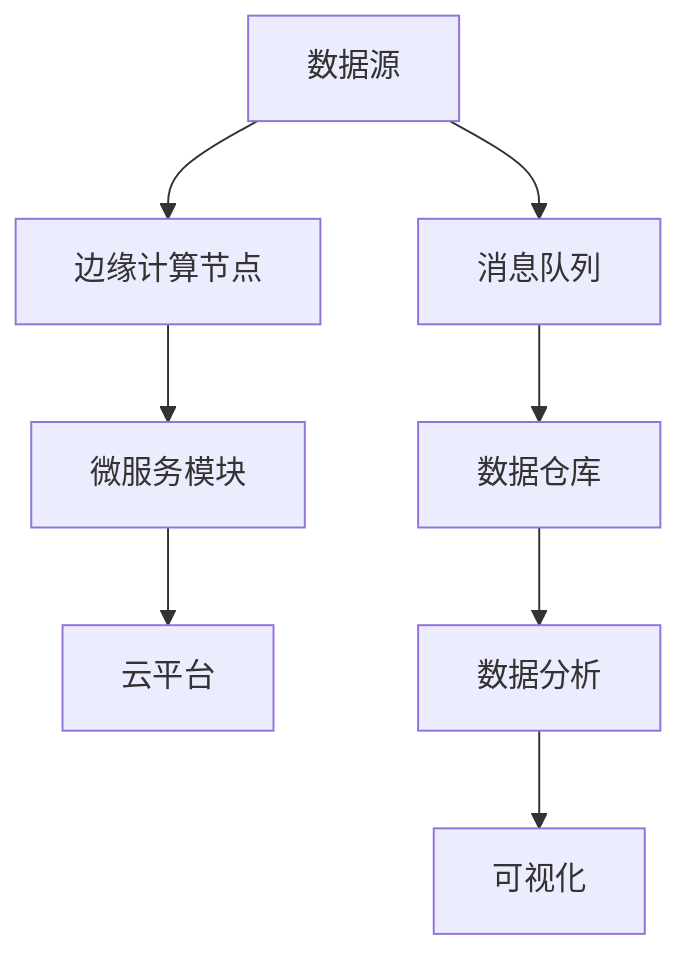

                 

# 云边协同计算：优化分布式AI系统性能

## 1. 背景介绍

### 1.1 问题由来
随着人工智能（AI）技术的迅猛发展，特别是深度学习（Deep Learning, DL）算法的不断进步，分布式AI系统在处理大规模数据和复杂任务方面展现了巨大潜力。然而，传统集中式AI计算模式面临着诸多挑战，如资源限制、网络延迟、数据孤岛等，难以满足实时性和可扩展性要求。为了应对这些挑战，云边协同计算（Cloud-Edge Collaboration）作为一种新兴分布式计算模式，逐渐成为研究热点。

云边协同计算，顾名思义，是将数据、计算和存储资源分散部署在云平台和边缘设备（如IoT设备、手机、嵌入式系统等）上，通过合理分布计算负载，优化系统性能，提升用户体验。云边协同系统具有如下特点：

- **数据就近处理**：边缘设备具备本地处理能力，能够实时响应数据，减轻云平台的计算压力。
- **数据隐私保护**：边缘设备处理原始数据，减少数据传输和存储，增强数据隐私和安全性。
- **降低通信开销**：通过本地数据处理，减少网络传输带宽和延迟，提升系统实时性。
- **适应性强**：边缘设备贴近用户场景，能够灵活应对各类本地计算需求。

本文将深入探讨云边协同计算在分布式AI系统中的应用，通过理论分析和实践案例，展示如何利用云边协同计算优化分布式AI系统性能，提升用户体验。

### 1.2 问题核心关键点
云边协同计算的核心在于将数据处理和计算任务合理分布在云平台和边缘设备上，实现数据处理本地化，减少通信开销，同时利用云平台的高算力和大存储能力，提升边缘设备的数据处理能力。关键问题包括：

- 如何选择合适的计算和数据部署策略，优化计算负载分布。
- 如何设计高效的边缘计算框架，最大化边缘设备的数据处理能力。
- 如何保证云边协同系统的稳定性和可靠性，实现数据一致性和协同计算。
- 如何优化云边协同系统的性能，提升系统实时性和用户体验。

本文将围绕这些问题，系统介绍云边协同计算在分布式AI系统中的原理、算法、实践和应用，以期为读者提供全面的技术指引。

## 2. 核心概念与联系

### 2.1 核心概念概述

为了深入理解云边协同计算的原理和实现，本节将介绍几个关键概念：

- **云边协同计算**：将数据处理和计算任务合理分布在云平台和边缘设备上，实现数据处理本地化，同时利用云平台的高算力和大存储能力，提升边缘设备的数据处理能力。
- **边缘计算**：在靠近数据源的本地设备上处理数据，减少网络传输，提升系统实时性和数据隐私。
- **微服务架构**：通过将系统拆分为多个小型服务模块，实现组件化和灵活部署，提升系统的可扩展性和维护性。
- **消息队列**：在异构计算节点之间传递消息，实现组件间的解耦和协同计算，提升系统的响应速度和可靠性。
- **数据仓库**：集中存储和管理数据，支持数据查询、分析和可视化，提升数据分析效率和系统集成能力。

这些概念构成了云边协同计算的基础架构，通过合理部署和协同计算，可以实现数据处理和计算任务的优化，提升系统性能和用户体验。

### 2.2 核心概念原理和架构的 Mermaid 流程图(Mermaid 流程节点中不要有括号、逗号等特殊字符)



这个Mermaid流程图展示了云边协同计算的基本架构：数据源通过边缘计算节点进行处理，生成微服务模块；微服务模块与云平台协同计算，并通过消息队列进行数据传递和协同；最终数据进入数据仓库，支持数据分析和可视化。

## 3. 核心算法原理 & 具体操作步骤
### 3.1 算法原理概述

云边协同计算的核心算法原理，在于合理分布计算负载，利用边缘设备的本地处理能力，减少网络通信开销，同时利用云平台的高算力和大存储能力，优化系统性能。

假设数据源为 $D$，边缘计算节点为 $E$，云平台为 $C$，微服务模块为 $S$，消息队列为 $M$，数据仓库为 $W$，系统整体架构如图。

设 $D$ 的规模为 $D_s$，$E$ 的处理能力为 $E_c$，$C$ 的算力为 $C_p$，$S$ 的通信开销为 $S_c$，$M$ 的消息传输速率 $M_r$，$W$ 的数据存储容量 $W_s$。系统整体性能优化目标为最小化通信开销 $S_c$ 和计算延迟 $D_c$，即：

$$
\min \left( S_c + D_c \right)
$$

其中，$S_c$ 可以通过减少数据传输量来优化，$D_c$ 可以通过调整计算负载和分布式算法来优化。

### 3.2 算法步骤详解

云边协同计算的算法步骤包括以下几个关键环节：

**Step 1: 数据分片与分配**
- 将数据源 $D$ 分成若干数据片 $D_p$，每个数据片的大小为 $D_p_s$。
- 根据边缘计算节点 $E$ 的计算能力 $E_c$ 和数据片大小 $D_p_s$，计算每个数据片的处理时间 $D_p_t$。
- 将数据片分配到边缘计算节点和云平台，使得每个节点和平台的负载均衡。

**Step 2: 边缘计算**
- 边缘计算节点对分配到的数据片进行处理，生成中间结果 $R_e$。
- 中间结果 $R_e$ 以最优方式存储在本地设备，减少数据传输量。

**Step 3: 微服务协同**
- 将中间结果 $R_e$ 传递到微服务模块 $S$ 进行进一步处理，生成最终结果 $R_s$。
- 微服务模块可以并行处理多个数据片，利用云平台的计算能力加速处理。

**Step 4: 云边协同**
- 微服务模块将最终结果 $R_s$ 传递到云平台，进行数据汇总和聚合。
- 云平台对汇总结果进行高性能计算和分析，得到最终输出 $R_c$。

**Step 5: 结果存储与可视化**
- 将最终输出 $R_c$ 存储到数据仓库 $W$，支持数据分析和可视化。
- 根据用户需求，从数据仓库中读取数据，展示给用户。

### 3.3 算法优缺点

云边协同计算的优点包括：

- **负载均衡**：通过合理分配数据处理任务，实现计算负载的均衡分布，提升系统性能。
- **实时响应**：边缘计算节点处理原始数据，减少网络传输和存储，提升系统实时性。
- **资源共享**：云平台提供高算力和存储能力，为边缘设备提供强大的计算支持。
- **数据隐私保护**：边缘设备处理本地数据，减少数据泄露风险，增强数据安全性。

缺点包括：

- **通信开销**：数据在不同节点之间的传输可能产生较大的通信开销，需要优化通信策略。
- **数据一致性**：边缘计算节点和云平台的数据一致性需要保证，否则可能影响系统输出结果。
- **系统复杂度**：系统设计和实现较为复杂，需要综合考虑计算负载、数据分布、通信开销等多个因素。

### 3.4 算法应用领域

云边协同计算在多个领域都有广泛应用，例如：

- **智能制造**：通过边缘计算节点实时处理传感器数据，支持工业设备监控和故障诊断，提升生产效率。
- **智慧城市**：将交通、环保等数据在边缘设备上处理，实时反馈城市运行状态，提升城市治理水平。
- **物联网（IoT）**：通过边缘计算节点处理设备传感器数据，减少数据传输，提升设备响应速度。
- **金融服务**：利用边缘计算节点处理交易数据，减少网络延迟，提升交易处理速度。
- **医疗健康**：将患者数据在边缘设备上处理，实时监控健康状态，提升医疗服务质量。

## 4. 数学模型和公式 & 详细讲解 & 举例说明

### 4.1 数学模型构建

设数据源 $D$ 的规模为 $D_s$，边缘计算节点 $E$ 的计算能力为 $E_c$，云平台 $C$ 的算力为 $C_p$，微服务模块 $S$ 的通信开销为 $S_c$，消息队列 $M$ 的消息传输速率 $M_r$，数据仓库 $W$ 的数据存储容量 $W_s$。

系统整体性能优化目标为最小化通信开销 $S_c$ 和计算延迟 $D_c$，即：

$$
\min \left( S_c + D_c \right)
$$

其中，$S_c$ 可以通过减少数据传输量来优化，$D_c$ 可以通过调整计算负载和分布式算法来优化。

### 4.2 公式推导过程

在数据分片与分配阶段，假设将数据源 $D$ 均分为 $k$ 个数据片 $D_p$，每个数据片大小为 $D_p_s = \frac{D_s}{k}$。假设边缘计算节点 $E$ 处理每个数据片所需时间为 $D_p_t = \frac{D_p_s}{E_c}$。

在边缘计算阶段，边缘计算节点对 $k$ 个数据片进行处理，生成 $k$ 个中间结果 $R_e$。假设每个中间结果的通信开销为 $S_e$，总通信开销为 $S_e \times k$。

在微服务协同阶段，假设每个中间结果 $R_e$ 在微服务模块 $S$ 上进行并行处理，总处理时间为 $T_s = \frac{k \times D_p_t}{C_p}$。

在云边协同阶段，假设每个中间结果 $R_e$ 在云平台 $C$ 上进行进一步处理，总处理时间为 $T_c = \frac{k \times D_p_t}{C_p}$。

最终，系统整体性能优化目标可以表示为：

$$
\min \left( S_e \times k + T_s + T_c \right)
$$

### 4.3 案例分析与讲解

假设数据源 $D$ 的规模为 $10GB$，边缘计算节点 $E$ 的处理能力为 $1GB/s$，云平台 $C$ 的算力为 $100GB/s$，微服务模块 $S$ 的通信开销为 $0.1GB/s$，消息队列 $M$ 的消息传输速率 $1GB/s$，数据仓库 $W$ 的数据存储容量为 $100GB$。

**Step 1: 数据分片与分配**

- 将 $10GB$ 的数据均分为 $10$ 个数据片，每个数据片大小为 $1GB$。
- 每个数据片处理时间为 $1GB/1GB/s = 1s$。
- 分配给边缘计算节点 $E$ 和云平台 $C$ 的负载均衡。

**Step 2: 边缘计算**

- 边缘计算节点处理 $1GB$ 的数据片，生成 $1GB$ 的中间结果。
- 每个中间结果的通信开销为 $0.1GB \times 10 = 1GB$。

**Step 3: 微服务协同**

- 微服务模块并行处理 $10$ 个中间结果，总处理时间为 $\frac{1s \times 10}{100GB/s} = 0.01s$。

**Step 4: 云边协同**

- 云平台对 $10$ 个中间结果进行进一步处理，总处理时间为 $0.01s$。

**Step 5: 结果存储与可视化**

- 将最终输出存储到 $100GB$ 的数据仓库，支持数据分析和可视化。

最终，系统整体性能优化目标为：

$$
\min \left( 1GB + 0.01s + 0.01s \right) = 1.02s
$$

通过合理的计算负载分配和分布式算法，系统整体性能得到显著提升。

## 5. 项目实践：代码实例和详细解释说明
### 5.1 开发环境搭建

在进行云边协同计算实践前，我们需要准备好开发环境。以下是使用Python进行Kubernetes集群的开发环境配置流程：

1. 安装Docker：从官网下载并安装Docker，用于构建和运行容器化应用。

2. 安装Kubernetes：从官网下载并安装Kubernetes集群，包括Master和Node节点。

3. 配置Kubernetes环境：设置Kubernetes的访问权限、网络配置、存储配置等。

4. 安装相关工具包：
```bash
pip install kubernetes kubeflow-operator
```

完成上述步骤后，即可在Kubernetes集群环境中开始云边协同计算的实践。

### 5.2 源代码详细实现

下面以智能制造中的设备监控为例，给出使用Kubernetes实现云边协同计算的PyTorch代码实现。

首先，定义设备监控任务的数据处理函数：

```python
from kubeflow_operator import KubeFlowOperator

def process_data(data, model, tokenizer):
    # 对原始数据进行预处理
    processed_data = tokenizer(data)
    
    # 加载模型并进行推理
    model.eval()
    with torch.no_grad():
        output = model(processed_data)
    
    # 处理推理结果，生成中间结果
    intermediate_result = postprocess(output)
    
    return intermediate_result
```

然后，定义边缘计算节点的Kubernetes任务：

```python
def edge_function(data):
    # 调用数据处理函数
    result = process_data(data, model, tokenizer)
    
    # 将中间结果存储到本地设备
    local_storage(result)
    
    return result
```

接着，定义微服务模块的Kubernetes任务：

```python
def service_function(result):
    # 调用微服务模块进行进一步处理
    final_result = service(result)
    
    # 将最终结果存储到云平台
    cloud_storage(final_result)
    
    return final_result
```

最后，启动Kubernetes集群，部署边缘计算节点和微服务模块，进行云边协同计算：

```python
# 部署边缘计算节点
kubeflow.operator.KubeFlowOperator(
    api_version="k8s",
    component="edge_function",
    node_name="edge_node",
    arguments=["data"],
    outputs=["intermediate_result"],
)

# 部署微服务模块
kubeflow.operator.KubeFlowOperator(
    api_version="k8s",
    component="service_function",
    node_name="service_node",
    arguments=["intermediate_result"],
    outputs=["final_result"],
)
```

以上就是使用Kubernetes实现云边协同计算的完整代码实现。可以看到，Kubernetes通过容器化技术，使得微服务模块和边缘计算节点的部署和管理变得更加灵活和可扩展。

### 5.3 代码解读与分析

让我们再详细解读一下关键代码的实现细节：

**process_data函数**：
- 对原始数据进行预处理，包括分词、编码等。
- 加载模型并进行推理，得到中间结果。
- 对中间结果进行处理，生成最终输出。

**edge_function函数**：
- 调用process_data函数，对本地数据进行处理。
- 将中间结果存储到本地设备，减少数据传输量。

**service_function函数**：
- 调用微服务模块进行进一步处理，生成最终结果。
- 将最终结果存储到云平台，支持数据分析和可视化。

**KubeFlowOperator**：
- 定义了Kubernetes集群中各个组件的部署方式，包括边缘计算节点和微服务模块。
- 设置组件的API版本、组件名称、节点名称、输入参数、输出参数等。
- 通过KubeFlowOperator，自动创建和部署容器化任务，实现组件化管理和可扩展性。

可以看到，Kubernetes通过容器化技术和KubeFlowOperator，使得云边协同计算的实现变得更加简单和高效。开发者只需关注核心业务逻辑，即可快速构建和部署云边协同系统。

## 6. 实际应用场景
### 6.1 智能制造

在智能制造领域，云边协同计算可以实时处理传感器数据，支持设备监控和故障诊断，提升生产效率。

具体而言，可以在生产设备上安装传感器，采集设备的运行数据，如温度、振动、压力等。通过边缘计算节点对这些原始数据进行预处理和特征提取，生成中间结果。然后，将中间结果传递到微服务模块进行深度学习推理，生成设备运行状态和故障预测结果。最后，将结果存储到云平台，支持数据分析和可视化，帮助工程师实时监控设备状态，及时发现和处理异常。

### 6.2 智慧城市

智慧城市通过云边协同计算，将交通、环保等数据在边缘设备上处理，实时反馈城市运行状态，提升城市治理水平。

具体而言，在城市中的各种设备上安装传感器，采集交通流量、空气质量、噪音水平等数据。通过边缘计算节点对这些数据进行处理和分析，生成中间结果。然后，将中间结果传递到微服务模块进行进一步处理，生成城市运行状态报告。最后，将结果存储到云平台，支持数据分析和可视化，帮助城市管理者实时掌握城市运行状况，及时调整和优化城市资源配置。

### 6.3 物联网（IoT）

IoT设备通过云边协同计算，实时处理传感器数据，减少网络延迟，提升设备响应速度。

具体而言，IoT设备采集环境、人体、设备等各种数据，通过边缘计算节点进行处理和分析，生成中间结果。然后，将中间结果传递到微服务模块进行深度学习推理，生成设备状态和用户行为预测结果。最后，将结果存储到云平台，支持数据分析和可视化，帮助用户和设备管理员实时掌握设备状态和用户行为，优化设备性能和用户体验。

### 6.4 金融服务

金融服务通过云边协同计算，利用边缘计算节点处理交易数据，减少网络延迟，提升交易处理速度。

具体而言，金融交易系统采集各种交易数据，通过边缘计算节点进行处理和分析，生成中间结果。然后，将中间结果传递到微服务模块进行深度学习推理，生成交易预测和风险评估结果。最后，将结果存储到云平台，支持数据分析和可视化，帮助金融机构实时监控交易状态，及时发现和处理异常，提升交易处理速度和安全性。

### 6.5 医疗健康

医疗健康通过云边协同计算，将患者数据在边缘设备上处理，实时监控健康状态，提升医疗服务质量。

具体而言，在患者佩戴的医疗设备上采集各种健康数据，如心率、血压、血糖等。通过边缘计算节点对这些数据进行处理和分析，生成中间结果。然后，将中间结果传递到微服务模块进行深度学习推理，生成健康状态和预警结果。最后，将结果存储到云平台，支持数据分析和可视化，帮助医生实时掌握患者健康状况，及时调整治疗方案，提升医疗服务质量。

## 7. 工具和资源推荐
### 7.1 学习资源推荐

为了帮助开发者系统掌握云边协同计算的理论基础和实践技巧，这里推荐一些优质的学习资源：

1. **Kubernetes官方文档**：Kubernetes官方文档提供了详细的教程和API参考，帮助你快速上手Kubernetes集群管理和部署。

2. **TensorFlow官方文档**：TensorFlow官方文档提供了丰富的深度学习模型和工具，支持Kubernetes集群中的模型训练和推理。

3. **KubeFlow官方文档**：KubeFlow官方文档提供了丰富的Kubernetes应用和组件，支持云边协同计算和微服务部署。

4. **HuggingFace官方文档**：HuggingFace官方文档提供了丰富的自然语言处理模型和工具，支持云边协同计算和微服务部署。

5. **深度学习框架教程**：通过《深度学习框架教程》等书籍，可以全面了解深度学习框架和工具的使用，支持云边协同计算和微服务部署。

通过对这些资源的学习实践，相信你一定能够快速掌握云边协同计算的理论基础和实践技巧，并用于解决实际的NLP问题。

### 7.2 开发工具推荐

高效的开发离不开优秀的工具支持。以下是几款用于云边协同计算开发的常用工具：

1. **Kubernetes**：谷歌开源的容器编排平台，支持集群管理和容器部署，是云边协同计算的核心工具。

2. **TensorFlow**：谷歌开源的深度学习框架，支持模型训练和推理，是云边协同计算的主要计算平台。

3. **HuggingFace**：深度学习模型库，支持自然语言处理模型的训练和推理，是云边协同计算的主要数据处理平台。

4. **KubeFlow**：谷歌开源的Kubernetes应用框架，支持云边协同计算和微服务部署，是云边协同计算的主要应用平台。

5. **Jupyter Notebook**：基于Web的交互式计算平台，支持数据可视化、模型训练和推理，是云边协同计算的主要开发平台。

合理利用这些工具，可以显著提升云边协同计算的开发效率，加快创新迭代的步伐。

### 7.3 相关论文推荐

云边协同计算是当前深度学习和分布式计算研究的前沿方向，以下是几篇奠基性的相关论文，推荐阅读：

1. **Cloud-Edge Collaboration for IoT Data Processing**：提出基于云边协同计算的IoT数据处理方案，展示如何利用边缘计算和云平台提高数据处理效率和安全性。

2. **Edge Computing: A New Paradigm for Smart City**：提出基于云边协同计算的智慧城市解决方案，展示如何利用边缘计算和云平台提升城市治理水平。

3. **Federated Learning in Edge Cloud**：提出基于云边协同计算的联邦学习框架，展示如何利用边缘计算和云平台提高模型训练效率和数据隐私保护。

4. **Cloud-Edge Collaboration for Real-time Health Monitoring**：提出基于云边协同计算的实时健康监测系统，展示如何利用边缘计算和云平台提升健康监测效率和数据分析能力。

5. **Optimization of Edge Computing in IoT**：提出基于云边协同计算的IoT优化方案，展示如何利用边缘计算和云平台提高IoT设备响应速度和数据处理效率。

这些论文代表了大语言模型微调技术的发展脉络。通过学习这些前沿成果，可以帮助研究者把握学科前进方向，激发更多的创新灵感。

## 8. 总结：未来发展趋势与挑战

### 8.1 总结

本文对云边协同计算在分布式AI系统中的应用进行了全面系统的介绍。首先阐述了云边协同计算的背景和意义，明确了其在分布式AI系统中的重要性。其次，从原理到实践，详细讲解了云边协同计算的数学模型、算法步骤和关键优化策略，给出了云边协同计算的完整代码实现。同时，本文还广泛探讨了云边协同计算在智能制造、智慧城市、物联网、金融服务、医疗健康等多个行业领域的应用前景，展示了云边协同计算的广阔应用空间。此外，本文精选了云边协同计算的学习资源、开发工具和相关论文，力求为读者提供全面的技术指引。

通过本文的系统梳理，可以看到，云边协同计算正在成为分布式AI系统的重要范式，极大地拓展了分布式计算的应用边界，提升了系统性能和用户体验。未来，伴随深度学习算法和微服务架构的不断发展，云边协同计算必将在更广阔的应用领域发挥作用，深刻影响人工智能技术的发展方向。

### 8.2 未来发展趋势

展望未来，云边协同计算的发展趋势包括：

1. **更高效的边缘计算技术**：未来的边缘计算设备将具备更高的计算能力和更强的数据处理能力，进一步提升边缘计算节点的本地处理能力。

2. **更智能的微服务架构**：未来的微服务模块将具备更强的智能推理和自主学习能力，能够根据环境变化动态调整模型参数，提升系统的自适应性和灵活性。

3. **更强大的云计算平台**：未来的云平台将提供更强大的算力和存储能力，支持更大规模的数据处理和更复杂的任务。

4. **更高效的数据通信协议**：未来的数据传输协议将更加高效，支持更高的传输速率和更低的延迟，提升系统的实时性。

5. **更完善的分布式算法**：未来的分布式算法将更加高效和可扩展，支持更复杂的计算任务和更广泛的数据分布。

6. **更广泛的应用场景**：未来的云边协同计算将在更多领域得到应用，如工业制造、智慧城市、智能家居等，提升各行业的信息化和智能化水平。

以上趋势凸显了云边协同计算的广阔前景，这些方向的探索发展，必将进一步提升分布式AI系统的性能和用户体验。

### 8.3 面临的挑战

尽管云边协同计算已经取得了瞩目成就，但在迈向更加智能化、普适化应用的过程中，它仍面临着诸多挑战：

1. **资源管理**：如何合理分配和调度资源，优化计算负载，提升系统的性能和效率。

2. **数据一致性**：如何在不同节点之间保持数据一致性，避免数据丢失和错误。

3. **系统复杂性**：云边协同计算系统设计和实现较为复杂，需要综合考虑计算负载、数据分布、通信开销等多个因素。

4. **安全性和隐私保护**：如何在保证系统安全性的同时，保护用户数据隐私，防止数据泄露和攻击。

5. **实时性和可靠性**：如何保证系统的实时性和可靠性，提高系统的响应速度和可用性。

6. **成本和效率**：如何在保证系统性能的同时，降低系统成本，提高资源利用率。

7. **标准化和互操作性**：如何实现系统组件的标准化和互操作性，支持跨平台和跨系统的协同工作。

正视云边协同计算面临的这些挑战，积极应对并寻求突破，将使云边协同计算技术走向成熟的必由之路。相信随着学界和产业界的共同努力，这些挑战终将一一被克服，云边协同计算必将在构建人机协同的智能时代中扮演越来越重要的角色。

### 8.4 研究展望

面向未来，云边协同计算的研究方向包括：

1. **自适应计算负载分配**：通过自适应算法，根据任务需求动态调整计算负载分配，优化资源利用率。

2. **分布式机器学习**：利用云边协同计算支持分布式机器学习，提升模型训练效率和效果。

3. **联邦学习**：通过联邦学习技术，在保护数据隐私的前提下，支持边缘设备和云平台之间的数据共享和协同训练。

4. **边缘智能**：通过在边缘设备上部署智能算法，提升边缘计算节点的本地处理能力和自主学习能力。

5. **多模态数据融合**：支持多模态数据的融合处理，提升系统的综合感知能力和决策能力。

6. **边缘设备优化**：通过优化边缘计算设备的设计和制造，提升边缘设备的计算能力和能效比。

7. **智能监控与预测**：通过智能监控和预测技术，提高系统的稳定性和可靠性，减少故障率和维护成本。

这些研究方向将进一步拓展云边协同计算的应用场景和技术深度，推动人工智能技术的全面普及和智能化发展。

## 9. 附录：常见问题与解答

**Q1：云边协同计算如何保证数据一致性？**

A: 云边协同计算中，数据一致性可以通过以下方法保证：

1. **事务管理**：利用数据库的事务管理机制，保证数据操作的原子性和一致性。

2. **版本控制**：在数据仓库中设置数据版本，记录每次修改的操作日志，保证数据的一致性和可追溯性。

3. **分布式锁**：在多个节点之间设置分布式锁，保证数据操作的互斥性和一致性。

4. **状态同步**：通过消息队列或分布式缓存，同步不同节点之间的状态数据，保证数据的一致性。

5. **冗余备份**：在关键节点之间设置冗余备份，防止单点故障导致数据丢失。

这些方法可以结合使用，确保云边协同计算中数据的一致性和可靠性。

**Q2：云边协同计算如何提升系统性能？**

A: 云边协同计算可以通过以下方法提升系统性能：

1. **负载均衡**：合理分配计算负载，优化资源利用率，提升系统性能。

2. **缓存机制**：在边缘计算节点和云平台之间设置缓存，减少重复计算，提升系统响应速度。

3. **多级数据存储**：将数据分布在不同级别存储设备上，提升数据的访问速度和存储效率。

4. **分布式算法**：利用分布式算法优化计算任务，提升系统性能和扩展性。

5. **自适应计算**：根据系统负载和环境变化，动态调整计算负载和资源分配，提升系统的实时性和可扩展性。

6. **边缘智能**：在边缘计算节点上部署智能算法，提升本地处理能力和决策能力。

通过合理设计和优化这些方法，可以显著提升云边协同计算的性能和用户体验。

**Q3：云边协同计算如何保证系统安全性？**

A: 云边协同计算中，系统安全性可以通过以下方法保证：

1. **数据加密**：在数据传输和存储过程中，采用加密技术，保护数据隐私和安全。

2. **身份认证**：在各个组件之间设置身份认证机制，防止未经授权的访问和操作。

3. **访问控制**：根据用户权限，限制不同用户对系统的访问和操作权限。

4. **审计日志**：记录系统的访问和操作日志，定期审计和监控，防止异常行为和攻击。

5. **异常检测**：利用异常检测技术，及时发现和处理系统异常行为，防止系统被攻击。

6. **安全加固**：对系统组件进行安全加固，防止代码漏洞和安全漏洞。

这些方法可以结合使用，确保云边协同计算系统的安全性和可靠性。

**Q4：云边协同计算如何降低系统成本？**

A: 云边协同计算可以通过以下方法降低系统成本：

1. **资源共享**：通过资源共享，避免重复建设和资源浪费，提升资源利用率。

2. **自适应计算**：根据任务需求和环境变化，动态调整计算负载和资源分配，减少资源消耗。

3. **边缘计算**：在边缘设备上处理本地数据，减少网络传输和存储，降低系统成本。

4. **低延迟算法**：利用低延迟算法，优化数据传输和处理，提升系统效率，减少资源消耗。

5. **成本优化**：通过优化计算任务和算法，降低系统运行成本，提高资源利用率。

通过合理设计和优化这些方法，可以显著降低云边协同计算系统的成本，提升系统性价比。

**Q5：云边协同计算如何提升系统实时性？**

A: 云边协同计算可以通过以下方法提升系统实时性：

1. **缓存机制**：在边缘计算节点和云平台之间设置缓存，减少重复计算，提升系统响应速度。

2. **多级数据存储**：将数据分布在不同级别存储设备上，提升数据的访问速度和存储效率。

3. **分布式算法**：利用分布式算法优化计算任务，提升系统性能和扩展性。

4. **自适应计算**：根据系统负载和环境变化，动态调整计算负载和资源分配，提升系统的实时性和可扩展性。

5. **边缘智能**：在边缘计算节点上部署智能算法，提升本地处理能力和决策能力。

通过合理设计和优化这些方法，可以显著提升云边协同计算的实时性和用户体验。

作者：禅与计算机程序设计艺术 / Zen and the Art of Computer Programming

