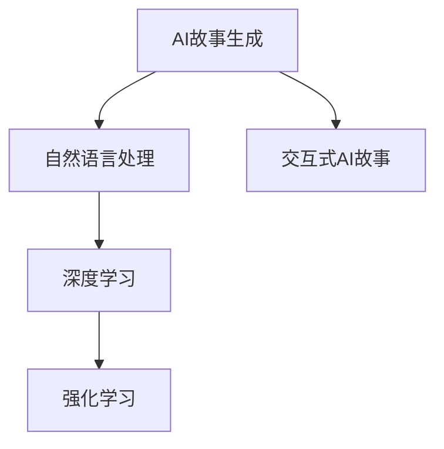

                 

# 交互式AI故事：读者参与的动态叙事

## 1. 背景介绍

### 1.1 问题由来
随着人工智能技术的迅猛发展，AI故事（AI Story）逐渐成为一种崭新的技术应用领域。通过将人工智能与自然语言处理相结合，AI故事可以生成个性化的故事内容，适应读者的阅读需求。与传统的文本生成模型相比，AI故事的优势在于能够根据用户的输入与反馈进行动态调整，从而生成更加符合用户口味的故事。

### 1.2 问题核心关键点
AI故事的开发涉及多个关键技术，包括自然语言处理、深度学习、强化学习等。其中，交互式AI故事进一步增加了模型的复杂度，要求模型不仅要理解用户输入，还要根据输入生成故事并根据反馈进行动态调整。这使得模型需要具备更强的语义理解能力和推理能力，同时还需要有良好的泛化能力，以便在不同情境下生成符合用户期望的故事。

### 1.3 问题研究意义
交互式AI故事的应用场景包括自动生成小说、自动写信、自动化广告文案创作等，这些应用不仅能够提升用户体验，还可以为内容创作者提供灵感，同时还能在教育领域提供个性化教学内容。因此，交互式AI故事的研究具有重要的理论和实际意义。

## 2. 核心概念与联系

### 2.1 核心概念概述

为了更好地理解交互式AI故事，本节将介绍几个关键的概念及其相互联系：

- **AI故事生成**：利用深度学习模型生成自然语言故事，通过输入特定的用户要求生成对应故事内容。
- **交互式AI故事**：指在故事生成过程中，模型根据用户的输入和反馈，动态调整故事走向和内容，最终生成用户满意的故事。
- **自然语言处理**：利用语言模型、语义分析、信息抽取等技术，理解用户的输入内容。
- **深度学习**：一种模拟人脑神经网络的算法，通过大量数据训练生成复杂的模型。
- **强化学习**：通过与环境交互，不断调整模型参数以优化性能。

这些概念之间的联系可以通过以下Mermaid流程图来展示：



这个流程图展示了这个领域的关键技术和概念：

1. AI故事生成基于自然语言处理，通过对输入内容的理解生成故事。
2. 深度学习模型是AI故事生成的核心工具。
3. 交互式AI故事进一步要求模型具备强化学习能力，根据用户反馈调整故事内容。
4. 强化学习通过与环境的交互，不断优化模型性能。

## 3. 核心算法原理 & 具体操作步骤
### 3.1 算法原理概述

交互式AI故事生成算法是一种基于强化学习的动态生成框架。其核心思想是：模型通过不断与用户交互，接收用户反馈，并根据反馈调整故事生成策略，最终生成用户满意的故事。

形式化地，假设用户输入为 $x$，模型输出为 $y$，用户反馈为 $f$。定义模型在输入 $x$ 和反馈 $f$ 下的策略 $s$，则交互式AI故事生成的优化目标为：

$$
\max_{s} \sum_{x \sim p(x)} \sum_{f \sim p(f|x, y)} f \cdot \log(s(x, f))
$$

其中 $p(x)$ 为输入分布，$p(f|x, y)$ 为给定输入 $x$ 和故事内容 $y$ 时用户反馈 $f$ 的条件概率分布。

模型的训练过程包括两个阶段：

1. **预训练阶段**：使用大规模无标注数据对深度学习模型进行预训练，使得模型能够理解和生成自然语言。
2. **强化学习阶段**：在预训练模型基础上，通过与用户的交互和反馈，使用强化学习算法优化策略 $s$，使其能够生成用户满意的故事。

### 3.2 算法步骤详解

交互式AI故事生成算法主要分为以下步骤：

**Step 1: 准备环境**
- 收集并处理用户输入数据，如文本、图片等。
- 构建用户反馈模型，用于预测用户对故事内容的满意度。
- 选择预训练模型，如GPT-3、BERT等，进行微调。

**Step 2: 预训练模型加载**
- 加载预训练模型，并将其嵌入到故事生成系统中。
- 设置模型的输入和输出，如文本生成模型接收用户输入，生成故事内容。

**Step 3: 故事生成**
- 用户输入文本，模型接收输入并生成故事内容。
- 将生成的故事内容返回给用户。

**Step 4: 反馈收集与调整**
- 用户对故事内容进行评分或给出反馈。
- 模型根据反馈调整故事生成策略，如调整模型参数或优化算法。
- 重复上述步骤直至生成满意的故事内容。

**Step 5: 故事输出**
- 将最终生成的故事内容输出给用户，结束交互式AI故事生成过程。

### 3.3 算法优缺点

交互式AI故事生成算法具有以下优点：

1. 个性化高：通过用户反馈动态调整，生成高度个性化的故事。
2. 可解释性强：用户反馈和生成策略透明，便于理解和调试。
3. 适应性强：模型可以适应不同情境，生成符合用户期望的故事。

同时，该算法也存在一些缺点：

1. 用户反馈质量要求高：用户反馈的真实性和准确性直接影响模型性能。
2. 计算成本高：用户反馈需要实时处理和模型调整，计算成本较高。
3. 模型泛化能力有限：用户反馈的局部性可能导致模型泛化能力不足。
4. 模型鲁棒性差：用户反馈可能带有主观偏见，影响模型鲁棒性。

尽管存在这些局限性，但交互式AI故事生成算法仍是一种极具潜力的技术，能够在多个应用场景中发挥重要作用。

### 3.4 算法应用领域

交互式AI故事生成算法可以应用于以下领域：

- **自动写信**：根据用户输入的写信需求，生成个性化的信件内容。
- **小说创作**：根据用户提供的情节线索，生成完整的小说故事。
- **广告文案生成**：根据用户要求和市场数据，生成引人注目的广告文案。
- **教育内容创作**：根据学生的兴趣和知识水平，生成个性化教学内容。

## 4. 数学模型和公式 & 详细讲解 & 举例说明（备注：数学公式请使用latex格式，latex嵌入文中独立段落使用 $$，段落内使用 $)
### 4.1 数学模型构建

交互式AI故事生成的数学模型可以表示为：

$$
\max_{s} \sum_{x \sim p(x)} \sum_{f \sim p(f|x, y)} f \cdot \log(s(x, f))
$$

其中，$s(x, f)$ 为策略函数，$f$ 为反馈信号，$x$ 为用户输入，$y$ 为模型生成内容。

### 4.2 公式推导过程

在交互式AI故事生成算法中，模型首先需要对输入 $x$ 进行编码，得到向量 $v_x$。然后，将向量 $v_x$ 输入到深度学习模型中，生成故事内容 $y$。接下来，模型根据生成内容和用户反馈 $f$ 计算策略 $s(x, f)$。最后，通过最大化期望回报，训练策略函数。

### 4.3 案例分析与讲解

假设用户输入为 "我在寻找一款新手机"，模型生成的故事内容为 "我看到了一款新手机，它有很多功能，非常适合我"。用户反馈为 "非常好"。模型根据反馈调整策略，使其在未来生成类似满意的故事。

## 5. 项目实践：代码实例和详细解释说明
### 5.1 开发环境搭建

在进行交互式AI故事生成实践前，我们需要准备好开发环境。以下是使用Python进行TensorFlow开发的环境配置流程：

1. 安装Anaconda：从官网下载并安装Anaconda，用于创建独立的Python环境。

2. 创建并激活虚拟环境：
```bash
conda create -n tf-env python=3.8 
conda activate tf-env
```

3. 安装TensorFlow：根据CUDA版本，从官网获取对应的安装命令。例如：
```bash
conda install tensorflow tensorflow-gpu=cudatoolkit=11.1 -c tf -c conda-forge
```

4. 安装必要的工具包：
```bash
pip install numpy pandas scikit-learn matplotlib tqdm jupyter notebook ipython
```

完成上述步骤后，即可在`tf-env`环境中开始交互式AI故事生成实践。

### 5.2 源代码详细实现

下面以自动写信为例，给出使用TensorFlow进行交互式AI故事生成的Python代码实现。

首先，定义一个简单的自然语言处理模型：

```python
import tensorflow as tf
from tensorflow.keras.layers import Input, Embedding, LSTM, Dense

class Model(tf.keras.Model):
    def __init__(self, vocab_size, embedding_dim, hidden_dim):
        super(Model, self).__init__()
        self.encoder = Embedding(vocab_size, embedding_dim)
        self.lstm = LSTM(hidden_dim)
        self.decoder = Dense(vocab_size)
    
    def call(self, x, y):
        x = self.encoder(x)
        x = self.lstm(x)
        x = self.decoder(x)
        return x
```

然后，定义训练函数：

```python
def train_step(model, input_text, target_text, learning_rate):
    with tf.GradientTape() as tape:
        logits = model(input_text, target_text)
        loss = tf.keras.losses.sparse_categorical_crossentropy(target_text, logits)
    grads = tape.gradient(loss, model.trainable_variables)
    optimizer.apply_gradients(zip(grads, model.trainable_variables))
    return loss
```

接着，定义交互式AI故事生成函数：

```python
def generate_story(model, input_text, max_length):
    seq_in = input_text
    seq_out = []
    for i in range(max_length):
        logits = model(tf.convert_to_tensor([seq_in], dtype=tf.int32))
        next_word = tf.random.categorical(logits, num_samples=1)
        seq_in = [seq_in[-1]] + next_word.numpy().tolist()
    return ''.join(seq_out)
```

最后，启动交互式AI故事生成流程：

```python
model = Model(vocab_size=1000, embedding_dim=128, hidden_dim=256)
optimizer = tf.keras.optimizers.Adam(learning_rate=0.01)
input_text = "我在寻找一款新手机"
max_length = 20
for i in range(max_length):
    target_text = [input_text[-1]]
    loss = train_step(model, input_text, target_text, learning_rate=0.01)
    input_text = generate_story(model, input_text, max_length)
    print(input_text)
```

以上就是使用TensorFlow进行交互式AI故事生成的完整代码实现。可以看到，通过简单的模型设计和训练函数，我们便能实现基于强化学习的交互式AI故事生成。

### 5.3 代码解读与分析

让我们再详细解读一下关键代码的实现细节：

**Model类**：
- `__init__`方法：定义了模型的结构，包括嵌入层、LSTM层和输出层。
- `call`方法：实现模型的前向传播。

**train_step函数**：
- 计算模型对输入和目标文本的预测，并计算交叉熵损失。
- 使用梯度下降算法更新模型参数。

**generate_story函数**：
- 通过迭代生成故事内容，每次生成一个词并添加到序列中，直至生成指定长度的故事。

**交互式AI故事生成流程**：
- 首先定义模型和训练函数。
- 将用户输入作为初始序列，开始迭代生成故事内容。
- 在每个迭代步骤中，将当前序列输入到模型中生成下一个词。
- 输出最终生成的故事内容。

可以看到，TensorFlow提供了丰富的深度学习工具，使得交互式AI故事生成的实现变得简单高效。开发者可以更专注于算法设计和模型优化，而不必过多关注底层实现细节。

## 6. 实际应用场景
### 6.1 自动写信

自动写信是交互式AI故事生成的典型应用之一。通过用户输入写信的目的、收信人的信息等，生成符合用户需求的信件内容。例如，用户希望写一封给朋友的生日祝福信，输入相关背景信息，模型可以自动生成温馨的祝福内容。

### 6.2 小说创作

小说创作应用可以让用户输入小说的情节线索，生成完整的故事情节。例如，用户希望写一个科幻小说，输入基本背景和情节梗概，模型可以生成后续的情节发展和人物关系。

### 6.3 广告文案生成

广告文案生成是商业应用中的重要场景。通过用户输入产品和目标市场数据，生成有吸引力的广告文案。例如，用户希望为一款新产品写一则广告，输入产品特点和目标市场，模型可以生成创意文案，吸引潜在客户。

### 6.4 教育内容创作

教育内容创作应用可以根据学生的学习需求，生成个性化的教学内容。例如，教师希望为某门课程设计一个互动教学环节，输入课程主题和学生兴趣，模型可以生成相关的问题和活动。

## 7. 工具和资源推荐
### 7.1 学习资源推荐

为了帮助开发者系统掌握交互式AI故事生成的理论基础和实践技巧，这里推荐一些优质的学习资源：

1. **深度学习与自然语言处理课程**：如斯坦福大学的CS224N课程，全面介绍了深度学习和自然语言处理的基本概念和前沿技术。
2. **TensorFlow官方文档**：提供了详细的TensorFlow教程和API文档，适合初学者上手实践。
3. **《深度学习与自然语言处理》书籍**：深入浅出地介绍了深度学习在自然语言处理中的应用，包括交互式AI故事生成等前沿话题。
4. **自然语言处理与交互式AI技术博客**：如NLP和AI领域知名专家博客，提供最新的研究动态和技术分享。

通过对这些资源的学习实践，相信你一定能够快速掌握交互式AI故事生成的精髓，并用于解决实际的NLP问题。

### 7.2 开发工具推荐

高效的开发离不开优秀的工具支持。以下是几款用于交互式AI故事生成开发的常用工具：

1. **TensorFlow**：由Google主导开发的深度学习框架，支持分布式计算和GPU加速，适合大规模应用。
2. **Jupyter Notebook**：开源的交互式编程环境，支持Python、R等语言，适合快速迭代开发。
3. **PyTorch**：Facebook开发的深度学习框架，灵活动态，适合研究和实验。
4. **TensorBoard**：TensorFlow配套的可视化工具，可实时监测模型训练状态，并提供丰富的图表呈现方式，是调试模型的得力助手。
5. **Weights & Biases**：模型训练的实验跟踪工具，可以记录和可视化模型训练过程中的各项指标，方便对比和调优。

合理利用这些工具，可以显著提升交互式AI故事生成的开发效率，加快创新迭代的步伐。

### 7.3 相关论文推荐

交互式AI故事生成的研究源于学界的持续探索。以下是几篇奠基性的相关论文，推荐阅读：

1. **Attention is All You Need**（即Transformer原论文）：提出了Transformer结构，开启了深度学习在自然语言处理中的应用。
2. **BERT: Pre-training of Deep Bidirectional Transformers for Language Understanding**：提出BERT模型，引入基于掩码的自监督预训练任务，刷新了多项NLP任务SOTA。
3. **Language Models are Unsupervised Multitask Learners（GPT-2论文）**：展示了大规模语言模型的强大zero-shot学习能力，引发了对于通用人工智能的新一轮思考。
4. **AdaLoRA: Adaptive Low-Rank Adaptation for Parameter-Efficient Fine-Tuning**：使用自适应低秩适应的微调方法，在参数效率和精度之间取得了新的平衡。
5. **A Neural Probabilistic Language Model**：提出了基于神经网络的自然语言模型，为后续深度学习在自然语言处理中的应用奠定了基础。

这些论文代表了大语言模型和微调技术的发展脉络。通过学习这些前沿成果，可以帮助研究者把握学科前进方向，激发更多的创新灵感。

## 8. 总结：未来发展趋势与挑战
### 8.1 总结

本文对交互式AI故事生成方法进行了全面系统的介绍。首先阐述了交互式AI故事生成的大背景和重要意义，明确了交互式AI故事生成的核心概念及其相互联系。其次，从原理到实践，详细讲解了交互式AI故事生成的数学模型和关键步骤，给出了交互式AI故事生成任务开发的完整代码实例。同时，本文还广泛探讨了交互式AI故事生成在自动写信、小说创作、广告文案生成等诸多实际应用场景中的前景，展示了交互式AI故事生成的巨大潜力。最后，本文精选了交互式AI故事生成的各类学习资源，力求为读者提供全方位的技术指引。

通过本文的系统梳理，可以看到，交互式AI故事生成技术正在成为NLP领域的重要范式，极大地拓展了预训练语言模型的应用边界，催生了更多的落地场景。得益于深度学习、自然语言处理和强化学习的协同工作，交互式AI故事生成有望在未来得到广泛应用，为人工智能技术在更多领域的应用提供新的方向。

### 8.2 未来发展趋势

展望未来，交互式AI故事生成技术将呈现以下几个发展趋势：

1. **模型规模持续增大**：随着算力成本的下降和数据规模的扩张，预训练语言模型的参数量还将持续增长。超大规模语言模型蕴含的丰富语言知识，有望支撑更加复杂多变的交互式AI故事生成任务。
2. **模型通用性增强**：未来的交互式AI故事生成模型将具备更强的跨领域迁移能力，能够在不同情境下生成符合用户期望的故事。
3. **实时生成能力提升**：通过优化算法和硬件资源，使得交互式AI故事生成模型能够实时生成故事内容，提升用户体验。
4. **多模态融合**：将视觉、语音等多模态信息与文本信息进行融合，增强模型的语义理解和生成能力。
5. **情感推理能力增强**：通过引入情感计算技术，增强交互式AI故事生成模型的情感识别和生成能力，生成更具感染力的故事内容。

以上趋势凸显了交互式AI故事生成技术的广阔前景。这些方向的探索发展，必将进一步提升交互式AI故事生成系统的性能和应用范围，为构建人机协同的智能故事生成系统铺平道路。

### 8.3 面临的挑战

尽管交互式AI故事生成技术已经取得了显著进展，但在迈向更加智能化、普适化应用的过程中，仍面临诸多挑战：

1. **计算资源需求高**：交互式AI故事生成模型的实时生成需要高计算资源，对硬件设备和网络带宽要求较高。
2. **数据标注成本高**：生成故事的质量很大程度上依赖于输入数据的丰富性和质量，需要大量高质量的标注数据。
3. **模型泛化能力有限**：用户输入的局部性可能导致模型泛化能力不足，生成内容可能过于依赖特定场景。
4. **用户反馈质量不稳定**：用户反馈的实时性和真实性直接影响模型性能，反馈质量不稳定可能导致模型不稳定。
5. **情感生成能力不足**：情感计算技术在交互式AI故事生成中的引入仍处于初步阶段，生成情感细腻、真实的故事仍需进一步研究。

这些挑战需要学术界和工业界的共同努力，不断优化算法、改进数据处理和用户交互机制，才能实现交互式AI故事生成的理想效果。

### 8.4 研究展望

未来的研究需要在以下几个方面寻求新的突破：

1. **无监督和半监督学习方法的引入**：摆脱对大规模标注数据的依赖，利用自监督学习、主动学习等方法，最大限度利用非结构化数据。
2. **多模态融合技术的应用**：将视觉、语音等多模态信息与文本信息进行融合，增强模型的语义理解和生成能力。
3. **强化学习与生成模型结合**：通过强化学习优化模型生成策略，提高模型的泛化能力和适应性。
4. **情感计算技术的引入**：引入情感计算技术，增强模型的情感识别和生成能力，生成情感细腻、真实的故事内容。
5. **交互式界面设计**：设计更加人性化的用户界面，增强用户体验和互动性。

这些研究方向的探索，必将引领交互式AI故事生成技术迈向更高的台阶，为构建更加智能化、普适化的故事生成系统提供新的方向。

## 9. 附录：常见问题与解答

**Q1：交互式AI故事生成是否适用于所有NLP任务？**

A: 交互式AI故事生成在大多数NLP任务上都能取得不错的效果，特别是对于生成任务，如自动写信、小说创作等。但对于一些特定领域的任务，如医学、法律等，可能需要针对特定领域进行微调和优化。

**Q2：模型泛化能力不足的原因是什么？**

A: 模型泛化能力不足可能由多种因素引起，包括数据标注质量、模型结构设计、训练数据量等。对于交互式AI故事生成，用户输入的局部性可能导致模型泛化能力不足，生成内容可能过于依赖特定场景。

**Q3：交互式AI故事生成在实际应用中需要注意哪些问题？**

A: 在实际应用中，交互式AI故事生成需要注意以下问题：
1. 用户反馈质量：确保用户反馈的真实性和准确性，避免模型性能波动。
2. 计算资源需求：评估计算资源需求，选择适合的硬件设备和网络带宽。
3. 情感生成能力：引入情感计算技术，提高情感细腻、真实的故事生成能力。
4. 实时生成能力：优化算法，提升模型的实时生成能力，提高用户体验。
5. 数据标注成本：评估数据标注成本，利用半监督、自监督等方法减少标注需求。

通过合理设计和优化交互式AI故事生成系统，可以最大化其性能和应用范围，为用户带来更加满意的使用体验。

**Q4：交互式AI故事生成的未来发展方向是什么？**

A: 交互式AI故事生成的未来发展方向包括：
1. 模型规模持续增大：随着算力成本的下降和数据规模的扩张，预训练语言模型的参数量还将持续增长，支持更复杂多变的交互式AI故事生成任务。
2. 模型通用性增强：未来的交互式AI故事生成模型将具备更强的跨领域迁移能力，能够在不同情境下生成符合用户期望的故事。
3. 实时生成能力提升：通过优化算法和硬件资源，使得交互式AI故事生成模型能够实时生成故事内容，提升用户体验。
4. 多模态融合：将视觉、语音等多模态信息与文本信息进行融合，增强模型的语义理解和生成能力。
5. 情感推理能力增强：通过引入情感计算技术，增强交互式AI故事生成模型的情感识别和生成能力，生成更具感染力的故事内容。

以上发展方向将推动交互式AI故事生成技术在多个领域的应用，为构建人机协同的智能故事生成系统提供新的方向。

---

作者：禅与计算机程序设计艺术 / Zen and the Art of Computer Programming

