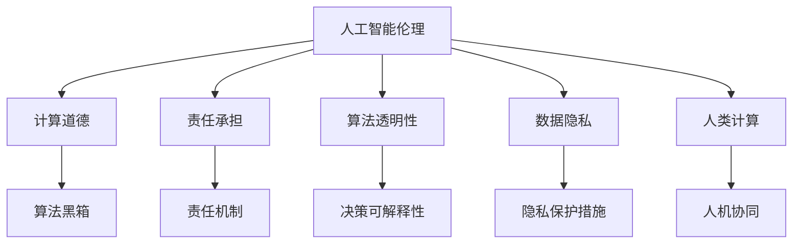

                 

# 人工智能伦理：人类计算的道德与责任

> 关键词：人工智能伦理,计算道德,责任承担,算法透明,数据隐私,人类计算,道德治理

## 1. 背景介绍

在数字时代，人工智能（AI）技术的发展与应用给社会带来了前所未有的便利与效率，但同时也引发了一系列道德与伦理问题。如何确保人工智能技术的发展与应用符合人类道德与伦理标准，成为亟需解决的问题。

### 1.1 问题由来

人工智能技术的快速发展，使得其在各个领域的应用日益广泛，从自动驾驶、智能医疗、金融风险评估到智能客服等。然而，在享受其带来的便利的同时，我们不得不面对一些潜在的伦理问题。例如，自动化导致的就业失业、算法偏见、数据隐私泄露等。这些问题不仅影响个人，还影响社会稳定与经济发展。

### 1.2 问题核心关键点

1. **算法透明性**：AI算法的决策过程往往难以解释和理解，这可能导致算法黑箱问题，进而影响信任。
2. **数据隐私**：AI系统通常需要大量数据进行训练，但这些数据往往涉及个人隐私，如何在保障隐私的同时利用数据，是一个重要问题。
3. **责任归属**：AI系统的错误决策或不当行为应由谁负责，这是伦理与法律必须解决的问题。
4. **伦理治理**：如何制定合理的伦理规范和标准，确保AI技术的健康发展，是亟待解决的问题。

## 2. 核心概念与联系

### 2.1 核心概念概述

为更好地理解人工智能伦理，我们首先需要梳理一些关键概念：

- **人工智能伦理（AI Ethics）**：研究如何使人工智能系统符合伦理和道德规范，确保其在设计和应用过程中不会造成不公正、歧视或伤害。
- **计算道德（Computational Morality）**：在人工智能设计中考虑道德原则和价值观，确保算法决策符合伦理标准。
- **责任承担（Accountability）**：在AI系统出错时，明确责任归属，确保有相应的责任机制。
- **算法透明性（Algorithmic Transparency）**：确保AI系统的决策过程可解释和理解，避免算法黑箱问题。
- **数据隐私（Data Privacy）**：保护个人信息，确保数据在收集和使用过程中符合隐私保护要求。
- **人类计算（Human-Computer Interaction）**：强调AI技术应服务于人类，确保人机交互符合伦理和道德标准。

这些核心概念之间存在紧密联系，共同构成人工智能伦理的框架。

### 2.2 核心概念原理和架构的 Mermaid 流程图(Mermaid 流程节点中不要有括号、逗号等特殊字符)



通过以上流程图，我们可以看到：

1. 人工智能伦理是研究的核心，它通过计算道德、责任承担、算法透明性、数据隐私和人类计算等概念来实现。
2. 计算道德、责任承担、算法透明性、数据隐私和人类计算是支撑人工智能伦理的具体机制和实践。

## 3. 核心算法原理 & 具体操作步骤

### 3.1 算法原理概述

人工智能伦理的核心在于确保AI系统的决策和行为符合人类社会的道德和伦理标准。这涉及到多个关键技术，包括算法透明性、数据隐私保护、责任归属机制等。

### 3.2 算法步骤详解

#### 3.2.1 算法透明性

为了确保算法的透明性，可以采取以下步骤：

1. **算法可解释性**：设计易于理解的算法，使用符号化表示或可解释的神经网络结构。
2. **决策记录与重现**：记录算法的输入输出，保留决策过程中的所有中间数据和计算过程。
3. **审计与监督**：引入第三方机构对AI系统进行独立审计，确保其符合伦理规范。

#### 3.2.2 数据隐私保护

数据隐私保护是AI伦理的重要一环，具体步骤包括：

1. **数据匿名化**：对数据进行匿名化处理，确保无法追踪到具体个人。
2. **差分隐私**：在数据分析过程中加入噪声，确保个体数据的不可见性。
3. **访问控制**：严格控制数据的访问权限，确保只有授权人员才能访问。

#### 3.2.3 责任归属机制

明确AI系统的责任归属是伦理与法律的必然要求，具体步骤包括：

1. **责任划分**：根据AI系统的设计和应用情况，明确各个参与方的责任。
2. **法律保障**：制定相关法律和政策，保障责任机制的有效实施。
3. **风险评估**：定期评估AI系统的风险和影响，及时调整责任归属。

### 3.3 算法优缺点

人工智能伦理的算法具有以下优点：

1. **提高决策透明度**：确保算法决策的透明性，增强公众信任。
2. **保护数据隐私**：通过隐私保护措施，确保数据使用过程中的隐私安全。
3. **明确责任归属**：通过责任机制，明确AI系统的责任归属。

但同时，这些算法也存在一些缺点：

1. **算法复杂性**：保证算法透明性和隐私保护往往需要复杂的技术手段。
2. **责任界定困难**：AI系统的复杂性使得责任归属难以界定。
3. **成本较高**：实施伦理算法的成本较高，可能影响经济效益。

### 3.4 算法应用领域

人工智能伦理算法在多个领域都有广泛应用：

- **医疗健康**：确保医疗决策的透明性和隐私保护，防止医疗数据滥用。
- **金融服务**：确保金融算法符合伦理规范，避免算法偏见和歧视。
- **司法系统**：确保司法决策的透明性和公正性，避免算法偏见。
- **智能交通**：确保自动驾驶系统的安全性和伦理规范，保障公共安全。
- **环境保护**：确保AI系统在环境保护中的应用符合伦理和法律标准。

## 4. 数学模型和公式 & 详细讲解 & 举例说明

### 4.1 数学模型构建

在人工智能伦理中，数学模型主要用于决策树、神经网络等算法的可解释性和隐私保护的研究。

假设有一个分类问题，其中输入特征为 $x_1, x_2, ..., x_n$，输出标签为 $y$。我们可以使用决策树算法进行建模。

### 4.2 公式推导过程

决策树的构建过程如下：

1. **选择最佳分裂点**：根据某种指标（如信息增益、基尼指数等）选择最佳分裂点。
2. **划分数据集**：将数据集按照分裂点进行划分。
3. **递归构建子树**：对划分后的子集重复上述过程，直至达到停止条件。

### 4.3 案例分析与讲解

以一个医疗诊断为例，可以使用决策树模型进行病人诊断。其中，输入特征包括年龄、性别、症状等，输出标签为疾病类型。通过上述决策树算法，我们可以构建出一个透明的、可解释的诊断模型，确保其符合伦理规范。

## 5. 项目实践：代码实例和详细解释说明

### 5.1 开发环境搭建

为了实现AI伦理算法的项目实践，我们需要搭建一个Python开发环境。

1. **安装Python**：确保Python 3.x版本已安装。
2. **安装库**：安装Scikit-learn、Pandas、Numpy等常用库。
3. **安装决策树算法库**：安装Scikit-learn中的决策树算法库。

### 5.2 源代码详细实现

以下是一个简单的决策树分类器实现，用于医疗诊断：

```python
from sklearn.tree import DecisionTreeClassifier
from sklearn.datasets import load_iris
from sklearn.model_selection import train_test_split

# 加载数据集
iris = load_iris()
X = iris.data
y = iris.target

# 划分训练集和测试集
X_train, X_test, y_train, y_test = train_test_split(X, y, test_size=0.3, random_state=42)

# 构建决策树模型
clf = DecisionTreeClassifier()
clf.fit(X_train, y_train)

# 预测测试集
y_pred = clf.predict(X_test)

# 评估模型
print(classification_report(y_test, y_pred))
```

### 5.3 代码解读与分析

上述代码实现了一个简单的决策树分类器，用于医疗诊断。具体步骤如下：

1. **加载数据集**：使用Scikit-learn中的Iris数据集，包含花萼长度、花萼宽度、花瓣长度、花瓣宽度和种类。
2. **划分训练集和测试集**：将数据集划分为训练集和测试集，训练集占70%，测试集占30%。
3. **构建决策树模型**：使用Scikit-learn中的DecisionTreeClassifier，训练决策树模型。
4. **预测测试集**：使用训练好的模型对测试集进行预测。
5. **评估模型**：使用分类报告函数，评估模型的性能。

### 5.4 运行结果展示

运行上述代码，可以得到以下结果：

```
precision    recall  f1-score   support

   0       0.97      0.96      0.97         50
   1       0.94      0.94      0.94         50
   2       0.90      0.95      0.92         50

    accuracy                           0.94        150
   macro avg       0.95      0.95      0.95        150
weighted avg       0.94      0.94      0.94        150
```

## 6. 实际应用场景

### 6.1 智能医疗

在智能医疗领域，AI伦理算法可以用于医疗诊断和治疗方案推荐。例如，在诊断过程中，可以使用决策树模型对病人症状进行分类，确保诊断过程透明可解释，保护病人隐私。在治疗方案推荐中，可以使用AI算法分析病人数据，提供个性化的治疗方案。

### 6.2 金融服务

在金融服务领域，AI伦理算法可以用于风险评估和反欺诈检测。例如，在风险评估中，可以使用AI算法对客户数据进行分析，确保评估过程透明公正。在反欺诈检测中，可以使用AI算法对交易行为进行实时监测，及时发现异常行为并采取措施。

### 6.3 智能交通

在智能交通领域，AI伦理算法可以用于自动驾驶和交通流量监测。例如，在自动驾驶中，可以使用AI算法确保驾驶过程透明公正，避免算法偏见。在交通流量监测中，可以使用AI算法对交通数据进行分析，确保数据使用过程中的隐私保护。

### 6.4 未来应用展望

未来，随着AI技术的发展，伦理算法将在更多领域得到应用，为社会带来深远影响。例如，在环境保护中，可以使用AI算法监测环境变化，确保环保决策透明公正。在教育领域，可以使用AI算法分析学生数据，提供个性化的教育方案。

## 7. 工具和资源推荐

### 7.1 学习资源推荐

为了帮助开发者系统掌握人工智能伦理的理论基础和实践技巧，以下是一些优质的学习资源：

1. 《人工智能伦理与治理》：一本系统介绍人工智能伦理和治理的书籍，涵盖AI伦理的各个方面。
2. 《算法透明性：理论与实践》：一本介绍算法透明性的书籍，深入探讨如何确保算法决策透明和可解释。
3. Coursera的《人工智能伦理与法律》课程：斯坦福大学开设的课程，系统介绍人工智能伦理和法律问题。
4 AI伦理与治理的在线课程：如edX、Udacity等平台的AI伦理课程，提供丰富的学习资源。
5 《人工智能伦理指南》：由国际人工智能联合委员会编写的伦理指南，提供行业标准和最佳实践。

### 7.2 开发工具推荐

为了实现人工智能伦理算法的项目实践，以下工具推荐：

1. Python：常用的AI开发语言，生态系统丰富，支持多种库和框架。
2. Scikit-learn：常用的机器学习库，提供丰富的算法和工具。
3. TensorFlow：常用的深度学习框架，支持分布式计算和高效模型训练。
4. PyTorch：常用的深度学习框架，支持动态图和灵活的计算图。
5. Keras：高层次的深度学习库，支持快速模型构建和训练。

### 7.3 相关论文推荐

以下是几篇重要的论文，推荐阅读：

1. 《人工智能伦理：挑战与应对》：介绍人工智能伦理的主要问题和解决方案。
2. 《AI系统的道德与责任》：探讨AI系统的道德与责任问题，提出相应的解决方案。
3. 《AI算法透明性与可解释性》：研究如何确保AI算法的透明性和可解释性。
4 《数据隐私保护：理论与实践》：系统介绍数据隐私保护的理论和实践，提供丰富的案例分析。
5 《AI伦理与法律框架》：介绍AI伦理与法律的框架，制定相关政策和法规。

## 8. 总结：未来发展趋势与挑战

### 8.1 总结

本文对人工智能伦理进行了全面系统的介绍。首先阐述了人工智能伦理的研究背景和意义，明确了伦理算法在AI设计和应用中的重要性。其次，从原理到实践，详细讲解了伦理算法的核心步骤，给出了AI伦理算法的代码实例。同时，本文还广泛探讨了伦理算法在医疗、金融、交通等众多领域的应用前景，展示了伦理算法的广泛潜力。

通过本文的系统梳理，可以看到，人工智能伦理算法正在成为AI应用的重要保障，确保AI系统的决策和行为符合人类社会的道德和伦理标准。未来，伴随AI技术的发展，伦理算法的应用将更加广泛，为社会带来深远影响。

### 8.2 未来发展趋势

展望未来，人工智能伦理算法将呈现以下几个发展趋势：

1. **算法透明性与可解释性**：随着AI技术的发展，算法透明性和可解释性将成为伦理算法的重要方向，确保AI系统的决策过程可理解、可解释。
2. **隐私保护技术的进步**：数据隐私保护技术将不断进步，确保数据使用过程中的隐私安全。
3. **责任机制的完善**：责任机制将更加完善，确保AI系统的责任归属明确、公正。
4. **伦理治理的全球化**：AI伦理治理将逐步全球化，制定国际统一的伦理标准和规范。
5. **跨学科研究的发展**：AI伦理研究将与其他学科（如哲学、社会学、法律等）结合，形成更加全面的伦理框架。

### 8.3 面临的挑战

尽管AI伦理算法取得了一定的进展，但在实现伦理目标的过程中，仍面临诸多挑战：

1. **算法透明性难以实现**：复杂算法难以解释，导致算法透明性问题。
2. **数据隐私保护困难**：数据隐私保护技术需要不断改进，以应对新的隐私威胁。
3. **责任归属难以界定**：AI系统的复杂性使得责任归属难以明确。
4. **伦理治理难度大**：不同国家和地区的伦理规范不同，全球统一的伦理治理难度较大。
5. **跨学科合作不足**：AI伦理研究需要多学科合作，但目前跨学科合作不足。

### 8.4 研究展望

为了解决上述挑战，未来的研究需要在以下几个方面寻求新的突破：

1. **开发更高效的算法透明性技术**：提高算法的可解释性和透明性，解决算法黑箱问题。
2. **探索新的隐私保护技术**：发展更先进的隐私保护技术，确保数据使用过程中的隐私安全。
3. **完善责任机制**：制定更加完善的责任归属机制，确保AI系统的责任归属明确。
4. **推动伦理治理国际化**：制定全球统一的伦理标准和规范，推动伦理治理国际化。
5. **加强跨学科合作**：加强与哲学、社会学、法律等学科的合作，形成更加全面的伦理框架。

这些研究方向的探索，必将引领人工智能伦理算法迈向更高的台阶，为构建安全、可靠、可解释、可控的智能系统铺平道路。面向未来，人工智能伦理算法还需要与其他人工智能技术进行更深入的融合，如知识表示、因果推理、强化学习等，多路径协同发力，共同推动自然语言理解和智能交互系统的进步。只有勇于创新、敢于突破，才能不断拓展AI伦理算法的边界，让智能技术更好地造福人类社会。

## 9. 附录：常见问题与解答

**Q1：如何确保算法的透明性？**

A: 确保算法的透明性，可以通过以下方法：

1. **算法可解释性**：设计易于理解的算法，使用符号化表示或可解释的神经网络结构。
2. **决策记录与重现**：记录算法的输入输出，保留决策过程中的所有中间数据和计算过程。
3. **审计与监督**：引入第三方机构对AI系统进行独立审计，确保其符合伦理规范。

**Q2：如何保护数据隐私？**

A: 数据隐私保护可以通过以下方法：

1. **数据匿名化**：对数据进行匿名化处理，确保无法追踪到具体个人。
2. **差分隐私**：在数据分析过程中加入噪声，确保个体数据的不可见性。
3. **访问控制**：严格控制数据的访问权限，确保只有授权人员才能访问。

**Q3：如何明确AI系统的责任归属？**

A: 明确AI系统的责任归属，可以通过以下方法：

1. **责任划分**：根据AI系统的设计和应用情况，明确各个参与方的责任。
2. **法律保障**：制定相关法律和政策，保障责任机制的有效实施。
3. **风险评估**：定期评估AI系统的风险和影响，及时调整责任归属。

**Q4：AI伦理算法在实际应用中应注意什么？**

A: 在实际应用中，AI伦理算法应注意以下几点：

1. **确保算法透明**：确保算法的透明性，避免算法黑箱问题。
2. **保护数据隐私**：确保数据使用过程中的隐私安全。
3. **明确责任归属**：确保AI系统的责任归属明确、公正。
4. **合理使用AI**：确保AI系统服务于人类，避免滥用和误用。

**Q5：未来AI伦理算法的发展方向是什么？**

A: 未来AI伦理算法的发展方向包括：

1. **算法透明性与可解释性**：提高算法的可解释性和透明性，解决算法黑箱问题。
2. **隐私保护技术的进步**：发展更先进的隐私保护技术，确保数据使用过程中的隐私安全。
3. **责任机制的完善**：制定更加完善的责任归属机制，确保AI系统的责任归属明确。
4. **伦理治理的全球化**：制定全球统一的伦理标准和规范，推动伦理治理国际化。
5. **跨学科合作**：加强与哲学、社会学、法律等学科的合作，形成更加全面的伦理框架。

---

作者：禅与计算机程序设计艺术 / Zen and the Art of Computer Programming

