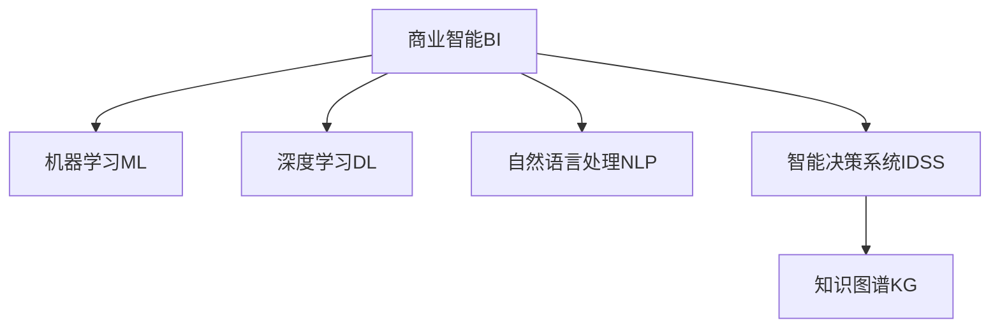

                 

# 人工智能创业：智能化决策的商业应用

> 关键词：人工智能, 商业决策, 数据驱动, 智能决策系统, 商业智能, 机器学习, 深度学习, 自然语言处理

## 1. 背景介绍

### 1.1 问题由来
随着信息技术的发展，人工智能(AI)技术已经逐步渗透到各行各业，成为推动产业创新和提升企业竞争力的重要引擎。在商业决策领域，传统的决策模式已经难以适应快速变化的市场环境。人工智能技术，尤其是智能决策系统，通过数据分析、模式识别和自然语言处理等手段，能够帮助企业快速洞察市场趋势、评估风险、优化运营，从而实现更加科学、精准的商业决策。

### 1.2 问题核心关键点
商业决策智能化，是指将人工智能技术应用于商业决策流程，通过数据驱动的方式，辅助企业进行决策分析和决策支持。其核心在于利用人工智能算法对海量数据进行高效处理和分析，挖掘数据中的潜在价值，并结合专家经验，为商业决策提供科学的依据和预测。

实现商业决策智能化的关键点包括：
- 数据获取与预处理：从企业内部和外部收集多源数据，并对数据进行清洗、整理和预处理，为后续分析奠定基础。
- 算法模型选择：根据业务场景选择合适的机器学习、深度学习或自然语言处理模型。
- 模型训练与优化：使用历史数据对模型进行训练，并通过交叉验证等技术对模型进行调优，以获得最佳的决策效果。
- 决策应用与评估：将训练好的模型嵌入到商业决策流程中，对新数据进行预测，并结合专家判断对预测结果进行评估和修正。
- 持续学习和迭代：根据新数据的反馈，不断调整模型参数，提升模型精度和泛化能力。

### 1.3 问题研究意义
人工智能在商业决策中的应用，能够帮助企业实现以下几个方面的提升：

1. **效率提升**：通过自动化决策过程，减少人工干预，提高决策速度和效率。
2. **精度提高**：利用机器学习算法，通过大量数据训练，提高决策的科学性和准确性。
3. **风险控制**：通过数据分析和预测，提前识别潜在的风险点，避免决策失误。
4. **成本降低**：优化资源配置和运营流程，降低运营成本和错误决策带来的损失。
5. **创新驱动**：基于数据分析和预测结果，辅助企业进行产品和服务的创新，提升市场竞争力。

商业决策智能化不仅是企业提升竞争力的重要手段，也是推动产业升级和经济高质量发展的关键因素。

## 2. 核心概念与联系

### 2.1 核心概念概述

为更好地理解商业决策智能化的核心技术，本节将介绍几个关键概念：

- **商业智能(Business Intelligence, BI)**：指利用数据分析和可视化技术，帮助企业理解和洞察商业活动的过程和结果，支持企业做出更加科学的决策。
- **机器学习(Machine Learning, ML)**：指通过算法对数据进行学习和推理，以获得新的知识和能力，支持数据驱动的决策。
- **深度学习(Deep Learning, DL)**：一种特殊形式的机器学习，利用神经网络模型进行复杂的数据特征学习和预测，广泛应用于图像、语音、自然语言处理等领域。
- **自然语言处理(Natural Language Processing, NLP)**：指利用计算机技术处理和理解人类语言，包括文本分类、情感分析、命名实体识别等任务。
- **智能决策系统(Intelligent Decision Support System, IDSS)**：结合人工智能技术和商业智能，提供实时、精准的决策支持和决策建议，辅助企业进行科学决策。
- **知识图谱(Knowledge Graph)**：一种用于描述实体间关系的图形结构，结合AI技术，可以辅助进行更深层次的商业决策。

这些核心概念之间的逻辑关系可以通过以下Mermaid流程图来展示：



这个流程图展示了大数据处理、智能决策的关键技术链路：

1. 从企业内外收集数据，进行商业智能分析。
2. 利用机器学习、深度学习、自然语言处理等技术，对数据进行挖掘和分析。
3. 将分析结果反馈给商业智能系统，辅助决策。
4. 结合知识图谱，进一步提升决策深度和广度。

## 3. 核心算法原理 & 具体操作步骤
### 3.1 算法原理概述

商业决策智能化的核心算法包括机器学习、深度学习和自然语言处理等，其中以机器学习和深度学习为主。通过这些算法，可以从海量的数据中挖掘出有价值的商业信息和规律，辅助企业做出科学、精准的决策。

以机器学习为例，商业决策智能化的核心流程如下：

1. **数据预处理**：收集企业内部和外部的数据，并进行清洗、整理和预处理，为后续模型训练提供基础数据。
2. **模型训练**：选择合适的机器学习算法，如回归、分类、聚类等，利用历史数据对模型进行训练，调整模型参数以获得最优性能。
3. **模型评估**：使用交叉验证等技术，对训练好的模型进行评估，确保其预测效果。
4. **决策应用**：将训练好的模型嵌入到决策流程中，对新数据进行预测和分析，辅助企业决策。
5. **持续学习**：根据新数据的反馈，不断调整模型参数，提升模型的精度和泛化能力。

### 3.2 算法步骤详解

下面以金融行业为例，详细介绍机器学习在商业决策中的应用步骤：

**Step 1: 数据收集与预处理**
- 收集金融行业的各类数据，包括交易数据、市场数据、新闻数据等。
- 数据清洗：处理缺失值、异常值等数据问题，确保数据质量。
- 数据整理：将不同来源的数据进行合并和统一格式，确保数据一致性。
- 特征工程：从原始数据中提取有意义的特征，如交易金额、交易时间、市场波动等。

**Step 2: 模型训练**
- 选择合适的机器学习算法，如线性回归、决策树、随机森林等。
- 利用历史交易数据进行模型训练，调整模型参数以获得最优性能。
- 使用交叉验证技术，评估模型在新数据上的预测效果。
- 根据评估结果，选择最优模型进行决策支持。

**Step 3: 模型评估与调优**
- 使用独立的测试集对模型进行评估，确保其在新数据上的泛化能力。
- 根据评估结果，对模型进行调优，提高模型精度和鲁棒性。
- 不断迭代和优化模型，确保其在不同市场条件下的稳定性和可靠性。

**Step 4: 决策应用**
- 将训练好的模型嵌入到决策系统中，对新交易进行预测和分析。
- 结合专家经验，对模型预测结果进行修正和优化。
- 实时监测模型性能，根据市场变化进行动态调整。

**Step 5: 持续学习**
- 根据新交易数据和新市场信息，不断调整模型参数，提升模型精度。
- 定期对模型进行重新训练和评估，确保其长期有效性。

### 3.3 算法优缺点

商业决策智能化算法的优点包括：

- **高效性**：通过机器学习和深度学习算法，能够快速处理海量数据，提高决策速度。
- **科学性**：利用数据驱动的方法，提高决策的科学性和准确性。
- **灵活性**：算法可以根据不同的业务需求进行灵活调整和优化。

但同时，这些算法也存在一些缺点：

- **数据依赖性**：算法的性能很大程度上依赖于数据的质量和数量，数据偏差可能导致决策错误。
- **模型复杂性**：复杂的算法模型需要大量的计算资源和时间，增加系统复杂度。
- **结果解释性**：机器学习模型的输出结果通常难以解释，难以让非技术背景的管理者理解和信任。
- **风险管理**：算法依赖于历史数据，可能无法预测未知的市场变化和极端情况。

### 3.4 算法应用领域

商业决策智能化算法已经在多个领域得到了广泛应用，以下是几个典型案例：

- **金融风控**：利用机器学习算法对交易数据进行分析，识别潜在的欺诈行为和风险点，提高风险控制能力。
- **零售营销**：通过数据分析和预测，优化产品推荐和促销策略，提升客户满意度和销售额。
- **供应链管理**：利用机器学习算法进行需求预测和库存管理，优化供应链效率和成本。
- **客户服务**：利用自然语言处理技术，构建智能客服系统，提升客户服务体验和效率。
- **市场分析**：通过数据挖掘和预测，识别市场趋势和机会，辅助企业进行战略规划和市场布局。

这些案例展示了商业决策智能化的强大应用价值，帮助企业实现智能化、数据驱动的决策过程。

## 4. 数学模型和公式 & 详细讲解  
### 4.1 数学模型构建

商业决策智能化的核心数学模型包括回归模型、分类模型、聚类模型等。这里以线性回归模型为例，介绍其构建和应用。

设回归问题为 $y = f(x_1, x_2, ..., x_n) + \epsilon$，其中 $y$ 为输出变量，$x_i$ 为输入变量，$f(x)$ 为回归函数，$\epsilon$ 为噪声误差。假设模型采用线性函数 $f(x) = \beta_0 + \beta_1x_1 + \beta_2x_2 + ... + \beta_nx_n$，其中 $\beta_i$ 为回归系数。回归模型可表示为：

$$
y = \beta_0 + \beta_1x_1 + \beta_2x_2 + ... + \beta_nx_n + \epsilon
$$

### 4.2 公式推导过程

回归模型中最常用的估计方法是最小二乘法。目标是最小化预测误差平方和：

$$
\min_{\beta_0, \beta_1, ..., \beta_n} \sum_{i=1}^N (y_i - \beta_0 - \beta_1x_{i1} - \beta_2x_{i2} - ... - \beta_nx_{in})^2
$$

通过求偏导数，得到回归系数的解：

$$
\beta_j = \frac{\sum_{i=1}^N x_{ij}(y_i - \bar{y})}{\sum_{i=1}^N x_{ij}^2}, j = 1, 2, ..., n
$$

其中 $\bar{y}$ 为样本均值。

### 4.3 案例分析与讲解

以金融风控为例，假设利用机器学习模型对交易数据进行分析，识别潜在的欺诈行为。训练数据集为 $(x_i, y_i)$，其中 $x_i$ 为交易特征（如金额、时间、地点等），$y_i$ 为标签（正常或欺诈）。回归模型通过最小二乘法训练，得到回归系数 $\beta_0, \beta_1, ..., \beta_n$。训练好的模型可以对新交易数据 $x_{new}$ 进行预测，得到 $\hat{y}_{new} = \beta_0 + \beta_1x_{new1} + \beta_2x_{new2} + ... + \beta_nx_{newn}$。根据预测结果，进行风险评估和决策支持。

## 5. 项目实践：代码实例和详细解释说明
### 5.1 开发环境搭建

在进行商业决策智能化项目实践前，我们需要准备好开发环境。以下是使用Python进行Scikit-learn和TensorFlow开发的环境配置流程：

1. 安装Anaconda：从官网下载并安装Anaconda，用于创建独立的Python环境。

2. 创建并激活虚拟环境：
```bash
conda create -n business-intelligence-env python=3.8 
conda activate business-intelligence-env
```

3. 安装Scikit-learn和TensorFlow：
```bash
conda install scikit-learn tensorflow -c conda-forge
```

4. 安装各类工具包：
```bash
pip install pandas numpy matplotlib jupyter notebook ipython
```

完成上述步骤后，即可在`business-intelligence-env`环境中开始项目实践。

### 5.2 源代码详细实现

下面我们以金融风控为例，给出使用Scikit-learn和TensorFlow进行模型训练和应用的全过程。

**Step 1: 数据准备**
- 收集金融行业的历史交易数据，进行清洗和预处理。
- 使用Pandas库进行数据整理和特征工程。
- 将数据分为训练集和测试集。

```python
import pandas as pd
from sklearn.model_selection import train_test_split

# 数据读取和预处理
df = pd.read_csv('financial_data.csv')
df = df.dropna() # 去除缺失值
X = df.drop('label', axis=1)
y = df['label']
X_train, X_test, y_train, y_test = train_test_split(X, y, test_size=0.2)
```

**Step 2: 模型训练**
- 选择合适的机器学习算法，如线性回归、随机森林等。
- 使用训练集数据进行模型训练。
- 使用交叉验证评估模型性能。

```python
from sklearn.linear_model import LinearRegression
from sklearn.ensemble import RandomForestClassifier

# 选择模型
model = LinearRegression() # 线性回归模型

# 模型训练
model.fit(X_train, y_train)

# 交叉验证评估
from sklearn.model_selection import cross_val_score
score = cross_val_score(model, X_train, y_train, cv=5).mean()
print(f"Cross-Validation Score: {score:.3f}")
```

**Step 3: 模型评估与调优**
- 使用测试集数据评估模型性能。
- 根据评估结果，调整模型参数。

```python
# 模型评估
score = model.score(X_test, y_test)
print(f"Test Score: {score:.3f}")

# 模型调优
from sklearn.model_selection import GridSearchCV
param_grid = {'C': [0.1, 1, 10]}
grid_search = GridSearchCV(model, param_grid, cv=5)
grid_search.fit(X_train, y_train)
best_model = grid_search.best_estimator_
```

**Step 4: 决策应用**
- 将训练好的模型嵌入到决策系统中。
- 对新交易数据进行预测和风险评估。

```python
# 预测新数据
new_data = pd.DataFrame([[1000, '2022-01-01', 'New York']], columns=['amount', 'date', 'location'])
new_data['label'] = best_model.predict(new_data)
print(new_data)
```

### 5.3 代码解读与分析

让我们再详细解读一下关键代码的实现细节：

**数据准备**：
- 使用Pandas库读取数据，并去除缺失值。
- 使用train_test_split方法将数据分为训练集和测试集。

**模型训练**：
- 使用Scikit-learn的LinearRegression模型进行训练。
- 使用交叉验证评估模型性能，输出交叉验证得分。

**模型评估与调优**：
- 使用测试集评估模型性能，输出模型在测试集上的得分。
- 使用GridSearchCV对模型参数进行调优，找到最优参数组合。

**决策应用**：
- 使用训练好的模型对新交易数据进行预测，并输出预测结果。

以上代码展示了从数据预处理、模型训练、模型评估到决策应用的全过程。开发者可以将更多精力放在数据处理和模型优化上，而不必过多关注底层的实现细节。

## 6. 实际应用场景
### 6.1 智能客服系统

智能客服系统可以广泛应用于各类企业，提升客户服务效率和体验。通过收集历史客服对话记录，训练机器学习模型进行情感分析、意图识别等任务，构建智能客服系统，能够实现7x24小时不间断服务，快速响应客户咨询，提升客户满意度。

在技术实现上，可以使用自然语言处理技术，对客户问题和回复进行文本分类和语义分析，生成智能答复。同时，可以通过数据分析和预测，优化客服策略和资源配置，提升服务质量。

### 6.2 零售推荐系统

零售推荐系统通过分析客户的购买历史、浏览行为等数据，推荐个性化的产品和服务。利用机器学习算法，建立用户行为模型，对不同客户进行个性化推荐，能够显著提升销售额和客户粘性。

在推荐系统中，可以使用协同过滤、内容推荐、混合推荐等方法，结合用户画像、商品信息等特征，生成个性化推荐结果。同时，通过数据分析和预测，实时调整推荐策略，提高推荐效果。

### 6.3 供应链优化

供应链优化通过分析市场需求、库存数据等，优化物流和生产流程，提高供应链效率和成本控制。利用机器学习算法，建立需求预测模型和库存管理模型，实现对供应链的动态优化。

在供应链管理中，可以使用时间序列分析、回归模型等方法，预测市场需求和库存需求，优化供应链节点和物流计划。同时，通过数据分析和预测，实时调整供应链策略，降低库存成本，提高供应链响应速度。

### 6.4 未来应用展望

随着商业决策智能化技术的不断进步，未来将在更多领域得到应用，为各行各业带来变革性影响。

在智慧城市治理中，智能决策系统可以用于城市事件监测、舆情分析、应急指挥等环节，提高城市管理的自动化和智能化水平，构建更安全、高效的未来城市。

在智慧医疗领域，利用智能决策系统进行疾病预测、治疗方案优化、医疗资源调度等任务，能够提升医疗服务的智能化水平，辅助医生诊疗，提高医疗效率和质量。

在智慧教育领域，利用智能决策系统进行学情分析、个性化教学、作业批改等任务，能够因材施教，促进教育公平，提高教学质量。

此外，在智能制造、智能交通、智能农业等众多领域，智能决策系统也将发挥重要作用，推动各行各业的数字化转型和智能化升级。

## 7. 工具和资源推荐
### 7.1 学习资源推荐

为了帮助开发者系统掌握商业决策智能化的理论基础和实践技巧，这里推荐一些优质的学习资源：

1. **《Python数据科学手册》**：介绍Python在数据科学中的应用，涵盖数据预处理、模型训练、模型评估等核心内容。
2. **《机器学习实战》**：通过实际案例，讲解机器学习算法及其应用，适合初学者入门。
3. **《深度学习入门：基于Python的理论与实现》**：深入浅出地介绍深度学习算法和实践，适合深度学习进阶读者。
4. **《自然语言处理综论》**：全面介绍自然语言处理技术及其应用，涵盖文本分类、情感分析、命名实体识别等任务。
5. **《商业智能实战》**：介绍商业智能技术及其应用，涵盖数据仓库、报表设计、可视化分析等核心内容。
6. **《Python机器学习》**：介绍机器学习算法及其在Python中的应用，适合实战型开发者学习。

通过对这些资源的学习实践，相信你一定能够快速掌握商业决策智能化的精髓，并用于解决实际的商业问题。

### 7.2 开发工具推荐

高效的开发离不开优秀的工具支持。以下是几款用于商业决策智能化开发的常用工具：

1. **Scikit-learn**：Python机器学习库，提供多种机器学习算法及其工具。
2. **TensorFlow**：谷歌开发的深度学习框架，支持分布式计算，适合大规模模型训练。
3. **Pandas**：Python数据处理库，支持数据清洗、数据预处理和数据可视化。
4. **Jupyter Notebook**：交互式Python开发环境，支持代码编写、数据可视化、结果展示等功能。
5. **Tableau**：商业智能工具，支持数据可视化、报表设计等功能。
6. **Tableau Public**：免费的商业智能工具，支持数据共享和开放分析。

合理利用这些工具，可以显著提升商业决策智能化的开发效率，加快创新迭代的步伐。

### 7.3 相关论文推荐

商业决策智能化技术的发展得益于学界的持续研究。以下是几篇奠基性的相关论文，推荐阅读：

1. **《机器学习实战》**：通过实际案例，讲解机器学习算法及其应用，适合初学者入门。
2. **《深度学习入门：基于Python的理论与实现》**：深入浅出地介绍深度学习算法和实践，适合深度学习进阶读者。
3. **《自然语言处理综论》**：全面介绍自然语言处理技术及其应用，涵盖文本分类、情感分析、命名实体识别等任务。
4. **《商业智能实战》**：介绍商业智能技术及其应用，涵盖数据仓库、报表设计、可视化分析等核心内容。
5. **《Python机器学习》**：介绍机器学习算法及其在Python中的应用，适合实战型开发者学习。

这些论文代表了大商业决策智能化技术的发展脉络。通过学习这些前沿成果，可以帮助研究者把握学科前进方向，激发更多的创新灵感。

## 8. 总结：未来发展趋势与挑战
### 8.1 总结

本文对商业决策智能化的实现过程进行了全面系统的介绍。首先阐述了商业决策智能化的研究背景和意义，明确了利用人工智能技术进行数据驱动决策的重要性。其次，从原理到实践，详细讲解了商业决策智能化的核心算法和关键步骤，给出了商业决策智能化的完整代码实例。同时，本文还广泛探讨了商业决策智能化在多个行业领域的应用前景，展示了其强大的应用价值。

通过本文的系统梳理，可以看到，商业决策智能化技术正成为推动企业智能化转型的重要引擎，能够帮助企业实现高效、科学、精准的决策过程，提升企业竞争力和市场响应速度。

### 8.2 未来发展趋势

展望未来，商业决策智能化技术将呈现以下几个发展趋势：

1. **自动化决策**：利用AI技术，实现自动化的决策过程，减少人工干预，提高决策效率。
2. **数据驱动**：基于海量数据的分析和挖掘，实现数据驱动的决策，提高决策的科学性和准确性。
3. **智能决策系统**：结合AI技术和商业智能，构建智能决策系统，辅助企业进行实时、精准的决策支持。
4. **多模态数据融合**：结合多源数据，如文本、图像、语音等，进行深度分析和预测，提升决策深度和广度。
5. **实时化决策**：通过实时数据采集和分析，实现实时化的决策支持，提高市场响应速度和灵活性。
6. **集成学习**：结合多种机器学习算法和深度学习模型，进行集成学习和预测，提高决策的鲁棒性和泛化能力。

以上趋势凸显了商业决策智能化技术的广阔前景。这些方向的探索发展，必将进一步提升企业的智能化决策能力，推动产业升级和经济高质量发展。

### 8.3 面临的挑战

尽管商业决策智能化技术已经取得了显著进展，但在推广应用的过程中，仍面临诸多挑战：

1. **数据质量问题**：数据缺失、噪声、不准确等问题，可能导致决策错误。
2. **模型复杂性**：复杂的模型需要大量的计算资源和时间，增加系统复杂度。
3. **结果解释性**：AI模型的输出结果难以解释，难以让非技术背景的管理者理解和信任。
4. **隐私和安全**：商业决策智能化技术涉及大量敏感数据，如何保护数据隐私和安全，是一个重要问题。
5. **法律和伦理**：AI技术的广泛应用可能带来伦理和法律问题，如算法偏见、歧视性决策等。

正视商业决策智能化面临的这些挑战，积极应对并寻求突破，将是大规模商业决策智能化技术走向成熟的必由之路。

### 8.4 研究展望

面对商业决策智能化技术面临的挑战，未来的研究需要在以下几个方面寻求新的突破：

1. **数据治理和质量提升**：加强数据治理和质量提升，建立数据标准和规范，确保数据的质量和可靠性。
2. **模型简化和优化**：开发更加轻量级、高效的模型算法，降低计算资源和时间消耗。
3. **结果解释和可解释性**：增强AI模型的解释性和可解释性，让决策过程更加透明和可信。
4. **隐私保护和安全技术**：加强数据隐私保护和安全技术，确保商业决策智能化技术的安全性和可靠性。
5. **法律和伦理规范**：建立AI技术的法律和伦理规范，避免算法偏见和歧视性决策，确保技术应用的公平和公正。

这些研究方向的探索，必将引领商业决策智能化技术迈向更高的台阶，为构建更加智能、可靠、可控的商业决策系统铺平道路。面向未来，商业决策智能化技术还需要与其他人工智能技术进行更深入的融合，如知识表示、因果推理、强化学习等，多路径协同发力，共同推动企业智能化决策系统的进步。只有勇于创新、敢于突破，才能不断拓展商业决策智能化的边界，让AI技术更好地造福社会和经济。

## 9. 附录：常见问题与解答
**Q1：商业决策智能化是否适用于所有企业？**

A: 商业决策智能化技术适用于大多数企业，特别是那些拥有海量数据和复杂决策需求的企业。对于一些中小企业，可以针对性地选择部分关键业务进行智能化改造，逐步推进决策智能化进程。

**Q2：如何选择适合商业决策的算法？**

A: 选择商业决策算法时，需要考虑以下几个因素：
1. 业务场景：根据具体业务场景，选择适合的算法，如回归、分类、聚类等。
2. 数据类型：选择与数据类型匹配的算法，如文本分类适合使用自然语言处理技术。
3. 模型复杂度：选择适合的模型复杂度，避免过于复杂导致资源消耗和计算时间过高。
4. 结果可解释性：选择具有较高可解释性的算法，便于管理层理解和信任决策结果。

**Q3：商业决策智能化系统如何处理异常数据？**

A: 商业决策智能化系统通常使用异常检测算法，对异常数据进行识别和处理。常见的异常检测方法包括基于统计学的方法、基于机器学习的方法、基于深度学习的方法等。同时，结合人工干预，对异常数据进行手动处理和校正，确保数据的质量和可靠性。

**Q4：商业决策智能化系统如何提高数据处理效率？**

A: 提高数据处理效率可以通过以下几个方面实现：
1. 数据预处理：对数据进行清洗、去重、归一化等处理，减少噪声和冗余。
2. 并行计算：利用分布式计算框架，如Hadoop、Spark等，加速数据处理过程。
3. 数据压缩：对数据进行压缩和优化，减少存储空间和传输时间。
4. 数据缓存：对常用数据进行缓存，减少重复计算和I/O操作。
5. 算法优化：优化算法和模型结构，提高计算效率和处理速度。

这些措施可以显著提高商业决策智能化系统的数据处理效率，确保系统的稳定性和可靠性。

**Q5：商业决策智能化系统如何保证数据隐私和安全？**

A: 商业决策智能化系统在处理数据时，需要严格遵守数据隐私和安全规范，确保数据的合法使用和保护。具体措施包括：
1. 数据加密：对敏感数据进行加密处理，确保数据在传输和存储过程中的安全性。
2. 权限控制：对数据访问进行严格的权限控制，确保只有授权人员才能访问敏感数据。
3. 数据匿名化：对数据进行匿名化处理，去除个人身份信息，保护用户隐私。
4. 安全审计：对数据访问和使用进行实时监控和审计，确保数据的安全性和合规性。

这些措施可以显著提高商业决策智能化系统的数据隐私和安全保障能力，确保系统的稳定性和可靠性。

---

作者：禅与计算机程序设计艺术 / Zen and the Art of Computer Programming

