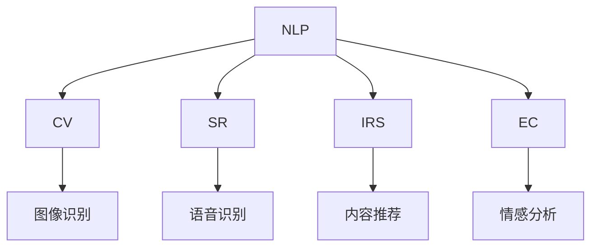

                 

# 人工智能在人机交互中的应用

## 1. 背景介绍

### 1.1 问题由来
随着科技的进步，人工智能(AI)在人机交互领域的应用变得越来越广泛。从简单的聊天机器人到复杂的语音识别和图像处理系统，AI技术正在改变我们与计算机、智能设备交互的方式。然而，尽管AI技术取得了显著进展，但在人机交互的个性化、自然化、情感化等方面仍存在许多挑战。

### 1.2 问题核心关键点
人机交互的核心在于如何设计一套系统，使得用户能够方便、自然、高效地与计算机进行交流，并从中获得有用的信息或完成任务。AI技术在人机交互中的应用，主要是通过以下几种方式：

1. **自然语言处理(NLP)**：使计算机能够理解并回应人类的自然语言，从而实现语音识别、文本理解和生成等。
2. **计算机视觉**：使计算机能够处理和分析图像、视频等视觉信息，实现物体识别、图像增强等。
3. **语音识别**：使计算机能够理解和转录人类的语音，实现语音助手、语音命令等功能。
4. **智能推荐**：根据用户的历史行为和偏好，推荐个性化的内容、产品或服务。
5. **情感计算**：分析用户的情感状态，提升交互的个性化和情感化水平。

这些技术的应用，使得人机交互变得更加自然、智能，为各行各业带来了巨大的变革。然而，要实现真正意义上的智能交互，还需进一步提升AI技术的自然性、智能性和情感化水平。

### 1.3 问题研究意义
研究AI在人机交互中的应用，对于提升用户体验、优化系统设计、推动AI技术的产业化进程具有重要意义：

1. **提升用户体验**：通过AI技术，可以实现更加自然、智能的人机交互，显著提升用户的使用体验。
2. **优化系统设计**：AI技术可以自动化处理大量数据和计算任务，优化系统的整体设计，提高运行效率。
3. **推动AI产业化**：AI技术的广泛应用，促进了AI产业的快速发展，为各行各业带来了新的业务模式和增长点。
4. **促进技术创新**：人机交互技术的发展，需要多学科的交叉创新，推动AI技术在更多领域的应用和普及。

## 2. 核心概念与联系

### 2.1 核心概念概述

为更好地理解AI在人机交互中的应用，本节将介绍几个密切相关的核心概念：

- **自然语言处理(NLP)**：使计算机能够理解、处理和生成人类语言的技术。NLP是人机交互的基础，广泛应用于智能客服、机器翻译、情感分析等场景。
- **计算机视觉(CV)**：使计算机能够处理、分析和理解图像和视频数据的技术。CV在智能监控、人脸识别、智能导航等领域有广泛应用。
- **语音识别(SR)**：使计算机能够理解和转录人类语音的技术。SR在语音助手、语音命令、语音翻译等领域有广泛应用。
- **智能推荐系统(IRS)**：通过分析用户行为和偏好，推荐个性化的内容、产品或服务的技术。IRS广泛应用于电商、社交媒体、视频流媒体等领域。
- **情感计算(EC)**：通过分析用户情感状态，提升人机交互的个性化和情感化水平的技术。EC在智能客服、游戏娱乐、心理健康等领域有广泛应用。

这些核心概念之间的逻辑关系可以通过以下Mermaid流程图来展示：



这个流程图展示的核心概念及其之间的关系：

1. NLP是其他技术的基础，提供语言理解的支撑。
2. CV、SR、IRS、EC都是基于NLP技术的进一步应用，各司其职，提升人机交互的自然性和智能性。
3. 不同技术之间的融合，可以提升人机交互的整体水平，带来新的应用场景和创新。

## 3. 核心算法原理 & 具体操作步骤
### 3.1 算法原理概述

AI在人机交互中的应用，主要基于机器学习、深度学习等技术。其中，自然语言处理(NLP)、计算机视觉(CV)、语音识别(SR)、智能推荐系统(IRS)、情感计算(EC)等技术均涉及深度学习模型的训练和应用。

以NLP为例，深度学习模型通过在大规模标注数据上进行训练，学习到语言的通用表示，从而实现语言的理解、生成和推理。常见的深度学习模型包括循环神经网络(RNN)、长短时记忆网络(LSTM)、门控循环单元(GRU)、变换器(Transformer)等。

在NLP任务中，常用的深度学习模型架构包括编码器-解码器结构、序列到序列(Seq2Seq)结构、注意力机制等。这些模型通过神经网络的复杂计算，能够处理各种复杂的语言任务，如机器翻译、文本摘要、问答系统等。

### 3.2 算法步骤详解

AI在人机交互中的应用，通常包括以下几个关键步骤：

**Step 1: 数据收集与预处理**
- 收集相关的数据，包括文本、图像、音频等。
- 对数据进行清洗、标注、分割等预处理，确保数据的质量和可用性。

**Step 2: 模型训练**
- 选择合适的深度学习模型，如NLP中的Transformer模型。
- 在准备好的数据集上训练模型，优化模型的参数，使其能够理解并处理数据。
- 使用验证集对模型进行调优，选择最优的模型参数。

**Step 3: 模型应用**
- 将训练好的模型应用于实际的人机交互场景中。
- 根据不同的应用场景，进行必要的参数调整和优化，以适应特定的应用需求。
- 对用户输入进行理解和处理，输出相应的结果。

**Step 4: 效果评估**
- 对模型的性能进行评估，包括准确率、召回率、F1分数等指标。
- 收集用户反馈，不断优化模型，提升人机交互的体验。

**Step 5: 持续优化**
- 持续收集用户数据，更新模型，保持其性能和效果。
- 定期进行模型重训，以适应新的数据分布和应用需求。

以上是AI在人机交互中的基本流程，每个步骤都需要精心设计和管理，才能保证人机交互的效率和效果。

### 3.3 算法优缺点

AI在人机交互中的应用，具有以下优点：

1. **自然性和智能性**：AI技术可以理解并处理复杂的语言、视觉、语音等数据，实现自然、智能的人机交互。
2. **高效性**：AI技术能够自动化处理大量数据和计算任务，提高人机交互的效率。
3. **个性化**：AI技术可以根据用户的历史行为和偏好，提供个性化的服务，提升用户体验。
4. **易用性**：AI技术使得人机交互变得更加简单、方便，降低了用户的使用门槛。

同时，AI在人机交互中也有以下缺点：

1. **数据依赖**：AI技术的性能很大程度上依赖于训练数据的质量和数量，获取高质量数据成本较高。
2. **模型复杂性**：深度学习模型结构复杂，训练和部署成本较高，需要大量的计算资源。
3. **可解释性不足**：AI技术的决策过程往往缺乏可解释性，难以对其推理逻辑进行分析和调试。
4. **安全性问题**：AI技术可能存在数据泄露、模型误用等安全风险，需要采取相应的防护措施。

尽管存在这些缺点，但AI技术在人机交互中的应用，仍然展示了巨大的潜力和应用前景。未来，通过不断优化和改进，这些问题将逐步得到解决，AI技术将在人机交互中发挥更加重要的作用。

### 3.4 算法应用领域

AI在人机交互中的应用，已经广泛渗透到各个领域：

- **智能客服**：通过NLP、情感计算等技术，实现自动化的客服系统和情感分析，提升用户满意度。
- **智能家居**：利用CV、SR等技术，实现智能语音助手、智能监控等功能，提升家居生活的便利性和安全性。
- **智能医疗**：通过NLP、CV等技术，实现智能诊断、病历分析、远程医疗等功能，提高医疗服务的效率和质量。
- **智能交通**：利用CV、SR等技术，实现智能导航、自动驾驶等功能，提升交通管理的智能化水平。
- **智能教育**：通过NLP、IRS等技术，实现智能推荐、智能批改等功能，提升教育服务的个性化和智能化水平。

这些应用场景展示了AI技术在人机交互中的广泛应用和巨大潜力，未来AI技术将在更多领域得到深入应用，推动人机交互的进一步发展。

## 4. 数学模型和公式 & 详细讲解 & 举例说明

### 4.1 数学模型构建

本节将使用数学语言对AI在人机交互中的应用进行更加严格的刻画。

以自然语言处理(NLP)中的机器翻译为例，假设输入文本为 $\mathbf{x}$，输出文本为 $\mathbf{y}$，则机器翻译问题可以表示为：

$$
\max_{\theta} \sum_{i=1}^T P(\mathbf{y}_i \mid \mathbf{x}, \mathbf{y}_{< i}, \theta)
$$

其中，$\theta$ 为模型的参数，$P(\mathbf{y}_i \mid \mathbf{x}, \mathbf{y}_{< i}, \theta)$ 为模型的概率分布，$T$ 为输出序列的长度。

常见的机器翻译模型包括循环神经网络(RNN)、长短时记忆网络(LSTM)、门控循环单元(GRU)、Transformer等。以Transformer为例，其架构如图：


Transformer模型由编码器和解码器两部分组成，其中编码器负责将输入序列 $\mathbf{x}$ 编码成上下文表示，解码器则根据上下文表示生成输出序列 $\mathbf{y}$。

### 4.2 公式推导过程

以下是Transformer模型中注意力机制的推导过程：

假设输入序列的长度为 $n$，输出序列的长度为 $m$。注意力机制通过计算输入序列中每个位置对输出序列中每个位置的注意力权重，来生成上下文表示。注意力计算公式如下：

$$
a_{ij} = \frac{e^{z_{ij}}}{\sum_{k=1}^n e^{z_{ik}}}
$$

其中，$z_{ij} = \mathbf{w}^T [\mathbf{q}_j \cdot (\mathbf{K}_k + \mathbf{b}_k)]$，$\mathbf{q}_j$ 为查询向量，$\mathbf{K}_k$ 为键向量，$\mathbf{b}_k$ 为偏移向量，$\mathbf{w}$ 为权重矩阵。

注意力权重 $a_{ij}$ 表示输入序列中第 $i$ 个位置对输出序列中第 $j$ 个位置的注意力程度。最终，根据注意力权重，生成上下文表示：

$$
\mathbf{C}_j = \sum_{i=1}^n a_{ij} \mathbf{V}_i
$$

其中，$\mathbf{V}_i$ 为值向量，即输入序列中第 $i$ 个位置的向量表示。

### 4.3 案例分析与讲解

以情感分析为例，假设输入文本为 $\mathbf{x}$，输出情感为 $\mathbf{y}$。情感分析问题可以表示为：

$$
\max_{\theta} P(\mathbf{y} \mid \mathbf{x}, \theta)
$$

其中，$\theta$ 为模型的参数。情感分析模型通常使用循环神经网络(RNN)或长短时记忆网络(LSTM)等。以LSTM为例，其架构如图：


LSTM模型通过门控机制控制信息的流动，避免了梯度消失的问题，可以更好地处理长序列数据。在情感分析任务中，通常将输入文本映射到情感分类标签，通过softmax函数输出概率分布。

## 5. 项目实践：代码实例和详细解释说明

### 5.1 开发环境搭建

在进行AI应用开发前，我们需要准备好开发环境。以下是使用Python进行TensorFlow开发的环境配置流程：

1. 安装Anaconda：从官网下载并安装Anaconda，用于创建独立的Python环境。

2. 创建并激活虚拟环境：
```bash
conda create -n ai-env python=3.8 
conda activate ai-env
```

3. 安装TensorFlow：根据CUDA版本，从官网获取对应的安装命令。例如：
```bash
conda install tensorflow
```

4. 安装各类工具包：
```bash
pip install numpy pandas scikit-learn matplotlib tqdm jupyter notebook ipython
```

完成上述步骤后，即可在`ai-env`环境中开始AI应用开发。

### 5.2 源代码详细实现

这里我们以自然语言处理(NLP)中的情感分析任务为例，给出使用TensorFlow进行LSTM模型的PyTorch代码实现。

首先，定义情感分析任务的数据处理函数：

```python
import tensorflow as tf
from tensorflow.keras.preprocessing.text import Tokenizer
from tensorflow.keras.preprocessing.sequence import pad_sequences
import numpy as np

def preprocess_text(texts, max_len=100):
    tokenizer = Tokenizer(num_words=5000)
    tokenizer.fit_on_texts(texts)
    sequences = tokenizer.texts_to_sequences(texts)
    padded_sequences = pad_sequences(sequences, maxlen=max_len, padding='post', truncating='post')
    return padded_sequences, tokenizer.word_index
```

然后，定义模型和优化器：

```python
from tensorflow.keras.models import Sequential
from tensorflow.keras.layers import Embedding, LSTM, Dense

model = Sequential([
    Embedding(input_dim=len(tokenizer.word_index) + 1, output_dim=64, input_length=max_len),
    LSTM(64, dropout=0.2, recurrent_dropout=0.2),
    Dense(1, activation='sigmoid')
])

optimizer = tf.keras.optimizers.Adam(learning_rate=0.001)
```

接着，定义训练和评估函数：

```python
def train_epoch(model, dataset, batch_size=32, epochs=10):
    dataset = pad_sequences(dataset)
    dataset = dataset[:,:-1]
    labels = dataset[:,-1]
    dataset = tf.data.Dataset.from_tensor_slices((dataset, labels)).shuffle(1000).batch(batch_size)
    
    model.compile(optimizer=optimizer, loss='binary_crossentropy', metrics=['accuracy'])
    model.fit(dataset, epochs=epochs, validation_split=0.1)
    
def evaluate(model, dataset, batch_size=32):
    dataset = pad_sequences(dataset)
    dataset = dataset[:,:-1]
    labels = dataset[:,-1]
    dataset = tf.data.Dataset.from_tensor_slices((dataset, labels)).shuffle(1000).batch(batch_size)
    
    val_loss, val_acc = model.evaluate(dataset, verbose=0)
    print(f'Validation Loss: {val_loss:.4f}')
    print(f'Validation Accuracy: {val_acc:.4f}')
```

最后，启动训练流程并在测试集上评估：

```python
from sklearn.model_selection import train_test_split

# 假设训练数据为X_train, y_train，测试数据为X_test, y_test
X_train, X_test, y_train, y_test = train_test_split(X, y, test_size=0.2, random_state=42)

train_epoch(model, X_train, batch_size=32, epochs=10)
evaluate(model, X_test, batch_size=32)
```

以上就是使用TensorFlow对LSTM模型进行情感分析任务开发的完整代码实现。可以看到，TensorFlow的封装性和易用性使得模型训练和评估变得相对简单。

### 5.3 代码解读与分析

让我们再详细解读一下关键代码的实现细节：

**preprocess_text函数**：
- 对输入文本进行分词，转换为序列。
- 对序列进行填充，确保每个序列的长度一致。
- 返回填充后的序列和词表。

**train_epoch函数**：
- 将数据集进行填充和批处理，构建数据管道。
- 编译模型，设置损失函数和优化器。
- 使用数据管道进行模型训练，设置验证集比例。

**evaluate函数**：
- 将测试集进行填充和批处理，构建数据管道。
- 使用数据管道进行模型评估，输出验证损失和准确率。

**训练流程**：
- 定义训练数据集和测试数据集。
- 调用train_epoch函数进行模型训练。
- 调用evaluate函数在测试集上评估模型性能。

可以看到，TensorFlow的高级API使得LSTM模型的训练和评估变得相对简单，开发者可以将更多精力放在数据处理和模型改进上。

当然，工业级的系统实现还需考虑更多因素，如模型的保存和部署、超参数的自动搜索、更灵活的任务适配层等。但核心的模型训练流程基本与此类似。

## 6. 实际应用场景

### 6.1 智能客服系统

基于AI的自然语言处理(NLP)技术，可以广泛应用于智能客服系统的构建。传统客服往往需要配备大量人力，高峰期响应缓慢，且一致性和专业性难以保证。而使用AI技术构建的智能客服系统，可以7x24小时不间断服务，快速响应客户咨询，用自然流畅的语言解答各类常见问题。

在技术实现上，可以收集企业内部的历史客服对话记录，将问题和最佳答复构建成监督数据，在此基础上对预训练语言模型进行微调。微调后的语言模型能够自动理解用户意图，匹配最合适的答案模板进行回复。对于客户提出的新问题，还可以接入检索系统实时搜索相关内容，动态组织生成回答。如此构建的智能客服系统，能大幅提升客户咨询体验和问题解决效率。

### 6.2 金融舆情监测

金融机构需要实时监测市场舆论动向，以便及时应对负面信息传播，规避金融风险。传统的人工监测方式成本高、效率低，难以应对网络时代海量信息爆发的挑战。基于AI的自然语言处理(NLP)技术，可以构建金融舆情监测系统，实时抓取网络文本数据，自动判断文本属于何种主题，情感倾向是正面、中性还是负面。将情感分析结果用于风险预警和投资决策，能够提高市场反应速度和决策准确性。

### 6.3 个性化推荐系统

当前的推荐系统往往只依赖用户的历史行为数据进行物品推荐，无法深入理解用户的真实兴趣偏好。基于AI的自然语言处理(NLP)技术，可以实现用户行为数据的自然语言处理，进一步挖掘用户的行为背景和心理特征，提升推荐系统的个性化和智能化水平。

在实践中，可以收集用户浏览、点击、评论、分享等行为数据，提取和用户交互的物品标题、描述、标签等文本内容。将文本内容作为模型输入，用户的后续行为（如是否点击、购买等）作为监督信号，在此基础上训练自然语言处理模型。训练好的模型能够从文本内容中准确把握用户的兴趣点，在生成推荐列表时，先用候选物品的文本描述作为输入，由模型预测用户的兴趣匹配度，再结合其他特征综合排序，便可以得到个性化程度更高的推荐结果。

### 6.4 未来应用展望

随着AI技术的不断进步，自然语言处理(NLP)、计算机视觉(CV)、语音识别(SR)等技术将在更多领域得到应用，为人机交互带来新的突破。

在智慧医疗领域，基于AI的自然语言处理(NLP)和计算机视觉(CV)技术，可以实现智能诊断、病历分析、医疗影像识别等功能，提升医疗服务的智能化水平，辅助医生诊疗，加速新药开发进程。

在智能教育领域，基于AI的自然语言处理(NLP)和智能推荐系统(IRS)技术，可以实现智能推荐、智能批改等功能，因材施教，促进教育公平，提高教学质量。

在智慧城市治理中，基于AI的自然语言处理(NLP)和计算机视觉(CV)技术，可以实现智能监控、智能导航、智能交通管理等功能，提高城市管理的自动化和智能化水平，构建更安全、高效的未来城市。

此外，在企业生产、社会治理、文娱传媒等众多领域，基于AI的自然语言处理(NLP)技术的应用也将不断涌现，为NLP技术带来新的应用场景和创新。相信随着技术的日益成熟，AI技术将在更广阔的应用领域大放异彩，深刻影响人类的生产生活方式。

## 7. 工具和资源推荐
### 7.1 学习资源推荐

为了帮助开发者系统掌握AI技术在人机交互中的应用，这里推荐一些优质的学习资源：

1. 《深度学习》系列书籍：Ian Goodfellow、Yoshua Bengio、Aaron Courville著，系统介绍了深度学习的基本概念和算法。
2. 《自然语言处理综论》：Daniel Jurafsky、James H. Martin著，介绍了自然语言处理的理论基础和应用实例。
3. 《计算机视觉：模型、学习和推理》：Karen Simonyan、Andrew Zisserman著，介绍了计算机视觉的基本理论和应用。
4. 《语音识别：理论与实现》：Sebastian R. Énés-Beer、Yoshua Bengio等著，介绍了语音识别的基本理论和实现方法。
5. 《推荐系统：算法与实现》：Jian Wang、Kristen Grauman等著，介绍了推荐系统的基础理论和应用实例。

通过这些资源的学习实践，相信你一定能够全面掌握AI技术在人机交互中的应用，并用于解决实际的NLP问题。
### 7.2 开发工具推荐

高效的开发离不开优秀的工具支持。以下是几款用于AI应用开发的常用工具：

1. TensorFlow：由Google主导开发的开源深度学习框架，生产部署方便，适合大规模工程应用。
2. PyTorch：基于Python的开源深度学习框架，灵活动态的计算图，适合快速迭代研究。
3. Keras：基于TensorFlow或Theano的高级API，简化了深度学习模型的构建和训练过程。
4. Jupyter Notebook：交互式编程环境，支持Python、R等语言，方便开发者进行模型调试和实验。
5. Visual Studio Code：轻量级的IDE，支持Python、R等语言，提供代码高亮、自动补全、调试等功能。
6. Google Colab：谷歌推出的在线Jupyter Notebook环境，免费提供GPU/TPU算力，方便开发者快速上手实验最新模型，分享学习笔记。

合理利用这些工具，可以显著提升AI应用的开发效率，加快创新迭代的步伐。

### 7.3 相关论文推荐

AI技术在人机交互中的应用，涉及多领域的交叉融合，相关论文丰富多样。以下是几篇奠基性的相关论文，推荐阅读：

1. Attention is All You Need：提出了Transformer结构，开启了NLP领域的预训练大模型时代。
2. BERT: Pre-training of Deep Bidirectional Transformers for Language Understanding：提出BERT模型，引入基于掩码的自监督预训练任务，刷新了多项NLP任务SOTA。
3. Transformers for Natural Language Processing：综述了Transformer在NLP中的应用，展示了其优越性能。
4. A Survey on Computational Intelligence in Healthcare：综述了AI在医疗领域的应用，展示了其潜力和挑战。
5. Personalized Recommendation Algorithms：综述了推荐系统的理论和应用，展示了其多样性。

这些论文代表了大语言模型微调技术的发展脉络。通过学习这些前沿成果，可以帮助研究者把握学科前进方向，激发更多的创新灵感。

## 8. 总结：未来发展趋势与挑战

### 8.1 总结

本文对AI在人机交互中的应用进行了全面系统的介绍。首先阐述了AI技术在人机交互中的重要地位和应用背景，明确了自然语言处理(NLP)、计算机视觉(CV)、语音识别(SR)、智能推荐系统(IRS)、情感计算(EC)等技术的研究意义。其次，从原理到实践，详细讲解了AI在人机交互中的核心算法和操作步骤，给出了完整的代码实现。同时，本文还广泛探讨了AI技术在智能客服、金融舆情、个性化推荐等多个行业领域的应用前景，展示了AI技术在人机交互中的巨大潜力。最后，本文精选了AI技术的各类学习资源，力求为读者提供全方位的技术指引。

通过本文的系统梳理，可以看到，AI技术在人机交互中的应用，正在引领一场新的技术革命，推动人机交互方式的不断进步。未来，随着AI技术的不断成熟，AI技术将在人机交互中发挥更加重要的作用，为人类的生产生活方式带来深刻的变革。

### 8.2 未来发展趋势

展望未来，AI在人机交互中的应用将呈现以下几个发展趋势：

1. **自然性和智能性提升**：AI技术将在自然语言处理(NLP)、计算机视觉(CV)、语音识别(SR)等领域取得更大的突破，实现更加自然、智能的人机交互。
2. **个性化和情感化增强**：AI技术将更加注重用户的个性化和情感化需求，实现智能推荐、情感分析等功能，提升人机交互的个性化和情感化水平。
3. **多模态融合**：AI技术将实现视觉、语音、文本等多模态信息的融合，提升人机交互的整体水平。
4. **安全性保障**：AI技术将注重数据隐私和模型安全，防止数据泄露和模型误用，确保人机交互的安全性。
5. **智能化决策**：AI技术将融合因果推断、博弈论等工具，实现更加智能化的人机交互决策，提升系统的稳定性和鲁棒性。

这些趋势展示了AI技术在人机交互中的广阔前景，AI技术将在更多领域得到深入应用，推动人机交互的进一步发展。

### 8.3 面临的挑战

尽管AI技术在人机交互中的应用已经取得了显著进展，但在迈向更加智能化、普适化应用的过程中，仍面临诸多挑战：

1. **数据依赖**：AI技术的性能很大程度上依赖于训练数据的质量和数量，获取高质量数据成本较高。
2. **模型复杂性**：深度学习模型结构复杂，训练和部署成本较高，需要大量的计算资源。
3. **可解释性不足**：AI技术的决策过程往往缺乏可解释性，难以对其推理逻辑进行分析和调试。
4. **安全性问题**：AI技术可能存在数据泄露、模型误用等安全风险，需要采取相应的防护措施。
5. **伦理道德**：AI技术的应用可能涉及伦理道德问题，需要建立相应的监管机制，确保技术应用的公平性和安全性。

尽管存在这些挑战，但AI技术在人机交互中的应用，仍然展示了巨大的潜力和应用前景。未来，通过不断优化和改进，这些问题将逐步得到解决，AI技术将在人机交互中发挥更加重要的作用。

### 8.4 研究展望

面对AI在人机交互中面临的挑战，未来的研究需要在以下几个方面寻求新的突破：

1. **无监督和半监督学习**：摆脱对大规模标注数据的依赖，利用自监督学习、主动学习等无监督和半监督范式，最大限度利用非结构化数据，实现更加灵活高效的交互。
2. **多模态融合**：实现视觉、语音、文本等多模态信息的融合，提升人机交互的整体水平。
3. **可解释性提升**：引入因果推断、博弈论等工具，增强AI技术的决策过程的可解释性和逻辑性。
4. **安全性保障**：建立数据隐私和模型安全的防护机制，防止数据泄露和模型误用。
5. **伦理道德**：在AI技术的应用中引入伦理导向的评估指标，过滤和惩罚有偏见、有害的输出倾向，确保技术应用的公平性和安全性。

这些研究方向的探索，必将引领AI技术在人机交互中迈向更高的台阶，为构建安全、可靠、可解释、可控的智能系统铺平道路。面向未来，AI技术需要在多学科的交叉创新中不断突破，才能真正实现人工智能技术在垂直行业的规模化落地。

## 9. 附录：常见问题与解答

**Q1：AI技术在人机交互中的应用有哪些具体场景？**

A: AI技术在人机交互中的应用非常广泛，以下是几个典型场景：

1. **智能客服**：通过自然语言处理(NLP)技术，实现自动化的客服系统和情感分析，提升用户满意度。
2. **金融舆情监测**：利用自然语言处理(NLP)技术，实时抓取网络文本数据，自动判断文本属于何种主题，情感倾向是正面、中性还是负面。
3. **个性化推荐系统**：通过自然语言处理(NLP)和智能推荐系统(IRS)技术，实现个性化推荐，提升用户体验。
4. **智能家居**：利用计算机视觉(CV)和语音识别(SR)技术，实现智能语音助手、智能监控等功能，提升家居生活的便利性和安全性。
5. **智能医疗**：通过自然语言处理(NLP)和计算机视觉(CV)技术，实现智能诊断、病历分析、医疗影像识别等功能，提高医疗服务的智能化水平。
6. **智能交通**：利用计算机视觉(CV)和语音识别(SR)技术，实现智能导航、自动驾驶等功能，提升交通管理的智能化水平。
7. **智能教育**：通过自然语言处理(NLP)和智能推荐系统(IRS)技术，实现智能推荐、智能批改等功能，因材施教，促进教育公平，提高教学质量。

这些应用场景展示了AI技术在人机交互中的广泛应用和巨大潜力。未来，随着AI技术的不断进步，更多创新场景将不断涌现，推动人机交互方式的不断进步。

**Q2：如何训练一个高效的AI模型？**

A: 训练一个高效的AI模型，需要考虑以下几个关键因素：

1. **数据质量**：确保训练数据的质量和数量，避免数据偏差和噪音。
2. **模型选择**：选择合适的深度学习模型，考虑模型的复杂性和效率。
3. **超参数调优**：合理设置学习率、批量大小、迭代轮数等超参数，优化模型训练过程。
4. **正则化**：使用L2正则、Dropout、Early Stopping等正则化技术，防止过拟合。
5. **数据增强**：通过回译、近义替换等方式扩充训练集，提高模型泛化能力。
6. **对抗训练**：引入对抗样本，提高模型鲁棒性，防止模型过拟合。
7. **多模型集成**：训练多个模型，取平均输出，抑制过拟合。
8. **硬件优化**：合理利用GPU、TPU等高性能设备，优化模型训练和推理效率。

通过这些措施的综合应用，可以训练出高效的AI模型，提升人机交互的效果和性能。

**Q3：AI技术在人机交互中面临哪些挑战？**

A: AI技术在人机交互中面临以下挑战：

1. **数据依赖**：AI技术的性能很大程度上依赖于训练数据的质量和数量，获取高质量数据成本较高。
2. **模型复杂性**：深度学习模型结构复杂，训练和部署成本较高，需要大量的计算资源。
3. **可解释性不足**：AI技术的决策过程往往缺乏可解释性，难以对其推理逻辑进行分析和调试。
4. **安全性问题**：AI技术可能存在数据泄露、模型误用等安全风险，需要采取相应的防护措施。
5. **伦理道德**：AI技术的应用可能涉及伦理道德问题，需要建立相应的监管机制，确保技术应用的公平性和安全性。

尽管存在这些挑战，但AI技术在人机交互中的应用，仍然展示了巨大的潜力和应用前景。未来，通过不断优化和改进，这些问题将逐步得到解决，AI技术将在人机交互中发挥更加重要的作用。

**Q4：如何提升AI模型的性能？**

A: 提升AI模型的性能，需要从以下几个方面进行优化：

1. **数据质量**：确保训练数据的质量和数量，避免数据偏差和噪音。
2. **模型选择**：选择合适的深度学习模型，考虑模型的复杂性和效率。
3. **超参数调优**：合理设置学习率、批量大小、迭代轮数等超参数，优化模型训练过程。
4. **正则化**：使用L2正则、Dropout、Early Stopping等正则化技术，防止过拟合。
5. **数据增强**：通过回译、近义替换等方式扩充训练集，提高模型泛化能力。
6. **对抗训练**：引入对抗样本，提高模型鲁棒性，防止模型过拟合。
7. **多模型集成**：训练多个模型，取平均输出，抑制过拟合。
8. **硬件优化**：合理利用GPU、TPU等高性能设备，优化模型训练和推理效率。

通过这些措施的综合应用，可以训练出高效的AI模型，提升人机交互的效果和性能。

**Q5：AI技术在人机交互中的应用前景如何？**

A: AI技术在人机交互中的应用前景非常广阔，未来将涉及更多领域和场景：

1. **智慧医疗**：通过自然语言处理(NLP)和计算机视觉(CV)技术，实现智能诊断、病历分析、医疗影像识别等功能，提升医疗服务的智能化水平。
2. **智能教育**：通过自然语言处理(NLP)和智能推荐系统(IRS)技术，实现智能推荐、智能批改等功能，因材施教，促进教育公平，提高教学质量。
3. **智能家居**：利用计算机视觉(CV)和语音识别(SR)技术，实现智能语音助手、智能监控等功能，提升家居生活的便利性和安全性。
4. **智能交通**：利用计算机视觉(CV)和语音识别(SR)技术，实现智能导航、自动驾驶等功能，提升交通管理的智能化水平。
5. **金融服务**：利用自然语言处理(NLP)技术，实时监测市场舆论动向，自动判断文本属于何种主题，情感倾向是正面、中性还是负面，提高市场反应速度和决策准确性。
6. **社交媒体**：利用自然语言处理(NLP)和智能推荐系统(IRS)技术，实现内容推荐、情感分析等功能，提升用户体验。
7. **智能制造**：利用计算机视觉(CV)和自然语言处理(NLP)技术，实现设备状态监控、生产过程优化等功能，提升生产效率和质量。

这些应用场景展示了AI技术在人机交互中的广泛应用和巨大潜力。未来，随着AI技术的不断进步，更多创新场景将不断涌现，推动人机交互方式的不断进步。

**Q6：AI技术在人机交互中需要注意哪些安全问题？**

A: AI技术在人机交互中需要注意以下安全问题：

1. **数据隐私**：保护用户的隐私数据，防止数据泄露和滥用。
2. **模型安全**：防止模型被恶意篡改或攻击，确保模型的稳定性和可靠性。
3. **系统鲁棒性**：防止系统在对抗样本或异常数据的情况下出现崩溃或误判。
4. **伦理道德**：确保技术应用的公平性和安全性，防止技术滥用和歧视。

通过建立相应的安全机制和措施，可以有效保障AI技术在人机交互中的安全性。

---

作者：禅与计算机程序设计艺术 / Zen and the Art of Computer Programming

