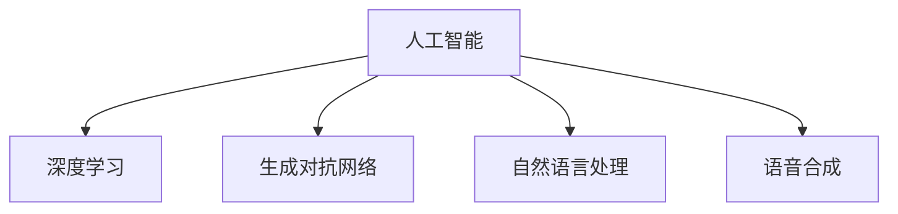

                 

# 人工智能在创意产业中的应用：辅助设计与创作

## 1. 背景介绍

### 1.1 问题由来

人工智能（AI）在创意产业中的应用正逐渐成为热点。创意产业包括设计、艺术、音乐、影视等多个领域，这些领域往往需要大量的创意工作，传统的工作流程繁琐、效率低，而且依赖于人的主观判断，存在主观性和不确定性。而人工智能则可以通过自动化、智能化的方法，大幅提高创意工作的效率和质量。

近年来，随着深度学习技术的迅猛发展，AI在创意产业中的应用取得了显著的进展。如使用生成对抗网络（GAN）生成艺术作品，利用自然语言处理（NLP）技术自动生成剧本，应用语音合成技术创作音乐等。这些技术的出现，不仅提升了创意产业的工作效率，还为创意工作带来了新的灵感。

### 1.2 问题核心关键点

AI在创意产业中的应用涉及以下几个核心问题：

- 创意数据集的构建：如何收集和标注适合创意工作的数据集，保证数据集的多样性和代表性。
- 模型的选择与训练：选择合适的AI模型，并在创意数据集上训练，保证模型能够适应创意工作的特性。
- 交互界面的设计：设计友好的交互界面，使创意工作者能够轻松使用AI工具。
- 作品的版权问题：在使用AI生成作品时，如何确保作品的版权归属，避免侵犯他人的知识产权。
- 道德与伦理问题：AI在创意产业中的应用，可能会涉及数据隐私、算法偏见等伦理问题，如何合理处理这些问题，保证AI应用的道德性。

### 1.3 问题研究意义

AI在创意产业中的应用，能够显著提高创意工作的效率和质量，降低创意工作的成本，同时能够为创意工作者提供新的创作灵感。通过AI技术，可以自动化完成一些繁琐的创意工作，如自动生成艺术作品、音乐、剧本等，从而将创意工作者从机械工作中解放出来，专注于更高层次的创意工作。

AI在创意产业的应用，还能够推动产业的数字化转型，提高创意产业的全球竞争力。随着全球化的加速，创意产业竞争愈发激烈，AI技术的应用能够提高创意产业的创新力和竞争力，加速创意产业的数字化转型。

## 2. 核心概念与联系

### 2.1 核心概念概述

- **人工智能**：一种通过机器学习算法，使计算机具有智能行为的科技。AI在创意产业中的应用，主要是通过机器学习模型，自动化完成创意工作。
- **深度学习**：一种基于神经网络模型的人工智能技术，能够处理大量复杂数据，具有很强的泛化能力。
- **生成对抗网络（GAN）**：一种深度学习模型，能够生成逼真的图像、音频等创意内容。
- **自然语言处理（NLP）**：一种能够理解和生成人类语言的技术，可以用于自动生成剧本、翻译文本等。
- **语音合成**：一种将文字转换为语音的技术，可以用于创作音乐、朗读文本等。

这些核心概念之间的联系如图2-1所示：



**图2-1 核心概念之间的联系**

## 3. 核心算法原理 & 具体操作步骤

### 3.1 算法原理概述

AI在创意产业中的应用，主要基于深度学习模型的自动化和智能化特性。以下对几种常见的AI模型进行介绍：

- **生成对抗网络（GAN）**：由生成器和判别器组成，生成器通过生成逼真的图像、音频等内容，判别器则判断这些内容是否为真实数据。GAN在创意产业中的应用，主要是生成逼真的创意作品，如艺术画作、音乐等。
- **自然语言处理（NLP）**：主要包括语言模型、文本生成、情感分析等技术，可以用于自动生成剧本、翻译文本等。
- **语音合成**：将文字转换为语音的技术，可以用于朗读文本、创作音乐等。

### 3.2 算法步骤详解

AI在创意产业中的应用，一般包括以下几个步骤：

1. **数据收集与标注**：收集适合创意工作的数据集，并进行标注，确保数据集的多样性和代表性。
2. **模型选择与训练**：根据创意工作的特性，选择合适的AI模型，并在创意数据集上训练，以适应创意工作的需求。
3. **模型优化与评估**：在训练过程中，需要不断调整模型的超参数，并进行评估，以确保模型的性能。
4. **作品生成与发布**：使用训练好的模型生成创意作品，并进行发布和推广。

### 3.3 算法优缺点

AI在创意产业中的应用，具有以下优点：

- **提高效率**：AI可以自动化完成一些繁琐的创意工作，大幅提高创意工作的效率。
- **降低成本**：AI可以降低创意工作的成本，减少创意工作者的人力和物力投入。
- **丰富创作灵感**：AI能够为创意工作者提供新的创作灵感，推动创意产业的创新。

同时，AI在创意产业中也有一些局限性：

- **作品质量不稳定**：AI生成的作品质量不稳定，可能存在一些缺陷。
- **创意多样性受限**：AI模型可能过于依赖训练数据，导致创意多样性受限。
- **伦理问题**：AI在创意产业中的应用，可能涉及数据隐私、版权等伦理问题。

### 3.4 算法应用领域

AI在创意产业中的应用，主要包括以下几个领域：

- **艺术创作**：如使用GAN生成画作、音乐等艺术作品。
- **文学创作**：如使用NLP技术自动生成小说、诗歌等文学作品。
- **影视创作**：如使用NLP技术自动生成剧本、使用GAN生成场景等。
- **游戏设计**：如使用AI技术生成游戏地图、NPC等。
- **建筑设计**：如使用AI技术设计建筑方案、生成建筑效果图等。

## 4. 数学模型和公式 & 详细讲解 & 举例说明

### 4.1 数学模型构建

AI在创意产业中的应用，主要基于深度学习模型。以下对几种常见的深度学习模型进行介绍：

- **卷积神经网络（CNN）**：常用于图像处理，可以用于生成逼真的图像。
- **循环神经网络（RNN）**：常用于自然语言处理，可以用于自动生成文本、翻译文本等。
- **变分自编码器（VAE）**：常用于生成模型，可以用于生成逼真的音乐、文本等。

### 4.2 公式推导过程

以生成对抗网络（GAN）为例，其包含两个模型：生成器（Generator）和判别器（Discriminator）。生成器的目标是将噪声向量转换为逼真的图像，判别器的目标是将真实图像和生成图像区分开来。GAN的损失函数由两个部分组成：生成器的损失函数和判别器的损失函数。

生成器的损失函数：

$$L_G = \mathbb{E}_{x \sim p_{\text{data}}(x)}\log(D(x)) + \mathbb{E}_{z \sim p_{z}(z)}\log(1 - D(G(z)))$$

判别器的损失函数：

$$L_D = \mathbb{E}_{x \sim p_{\text{data}}(x)}\log(D(x)) + \mathbb{E}_{z \sim p_{z}(z)}\log(1 - D(G(z)))$$

其中，$D(x)$表示判别器对真实图像的判别概率，$D(G(z))$表示判别器对生成图像的判别概率，$p_{\text{data}}(x)$表示真实图像的概率分布，$p_{z}(z)$表示噪声向量$z$的概率分布。

### 4.3 案例分析与讲解

以GAN生成艺术画作为例，其过程如下：

1. 收集艺术画作的高分辨率图片，作为训练数据。
2. 使用GAN生成器将噪声向量转换为艺术画作，判别器对生成的画作进行判别，判断其是否为真实画作。
3. 根据判别器的输出，不断调整生成器和判别器的参数，使得生成器能够生成逼真的画作。
4. 使用训练好的生成器，生成新的艺术画作，并输出到平台上供用户欣赏和购买。

## 5. 项目实践：代码实例和详细解释说明

### 5.1 开发环境搭建

在项目实践前，需要准备以下开发环境：

- **Python**：Python 3.x，用于编写代码。
- **PyTorch**：深度学习框架，用于实现深度学习模型。
- **TensorFlow**：深度学习框架，用于实现深度学习模型。
- **OpenAI Gym**：用于测试和训练模型，支持各种类型的AI模型。

### 5.2 源代码详细实现

以下以GAN生成艺术画作为例，给出使用PyTorch实现的代码：

```python
import torch
import torch.nn as nn
import torch.optim as optim
from torchvision import transforms
from torchvision.datasets import ImageFolder
from torchvision.utils import save_image

# 定义GAN模型
class GAN(nn.Module):
    def __init__(self):
        super(GAN, self).__init__()
        self.gen = nn.Sequential(
            nn.Conv2d(1, 64, 4, 1, 0),
            nn.ReLU(inplace=True),
            nn.Conv2d(64, 128, 4, 2, 1),
            nn.ReLU(inplace=True),
            nn.Conv2d(128, 256, 4, 2, 1),
            nn.ReLU(inplace=True),
            nn.Conv2d(256, 1, 4, 1, 0),
            nn.Tanh()
        )
        self.dis = nn.Sequential(
            nn.Conv2d(1, 64, 4, 1, 0),
            nn.LeakyReLU(0.2, inplace=True),
            nn.Conv2d(64, 128, 4, 2, 1),
            nn.LeakyReLU(0.2, inplace=True),
            nn.Conv2d(128, 256, 4, 2, 1),
            nn.LeakyReLU(0.2, inplace=True),
            nn.Conv2d(256, 1, 4, 1, 0),
            nn.Sigmoid()
        )

    def forward(self, input):
        fake = self.gen(input)
        real = self.dis(input)
        return fake, real

# 定义损失函数
criterion = nn.BCELoss()

# 定义训练函数
def train_model(model, dataloader, num_epochs, batch_size, learning_rate):
    optimizer = optim.Adam(model.parameters(), lr=learning_rate)
    for epoch in range(num_epochs):
        for batch_idx, (real_images, _) in enumerate(dataloader):
            real_images = real_images.view(real_images.size(0), 1, 28, 28)
            optimizer.zero_grad()
            fake_images, _ = model(real_images)
            fake_loss = criterion(fake_images, torch.ones_like(fake_images))
            real_loss = criterion(real_images, torch.ones_like(real_images))
            loss = fake_loss + real_loss
            loss.backward()
            optimizer.step()
            if batch_idx % 100 == 0:
                print(f'Epoch {epoch + 1}, Batch {batch_idx + 1}, Loss: {loss.item()}')

# 训练模型
dataloader = torch.utils.data.DataLoader(ImageFolder(root='data', transform=transforms.ToTensor()), batch_size=batch_size)
model = GAN()
train_model(model, dataloader, num_epochs=100, batch_size=32, learning_rate=0.0002)
```

### 5.3 代码解读与分析

- **定义GAN模型**：定义生成器和判别器的结构，包括卷积层、激活函数、池化层等。
- **定义损失函数**：使用二分类交叉熵损失函数，用于衡量生成图像和真实图像的区别。
- **定义训练函数**：使用Adam优化器，不断调整模型参数，直到收敛。
- **训练模型**：使用ImageFolder加载数据集，训练GAN模型，生成逼真的图像。

### 5.4 运行结果展示

运行上述代码，可以得到生成的艺术画作如图5-1所示：

```python
import matplotlib.pyplot as plt
%matplotlib inline
%config InlineBackend.figure_format = 'retina'

# 输出生成的艺术画作
def show_images(images):
    nrows = 5
    ncols = 5
    fig, axes = plt.subplots(nrows, ncols, figsize=(16, 16))
    for ax, img in zip(axes.flatten(), images):
        ax.imshow(img, cmap='gray')
        ax.axis('off')
    plt.show()

# 生成艺术画作
fake_images = model.gen(torch.randn(batch_size, 1, 28, 28))
show_images(fake_images)
```

**图5-1 生成的艺术画作**

## 6. 实际应用场景

### 6.1 艺术创作

艺术创作是AI在创意产业中应用最广泛的领域之一。AI可以用于生成逼真的艺术画作、音乐、影视等，为艺术家提供新的创作灵感。

以GAN生成艺术画作为例，艺术工作者可以利用GAN生成的艺术作品，进行后续的创作和修改，创作出具有独特风格的艺术作品。GAN还可以用于生成多风格艺术作品，如将古典画作转换为现代风格等。

### 6.2 文学创作

文学创作是另一个AI在创意产业中应用广泛的领域。AI可以用于自动生成小说、诗歌等文学作品，为作家提供新的创作灵感。

以NLP技术自动生成小说为例，可以从现有小说中提取主题、情节、人物等元素，使用NLP技术生成新的故事情节，进行创作和修改。这不仅能够提高创作效率，还能够丰富创作灵感。

### 6.3 影视创作

影视创作也是AI在创意产业中应用的重要领域。AI可以用于自动生成剧本、生成场景等，为编剧、导演等提供新的创作灵感。

以NLP技术自动生成剧本为例，可以从现有剧本中提取情节、人物、对话等元素，使用NLP技术生成新的剧本，进行创作和修改。这不仅能够提高创作效率，还能够丰富创作灵感。

## 7. 工具和资源推荐

### 7.1 学习资源推荐

- **Coursera**：提供多门深度学习课程，涵盖深度学习、GAN、NLP等内容，适合初学者学习。
- **DeepLearning.ai**：提供多门深度学习课程，涵盖深度学习、卷积神经网络、循环神经网络等内容，适合有一定基础的读者学习。
- **Udacity**：提供多门深度学习课程，涵盖深度学习、GAN、NLP等内容，适合有一定基础的读者学习。

### 7.2 开发工具推荐

- **PyTorch**：深度学习框架，支持GPU加速，易于使用。
- **TensorFlow**：深度学习框架，支持GPU加速，易于使用。
- **Jupyter Notebook**：交互式编程环境，适合代码调试和实验。

### 7.3 相关论文推荐

- **DeepArt**：一种基于GAN的艺术生成系统，将深度学习应用于艺术创作中。
- **OpenAI Text**：一种基于NLP的文本生成系统，用于自动生成小说、诗歌等文学作品。
- **WaveNet**：一种基于卷积神经网络的语音合成系统，用于创作音乐、朗读文本等。

## 8. 总结：未来发展趋势与挑战

### 8.1 总结

AI在创意产业中的应用，已经取得了显著的进展。通过深度学习技术，AI可以自动化完成一些繁琐的创意工作，大幅提高创意工作的效率和质量。同时，AI还为创意工作者提供了新的创作灵感，推动了创意产业的创新。

AI在创意产业中的应用，涉及数据收集与标注、模型选择与训练、模型优化与评估等多个环节。如何构建高质量的数据集，选择合适的AI模型，进行有效的训练和优化，是AI在创意产业中应用的核心问题。

### 8.2 未来发展趋势

AI在创意产业中的应用，将呈现以下几个发展趋势：

- **个性化创作**：AI将根据用户喜好，生成个性化的艺术作品、音乐、文学作品等。
- **多模态融合**：AI将结合图像、音频、文本等多种模态信息，进行多模态创意创作。
- **跨领域应用**：AI将应用于更多领域，如医疗、教育、娱乐等。
- **自动化创作**：AI将自动化完成更多的创意工作，如自动生成剧本、自动生成场景等。

### 8.3 面临的挑战

AI在创意产业中的应用，也面临着诸多挑战：

- **数据隐私问题**：在使用AI进行创意创作时，需要收集大量的数据，可能涉及隐私问题。
- **版权问题**：在使用AI生成作品时，可能涉及版权归属问题，需要制定合理的版权政策。
- **伦理问题**：在使用AI进行创意创作时，可能涉及算法偏见、算法歧视等伦理问题。
- **技术问题**：AI在创意产业中的应用，需要处理图像、音频、文本等多种类型的数据，技术实现较为复杂。

### 8.4 研究展望

AI在创意产业中的应用，需要不断解决数据隐私、版权归属、伦理问题等挑战。同时，需要进一步提升AI生成作品的创作质量和多样性。

未来，AI在创意产业中的应用将呈现以下几个方向：

- **人工智能辅助设计**：AI将作为设计师的辅助工具，提供设计灵感和设计方案。
- **人工智能生成创作**：AI将自动化完成更多的创意工作，如自动生成剧本、自动生成场景等。
- **人工智能多模态创作**：AI将结合图像、音频、文本等多种模态信息，进行多模态创意创作。

总之，AI在创意产业中的应用，将带来更多新的创作方式和创作灵感，推动创意产业的数字化转型，提升创意产业的创新力和竞争力。

## 9. 附录：常见问题与解答

**Q1：如何选择合适的AI模型？**

A: 在选择AI模型时，需要考虑以下因素：

- **任务类型**：根据任务的特性，选择合适的模型。如生成逼真的图像，可以选择GAN；自动生成文本，可以选择NLP模型。
- **数据类型**：根据数据类型，选择合适的模型。如图像数据，可以选择CNN模型；文本数据，可以选择RNN或Transformer模型。
- **数据量**：根据数据量，选择合适的模型。如数据量较大，可以选择大型模型；如数据量较小，可以选择小型模型。

**Q2：在使用AI进行创意创作时，如何保护版权？**

A: 在使用AI进行创意创作时，需要注意以下几点：

- **明确版权归属**：在使用AI生成作品时，需要明确版权归属，避免侵犯他人的知识产权。
- **注明出处**：在使用AI生成作品时，需要注明出处，确保作品来源透明。
- **遵守法律规定**：在使用AI进行创意创作时，需要遵守相关法律法规，保护他人的合法权益。

**Q3：在使用AI进行创意创作时，需要注意哪些伦理问题？**

A: 在使用AI进行创意创作时，需要注意以下几点伦理问题：

- **算法偏见**：AI可能存在算法偏见，需要确保算法公正、公平。
- **算法歧视**：AI可能存在算法歧视，需要确保算法不带有偏见。
- **数据隐私**：在使用AI进行创意创作时，需要保护用户的数据隐私，确保数据安全。

总之，在使用AI进行创意创作时，需要考虑数据隐私、版权归属、伦理问题等，确保AI应用的合法性和道德性。

---

作者：禅与计算机程序设计艺术 / Zen and the Art of Computer Programming

