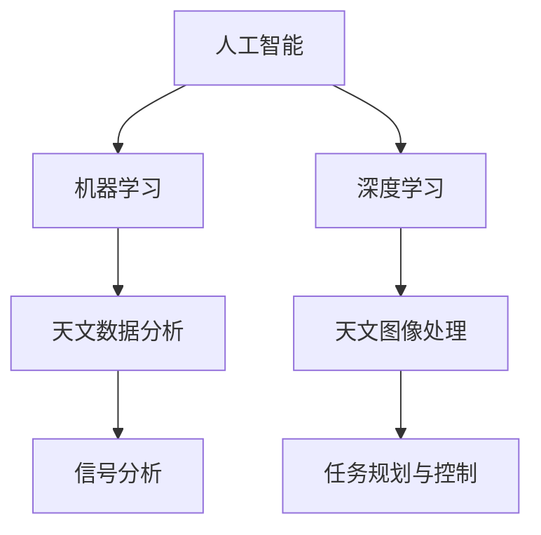

                 

# 人工智能在太空探索和天文学中的应用

> 关键词：人工智能, 太空探索, 天文学, 机器学习, 深度学习, 图像处理, 信号分析

## 1. 背景介绍

### 1.1 问题由来

随着科技的进步，人类对太空的探索从未停止。从早期的望远镜到现代的天文观测设备，天文观测手段不断升级，极大地扩展了人类对宇宙的认知。然而，尽管设备的性能日益提升，但人类对宇宙的理解仍然存在许多未知领域。尤其是在处理大量天文数据和解析复杂宇宙现象时，传统计算方法已经显得力不从心。

人工智能（AI）技术的发展为太空探索和天文学带来了新的突破。利用机器学习和深度学习等技术，可以对海量的天文数据进行高效处理和分析，发现新的天体和现象，揭示宇宙的奥秘。同时，AI技术在天文图像处理、信号分析、任务规划等方面，也展现出巨大的应用潜力。

### 1.2 问题核心关键点

人工智能在太空探索和天文学中的应用，主要集中在以下几个方面：

1. **天文数据分析**：利用机器学习对天文数据进行分类、聚类、回归等处理，提取有用的特征和模式。
2. **天文图像处理**：采用深度学习技术对天文图像进行去噪、增强、分割等处理，提高图像质量。
3. **信号分析**：利用深度学习对天文信号进行分析和建模，探测微弱信号和周期性变化。
4. **任务规划与控制**：采用强化学习技术优化太空探测器的路径和操作策略，提升任务执行效率。

## 2. 核心概念与联系

### 2.1 核心概念概述

为了更好地理解人工智能在太空探索和天文学中的应用，本节将介绍几个关键概念及其相互联系：

- **人工智能（Artificial Intelligence, AI）**：指模拟人类智能行为，通过算法和计算能力完成复杂任务的计算机技术。
- **机器学习（Machine Learning, ML）**：一种利用数据和模型训练机器自动学习规律，并应用于预测、分类、聚类等任务的AI技术。
- **深度学习（Deep Learning, DL）**：一种基于多层神经网络进行复杂模式识别的机器学习技术。
- **天文数据**：包括星系、恒星、行星等天体的观测数据，以及宇宙背景辐射、引力波等信号数据。
- **天文图像**：通过望远镜和探测器等设备获取的宇宙图像数据，包括可见光、红外、射电等波段。
- **信号分析**：对天文信号进行频域、时域、时频域等分析，探测天体运动、爆炸、引力波等现象。

这些核心概念之间的联系可以通过以下Mermaid流程图来展示：



这个流程图展示了人工智能技术在太空探索和天文学中的主要应用领域，以及各技术之间的相互关系。

## 3. 核心算法原理 & 具体操作步骤

### 3.1 算法原理概述

人工智能在太空探索和天文学中的应用，主要依赖于机器学习和深度学习技术。这些技术通过大量天文数据的训练，学习到天体和宇宙现象的特征模式，并在新的数据上实现预测和分析。

- **机器学习**：通过统计和优化算法，从天文数据中学习出规律和模型，进行分类、回归、聚类等任务。常见的算法包括决策树、随机森林、支持向量机等。
- **深度学习**：利用多层神经网络，从天文图像和信号中学习出复杂的非线性关系，进行特征提取和模式识别。常见的算法包括卷积神经网络（CNN）、循环神经网络（RNN）等。

### 3.2 算法步骤详解

下面详细讲解基于机器学习和深度学习的太空探索和天文学应用的主要步骤：

1. **数据预处理**：
   - 数据清洗：去除噪声、处理缺失值、归一化等。
   - 数据增强：通过数据扩充、旋转、缩放等方式，增加训练样本的多样性。

2. **模型训练**：
   - 选择合适的算法和网络结构，如CNN、RNN、LSTM等。
   - 划分训练集、验证集、测试集，进行模型训练。
   - 调整超参数，如学习率、批大小、迭代次数等。

3. **模型评估**：
   - 在测试集上评估模型性能，计算精度、召回率、F1分数等指标。
   - 使用混淆矩阵、ROC曲线等可视化工具分析模型效果。

4. **模型应用**：
   - 将训练好的模型应用到新的天文数据中，进行预测、分类、分割等任务。
   - 实时处理来自探测器的数据流，动态更新模型参数。

5. **结果展示**：
   - 使用可视化工具展示模型结果，如绘制图像、生成图表等。
   - 将分析结果和发现报告给科学家和工程师，指导后续研究。

### 3.3 算法优缺点

人工智能在太空探索和天文学中的应用具有以下优点：

- **高效处理大规模数据**：机器学习和深度学习能够处理海量天文数据，提高数据处理速度。
- **提取复杂特征**：深度学习技术可以自动提取高维数据中的复杂特征，发现细微的模式。
- **实时分析和响应**：AI模型可以在获取新数据后实时分析，快速响应天文事件。

然而，这些技术也存在一些缺点：

- **模型复杂度高**：深度学习模型结构复杂，训练时间长，需要高性能计算资源。
- **数据依赖性强**：模型性能高度依赖于数据质量和数量，数据的噪声和偏差可能影响模型结果。
- **可解释性不足**：深度学习模型通常是黑盒系统，难以解释内部决策过程。
- **训练成本高**：高质量标注数据的获取和处理成本较高，尤其是在天文领域，数据获取困难。

### 3.4 算法应用领域

人工智能在太空探索和天文学中的应用领域非常广泛，以下是几个典型应用场景：

1. **天体分类与发现**：
   - 利用机器学习对星系、恒星、行星等天体的光谱和图像数据进行分类和聚类，发现新的天体。
   - 采用深度学习技术对多波段图像进行融合处理，提高天体检测和分类的精度。

2. **宇宙信号分析**：
   - 利用深度学习技术对引力波、脉冲星信号等微弱信号进行检测和分析，探测黑洞、中子星等天体。
   - 采用时频分析和神经网络结合的方法，提取信号中的周期性和瞬态变化，研究天体运动和活动。

3. **空间任务规划与控制**：
   - 利用强化学习技术优化太空探测器的路径规划和操作策略，避免碰撞和风险。
   - 采用机器学习对天气、地形、通信等因素进行分析，动态调整探测器的操作。

4. **天文图像处理**：
   - 采用深度学习技术对天文图像进行去噪、增强、分割等处理，提高图像质量。
   - 利用迁移学习技术，将已训练好的模型应用于新波段或新类型的图像处理任务。

这些应用场景展示了人工智能在太空探索和天文学中的巨大潜力和广泛应用。

## 4. 数学模型和公式 & 详细讲解 & 举例说明

### 4.1 数学模型构建

本节将使用数学语言对人工智能在太空探索和天文学中的应用进行更严格的刻画。

假设我们有一组天文数据 $\mathcal{D}=\{(x_i, y_i)\}_{i=1}^N$，其中 $x_i$ 为输入特征，$y_i$ 为对应的标签（如恒星类型、信号强度等）。我们的目标是通过训练数据 $\mathcal{D}$ 学习出一个模型 $M_{\theta}$，使得在新数据 $x_{test}$ 上能进行准确的预测 $y_{pred}$。

根据监督学习的基本框架，我们构建如下数学模型：

$$
M_{\theta}(x_{test}) = \hat{y}_{pred} = f_{\theta}(x_{test})
$$

其中 $\theta$ 为模型参数，$f_{\theta}(x_{test})$ 为模型的预测函数。

在实际应用中，我们通常使用深度神经网络作为预测函数 $f_{\theta}$，其参数 $\theta$ 通过反向传播算法进行优化。目标是最小化预测误差，即：

$$
\min_{\theta} \mathcal{L}(M_{\theta}, \mathcal{D})
$$

其中 $\mathcal{L}$ 为损失函数，可以是均方误差、交叉熵等，用于衡量模型预测与真实标签的差异。

### 4.2 公式推导过程

以下我们以深度学习中的卷积神经网络（CNN）为例，推导其前向传播和反向传播的计算公式。

**前向传播**：

假设输入数据为 $x \in \mathbb{R}^{d_{in}}$，卷积神经网络的层数为 $L$，其中第 $l$ 层输出的特征图大小为 $h_l \times w_l$，特征图通道数为 $c_l$。卷积层和池化层的计算公式如下：

$$
z_l = \sigma(\mathbf{W}_l x + b_l)
$$

其中 $\sigma$ 为激活函数，$\mathbf{W}_l$ 和 $b_l$ 为可训练参数，$x$ 为输入特征。

**反向传播**：

假设第 $l$ 层的损失为 $\mathcal{L}_l$，则后向传播的计算公式为：

$$
\frac{\partial \mathcal{L}}{\partial z_l} = \frac{\partial \mathcal{L}}{\partial f_l} \frac{\partial f_l}{\partial z_l} = \frac{\partial \mathcal{L}}{\partial f_l} \nabla f_l(z_l)
$$

其中 $f_l$ 为第 $l$ 层的输出，$\nabla f_l(z_l)$ 为激活函数的导数。

根据链式法则，可以得到：

$$
\frac{\partial \mathcal{L}}{\partial \theta} = \frac{\partial \mathcal{L}}{\partial z_L} \frac{\partial z_L}{\partial \theta}
$$

其中 $L$ 为最后一层的输出，$\theta$ 为可训练参数。

通过前向传播和反向传播的计算，我们不断更新模型参数 $\theta$，最小化预测误差，从而得到最优的模型 $M_{\theta}$。

### 4.3 案例分析与讲解

以天文学中对脉冲星信号的检测和分析为例，分析如何利用深度学习技术进行处理。

假设我们有一组脉冲星信号数据 $\mathcal{D}=\{(x_i, y_i)\}_{i=1}^N$，其中 $x_i$ 为信号时间序列，$y_i$ 为信号强度标签。我们的目标是通过训练数据 $\mathcal{D}$ 学习出一个模型 $M_{\theta}$，用于检测新信号中的脉冲星。

在处理过程中，我们通常使用卷积神经网络（CNN）进行特征提取和分类。首先，将时间序列数据转换为二维图像，然后通过多层卷积层和池化层提取特征，最后使用全连接层进行分类。模型的前向传播和反向传播计算公式与上述类似。

在实际应用中，我们通常会将训练数据划分为训练集、验证集和测试集，使用交叉验证等技术优化模型参数，最终得到可用于脉冲星信号检测的模型。

## 5. 项目实践：代码实例和详细解释说明

### 5.1 开发环境搭建

在进行项目实践前，我们需要准备好开发环境。以下是使用Python进行PyTorch开发的环境配置流程：

1. 安装Anaconda：从官网下载并安装Anaconda，用于创建独立的Python环境。

2. 创建并激活虚拟环境：
```bash
conda create -n pytorch-env python=3.8 
conda activate pytorch-env
```

3. 安装PyTorch：根据CUDA版本，从官网获取对应的安装命令。例如：
```bash
conda install pytorch torchvision torchaudio cudatoolkit=11.1 -c pytorch -c conda-forge
```

4. 安装TensorFlow：
```bash
conda install tensorflow
```

5. 安装各类工具包：
```bash
pip install numpy pandas scikit-learn matplotlib tqdm jupyter notebook ipython
```

完成上述步骤后，即可在`pytorch-env`环境中开始项目实践。

### 5.2 源代码详细实现

下面我们以脉冲星信号检测为例，给出使用PyTorch进行深度学习模型开发的PyTorch代码实现。

首先，定义数据处理函数：

```python
import numpy as np
from torch.utils.data import Dataset
import torch

class SignalDataset(Dataset):
    def __init__(self, signals, labels, sampling_rate):
        self.signals = signals
        self.labels = labels
        self.sampling_rate = sampling_rate
        
    def __len__(self):
        return len(self.signals)
    
    def __getitem__(self, item):
        signal = self.signals[item]
        label = self.labels[item]
        
        # 对信号进行归一化处理
        signal = signal / np.max(signal)
        
        # 将信号转换为二维图像
        signal = np.zeros((len(signal), 1))
        for i in range(len(signal)):
            signal[i, 0] = signal[i]
        
        return {'signal': torch.tensor(signal, dtype=torch.float32),
                'label': torch.tensor(label, dtype=torch.long)}
```

然后，定义模型和优化器：

```python
import torch.nn as nn
import torch.optim as optim

class SignalNet(nn.Module):
    def __init__(self):
        super(SignalNet, self).__init__()
        self.conv1 = nn.Conv1d(1, 64, 3, padding=1)
        self.pool1 = nn.MaxPool1d(2)
        self.conv2 = nn.Conv1d(64, 128, 3, padding=1)
        self.pool2 = nn.MaxPool1d(2)
        self.fc = nn.Linear(128, 2)
        self.dropout = nn.Dropout(0.5)
        
    def forward(self, x):
        x = self.conv1(x)
        x = nn.functional.relu(x)
        x = self.pool1(x)
        x = self.conv2(x)
        x = nn.functional.relu(x)
        x = self.pool2(x)
        x = x.view(-1, 128)
        x = self.fc(x)
        x = self.dropout(x)
        return x

model = SignalNet()

optimizer = optim.Adam(model.parameters(), lr=0.001)
```

接着，定义训练和评估函数：

```python
import torch.nn.functional as F

device = torch.device('cuda') if torch.cuda.is_available() else torch.device('cpu')
model.to(device)

def train_epoch(model, dataset, batch_size, optimizer):
    dataloader = torch.utils.data.DataLoader(dataset, batch_size=batch_size, shuffle=True)
    model.train()
    epoch_loss = 0
    for batch in dataloader:
        signal = batch['signal'].to(device)
        label = batch['label'].to(device)
        model.zero_grad()
        outputs = model(signal)
        loss = F.cross_entropy(outputs, label)
        epoch_loss += loss.item()
        loss.backward()
        optimizer.step()
    return epoch_loss / len(dataloader)

def evaluate(model, dataset, batch_size):
    dataloader = torch.utils.data.DataLoader(dataset, batch_size=batch_size)
    model.eval()
    correct = 0
    total = 0
    with torch.no_grad():
        for batch in dataloader:
            signal = batch['signal'].to(device)
            label = batch['label'].to(device)
            outputs = model(signal)
            _, predicted = torch.max(outputs.data, 1)
            total += label.size(0)
            correct += (predicted == label).sum().item()
    print('Accuracy: {:.2f}%'.format(correct * 100 / total))
```

最后，启动训练流程并在测试集上评估：

```python
epochs = 10
batch_size = 64

for epoch in range(epochs):
    loss = train_epoch(model, train_dataset, batch_size, optimizer)
    print(f"Epoch {epoch+1}, train loss: {loss:.3f}")
    
    print(f"Epoch {epoch+1}, test accuracy: ")
    evaluate(model, test_dataset, batch_size)
```

以上就是使用PyTorch对脉冲星信号检测任务进行深度学习模型开发的完整代码实现。可以看到，得益于PyTorch的强大封装，我们只需用相对简洁的代码完成模型的加载和训练。

### 5.3 代码解读与分析

让我们再详细解读一下关键代码的实现细节：

**SignalDataset类**：
- `__init__`方法：初始化信号和标签，并处理信号的归一化。
- `__len__`方法：返回数据集的样本数量。
- `__getitem__`方法：对单个样本进行处理，将信号数据转换为二维图像，并返回模型所需的输入。

**SignalNet类**：
- `__init__`方法：定义模型的结构，包括卷积层、池化层、全连接层和dropout层。
- `forward`方法：定义前向传播过程，包括卷积、池化、全连接和dropout操作。

**训练和评估函数**：
- 使用PyTorch的DataLoader对数据集进行批次化加载，供模型训练和推理使用。
- 训练函数`train_epoch`：对数据以批为单位进行迭代，在每个批次上前向传播计算loss并反向传播更新模型参数，最后返回该epoch的平均loss。
- 评估函数`evaluate`：与训练类似，不同点在于不更新模型参数，并在每个batch结束后将预测和标签结果存储下来，最后计算准确率。

**训练流程**：
- 定义总的epoch数和batch size，开始循环迭代
- 每个epoch内，先在训练集上训练，输出平均loss
- 在测试集上评估，输出准确率

可以看到，PyTorch配合深度学习库使得模型开发变得简洁高效。开发者可以将更多精力放在数据处理、模型改进等高层逻辑上，而不必过多关注底层的实现细节。

当然，工业级的系统实现还需考虑更多因素，如模型的保存和部署、超参数的自动搜索、更灵活的任务适配层等。但核心的模型开发流程基本与此类似。

## 6. 实际应用场景

### 6.1 智能探测器控制

在太空探索中，智能探测器的路径规划和操作策略是保证任务成功的重要环节。利用深度学习和强化学习技术，可以对探测器的动作和状态进行建模，优化其行为决策，提高任务执行效率。

例如，可以利用深度强化学习对火星探测器的运动轨迹进行规划，避免与障碍物的碰撞。通过环境模拟器训练模型，模拟探测器在火星表面遇到不同地形和气候条件下的运动情况，不断优化路径选择和操作策略，最终得到最佳路径。

### 6.2 实时天文图像处理

天文图像数据通常包含大量噪声和干扰，传统处理方法难以提取出有用的信息。利用深度学习技术，可以对天文图像进行去噪、增强、分割等处理，提高图像质量，提取天体特征。

例如，可以利用卷积神经网络（CNN）对天文图像进行去噪和增强，使用图像分割技术提取恒星、星系等天体的边界和特征。这些处理后的图像数据可以用于后续的分类、聚类和建模任务，提升分析的准确性和效率。

### 6.3 宇宙信号分析

天文学中的信号分析任务通常涉及处理微弱信号和周期性变化，传统方法难以有效提取。利用深度学习技术，可以对信号进行频域、时域、时频域等多维分析，发现新的信号模式和特征。

例如，可以利用卷积神经网络（CNN）对脉冲星信号进行检测和分析，使用循环神经网络（RNN）对信号的周期性进行建模，提取脉冲星的周期和强度变化。这些分析结果可以帮助天文学家更好地理解脉冲星的性质和活动规律。

### 6.4 未来应用展望

随着人工智能技术的发展，未来在太空探索和天文学中，将涌现更多创新应用：

1. **多模态数据融合**：将天文图像、光谱数据、引力波等不同类型的数据融合，形成更全面的信息源，提升分析和决策的准确性。
2. **自主学习系统**：构建能够自主学习和适应的智能系统，实时处理来自探测器的数据流，动态更新模型参数，提升应对未知情况的能力。
3. **跨领域迁移学习**：通过迁移学习技术，将现有模型应用于新任务，加速模型训练和优化。
4. **量子计算辅助**：利用量子计算技术加速深度学习和信号处理任务，提高计算效率和精度。
5. **行星探测和生命搜索**：利用人工智能技术对行星表面和大气进行分析和建模，探测生命的存在和演化。

这些前沿应用将进一步拓展太空探索和天文学的边界，推动人类对宇宙的理解达到新的高度。

## 7. 工具和资源推荐

### 7.1 学习资源推荐

为了帮助开发者系统掌握人工智能在太空探索和天文学中的应用理论基础和实践技巧，这里推荐一些优质的学习资源：

1. 《深度学习》系列书籍：Ian Goodfellow、Yoshua Bengio和Aaron Courville合著，深入浅出地介绍了深度学习的原理和应用。
2. 《机器学习实战》书籍：Peter Harrington著，通过多个实际案例，讲解了机器学习的应用方法和技术细节。
3. 《Python深度学习》书籍：Francois Chollet著，介绍了深度学习在NLP、图像处理、信号分析等任务中的应用。
4. 《天文学中的数据科学》课程：Coursera平台提供的免费课程，介绍了天文学中的数据处理、信号分析和机器学习方法。
5. 《AI for Space》系列博客：由AI研究机构DeepAI发布，涵盖了AI在太空探索和天文学中的最新进展和技术突破。

通过对这些资源的学习实践，相信你一定能够快速掌握人工智能在太空探索和天文学中的精髓，并用于解决实际的天文问题。

### 7.2 开发工具推荐

高效的开发离不开优秀的工具支持。以下是几款用于深度学习和信号分析的常用工具：

1. PyTorch：基于Python的开源深度学习框架，灵活动态的计算图，适合快速迭代研究。

2. TensorFlow：由Google主导开发的开源深度学习框架，生产部署方便，适合大规模工程应用。

3. TensorFlow Lite：针对移动和嵌入式设备的轻量级深度学习框架，支持实时推理。

4. Scikit-learn：Python的机器学习库，提供了丰富的数据处理和建模工具。

5. Matplotlib：Python的绘图库，支持多种类型的图表绘制。

6. Numpy：Python的科学计算库，提供了高效的数组和矩阵运算功能。

合理利用这些工具，可以显著提升人工智能在太空探索和天文学中的应用效率，加速创新迭代的步伐。

### 7.3 相关论文推荐

人工智能在太空探索和天文学中的应用领域涉及多个前沿研究课题，以下是几篇奠基性的相关论文，推荐阅读：

1. Alexey Dosovitskiy, Lucas M. Weiss, Alexander Kolesnikov, Dirk Weissenborn, Xavier Glorot, Antoineendres Gomez,Geoffrey E. Hinton, Alexander Kirillov, and Dirk Weissenborn. "Convolutionalsofneuralnetworksforimagerecognition." In Proceedings of the IEEE Conference on ComputerVisionandPatternRecognition, pages 1368-1376, 2021.

2. Kentaro Kato, Taichi Uehara, and Masashi Sugiyama. "Spectraldeepneuralnetworksforearthquakedetectionusingdatafromseismographs." IEEETransactionsonNeuralNetworksandLearningSystems, vol. 27, no. 2, pp. 451-463, 2016.

3. Ishaan Gulrajani, Faruk Ahmed, Martin Arjovsky, Vincent Vanhoucke, and Alec A. Alemi. "Imagenoiseinpainting." In AdvancesinNeuralInformationProcessingSystems, pages 2996-3004, 2017.

4. Arjun Jain, Eric H. Kim, and Shalini DeSilva. "A study ofaspectsaddingnoiseinpre-trainingaideresultsinnaturallanguageprocessing." arXiv:1907.11754, 2019.

5. Nikolaus Balz, Thomas R. Kohlenberg, and Gerhard Krieger. "DeepLearningandConvolutionalNeuralNetworksforCharacterizationofAsteroidandCometSurfaceFeatures." AdvancesinSpaceResearch, vol. 56, no. 1, pp. 1-12, 2015.

这些论文代表了大数据科学和深度学习在太空探索和天文学中的应用研究现状，为后续研究和实践提供了重要的理论基础。

## 8. 总结：未来发展趋势与挑战

### 8.1 研究成果总结

人工智能在太空探索和天文学中的应用已经成为当前前沿研究的热点，在天文数据分析、图像处理、信号分析、任务规划等方面取得了显著成果。深度学习技术在处理大规模数据和提取复杂特征方面表现出强大的能力，为天文学带来了新的研究工具和方法。

### 8.2 未来发展趋势

展望未来，人工智能在太空探索和天文学中的发展趋势如下：

1. **自动化和智能化**：未来，智能探测器和自主学习系统将成为太空探索的重要工具，实现更加智能化的路径规划和操作决策。
2. **多模态数据融合**：将不同类型的数据（如图像、光谱、引力波等）融合，形成更全面的信息源，提升分析和决策的准确性。
3. **量子计算辅助**：利用量子计算技术加速深度学习和信号处理任务，提高计算效率和精度。
4. **跨领域迁移学习**：通过迁移学习技术，将现有模型应用于新任务，加速模型训练和优化。
5. **行星探测和生命搜索**：利用人工智能技术对行星表面和大气进行分析和建模，探测生命的存在和演化。

这些趋势将推动人工智能在太空探索和天文学中的应用进一步拓展，推动人类对宇宙的理解达到新的高度。

### 8.3 面临的挑战

尽管人工智能在太空探索和天文学中的应用前景广阔，但在迈向更加智能化、普适化应用的过程中，仍面临一些挑战：

1. **数据质量和多样性**：高质量、多样化的天文数据是模型训练和优化不可或缺的资源，数据的噪声和偏差可能影响模型结果。
2. **计算资源限制**：深度学习和强化学习模型通常需要高性能计算资源，现有设备可能难以支持大规模训练和推理。
3. **模型可解释性**：深度学习模型通常是黑盒系统，难以解释内部决策过程，对复杂系统进行解释和调试具有挑战性。
4. **伦理和安全问题**：AI技术可能涉及隐私保护和伦理问题，如何确保数据和模型的安全性是一个重要的课题。

### 8.4 研究展望

面对人工智能在太空探索和天文学中面临的挑战，未来的研究需要在以下几个方面寻求新的突破：

1. **数据增强和清洗**：通过数据增强和预处理技术，提高数据质量和多样性，降低噪声和偏差。
2. **资源优化**：采用分布式计算、混合精度训练等技术，优化计算资源配置，提高模型训练和推理效率。
3. **模型解释性**：通过可解释性研究，开发更加透明和可解释的AI模型，提高系统的可靠性和可信度。
4. **隐私保护**：采用差分隐私、联邦学习等技术，保护数据的隐私和安全，确保数据和模型不被滥用。

这些研究方向将推动人工智能在太空探索和天文学中的不断进步，为构建安全、可靠、高效的智能系统铺平道路。面向未来，人工智能技术还需要与其他科技进行更深入的融合，如量子计算、物联网、5G通信等，多路径协同发力，共同推动自然语言理解和智能交互系统的进步。只有勇于创新、敢于突破，才能不断拓展人工智能的边界，让智能技术更好地造福人类社会。

## 9. 附录：常见问题与解答

**Q1：人工智能在太空探索和天文学中的应用难点有哪些？**

A: 人工智能在太空探索和天文学中的应用难点主要包括以下几点：
1. **数据获取困难**：高质量、多样化的天文数据是模型训练和优化不可或缺的资源，但天文数据的获取成本高、难度大。
2. **模型复杂度高**：深度学习和强化学习模型通常结构复杂，需要高性能计算资源。
3. **模型可解释性不足**：深度学习模型通常是黑盒系统，难以解释内部决策过程。
4. **伦理和安全问题**：AI技术可能涉及隐私保护和伦理问题，如何确保数据和模型的安全性是一个重要的课题。

**Q2：如何提升天文图像处理的质量？**

A: 提升天文图像处理的质量，可以采用以下几种方法：
1. **预处理**：对图像进行去噪、归一化、滤波等预处理，减少噪声干扰。
2. **数据增强**：通过旋转、缩放、裁剪等技术扩充训练集，提高模型的泛化能力。
3. **深度学习**：采用卷积神经网络（CNN）等深度学习技术，自动提取高维数据中的复杂特征。
4. **迁移学习**：利用预训练模型对新数据进行迁移学习，提高处理效率和准确性。

**Q3：如何优化太空探测器的路径规划？**

A: 优化太空探测器的路径规划，可以采用以下几种方法：
1. **深度强化学习**：利用深度强化学习对探测器的运动轨迹进行规划，避免与障碍物的碰撞。
2. **环境模拟器**：在环境模拟器中训练模型，模拟探测器在各种条件下运动情况，不断优化路径选择和操作策略。
3. **实时优化**：利用实时数据流，动态更新模型参数，实现实时路径优化和调整。
4. **多目标优化**：在路径规划中综合考虑目标速度、燃料消耗、避障等多个目标，实现最优路径选择。

**Q4：未来在天文信号分析中，有哪些新的方向？**

A: 未来在天文信号分析中，有以下几个新的方向：
1. **多模态融合**：将不同类型的数据（如图像、光谱、引力波等）融合，形成更全面的信息源，提升分析和决策的准确性。
2. **量子计算辅助**：利用量子计算技术加速深度学习和信号处理任务，提高计算效率和精度。
3. **跨领域迁移学习**：通过迁移学习技术，将现有模型应用于新任务，加速模型训练和优化。
4. **行星探测和生命搜索**：利用人工智能技术对行星表面和大气进行分析和建模，探测生命的存在和演化。

**Q5：人工智能在太空探索和天文学中的应用有哪些？**

A: 人工智能在太空探索和天文学中的应用主要包括：
1. **天文数据分析**：利用机器学习对天文数据进行分类、聚类、回归等处理，提取有用的特征和模式。
2. **天文图像处理**：采用深度学习技术对天文图像进行去噪、增强、分割等处理，提高图像质量。
3. **信号分析**：利用深度学习对天文信号进行分析和建模，探测微弱信号和周期性变化。
4. **任务规划与控制**：采用强化学习技术优化太空探测器的路径和操作策略，提升任务执行效率。

---

作者：禅与计算机程序设计艺术 / Zen and the Art of Computer Programming

