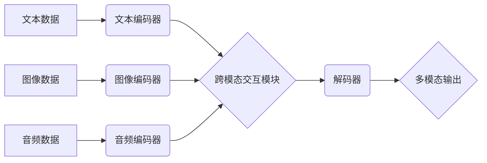

> 多模态大模型，自然语言处理，计算机视觉，音频处理，多媒体理解，深度学习，Transformer，BERT，GPT，部署环境

## 1. 背景介绍

近年来，人工智能技术取得了飞速发展，其中，多模态大模型（Multimodal Large Language Models，MLLMs）作为一种新兴的AI技术，展现出巨大的潜力。与传统的单模态大模型相比，MLLMs能够处理多种模态数据，例如文本、图像、音频等，并进行跨模态理解和生成。这使得MLLMs在许多领域，如智能客服、自动驾驶、医疗诊断等方面具有广泛的应用前景。

随着数据量的爆炸式增长和计算能力的提升，MLLMs的研究和应用日益受到关注。然而，构建和部署高效、准确的MLLMs仍然面临着诸多挑战，例如：

* **数据获取和预处理**: 多模态数据的获取和预处理难度较大，需要跨多个领域的数据资源和专业知识。
* **模型架构设计**: 如何设计一个能够有效融合不同模态信息的模型架构是一个关键问题。
* **训练方法**: 多模态数据的训练需要考虑模态之间的交互关系，需要开发新的训练方法和算法。
* **部署环境**: MLLMs通常具有庞大的模型规模，部署和推理效率是一个重要的考量因素。

## 2. 核心概念与联系

多模态大模型的核心概念是将不同模态的数据融合在一起，构建一个能够理解和生成多种模态信息的模型。

**2.1 多模态数据**

多模态数据是指包含多种不同类型数据的集合，例如文本、图像、音频、视频等。

**2.2 多模态融合**

多模态融合是指将不同模态的数据进行有效地结合，提取其潜在的关联信息，从而提升模型的理解和生成能力。

**2.3 多模态大模型架构**

多模态大模型的架构通常由以下几个部分组成：

* **模态编码器**: 负责将不同模态的数据编码成相应的向量表示。
* **跨模态交互模块**: 负责融合不同模态的向量表示，提取其之间的关联信息。
* **解码器**: 负责根据融合后的信息生成最终的输出，例如文本、图像、音频等。

**2.4 Mermaid 流程图**



## 3. 核心算法原理 & 具体操作步骤

### 3.1  算法原理概述

多模态大模型的训练通常基于深度学习算法，例如Transformer网络。Transformer网络能够有效地捕捉序列数据中的长距离依赖关系，因此非常适合处理文本、图像、音频等序列数据。

### 3.2  算法步骤详解

1. **数据预处理**: 将多模态数据进行清洗、格式化和编码，例如将文本数据转换为词向量，将图像数据转换为特征图等。
2. **模型训练**: 使用深度学习算法，例如Transformer网络，对预处理后的数据进行训练，学习不同模态之间的关联关系。
3. **模型评估**: 使用测试数据评估模型的性能，例如准确率、召回率、F1-score等。
4. **模型调优**: 根据评估结果，调整模型参数和训练策略，以提高模型性能。

### 3.3  算法优缺点

**优点**:

* 能够处理多种模态数据，提升模型的理解和生成能力。
* 能够捕捉数据之间的复杂关系，提高模型的准确性。

**缺点**:

* 数据获取和预处理难度较大。
* 模型训练成本高，需要大量的计算资源。
* 模型解释性较差，难以理解模型的决策过程。

### 3.4  算法应用领域

* **智能客服**: 能够理解用户的多模态输入，例如文本、语音、图像，并提供更精准的回复。
* **自动驾驶**: 能够理解道路场景的多模态信息，例如图像、激光雷达数据，提高自动驾驶系统的安全性。
* **医疗诊断**: 能够理解患者的病历、影像数据等多模态信息，辅助医生进行诊断。

## 4. 数学模型和公式 & 详细讲解 & 举例说明

### 4.1  数学模型构建

多模态大模型的数学模型通常基于深度学习框架，例如TensorFlow或PyTorch。模型的结构由多个层组成，每个层负责提取数据的特征信息。

### 4.2  公式推导过程

多模态大模型的训练目标通常是最大化模型的似然函数，即预测数据出现的概率。

$$
\mathcal{L} = -\sum_{i=1}^{N} \log p(x_i | \theta)
$$

其中，$\mathcal{L}$是损失函数，$N$是训练数据的数量，$x_i$是第$i$个训练数据，$\theta$是模型的参数。

### 4.3  案例分析与讲解

例如，在文本图像对分类任务中，模型的输出是一个概率分布，表示图像属于不同类别文本的概率。

$$
p(y_i | x_i, \theta) = \text{softmax}(W^T \cdot h(x_i, c_i))
$$

其中，$y_i$是第$i$个训练数据的标签，$h(x_i, c_i)$是文本和图像的融合特征，$W$是权重矩阵。

## 5. 项目实践：代码实例和详细解释说明

### 5.1  开发环境搭建

* **操作系统**: Ubuntu 20.04
* **CPU**: Intel Core i7
* **GPU**: NVIDIA GeForce RTX 3080
* **软件**: Python 3.8, TensorFlow 2.4, PyTorch 1.7

### 5.2  源代码详细实现

```python
import tensorflow as tf

# 定义文本编码器
class TextEncoder(tf.keras.Model):
    def __init__(self, vocab_size, embedding_dim, hidden_dim):
        super(TextEncoder, self).__init__()
        self.embedding = tf.keras.layers.Embedding(vocab_size, embedding_dim)
        self.lstm = tf.keras.layers.LSTM(hidden_dim)

    def call(self, inputs):
        x = self.embedding(inputs)
        x = self.lstm(x)
        return x

# 定义图像编码器
class ImageEncoder(tf.keras.Model):
    def __init__(self, image_size, embedding_dim, hidden_dim):
        super(ImageEncoder, self).__init__()
        self.conv1 = tf.keras.layers.Conv2D(32, (3, 3), activation='relu')
        self.pool1 = tf.keras.layers.MaxPooling2D((2, 2))
        self.conv2 = tf.keras.layers.Conv2D(64, (3, 3), activation='relu')
        self.pool2 = tf.keras.layers.MaxPooling2D((2, 2))
        self.flatten = tf.keras.layers.Flatten()
        self.dense = tf.keras.layers.Dense(embedding_dim)

    def call(self, inputs):
        x = self.conv1(inputs)
        x = self.pool1(x)
        x = self.conv2(x)
        x = self.pool2(x)
        x = self.flatten(x)
        x = self.dense(x)
        return x

# 定义跨模态交互模块
class CrossModalInteraction(tf.keras.Model):
    def __init__(self, embedding_dim):
        super(CrossModalInteraction, self).__init__()
        self.dense = tf.keras.layers.Dense(embedding_dim)

    def call(self, text_embedding, image_embedding):
        x = tf.concat([text_embedding, image_embedding], axis=-1)
        x = self.dense(x)
        return x

# 定义多模态大模型
class MultiModalModel(tf.keras.Model):
    def __init__(self, vocab_size, embedding_dim, hidden_dim, image_size):
        super(MultiModalModel, self).__init__()
        self.text_encoder = TextEncoder(vocab_size, embedding_dim, hidden_dim)
        self.image_encoder = ImageEncoder(image_size, embedding_dim, hidden_dim)
        self.cross_modal_interaction = CrossModalInteraction(embedding_dim)
        self.output_layer = tf.keras.layers.Dense(num_classes)

    def call(self, text_inputs, image_inputs):
        text_embedding = self.text_encoder(text_inputs)
        image_embedding = self.image_encoder(image_inputs)
        fused_embedding = self.cross_modal_interaction(text_embedding, image_embedding)
        output = self.output_layer(fused_embedding)
        return output
```

### 5.3  代码解读与分析

* **文本编码器**: 使用LSTM网络对文本数据进行编码，提取文本的语义信息。
* **图像编码器**: 使用卷积神经网络对图像数据进行编码，提取图像的特征信息。
* **跨模态交互模块**: 将文本和图像的编码结果进行融合，提取其之间的关联信息。
* **多模态大模型**: 将文本编码器、图像编码器和跨模态交互模块组合在一起，构成一个完整的多模态大模型。

### 5.4  运行结果展示

训练完成后，可以使用测试数据评估模型的性能，例如准确率、召回率、F1-score等。

## 6. 实际应用场景

### 6.1  智能客服

多模态大模型可以理解用户的多模态输入，例如文本、语音、图像，并提供更精准的回复。例如，用户可以通过语音或图像描述问题，模型可以理解用户的意图，并提供相应的解决方案。

### 6.2  自动驾驶

多模态大模型可以理解道路场景的多模态信息，例如图像、激光雷达数据，提高自动驾驶系统的安全性。例如，模型可以识别道路标线、交通信号灯、行人等信息，帮助车辆安全行驶。

### 6.3  医疗诊断

多模态大模型可以理解患者的病历、影像数据等多模态信息，辅助医生进行诊断。例如，模型可以分析患者的影像数据，识别潜在的疾病，并提供诊断建议。

### 6.4  未来应用展望

随着多模态大模型技术的不断发展，其应用场景将会更加广泛，例如：

* **教育**: 个性化学习，智能辅导
* **娱乐**: 虚拟现实、增强现实
* **科学研究**: 数据分析、模式识别

## 7. 工具和资源推荐

### 7.1  学习资源推荐

* **书籍**:
    * 《深度学习》 by Ian Goodfellow, Yoshua Bengio, Aaron Courville
    * 《自然语言处理》 by Dan Jurafsky, James H. Martin
* **在线课程**:
    * Coursera: Deep Learning Specialization
    * Udacity: Artificial Intelligence Nanodegree

### 7.2  开发工具推荐

* **深度学习框架**: TensorFlow, PyTorch
* **数据处理工具**: Pandas, NumPy
* **可视化工具**: Matplotlib, Seaborn

### 7.3  相关论文推荐

* **BERT**: Devlin, J., Chang, M. W., Lee, K., & Toutanova, K. (2018). BERT: Pre-training of deep bidirectional transformers for language understanding. arXiv preprint arXiv:1810.04805.
* **GPT**: Radford, A., Wu, J., Child, R., Luan, D., Amodei, D., & Sutskever, I. (2019). Language models are few