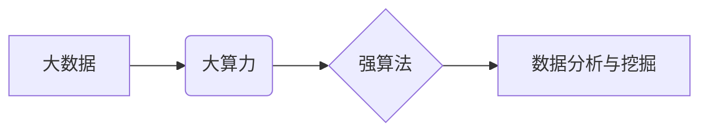

> 大数据，大算力，强算法，机器学习，深度学习，人工智能，数据分析，预测模型

## 1. 背景介绍

在当今数据爆炸的时代，海量数据蕴藏着巨大的价值，但如何有效地挖掘和利用这些数据成为了一个关键问题。大数据、大算力和强算法的结合，为我们提供了强大的工具和方法，能够帮助我们从海量数据中发现隐藏的规律，做出更精准的预测和决策。

大数据是指规模庞大、结构复杂、速度快的数据集。这些数据来自各种来源，例如社交媒体、传感器、电子商务平台等。大算力是指能够处理海量数据的计算能力。随着计算机硬件技术的不断发展，大算力已经成为现实，能够支持大数据分析和处理。强算法是指能够有效地处理大数据，并从中发现隐藏规律的算法。这些算法通常是基于机器学习和深度学习的，能够自动学习数据中的模式和关系。

大数据+大算力+强算法的结合，构成了一个强大的数据分析和挖掘体系，能够应用于各个领域，例如金融、医疗、制造、零售等。

## 2. 核心概念与联系

**2.1 大数据**

大数据通常被描述为具有以下四个特征：

* **体量 (Volume):** 数据量巨大，通常以TB、PB甚至EB为单位。
* **速度 (Velocity):** 数据生成和更新速度快，需要实时或近实时处理。
* **多样性 (Variety):** 数据类型多样，包括结构化数据、非结构化数据和半结构化数据。
* **价值 (Value):** 数据蕴藏着巨大的价值，需要通过分析和挖掘来发现。

**2.2 大算力**

大算力是指能够处理海量数据的计算能力。它通常由以下几个方面组成：

* **计算节点:** 拥有强大处理能力的计算机服务器。
* **存储系统:** 用于存储海量数据的分布式存储系统。
* **网络基础设施:** 用于连接计算节点和存储系统的高速网络。
* **软件平台:** 用于管理和调度计算资源的软件平台。

**2.3 强算法**

强算法是指能够有效地处理大数据，并从中发现隐藏规律的算法。这些算法通常是基于机器学习和深度学习的，能够自动学习数据中的模式和关系。

**2.4 核心概念联系**

大数据、大算力和强算法相互依赖，共同构成了一个强大的数据分析和挖掘体系。

* 大数据为强算法提供数据源，强算法能够从大数据中发现隐藏的规律。
* 大算力为强算法提供计算资源，使强算法能够高效地处理海量数据。
* 强算法能够帮助我们更好地理解大数据，并从中提取有价值的信息。

**2.5 核心概念架构图**



## 3. 核心算法原理 & 具体操作步骤

### 3.1 算法原理概述

这里我们以机器学习算法为例，介绍其原理和操作步骤。机器学习算法是一种能够从数据中学习并不断改进的算法。它通过训练模型，使模型能够对输入数据进行预测或分类。

机器学习算法可以分为监督学习、无监督学习和强化学习三大类。

* **监督学习:** 训练模型时，需要提供标记数据，即输入数据和对应的输出结果。模型通过学习标记数据，能够预测新的输入数据的输出结果。例如，图像分类就是一个监督学习任务，训练数据包含图像和对应的类别标签。
* **无监督学习:** 训练模型时，不需要提供标记数据，模型需要从无标记数据中发现隐藏的模式和结构。例如，聚类算法就是一种无监督学习算法，它可以将数据点分组到不同的类别中。
* **强化学习:** 模型通过与环境交互，学习如何做出最优决策。模型会根据环境的反馈，调整自己的策略，以获得最大的奖励。例如，游戏AI就是一种强化学习应用，它通过与游戏环境交互，学习如何玩游戏。

### 3.2 算法步骤详解

以下是机器学习算法的典型操作步骤：

1. **数据收集和预处理:** 收集相关数据，并进行清洗、转换和特征工程等预处理操作，以使数据适合模型训练。
2. **模型选择:** 根据具体任务选择合适的机器学习算法模型。
3. **模型训练:** 使用训练数据训练模型，调整模型参数，使模型能够对输入数据进行准确预测或分类。
4. **模型评估:** 使用测试数据评估模型的性能，例如准确率、召回率、F1-score等。
5. **模型调优:** 根据评估结果，调整模型参数或选择其他算法模型，以提高模型性能。
6. **模型部署:** 将训练好的模型部署到实际应用场景中，用于进行预测或分类。

### 3.3 算法优缺点

**优点:**

* **自动化:** 机器学习算法能够自动学习数据中的模式和关系，无需人工干预。
* **精准度高:** 经过训练的机器学习模型能够对数据进行准确预测或分类。
* **可扩展性强:** 机器学习算法能够处理海量数据，并随着数据量的增加而不断改进。

**缺点:**

* **数据依赖:** 机器学习算法的性能取决于训练数据的质量和数量。
* **解释性差:** 一些机器学习算法的决策过程难以解释，难以理解模型是如何做出预测的。
* **训练成本高:** 训练大型机器学习模型需要大量的计算资源和时间。

### 3.4 算法应用领域

机器学习算法广泛应用于各个领域，例如：

* **图像识别:** 人脸识别、物体检测、图像分类等。
* **自然语言处理:** 文本分类、情感分析、机器翻译等。
* **推荐系统:** 商品推荐、内容推荐、用户画像等。
* **金融领域:** 欺诈检测、风险评估、信用评分等。
* **医疗领域:** 疾病诊断、药物研发、医疗影像分析等。

## 4. 数学模型和公式 & 详细讲解 & 举例说明

### 4.1 数学模型构建

机器学习算法通常基于数学模型，例如线性回归、逻辑回归、支持向量机等。这些模型通过数学公式来描述数据之间的关系。

例如，线性回归模型的数学公式如下：

$$y = w_0 + w_1x_1 + w_2x_2 + ... + w_nx_n + \epsilon$$

其中：

* $y$ 是预测结果。
* $w_0, w_1, w_2, ..., w_n$ 是模型参数。
* $x_1, x_2, ..., x_n$ 是输入特征。
* $\epsilon$ 是误差项。

### 4.2 公式推导过程

机器学习算法的模型参数通常通过优化算法来求解。常见的优化算法包括梯度下降法、随机梯度下降法、牛顿法等。

梯度下降法是一种迭代优化算法，其核心思想是沿着梯度的负方向更新模型参数，以最小化损失函数。

损失函数衡量模型预测结果与真实结果之间的差异。常见的损失函数包括均方误差、交叉熵损失等。

### 4.3 案例分析与讲解

假设我们想要预测房价，输入特征包括房屋面积、房间数量、地理位置等。我们可以使用线性回归模型来进行预测。

首先，我们需要收集房价数据，并将其分为训练集和测试集。然后，使用训练集训练线性回归模型，并使用测试集评估模型性能。

如果模型性能不理想，我们可以尝试调整模型参数或选择其他算法模型。

## 5. 项目实践：代码实例和详细解释说明

### 5.1 开发环境搭建

为了进行机器学习项目实践，我们需要搭建一个开发环境。常用的开发环境包括：

* **Python:** Python 是机器学习领域最常用的编程语言，拥有丰富的机器学习库，例如 scikit-learn、TensorFlow、PyTorch 等。
* **Jupyter Notebook:** Jupyter Notebook 是一个交互式编程环境，方便进行机器学习代码编写和调试。
* **云计算平台:** 云计算平台，例如 AWS、Azure、GCP 等，提供强大的计算资源和机器学习服务。

### 5.2 源代码详细实现

以下是一个使用 scikit-learn 库进行线性回归预测房价的 Python 代码示例：

```python
import pandas as pd
from sklearn.model_selection import train_test_split
from sklearn.linear_model import LinearRegression
from sklearn.metrics import mean_squared_error

# 加载房价数据
data = pd.read_csv('house_price.csv')

# 选择特征和目标变量
features = ['area', 'rooms']
target = 'price'

# 将数据分为训练集和测试集
X_train, X_test, y_train, y_test = train_test_split(data[features], data[target], test_size=0.2)

# 创建线性回归模型
model = LinearRegression()

# 训练模型
model.fit(X_train, y_train)

# 预测测试集数据
y_pred = model.predict(X_test)

# 计算模型性能
mse = mean_squared_error(y_test, y_pred)
print(f'Mean Squared Error: {mse}')
```

### 5.3 代码解读与分析

* 首先，我们使用 pandas 库加载房价数据。
* 然后，我们选择特征和目标变量，并将数据分为训练集和测试集。
* 接下来，我们创建线性回归模型，并使用训练集训练模型。
* 训练完成后，我们使用测试集数据进行预测，并计算模型性能。

### 5.4 运行结果展示

运行上述代码后，会输出模型的均方误差值。均方误差值越小，模型性能越好。

## 6. 实际应用场景

### 6.1 金融领域

* **欺诈检测:** 使用机器学习算法分析交易数据，识别异常交易行为，防止欺诈行为发生。
* **风险评估:** 根据客户的信用记录、财务状况等信息，评估客户的贷款风险，帮助银行做出贷款决策。
* **信用评分:** 为客户分配信用评分，评估客户的信用风险，为贷款、信用卡等服务提供参考。

### 6.2 医疗领域

* **疾病诊断:** 使用机器学习算法分析患者的病历、检查结果等信息，辅助医生诊断疾病。
* **药物研发:** 使用机器学习算法分析药物分子结构和生物活性数据，加速药物研发过程。
* **医疗影像分析:** 使用机器学习算法分析医学影像数据，例如 X 光片、CT 扫描、MRI 等，辅助医生诊断和治疗。

### 6.3 其他领域

* **电商推荐:** 根据用户的购买历史、浏览记录等信息，推荐用户可能感兴趣的商品。
* **个性化广告:** 根据用户的兴趣爱好、行为特征等信息，推送个性化的广告。
* **交通管理:** 使用机器学习算法分析交通流量数据，优化交通信号灯控制，缓解交通拥堵。

### 6.4 未来应用展望

随着大数据、大算力和强算法的不断发展，机器学习技术将在更多领域得到应用，例如：

* **自动驾驶:** 使用机器学习算法训练自动驾驶汽车，使其能够感知周围环境，做出安全驾驶决策。
* **机器人技术:** 使用机器学习算法赋予机器人更强的智能，使其能够更好地完成复杂任务。
* **个性化教育:** 使用机器学习算法分析学生的学习情况，提供个性化的学习方案。

## 7. 工具和资源推荐

### 7.1 学习资源推荐

* **在线课程:** Coursera、edX、Udacity 等平台提供丰富的机器学习课程。
* **书籍:** 《机器学习》 (周志华)、《深度学习》 (Ian Goodfellow) 等书籍是机器学习学习的经典教材。
* **博客和论坛:** Kaggle、Towards Data Science 等网站提供大量的机器学习博客文章和论坛讨论。

### 7.2 开发工具推荐

* **Python:** Python 是机器学习领域最常用的编程语言。
* **scikit-learn:** scikit-learn 是 Python 的一个机器学习库，提供各种机器学习算法和工具。
* **TensorFlow:** TensorFlow 是 Google 开发的深度