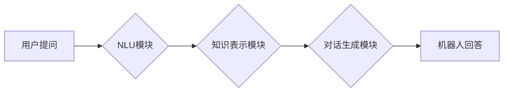

> 大模型、问答机器人、对话生成、自然语言处理、Transformer模型

## 1. 背景介绍

近年来，深度学习技术取得了飞速发展，特别是Transformer模型的出现，为自然语言处理（NLP）领域带来了革命性的变革。大模型问答机器人作为一种基于深度学习的智能对话系统，能够理解用户的问题，并生成自然流畅的回答。其应用场景广泛，涵盖客服、教育、娱乐等领域。

传统的问答系统主要依赖于规则和知识库，难以应对复杂、开放式的用户提问。而大模型问答机器人则通过学习海量文本数据，掌握语言的语法和语义，能够理解用户意图，并生成符合语境的回答。

## 2. 核心概念与联系

### 2.1 大模型

大模型是指参数量巨大、训练数据量庞大的深度学习模型。这些模型通常拥有数十亿甚至数千亿个参数，能够学习到复杂的语言模式和知识表示。

### 2.2 问答机器人

问答机器人是一种能够与用户进行对话，并回答用户问题的智能系统。它通常由以下几个模块组成：

* **自然语言理解（NLU）模块：**负责理解用户的问题，提取关键信息。
* **知识表示模块：**存储和组织知识，以便机器人能够回答用户问题。
* **对话生成模块：**根据用户问题和知识库，生成自然流畅的回答。

### 2.3 对话生成

对话生成是指机器生成符合人类语言习惯的对话文本。它是一个复杂的任务，需要模型能够理解上下文、掌握语法规则、并生成具有语义意义的文本。

**Mermaid 流程图**



## 3. 核心算法原理 & 具体操作步骤

### 3.1 算法原理概述

大模型问答机器人通常采用Transformer模型作为其核心算法。Transformer模型是一种基于注意力机制的深度学习模型，能够有效地捕捉文本中的长距离依赖关系。

### 3.2 算法步骤详解

1. **数据预处理：**将文本数据进行清洗、分词、标记等预处理操作，以便模型能够理解和学习。
2. **模型训练：**使用预处理后的数据训练Transformer模型，通过反向传播算法不断调整模型参数，使其能够生成准确的回答。
3. **模型评估：**使用测试数据评估模型的性能，例如准确率、流畅度等指标。
4. **模型部署：**将训练好的模型部署到服务器或云平台，以便用户能够使用。

### 3.3 算法优缺点

**优点：**

* 能够理解复杂的语言结构和语义关系。
* 能够生成自然流畅的对话文本。
* 能够学习和掌握大量的知识。

**缺点：**

* 训练成本高，需要大量的计算资源和数据。
* 模型参数量大，部署成本较高。
* 容易受到恶意攻击和数据 poisoning 的影响。

### 3.4 算法应用领域

大模型问答机器人能够应用于以下领域：

* **客服：**自动回答用户常见问题，提高客服效率。
* **教育：**提供个性化的学习辅导，帮助学生学习知识。
* **娱乐：**与用户进行互动游戏，提供娱乐体验。
* **医疗：**辅助医生诊断疾病，提供医疗信息。

## 4. 数学模型和公式 & 详细讲解 & 举例说明

### 4.1 数学模型构建

Transformer模型的核心是注意力机制，它能够学习到文本中不同词语之间的关系。注意力机制可以表示为以下公式：

$$
Attention(Q, K, V) = softmax(\frac{QK^T}{\sqrt{d_k}})V
$$

其中：

* $Q$：查询矩阵
* $K$：键矩阵
* $V$：值矩阵
* $d_k$：键向量的维度
* $softmax$：softmax函数

### 4.2 公式推导过程

注意力机制的目的是计算每个词语与其他词语之间的相关性。

1. 计算查询矩阵 $Q$ 与键矩阵 $K$ 的点积，得到一个得分矩阵。
2. 对得分矩阵进行归一化，得到一个概率分布。
3. 将概率分布与值矩阵 $V$ 进行加权求和，得到每个词语的注意力权重。

### 4.3 案例分析与讲解

例如，假设我们有一个句子 "The cat sat on the mat"，我们想要计算 "cat" 与其他词语之间的注意力权重。

1. 将句子中的每个词语转换为向量表示，得到 $Q$、$K$ 和 $V$ 矩阵。
2. 计算 $Q$ 与 $K$ 的点积，得到一个得分矩阵。
3. 对得分矩阵进行 softmax 操作，得到每个词语与 "cat" 的注意力权重。

结果表明，"cat" 与 "sat" 和 "on" 的注意力权重较高，因为它们在语义上与 "cat" 相关。

## 5. 项目实践：代码实例和详细解释说明

### 5.1 开发环境搭建

* Python 3.7+
* PyTorch 1.7+
* CUDA 10.2+

### 5.2 源代码详细实现

```python
import torch
import torch.nn as nn

class Transformer(nn.Module):
    def __init__(self, vocab_size, embedding_dim, num_heads, num_layers):
        super(Transformer, self).__init__()
        self.embedding = nn.Embedding(vocab_size, embedding_dim)
        self.transformer_layers = nn.ModuleList([
            nn.TransformerEncoderLayer(embedding_dim, num_heads)
            for _ in range(num_layers)
        ])
        self.linear = nn.Linear(embedding_dim, vocab_size)

    def forward(self, x):
        x = self.embedding(x)
        for layer in self.transformer_layers:
            x = layer(x)
        x = self.linear(x)
        return x
```

### 5.3 代码解读与分析

* `__init__` 方法：初始化模型参数，包括词嵌入层、Transformer编码器层和输出层。
* `forward` 方法：定义模型的正向传播过程，将输入序列经过词嵌入层、Transformer编码器层和输出层，最终得到输出序列。

### 5.4 运行结果展示

训练好的模型可以用于回答用户问题，例如：

**用户提问：** 猫咪喜欢吃什么？

**机器人回答：** 猫咪喜欢吃鱼、肉类和猫粮。

## 6. 实际应用场景

### 6.1 客服机器人

大模型问答机器人可以用于构建客服机器人，自动回答用户常见问题，例如订单查询、退换货流程等。

### 6.2 教育机器人

大模型问答机器人可以用于构建教育机器人，提供个性化的学习辅导，例如解答学生疑问、提供学习资源等。

### 6.3 娱乐机器人

大模型问答机器人可以用于构建娱乐机器人，与用户进行互动游戏，例如问答游戏、聊天机器人等。

### 6.4 未来应用展望

大模型问答机器人未来将应用于更广泛的领域，例如医疗、法律、金融等，为人们提供更智能、更便捷的服务。

## 7. 工具和资源推荐

### 7.1 学习资源推荐

* **Transformer模型论文：** https://arxiv.org/abs/1706.03762
* **HuggingFace Transformers库：** https://huggingface.co/transformers/

### 7.2 开发工具推荐

* **PyTorch：** https://pytorch.org/
* **TensorFlow：** https://www.tensorflow.org/

### 7.3 相关论文推荐

* **BERT：** https://arxiv.org/abs/1810.04805
* **GPT-3：** https://openai.com/blog/gpt-3/

## 8. 总结：未来发展趋势与挑战

### 8.1 研究成果总结

大模型问答机器人技术取得了显著进展，能够理解复杂的语言结构和语义关系，生成自然流畅的对话文本。

### 8.2 未来发展趋势

* 模型规模进一步扩大，参数量达到万亿级甚至更高。
* 多模态对话，融合文本、图像、音频等多种模态信息。
* 个性化定制，根据用户需求定制模型参数和知识库。

### 8.3 面临的挑战

* 训练成本高，需要大量的计算资源和数据。
* 模型参数量大，部署成本较高。
* 容易受到恶意攻击和数据 poisoning 的影响。

### 8.4 研究展望

未来研究将重点关注降低训练成本、提高模型安全性、增强模型的泛化能力等方面。

## 9. 附录：常见问题与解答

### 9.1 问：大模型问答机器人与传统问答系统的区别是什么？

答：传统问答系统主要依赖于规则和知识库，难以应对复杂、开放式的用户提问。而大模型问答机器人则通过学习海量文本数据，掌握语言的语法和语义，能够理解用户意图，并生成符合语境的回答。

### 9.2 问：大模型问答机器人的训练成本高吗？

答：是的，大模型问答机器人的训练成本很高，需要大量的计算资源和数据。

### 9.3 问：大模型问答机器人容易受到攻击吗？

答：是的，大模型问答机器人容易受到恶意攻击和数据 poisoning 的影响。

作者：禅与计算机程序设计艺术 / Zen and the Art of Computer Programming


<end_of_turn>