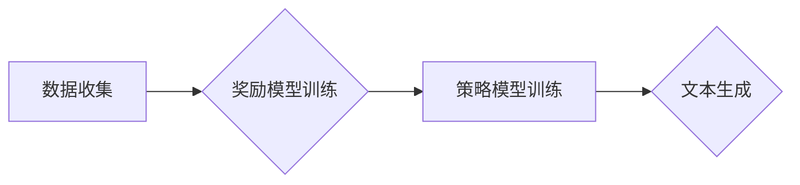

> 大语言模型、RLHF、强化学习、人类反馈、文本生成、自然语言处理

## 1. 背景介绍

近年来，大语言模型（Large Language Models，LLMs）在自然语言处理（NLP）领域取得了显著进展，展现出强大的文本生成、翻译、问答等能力。这些模型通常基于Transformer架构，通过海量文本数据进行预训练，并能够在各种下游任务上表现出色。然而，传统的预训练方法存在一些局限性，例如：

* **缺乏针对性：** 预训练模型通常针对通用语言任务进行训练，可能无法满足特定领域或应用场景的需求。
* **偏差和偏见：** 预训练数据可能包含社会偏见和错误信息，导致模型输出存在偏差和偏见。
* **缺乏可解释性：** 复杂的Transformer模型难以解释其决策过程，导致模型的可靠性和可信度受到质疑。

为了解决这些问题，强化学习人类反馈（Reinforcement Learning from Human Feedback，RLHF）算法应运而生。RLHF是一种训练大语言模型的新方法，通过结合人类反馈和强化学习算法，可以有效地提升模型的性能、安全性、可靠性和可解释性。

## 2. 核心概念与联系

RLHF算法的核心思想是利用人类反馈来引导模型的学习过程。具体来说，RLHF算法通常包含以下几个步骤：

1. **数据收集：** 收集人类对模型输出的反馈，例如评分、排名、修改建议等。
2. **奖励模型训练：** 利用收集到的反馈数据训练一个奖励模型，该模型能够预测人类对模型输出的偏好。
3. **策略模型训练：** 利用奖励模型作为奖励信号，通过强化学习算法训练一个策略模型，该模型能够生成更符合人类偏好的文本。

**Mermaid 流程图**



## 3. 核心算法原理 & 具体操作步骤

### 3.1  算法原理概述

RLHF算法的核心是将强化学习与人类反馈相结合。强化学习是一种机器学习方法，通过奖励信号来引导模型学习最优策略。在RLHF算法中，人类反馈作为奖励信号，引导模型学习生成更符合人类偏好的文本。

具体来说，RLHF算法可以分为以下几个步骤：

1. **预训练模型：** 使用大量的文本数据预训练一个语言模型，例如GPT-3。
2. **数据收集：** 收集人类对预训练模型输出的反馈，例如评分、排名、修改建议等。
3. **奖励模型训练：** 利用收集到的反馈数据训练一个奖励模型，该模型能够预测人类对模型输出的偏好。
4. **策略模型训练：** 利用奖励模型作为奖励信号，通过强化学习算法训练一个策略模型，该模型能够生成更符合人类偏好的文本。

### 3.2  算法步骤详解

1. **预训练模型：** 使用大量的文本数据预训练一个语言模型，例如GPT-3。预训练模型可以学习语言的语法、语义和上下文关系。
2. **数据收集：** 收集人类对预训练模型输出的反馈。例如，可以将预训练模型生成的文本片段展示给人类，并让他们对文本进行评分、排名或提供修改建议。
3. **奖励模型训练：** 利用收集到的反馈数据训练一个奖励模型。奖励模型可以是任何类型的机器学习模型，例如线性回归、支持向量机或神经网络。奖励模型的目标是学习预测人类对模型输出的偏好。
4. **策略模型训练：** 利用奖励模型作为奖励信号，通过强化学习算法训练一个策略模型。策略模型的目标是学习生成更符合人类偏好的文本。

### 3.3  算法优缺点

**优点：**

* **提升模型性能：** RLHF算法可以有效地提升模型在各种下游任务上的性能，例如文本生成、对话系统、机器翻译等。
* **降低偏差和偏见：** 通过收集人类反馈，RLHF算法可以帮助降低模型输出的偏差和偏见。
* **提高模型可解释性：** RLHF算法可以帮助我们更好地理解模型的决策过程，提高模型的可解释性。

**缺点：**

* **数据收集成本高：** 收集高质量的人类反馈数据成本较高，需要投入大量人力和时间。
* **奖励模型设计复杂：** 设计一个能够准确预测人类偏好的奖励模型是一个复杂的任务。
* **训练过程耗时：** RLHF算法的训练过程通常比较耗时，需要大量的计算资源。

### 3.4  算法应用领域

RLHF算法在以下领域具有广泛的应用前景：

* **文本生成：** 生成高质量的新闻文章、小说、诗歌等文本。
* **对话系统：** 开发更自然、更智能的对话系统，例如聊天机器人、虚拟助手等。
* **机器翻译：** 提高机器翻译的准确性和流畅度。
* **代码生成：** 自动生成代码，提高软件开发效率。
* **教育领域：** 开发个性化学习系统，帮助学生更好地理解和掌握知识。

## 4. 数学模型和公式 & 详细讲解 & 举例说明

### 4.1  数学模型构建

RLHF算法的核心是强化学习，其数学模型可以概括为以下几个方面：

* **状态空间：** 模型在每个时间步的状态，例如当前生成的文本片段。
* **动作空间：** 模型可以采取的动作，例如选择下一个词作为文本片段的一部分。
* **奖励函数：** 衡量模型动作的好坏，由人类反馈数据训练。
* **策略函数：** 映射状态到动作的概率分布，通过强化学习算法训练。

### 4.2  公式推导过程

RLHF算法的训练过程可以看作是一个优化问题，目标是找到一个最优的策略函数，使得模型在长期内获得最大的累积奖励。

常用的强化学习算法包括Q学习、SARSA和Policy Gradient等。这些算法都基于Bellman方程，通过迭代更新策略函数来逼近最优策略。

例如，Policy Gradient算法的更新公式如下：

```latex
\theta_{t+1} = \theta_t + \alpha \nabla_{\theta} J(\theta)
```

其中：

* $\theta$ 是策略函数的参数。
* $\alpha$ 是学习率。
* $J(\theta)$ 是策略函数的奖励函数。

### 4.3  案例分析与讲解

假设我们训练一个文本生成模型，目标是生成符合人类偏好的故事。

1. **预训练模型：** 使用大量的童话故事数据预训练一个语言模型。
2. **数据收集：** 将预训练模型生成的文本片段展示给人类，并让他们对文本进行评分。
3. **奖励模型训练：** 利用收集到的评分数据训练一个奖励模型，该模型能够预测人类对文本的评分。
4. **策略模型训练：** 利用奖励模型作为奖励信号，通过Policy Gradient算法训练一个策略模型，该模型能够生成更符合人类偏好的故事。

## 5. 项目实践：代码实例和详细解释说明

### 5.1  开发环境搭建

* Python 3.7+
* PyTorch 1.7+
* Transformers 4.0+

### 5.2  源代码详细实现

```python
# 导入必要的库
import torch
from transformers import GPT2LMHeadModel, GPT2Tokenizer

# 加载预训练模型和词典
model_name = "gpt2"
tokenizer = GPT2Tokenizer.from_pretrained(model_name)
model = GPT2LMHeadModel.from_pretrained(model_name)

# 定义奖励模型
class RewardModel(torch.nn.Module):
    def __init__(self, input_size, hidden_size, output_size):
        super(RewardModel, self).__init__()
        self.linear1 = torch.nn.Linear(input_size, hidden_size)
        self.relu = torch.nn.ReLU()
        self.linear2 = torch.nn.Linear(hidden_size, output_size)

    def forward(self, x):
        x = self.linear1(x)
        x = self.relu(x)
        x = self.linear2(x)
        return x

# 实例化奖励模型
reward_model = RewardModel(input_size=768, hidden_size=512, output_size=1)

# 训练奖励模型
# ...

# 定义策略模型
class PolicyModel(torch.nn.Module):
    def __init__(self, input_size, hidden_size, output_size):
        super(PolicyModel, self).__init__()
        self.linear1 = torch.nn.Linear(input_size, hidden_size)
        self.relu = torch.nn.ReLU()
        self.linear2 = torch.nn.Linear(hidden_size, output_size)

    def forward(self, x):
        x = self.linear1(x)
        x = self.relu(x)
        x = self.linear2(x)
        return x

# 实例化策略模型
policy_model = PolicyModel(input_size=768, hidden_size=512, output_size=1)

# 训练策略模型
# ...

# 使用策略模型生成文本
input_text = "今天天气真好"
input_ids = tokenizer.encode(input_text, return_tensors="pt")
output_ids = policy_model(input_ids)
generated_text = tokenizer.decode(output_ids[0].argmax(dim=-1))
print(generated_text)
```

### 5.3  代码解读与分析

这段代码展示了RLHF算法的基本流程，包括预训练模型、奖励模型训练、策略模型训练和文本生成。

* 预训练模型使用GPT-2模型，并使用大量的文本数据进行预训练。
* 奖励模型是一个简单的多层感知机，用于预测人类对文本的评分。
* 策略模型也是一个多层感知机，用于生成符合人类偏好的文本。
* 文本生成部分使用策略模型生成文本，并使用解码器将生成的ID转换为文本。

### 5.4  运行结果展示

运行这段代码后，会输出一个根据输入文本生成的续写文本。

## 6. 实际应用场景

RLHF算法在实际应用场景中展现出强大的潜力，例如：

* **聊天机器人：** RLHF算法可以训练出更自然、更智能的聊天机器人，能够更好地理解用户的意图并提供更合适的回复。
* **个性化教育：** RLHF算法可以根据学生的学习情况和偏好，生成个性化的学习内容和练习题，提高学习效率。
* **内容创作：** RLHF算法可以帮助作家、记者和营销人员生成更吸引人的内容，例如小说、新闻文章和广告文案。

### 6.4  未来应用展望

RLHF算法在未来将有更广泛的应用前景，例如：

* **自动代码生成：** RLHF算法可以帮助程序员自动生成代码，提高开发效率。
* **医疗诊断辅助：** RLHF算法可以帮助医生分析患者的症状和病史，提供更准确的诊断建议。
* **科学研究：** RLHF算法可以帮助科学家分析实验数据，发现新的规律和知识。

## 7. 工具和资源推荐

### 7.1  学习资源推荐

* **论文：**
    * "Language Models are Few-Shot Learners" (Brown et al., 2020)
    * "Reinforcement Learning from Human Feedback" (Amodei et al., 2016)
* **博客文章：**
    * OpenAI Blog: https://openai.com/blog/
    * DeepMind Blog: https://deepmind.com/blog/

### 7.2  开发工具推荐

* **Transformers:** https://huggingface.co/transformers/
* **PyTorch:** https://pytorch.org/
* **TensorFlow:** https://www.tensorflow.org/

### 7.3  相关论文推荐

* "Training Language Models to Follow Instructions" (Raffel et al., 2020)
* "Scaling Laws for Neural Language Models" (Kaplan et al.,