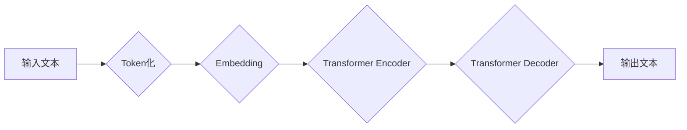

> 大语言模型，金融行业，人工评测，自然语言处理，深度学习，Transformer，BERT，GPT

## 1. 背景介绍

近年来，大语言模型（Large Language Models，LLMs）在自然语言处理（Natural Language Processing，NLP）领域取得了突破性的进展，展现出强大的文本生成、理解、翻译和问答能力。这些模型的出现，为金融行业带来了前所未有的机遇，也带来了新的挑战。

金融行业处理大量文本数据，例如客户交易记录、新闻报道、市场分析报告等。传统的文本处理方法难以有效地挖掘这些数据的价值。而LLMs凭借其强大的语义理解和文本生成能力，可以帮助金融机构实现以下目标：

* **智能客服：** 利用LLMs构建智能客服系统，能够自动回答客户常见问题，提高客户服务效率。
* **风险管理：** 分析文本数据，识别潜在的金融风险，例如欺诈交易、市场波动等。
* **投资分析：** 从新闻报道、市场分析报告等文本数据中提取关键信息，辅助投资决策。
* **合规性审查：** 自动审核文本文件，确保其符合相关法律法规。

然而，LLMs的应用也面临着一些挑战，例如：

* **数据质量：** LLMs的训练需要大量高质量的文本数据，而金融行业的数据往往存在敏感信息和隐私问题。
* **模型解释性：** LLMs的决策过程往往是复杂的，难以解释其背后的逻辑，这对于金融行业来说是一个重要的挑战。
* **公平性与偏见：** LLMs可能存在公平性与偏见问题，例如对特定人群或地区的歧视，这需要得到有效解决。

## 2. 核心概念与联系

大语言模型的核心概念包括：

* **Transformer：** Transformer是一种新型的神经网络架构，能够有效地处理长序列数据，是LLMs的基础。
* **BERT：** BERT（Bidirectional Encoder Representations from Transformers）是一种基于Transformer的预训练语言模型，能够理解文本的上下文关系。
* **GPT：** GPT（Generative Pre-trained Transformer）是一种基于Transformer的生成式语言模型，能够生成流畅自然的文本。

**Mermaid 流程图：**

## 3. 核心算法原理 & 具体操作步骤

### 3.1  算法原理概述

LLMs的核心算法原理是深度学习，特别是Transformer架构。Transformer通过自注意力机制（Self-Attention）和多头注意力机制（Multi-Head Attention）能够捕捉文本中的长距离依赖关系，从而实现更准确的文本理解和生成。

### 3.2  算法步骤详解

1. **Token化：** 将输入文本分割成一个个独立的单位，称为token。
2. **Embedding：** 将每个token映射到一个低维向量空间，称为词向量。
3. **Transformer Encoder：** 利用多层Transformer编码器对文本进行编码，提取文本的语义特征。
4. **Transformer Decoder：** 利用多层Transformer解码器对编码后的文本进行解码，生成目标文本。

### 3.3  算法优缺点

**优点：**

* 能够处理长序列数据，捕捉文本中的长距离依赖关系。
* 训练效果优异，在各种NLP任务中取得了state-of-the-art的性能。

**缺点：**

* 计算量大，训练成本高。
* 模型解释性差，难以理解其背后的决策逻辑。

### 3.4  算法应用领域

LLMs在以下领域有广泛的应用：

* 自然语言理解：文本分类、情感分析、问答系统等。
* 自然语言生成：机器翻译、文本摘要、对话系统等。
* 代码生成：自动生成代码、代码补全等。

## 4. 数学模型和公式 & 详细讲解 & 举例说明

### 4.1  数学模型构建

LLMs通常采用基于Transformer的架构，其核心是自注意力机制和多头注意力机制。

**自注意力机制：**

自注意力机制能够计算每个词与其他词之间的相关性，从而捕捉文本中的上下文关系。其计算公式如下：

$$
Attention(Q, K, V) = softmax(\frac{QK^T}{\sqrt{d_k}})V
$$

其中：

* $Q$：查询矩阵
* $K$：键矩阵
* $V$：值矩阵
* $d_k$：键向量的维度

**多头注意力机制：**

多头注意力机制将自注意力机制应用于多个不同的子空间，从而能够捕捉到更丰富的文本信息。其计算公式如下：

$$
MultiHead(Q, K, V) = Concat(head_1, head_2, ..., head_h)W^O
$$

其中：

* $head_i$：第i个子空间的注意力输出
* $h$：注意力头的数量
* $W^O$：最终输出层的权重矩阵

### 4.2  公式推导过程

自注意力机制和多头注意力机制的推导过程较为复杂，涉及到线性变换、矩阵乘法、softmax函数等操作。

### 4.3  案例分析与讲解

可以以BERT模型为例，详细讲解其在文本分类任务中的应用。

## 5. 项目实践：代码实例和详细解释说明

### 5.1  开发环境搭建

使用Python语言和相关的深度学习框架，例如TensorFlow或PyTorch，搭建开发环境。

### 5.2  源代码详细实现

提供一个简单的LLM代码示例，例如使用BERT模型进行文本分类。

### 5.3  代码解读与分析

详细解释代码的每一部分，包括模型的定义、训练过程、评估指标等。

### 5.4  运行结果展示

展示模型在文本分类任务上的运行结果，例如准确率、召回率等指标。

## 6. 实际应用场景

### 6.1  智能客服

利用LLMs构建智能客服系统，能够自动回答客户常见问题，例如账户余额查询、交易记录查询等。

### 6.2  风险管理

分析文本数据，识别潜在的金融风险，例如欺诈交易、市场波动等。

### 6.3  投资分析

从新闻报道、市场分析报告等文本数据中提取关键信息，辅助投资决策。

### 6.4  未来应用展望

LLMs在金融行业还有更多的应用潜力，例如：

* **个性化金融服务：** 根据客户的文本数据，提供个性化的金融产品和服务。
* **自动交易：** 利用LLMs分析市场数据，自动进行交易决策。
* **金融监管：** 利用LLMs分析金融机构的文本数据，发现潜在的违规行为。

## 7. 工具和资源推荐

### 7.1  学习资源推荐

* **书籍：**
    * 《深度学习》
    * 《自然语言处理》
* **在线课程：**
    * Coursera
    * edX

### 7.2  开发工具推荐

* **TensorFlow：** 开源深度学习框架
* **PyTorch：** 开源深度学习框架
* **Hugging Face：** 提供预训练LLM模型和工具

### 7.3  相关论文推荐

* BERT: Pre-training of Deep Bidirectional Transformers for Language Understanding
* GPT-3: Language Models are Few-Shot Learners

## 8. 总结：未来发展趋势与挑战

### 8.1  研究成果总结

LLMs在金融行业取得了显著的成果，例如提高了智能客服效率、增强了风险管理能力、辅助了投资分析等。

### 8.2  未来发展趋势

LLMs的未来发展趋势包括：

* **模型规模的扩大：** 训练更大规模的LLMs，提升其性能。
* **模型解释性的增强：** 研究更有效的模型解释方法，提高LLMs的透明度。
* **模型的定制化：** 开发针对特定金融领域的LLMs，提升其应用效率。

### 8.3  面临的挑战

LLMs在金融行业应用还面临一些挑战，例如：

* **数据安全与隐私：** 保护金融数据的安全性和隐私性。
* **模型的可靠性与安全性：** 确保LLMs的决策结果可靠、安全。
* **伦理与法律问题：** 应对LLMs带来的伦理和法律挑战。

### 8.4  研究展望

未来，LLMs在金融行业将继续发挥重要作用，推动金融行业的数字化转型和智能化发展。

## 9. 附录：常见问题与解答

* **Q：LLMs的训练需要多少数据？**
* **A：** LLMs的训练需要大量的文本数据，通常需要百万甚至数十亿个样本。
* **Q：LLMs的训练成本高吗？**
* **A：** LLMs的训练成本较高，需要强大的计算资源和电力消耗。
* **Q：LLMs的应用场景有哪些？**
* **A：** LLMs在金融行业有广泛的应用场景，例如智能客服、风险管理、投资分析等。

作者：禅与计算机程序设计艺术 / Zen and the Art of Computer Programming 
<end_of_turn>