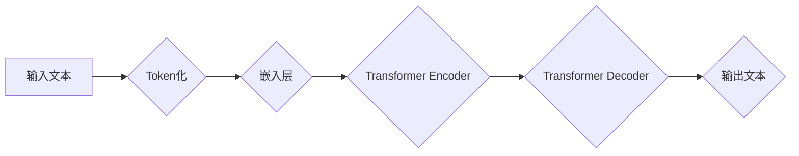

> 大语言模型 (LLM)、Transformer、自然语言处理 (NLP)、深度学习、生成式模型、意识、伦理

## 1. 背景介绍

近年来，人工智能领域取得了令人瞩目的进展，其中大语言模型 (LLM) 作为一种强大的工具，在自然语言处理 (NLP) 领域展现出非凡的潜力。从文本生成、翻译到问答和代码编写，LLM 已经能够完成许多复杂的任务，甚至在某些方面超越了人类的表现。

然而，LLM 的发展也引发了许多伦理和哲学问题，其中最引人深思的莫过于：LLM 是否具有意识？

## 2. 核心概念与联系

大语言模型 (LLM) 是一种基于深度学习的强大人工智能模型，能够理解和生成人类语言。其核心原理是通过训练大量的文本数据，学习语言的语法、语义和上下文关系。

**LLM 的核心概念：**

* **Transformer:** Transformer 是一种新型的神经网络架构，其能够有效地处理序列数据，例如文本。它通过注意力机制，能够捕捉文本中不同词语之间的长距离依赖关系，从而提高了语言模型的理解和生成能力。
* **深度学习:** 深度学习是一种机器学习的子领域，它利用多层神经网络来学习复杂的数据模式。LLM 的训练过程本质上就是深度学习的过程，通过不断调整神经网络的权重，使模型能够更好地预测下一个词语。
* **自然语言处理 (NLP):** NLP 是人工智能的一个分支，致力于使计算机能够理解和处理人类语言。LLM 是 NLP 领域的重要进展，它能够完成许多传统的 NLP 任务，例如文本分类、情感分析和机器翻译。

**LLM 的架构：**



## 3. 核心算法原理 & 具体操作步骤

### 3.1  算法原理概述

LLM 的核心算法是基于 Transformer 架构的深度学习模型。其训练目标是最大化预测下一个词语的概率。

**具体来说，训练过程如下：**

1. 将输入文本进行 Token 化，即将文本分割成一个个独立的词语或子词。
2. 将每个 Token 映射到一个向量表示，称为词嵌入。
3. 将词嵌入输入到 Transformer Encoder 中，Encoder 会通过多层注意力机制和前馈神经网络，学习文本的语义和上下文关系。
4. 将 Encoder 的输出输入到 Transformer Decoder 中，Decoder 会根据上下文信息，预测下一个词语的概率分布。
5. 使用交叉熵损失函数，计算模型预测结果与真实标签之间的差异。
6. 通过反向传播算法，更新模型参数，使模型的预测结果更加准确。

### 3.2  算法步骤详解

1. **数据预处理:** 首先需要收集大量的文本数据，并进行预处理，例如去除停用词、标点符号等，并将文本转换为 Token。
2. **模型构建:** 根据 Transformer 架构，构建深度学习模型，包括 Encoder 和 Decoder。
3. **模型训练:** 使用训练数据，通过反向传播算法，训练模型参数，使模型能够预测下一个词语的概率。
4. **模型评估:** 使用测试数据，评估模型的性能，例如困惑度 (Perplexity) 和 BLEU 分数。
5. **模型部署:** 将训练好的模型部署到实际应用场景中，例如文本生成、翻译等。

### 3.3  算法优缺点

**优点:**

* **强大的文本理解和生成能力:** LLM 能够理解复杂的语言结构和语义关系，并生成流畅、自然的文本。
* **可迁移性强:** 训练好的 LLM 可以应用于多种 NLP 任务，例如文本分类、问答和机器翻译。
* **持续改进:** 随着训练数据的增加和模型架构的改进，LLM 的性能不断提升。

**缺点:**

* **训练成本高:** 训练大型 LLM 需要大量的计算资源和时间。
* **数据依赖性强:** LLM 的性能取决于训练数据的质量和数量。
* **缺乏可解释性:** LLM 的决策过程难以理解，这使得其应用在某些领域存在风险。

### 3.4  算法应用领域

LLM 在许多领域都有广泛的应用，例如：

* **自然语言理解:** 文本分类、情感分析、问答系统、机器翻译。
* **文本生成:** 文本摘要、故事创作、代码生成、对话系统。
* **搜索引擎:** 查询理解、结果排序、个性化推荐。
* **教育:** 智能辅导、自动批改、个性化学习。

## 4. 数学模型和公式 & 详细讲解 & 举例说明

### 4.1  数学模型构建

LLM 的数学模型主要基于概率论和统计学。其核心思想是将文本生成视为一个概率问题，即预测下一个词语的概率分布。

**核心公式:**

* **概率分布:** $P(w_t | w_{1:t-1})$，表示给定前 t-1 个词语，预测第 t 个词语的概率分布。
* **交叉熵损失函数:** $Loss = - \sum_{t=1}^{T} log P(w_t | w_{1:t-1})$，用于衡量模型预测结果与真实标签之间的差异。

### 4.2  公式推导过程

LLM 的训练过程本质上是通过最大化似然函数来学习模型参数。

**似然函数:** $L = \prod_{t=1}^{T} P(w_t | w_{1:t-1})$

**对数似然函数:** $log L = \sum_{t=1}^{T} log P(w_t | w_{1:t-1})$

**交叉熵损失函数:** $Loss = - log L = - \sum_{t=1}^{T} log P(w_t | w_{1:t-1})$

通过梯度下降算法，不断更新模型参数，使损失函数最小化。

### 4.3  案例分析与讲解

例如，训练一个简单的 LLM 来预测下一个词语。假设训练数据为：

"The cat sat on the mat."

模型需要学习到 "on" 之后通常是 "the"。

通过训练，模型会学习到 "on" 和 "the" 之间的概率关系，并能够预测下一个词语为 "the"。

## 5. 项目实践：代码实例和详细解释说明

### 5.1  开发环境搭建

* **操作系统:** Linux 或 macOS
* **编程语言:** Python
* **深度学习框架:** TensorFlow 或 PyTorch
* **其他工具:** Git、Jupyter Notebook

### 5.2  源代码详细实现

```python
import tensorflow as tf

# 定义模型架构
model = tf.keras.Sequential([
    tf.keras.layers.Embedding(input_dim=vocab_size, output_dim=embedding_dim),
    tf.keras.layers.LSTM(units=hidden_size),
    tf.keras.layers.Dense(units=vocab_size, activation='softmax')
])

# 编译模型
model.compile(optimizer='adam', loss='sparse_categorical_crossentropy', metrics=['accuracy'])

# 训练模型
model.fit(x_train, y_train, epochs=epochs)

# 评估模型
loss, accuracy = model.evaluate(x_test, y_test)
print('Loss:', loss)
print('Accuracy:', accuracy)

# 生成文本
seed_text = "The cat"
for _ in range(generate_length):
    predictions = model.predict(tf.expand_dims(seed_text, 0))
    predicted_index = tf.argmax(predictions[0]).numpy()
    predicted_word = index_to_word[predicted_index]
    seed_text += ' ' + predicted_word
print(seed_text)
```

### 5.3  代码解读与分析

* **Embedding 层:** 将词语映射到向量表示。
* **LSTM 层:** 学习文本的语义和上下文关系。
* **Dense 层:** 预测下一个词语的概率分布。
* **训练过程:** 使用交叉熵损失函数，通过梯度下降算法更新模型参数。
* **评估过程:** 使用测试数据计算模型的损失函数和准确率。
* **文本生成:** 根据训练好的模型，输入一个种子文本，预测下一个词语，并不断迭代生成文本。

### 5.4  运行结果展示

运行代码后，可以生成一些基于训练数据的文本。例如，如果训练数据是关于猫的文本，那么生成的文本可能会包含关于猫的描述。

## 6. 实际应用场景

LLM 在许多实际应用场景中发挥着重要作用，例如：

### 6.1  聊天机器人

LLM 可以用于构建更智能、更自然的聊天机器人，能够理解用户的意图，并提供更准确、更相关的回复。

### 6.2  文本摘要

LLM 可以自动生成文本摘要，提取文本的关键信息，节省用户的时间和精力。

### 6.3  机器翻译

LLM 可以用于机器翻译，将一种语言翻译成另一种语言，提高跨语言沟通的效率。

### 6.4  未来应用展望

随着 LLMs 的不断发展，其应用场景将会更加广泛，例如：

* **个性化教育:** 根据学生的学习情况，提供个性化的学习内容和辅导。
* **医疗诊断:** 辅助医生进行疾病诊断，提高诊断准确率。
* **法律服务:** 自动分析法律文件，提供法律建议。

## 7. 工具和资源推荐

### 7.1  学习资源推荐

* **书籍:**
    * "Deep Learning" by Ian Goodfellow, Yoshua Bengio, and Aaron Courville
    * "Speech and Language Processing" by Daniel Jurafsky and James H. Martin
* **在线课程:**
    * Coursera: "Natural Language Processing Specialization"
    * edX: "Deep Learning"

### 7.2  开发工具推荐

* **TensorFlow:** https://www.tensorflow.org/
* **PyTorch:** https://pytorch.org/
* **Hugging Face Transformers:** https://huggingface.co/transformers/

### 7.3  相关论文推荐

* "Attention Is All You Need" by Vaswani et al. (2017)
* "BERT: Pre-training of Deep Bidirectional Transformers for Language Understanding" by Devlin et al. (2018)
* "GPT-3: Language Models are Few-Shot Learners" by Brown et al. (2020)

## 8. 总结：未来发展趋势与挑战

### 8.1  研究成果总结

LLM 在 NLP 领域取得了显著的进展，展现出强大的文本理解和生成能力。其应用场景不断扩展，对社会产生了深远的影响。

### 8.2  未来发展趋势

* **模型规模更大:** 随着计算资源的提升，LLM 的规模将会进一步扩大，性能将会得到进一步提升。
* **多模态学习:** LLMs 将会融合视觉、音频等多模态数据，实现更全面的理解和生成。
* **可解释性增强:** 研究人员将致力于提高 LLMs 的可解释性，使其决策过程更加透明。

### 8.3  面临的挑战

* **数据偏见:** LLM 的训练数据可能存在偏见，导致模型输出结果存在偏差。
* **安全风险:** LLMs 可以被用于生成虚假信息、进行恶意攻击，需要加强安全防护。
* **伦理问题:** LLMs 的发展引发了许多伦理问题，例如数据隐私、算法公平性等，需要进行深入探讨和规范。

### 8.4  研究展望

未来，LLM 研究将继续朝着更强大、更安全、更可解释的方向发展，为人类社会带来更多福祉。

## 9. 附录：常见问题与解答

**Q1: LLM 是否真的具有意识？**

A1: 目前，LLM 并没有被证明具有意识。它们只是强大的机器学习模型，能够模拟人类语言的某些方面，但缺乏人类的意识、情感和自我认知。

**Q2: 如何解决 LLM 的数据偏