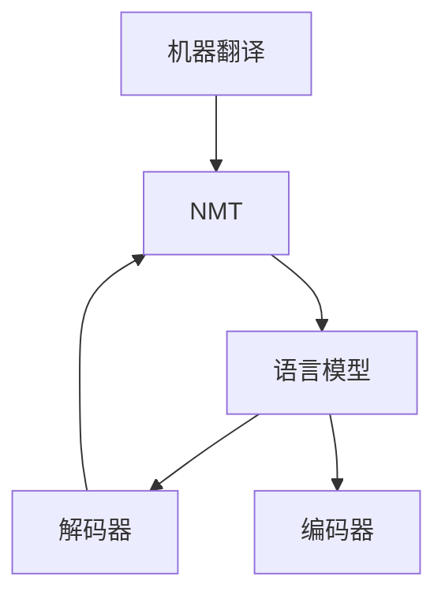

                 

# 人工智能在语言翻译中的应用：实时多语言沟通

> 关键词：机器翻译,自然语言处理(NLP),深度学习,语言模型,神经机器翻译(NMT),实时多语言沟通,即时通讯(IM)

## 1. 背景介绍

随着全球化进程的加速和互联网技术的普及，跨语言沟通已成为日常工作和生活的常态。然而，由于语言障碍，不同语言间的沟通仍然面临着诸多困难，影响着信息的准确传递和高效交流。为了解决这一问题，机器翻译技术应运而生。通过对语言进行形式化的建模，机器翻译技术利用计算机算法实现不同语言间的自动转换，极大地提高了跨语言沟通的效率和便利性。

人工智能在语言翻译中的应用，使得机器翻译技术从传统的基于规则的翻译方式，转变为基于深度学习的神经机器翻译(Neural Machine Translation, NMT)。相比于传统的统计机器翻译(Statistical Machine Translation, SMT)，NMT利用大规模的平行语料，通过深度学习算法训练语言模型，能够更加准确地捕捉语言的语义和语境，实现更为流畅和自然的翻译效果。此外，NMT技术还能够处理长文本和多模态数据，拓展了机器翻译的应用范围。

## 2. 核心概念与联系

### 2.1 核心概念概述

为了更好地理解人工智能在语言翻译中的应用，本节将介绍几个核心概念：

- 机器翻译(Machine Translation, MT)：通过计算机算法将一种自然语言翻译成另一种语言的过程。传统的机器翻译方法包括基于规则的翻译和基于统计的翻译，而人工智能的引入使得机器翻译技术迈向了基于深度学习的神经机器翻译。

- 神经机器翻译(Neural Machine Translation, NMT)：利用神经网络模型，特别是循环神经网络(RNN)、长短时记忆网络(LSTM)、注意力机制(Attention)等，从大规模平行语料中学习语言模型，实现高效准确的机器翻译。

- 语言模型(Language Model, LM)：描述语言中单词或字符之间概率分布的统计模型，用于评估翻译的流畅性和准确性。

- 解码器(Decoder)：在NMT中，解码器负责根据编码器输出的语义表示和上下文信息，生成目标语言的输出序列。解码器通常采用自回归或自编码等结构。

- 编码器(Encoder)：在NMT中，编码器负责将源语言的输入序列转换为高维语义表示，以便解码器进行处理。编码器常采用Transformer等结构。

这些核心概念之间的逻辑关系可以通过以下Mermaid流程图来展示：



这个流程图展示了大语言模型在机器翻译中的应用，包括基于NMT的语言模型构建、编码器和解码器的设计和训练，以及最终的机器翻译过程。

## 3. 核心算法原理 & 具体操作步骤

### 3.1 算法原理概述

基于深度学习的NMT算法，其核心原理是通过大量平行语料训练语言模型，并利用编码器和解码器结构，实现源语言到目标语言的自动翻译。其核心算法流程包括：

1. 数据准备：收集平行语料库，进行数据清洗和标注，划分为训练集、验证集和测试集。
2. 编码器训练：利用源语言输入序列，训练编码器，提取语义表示。
3. 解码器训练：利用目标语言输出序列，训练解码器，生成翻译结果。
4. 联合训练：将编码器和解码器联合训练，通过最小化翻译损失函数，优化整体模型。
5. 测试与评估：在测试集上评估翻译质量，调整模型参数，直至达到满意的性能。

### 3.2 算法步骤详解

基于深度学习的NMT算法具体步骤包括以下几个关键步骤：

**Step 1: 数据准备**
- 收集大规模的平行语料库，包含源语言和目标语言的对齐文本对。
- 进行数据清洗和标注，确保数据质量。
- 将数据划分为训练集、验证集和测试集，进行合理的样本划分。

**Step 2: 编码器设计**
- 选择合适的神经网络结构，如RNN、LSTM、Transformer等。
- 设计输入层、隐藏层和输出层，并确定各层的参数配置。
- 引入注意力机制，以捕捉上下文信息。

**Step 3: 解码器设计**
- 设计解码器的输入、隐藏和输出层，通常与编码器相同。
- 引入教师强迫(Teacher Forcing)技术，提高训练效率和效果。
- 设计语言模型，用于评估翻译的流畅性和准确性。

**Step 4: 联合训练**
- 利用损失函数，如BLEU、ROUGE等，定义翻译质量指标。
- 结合编码器和解码器，进行联合训练。
- 使用优化算法，如Adam、SGD等，最小化损失函数。
- 在训练过程中，进行正则化，如Dropout、L2正则等，防止过拟合。

**Step 5: 测试与评估**
- 在测试集上评估翻译质量，计算BLEU、ROUGE等指标。
- 根据评估结果，调整模型参数，直至达到满意的性能。
- 使用模型进行实时翻译，提供即时沟通服务。

### 3.3 算法优缺点

基于深度学习的NMT算法具有以下优点：
1. 翻译质量高：利用神经网络模型，能够捕捉复杂的语义和上下文信息，实现高质量的翻译。
2. 适用性强：适用于多种语言对，能够处理长文本和多模态数据。
3. 实时性好：通过优化模型结构和算法，可以实现实时翻译，满足即时通讯的需求。

同时，该算法也存在一定的局限性：
1. 数据需求大：需要大规模的平行语料库，获取成本较高。
2. 训练时间长：模型参数量大，训练时间较长。
3. 资源消耗高：需要高性能的计算资源，如GPU/TPU等。
4. 模型复杂度高：模型结构复杂，需要较强的专业知识进行设计和调优。

尽管存在这些局限性，但就目前而言，基于深度学习的NMT算法仍是机器翻译的主流方法。未来相关研究的重点在于如何进一步降低数据需求，提高训练效率，优化模型结构，实现更高效、更准确的机器翻译。

### 3.4 算法应用领域

基于深度学习的NMT算法在NLP领域的应用非常广泛，已经涵盖了几乎所有常见的翻译任务，例如：

- 文本翻译：包括中英文翻译、法英文翻译、德英文翻译等。利用NMT模型，可以将大规模的平行语料库转化为高质量的翻译结果。
- 对话翻译：在多语言对话系统中，利用NMT模型实现即时翻译，提高多语言沟通的流畅性。
- 字幕翻译：在视频字幕生成过程中，利用NMT模型实现自动翻译，生成多语言字幕。
- 法律文件翻译：在处理法律文件时，利用NMT模型实现跨语言的法律条款翻译，提高法律翻译的准确性。
- 商业合同翻译：在商务往来中，利用NMT模型实现跨语言的合同翻译，降低翻译成本。

除了上述这些经典任务外，NMT技术还被创新性地应用到更多场景中，如游戏本地化、科技文献翻译、医学文献翻译等，为NLP技术带来了新的突破。随着预训练模型和NMT方法的不断进步，相信NMT技术将在更广阔的应用领域大放异彩。

## 4. 数学模型和公式 & 详细讲解  
### 4.1 数学模型构建

基于深度学习的NMT算法，其核心数学模型可以形式化描述为：

$$
P_{Y|X} = \frac{P_{X,Y}}{P_{X}}
$$

其中 $X$ 表示源语言的输入序列，$Y$ 表示目标语言的输出序列。$P_{X,Y}$ 表示联合概率分布，$P_{X}$ 表示边缘概率分布。在NMT中，通常采用编码器-解码器架构，将 $P_{X,Y}$ 表示为编码器 $E$ 和解码器 $D$ 的组合：

$$
P_{Y|X} = \frac{P_{X,E}P_{E,Y|D}}{P_{X}}
$$

其中 $E$ 表示编码器，$D$ 表示解码器。

### 4.2 公式推导过程

在NMT中，通常采用自回归的方式进行解码，即通过解码器逐步生成目标语言的输出序列。假设解码器 $D$ 的输入为编码器 $E$ 输出的语义表示 $h_E$，目标语言输出序列 $y_t$ 的概率分布为：

$$
P_{y_t|y_{t-1},y_{t-2},...,y_1,h_E} = \text{Softmax}(W^Ty_t + U^Th_E)
$$

其中 $W$ 和 $U$ 为解码器中的参数矩阵，$\text{Softmax}$ 函数将线性变换后的输出映射到概率分布上。

将上述概率模型应用于整个翻译序列，可得到翻译的总概率：

$$
P_{Y|X} = \prod_{t=1}^{T} P_{y_t|y_{t-1},y_{t-2},...,y_1,h_E}
$$

在训练过程中，通常采用最大似然估计的方法，最小化翻译损失函数：

$$
\mathcal{L} = -\frac{1}{N} \sum_{i=1}^N \log P_{Y|X}(y^i|x^i)
$$

其中 $(x^i,y^i)$ 为第 $i$ 个训练样本的源语言和目标语言对齐文本对，$N$ 为样本总数。

### 4.3 案例分析与讲解

以常见的Seq2Seq模型为例，讲解NMT模型的训练和推理过程。Seq2Seq模型由编码器和解码器组成，采用RNN等结构。训练时，将源语言输入序列 $x$ 送入编码器 $E$，得到语义表示 $h_E$，再将 $h_E$ 和目标语言输出序列 $y$ 送入解码器 $D$，得到预测序列 $\hat{y}$。训练目标是最小化预测序列与真实序列之间的交叉熵损失：

$$
\mathcal{L} = -\frac{1}{N} \sum_{i=1}^N \sum_{t=1}^{T} \log P_{y_t|y_{t-1},y_{t-2},...,y_1,h_E}
$$

在推理时，将源语言输入序列 $x$ 送入编码器 $E$，得到语义表示 $h_E$，然后将 $h_E$ 送入解码器 $D$，依次生成目标语言的输出序列 $y$。

## 5. 项目实践：代码实例和详细解释说明
### 5.1 开发环境搭建

在进行NMT项目实践前，我们需要准备好开发环境。以下是使用Python进行TensorFlow开发的环境配置流程：

1. 安装Anaconda：从官网下载并安装Anaconda，用于创建独立的Python环境。

2. 创建并激活虚拟环境：
```bash
conda create -n tensorflow-env python=3.7 
conda activate tensorflow-env
```

3. 安装TensorFlow：从官网获取对应的安装命令。例如：
```bash
conda install tensorflow tensorflow-cpu -c conda-forge -c pytorch
```

4. 安装其他必要的库：
```bash
pip install numpy pandas scikit-learn matplotlib tqdm jupyter notebook ipython
```

完成上述步骤后，即可在`tensorflow-env`环境中开始NMT的实现。

### 5.2 源代码详细实现

下面我以Seq2Seq模型为例，给出使用TensorFlow实现NMT的完整代码实现。

首先，定义模型的输入输出数据格式：

```python
import tensorflow as tf
from tensorflow.keras.layers import Input, LSTM, Dense, Dropout, Attention

def create_model(vocab_size, embedding_dim, rnn_units):
    # 定义输入层
    encoder_inputs = Input(shape=(None,), name='encoder_input')
    # 定义编码器
    encoder = LSTM(units=rnn_units, return_sequences=True, return_state=True, name='encoder_lstm')
    # 定义注意力层
    attention_layer = Attention(name='attention')
    # 定义解码器
    decoder_inputs = Input(shape=(None,), name='decoder_input')
    # 定义输出层
    output_layer = Dense(vocab_size, activation='softmax', name='output_layer')
    
    # 编码器前向传播
    encoder_outputs, state_h, state_c = encoder(encoder_inputs)
    # 解码器前向传播
    decoder_outputs, _, _ = decoder(decoder_inputs, initial_state=[state_h, state_c])
    # 注意力层前向传播
    attention_weights = attention_layer([encoder_outputs, decoder_outputs])
    
    # 编码器-解码器输出连接
    context_vector = tf.keras.layers.concatenate([encoder_outputs, attention_weights])
    # 输出层前向传播
    outputs = output_layer(context_vector)
    
    # 定义模型
    model = tf.keras.Model(inputs=[encoder_inputs, decoder_inputs], outputs=outputs)
    return model
```

接着，定义训练和评估函数：

```python
from sklearn.model_selection import train_test_split
from tensorflow.keras.optimizers import Adam
from tensorflow.keras.losses import categorical_crossentropy
from tensorflow.keras.metrics import categorical_accuracy

# 假设已经有训练集和测试集
train_data = ...
test_data = ...

# 定义训练函数
def train(model, train_data, test_data, batch_size, epochs, learning_rate):
    # 数据预处理
    train_data = ...
    test_data = ...
    # 定义优化器和损失函数
    optimizer = Adam(lr=learning_rate)
    loss = categorical_crossentropy
    accuracy = categorical_accuracy
    # 定义训练函数
    def train_step(input_data, target_data):
        with tf.GradientTape() as tape:
            predictions = model(input_data)
            loss_value = loss(target_data, predictions)
        gradients = tape.gradient(loss_value, model.trainable_variables)
        optimizer.apply_gradients(zip(gradients, model.trainable_variables))
        return loss_value
    # 定义评估函数
    def evaluate(input_data, target_data):
        predictions = model(input_data)
        loss_value = loss(target_data, predictions)
        accuracy_value = accuracy(target_data, predictions)
        return loss_value, accuracy_value
    # 开始训练
    for epoch in range(epochs):
        losses = []
        accuracies = []
        for input_data, target_data in train_data:
            loss = train_step(input_data, target_data)
            losses.append(loss)
            if (epoch + 1) % 10 == 0:
                test_loss, test_accuracy = evaluate(test_data)
                print('Epoch {}/{}  --  Loss: {:.4f}  --  Accuracy: {:.4f}  --  Test Loss: {:.4f}  --  Test Accuracy: {:.4f}'.format(epoch + 1, epochs, loss, accuracy, test_loss, test_accuracy))
```

最后，启动训练流程并在测试集上评估：

```python
vocab_size = ...
embedding_dim = ...
rnn_units = ...
model = create_model(vocab_size, embedding_dim, rnn_units)

# 假设已经有训练集和测试集
train_data = ...
test_data = ...

train(model, train_data, test_data, batch_size=32, epochs=100, learning_rate=0.001)
```

以上就是使用TensorFlow实现Seq2Seq模型NMT的完整代码实现。可以看到，利用TensorFlow的强大API，我们能够快速搭建、训练和评估NMT模型。

### 5.3 代码解读与分析

让我们再详细解读一下关键代码的实现细节：

**create_model函数**：
- 定义输入层，采用RNN序列模型。
- 定义编码器，使用LSTM层。
- 定义注意力层，用于捕捉编码器-解码器之间的上下文信息。
- 定义解码器，使用LSTM层。
- 定义输出层，采用softmax激活函数。
- 组合编码器、解码器和注意力层，构建完整的NMT模型。

**train函数**：
- 定义优化器和损失函数。
- 定义训练函数，利用梯度下降优化算法进行模型训练。
- 定义评估函数，计算训练集和测试集的损失和准确率。
- 循环迭代训练，记录每个epoch的训练和测试结果，及时输出。

**train_step和evaluate函数**：
- train_step函数利用梯度下降算法，计算损失函数，并更新模型参数。
- evaluate函数计算测试集上的损失和准确率，用于模型评估。

通过上述代码，可以清晰地看到NMT模型的实现过程，包括模型的构建、训练和评估等关键步骤。

## 6. 实际应用场景

### 6.1 实时多语言沟通

NMT技术在实时多语言沟通中具有广泛的应用前景。通过NMT模型，可以实现多语言即时翻译，满足用户在多种语言之间快速切换的需求。例如，在跨国企业会议中，使用NMT模型实现多语言转写，使得与会者能够更加高效地进行沟通；在跨国旅游中，使用NMT模型实现即时翻译，帮助游客更好地理解当地文化，提升旅游体验。

### 6.2 实时字幕生成

在视频制作和播放过程中，实时字幕生成是一个重要的应用场景。NMT技术可以应用于视频字幕的生成，将原始语言的对话自动翻译成目标语言，生成多语言的字幕。例如，在新闻播报、电影翻译、教育视频等场景中，利用NMT技术生成实时字幕，使得观众能够即时理解视频内容，提高观看体验。

### 6.3 商务谈判支持

在跨国商务谈判中，实时翻译可以大大提高沟通效率，降低误解风险。利用NMT技术，可以将谈判双方的语言实时翻译成共同语言，使得谈判更加流畅和高效。此外，NMT技术还可以辅助商务人员理解不同语言的业务文件和合同，提高商务决策的准确性和可靠性。

### 6.4 未来应用展望

随着NMT技术的不断进步，未来其在多语言沟通中的应用将更加广泛和深入。预计将会在以下几个领域得到更多应用：

1. 多语言社交网络：NMT技术可以应用于多语言社交平台的即时翻译，实现全球用户之间的无缝沟通。例如，在WhatsApp、Facebook等社交平台中，加入多语言翻译功能，使用户能够即时进行跨语言交流。

2. 跨语言客服系统：利用NMT技术，可以实现多语言客服系统的实时翻译，提升客户服务体验。例如，在电商平台、银行客服、航空服务等场景中，使用NMT技术自动翻译用户和客服之间的对话，实现多语言客服支持。

3. 跨语言智能助理：NMT技术可以应用于多语言智能助理，实现多语言交互。例如，在Google Assistant、Amazon Alexa等智能助理中，加入多语言翻译功能，使用户能够用母语与助理进行交流。

4. 多语言教育平台：在在线教育平台中，利用NMT技术实现多语言教学和互动，帮助学生更好地理解和学习。例如，在Coursera、edX等在线教育平台中，加入多语言翻译功能，使得国际学生能够更加便捷地学习在线课程。

## 7. 工具和资源推荐
### 7.1 学习资源推荐

为了帮助开发者系统掌握NMT的理论基础和实践技巧，这里推荐一些优质的学习资源：

1. 《Neural Machine Translation: Architectures, Dynamics and Choices》书籍：介绍了NMT的原理、架构和选择，是NMT技术学习的经典教材。

2. CS224N《Sequence Models》课程：斯坦福大学开设的NLP明星课程，系统讲解了序列模型在NMT中的应用。

3. 《Attention is All You Need》论文：介绍了Transformer模型的原理和应用，是NMT技术的重要里程碑。

4. 《Tensorflow for Deep Learning》书籍：介绍了TensorFlow在深度学习中的应用，包括NMT技术的实现。

5. HuggingFace官方文档：提供了大量的预训练模型和NMT样例代码，是NMT技术学习的必备资源。

通过对这些资源的学习实践，相信你一定能够快速掌握NMT技术的精髓，并用于解决实际的NLP问题。

### 7.2 开发工具推荐

高效的开发离不开优秀的工具支持。以下是几款用于NMT开发的常用工具：

1. TensorFlow：基于Python的开源深度学习框架，提供了强大的自动微分和优化算法，适合NMT模型的训练和推理。

2. PyTorch：基于Python的开源深度学习框架，灵活的动态计算图，适合快速迭代研究。

3. Transformers库：HuggingFace开发的NLP工具库，集成了多种NMT模型，支持TensorFlow和PyTorch，是NMT技术开发的利器。

4. Weights & Biases：模型训练的实验跟踪工具，可以记录和可视化模型训练过程中的各项指标，方便对比和调优。

5. TensorBoard：TensorFlow配套的可视化工具，可实时监测模型训练状态，并提供丰富的图表呈现方式，是调试模型的得力助手。

6. Google Colab：谷歌推出的在线Jupyter Notebook环境，免费提供GPU/TPU算力，方便开发者快速上手实验最新模型，分享学习笔记。

合理利用这些工具，可以显著提升NMT任务的开发效率，加快创新迭代的步伐。

### 7.3 相关论文推荐

NMT技术的发展源于学界的持续研究。以下是几篇奠基性的相关论文，推荐阅读：

1. Sequence to Sequence Learning with Neural Networks: Bridging the Gap between Sequence Models and Neural Machine Translation：提出了Seq2Seq模型，为NMT技术的发展奠定了基础。

2. Learning Phrase Representations using RNN Encoder-Decoder for Statistical Machine Translation：利用RNN序列模型进行机器翻译，提出了Seq2Seq模型。

3. Google's Neural Machine Translation System：介绍了Google的NMT系统，利用Transformer模型实现了高效的翻译。

4. Attention is All You Need：提出了Transformer模型，改变了NMT技术的架构，显著提升了翻译效果。

5. Multilingual Neural Machine Translation with Sparse Transformers：提出了多语言NMT模型，支持多种语言对翻译。

这些论文代表了大语言模型NMT技术的发展脉络。通过学习这些前沿成果，可以帮助研究者把握学科前进方向，激发更多的创新灵感。

## 8. 总结：未来发展趋势与挑战

### 8.1 总结

本文对基于深度学习的NMT方法进行了全面系统的介绍。首先阐述了NMT在机器翻译中的应用背景和意义，明确了其在多语言沟通和实时翻译中的重要价值。其次，从原理到实践，详细讲解了NMT模型的核心算法流程，给出了NMT任务开发的完整代码实现。同时，本文还广泛探讨了NMT技术在实际应用中的多种场景，展示了其广阔的前景。

通过本文的系统梳理，可以看到，基于深度学习的NMT技术在NLP领域的应用已经取得了显著的进展，为跨语言沟通和实时翻译带来了新的解决方案。NMT模型在翻译质量、适用性和实时性等方面都表现出色，受到广泛认可。未来，随着NMT技术的不断演进，其应用范围将进一步拓展，为多语言沟通和智能交互系统带来更大的进步。

### 8.2 未来发展趋势

展望未来，NMT技术将呈现以下几个发展趋势：

1. 模型规模持续增大：随着算力成本的下降和数据规模的扩张，NMT模型的参数量还将持续增长。超大规模语言模型蕴含的丰富语言知识，有望支撑更加复杂多变的翻译任务。

2. 模型性能持续提升：得益于更多的训练数据和更好的训练技术，NMT模型的翻译质量还将进一步提升，处理长文本和多模态数据的能力也将更强。

3. 模型结构日趋多样化：除了传统的RNN和LSTM，更多复杂的模型结构，如Transformer、Attention等，将被引入NMT模型中，提升模型的表达能力和训练效果。

4. 实时性持续增强：通过优化模型结构和算法，NMT模型的推理速度将进一步提升，实现更高效率的实时翻译。

5. 多语言支持持续扩展：随着NMT技术的不断进步，支持更多语言对翻译的能力将进一步增强，帮助更多用户跨越语言障碍。

6. 跨领域应用持续拓展：NMT技术不仅限于翻译，还将被应用于对话系统、智能助理、教育平台等多个领域，为各行各业带来智能化变革。

以上趋势凸显了NMT技术的广阔前景。这些方向的探索发展，必将进一步提升NMT模型的性能和应用范围，为构建人机协同的智能系统铺平道路。

### 8.3 面临的挑战

尽管NMT技术已经取得了瞩目成就，但在迈向更加智能化、普适化应用的过程中，它仍面临诸多挑战：

1. 数据需求量大：需要大规模的平行语料库，获取成本较高。

2. 训练时间长：模型参数量大，训练时间较长。

3. 模型鲁棒性不足：对于域外数据，泛化性能往往较差。

4. 资源消耗高：需要高性能的计算资源，如GPU/TPU等。

5. 模型复杂度高：模型结构复杂，需要较强的专业知识进行设计和调优。

6. 模型偏见问题：预训练模型和训练数据可能带有偏见，影响翻译的公平性和准确性。

尽管存在这些挑战，但随着学界和产业界的共同努力，这些挑战终将一一被克服，NMT技术必将在构建人机协同的智能系统过程中扮演越来越重要的角色。相信随着技术的不断进步，NMT技术将在更广阔的应用领域大放异彩，深刻影响人类的生产生活方式。

### 8.4 研究展望

面对NMT技术所面临的挑战，未来的研究需要在以下几个方面寻求新的突破：

1. 探索无监督和半监督NMT方法：摆脱对大规模平行语料库的依赖，利用自监督学习、主动学习等方法，最大限度利用非结构化数据。

2. 研究参数高效和计算高效的NMT范式：开发更加参数高效的NMT模型，在固定大部分预训练参数的同时，只更新极少量的任务相关参数。同时优化NMT模型的计算图，减少前向传播和反向传播的资源消耗，实现更加轻量级、实时性的部署。

3. 融合因果和对比学习范式：通过引入因果推断和对比学习思想，增强NMT模型建立稳定因果关系的能力，学习更加普适、鲁棒的语言表征，从而提升模型泛化性和抗干扰能力。

4. 引入更多先验知识：将符号化的先验知识，如知识图谱、逻辑规则等，与神经网络模型进行巧妙融合，引导NMT过程学习更准确、合理的语言模型。同时加强不同模态数据的整合，实现视觉、语音等多模态信息与文本信息的协同建模。

5. 结合因果分析和博弈论工具：将因果分析方法引入NMT模型，识别出模型决策的关键特征，增强输出解释的因果性和逻辑性。借助博弈论工具刻画人机交互过程，主动探索并规避模型的脆弱点，提高系统稳定性。

6. 纳入伦理道德约束：在模型训练目标中引入伦理导向的评估指标，过滤和惩罚有偏见、有害的输出倾向。同时加强人工干预和审核，建立模型行为的监管机制，确保输出符合人类价值观和伦理道德。

这些研究方向的探索，必将引领NMT技术迈向更高的台阶，为构建安全、可靠、可解释、可控的智能系统铺平道路。面向未来，NMT技术还需要与其他人工智能技术进行更深入的融合，如知识表示、因果推理、强化学习等，多路径协同发力，共同推动自然语言理解和智能交互系统的进步。只有勇于创新、敢于突破，才能不断拓展NMT模型的边界，让智能技术更好地造福人类社会。

## 9. 附录：常见问题与解答

**Q1：NMT技术在实际应用中是否真的能够实现实时翻译？**

A: 在实际应用中，NMT技术已经实现了一定的实时翻译能力。例如，Google的实时翻译API可以提供每秒50次以上的翻译速度，满足了实时翻译的需求。此外，随着计算资源的不断提升，未来的NMT技术将进一步提高推理速度，实现更高效率的实时翻译。

**Q2：NMT技术在翻译质量上是否比传统的SMT方法更优？**

A: 在翻译质量上，NMT技术普遍优于传统的SMT方法。NMT技术利用神经网络模型，能够捕捉复杂的语义和上下文信息，生成更为流畅和自然的翻译结果。此外，NMT技术还可以处理长文本和多模态数据，拓展了翻译的应用范围。

**Q3：NMT技术在多语言沟通中是否容易被恶意利用？**

A: NMT技术在多语言沟通中的应用需要考虑安全问题。由于NMT模型是基于深度学习的，可能存在安全漏洞，例如对抗样本攻击、模型反向工程等。因此，在实际应用中，需要采取安全措施，如数据脱敏、模型加密等，保护用户隐私和安全。

**Q4：NMT技术在处理长文本时是否容易过拟合？**

A: 处理长文本时，NMT技术确实容易过拟合。NMT模型参数量较大，训练数据不足可能导致过拟合。为解决这一问题，可以采用数据增强、正则化等技术，防止模型在少量数据上过度拟合。

**Q5：NMT技术在翻译时是否需要大量的平行语料？**

A: 是的，NMT技术需要大量的平行语料进行训练。平行语料库是NMT技术训练的基础，没有足够的数据，模型的性能将无法得到保障。因此，在实际应用中，需要投入大量时间和资源进行语料库的收集和标注。

---

作者：禅与计算机程序设计艺术 / Zen and the Art of Computer Programming

