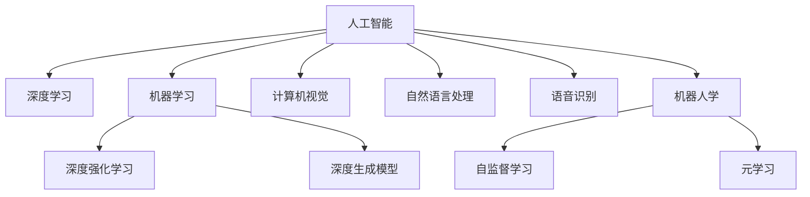

                 

# 人工智能的潜力：探索世界，理解世界

> 关键词：人工智能,深度学习,机器学习,深度强化学习,深度生成模型,计算机视觉,自然语言处理,语音识别,机器人学,自监督学习,元学习

## 1. 背景介绍

### 1.1 问题由来

人工智能(AI)技术自上世纪50年代以来已经取得了长足的进步，从简单的规则引擎到复杂的深度神经网络，AI正逐渐成为人类日常生活和社会生产中不可或缺的一部分。然而，尽管AI技术已经在图像识别、语音识别、自然语言处理等领域取得了诸多突破，但其潜力仍未被完全挖掘。当前，AI技术在许多方面仍然存在瓶颈，如无法真正理解世界，无法进行泛化，无法应对复杂环境等。

### 1.2 问题核心关键点

1. **知识局限**：现有AI模型主要基于统计规律和经验，无法像人类一样具备深度理解世界的背景知识。
2. **泛化能力**：深度学习模型在特定领域内表现优异，但面对新领域和新任务时，泛化能力有限。
3. **环境适应**：AI模型在动态和复杂环境中表现不稳定，缺乏适应性和灵活性。
4. **交互性不足**：现有AI系统多为黑盒模型，缺乏人类特有的直觉和感性理解。
5. **伦理道德**：AI系统可能存在偏见、歧视等问题，影响其公平性和可靠性。

### 1.3 问题研究意义

探索和理解世界，是AI技术向更高级别发展的基础。只有通过更深入地了解世界的运行规律和底层逻辑，AI才能真正实现与人类社会的深度融合，成为真正意义上的人类助手。这不仅有助于推动经济社会的发展，更可能带来革命性的社会变革。

## 2. 核心概念与联系

### 2.1 核心概念概述

为了更好地理解人工智能在探索和理解世界方面的潜力，本节将介绍几个核心概念：

- **人工智能**：使计算机系统模拟人类智能，实现问题求解、决策制定、自然语言理解、语音识别等能力的广泛技术。
- **深度学习**：基于多层神经网络的机器学习技术，通过复杂的网络结构和大量的数据训练，使模型具备强大的模式识别和预测能力。
- **机器学习**：使用数据和算法使计算机系统自动学习，提升决策和预测能力。
- **深度强化学习**：结合强化学习和深度学习，通过与环境的交互，优化模型在复杂环境中的表现。
- **深度生成模型**：能够生成逼真数据的模型，如GANs、VAEs等。
- **计算机视觉**：使计算机系统具备图像识别和处理能力，能够理解和分析视觉信息。
- **自然语言处理**：使计算机系统具备理解、处理和生成自然语言的能力。
- **语音识别**：使计算机系统能够理解和生成人类语音，实现语音-文本转换。
- **机器人学**：结合AI技术和机械工程，使机器人能够自主完成复杂的物理任务。
- **自监督学习**：无需标注数据，通过数据本身的结构和属性进行学习。
- **元学习**：通过少量样本进行快速学习，提升模型的泛化能力和适应性。

这些概念之间的逻辑关系可以通过以下Mermaid流程图来展示：



这个流程图展示了这个核心概念之间的联系和相互作用：

1. 人工智能是涵盖多个子领域的技术体系。
2. 深度学习、机器学习等是人工智能的重要组成部分。
3. 计算机视觉、自然语言处理等技术是人工智能在不同领域的具体应用。
4. 深度强化学习、自监督学习和元学习是提升AI系统泛化能力和适应性的关键技术。

## 3. 核心算法原理 & 具体操作步骤
### 3.1 算法原理概述

为了更好地探索和理解世界，人工智能系统需要具备以下几个核心能力：

- **感知能力**：能够感知和理解周围环境，识别物理世界中的物体、场景和事件。
- **认知能力**：能够理解复杂现象和关系，进行推理和决策。
- **交互能力**：能够与人类和环境进行自然交互，执行复杂的任务。
- **学习能力**：能够从经验中学习，优化模型性能。

实现这些能力的核心算法包括：

- **深度神经网络**：通过多层非线性变换，捕捉数据中的复杂模式和关系。
- **自监督学习**：无需标注数据，通过数据自身的结构和属性进行学习。
- **强化学习**：通过与环境的交互，优化模型在复杂环境中的表现。
- **迁移学习**：利用已有的知识，在新任务上进行快速适应和优化。
- **生成模型**：能够生成逼真数据，辅助理解和生成复杂信息。

### 3.2 算法步骤详解

基于上述核心能力，人工智能系统探索和理解世界的过程可以大致分为以下几个步骤：

**Step 1: 数据收集和预处理**

- 收集来自物理世界的各种数据，包括图像、语音、文本等。
- 对数据进行清洗和标注，确保数据质量。

**Step 2: 特征提取和表示**

- 使用深度神经网络等模型，从原始数据中提取特征，并进行表示。
- 对特征进行编码和压缩，减少冗余信息。

**Step 3: 模型训练和优化**

- 使用机器学习和深度学习等算法，对提取的特征进行训练和优化。
- 引入自监督学习、强化学习等技术，提升模型泛化能力和适应性。

**Step 4: 推理和决策**

- 使用训练好的模型，对新数据进行推理和决策。
- 结合先验知识和推理能力，提升决策的准确性和可靠性。

**Step 5: 反馈和迭代**

- 对模型的输出进行反馈，调整模型参数和策略。
- 通过迭代和优化，逐步提升模型的性能。

### 3.3 算法优缺点

基于上述步骤，人工智能系统在探索和理解世界方面具有以下优缺点：

**优点**

1. **数据驱动**：通过大量数据驱动，实现高效的模型训练和优化。
2. **泛化能力**：能够从大量数据中学习到通用规律，提升泛化能力。
3. **计算效率**：深度学习等算法具有高效的计算效率，能够处理大规模数据。
4. **可扩展性**：模型和算法具有较好的可扩展性，能够应用于不同领域和任务。

**缺点**

1. **数据依赖**：对标注数据依赖较大，难以处理复杂和稀疏数据。
2. **模型黑盒**：模型复杂度较高，难以解释其内部决策过程。
3. **过拟合风险**：模型容易过拟合，特别是面对复杂环境和动态变化的数据。
4. **偏见和歧视**：模型可能存在偏见和歧视，影响公平性和可靠性。

### 3.4 算法应用领域

基于人工智能系统的核心算法和能力，其在探索和理解世界方面具有广泛的应用领域，包括但不限于：

1. **计算机视觉**：通过图像识别和处理，理解物理世界中的物体和场景。
2. **自然语言处理**：通过语言理解和生成，实现与人类和环境的自然交互。
3. **语音识别**：通过语音识别和处理，实现语音与文本的转换。
4. **机器人学**：结合AI技术和机械工程，使机器人能够自主完成复杂的物理任务。
5. **智能推荐系统**：通过学习用户行为和偏好，实现个性化推荐。
6. **金融风控**：通过分析复杂金融数据，提升风险控制能力。
7. **医疗诊断**：通过分析医疗数据，辅助医生进行疾病诊断和治疗。
8. **自动驾驶**：通过感知和理解复杂环境，实现智能驾驶。

## 4. 数学模型和公式 & 详细讲解 & 举例说明

### 4.1 数学模型构建

在深度学习中，常用的数学模型包括：

- **神经网络**：由多个神经元组成的网络结构，能够对数据进行复杂变换。
- **卷积神经网络**：通过卷积操作提取局部特征，适用于图像处理。
- **循环神经网络**：通过循环结构处理序列数据，适用于文本和语音处理。
- **生成对抗网络**：包含生成器和判别器两个网络，能够生成逼真数据。

### 4.2 公式推导过程

以卷积神经网络(CNN)为例，其核心公式如下：

$$
y=f(x;W,b)
$$

其中，$x$ 为输入数据，$W$ 和 $b$ 为网络参数，$f$ 为激活函数。

对于卷积操作，公式为：

$$
y=f(x;W,b)=f(\sum_kw_kx_k+b)
$$

其中，$w_k$ 为卷积核，$x_k$ 为输入数据，$b$ 为偏置。

### 4.3 案例分析与讲解

以图像分类为例，CNN的训练过程如下：

**Step 1: 数据准备**

- 收集图像数据集，并进行标注。
- 将数据集分为训练集和测试集。

**Step 2: 模型构建**

- 设计卷积神经网络模型，包括卷积层、池化层、全连接层等。
- 定义损失函数和优化器，如交叉熵损失和Adam优化器。

**Step 3: 模型训练**

- 使用训练集数据进行前向传播和反向传播，计算梯度。
- 使用优化器更新模型参数，最小化损失函数。

**Step 4: 模型评估**

- 使用测试集数据进行前向传播，计算损失和准确率。
- 根据评估结果调整模型参数，提升模型性能。

## 5. 项目实践：代码实例和详细解释说明
### 5.1 开发环境搭建

在进行项目实践前，需要先搭建好开发环境。以下是使用Python进行深度学习开发的常见环境配置流程：

1. 安装Python：从官网下载并安装最新版本的Python，确保与深度学习框架兼容。
2. 安装NumPy：使用pip安装NumPy，用于科学计算。
3. 安装TensorFlow或PyTorch：根据个人偏好和需求，安装对应的深度学习框架。
4. 安装相关库：安装Pandas、Matplotlib等库，用于数据处理和可视化。
5. 配置虚拟环境：使用conda或virtualenv配置虚拟环境，避免包冲突。

### 5.2 源代码详细实现

下面以图像分类为例，使用TensorFlow进行卷积神经网络的训练和评估。

```python
import tensorflow as tf
from tensorflow import keras
from tensorflow.keras import layers
import numpy as np

# 加载数据集
(x_train, y_train), (x_test, y_test) = keras.datasets.cifar10.load_data()

# 数据预处理
x_train = x_train.astype('float32') / 255
x_test = x_test.astype('float32') / 255

# 定义模型
model = keras.Sequential([
    layers.Conv2D(32, (3, 3), activation='relu', input_shape=(32, 32, 3)),
    layers.MaxPooling2D((2, 2)),
    layers.Conv2D(64, (3, 3), activation='relu'),
    layers.MaxPooling2D((2, 2)),
    layers.Conv2D(64, (3, 3), activation='relu'),
    layers.Flatten(),
    layers.Dense(64, activation='relu'),
    layers.Dense(10, activation='softmax')
])

# 编译模型
model.compile(optimizer='adam',
              loss=tf.keras.losses.SparseCategoricalCrossentropy(from_logits=True),
              metrics=['accuracy'])

# 训练模型
model.fit(x_train, y_train, epochs=10, validation_data=(x_test, y_test))

# 评估模型
model.evaluate(x_test, y_test)
```

这段代码实现了一个简单的卷积神经网络，包括卷积层、池化层和全连接层。使用TensorFlow框架进行模型的构建、编译和训练。最后，在测试集上进行评估。

### 5.3 代码解读与分析

让我们再详细解读一下关键代码的实现细节：

- `(x_train, y_train), (x_test, y_test) = keras.datasets.cifar10.load_data()`：加载CIFAR-10数据集，并将其分为训练集和测试集。
- `x_train = x_train.astype('float32') / 255`：将像素值归一化到0-1之间，提高模型的稳定性。
- `model = keras.Sequential([...])`：定义一个Sequential模型，包含多个神经网络层。
- `model.compile(...)`：编译模型，定义优化器和损失函数。
- `model.fit(...)`：使用训练集进行模型训练，在每个epoch后评估验证集。
- `model.evaluate(...)`：在测试集上评估模型的准确率。

通过这段代码，我们可以看到TensorFlow框架的简洁性和易用性。在实际开发中，可以根据具体需求对模型结构和参数进行进一步的调整和优化。

## 6. 实际应用场景
### 6.1 智能推荐系统

智能推荐系统是人工智能在实际应用中最具代表性的场景之一。通过学习用户行为和偏好，推荐系统能够为用户推荐个性化的商品、内容和服务。

在技术实现上，可以使用深度学习模型对用户行为数据进行建模，并使用强化学习算法优化推荐策略。具体而言，可以将用户的行为数据作为输入，使用深度神经网络对用户特征进行编码，并使用自监督学习方法学习用户行为模式。同时，使用强化学习算法，根据用户对推荐的反馈，不断优化推荐策略。

### 6.2 金融风控

金融领域对风险控制的要求极高，传统的基于规则的风险评估方法已无法满足需求。人工智能系统通过学习复杂的金融数据，能够实现更准确的风险评估和预测。

在技术实现上，可以使用深度学习模型对金融数据进行建模，并使用自监督学习方法学习数据中的复杂模式。同时，使用强化学习算法，根据实时数据和用户反馈，不断优化风险控制策略。

### 6.3 医疗诊断

医疗诊断是人工智能系统的另一个重要应用领域。通过学习医学影像和病历数据，人工智能系统能够辅助医生进行疾病诊断和治疗。

在技术实现上，可以使用深度学习模型对医学影像进行分类和分割，并使用自然语言处理技术对病历数据进行分析和理解。同时，使用强化学习算法，根据医生的反馈，不断优化诊断和治疗策略。

### 6.4 自动驾驶

自动驾驶是人工智能在物理世界中最具挑战性的应用之一。通过感知和理解复杂环境，自动驾驶系统能够实现自主驾驶。

在技术实现上，可以使用计算机视觉技术对道路环境和交通状况进行感知，并使用深度学习模型对传感器数据进行分析和理解。同时，使用强化学习算法，根据环境变化和驾驶任务，不断优化驾驶策略。

## 7. 工具和资源推荐
### 7.1 学习资源推荐

为了帮助开发者系统掌握人工智能的理论基础和实践技巧，这里推荐一些优质的学习资源：

1. **《深度学习》课程**：斯坦福大学开设的深度学习课程，涵盖了深度学习的基本概念和常用算法。
2. **《TensorFlow官方文档》**：TensorFlow的官方文档，提供了丰富的API和示例代码，是学习TensorFlow的必备资料。
3. **《PyTorch官方文档》**：PyTorch的官方文档，提供了丰富的API和示例代码，是学习PyTorch的必备资料。
4. **《Python深度学习》书籍**：弗朗哥·佩雷洛尼(Franco Pelella)所著，全面介绍了Python深度学习的基础知识和应用案例。
5. **《深度学习入门》书籍**：斋藤康毅所著，介绍了深度学习的基本概念和常用算法，适合初学者阅读。

通过对这些资源的学习实践，相信你一定能够快速掌握人工智能的理论基础和实践技巧，并用于解决实际的AI问题。

### 7.2 开发工具推荐

高效的开发离不开优秀的工具支持。以下是几款用于人工智能开发的常用工具：

1. **TensorFlow**：由Google主导开发的深度学习框架，具有强大的计算能力和灵活性。
2. **PyTorch**：由Facebook开发的深度学习框架，具有动态计算图和易用性。
3. **Keras**：高层次的深度学习框架，提供了简单易用的API，适合快速原型开发。
4. **Jupyter Notebook**：交互式开发环境，支持Python和其他编程语言，适合数据处理和模型训练。
5. **GitHub**：代码托管平台，支持版本控制和协作开发，适合项目管理和团队协作。

合理利用这些工具，可以显著提升人工智能项目的开发效率，加快创新迭代的步伐。

### 7.3 相关论文推荐

人工智能领域的研究非常活跃，以下是几篇奠基性的相关论文，推荐阅读：

1. **ImageNet classification with deep convolutional neural networks**：AlexNet论文，提出了卷积神经网络架构，并在ImageNet数据集上取得了优异成绩。
2. **Long short-term memory**：LSTM论文，提出了长短期记忆网络，能够处理时间序列数据。
3. **Attention is all you need**：Transformer论文，提出了Transformer架构，开启了NLP领域的预训练大模型时代。
4. **BERT: Pre-training of Deep Bidirectional Transformers for Language Understanding**：BERT论文，提出了BERT预训练模型，提升了NLP任务的性能。
5. **Generative Adversarial Nets**：GANs论文，提出了生成对抗网络，能够生成逼真数据。

这些论文代表了大模型和深度学习技术的发展脉络。通过学习这些前沿成果，可以帮助研究者把握学科前进方向，激发更多的创新灵感。

## 8. 总结：未来发展趋势与挑战

### 8.1 总结

本文对人工智能在探索和理解世界方面的潜力进行了全面系统的介绍。首先阐述了人工智能技术在物理世界中的广泛应用和重要意义，明确了人工智能系统在感知、认知、交互和学习等方面的核心能力。其次，从原理到实践，详细讲解了深度学习、自监督学习、强化学习等核心算法，并给出了模型训练和优化的具体步骤。同时，本文还广泛探讨了人工智能在智能推荐、金融风控、医疗诊断等诸多领域的应用前景，展示了人工智能技术的巨大潜力。

通过本文的系统梳理，可以看到，人工智能系统在探索和理解世界方面具备强大的能力，但其潜力仍未被完全挖掘。未来，人工智能系统需要在感知、认知、交互和学习等方面不断突破，才能真正实现与人类社会的深度融合，成为人类智能的延伸和拓展。

### 8.2 未来发展趋势

展望未来，人工智能系统在探索和理解世界方面将呈现以下几个发展趋势：

1. **多模态学习**：结合视觉、听觉、触觉等多种模态数据，提升系统的感知能力和理解能力。
2. **跨领域迁移**：通过迁移学习，将一个领域的知识应用于另一个领域，提升系统的泛化能力和适应性。
3. **认知推理**：结合认知科学和人工智能，提升系统的认知推理能力，实现更高级别的理解。
4. **自监督学习**：利用数据自身的结构和属性进行学习，提高系统的鲁棒性和泛化能力。
5. **元学习**：通过少量样本进行快速学习，提升系统的适应性和学习能力。
6. **知识图谱**：构建知识图谱，实现符号化知识与神经网络的协同建模。
7. **生成模型**：结合生成模型，提升系统的生成能力和解释能力。
8. **自主决策**：结合强化学习，提升系统的自主决策能力和交互能力。

这些趋势将使人工智能系统更加智能和高效，能够更好地理解世界和应对复杂环境。

### 8.3 面临的挑战

尽管人工智能系统在探索和理解世界方面取得了诸多突破，但在迈向更高级别应用的过程中，仍面临诸多挑战：

1. **数据瓶颈**：现有数据集规模有限，难以满足深度学习模型的需求。需要开发更多规模更大、分布更广的数据集。
2. **计算资源**：深度学习模型复杂度高，计算资源消耗大，需要高效的计算架构和优化算法。
3. **模型解释**：现有模型多为黑盒，难以解释其内部决策过程。需要开发更透明、可解释的模型。
4. **伦理道德**：AI系统可能存在偏见和歧视，影响其公平性和可靠性。需要建立伦理道德约束机制。
5. **隐私保护**：AI系统需要大量数据进行训练，隐私保护问题亟待解决。需要开发隐私保护技术和方法。
6. **安全性**：AI系统可能被恶意攻击，导致安全漏洞。需要开发安全保护技术和方法。
7. **可扩展性**：现有系统难以处理大规模、复杂的数据和任务。需要开发更高效、可扩展的系统。

这些挑战需要学术界和产业界共同努力，才能使人工智能系统真正实现其潜力，为人类社会带来更多福祉。

### 8.4 研究展望

未来，人工智能系统需要在以下几个方向进行突破：

1. **跨模态学习**：结合视觉、听觉、触觉等多种模态数据，提升系统的感知能力和理解能力。
2. **跨领域迁移**：通过迁移学习，将一个领域的知识应用于另一个领域，提升系统的泛化能力和适应性。
3. **认知推理**：结合认知科学和人工智能，提升系统的认知推理能力，实现更高级别的理解。
4. **自监督学习**：利用数据自身的结构和属性进行学习，提高系统的鲁棒性和泛化能力。
5. **元学习**：通过少量样本进行快速学习，提升系统的适应性和学习能力。
6. **知识图谱**：构建知识图谱，实现符号化知识与神经网络的协同建模。
7. **生成模型**：结合生成模型，提升系统的生成能力和解释能力。
8. **自主决策**：结合强化学习，提升系统的自主决策能力和交互能力。

这些方向将使人工智能系统更加智能和高效，能够更好地理解世界和应对复杂环境。

## 9. 附录：常见问题与解答

**Q1: 什么是深度学习？**

A: 深度学习是一种机器学习技术，通过多层神经网络对数据进行复杂变换，能够从原始数据中提取高级别的特征和模式。

**Q2: 什么是自监督学习？**

A: 自监督学习是一种无需标注数据的机器学习方法，通过数据自身的结构和属性进行学习。

**Q3: 什么是强化学习？**

A: 强化学习是一种通过与环境交互，优化模型在复杂环境中的表现的学习方法。

**Q4: 什么是生成对抗网络？**

A: 生成对抗网络是一种包含生成器和判别器的深度学习模型，能够生成逼真数据。

**Q5: 人工智能在医疗诊断中的应用有哪些？**

A: 人工智能在医疗诊断中的应用包括医学影像分类和分割、病历数据分析、疾病预测等。

**Q6: 什么是多模态学习？**

A: 多模态学习是一种结合多种模态数据进行学习的方法，能够提升系统的感知能力和理解能力。

**Q7: 什么是元学习？**

A: 元学习是一种通过少量样本进行快速学习的方法，能够提升系统的适应性和学习能力。

通过这些常见问题的解答，相信你对人工智能的基本概念和应用有了更深入的理解，能够更好地应用于实际开发和研究中。

---

作者：禅与计算机程序设计艺术 / Zen and the Art of Computer Programming

