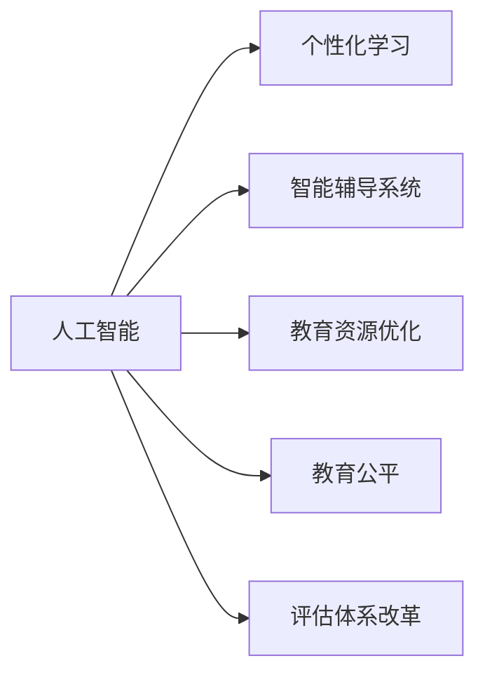

                 

## 1. 背景介绍

### 1.1 教育现状与挑战

在数字时代的浪潮中，教育正经历着翻天覆地的变化。传统教育模式以教师为中心，强调单向的知识传授，但这种模式难以激发学生的自主性和创造力。信息技术的迅速发展为教育变革提供了新的契机，人工智能(AI)技术作为这场变革的催化剂，正在推动教育领域从知识传递向能力培养的转变。

当前，教育系统面临诸多挑战：

- **个性化教育需求高**：学生的学习能力和兴趣各不相同，传统的一刀切教学模式难以满足个性化需求。
- **师资力量不足**：优质的教师资源稀缺，许多地区尤其是偏远地区难以获得高质量的师资支持。
- **教育资源不均**：优质教育资源集中在城市，农村和边远地区教育资源匮乏。
- **评估体系单一**：现有的教育评估体系过于注重考试成绩，忽略了学生的综合素质和创新能力。

### 1.2 人工智能在教育中的应用

人工智能作为现代教育的重要工具，其在教育中的应用已经展现出了巨大的潜力。AI不仅可以提升教学质量、优化教学资源分配，还能帮助学生实现个性化学习，进而全面提升教育质量。

- **个性化学习**：通过AI技术分析学生的学习数据，可以提供个性化的学习方案，满足不同学生的学习需求。
- **智能辅导系统**：AI辅导系统可以24/7提供即时反馈和支持，帮助学生及时解决学习难题。
- **教育资源优化**：AI技术可以优化教育资源的分配，提升教师的教学效率，降低教学成本。
- **教育公平**：通过在线教育平台，AI可以帮助更多地区获得优质的教育资源，缩小城乡教育差距。
- **评估体系改革**：AI技术可以更全面、客观地评估学生的能力和表现，推动评估体系的改革。

## 2. 核心概念与联系

### 2.1 核心概念概述

为更好地理解AI在教育中的应用，本节将介绍几个密切相关的核心概念：

- **人工智能(AI)**：指模拟人类智能的计算机系统，涵盖机器学习、自然语言处理、计算机视觉等多个领域。
- **个性化学习**：根据学生的学习习惯、兴趣、能力和需求，提供量身定制的学习内容和路径。
- **智能辅导系统**：使用AI技术构建的学习支持系统，能够自动提供个性化的学习资源和即时反馈。
- **教育资源优化**：通过AI技术分析和调度教育资源，提升教学效率和效果。
- **教育公平**：通过AI技术提供更均等的教育资源，缩小区域教育差距。
- **评估体系改革**：利用AI技术进行综合评估，全面反映学生的综合素质和能力。

这些核心概念之间的逻辑关系可以通过以下Mermaid流程图来展示：



这个流程图展示了AI技术在教育领域的广泛应用，通过AI技术，能够实现个性化学习、智能辅导、资源优化、教育公平和评估体系改革等多个目标。

## 3. 核心算法原理 & 具体操作步骤
### 3.1 算法原理概述

AI在教育中的应用主要基于机器学习算法，其核心思想是通过数据分析和模型训练，使计算机系统能够模拟人类智能，从而实现自动化的教育过程。

- **监督学习**：通过标注数据训练模型，使其能够对新的输入数据进行分类或回归预测。广泛应用于个性化推荐、智能评估等场景。
- **无监督学习**：使用未标注数据训练模型，发现数据的内在结构和规律。例如，通过聚类算法对学生的学习行为进行分组，提供个性化的学习建议。
- **强化学习**：通过不断尝试和反馈优化模型策略。例如，通过奖励机制激励学生完成学习任务，提升学习动机和效果。

### 3.2 算法步骤详解

基于AI的个性化教育大致包括以下几个步骤：

**Step 1: 数据收集与处理**
- 收集学生的学习数据，如成绩、作业、测试成绩、学习行为等。
- 对数据进行清洗和预处理，去除噪音和异常值。

**Step 2: 建立学习模型**
- 选择合适的机器学习算法，如回归、分类、聚类等，建立学习模型。
- 使用标注数据训练模型，并进行超参数调优，提升模型精度。

**Step 3: 个性化学习路径生成**
- 根据学生的学习数据，输入模型生成个性化学习路径。
- 定期更新学习路径，确保其与时俱进。

**Step 4: 智能辅导与反馈**
- 使用AI辅导系统根据学生的学习进度和表现，提供个性化的学习资源和即时反馈。
- 根据反馈调整学习路径和策略，进一步优化学习效果。

**Step 5: 评估与调整**
- 定期使用AI系统对学生的学习成果进行全面评估。
- 根据评估结果调整学习路径和策略，提升学习效果。

### 3.3 算法优缺点

基于AI的个性化教育具有以下优点：
1. 提高学习效率。AI可以提供个性化的学习路径，减少时间浪费，提升学习效率。
2. 提升学习动机。AI辅导系统能够实时提供反馈和激励，激发学生的学习动机。
3. 实现教育公平。AI技术可以跨越地理和时间的限制，提供公平的学习机会。
4. 数据驱动决策。AI可以基于大数据分析进行教育决策，提升决策的科学性。

同时，该方法也存在一些局限性：
1. 数据隐私问题。学生学习数据的隐私保护是一个重要问题，需要严格的数据安全措施。
2. 依赖数据质量。模型训练和优化依赖高质量的数据，数据偏差可能影响学习效果。
3. 技术复杂度高。AI技术的应用需要较高的技术水平和资源投入，可能难以在小规模学校部署。
4. 学习动机异化。过度依赖AI反馈可能影响学生的自我驱动力和责任感。
5. 对教师角色的冲击。AI技术可能会削弱教师在教育中的主导地位，导致教师角色的转变。

尽管存在这些局限性，但AI技术在教育中的应用前景广阔，未来将会有更多的创新和突破。

### 3.4 算法应用领域

AI在教育中的应用已经渗透到各个环节，例如：

- **智能学习平台**：通过AI技术实现个性化学习路径生成和智能辅导。
- **智能评估系统**：使用AI技术进行综合评估，全面反映学生的综合素质和能力。
- **虚拟助教**：使用AI技术构建虚拟助教，提供24/7的学习支持。
- **教育数据分析**：利用AI技术分析教育数据，优化教学资源分配。
- **在线教育**：使用AI技术提供高质量的在线教育资源，缩小教育差距。

## 4. 数学模型和公式 & 详细讲解 & 举例说明

### 4.1 数学模型构建

基于AI的个性化教育模型可以形式化地表示为：

- 输入：学生学习数据 $D=\{x_1, x_2, \ldots, x_n\}$，其中 $x_i$ 表示第 $i$ 个学生的学习数据。
- 输出：个性化学习路径 $L=\{l_1, l_2, \ldots, l_n\}$，其中 $l_i$ 表示第 $i$ 个学生的个性化学习路径。

模型训练的目标是最小化预测误差：

$$
\min_{\theta} \sum_{i=1}^n \left( y_i - f(x_i, \theta) \right)^2
$$

其中 $f(x_i, \theta)$ 表示模型对输入 $x_i$ 的预测结果，$\theta$ 为模型参数。

### 4.2 公式推导过程

以线性回归模型为例，假设学习路径由 $k$ 个关键节点组成，模型结构为 $L = (l_1, l_2, \ldots, l_k)$。可以使用线性回归模型对学生学习行为进行预测：

$$
f(x_i, \theta) = \sum_{j=1}^k w_j g_j(x_i) + b
$$

其中 $w_j$ 为第 $j$ 个节点的权重，$g_j(x_i)$ 为第 $j$ 个节点的函数，$b$ 为偏置项。

通过最小化预测误差，可以得到线性回归模型的参数：

$$
\theta = \arg\min_{\theta} \sum_{i=1}^n \left( y_i - \sum_{j=1}^k w_j g_j(x_i) - b \right)^2
$$

可以使用梯度下降算法求解：

$$
w_j \leftarrow w_j - \eta \frac{\partial}{\partial w_j} \sum_{i=1}^n \left( y_i - \sum_{j=1}^k w_j g_j(x_i) - b \right)^2
$$

其中 $\eta$ 为学习率。

### 4.3 案例分析与讲解

假设某校有 500 名学生，每名学生有 10 门课程的学习数据。学校希望利用AI技术为每个学生生成个性化的学习路径，提升学生的学习效率和成绩。具体步骤如下：

1. 收集每名学生的学习数据，包括作业成绩、考试成绩、学习时长等。
2. 对数据进行预处理，去除异常值和噪音。
3. 构建线性回归模型，对学生学习行为进行预测。
4. 根据预测结果生成个性化学习路径，包括课程推荐、学习时间分配等。
5. 使用AI辅导系统实时监测学生的学习进度，提供个性化辅导和即时反馈。
6. 定期评估学生的学习效果，根据评估结果调整学习路径和策略。

## 5. 项目实践：代码实例和详细解释说明

### 5.1 开发环境搭建

在进行AI教育应用开发前，我们需要准备好开发环境。以下是使用Python进行TensorFlow开发的环境配置流程：

1. 安装Anaconda：从官网下载并安装Anaconda，用于创建独立的Python环境。
2. 创建并激活虚拟环境：
```bash
conda create -n tensorflow-env python=3.8 
conda activate tensorflow-env
```
3. 安装TensorFlow：根据CUDA版本，从官网获取对应的安装命令。例如：
```bash
conda install tensorflow
```
4. 安装必要的库：
```bash
pip install numpy pandas sklearn tensorflow
```
完成上述步骤后，即可在`tensorflow-env`环境中开始开发。

### 5.2 源代码详细实现

这里我们以一个简单的线性回归模型为例，展示如何使用TensorFlow进行个性化学习路径生成。

首先，定义数据集：

```python
import numpy as np
import tensorflow as tf

# 创建随机数据
x_train = np.random.rand(500, 10)
y_train = np.random.rand(500)

# 将数据转换为TensorFlow的Tensor类型
x_train = tf.constant(x_train, dtype=tf.float32)
y_train = tf.constant(y_train, dtype=tf.float32)
```

接着，定义模型和优化器：

```python
# 定义线性回归模型
w = tf.Variable(tf.random.normal([10, 1]), dtype=tf.float32)
b = tf.Variable(tf.zeros([1]), dtype=tf.float32)

# 定义损失函数
def loss_fn(x, y, w, b):
    y_pred = tf.matmul(x, w) + b
    mse = tf.reduce_mean(tf.square(y_pred - y))
    return mse

# 定义优化器
optimizer = tf.keras.optimizers.Adam(learning_rate=0.01)
```

然后，进行模型训练和预测：

```python
# 定义训练函数
def train_step(x, y):
    with tf.GradientTape() as tape:
        y_pred = tf.matmul(x, w) + b
        mse = loss_fn(x, y, w, b)
    gradients = tape.gradient(mse, [w, b])
    optimizer.apply_gradients(zip(gradients, [w, b]))
    return mse.numpy()

# 训练模型
for i in range(1000):
    mse = train_step(x_train, y_train)
    print(f"Step {i+1}, MSE: {mse:.4f}")
```

最后，生成个性化学习路径：

```python
# 生成随机数据作为示例
x = np.random.rand(10)
y = np.random.rand()

# 预测学习路径
y_pred = tf.matmul(x, w) + b
print(f"Prediction for {x} is {y_pred.numpy()}")
```

以上就是使用TensorFlow进行线性回归模型训练和预测的完整代码实现。可以看到，TensorFlow提供了强大的框架支持，使模型训练和预测变得非常简单。

### 5.3 代码解读与分析

让我们再详细解读一下关键代码的实现细节：

**定义数据集**：
- `np.random.rand()`：生成随机数据作为示例。
- `tf.constant()`：将数据转换为Tensor类型，方便TensorFlow操作。

**模型和优化器定义**：
- `tf.Variable`：定义可训练的变量，如权重和偏置。
- `tf.matmul`：矩阵乘法，用于计算线性回归模型的预测值。
- `tf.reduce_mean`：计算预测值与真实值的均方误差。
- `tf.keras.optimizers.Adam`：定义Adam优化器，支持高效的梯度更新。

**训练函数**：
- `tf.GradientTape`：记录梯度信息，自动求导。
- `optimizer.apply_gradients`：根据梯度信息更新模型参数。

**训练和预测**：
- 通过循环调用训练函数，不断更新模型参数，直至收敛。
- 使用预测函数生成个性化学习路径，展示模型预测结果。

**代码运行结果**：
- 在控制台打印每次训练的均方误差，观察训练过程。

可以看到，TensorFlow提供了简单易用的接口，使得模型训练和预测变得非常高效。在实际应用中，开发者可以根据具体需求，对模型结构和训练过程进行灵活调整，实现更复杂的AI教育应用。

## 6. 实际应用场景

### 6.1 个性化学习路径生成

基于AI的个性化学习路径生成技术，可以广泛应用于在线教育平台。传统的一刀切教学模式难以满足学生个性化需求，AI可以分析学生的学习行为和能力，为其提供量身定制的学习路径。

具体而言，可以收集学生的学习数据，如作业成绩、考试成绩、学习时长等。通过机器学习模型对学生行为进行预测，生成个性化的学习路径，包括推荐课程、学习时间分配等。同时，使用AI辅导系统实时监测学生的学习进度，提供个性化辅导和即时反馈，提升学习效果。

### 6.2 智能评估系统

传统教育评估体系过于注重考试成绩，难以全面反映学生的综合素质和能力。基于AI的智能评估系统可以全面、客观地评估学生的能力和表现。

具体而言，可以使用AI技术进行综合评估，包括作业评分、考试评分、课堂表现、学习行为等。通过分析学生的学习数据，AI系统可以识别出学生的优势和不足，提出个性化的改进建议，帮助学生全面提升综合素质。

### 6.3 虚拟助教系统

虚拟助教系统可以24/7提供学习支持，帮助学生及时解决学习难题。AI助教可以自动回答学生的问题，提供学习资源，进行个性化的辅导。

具体而言，可以建立知识库，存储常见问题的答案和解决方法。当学生提问时，AI助教通过自然语言处理技术分析问题，查找相关答案，并给出建议。通过不断学习和优化，虚拟助教可以提供越来越精准的学习支持。

### 6.4 教育数据分析

通过AI技术进行教育数据分析，可以优化教学资源分配，提升教学效率。

具体而言，可以收集教师的授课数据、学生的学习数据、学校的运营数据等，通过数据分析模型，发现教学中的瓶颈和问题。例如，通过分析学生的学习数据，发现哪些课程需要更多的辅导，哪些学生需要更多的关注。学校可以根据分析结果优化教学资源分配，提升教学效果。

### 6.5 在线教育平台

基于AI的在线教育平台可以提供高质量的教育资源，缩小教育差距。通过AI技术，可以将优质教育资源实时传输到偏远地区和贫困地区，使更多学生能够享受到优质教育。

具体而言，可以建立在线课程平台，提供丰富的课程资源，如视频、课件、实验等。使用AI技术进行个性化推荐，根据学生的兴趣和能力推荐适合的课程和资源。同时，通过AI技术实时监测学生的学习进度，提供个性化辅导，提升学习效果。

## 7. 工具和资源推荐

### 7.1 学习资源推荐

为了帮助开发者系统掌握AI在教育中的应用，这里推荐一些优质的学习资源：

1. Coursera《深度学习》课程：由斯坦福大学Andrew Ng教授主讲的经典深度学习课程，涵盖机器学习、深度学习、AI在教育中的应用等多个主题。
2. TensorFlow官方文档：TensorFlow的官方文档，提供了丰富的教程和样例，帮助开发者快速上手TensorFlow。
3. Kaggle数据科学竞赛：Kaggle是一个数据科学竞赛平台，提供了丰富的教育数据集和模型竞赛，帮助开发者实践AI在教育中的应用。
4. 《Python深度学习》书籍：由Francois Chollet撰写的深度学习入门书籍，涵盖TensorFlow、Keras等多个深度学习框架的使用。
5. 《人工智能与机器学习在教育中的应用》白皮书：Google教育合作伙伴关系发布的白皮书，深入探讨AI在教育中的应用，提供最佳实践和案例。

通过对这些资源的学习实践，相信你一定能够快速掌握AI在教育中的应用技巧，并用于解决实际的NLP问题。

### 7.2 开发工具推荐

高效的开发离不开优秀的工具支持。以下是几款用于AI教育应用开发的常用工具：

1. TensorFlow：由Google主导开发的开源深度学习框架，生产部署方便，适合大规模工程应用。
2. PyTorch：由Facebook主导开发的开源深度学习框架，灵活性和可扩展性强，适合研究开发。
3. Keras：一个高层神经网络API，支持多种深度学习框架，使用简单高效。
4. Jupyter Notebook：一个交互式笔记本，支持Python代码编写和结果展示，非常适合科研和开发。
5. Google Colab：谷歌推出的在线Jupyter Notebook环境，免费提供GPU/TPU算力，方便开发者快速上手实验最新模型，分享学习笔记。

合理利用这些工具，可以显著提升AI教育应用开发的效率，加快创新迭代的步伐。

### 7.3 相关论文推荐

AI在教育领域的应用研究主要集中在以下几个方面：

1. 《个性化学习路径生成与智能辅导系统》：介绍基于机器学习算法的个性化学习路径生成和智能辅导系统，讨论模型设计、数据处理和优化策略。
2. 《基于深度学习的学生评估与反馈系统》：研究使用深度学习技术进行学生评估和反馈的方法，探讨模型的构建和优化。
3. 《虚拟助教系统的设计与实现》：介绍虚拟助教系统的设计与实现过程，讨论知识库构建、自然语言处理和学生互动设计。
4. 《教育数据分析与优化》：研究使用机器学习技术进行教育数据分析和优化的方法，探讨模型选择、数据处理和应用效果。
5. 《在线教育平台的设计与实践》：介绍在线教育平台的设计和实践过程，讨论课程推荐、学习进度监测和个性化辅导。

这些论文代表了大语言模型微调技术的发展脉络。通过学习这些前沿成果，可以帮助研究者把握学科前进方向，激发更多的创新灵感。

## 8. 总结：未来发展趋势与挑战

### 8.1 总结

本文对基于AI的个性化教育方法进行了全面系统的介绍。首先阐述了AI在教育中的应用背景和意义，明确了AI在推动教育变革中的独特价值。其次，从原理到实践，详细讲解了AI在教育中的应用模型和关键步骤，给出了AI教育应用的完整代码实例。同时，本文还广泛探讨了AI在个性化学习路径生成、智能评估系统、虚拟助教系统、教育数据分析和在线教育平台等多个领域的应用前景，展示了AI在教育领域的前景广阔。

通过本文的系统梳理，可以看到，AI在教育中的应用已经开启了一个新的篇章，其强大的技术能力为教育系统带来了深刻的变革。未来，伴随AI技术的不断进步，个性化教育将更加深入人心，成为教育发展的新趋势。

### 8.2 未来发展趋势

展望未来，AI在教育中的应用将呈现以下几个发展趋势：

1. **个性化教育的普及**：AI技术将逐步普及到各级各类教育机构，实现个性化学习路径的全面覆盖。
2. **教育公平的实现**：AI技术将缩小城乡教育差距，实现优质教育资源的共享。
3. **教育评估体系的改革**：AI技术将全面反映学生的综合素质和能力，推动教育评估体系的改革。
4. **教师角色的转变**：AI助教将成为教师的得力助手，辅助教师完成教学任务。
5. **学习动机和自我驱动力的提升**：AI系统将激发学生的学习动机，提升自我驱动力，促进学生全面发展。
6. **教育数据的安全和隐私保护**：随着教育数据的广泛应用，数据隐私和安全问题将受到更多关注。

以上趋势凸显了AI技术在教育领域的应用前景。这些方向的探索发展，必将进一步提升教育质量和效果，促进教育公平和社会进步。

### 8.3 面临的挑战

尽管AI在教育中的应用前景广阔，但在迈向更加智能化、普适化应用的过程中，仍面临诸多挑战：

1. **数据隐私和安全**：学生学习数据的隐私和安全是一个重要问题，需要严格的数据安全措施。
2. **数据质量和完备性**：模型训练依赖高质量的数据，数据偏差和噪音可能影响学习效果。
3. **技术复杂度和成本**：AI教育应用的开发和维护需要较高的技术水平和资源投入，难以在所有学校部署。
4. **教师角色的转变**：AI助教的出现可能削弱教师在教育中的主导地位，导致教师角色的转变。
5. **学生的自我驱动能力**：过度依赖AI反馈可能影响学生的自我驱动力和责任感。
6. **模型的可解释性**：AI系统的决策过程缺乏可解释性，难以对其推理逻辑进行分析和调试。

尽管存在这些挑战，但AI技术在教育中的应用前景广阔，未来将会有更多的创新和突破。

### 8.4 研究展望

面对AI教育应用所面临的种种挑战，未来的研究需要在以下几个方面寻求新的突破：

1. **数据隐私保护**：开发基于区块链等技术的数据隐私保护方法，确保学生数据的安全。
2. **数据质量提升**：优化数据采集和预处理流程，提高数据质量和完备性。
3. **技术普及和成本降低**：开发更加高效、低成本的AI教育应用方案，降低技术门槛和成本。
4. **教师角色支持**：设计教师辅助系统，帮助教师更好地使用AI技术。
5. **学生自我驱动力培养**：设计合理的反馈机制，激励学生自我驱动和自主学习。
6. **模型可解释性增强**：引入可解释性技术，增强AI系统的透明度和可信度。

这些研究方向的探索，必将引领AI教育应用技术迈向更高的台阶，为构建智能教育系统提供坚实的基础。面向未来，AI教育应用需要与教育实践紧密结合，推动教育领域的全面变革。

## 9. 附录：常见问题与解答

**Q1：AI在教育中的应用是否适用于所有学科？**

A: AI在教育中的应用可以覆盖大多数学科，但不同学科的特点不同，需要针对性地设计AI应用方案。例如，对于数学、物理等理科，可以使用AI进行自动评分和智能辅导；对于语言、艺术等文科，可以使用AI进行个性化推荐和创意辅导。

**Q2：AI教育应用如何确保数据隐私和安全？**

A: 数据隐私和安全是AI教育应用的重要问题。为确保学生数据的安全，可以采用以下措施：
- 数据加密：使用加密技术保护数据传输和存储。
- 匿名化处理：对数据进行匿名化处理，保护学生隐私。
- 权限控制：设置严格的数据访问权限，限制非授权访问。
- 数据审计：定期审计数据使用情况，发现和修复安全漏洞。

**Q3：AI教育应用如何提升学生的学习动机？**

A: AI教育应用可以通过以下方式提升学生的学习动机：
- 及时反馈：使用AI助教及时回答学生问题，提供即时反馈。
- 个性化推荐：根据学生的兴趣和能力，推荐适合的学习资源和课程。
- 成就激励：设计合理的奖励机制，激励学生完成学习任务。
- 互动性设计：通过互动式设计增强学习体验，提升学生的参与度。

**Q4：AI教育应用如何支持教师的角色转变？**

A: AI教育应用可以支持教师的角色转变，主要通过以下方式：
- 辅助教学：AI助教可以辅助教师完成备课、批改作业等任务，减轻教师负担。
- 数据支持：AI系统可以提供丰富的数据支持，帮助教师更好地了解学生的学习情况。
- 专业培训：提供教师培训，帮助教师掌握AI技术的使用方法和最佳实践。

**Q5：AI教育应用如何应对学生自我驱动能力不足的问题？**

A: 应对学生自我驱动能力不足的问题，可以采用以下措施：
- 设计合理的反馈机制：使用AI系统提供及时的反馈和激励，激发学生的学习动机。
- 自我评估工具：引入自我评估工具，帮助学生了解自己的学习进度和表现。
- 目标设定：帮助学生设定合理的学习目标，增强自我驱动力。
- 个性化学习路径：根据学生的兴趣和能力，设计个性化的学习路径，提升学习效果。

这些措施可以帮助学生更好地适应AI教育应用，提升自我驱动能力和学习效果。

---

作者：禅与计算机程序设计艺术 / Zen and the Art of Computer Programming

