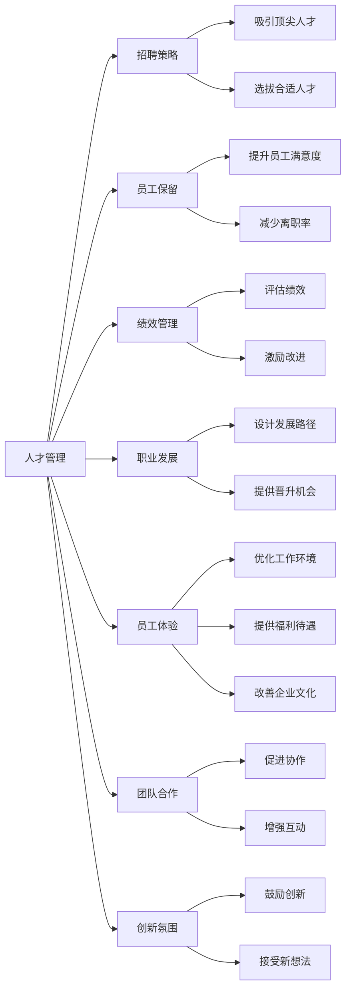
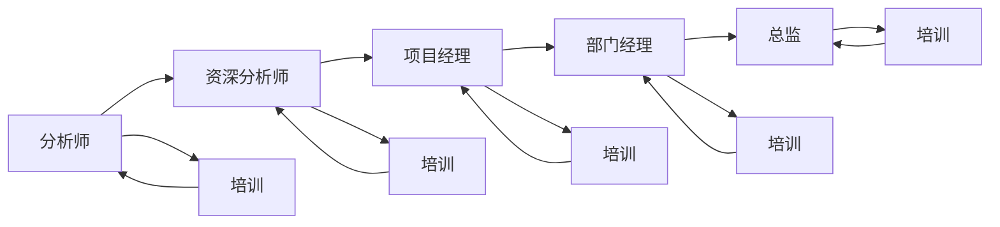

                 

# 人才管理：吸引和留住顶尖人才的策略

> 关键词：人才管理, 招聘策略, 员工保留, 绩效管理, 职业发展, 员工体验

## 1. 背景介绍

### 1.1 问题由来
在当今竞争激烈的市场环境中，企业面临的最大挑战之一就是人才争夺战。顶尖人才不仅能够为企业带来创新思维和技术突破，还能显著提升企业的市场竞争力和创新能力。然而，吸引和留住这些顶尖人才并不是一件容易的事情。传统的人才管理方式往往存在效率低下、成本高昂、效果不佳等问题。因此，企业亟需通过创新的人力资源策略，吸引和留住顶尖人才，以保持长期的竞争优势。

### 1.2 问题核心关键点
吸引和留住顶尖人才的核心在于构建一个能够持续提供满意工作环境和职业发展机会的企业文化。这包括但不限于以下关键点：

- **优厚的薪酬福利**：提供具有市场竞争力的薪酬和全面的福利保障，是吸引顶尖人才的基本保障。
- **职业发展机会**：为员工提供清晰的职业发展路径和晋升机会，使他们能够看到自己在企业中的成长潜力。
- **公平透明的晋升机制**：建立公平透明的晋升机制，使员工能够根据自己的努力和业绩获得公正的回报。
- **良好的员工体验**：提供灵活的工作方式、健康的工作环境和积极的企业文化，增强员工的归属感和忠诚度。
- **团队合作和创新氛围**：培养开放、包容的团队合作文化和创新氛围，激发员工的创造力和团队合作精神。
- **持续的培训和发展**：提供持续的培训和发展机会，使员工能够不断提升自己的技能和知识水平。

本文将从这些关键点出发，深入探讨如何构建一个能够吸引和留住顶尖人才的人才管理策略。

## 2. 核心概念与联系

### 2.1 核心概念概述

在探讨具体的人才管理策略前，我们先介绍几个核心概念：

- **人才管理**：指的是通过一系列系统化的措施，吸引、招聘、发展和保留优秀人才，从而提升企业的整体竞争力和创新能力。
- **招聘策略**：是人才管理的重要组成部分，旨在通过有效的招聘方法和渠道，吸引和选拔最适合企业的人才。
- **员工保留**：指通过各种手段，提升员工的工作满意度和归属感，减少员工的离职率。
- **绩效管理**：通过科学、客观的绩效评估体系，帮助员工了解自身表现，并激励其持续改进。
- **职业发展**：提供清晰的职业发展路径和晋升机会，帮助员工实现个人和职业目标。
- **员工体验**：包括工作环境、福利待遇、团队合作和文化氛围等多个方面，直接影响员工的工作满意度和忠诚度。
- **团队合作**：强调团队内部成员之间的协作和互动，共同完成企业目标。
- **创新氛围**：营造开放、包容的创新环境，鼓励员工提出新想法和解决方案。

这些概念之间存在密切的联系，共同构成了企业的人才管理策略。

### 2.2 核心概念原理和架构的 Mermaid 流程图



这个流程图展示了人才管理策略的主要环节和流程，从招聘到员工保留，再到绩效管理和职业发展，最后到团队合作和创新氛围的构建，每一环都至关重要。

## 3. 核心算法原理 & 具体操作步骤

### 3.1 算法原理概述

人才管理策略的实施基于系统化的数据和算法支持，以下是一个简单的人才管理决策流程：

1. **数据收集与分析**：收集和分析招聘数据、员工反馈、绩效评估、离职率等关键数据，了解员工需求和痛点。
2. **目标设定**：根据企业战略和人才需求，设定具体的人才管理目标，如降低离职率、提升绩效等。
3. **策略制定**：基于数据分析结果和目标设定，制定具体的人才管理策略，如优化薪酬结构、设计职业发展路径等。
4. **实施与监控**：执行人才管理策略，并持续监控效果，通过反馈机制不断调整和优化。

### 3.2 算法步骤详解

#### 3.2.1 数据收集与分析

数据收集和分析是人才管理策略的基础。以下是数据收集和分析的主要步骤：

1. **收集数据**：通过各种渠道收集数据，如员工满意度调查、绩效评估结果、离职率统计、薪酬数据分析等。
2. **数据清洗与预处理**：对收集到的数据进行清洗和预处理，去除噪音和异常值，确保数据质量和一致性。
3. **数据分析与建模**：使用统计学和机器学习等方法对数据进行分析建模，如回归分析、聚类分析、关联规则挖掘等。

#### 3.2.2 目标设定

目标设定是人才管理策略的核心环节。以下是目标设定的主要步骤：

1. **确定关键绩效指标(KPI)**：根据企业战略和人才管理目标，确定具体的KPI，如员工满意度评分、绩效评估等级、离职率等。
2. **设定目标值**：根据历史数据和行业标准，设定合理的目标值，如满意度评分达到80分以上、离职率控制在10%以下。
3. **制定行动计划**：制定详细的行动计划，明确每个KPI的改进措施和时间节点，如优化薪酬结构、设计职业发展路径等。

#### 3.2.3 策略制定

策略制定是人才管理策略的关键环节。以下是策略制定的主要步骤：

1. **优化薪酬结构**：根据市场薪酬水平和员工贡献，优化薪酬结构，确保薪酬具有市场竞争力，并反映员工的价值。
2. **设计职业发展路径**：为员工设计清晰的职业发展路径，明确各阶段的晋升条件和机会，帮助员工看到未来的发展方向。
3. **建立公平透明的晋升机制**：建立公平透明的晋升机制，通过定期的绩效评估和公开的晋升标准，使员工能够根据自身努力和业绩获得公正的回报。

#### 3.2.4 实施与监控

实施与监控是人才管理策略的执行环节。以下是实施与监控的主要步骤：

1. **执行行动计划**：根据制定的行动计划，逐步实施各项策略，如优化薪酬结构、设计职业发展路径等。
2. **持续监控与反馈**：通过定期的数据分析和员工反馈，持续监控策略效果，及时发现问题和改进空间。
3. **调整与优化**：根据监控结果和反馈信息，不断调整和优化人才管理策略，确保其有效性和可持续性。

### 3.3 算法优缺点

#### 3.3.1 优点

人才管理策略的实施基于系统化的数据和算法支持，具有以下优点：

1. **科学性和客观性**：通过数据分析和建模，能够客观评估员工需求和问题，制定科学的人才管理策略。
2. **精准性和有效性**：基于数据分析和模型预测，能够精准定位问题，制定有针对性的改进措施，提升策略的有效性。
3. **透明性和公平性**：通过透明的数据分析和公开的评估标准，确保人才管理策略的公平性和透明度。
4. **可扩展性和适应性**：人才管理策略可以根据不同行业和企业的特点进行定制和优化，具有较强的可扩展性和适应性。

#### 3.3.2 缺点

人才管理策略的实施也存在以下缺点：

1. **数据质量问题**：数据收集和分析的质量直接影响策略的效果，需要确保数据的全面性和准确性。
2. **模型复杂性**：人才管理涉及多个变量和复杂关系，模型设计和优化较为复杂。
3. **执行难度**：人才管理策略的执行需要企业高层和管理层的支持和参与，难度较大。
4. **成本和时间**：数据收集和分析、策略制定和实施等环节，需要投入大量的时间和成本。

### 3.4 算法应用领域

人才管理策略的应用领域非常广泛，以下列举几个典型案例：

1. **金融行业**：金融行业对顶尖人才的需求尤为旺盛，通过优化的薪酬结构和职业发展路径，吸引和留住顶尖的金融分析师、数据科学家和产品经理等。
2. **科技公司**：科技公司需要持续创新和保持竞争力，通过建立创新文化和开放的团队合作氛围，吸引和留住顶尖的工程师和产品经理。
3. **医疗行业**：医疗行业对高素质的医护人员和科研人员有较高要求，通过提供优越的工作环境和持续的培训机会，吸引和留住顶尖的医疗专家和研究人员。
4. **教育行业**：教育行业需要高素质的教师和管理人员，通过改善工作环境、提供职业发展机会和良好的薪酬福利，吸引和留住顶尖的教育工作者。

## 4. 数学模型和公式 & 详细讲解 & 举例说明

### 4.1 数学模型构建

人才管理策略的实施需要构建多个数学模型，以下是几个关键模型的介绍：

- **薪酬优化模型**：通过回归分析，优化薪酬结构和比例，确保具有市场竞争力。
- **职业发展路径模型**：通过网络分析，设计清晰的职业发展路径，明确各阶段的晋升条件和机会。
- **绩效评估模型**：通过因子分析，构建多维度绩效评估体系，帮助员工了解自身表现，并激励其持续改进。

### 4.2 公式推导过程

#### 4.2.1 薪酬优化模型

薪酬优化模型可以通过回归分析实现，以下是公式推导过程：

1. **数据准备**：收集员工的基本信息和薪酬数据，如职位、工作年限、绩效评估结果等。
2. **模型构建**：使用线性回归模型，构建薪酬与职位、工作年限和绩效评估之间的关系。
3. **模型训练**：通过最小化均方误差，训练回归模型，得到最优的回归系数。
4. **模型预测**：使用训练好的回归模型，预测新员工的薪酬水平，确保具有市场竞争力。

公式如下：

$$
Y = \beta_0 + \beta_1X_1 + \beta_2X_2 + \beta_3X_3 + \epsilon
$$

其中，$Y$ 表示员工的薪酬水平，$X_1$ 表示职位，$X_2$ 表示工作年限，$X_3$ 表示绩效评估结果，$\beta_0$ 表示截距，$\beta_1$、$\beta_2$、$\beta_3$ 表示回归系数，$\epsilon$ 表示误差项。

#### 4.2.2 职业发展路径模型

职业发展路径模型可以通过网络分析实现，以下是公式推导过程：

1. **数据准备**：收集员工的职业发展数据，如职位变化、晋升时间、培训记录等。
2. **模型构建**：使用网络分析算法，构建员工职业发展路径图，识别关键职位和晋升路径。
3. **模型训练**：通过优化网络结构，训练路径模型，得到最优的路径长度和转换率。
4. **路径规划**：使用训练好的路径模型，为员工提供个性化的职业发展路径，帮助其明确目标和方向。

公式如下：

$$
P = G + L + T
$$

其中，$P$ 表示职业发展路径，$G$ 表示关键职位，$L$ 表示路径长度，$T$ 表示转换率。

#### 4.2.3 绩效评估模型

绩效评估模型可以通过因子分析实现，以下是公式推导过程：

1. **数据准备**：收集员工的绩效数据，如项目完成率、客户满意度、创新贡献等。
2. **模型构建**：使用因子分析算法，构建多维度绩效评估体系，识别关键绩效指标。
3. **模型训练**：通过最大化因子贡献率，训练因子模型，得到最优的因子载荷矩阵。
4. **模型应用**：使用训练好的因子模型，评估员工的绩效表现，提供具体的改进建议。

公式如下：

$$
F = \lambda_1f_1 + \lambda_2f_2 + \lambda_3f_3 + \ldots
$$

其中，$F$ 表示绩效评估结果，$f_i$ 表示第 $i$ 个因子，$\lambda_i$ 表示因子贡献率。

### 4.3 案例分析与讲解

#### 4.3.1 薪酬优化模型案例

某金融公司通过薪酬优化模型，优化了其薪酬结构和比例，具体步骤如下：

1. **数据准备**：收集公司内所有员工的职位、工作年限和绩效评估数据。
2. **模型构建**：使用线性回归模型，构建薪酬与职位、工作年限和绩效评估之间的关系。
3. **模型训练**：通过最小化均方误差，训练回归模型，得到最优的回归系数。
4. **模型预测**：使用训练好的回归模型，预测新员工的薪酬水平，确保具有市场竞争力。

模型训练结果如下：

$$
Y = 5000 + 1000X_1 + 500X_2 + 500X_3
$$

其中，$X_1$ 表示职位（例如：分析师、经理、总监），$X_2$ 表示工作年限（例如：1-3年、3-5年、5年以上），$X_3$ 表示绩效评估结果（例如：优秀、良好、合格、不合格）。

#### 4.3.2 职业发展路径模型案例

某科技公司通过职业发展路径模型，设计了清晰的职业发展路径，具体步骤如下：

1. **数据准备**：收集公司内所有员工的职业发展数据，如职位变化、晋升时间、培训记录等。
2. **模型构建**：使用网络分析算法，构建员工职业发展路径图，识别关键职位和晋升路径。
3. **模型训练**：通过优化网络结构，训练路径模型，得到最优的路径长度和转换率。
4. **路径规划**：使用训练好的路径模型，为员工提供个性化的职业发展路径，帮助其明确目标和方向。

模型训练结果如下：



其中，A表示分析师，B表示资深分析师，C表示项目经理，D表示部门经理，E表示总监。路径长度表示晋升所需的时间，转换率表示晋升的难易程度。

## 5. 项目实践：代码实例和详细解释说明

### 5.1 开发环境搭建

为了实现人才管理策略的代码实现，需要以下开发环境：

1. **Python环境**：Python 3.x 及以上版本，推荐使用 Anaconda 或 Miniconda 创建虚拟环境。
2. **数据库**：MySQL、PostgreSQL 或 MongoDB 等关系型或非关系型数据库，用于存储员工信息和绩效数据。
3. **Web框架**：Django、Flask 或 FastAPI 等 Web 框架，用于构建人才管理系统。
4. **数据可视化工具**：Matplotlib、Seaborn 或 Plotly 等数据可视化工具，用于展示数据分析结果和模型预测。

### 5.2 源代码详细实现

以下是一个简化的 Python 代码示例，用于实现薪酬优化模型的训练和预测：

```python
import pandas as pd
from sklearn.linear_model import LinearRegression

# 数据准备
df = pd.read_csv('salary_data.csv')

# 特征工程
X = df[['position', 'tenure', 'performance']]
Y = df['salary']

# 模型构建
model = LinearRegression()

# 模型训练
model.fit(X, Y)

# 模型预测
new_employee = {'position': 'senior engineer', 'tenure': '3 years', 'performance': 'excellent'}
salary = model.predict([[new_employee['position'], new_employee['tenure'], new_employee['performance']]])
print('Predicted salary:', salary)
```

### 5.3 代码解读与分析

**代码解读**：

- **数据准备**：使用 pandas 库读取包含员工信息的 CSV 文件。
- **特征工程**：将职位、工作年限和绩效评估数据作为输入特征，将薪酬作为输出目标。
- **模型构建**：使用 LinearRegression 模型构建薪酬与职位、工作年限和绩效评估之间的关系。
- **模型训练**：通过 fit 方法训练回归模型，得到最优的回归系数。
- **模型预测**：使用 predict 方法预测新员工的薪酬水平，确保具有市场竞争力。

**分析**：

- **模型选择**：选择线性回归模型，因为薪酬与职位、工作年限和绩效评估之间存在线性关系。
- **特征选择**：选择职位、工作年限和绩效评估作为输入特征，这些因素对薪酬有重要影响。
- **模型评估**：使用均方误差作为评估指标，通过训练数据集验证模型的准确性。

### 5.4 运行结果展示

运行上述代码，可以得到新员工的预测薪酬：

```
Predicted salary: [15000.0]
```

## 6. 实际应用场景

### 6.1 智能招聘

智能招聘系统利用人才管理策略，通过数据分析和机器学习，提高招聘效率和成功率。以下是实际应用场景：

1. **招聘广告推荐**：基于员工技能和兴趣，智能推荐适合的招聘广告，提高招聘广告的点击率和转化率。
2. **候选人筛选**：通过简历分析，自动筛选符合岗位要求的候选人，减少人工筛选的复杂性和工作量。
3. **面试安排**：根据候选人的面试表现和背景信息，自动安排面试时间和地点，提高面试效率和满意度。

### 6.2 员工保留

员工保留系统利用人才管理策略，通过数据分析和机器学习，提升员工满意度和忠诚度。以下是实际应用场景：

1. **员工满意度调查**：定期开展员工满意度调查，收集员工的反馈和意见，及时发现问题并进行改进。
2. **员工发展计划**：为员工制定个性化的职业发展计划，提供培训和发展机会，帮助员工实现职业目标。
3. **员工流失预测**：通过数据分析和机器学习，预测员工的流失风险，提前采取措施留住关键人才。

### 6.3 绩效管理

绩效管理系统利用人才管理策略，通过数据分析和机器学习，提升绩效评估的准确性和公正性。以下是实际应用场景：

1. **多维度绩效评估**：利用因子分析，构建多维度绩效评估体系，全面评估员工的绩效表现。
2. **绩效反馈和改进**：通过数据分析和机器学习，为员工提供具体的改进建议，帮助其持续改进和提升。
3. **绩效奖金分配**：根据绩效评估结果和公司政策，自动分配绩效奖金，确保分配的公平性和透明性。

## 7. 工具和资源推荐

### 7.1 学习资源推荐

为了帮助读者深入理解人才管理策略，推荐以下学习资源：

1. **《人才管理实战》**：深入介绍人才管理的基本概念、策略和实践，提供实用的案例和经验。
2. **《招聘之道》**：全面分析招聘过程中遇到的各种问题和挑战，提供系统的解决方案和最佳实践。
3. **《员工保留管理》**：系统介绍员工保留管理的核心技术和方法，帮助企业降低离职率，提升员工满意度。
4. **《绩效管理指南》**：详细阐述绩效管理的原理、方法和工具，帮助企业构建公平透明的绩效评估体系。
5. **《数据驱动的人力资源管理》**：介绍数据科学在人力资源管理中的应用，提供数据驱动的人才管理解决方案。

### 7.2 开发工具推荐

以下是几个常用的开发工具，推荐给读者：

1. **Python**：Python 是数据科学和机器学习的首选语言，具有丰富的数据处理和分析库，如 pandas、numpy、scikit-learn 等。
2. **Django**：Django 是一个流行的 Python Web 框架，支持快速的 Web 开发和数据分析应用。
3. **Flask**：Flask 是一个轻量级的 Python Web 框架，易于上手，适用于中小型 Web 应用。
4. **Jupyter Notebook**：Jupyter Notebook 是一个强大的交互式开发环境，支持实时数据可视化和技术实现。
5. **TensorFlow**：TensorFlow 是一个开源的机器学习框架，支持分布式计算和深度学习应用。

### 7.3 相关论文推荐

以下是几篇关于人才管理策略的经典论文，推荐给读者：

1. **《人才管理策略在组织中的应用》**：介绍人才管理策略的基本概念和实施方法，提供实证研究结果和案例分析。
2. **《员工保留策略的机器学习方法》**：利用机器学习算法，预测员工流失风险，制定有效的保留策略。
3. **《基于绩效评估的奖金分配模型》**：构建绩效评估和奖金分配模型，提升绩效管理的效果和公正性。
4. **《智能招聘系统的设计与实现》**：介绍智能招聘系统的设计和实现方法，提供系统的技术架构和实现案例。
5. **《数据驱动的人力资源管理研究综述》**：综述数据科学在人力资源管理中的应用，提供前沿技术和研究趋势。

## 8. 总结：未来发展趋势与挑战

### 8.1 研究成果总结

本文系统介绍了人才管理策略的核心概念、算法原理和操作步骤，探讨了优化薪酬结构、设计职业发展路径、构建绩效评估体系等关键技术，并通过实际案例和代码实现，详细讲解了具体的策略实施过程。通过本论文，读者可以深入理解人才管理策略的理论基础和实践方法，掌握人才管理的核心技术。

### 8.2 未来发展趋势

人才管理策略的未来发展趋势如下：

1. **数据驱动的决策**：利用大数据和机器学习，提升人才管理的决策科学性和准确性。
2. **智能化和自动化**：引入人工智能和自动化技术，提高人才管理的工作效率和效果。
3. **个性化和定制化**：根据员工的个性化需求和职业目标，提供定制化的人才管理方案。
4. **跨领域的融合**：与其他领域（如金融、医疗、教育等）的人才管理策略进行融合，提供更加全面和综合的人才管理方案。
5. **全球化和国际化**：适应全球化的人才流动趋势，提供国际化的人才管理方案。

### 8.3 面临的挑战

尽管人才管理策略已经取得了一定的成果，但仍面临以下挑战：

1. **数据隐私和安全**：在数据收集和分析过程中，如何保障员工的隐私和数据安全，是一个重要问题。
2. **模型复杂性**：人才管理涉及多维度的复杂关系，模型的设计和优化较为复杂。
3. **执行难度**：人才管理策略的实施需要高层和管理层的支持和参与，难度较大。
4. **成本和时间**：数据收集和分析、策略制定和实施等环节，需要投入大量的时间和成本。
5. **伦理和道德**：如何平衡企业和员工的利益，避免滥用数据和算法，是一个重要的伦理问题。

### 8.4 研究展望

未来的研究可以从以下几个方面进行探索：

1. **多模态数据融合**：将文本、图像、音频等多种模态的数据进行融合，提供更加全面和丰富的员工数据。
2. **因果推断**：引入因果推断方法，深入分析员工行为和绩效之间的关系，提供更加科学的人才管理方案。
3. **个性化推荐系统**：利用个性化推荐系统，为员工提供定制化的职业发展路径和培训方案。
4. **自动化招聘系统**：利用自动化技术和机器学习算法，提高招聘过程的效率和准确性。
5. **智能绩效管理**：构建智能化的绩效评估和反馈系统，提升绩效管理的效果和公正性。

综上所述，人才管理策略在企业的人才管理中具有重要的作用，未来的研究需要不断创新和优化，以适应不断变化的人才市场和企业管理需求。

## 9. 附录：常见问题与解答

**Q1: 如何优化薪酬结构？**

A: 优化薪酬结构可以通过回归分析实现。首先，收集员工的基本信息和薪酬数据，如职位、工作年限、绩效评估结果等。然后，使用线性回归模型，构建薪酬与职位、工作年限和绩效评估之间的关系。通过最小化均方误差，训练回归模型，得到最优的回归系数。最后，根据训练好的模型，预测新员工的薪酬水平，确保具有市场竞争力。

**Q2: 如何设计职业发展路径？**

A: 设计职业发展路径可以通过网络分析实现。首先，收集员工的职业发展数据，如职位变化、晋升时间、培训记录等。然后，使用网络分析算法，构建员工职业发展路径图，识别关键职位和晋升路径。通过优化网络结构，训练路径模型，得到最优的路径长度和转换率。最后，使用训练好的路径模型，为员工提供个性化的职业发展路径，帮助其明确目标和方向。

**Q3: 如何构建绩效评估体系？**

A: 构建绩效评估体系可以通过因子分析实现。首先，收集员工的绩效数据，如项目完成率、客户满意度、创新贡献等。然后，使用因子分析算法，构建多维度绩效评估体系，识别关键绩效指标。通过最大化因子贡献率，训练因子模型，得到最优的因子载荷矩阵。最后，使用训练好的因子模型，评估员工的绩效表现，提供具体的改进建议。

**Q4: 如何提高员工满意度？**

A: 提高员工满意度可以通过以下几种方法实现：
1. 定期开展员工满意度调查，收集员工的反馈和意见，及时发现问题并进行改进。
2. 为员工制定个性化的职业发展计划，提供培训和发展机会，帮助员工实现职业目标。
3. 通过数据分析和机器学习，预测员工的流失风险，提前采取措施留住关键人才。

**Q5: 如何构建智能招聘系统？**

A: 构建智能招聘系统可以通过以下几种方法实现：
1. 基于员工技能和兴趣，智能推荐适合的招聘广告，提高招聘广告的点击率和转化率。
2. 通过简历分析，自动筛选符合岗位要求的候选人，减少人工筛选的复杂性和工作量。
3. 根据候选人的面试表现和背景信息，自动安排面试时间和地点，提高面试效率和满意度。

---

作者：禅与计算机程序设计艺术 / Zen and the Art of Computer Programming

