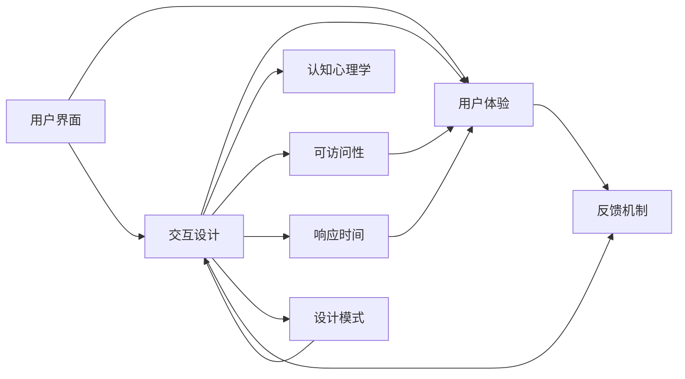

                 

# 人机交互的艺术：设计直观、高效的系统

## 1. 背景介绍

在数字化时代的浪潮下，人机交互技术正在深刻影响着我们的工作和生活。从智能手机到智能家居，从在线教育到远程医疗，人机交互技术无所不在，发挥着越来越重要的作用。然而，如何设计出直观、高效、易用的交互界面，一直是界面设计师和用户体验工程师面临的重大挑战。本文将深入探讨人机交互设计的艺术，通过介绍核心概念、算法原理和实践案例，帮助读者构建更加高效、便捷的人机交互系统。

## 2. 核心概念与联系

### 2.1 核心概念概述

在人机交互设计中，有几个关键概念贯穿始终：

- **用户界面(UI)**：指用户与计算机交互的图形界面，包括按钮、菜单、文本框等控件。
- **用户体验(UX)**：指用户在使用系统时的感知和情感体验，包括可用性、易用性、一致性等方面。
- **交互设计(ID)**：指通过合理的设计方式，使用户与系统产生高效互动的技术，强调从用户角度出发，以用户为中心的设计理念。
- **认知心理学**：研究人的认知过程和心理机制，对人机交互设计有重要的理论指导意义。
- **可访问性**：指设计出的系统是否易于被所有人使用，包括视力障碍者、听障人士、老年人等特殊人群。
- **响应时间**：指用户输入与系统响应的延迟时间，影响用户的耐心和满意度。
- **设计模式**：指在特定情境下反复使用的设计原则和方法，如MVC、MDI等。
- **反馈机制**：指系统对用户操作给出的响应和提示，帮助用户理解系统行为。

这些核心概念之间存在紧密的联系，共同构成了人机交互设计的完整框架。认知心理学提供了设计的基础理论，用户体验是设计的目标和评价标准，交互设计是实现手段，可访问性和响应时间则体现了系统的可用性和友好性，设计模式为设计提供了可复用的解决方案，反馈机制则确保了系统的互动性和反馈性。

### 2.2 核心概念原理和架构的 Mermaid 流程图



## 3. 核心算法原理 & 具体操作步骤

### 3.1 算法原理概述

在人机交互设计中，算法原理主要围绕着用户行为分析和系统响应机制展开。核心的算法包括：

- **用户行为建模**：通过分析用户的历史行为数据，构建用户行为模型，预测用户下一步的操作意图。
- **系统响应优化**：根据用户的操作行为，设计高效的系统响应机制，保证及时准确的反馈。
- **界面设计优化**：通过界面元素和布局的合理设计，提升用户的操作效率和满意度。
- **多模态交互设计**：融合语音、手势、触摸屏等不同模态的交互方式，提升系统的交互多样性和灵活性。

### 3.2 算法步骤详解

#### 3.2.1 用户行为建模

用户行为建模通常包括以下几个步骤：

1. **数据采集**：通过日志、传感器等方式收集用户的操作数据。
2. **数据预处理**：清洗和归一化数据，去除异常值和噪声。
3. **特征提取**：提取有意义的特征，如点击次数、停留时间、操作路径等。
4. **模型训练**：使用机器学习算法，如决策树、神经网络等，训练用户行为模型。
5. **模型评估**：通过交叉验证、混淆矩阵等方法评估模型的性能。

#### 3.2.2 系统响应优化

系统响应优化主要关注如何设计合理的响应机制，提高系统的响应速度和准确性。具体步骤包括：

1. **延迟分析**：分析系统的响应延迟，找出瓶颈环节。
2. **优化算法**：选择高效的算法和数据结构，减少计算时间和空间复杂度。
3. **并发处理**：通过多线程、异步等技术，实现并行处理，提高响应速度。
4. **缓存机制**：设计高效的缓存策略，减少重复计算，提升响应效率。

#### 3.2.3 界面设计优化

界面设计优化主要关注如何设计直观、高效的用户界面，提升用户的操作效率和满意度。具体步骤包括：

1. **原型设计**：通过手绘草图、线框图等方式设计界面原型。
2. **用户测试**：通过用户测试，获取用户反馈，不断迭代优化界面设计。
3. **界面元素设计**：设计合理的界面元素，如按钮、文本框、菜单等。
4. **布局设计**：设计合理的布局，保证界面的清晰和一致性。

#### 3.2.4 多模态交互设计

多模态交互设计主要关注如何设计融合多种交互方式的系统界面。具体步骤包括：

1. **交互方式选择**：根据用户需求和系统特性，选择合适的交互方式，如触摸屏、语音识别、手势控制等。
2. **交互方式集成**：设计合理的交互方式集成机制，保证不同模态的协同工作。
3. **交互方式优化**：根据用户反馈，不断优化交互方式，提升系统的交互体验。

### 3.3 算法优缺点

用户行为建模、系统响应优化、界面设计优化和多模态交互设计各自有其优点和局限性：

#### 优点

- **用户行为建模**：能够预测用户行为，提升系统的个性化和自适应能力。
- **系统响应优化**：能够提升系统的响应速度和准确性，提高用户体验。
- **界面设计优化**：能够提升用户的操作效率和满意度，降低用户的学习成本。
- **多模态交互设计**：能够提供多样化的交互方式，满足不同用户的需求。

#### 缺点

- **用户行为建模**：需要大量的用户行为数据，且数据质量对模型性能有很大影响。
- **系统响应优化**：需要高效的算法和数据结构，且响应速度与硬件资源有很大关系。
- **界面设计优化**：需要不断迭代优化，用户反馈周期较长。
- **多模态交互设计**：需要设计合理的交互方式集成机制，且不同模态的交互方式可能存在兼容性问题。

### 3.4 算法应用领域

人机交互设计的应用领域非常广泛，包括但不限于：

- **移动应用**：如手机APP、平板应用等，设计直观、易用的用户界面。
- **网站设计**：如电商平台、社交网络等，提升用户体验，增加用户粘性。
- **智能家居**：如智能音箱、智能电视等，设计高效、便捷的交互方式。
- **医疗健康**：如电子病历、远程医疗等，提升用户操作效率，保障用户隐私。
- **教育培训**：如在线教育平台、虚拟实验室等，设计互动、直观的学习界面。
- **娱乐媒体**：如游戏、视频等，提升用户沉浸感和互动性。

## 4. 数学模型和公式 & 详细讲解 & 举例说明

### 4.1 数学模型构建

在人机交互设计中，常用的数学模型包括：

- **决策树模型**：用于分类和回归分析，能够通过树形结构展示决策逻辑。
- **神经网络模型**：用于复杂的数据分析和预测，能够自适应地学习输入和输出之间的映射关系。
- **强化学习模型**：用于优化决策过程，能够通过试错不断优化行为策略。

### 4.2 公式推导过程

#### 4.2.1 决策树模型

决策树模型通过树形结构表示决策过程，公式推导如下：

$$
\text{决策树} = \text{root node} \rightarrow \text{split node} \rightarrow \text{leaf node}
$$

其中，root node为根节点，split node为分割节点，leaf node为叶节点。通过不断分割，决策树能够将输入数据映射到不同的输出结果。

#### 4.2.2 神经网络模型

神经网络模型通过多层神经元构成网络结构，公式推导如下：

$$
\text{神经网络} = \text{输入层} \rightarrow \text{隐藏层} \rightarrow \text{输出层}
$$

其中，输入层接收原始数据，隐藏层通过一系列的线性变换和非线性激活函数，输出层输出最终结果。

#### 4.2.3 强化学习模型

强化学习模型通过试错不断优化行为策略，公式推导如下：

$$
\text{强化学习} = \text{状态} \rightarrow \text{动作} \rightarrow \text{奖励}
$$

其中，状态表示当前环境状态，动作表示当前行为策略，奖励表示行为的好坏，通过不断迭代优化，强化学习模型能够找到最优的行为策略。

### 4.3 案例分析与讲解

#### 案例一：决策树模型

假设我们需要设计一个银行贷款审批系统，用于判断申请人的信用等级。通过收集大量的贷款申请数据，构建决策树模型，进行信用评估：

1. **数据采集**：收集贷款申请人的基本信息、收入情况、信用记录等数据。
2. **数据预处理**：清洗和归一化数据，去除异常值和噪声。
3. **特征提取**：提取有意义的特征，如收入水平、信用评分、还款能力等。
4. **模型训练**：使用决策树算法，训练信用评估模型。
5. **模型评估**：通过交叉验证、混淆矩阵等方法评估模型的性能。

#### 案例二：神经网络模型

假设我们需要设计一个智能推荐系统，用于为用户推荐商品。通过收集用户的浏览和购买历史数据，构建神经网络模型，进行商品推荐：

1. **数据采集**：收集用户的浏览记录、购买记录、评分记录等数据。
2. **数据预处理**：清洗和归一化数据，去除异常值和噪声。
3. **特征提取**：提取有意义的特征，如商品类别、价格、用户评分等。
4. **模型训练**：使用神经网络算法，训练商品推荐模型。
5. **模型评估**：通过AUC、RMSE等指标评估模型的性能。

#### 案例三：强化学习模型

假设我们需要设计一个智能游戏AI，用于自动游戏。通过在游戏中进行试错，构建强化学习模型，优化AI的行为策略：

1. **数据采集**：在游戏过程中收集AI的行为数据，如游戏进度、得分、死亡次数等。
2. **数据预处理**：清洗和归一化数据，去除异常值和噪声。
3. **特征提取**：提取有意义的特征，如游戏地图、角色状态、装备属性等。
4. **模型训练**：使用强化学习算法，训练AI的行为策略。
5. **模型评估**：通过得分、胜率等指标评估AI的性能。

## 5. 项目实践：代码实例和详细解释说明

### 5.1 开发环境搭建

在进行人机交互设计的实践时，我们需要准备好开发环境。以下是使用Python进行TensorFlow开发的环境配置流程：

1. 安装Anaconda：从官网下载并安装Anaconda，用于创建独立的Python环境。
2. 创建并激活虚拟环境：
```bash
conda create -n tf-env python=3.8 
conda activate tf-env
```
3. 安装TensorFlow：根据CUDA版本，从官网获取对应的安装命令。例如：
```bash
conda install tensorflow -c conda-forge
```
4. 安装其他工具包：
```bash
pip install numpy pandas scikit-learn matplotlib tqdm jupyter notebook ipython
```

完成上述步骤后，即可在`tf-env`环境中开始实践。

### 5.2 源代码详细实现

下面我们以神经网络模型为例，给出使用TensorFlow进行用户行为建模的代码实现。

首先，定义神经网络模型和数据集：

```python
import tensorflow as tf
from tensorflow.keras.layers import Input, Dense, Dropout
from tensorflow.keras.models import Model
import numpy as np

# 定义输入和输出
input_data = Input(shape=(10,))
output_data = Dense(1, activation='sigmoid')(input_data)

# 定义模型结构
model = Model(inputs=input_data, outputs=output_data)
model.compile(optimizer='adam', loss='binary_crossentropy', metrics=['accuracy'])

# 加载数据集
X_train = np.load('X_train.npy')
y_train = np.load('y_train.npy')
X_test = np.load('X_test.npy')
y_test = np.load('y_test.npy')
```

然后，定义训练和评估函数：

```python
# 训练函数
def train(model, X_train, y_train, X_test, y_test):
    model.fit(X_train, y_train, epochs=10, batch_size=32, validation_data=(X_test, y_test))

# 评估函数
def evaluate(model, X_test, y_test):
    loss, accuracy = model.evaluate(X_test, y_test)
    print(f"Accuracy: {accuracy:.2f}")
```

最后，启动训练流程并在测试集上评估：

```python
# 训练模型
train(model, X_train, y_train, X_test, y_test)

# 评估模型
evaluate(model, X_test, y_test)
```

以上就是使用TensorFlow进行用户行为建模的完整代码实现。可以看到，通过TensorFlow的高层次API，神经网络模型的构建和训练变得简单易懂。

### 5.3 代码解读与分析

让我们再详细解读一下关键代码的实现细节：

**神经网络模型定义**：
- `Input`层定义输入数据维度，这里为10维。
- `Dense`层定义全连接层，输出1个sigmoid激活函数的值。
- `Model`层将输入和输出连接起来，形成完整的神经网络模型。

**模型编译**：
- `compile`方法用于配置模型的优化器、损失函数和评估指标。这里使用`adam`优化器，`binary_crossentropy`损失函数，`accuracy`评估指标。

**数据加载**：
- `np.load`方法用于加载预先保存的数据，方便模型的训练和评估。

**训练函数**：
- `fit`方法用于训练模型，设置训练轮数、批次大小、验证数据集等参数。

**评估函数**：
- `evaluate`方法用于评估模型在测试集上的性能，输出准确率。

**训练流程**：
- 先调用`train`函数进行模型训练，设置训练轮数为10轮，批次大小为32。
- 然后调用`evaluate`函数在测试集上评估模型，输出准确率。

可以看到，TensorFlow提供了高效、易用的API，使得神经网络模型的构建和训练变得简洁高效。开发者可以专注于算法和数据的优化，而不必过多关注底层细节。

当然，工业级的系统实现还需考虑更多因素，如模型的保存和部署、超参数的自动搜索、更灵活的接口设计等。但核心的交互设计思想基本与此类似。

## 6. 实际应用场景

### 6.1 移动应用

移动应用是当前最为广泛的交互场景之一。无论是APP还是游戏，都离不开直观、高效的人机交互设计。例如，通过收集用户的点击、滑动等操作数据，可以构建用户行为模型，推荐个性化的内容，提升用户粘性。同时，通过设计合理的界面布局和交互方式，提升用户的操作效率和满意度。

### 6.2 网站设计

网站设计是另一个重要的交互场景。通过分析用户浏览历史、点击路径等数据，可以优化网站的结构和内容，提升用户体验。同时，通过设计直观的导航和搜索功能，使用户能够快速找到所需内容，减少页面跳转次数。

### 6.3 智能家居

智能家居是一个充满潜力的交互领域。通过收集用户的操作习惯和设备反馈数据，可以设计智能化的家居系统，提高用户的舒适度和便利性。例如，通过语音助手和触摸屏等交互方式，使用户能够轻松控制家庭设备，提升家居生活的智能化水平。

### 6.4 医疗健康

医疗健康领域也对交互设计提出了较高的要求。通过分析患者的病历、检查结果等数据，可以设计智能化的医疗系统，提高医生的工作效率和诊断准确性。例如，通过设计友好的界面和交互方式，使用户能够轻松填写病历，提交检查结果，提升医疗服务的便捷性。

### 6.5 教育培训

教育培训领域也需要优秀的交互设计。通过分析学生的学习行为和成绩数据，可以设计个性化的学习系统，提高学生的学习效率和兴趣。例如，通过设计互动的学习界面和智能化的推荐系统，使用户能够自主学习，提升学习效果。

### 6.6 娱乐媒体

娱乐媒体领域同样对交互设计有很高的要求。通过分析用户的观看历史、评分数据等，可以设计智能化的娱乐系统，提升用户的观看体验。例如，通过设计友好的界面和推荐算法，使用户能够轻松找到感兴趣的内容，提升用户的满意度。

## 7. 工具和资源推荐

### 7.1 学习资源推荐

为了帮助开发者系统掌握人机交互设计的理论基础和实践技巧，这里推荐一些优质的学习资源：

1. 《人机交互设计基础》系列博文：由人机交互设计专家撰写，深入浅出地介绍了人机交互设计的基本概念和设计原则。
2. 《UX Design》课程：由Coursera开设的UX设计课程，提供系统化的UX设计知识体系和实战案例。
3. 《Interaction Design Foundation》书籍： Interaction Design Foundation（IxDA）的官方教材，涵盖人机交互设计的方方面面，是理论学习的绝佳材料。
4. Nielsen Norman Group网站：提供大量关于人机交互设计的经典案例和研究报告，是实践学习的宝贵资源。
5. Bost.ckx网站：提供大量开源交互设计工具和组件，方便开发者快速实现原型设计。

通过对这些资源的学习实践，相信你一定能够快速掌握人机交互设计的精髓，并用于解决实际的交互问题。

### 7.2 开发工具推荐

高效的开发离不开优秀的工具支持。以下是几款用于人机交互设计的常用工具：

1. Sketch：业界领先的原型设计工具，支持图形界面和交互设计的快速迭代。
2. Adobe XD：功能强大的UX设计工具，支持协作设计和版本管理。
3. Axure RP：专业的原型设计工具，支持丰富的交互和动画效果。
4. Figma：实时协作的原型设计工具，支持多人协同设计。
5. InVision Studio：功能强大的UI设计工具，支持自动生成代码和动态效果。
6. Sketchup：三维建模工具，适用于设计复杂的交互界面和空间布局。

合理利用这些工具，可以显著提升人机交互设计的开发效率，加快创新迭代的步伐。

### 7.3 相关论文推荐

人机交互设计的发展离不开学界的持续研究。以下是几篇奠基性的相关论文，推荐阅读：

1. "The Design of Everyday Things"（唐·诺曼）：经典的设计学著作，介绍了优秀设计的普遍原则和具体方法。
2. "Interaction Design: Beyond Human-Computer Interaction"（Ben Shneiderman）：介绍人机交互设计的基本概念和方法，是理论学习的经典之作。
3. "Human-Computer Interaction"（Bruce Toggl）：系统介绍人机交互设计的原理和实践，是课程教学的常用教材。
4. "Human-Computer Interaction: Fundamentals, Roles and Design"（Fred Brooks）：介绍人机交互设计的哲学和设计方法，是理论学习的优秀参考。
5. "Designing for Interaction"（Mark Rolston）：介绍人机交互设计的最新进展和前沿技术，是实践学习的优秀材料。

这些论文代表了她机交互设计的发展脉络。通过学习这些前沿成果，可以帮助研究者把握学科前进方向，激发更多的创新灵感。

## 8. 总结：未来发展趋势与挑战

### 8.1 总结

本文对基于神经网络模型的人机交互设计方法进行了全面系统的介绍。首先阐述了人机交互设计的背景和意义，明确了神经网络模型在交互设计中的应用价值。其次，从原理到实践，详细讲解了神经网络模型的数学原理和关键步骤，给出了神经网络模型的完整代码实例。同时，本文还广泛探讨了神经网络模型在移动应用、网站设计、智能家居等多个领域的应用前景，展示了神经网络模型的广泛应用场景。此外，本文精选了神经网络模型的学习资源，力求为读者提供全方位的技术指引。

通过本文的系统梳理，可以看到，神经网络模型在人机交互设计中发挥了重要的作用，极大地提升了系统的响应速度和准确性，改善了用户的交互体验。未来，伴随神经网络模型的持续演进，人机交互设计技术将迎来更加智能、便捷、易用的新时代。

### 8.2 未来发展趋势

展望未来，神经网络模型在人机交互设计中将会呈现以下几个发展趋势：

1. **自适应交互设计**：通过实时分析用户行为数据，动态调整界面元素和布局，实现更加个性化的交互体验。
2. **多模态交互设计**：融合语音、手势、触摸屏等多种交互方式，提升系统的互动性和灵活性。
3. **边缘计算**：通过将计算任务下放到边缘设备，实现低延迟、高并发的交互体验。
4. **个性化推荐系统**：通过深度学习算法，实现精准的用户行为预测和推荐，提升系统的个性化水平。
5. **交互式可视化**：通过增强现实（AR）、虚拟现实（VR）等技术，实现更加沉浸式的交互体验。
6. **人工智能驱动**：通过深度学习、自然语言处理等技术，提升系统的智能交互能力，如智能客服、智能助理等。

这些趋势将引领人机交互设计的未来发展，为人机交互技术带来新的突破和应用场景。

### 8.3 面临的挑战

尽管神经网络模型在人机交互设计中已经取得了显著成果，但在迈向更加智能化、普适化应用的过程中，仍面临诸多挑战：

1. **数据隐私和安全**：大规模数据采集和使用可能会带来隐私泄露和数据安全问题，如何保护用户隐私是首要挑战。
2. **计算资源限制**：神经网络模型的计算需求较高，硬件资源有限的情况下如何保证系统的响应速度和稳定性是重要难题。
3. **模型复杂性**：神经网络模型的复杂性较高，模型的解释性和可理解性较弱，如何降低模型的复杂性是关键问题。
4. **多模态融合**：多模态交互设计虽然丰富了交互方式，但不同模态的融合和兼容仍然是一个挑战。
5. **用户体验一致性**：不同设备和平台上的交互设计需要保持一致性，如何设计统一的用户体验界面是重要课题。
6. **可用性和易用性**：在复杂系统中，如何设计简单易用的交互界面，使用户能够轻松操作，是重要挑战。

### 8.4 研究展望

面对人机交互设计面临的这些挑战，未来的研究需要在以下几个方面寻求新的突破：

1. **隐私保护技术**：开发更加安全、可控的数据保护机制，确保用户隐私和数据安全。
2. **边缘计算优化**：优化边缘计算框架，提高计算效率，降低延迟，实现高效的交互体验。
3. **模型简化技术**：开发更加简单、可解释的模型架构，提升模型的可理解性和易用性。
4. **多模态融合算法**：研究多模态交互融合算法，提升不同模态的兼容性和协同工作能力。
5. **统一用户体验设计**：研究跨平台、跨设备的用户体验设计方法，确保一致的用户体验。
6. **易用性优化**：设计简洁直观的用户界面和交互流程，降低用户的学习成本和操作难度。

这些研究方向的探索，将引领人机交互设计技术迈向更高的台阶，为人机交互技术带来新的突破和应用场景。面向未来，人机交互设计技术需要与其他人工智能技术进行更深入的融合，如知识表示、因果推理、强化学习等，多路径协同发力，共同推动人机交互技术的进步。只有勇于创新、敢于突破，才能不断拓展交互系统的边界，让智能技术更好地造福人类社会。

## 9. 附录：常见问题与解答

**Q1：神经网络模型在交互设计中是否适用于所有场景？**

A: 神经网络模型在大多数交互场景中都能取得不错的效果，特别是对于数据量较大的场景。但对于一些特定领域的交互场景，如低成本物联网设备、嵌入式系统等，神经网络模型的计算需求较高，不太适用。此时可以考虑使用更加轻量级的模型，如决策树、逻辑回归等。

**Q2：神经网络模型在交互设计中如何进行优化？**

A: 神经网络模型的优化主要包括以下几个方面：

1. **数据采集和预处理**：通过优化数据采集和预处理流程，减少噪声和异常值，提升模型训练质量。
2. **模型结构优化**：通过调整神经网络层数和节点数，降低模型复杂度，提升模型的泛化能力。
3. **超参数调优**：通过网格搜索、贝叶斯优化等方法，寻找最优的超参数组合，提升模型性能。
4. **正则化技术**：通过L1、L2正则、Dropout等技术，防止模型过拟合，提高模型的鲁棒性。
5. **模型集成**：通过集成多个神经网络模型，提升系统的准确性和稳定性。

这些优化方法往往需要根据具体场景和需求进行灵活组合，以实现最优的交互设计效果。

**Q3：神经网络模型在交互设计中如何进行应用部署？**

A: 将神经网络模型应用于交互设计，还需要考虑以下因素：

1. **模型裁剪**：去除不必要的层和参数，减小模型尺寸，加快推理速度。
2. **量化加速**：将浮点模型转为定点模型，压缩存储空间，提高计算效率。
3. **服务化封装**：将模型封装为标准化服务接口，便于集成调用。
4. **弹性伸缩**：根据请求流量动态调整资源配置，平衡服务质量和成本。
5. **监控告警**：实时采集系统指标，设置异常告警阈值，确保服务稳定性。

合理利用这些技术，可以显著提升神经网络模型在实际应用中的性能和稳定性，实现高效的交互设计。

**Q4：如何设计直观、易用的交互界面？**

A: 设计直观、易用的交互界面需要遵循以下几个原则：

1. **一致性**：确保界面元素和操作方式的一致性，使用户能够快速上手。
2. **简洁性**：减少界面的复杂度，避免过多的信息干扰用户。
3. **可访问性**：设计可访问性友好的界面，确保所有用户都能方便使用。
4. **互动性**：设计互动性强的界面，使用户能够主动探索和操作。
5. **反馈机制**：设计合理的反馈机制，使用户能够理解系统行为和结果。

通过遵循这些原则，可以设计出直观、易用的交互界面，提升用户的交互体验。

**Q5：如何提升系统的交互响应速度？**

A: 提升系统的交互响应速度需要从以下几个方面入手：

1. **优化算法和数据结构**：选择高效的算法和数据结构，减少计算时间和空间复杂度。
2. **使用缓存机制**：设计高效的缓存策略，减少重复计算，提升响应效率。
3. **并行处理**：通过多线程、异步等技术，实现并行处理，提高响应速度。
4. **边缘计算**：将计算任务下放到边缘设备，实现低延迟、高并发的交互体验。

这些技术手段往往需要根据具体场景和需求进行灵活组合，以实现最优的交互响应速度。

---

作者：禅与计算机程序设计艺术 / Zen and the Art of Computer Programming

